======================================================================================
巴漢詞典 Concise Pali-English Dictionary A.P. Buddhadatta Mahāthera 原著 大馬比丘 漢譯
======================================================================================

.. raw:: html

   

巴漢詞典

Concise Pali-English Dictionary

A.P. Buddhadatta Mahāthera 原著

大馬比丘 漢譯

~~~~~~~~~~~~~~~~~~~~~~~~~~~~~~~~~~~~~~~~~~~~~

巴漢詞典 目錄

+--------------------------------------+--------------------------------------+
| `序 <#preface>`__                    | `Ṇ <#n4>`__\ ······················· |
|                                      | ···········151                       |
| `說明 <#des>`__\ ····················· |                                    |
| ············                         | `T <#t>`__\ ························ |
|                                      | ···········151                       |
| `本詞典略語表 <#a00>`__\ ················· |                                |
|                                      | `Th <#th>`__\ ······················ |
|                                      | ············161                      |
| `A <#a>`__\ ························ |                                      |
| ··············1                      | `D <#d>`__\ ························ |
|                                      | ···········179                       |
| `Ā <#aa>`__\ ······················· |                                      |
| ·············51                      | `Dh <#dh>`__\ ······················ |
|                                      | ············175                      |
| `I <#i>`__\ ························ |                                      |
| ···········64                        | `N <#n>`__\ ························ |
|                                      | ···········179                       |
| `Ī                                   |                                      |
|  <#ii>`__\ ························· | `P <#p>`__\ ························ |
| ··········66                         | ···········198                       |
|                                      |                                      |
| `U <#u>`__\ ························ | `Ph <#ph>`__\ ······················ |
| ············67                       | ···········260                       |
|                                      |                                      |
| `Ū                                   | `B <#b>`__\ ························ |
|  <#uu>`__\ ························· | ···········262                       |
| ··········86                         |                                      |
|                                      | `Bh <#bh>`__\ ······················ |
| `E <#e>`__\ ························ | ···········267                       |
| ···········87                        |                                      |
|                                      | `M <#m>`__\ ························ |
| `O <#o>`__\ ························ | ··········274                        |
| ············89                       |                                      |
|                                      | `Y <#y>`__\ ························ |
| `K <#k>`__\ ························ | ·········289                         |
| ············95                       |                                      |
|                                      | `R <#r>`__\ ························ |
| `Kh <#kh>`__\ ······················ | ···········293                       |
| ············117                      |                                      |
|                                      | `L <#l>`__\ ························ |
| `G <#g>`__\ ························ | ···········299                       |
| ·········122                         |                                      |
|                                      | `V <#v>`__\ ························ |
| `Gh <#gh>`__\ ······················ | ···········305                       |
| ············130                      |                                      |
|                                      | `S <#s>`__\ ························ |
| `Ṅ <#n0>`__\ ······················· | ···········341                       |
| ············132                      |                                      |
|                                      | `H <#h>`__\ ························ |
| `C <#c>`__\ ························ | ··········392                        |
| ···········132                       |                                      |
|                                      | `Ḷ <#l1>`__\ ······················· |
| `Ch <#ch>`__\ ······················ | ············396                      |
| ············139                      |                                      |
|                                      | `Ḷh <#l1h>`__\ ····················· |
| `J <#j>`__\ ························ | ············397                      |
| ············142                      |                                      |
|                                      | `Ṁ <#m1>`__\ ······················· |
| `Jh <#jh>`__\ ······················ | ···········397                       |
| ············148                      |                                      |
|                                      | `二十七宿 <#a27>`__                  |
| `Ñ <#n00>`__\ ······················ |                                      |
| ·············149                     | `古印度月份巴利文名稱 <#india>`__    |
|                                      |                                      |
| `Ṭ <#t1>`__\ ······················· | `長度 <#long>`__                     |
| ············149                      |                                      |
|                                      |                                      |
| `Ṭh <#t1h>`__\ ····················· |                                      |
| ·············149                     | ( 頁碼新編，與原 pdf 檔不同 )        |
|                                      |                                      |
| `Ḍ <#d1>`__\ ······················· |                                      |
| ············150                      |                                      |
|                                      |                                      |
| `Ḍh <#d1h>`__\ ····················· |                                      |
| ·············151                     |                                      |
|                                      |                                      |
|                                      |                                      |
+--------------------------------------+--------------------------------------+

►►\ `缺pp.202-213 Padhāvati~Parivajjeti <#a202>`__ ◄ ◄

錄自：http://www.saigon.com/~anson/ebud/dict-pe/dictpe-17-p.htm

.. raw:: html

   

.. raw:: html

   

本詞典略語表

+--------------------------------------+--------------------------------------+
| 【形】 形容詞 (adjetive)             | 【過完】（完全）過去時態動詞         |
|                                      |                                      |
| 【獨】 獨立詞                        | (preterit verb)                      |
| (absolutive)(ger.﹐gerund連續體、絕對體) |                                  |
|                                      | 【潛】 潛在語氣 (potenrial           |
|                                      | participle)                          |
| 【副】 副詞 (adverb)                 |                                      |
|                                      | 【三】 有三個性詞                    |
| 【過】 （不定）過去式 (aorist)       |  (of the three genders)              |
|                                      |                                      |
| 【合】 複合詞 (compounds)            | 【代】 代詞 (pronoun)                |
|                                      |                                      |
| 【連】 連詞 (conjunction)            | 【單】 單數 (singular)               |
|                                      |                                      |
| 【使】 祈使語氣 (causative)          | 【複】 複數 (plural)                 |
|                                      |                                      |
| 【派】 派生動詞                      | 【壹】 第一人稱 (first person)       |
|   (denominative verb)                |                                      |
|                                      | 【貳】 第二人稱 (second person)      |
| 【祈】 祈願動詞 (optative)           |                                      |
|                                      | 【三】 第三人稱 (third person)       |
| 【陰】 陰性詞 (feminine)             |                                      |
|                                      | 【主】 主格 (nominative)             |
| 【動名】 動名詞 (gerund)             |                                      |
|                                      | 【賓】 賓格 (accusative受格、業格)   |
| 【歎】 感歎詞 (interjection)         |                                      |
|                                      | 【呼】 呼格 (vocative)               |
| 【無】 無格式變化詞                  |                                      |
|                                      | 【工】 工具格 (instrumental具格)     |
| (indeclinable)                       |                                      |
|                                      | 【與】 與事格                        |
| 【不】 不定詞 (infinitive)           | (dative﹐與格、為ㄨㄟˋ格)            |
|                                      |                                      |
| 【陽】 陽性詞 (masculine)            | 【來】 來源格 (ablative從格)         |
|                                      |                                      |
| 【中】 中性詞 (neuter)               | 【領】 領屬格 (genitive屬格)         |
|                                      |                                      |
| 【擬】 擬聲構詞                      | 【處】 處所格 (locative處格)         |
|  (onometopoetie verb)                |                                      |
|                                      | 【分】 分詞 (participle)             |
| 【被】 被動詞 (passive)              |                                      |
|                                      | 【現】 現在式 (present)              |
| 【過分】 過去分詞                    |                                      |
|  (past participle)                   | 【未】 未來式 (future)               |
|                                      |                                      |
| 【現分】 現在分詞                    | 【動】 動詞 (verb)                   |
|   (peresent participle)              |                                      |
|                                      | 【名】 名詞 (noun)                   |
| 【介】 介詞 (preposition)            |                                      |
|                                      | 【疑代】疑問代(名)詞                 |
|                                      |                                      |
|                                      | (interrogative Pronouns)             |
+--------------------------------------+--------------------------------------+

凡 例

 略語注明：在一個【 】中，有時會有好幾個略語注明；例如：

【潛，壹，單】，即是指那個詞是潛在語氣，第一人稱，單數。

(UTF-8 字型)

(編按：藍字，經「法雨道場」訂正，補充。2005.4.)

 

版權所有 翻印贈送 不必問過 隨意分享

.. raw:: html

   

.. raw:: html

   

序

 

在漢語界的南傳佛教裡，若想要學習巴利文，要找一本巴利語法課本實在很難；那要覓本巴漢詞典更不用說。爲了大家和自己在學習巴利語法上的方便，本納盡所能將大長者
A.P. Buddhadatta Mahāthera
的簡略巴英詞典翻譯過來。希望本詞典對你學習巴利語法上有所幫助。

本納想借此向所有出錢出力的佛教徒表示感激。尤其是黃文華居士，由於本納沒有連接網際托他上網尋覓資料，聽說他爲了這些資料就時常漏夜上網至淩晨，真是難得。黃順明居士經常載本納到處去覓資料，也帶本納到他家去上網找資料。他並充當攝影師到處去拍攝植物照相。何宗衛居士也被托過尋些植物資料。曾敏懷居士、蔡永申居士和蔡平輝居士時常充當攝影師到處去拍攝植物照相。本納的電腦器材大多數都是一群
Upekkha
佛友所提供的。何秋燕居士也出了不小的數目來提升本納的電腦。尤其是在 2004
年本納的電腦器材大多數由腦環桐電腦資訊培育中心的陳淑妘居士所提供，不是免費，就是底價。星期三佈施組的佛友在幕後出錢添加電腦器材。在很久以前，本納開始翻譯這本詞典當時，曾托鄭美麗居士、郭明仁居士和他們的好友幫助翻譯；鄭美麗居士和郭明仁居士也幫助翻譯了不少。林昌賦居士經常下班後載本納到他的騰達電腦有限公司去上網尋找資料。黃發寶居士贈送他的電子照相機方便到處去攝影資料照相。何亞炎居士贈送一副電池與充電器。張森榮居士提供〈中國古星圖〉使本詞典能取得完整的二十八星宿資料(編按：本附加資料站占份量，刪除)。浮羅山背的亞華居士也用他的電子照相機與手提電腦幫忙錄取一些植物資料(編按：刪除)。還有很多居士好友在幫助攝取資料和器材，在此感激大家的幫忙，才能完成這本詞典。本詞典有錄取從網頁取得的照相，那些照相的版權乃是他人所擁有的；爲了方便大家容易明白植物與星宿的名字，在此借助他們的照相，版權還是他們的。未向他們申請許可，已在此應用他們的照相，希望他們能夠體諒，而允許使用他們的照相。

 

(馬來西亞)大馬比丘

2004.10.27

.. raw:: html

   

.. raw:: html

   

說 明

在這本詞典裡，巴利語的動詞是以第三人稱時態的詞形。若【過】和【過分】的詞形有異，本詞典都有提供兩者的詞形。當【過分】與動詞本身有著不同的意義，或難以分辨其詞素的來源時，本詞典也會另外提供【過分】的意義。若普通的【獨】詞綴是
tvā 和 tvāna 在此就省略，若有特別的詞綴，如：nikkhamma, pahāya, ucchijja
等時，就會另外提供其詞形；請別誤會這些詞素就沒有 tvā 和 tvāna
詞綴的詞形。

P.T.S. 的巴利語－英語詞典中有一些詞素的詞尾是輔音字母的，例： satthar,
pitar,
Brahman。由於沒有一位巴利語文法家曾經採用這類寫法，在此就不跟這樣詞根寫法。所有的詞根的詞尾都是母音或鼻音。

詞尾是 ta 的次要派生詞都包括在【陰】裡。它等也有【中】的詞尾是 tta 和
ttana 的；本詞典爲了省略一個詞只提供一種詞形，即 ta 或 tta 而已。

詞尾是 i 的【陽】名詞的【陰】詞素的詞尾是 inī，例： hatthi —
hatthinī。許多詞尾是 a 的【陽】名詞的【陰】詞素的詞尾是 ī，而並不是
inī，例： kāka, miga, nāga 等。

+--------------------------------------+--------------------------------------+
| 【陽】                               | 【陰】                               |
+--------------------------------------+--------------------------------------+
| kāka                                 | kākī                                 |
+--------------------------------------+--------------------------------------+
| miga                                 | migī                                 |
+--------------------------------------+--------------------------------------+
| nāga                                 | nāgī                                 |
+--------------------------------------+--------------------------------------+

 

有一些詞尾是 a 的【陽】名詞的【陰】詞素的詞尾是 ā 或 ānī。

+--------------------------------------+--------------------------------------+
| 【陽】                               | 【陰】                               |
+--------------------------------------+--------------------------------------+
| khattiya                             | khattiyā; khattiyānī                 |
+--------------------------------------+--------------------------------------+
| mātula                               | mātulānī                             |
+--------------------------------------+--------------------------------------+

 

詞尾是 vantu 和 mantu 詞形的形容詞的【陰】詞素的構型是以 ī 替換
u，有時尾碼中的 n 會被省略。

.. raw:: html

   

.. raw:: html

   

 

+--------------------------------------+--------------------------------------+
| 【陽】                               | 【陰】                               |
+--------------------------------------+--------------------------------------+
| gunavantu                            | gunavantī; gunavatī                  |
+--------------------------------------+--------------------------------------+
| satimantu                            | satimantī; satimatī                  |
+--------------------------------------+--------------------------------------+

 

【現分】有兩種詞形，一個詞尾是 nta，另一個是 māna。詞尾是 nta
的【陰】詞尾是以 ī 替換 a；而詞尾是 māna 的【陰】詞尾是以 ā 替換 a。

+--------------------------------------+--------------------------------------+
| 【陽】                               | 【陰】                               |
+--------------------------------------+--------------------------------------+
| gacchanta                            | gacchantī                            |
+--------------------------------------+--------------------------------------+
| pacamāna                             | pacamānā                             |
+--------------------------------------+--------------------------------------+

 

這些的【中】詞素跟【陽】的是相似的。

有些初步派生詞，如： dāyaka 的【陰】詞素的構型是以 ikā 替換 aka。

+--------------------------------------+--------------------------------------+
| 【陽】                               | 【陰】                               |
+--------------------------------------+--------------------------------------+
| dāyaka                               | dāyikā                               |
+--------------------------------------+--------------------------------------+
| ārocaka                              | ārocikā                              |
+--------------------------------------+--------------------------------------+
| pācaka                               | pācikā                               |
+--------------------------------------+--------------------------------------+

 

A. P. BUDDHADATTA

（大馬比丘 譯）

.. raw:: html

   

.. raw:: html

   

A                                                          

.. raw:: html

   

.. raw:: html

   

 

A, 巴利文字母表的羅馬化拼音第一個母音字母。發音好像漢語中去聲的 a 。

A-, 字首 ā 在雙子音之前的短化。例子：ā + kosati = akkosati;
名詞、形容詞和 分詞的否定字首。例子： na + kusala = akusala;
一些過去式和條件語氣的詞素的增加字首。例子： akāsi.

Akaṭa, akata, 【形】 1. 不做，不造作。2. 不是人造的。

Akataññū, 【形】 忘恩負義。

Akampiya, 【形】 固定的，堅固的。

Akaraṇa, 【中】 非行動。

Akaraṇīya, 【潛】 1. 不應該做的，不適合的。2.【中】 不合適的行動。

Akaronta, 【現分】 不做，不操作。

Akāca, 【形】 無瑕的，純潔。

Akamaka, 【形】 不願意。

Akāla, 【陽】 不適當的時間。 【形】 過時的。

Akāsi (karoti 的【過】)，做了，造作了，或運行了。

Akiriya, 【中】 非行動。~vāda, 【陽】業無果報的理論。

Akiñcana, 【形】 有所無。

Akilāsu, 【形】 不疲倦的，活躍的。

Akuṭila, 【形】正直的，誠實的，不彎曲的。

Akutobhaya, 【形】 諸方皆安全。

Akuppa, 【形】 堅定的，不爲所動。

Akusala, 【中】 1. 孽，罪。 2. 壞行爲。【形】 不善的。

Akovida, 【形】 不聰明的。

Akka, 【陽】 1. 太陽。 2. 牛角瓜（一種大灌木 (Calotropis Gigantea)，
具有白色和淡紫色的花，在夏威夷用作項圈和泰國用作花圈）。

Akkanta, akkamati 的【過分】 1. 踏過，踩過。 2. 抑制過。

Akkandati (ā + kand + a), 悲歎， 哭。~di, ~dana, 【過，中】悲歎。
Akkamati (ā + kam + a), 1. 行走或踏在。 2. 征服。~mi, ~mana,

【過，中】 1. 走或踏在。 2. 征服。

Akkuṭṭha, (akkosati 的【過分】)。

Akkocchi, (akkosati 的【過】)。

Akkosa, 【陽】 侮辱，臭駡，責備。~ka, 【陽】侮辱的人。

Akkosati (ā + kus + a), 臭駡，辱駡，責駡。akkosi, 【過】。akkositvā,
【獨】。

Akkha, 【中】 感覺器官。【陽】 1. 輪軸。 2. 骰子。 3. 紅果欖仁樹    
（東印度的一種重要的喬木 (Terminalia
belerica)，用其種仁可以榨油，從它的果實可提取染料和丹寧，從它的樹皮可提取樹膠）。
4. 等於廿格令的重量 (1.4 克)。 (akkha 【合】 例如： visālakkha,
sahassakkha 來自詞素 akkhi = 眼)。

Akkhaka, 【中】 鎖骨。

Akkhaṇa, 【陽】 不適當的時間。akkhaṇā, 【陰】 閃電。~vedhī,
【陽】射箭快如閃電，或所射出之箭只輕擦目標的箭手。

Akkhata,【形】 毫髮無傷地，不受傷，完美的。

Akkhadassa, 【陽】 法官，裁判員。

Akkhadhutta, 【形】好賭。【陽】 賭徒。

Akkhaya,【形】 不變的，永恒的，不變質的。 【中】 永恒的平靜。

Akkhara,【中】字母，音節。~phalaka,【陽】寫字的板。~samaya,【陽】
寫作和閱讀的科學。

Akkhāta, (akkhāti 的【過分】)。

Akkhāti (ā + khā + a), 宣佈，告訴，聲明。 akkhāsi, 【過】。

Akkhātu, akkhāyī,【陽】陳述的人，教士。

Akkhi,【中】 眼睛。~kūpa,【陽】眼窩。~tārā,【陰】瞳孔。
~dala,【中】眼瞼，眼皮。

Akkhitta,【形】沒被攪擾，丟掉。

Akkhobha,【形】不易受攪擾的。

Akkhobhinī, akkhohinī,【陰】 1. 一個有四十二個零的數位。 2. 一個擁有
109,350 個步兵、 65,610 個騎兵、21,870 個象兵和 21,870 個戰車的軍隊。

Akhetta,【中】不適當的地方，非(福)田。

Aga,【陽】 1. 山。2. 樹。

Agati,【陰】 1. 迷途。 2. 偏見。

Agada,【中】 藥。

Agaru, 【形】 1. 不重的。2. 不麻煩的。 【陽】 沈香（印度産的瑞香料沈香樹
(Aquilaria agallocha) 的芳香性的、樹脂質的木材，用作東方燒香的香料）。

Agalu,【陽】沈香。

Agādha,【形】 1. 非常深的。 2. 無支持者的。

Agāra,【中】 屋。【形】 住宅。

Agārika, agāriya,【形、中】俗人。 【陽】一家之主。

Agga,【形】 最高的，頂端。【陽】頂，端。~tā,【陰】 ~tta,【中】
前顯赫，給予社會中有突出表現者的獎勵。~phala,【中】 1.
第一次的種植收成。 2.
阿羅漢聖果的上果位。~magga,【陽】最高的解脫道。~mahesī,【陰】 皇后。

Aggañña,【形】被認爲是最高的或最重要的。

Aggala,【中】閂，門閂。

Aggi,【陽】 火。~kkhandha,【陽】火蘊，火海。~paricaraṇa,【中】奉火，拜
火。~sālā,【陰】火房，桑那浴室。~sikhā,【陰】火焰。~hutta,【中】火供。

Aggha,【陽】價，值。【中】寬待客人的義務。
~kāraka,【陽】評價者，估價者。

Agghaka, agghanaka,【形】（【合】） 有…價值的。

Agghati (aggh + a), 值得。 agghi, 【過】。

Agghāpana,【中】定價，估計。

agghāpanaka,【陽】估價者。

agghāpaniya,【中】 要被估計的。

Agghika, agghiya,【中】飾有紙帶花彩的木柱。

Agghiya,【中】寬待客人的義務。

Agha,【中】 1. 天空。 2. 傷心事，痛苦。 3. 罪惡，不幸。

Aṅka,【陽】 1.（人坐著時）大腿的朝上部分。 2.特徵，記號。3.數位。

Aṅkita, Aṅketi 的【過分】。

Aṅkura,【陽】幼苗， 嫩芽。

Aṅkusa,【陽】採果子或馴象用的帶鈎棍子，鈎桿。

Aṅketi (aki + e), 劃線標出，打烙印，寫上號數。 aṅkesi, 【過】。 aṅketvā,
【獨】。

Aṅga,【中】 1. 成分。2. 肢。 3.
質量。~paccaṅga,【中】大小肢。~rāga,【陽】
塗身的化妝品。~vijjā,【陰】手相或命相。

Aṅgajāta,【中】外生殖器，陰部。

Aṅgaṇa,【中】 1. 空地，院子。 2. 心意的污染。

Aṅgada,【中】臂鐲。

Aṅganā,【陰】 女人，婦女。

Aṅgāra,【陽】 【中】火炭，炭渣。在灰燼中繼續燃燒的一塊煤炭。

~kaṭātha, ~kapalla,【陽】裝煤渣或灰燼的平鍋。 ~kāsu,【陰】
一個充滿煤渣或灰燼的坑。 ~maṁsa,【中】火炭上烤的肉。
~aṅgika,【形】（【合】）擁有很多成分的。例如： duvaṅgika =
兩部分。由二個部份所組成。

Aṅgīrasa,【陽】輝煌者，佛陀。

Aṅguṭṭha,【陽】拇指，拇趾。

Aṅgula,【中】 一寸，一指寬。 【形】 （【合】） 很多指寬的數量。

Aṅguli,【陰】 手指，腳趾。 ~pabba,【中】 指節。
~muddā,【陰】圖章戒指，戒指。

Aṅgulīyaka,  Aṅguleyyaka,【中】 戒指。

Acala,【形】 不動的，不能動搖的。

Acira,【形】 最近的，新的。 aciraṁ, 【副】 近來，不久前。 ~ppabhā,【陰】
閃電。

Acetana,【形】 無感覺的，無機的。

Acela,【形】無衣服的，裸體的。 ~ka,【陽】裸體的修行者。

Accagā (ati + gam 的【過特】), 超越了，克服了。

Accanā,【陰】 1. 祭品。 2. 尊敬，禮敬。

Accanta,【形】永久的，絕對的。 accantaṁ, 【副】永久，極端，非常。

Accaya,【陽】 1.缺點。 2.失效。 3.過世。 (accayena = 在…的失效後)。

Accādhāya, 【獨】 在稍微變換坐姿將一（只腳）置在另一隻腳上。

Accāyika,【形】 緊急的。

Accāsanna,【形】很近，非常接近。

Acci,【陰】火焰。 ~mantu,【形】 有火焰的，燦爛的。 【陽】火。

Accita, (Acceti 的【過分】) 敬禮過，尊敬過。

Accuggata,【形】很高，非常高的。

Accuṇha,【形】 很熱，非常熱的。 【陽】 大熱。

Accuta,【形】 永恒的，不死的。 【中】 永恒的平靜。

Accussanna,【形】 很豐富，非常豐富。

Acceti, 1. (ati + i + a), 打發時間，克服。 2. (acc + e), 敬禮，尊敬。
accesi. 【過】。

Accogāḷha,【形】陷入深底。

Accodaka,【中】 太多水。

Accha,【形】清澈的，清淨的。【陽】熊。

Acchati (ās + a; ā 縮短，而 sa 換成 ccha), 1. 坐。 2. 保持。

Acchi, 【過】。

Acchambhī,【形】 大膽的，無畏的，不怕的。

Accharā,【陰】 1. 女神。2. 打榧子（把拇指貼緊中指面，再使勁閃開，使中指
打在掌上發聲）， 一會兒。 ~saṇghāta,【陽】打榧子。 ~sadda,【陽】
鼓掌聲。

Acchariya,【中】奇異的事物，驚奇。 【形】意想不到的，絕妙的。

Acchādana,【中】 衣服。 acchādanā,【陰】 隱匿。

Acchādeti (ā + chad +e), 穿（衣），蓋上。 acchādesi, 【過】。acchādita,
【過分】。

Acchijja, 以下的【獨】。

Acchindati (ā + chid + ṁ-a), 1. 搶奪，掠奪。 2. 打破。 acchindi,
【過】。acchinna, 【過分】。

Acchecchi (chindati 的【過】), 掙脫，割掉，毀滅。

Acchejja,【形】不能壞的，不能毀的。

Acchera, 參考 acchariya。

Aja,【陽】 山羊。 ~pāla,【陽】 牧羊人。 ~laṇḍikā,【陰】羊糞。

Ajagara,【陽】 蟒蛇。

Ajañña,【形】 不純的，不潔淨的。

Ajā, ajī,【陰】 雌山羊。

Ajānana,【中】 無知。

Ajānanta, ajānamāna, 【現分】 不知道，沒有學識。

Ajānitvā, ajāniya, 【獨】 不知道，沒有注意到。

Ajina,【陽】獵豹（有黑色斑點，腿長善跑）。【中】 獵豹皮。 ~kkhipa,【陽】
獵豹皮披風。 ~ppaveṇī,【陰】獵豹皮床單。 ~yoni, 一種的羚羊。 ~sāṭi,
皮衣。

Ajinapattā,【陰】蝙蝠。

Ajini, (jināti 的【過】), 征服過。

Ajimha,【形】 不彎曲的，直的。

Ajira,【中】院子。

Ajīraka,【中】 消化不良。

Ajeyya,【形】 不能征服的。

Ajja, 【無】今天。~tagge,【副】從今以後。~tana,【形】新潮，指今天。

Ajjava,【陽】 【中】正直，誠實。

Ajjita,【形】曾經獲得，曾經聚積並儲藏，曾經聚積。

Ajjuna,【陽】 1. 阿見（産于熱帶亞洲的欖仁樹屬 (Terminalia Arjuna)，
其特點是具澀的樹皮，用於製革）。 2. 一位王子的名字。

Ajjhagā, (Adhigacchati 的【過特】)（他）來到，達到，獲得，經驗。

Ajjhatta,【形】 私人的，跟自己有關係的。 ajjhattaṁ, 【副】內在地。
ajjhattika, 【形】 私人的，內在的。

Ajjhappatta,【形】偶然遇到，突然接近。

Ajjhabhāsati, (adhi + a + bhās + a), 向…講話，演說。 ajjhabhāsi,
【過】。

Ajjhayana,【中】求學，學。

Ajjhācarati, (adhi+ a + car + a), 犯戒，犯法。 ajjhācari, 【過】。

Ajjācāra,【陽】 1. 罪犯，過失。 2. 行房。

Ajjhāciṇṇa, (ajjhācarati 的【過分】) 1. 多練習過。 2. 習慣性地作過。

Ajjhāpana,【中】 教，指示。

Ajjhāpanna,  (ajjhāpajjati 的【過分】), 犯罪過。

Ajjhāya,【陽】 章。

Ajjhāyaka,【陽】指導者，教師。

Ajjhāruhati, (adhi + ā + ruh + a), 起來，爬上。 ajjhāruhi,
【過】。ajjhārūḷhi, 【過分】。

Ajjhāvara,【陽】人選。

Ajjhāvasati (adhi + ā + vas + a), 居住，定居。 ajjhāvasi,
【過】。ajjhāvasitvā, 【獨】。

Ajjhāvuttha, (以上的【過分】), 居住過，住進過。

Ajjhāsaya,【陽】 意圖，安排。 ~tā,【陰】（【合】） 有意圖的事實。
Ajjhiṭṭha, (ajjhesati 的【過分】)。

Ajjhupagacchati (adhi + upa + gam + a), 1. 來到，到達。 2. 同意。

Ajjhupagata, 以上的【過分】。

Ajjhupagamana,【中】 1. 抵達。 2. 協定，同意。

Ajjhupekkhati (adhi + upa + ikkh + a), 不關心，忽略。 ajjhupekkhi,
【過】。

Ajjhupekkhana,【中】 ~nā,【陰】不在乎，粗心大意。

Ajjhupeti (adhi + upa + i + a), 靠近，接近。 ajjhupesi, 【過】。
ajjhupeta, 【過分】。

Ajjhesati (adhi + isu + a), 請求，邀請。 ajjhesayi, 【過】。

Ajjhesanā,【陰】 請求，邀請。

Ajjhesita, (ajjhesati 的【過分】)。

Ajjhokāsa,【陽】 露天，戶外。

Ajjhokirati (adhi + ava + kir + a), 散佈，撒。

Ajjhogāhati(adhi + ava + gāh + a),使…插進，進入，陷入。ajjhogāhi,
【過】。

Ajjhogāḷha, (以上的【過分】)。

Ajjhottharati (adhi + ava + thar + a), 淹沒，制服。 ajjhotthari,
【過】。

Ajjhotthaṭa, 以上的【過分】。

Ajjhosāna,【中】聯結。

Ajjhohaṭa, (ajjhoharati 的【過分】)。

Ajjhoharaṇa,【中】吞，食。~ṇīya,【形】 可以吞或吃的。

Ajjhoharati (adhi + ava + har + a), 吞。ajjhohari,【過】。

Ajjhohāra,【陽】吞。

Ajjhohita, 【過分】 塞滿過（嘴）。

Añjati (añju + a), 塗油于（尤指宗教儀式），滴洗眼液。 añji, 【過】。

Añjana,【中】洗眼液。 ~nāḷi, 【陰】洗眼液的管，化妝箱。
~vaṇṇa,【形】洗眼液的顔色 （即是黑色）。

Añjali,【陰】合十。
~kamma,【中】合十的動作。~karaṇīya,【形】值得合十的。
~puṭa,【陽】合掌爲了保留東西在內。

Añjasa,【中】小道，道路。

Añjita, (añjati 或 añjeti 的【過分】)。

Añjeti (añju + e), 塗油于（尤指宗教儀式），滴洗眼液。 aṅjesi, 【過】。

Añña,【形】 其他的，另外的，別的。

Aññatama,【形】其中之一，未知的。

Aññatara,【形】某一個，無名的。

Aññatitthiya,【陽】外教徒。

Aññattha, aññatra, 【副】別的地方，其他的地方。

Aññathatta,【中】變動，變心。

Aññathā, 【副】另外，別樣。

Aññadatthu, 【無】 1. 一定。 2. 至少。 3. 另一方面。

Aññadā, 【副】另一天，下次。

Aññamañña, aññoñña,【形】 相互的。 aññamaññaṁ, 【副】互相地。

Aññavihita, 【形】分心，被別的佔據了。

Añña,【陰】完美的知識，阿羅漢聖位。

Aññāṇa,【中】 無知，愚昧。

Aññāta,【形】 1. (ā + ñāta:) 知道的，懂的。 2. (na +ñāta:) 不知道的，
不認識 的。

Aññātaka,【形】 1. 非親屬的。 2. 不知道的。 3. 不可認出的。 ~vesa,【陽】
僞裝，假裝。

Aññātāvī, aññātu,【陽】知道的人，有見識的人。
aññātukāma,【形】想知道的。

Aññāya,【獨】已懂了。

Aṭaṭa,【陽】 1. 一個小地獄的名。 2. 一個大數位。

Aṭana,【中】 漫遊。

Aṭani,【陰】床的構架。

Aṅavi,【陰】森林。 ~mukha,【中】森林的外邊緣。
~saṅkhobha,【陽】野蠻部落中的騷動。

Aṭṭa,【中】 1. 訟案。 2. 瞭望塔，崗樓。 3. 腳手架。【形】 (來自 aṭṭita:)
傷心 的，苦惱的。 ~kāra,【陽】 訴訟當事人。 ~ssara,【陽】痛哭。

Aṭṭāka,【陽】高站臺或腳手架。

Aṭṭāna,【中】沐浴者用來搓澡的一種被切成四方形的柱。

Aṭṭita, 【過分】已苦惱，已傷心，已悲痛。

Aṭṭīyati (aṭṭ + i + ya), 苦惱，煩惱。 aṭṭīyi, 【過】。

Aṭṭīyana,【中】 ~nā,【陰】 嫌惡，令人厭惡，非常討厭。

Aṭṭha,【形】 八。 ~ma, ~maka,【形】 第八。 ~mī,【陰】農曆初八。

Aṭṭhaka,【中】八人一夥。

Aṭṭhakathā,【陰】說明，解說，注釋。

Aṭṭhaṅgika,【形】 有八個成份，八支部。

Aṭṭhapada,【中】棋盤。

Aṭṭhaṁsa,【形】八邊形的。

Aṭṭhāna,【中】 1. 不對的地方或不正確的地方。 2. 不可能。

Aṭṭhārasa,【形】 十八。

Aṭṭhi, 【中】 1. 骨。 2. 硬種子。 ~kaṅkala,【陽】骷髏。
~kalyāṇa,【中】美牙。 ~maya,【形】骨造的。 ~miñjā,【陰】骨髓。
~saṅkhalikā,【陰】 ~saṅghāṭa, 【陽】骷髏。

Aṭṭhita,【形】 不堅定的。

Aṭṭhīkatvā,【獨】很留心，很注意，興趣。

Aḍḍha,【形】豐富的，富有的。【陽】 一半。 ~tā,【陰】 財富。

Aḍḍhatiya, aḍḍhateyya,【形】兩個半。

Aḍḍhadaṇḍaka, 半支杖，一支短杖。

Aḍḍhamāsa, 【陽】半個月。

Aḍḍhayoga,【陽】屋頂如老鷹翼形的一種屋子。

Aḍḍharatta,【中】半夜，午夜。

Aḍḍhuḍḍha,【陽】三個半。

Aṅu,【陽】微粒，原子。【形】微小的，微細的，原子的。
~matta,【形】很小型的，細小，小小的。

Aṇḍa, Aṅḍaka,【中】 1. 蛋。 2. 睾丸。

Aṅḍaja,【形】 卵生的。 【陽】 1. 鳥。 2. 蛇。

Aṅḍūpaka,【中】 1 (一) 圈， (一) 卷。 2. 墊。

Aṇṇa,【陽】 水。

Aṇṇava,【陽】大海，海洋。

Aṇha,【陽】日，天，只有在複合詞，例如： pubbaṇha。

Ataccha,【形】不對的，錯誤的. 【中】謊言。

Atandita, Atandī,【形】 不懶惰的，活躍的。

Atappiya,【形】 不可滿足的，不會知足的。

Ati, 〔字首，意爲：〕 直到、過度、超過、出頭，等。

Atikaḍḍhati (ati + kaḍḍh + a), 拉得太出力了，煩惱。 atikaḍḍhi, 【過】。

Atikara,【形】做得過分的，演得過火的。

Atikkanta, (atikkamati 的【過分】)。

Atikkama,【陽】越過，罪過，違犯行爲。

Atikkamati (ati + kam + a), 超過，越過，克服，超越。 atikkami, 【過】。

Atikhippaṁ, 【副】 太早，太快。

Atikhiṇa,【形】 鈍的。

Atikhīṇa,【形】 1. 耗盡，耗損，耗費。 2. （弓箭的）射擊。

Atiga,【形】 (= atigata, atigacchati 的【過分】), 已渡過。越過（障礙）。

Atigacchati, (ati + gam + a), 克服，超越，戰勝（障礙）。 atigacchi,
【過】。

Atigāḷha,【形】密集的，非常緊的。

Atighora,【形】 可怕的，非常兇猛的。

Aticarati (ati + car + a), 犯法，通姦。aticari, 【過】。

Aticariyā,【陰】 1, 犯法。 2. 通姦。

Aticārī,【陽】 1. 罪犯。 2. 姦夫。aticārini, 【陰】姦婦。

Aticca,【獨】已渡過了，已克服了。

Atichatta,【中】非凡的陽傘。

Atitta,【形】 不滿意的。

Atittha,【中】 不適合的地方，做法或方式。

Atithi,【陽】 客人，陌生人。

Atidāruṇa,【形】 可怕的，非常殘酷的。

Atidivā,【無】太遲，晚了。

Atidisati (ati + dis + a), 指出，解析。atidisi, 【過】。

Atidūra,【中】大距離。 【形】 太遠的，非常遠的。

Atideva,【陽】特級的天神。

Atidhamati (ati + dham + a), 打鼓打得太多次或太大聲。 atidhami, 【過】。

Atidhāvati (ati + dhāv + a), 跑快快，跑過界限。 atidhāvi, 【過】。

Atidhonacārī,【形】沈溺於食，或穿等。

Atināmeti (ati + nam + e), 消磨時間。 atināmesi, 【過】。

Atipaṇḍita,【形】 太聰明的。

Atipapañca,【陽】延誤得太久。

Atipassati (ati + dis + a), 仔細地看。 atipassi, 【過】。

Atipāta,【陽】殺死，殺害，謀殺。

Atipātī,【陽】 殺害者，兇手，破壞者。

Atipāteti (ati + pat + e), 破壞，殺。 atipātesi, 【過】。

Atippago, 【無】 太早。

Atibahala,【形】 非常厚的。

Atibāḷhaṁ, 【副】 太多。

Atibāheti (ati + vah + e), （車等）開出，（船）駛出，劃出。atibāhesi,
【過】。

Atibhaginī,【陰】很親愛的姐妹。

Atibhāra,【陽】很重的擔子。 atibhāriya,【形】 太重的，非常嚴重的。

Atibhoti (ati + bhū + a), 優於，勝過，戰勝。 atibhavi, 【過】。

Atimaññati (ati + man + ya), 輕視。atimaññi, 【過】。

Atimaññanā,【陰】 傲慢，狂妄自大，輕視。

Atimanāpa,【形】很親愛的，非常可愛的。

Atimatta,【形】 太多。

Atimahanta,【形】巨大，過大。

Atimāna,【陽】驕傲，自大。atimānī,【陽】驕傲的人。

Atimukhara,【形】 非常喜歡說話的，太多嘴的。

Atimuttaka,【陽】阿提目多伽華（一個出家人的名），善思花，風車藤 (Hiptage
benghalensis)。

Atiyācanā,【陰】 請求太多，過份的乞求。

Atiyāti (ati + yā + a), 優於，勝過，戰勝。 atiyāyi, 【過】。

Atiriccati (ati + ric + ya), 剩餘，餘留。 atiricci, 【過】。

Atiritta, (以上的【過分】), 已餘留。

Atiriva, 【無】 過度地，非常。

Atireka,【形】過度的，過頭的。atirekaṁ, ~taraṁ, 【副】過分地，非常。
~tā, 【陰】 過度。

Atirocati (ati + ruc + a), 比…亮， 比…壯麗。 atiroci, 【過】。

Atiluddha,【形】 非常守財奴，很吝嗇，（銀根）緊的。

Ativatta,【形】 超越，克服。

Ativattati (ati + vat + a), 越過，超越。

Ativattana,【中】克服。

Ativatteti (ati + vat + e), 克服。ativattesi, 【過】。

Ativassati (ati + vass + a),
淌下，傾注。ativassi,【過】。ativuṭṭha,【過分】。

Ativākya,【中】 謾駡，責備。

Ativāhaka,【形】有負擔的人，向導。

Ativijjhati (ati + vidh + ya), 看穿，看透。ativijjhi, 【過】。

Ativiya, 【無】許多。

Ativelaṁ, 【副】被拖延的時間。

Atisaya,【陽】 豐富，富足。 atisayena, 【副】 非常地。

Atisarati (ati + sar + a), 越過（界限等），違背（規則），犯（法）。
atisari, 【過】。

Atisāyaṁ, 【副】晚上。

Atisāra,【陽】 1. 超越。 2. 痢疾，赤痢。

Atisuṇa,【陽】瘋狗。

Atiharati (ati + har + a), 1. 遺留，繼續。 2. 拿來，取來，帶來。
atihari, 【過】。

Atīta,【形】過去的，離去的，已去的。 【陽】 過去。

Atīva, 【無】 非常，多。

Ato, 【無】 因此，今後。

Atta,【陽】 靈魂，自己。 ~kāma,【無】 喜愛自己。
~kilamatha,【陽】自我虐待。 ~gutta, 【形】自衛。 ~gutti, 【陰】 自理。
~ghañña,【中】自我毀滅。 ~dattha,【陽】 自己的福利。
~danta,【形】自我克制。 ~diṭṭhi, 【陰】靈魂的推測。
~bhāva,【陽】個人，個性，個 體。 ~vāda,【陽】 靈魂的理論。 ~vadha,【陽】
自殺。 ~hita,【中】 個人的福利。

Attaja,【形】從自己的行動。 【陽】 兒子。

Attadīpa,【形】靠自己。

Attaniya,【形】 屬於自己的。

Attantapa,【形】自我禁欲。

Attapaccakkha,【形】自我見證，親身體驗。

Attapaṭilābha,【陽】獲得一個個體。

Attamana,【形】 高興。 ~tā,【陰】喜悅，愉快。

Attasambhava,【形】自己發生的。

Attahetu,【無】爲了自己。

Attāṇa,【形】 沒有保護。

Attha,【陽】 福利，增益，財富，需要，缺乏，使用，意義，破壞。 ~kkhāyī,
【形】指出什麽是有益的。 ~kara, 【形】 有益的。 ~kāma, 【形】向別人
表示良好祝願的人的行動。 ~kusala, 【形】善於尋找利益，善於解說。 ~cara,
【形】做好事，做善事。 ~cariyā, 【陰】做好事。 ~dassī,
【形】好意地，好心。 ~bhajaka, 【形】損福利。 ~vādī, 【陽】講好話的人。

Attha, (atthi 的 【現、貳、複】)。

Atthakathā,【陰】論，意義的注解。

Atthagama,【陽】放下，滅絕。

Atthaññū,【形】懂得意義或什麽是屬於善的的人。

Atthata (attharati 的【過分】), 已鋪開，已打開。

Atthara,【陽】毯子，地毯。

Attharaṇa,【中】套，罩，床單。

Attharaka,【陽】鋪開的人。

Attharati (ā + thar + a), 鋪，擺開。 atthari, 【過】。attharāpeti,
【使】。

Atthavasa,【陽】 理由，用途。

Atthāya (attha 的【與】), …爲…起見。Kimatthāya = 爲何目的？什麽爲？

Atthāra, 【陽】鋪開。 ~ka, 【陽】 鋪開的人。

Atthi (as + a + ti), 有，在，存在。

Atthika, atthiya, atthī,【形】 切望，想，尋找。

Atthitā,【陰】 atthibhāva,【陽】 存在，存在的事實。

Atthu, (atthi 的【祈】), 但願如此！

Atra, 【副】此，這裡。

Atraja, 【形】自己誕生的。 【陽】 兒子。 atrajā, 【陰】 女兒。

Atriccha, 【形】 非常貪婪的。 atricchā, atricchatā,【陰】 過度的貪欲。

Atha, Atho, 【無】 然後，當時，其次，於是，也，同樣。

Adaka,【形】 吃的人。

Adati (ad + a), 吃。 adi, 【過】。

Adana, 【中】食。

Adadi (dadāti 的【過】), Adā, (dadāti 的【過特】), 他給了。

Adassana, 【中】 缺席，消失。

Adiṭṭha, 【形】未看的。

Adinna, 【形】 未給的。

Adinnādāna, 【中】 竊盜。

Adissamāna,【形】 見不到的。

Adu, 【中】 （屬於 amu 的），某某東西。

Adūbhaka, 【形】不奸詐的，靠得住的。

Adda,【形】潤濕的，生的（水果），未熟的（水果）。

Addaka,【中】生薑。

Addakkhi, (dakkhati 的【過】)。

Addasa, addasā, (dakkhati 的【過特】), 他看了。

Addā,【陰】
參宿（二十七星宿之一）。(編按：中國有「二十八星宿」之記載：「\ **東方蒼龍：**\ 角宿，亢宿，氐宿，房宿，心宿，尾宿，箕宿。\ **北方玄武：**\ 鬥宿，牛宿，女宿，虛宿，危宿，室宿，壁宿。\ **西方白虎：**\ 奎宿，婁宿，胃宿，昴宿，畢宿，觜宿，參宿。\ **南方朱雀：**\ 井宿，鬼宿，柳宿，星宿，張宿，翼宿，軫宿。」中國古代天文學家為了比較日、月、五星的運動而選擇鄰近天赤道附近的星象，劃分成28個不同大小的部分，每一部分就叫作一「宿」，作為觀測時的標誌。我國古代就是依據每宿星象的出沒和中天（位於頭頂時）的時刻來判斷季節，甚至在編製的曆法中劃分24節氣，和推算日、月、五星位置的標準。法國天文學家德爾普指出，28宿的星區劃分已明確地預示了今日劃分星空區域的精密方法。依據《呂氏春秋》所記載28宿建構形成的初期目的，是為了觀測月亮的周期運動。由於古代僅憑肉眼直接觀測選取28宿，為了測定天體的明確位置，所以都必需在各宿中選取一顆較明亮的星作為測量的標準，這顆被選定的星稱之為「距星」
。由西向東相鄰兩宿的距星「赤經差」，稱為此宿（位處西側者）的「赤道距度」（簡稱為距度）。在赤道座標繫中，天體的位置是用「去極度」和「入宿度」來表示。天體和赤道的角距離叫做「赤緯」，所謂的去極度是指天體與北極的角度，相當於現代的「90度減去緯度」。而入宿度是指該天體與它西側相鄰的距星的赤經差，所以我國古代的赤道座標繫統的赤經起算點不是一個而是28個。28宿的距星雖然選定了，但由於「歲差」的原因，各宿的距度會緩慢地變化，古人不明白此道理，只好被動地改變新的距度標準值。關於28宿的起源時代，有人認為是在周代初，而據考證，1978年湖北省隨縣擂鼓墩發掘的戰國早期（約西元前433年）曾侯乙墓中，有一個將28宿和4象繪在一畫面上，中央並寫了一個篆文粗體「鬥」字的漆蓋圖。足見西元前5世紀，當時28宿已經是相當普及的一種天文知識。錄自：`http://www.nmns.edu.tw/New/PubLib/NewsLetter/89/149/09.htm <http://www.nmns.edu.tw/New/PubLib/NewsLetter/89/149/09.htm>`__))

Addi,【陽】 山。

Addita, 【過分】 已苦惱，已十分憂慮。

Addha,【陽】 一半。 ~māsa,【陽】 半個月。

Addhagata,【形】活過一世人生。

Addhagū,【陽】 旅行者。

Addhaniya,【形】可旅行的，永久的，永恒的，持久的。

Addhā,【無】一定，必定，真正地，實際上，確實，實在，當然，固然，甚至，真的。

Addhā,【陽】 1. 路徑。 2. 時間。

Addhāna,【中】很長的路途、時間或旅程。

Addhika,【陽】 旅行者，旅客。

Addhuva,【形】 不穩定的，暫時的，非永久的。

Advejjha,【形】 無疑的，確定的。

Adhama,【形】惡劣的，低劣的，卑賤的。

Adhamma,【陽】 1. 不檢點的行爲。2. 邪法。

Adhara,【陽】 唇。【形】 較低的。

Adhi, 【介】一直到，在上，之上，在上面。

Adhika,【形】勝過的，優勢的。 ~tara,【形】 更勝的。

Adhikata,【形】 受委任的，促成的。

Adhikaraṇa,【中】 起訴，訴訟，控告。 adhikaraṇaṁ, 【副】
結果，因爲，爲了。 ~samatha,【陽】爭論或訴訟的解決。
adhikaraṇika,【陽】法官。

Adhikaraṇī,【陰】鐵砧。

Adhikāra,【陽】 1. 管理。 2. 辦公室。 3. 熱望。

Adhikoṭṭana,【中】 斷頭臺或屠夫用的案板。

Adhigacchati (adhi + gam + a), 1.達到，獲得。 2.領悟。adhigacchi,
【過】。

Adhigaṇhāti (adhi + gah + ṇhā), 超越，持有，擊敗。 adhigaṇhi, 【過】。

Adhigata, (adhigacchati 的【過分】) 。

Adhigama,【陽】 達到，知識。

Adhigameti (adhi + gam + e), 參考 adhigacchati。

Adhiggahita, (adhigaṇhāti 的【過分】)。

Adhicitta,【中】 1. 較高的心思。 2. 入定的心。

Adhicca (adhīyati 的【獨】), 學會了或背誦了。 ~samuppanna,【形】
不需要因素就能生起，自然的。

Adhiṭṭhāti, adhiṭṭhahati, (adhi + ṭhā + a), 站穩，決定，專心。
adhiṭṭhāsi, adhiṭṭhahi, 【過】。

Adhiṭṭhātabba, 【潛】 適合決定的。

Adhiṭṭhāna,【中】 決定，決議，決心。

Adhiṭṭhāya, (adhiṭṭhāti 的【獨】)。

Adhiṭṭhāyaka,【形】 指揮，照顧。 【陽】監督人。

Adhiṭṭhita, (adhiṭṭhāti 的【過分】), 決定，承擔。

Adhipa, adhipati,【陽】 君主，主人，統治者。

Adhipaññā,【陰】 較高的智慧。

Adhipatana,【中】 1. 攻擊。 2. 降臨。 3. 跳躍。

Adhipanna,【形】痛苦於…，進入。

Adhipāta,【陽】 破壞。

Adhipātaka,【陽】蠹，蛾，蚱蜢，蝗蟲。 adhipātikā,【陰】跳蚤。

Adhipāteti, (adhi + pat + e), 破壞，毀。

Adhippāya,【陽】 意圖。

Adhippeta, 【過分】 已意謂，已有意，已需要。

Adhibhavati (adhi + bhū + a), 擊敗。 ~bhavi, 【過】。
adhibhūta,【過分】。

Adhimatta,【形】 非常的，太多。 adhimattā,【陰】 過度，太豐富。

Adhimāna,【陽】 過度的自我估計。

Adhimānika,【形】實際上未證得神聖的智慧，卻認爲自己已證得。

Adhimuccati (adhi + muc + ya), 1. 附上或傾向。 2. 被陰靈入身。
adhimucci, 【過】。

Adhimuccana, 【中】 1. 決定。 2. 鬼入身。

Adhimucchita, (adhimucchati 的【過分】), 已入迷。

Adhimutta, (adhimuccati 的【過分】), 已意圖，已傾向。

Adhimutti,【陰】決心，性情。 ~ka, 【形】 傾向，執著。

Adhimokkha,【陽】堅固的決心，決心。

Adhirohanī,【陰】梯。

Adhivacana,【中】術語，標明。

Adhivattati (adhi + vat + a), 擊敗。 adhivatti, 【過】。

Adhivattha,【形】 居住於，住在。

Adhivasati (adhi + vas + a), 居住於，住在。 adhivasi, 【過】。

Adhivāsaka,【形】 持久的；病人。

Adhivāsanā,【陰】忍耐，耐心。

Adhivāseti (adhi + vas + e), 1. 忍耐。 2. 等候。 adhivāesi, 【過】。

Adhivuttha, (adhivasati 的【過分】)。

Adhisīla,【中】較高的道德。

Adhiseti (adhi + si + e), 躺著在。 adhisesi, 【過】。 adhisayita,
【過分】。

Adhīna,【形】依靠的，依賴的，屬於。

Adhīyati (adhi + ī + ya),
學習，用功學習。adhīyi,【過】。adhīta,【過分】。

Adhunā, 【副】 現在，最近，嶄新。

Adho,【無】在…之下，在…下面。 ~kata,【形】 降低，轉下。
~gama,【形】下去。 ~bhāga,【陽】較低的部份。 ~mukha,【形】
彎腰，臉向下，顛倒轉。

Anaṅgaṇa, 【形】 不熱情的，無可責難的。

Anajjhiṭṭha,【形】 未受請求的，不被邀請。

Anaṇa, 【形】 免於債務。

Anatta,【形】 無我的。【陽】無我。

Anattamana,【形】 得罪。

Anattha,【陽】 1. 傷害。 2. 不幸。

Anadhivara,【陽】世尊。

Ananucchavika,【形】 不合適的，不適合的。

Ananta,【形】 永無止境的，無限的，無限。

Anantara,【形】 下一個，鄰接的，隨後的。anantaraṁ, 【副】 在後邊。

Anapekkha,【形】 沒有期待。

Anappaka,【形】 很多，多數，重要的。

Anabhāva (anu + abhāva),【陽】完全停止。

Anabhirata,【形】 不樂於。

Anabhirati,【陰】不滿，不平，憂鬱。

Anamatagga,【形】開始是未知的。

Anaya,【陽】不幸。

Anariya,【形】 卑賤的，粗俗的。

Anala,【陽】火。

Analaṅkata,【形】 1. 不滿。2. 不裝飾。

Anavaṭṭhita,【形】 未處理的，不穩固的。

Anavaya, 【形】 不缺乏的，完全的。

Anavarata, 【形】 持續的。~taṁ, 【形】 不變地，不斷地。

Anavasesa, 【形】 沒有任何剩餘物，完成。 anavasesaṁ, 【副】
完全，完全地。

Anasana, 【中】 絕食。

Anassāsika, 【形】 沒有（被）安 慰的。

Anākula,【形】 不混亂，不糾纏。

Anāgata,【形】 還沒來。 【陽】 未來。

Anāgamana,【中】 不來。

Anāgāmī,【陽】不歸來者，即已證得第三聖果位的聖人。

Anācāra,【陽】不正當的行爲，不道德。

Anātha,【形】 悲慘的，無助的。

Anādara, 【陽】 不敬。【形】 不尊敬。 ~riya, 【中】 漠視。

Anādā, anādāya,【獨】 (na + ādāti), 不拿。

Anādiyitvā, 【獨】 不注意， 不著手進行。

Anāpucchā, 【獨】 沒有問， 未許可。

Anāmaya, 【形】 無疾病的。

Anāimasita, anāmaṭṭha, 【形】 不接觸的。

Anāyatana, 【中】 不合適的地方。

Anāyāsa, 【形】 無麻煩的。 anāyāsena, 【副】 容易地。

Anāyūhana, 【中】 不應力。

Anāyūhanta, 【潛】 不發揮。

Anārambha, 【形】 無騷動的。

Anālaya, 【形】 無執著的。 【陽】 厭惡。

Anāvāṭa, 【形】 開著的，不關上的。

Anāvattī, 【陽】 不歸者。

Anāvaraṇa, 【形】 開著的，無障礙的。

Anāvila, 【形】 安靜的，乾淨的。

Anāvuttha, 【形】 不居住的。

Anāsakatta, 【中】 絕食。

Anāsava, 【形】 不致醉的，不熱情的。

Anāḷhika, 【形】 貧窮的，一無所有的人。

Anikkasāva, 【形】 未擺脫心中污穢的。

Anigha, 【形】 無煩惱的。

Anicca, 【形】 無常的，不穩定的。

Anicchanta, anicchamāna, 【現分】 不願意。

Anicchā, 【陰】 不愛好，冷靜。

Aniñjana, 【中】 不動性。

Aniñjita, 【形】 堅決的，沒受到干擾的, 鎮定的。

Aniṭṭha, 【形】 不愉快的，不合意的。

Aniṭṭhita, 【形】 未完成的。

Anindita, 【形】 無可責難的，無可辱駡的。

Anindiya, 【形】 值得不輕視的。

Anibbisanta, 【現分】 不發現。

Animisa, 【形】 不眨眼的。

Aniyata, 【形】 不確定的，未決定的。

Anila, 【陽】風。 ~patha, 【陽】天空。 ~loddhuta, 【形】 被風搖動。

Anivattana, 【中】 非中止, 未中斷, 無填塞。

Anisammakārī, 【形】 不考慮地行動的，匆匆的。

Anissara, 【形】 沒有影響力的。

Anīka, 【中】 軍隊。 ~gga, 【中】 軍隊的排列。 ~ṭṭha, 【陽】 王室保鏢。

Anīgha, 參考 Anigha。

Anītika, 【形】 無受傷的，無傷害的。

Anītiha, 【形】 不基於風聞的，親自知道的。

Anukaṅkhī, 【形】 渴望。

Anukantati (anu + kant + a), 割入，修剪。 anukanti, 【過】。

Anukampaka, anukampī, 【形】 慈悲的，有同情心的人。

Anukampati (anu + kamp + a), 同情。 anukampi, 【過】。

Anukampana, 【中】Anukampā, 【陰】同情，慈悲。

Anukampita, (anukampati 的【過分】), 已同情。

Anukaroti (anu + kar + o), 模仿，重復。anukari,
【過】。anukata,【過分】。

Anukāra, 【陽】 模仿。

Anukārī, 【三】 模仿者，仿效者。

Anukiṇṇa, (anukirati 的【過分】), 已撒滿，已點綴。

Anukubbati, 相同於 anukaroti。 ~banta, 【現分】 模仿。

Anukūla, 【形】稱許的，愉快的。 ~bhāva, 【陽】彬彬有禮，殷勤，柔順。
~vāta, 【陽】愉快的風。

Anukkama, 【陽】 次序，順序，秩序，連續。 ~mena, 【副】 逐漸地，
及時地，在適當時。

Anukhuddaka, 【形】 較小的，次要的，比較不重要。

Anuga, 【形】 下列的，其次的。

Anugacchati (anu + gam + a), 跟隨，追逐，追求。anugacchi, 【過】。

~gantabba, 【潛】。

Anugata, (以上的【過分】), 已陪伴，已進入。

Anugati, 【陰】 跟隨，附著。

Anugama, 【陽】 anugamana, 【中】 跟隨。

Anugāmika, anugāmī,【形】追隨的，追隨者，信徒。

Anugāhati (anu + gāh + a), 投入，跳入，進入。 anugāhi, 【過】。

Anugijjhati (anu + gidh + a), 企圖佔有，渴望。 anugijjhi, 【過】。

Anugiddha (以上的【過分】), 已妄羨，已貪婪。

Anuggaṇhāti (anu + gah + ṇhā), 幫助，同情。 anuggaṇhi, 【過】。

Anuggaṇhana, 【中】 Anuggaha, 【陽】 好意，幫忙，協助。

Anuggahita (anuggaṇhāti 的【過分】), 已憐憫，已幫助。

Anuggāhaka, 【三】 幫忙者，贊助人。

Anuggiranta, 【現分】 不做聲，不談話。

Anugghāṭeti (anu + u + ghaṭ + e), 打開，解開。 ~esi, 【過】。

Anucaṅkamati (anu + kam + a), 跟著經行。anucaṅkami, 【過】。

Anucara, 【陽】 隨從，待人。

Anucarati (anu + car + a), 跟隨，練習。 ~cari, 【過】。

Anucaraṇa, 【中】 練習，執行。

Anucarita (以上的【過分】), 已陪伴，已彌漫，已熟練。

Anuciṇṇa, (anucarati 的【過分】), 已熟練，已達到，已熟知。

Anucināti (anu + ci + nā), 收集，練習。 anucini, 【過】。

Anucita (na + ucita), 【形】 不適當的，不適合的。

Anucinteti (anu + cit + e), 考慮。 anucintesi, 【過】。

Anuccārita, 【形】 不出聲的，不舉起的。

Anucciṭṭha, 【形】 未觸及的，非殘餘的（食物）。

Anucchavika, 【形】 適當的，正當的，適合的。

Anuja, 【陽】 兄弟。

Anujā, 【陰】 姊妹。

Anujāta, 【形】 所生的，相似的（父親）。

Anujānāti (anu + ñā + nā), 允許，許可。 anujāni, 【過】。

Anujīvati (anu + jīv + a), 維持生活。 anujīvi, 【過】。

Anujīvī, 【三】 依賴的人。

Anuju, 【形】 不直的，彎曲的。

Anuññā, 【陰】 批准，同意，支援，制裁，認可，許可。

Anuññāta, (anujānāti 的【過分】), 已允許，已許可，已准許，已制裁。

Anuṭṭhahanta, ~hāna, anuṭṭhātu, 【形】 不自我振奮者，不活動的 (人)。

Anuṭṭhāna, 【中】 不活動。 【形】 不起來的。

Anuṭṭhita, 【形】 1. 不起來的。 2. 辦妥，做了。

Anuḍahati (anu + dah + a), 燒完，消費。 anuḍahi, 【過】。

Anuḍahana, 【中】 燒。

Anutappati (anu + tap + ya), 悔改，懺悔，悔悟，後悔。anutappi, 【過】。

Anutāpa, 【陽】 懊悔，苦悶。

Anutiṭṭhati (anu + ṭhā + a), 1. 站在附近。 2. 同意。

Anutīra, 【中】 河岸或海岸的附近。anutīraṁ, 【副】沿著河岸或海岸。

Anuttara,【形】
1.無比的，無超越的，無上的。anuttariya,【中】優越，優點。

Anuttāna, 【形】 不淺的，深的。 2. 暗的，朦朧的，模糊的，晦澀的。

Anutthunana, 【中】 低語，哀號，悲歎。

Anutthunanta (anutthunāti 的【現分】)。

Anutthunāti (anu + thu + nā), 呻吟，哀悼，悲悼。

Anutrāsī, 【三】 不害怕的人，無畏者。

Anudadāti (anu + dā + a), 允許，承認。

Anudahati, 參考 Anuḍahati。

Anudisā, 【陰】 東南西北之間的方向；例：東南、西北、東北、西南。
（注：直譯是隨著的方向，順時針方向爲據，例如：東的(puratthimāya)
 anudisā 是東南，西的(pacchimāya) anudisā 是西北，南的(dakkhināya)
anudisā 是西南，北的(uttarāya) anudisā 是東北。）

Anuddayā, 【陰】 參考 Anukampā。

Anuddiṭṭha, 【形】 不指出的，不說出的。

Anuddhaṭa, 【形】 不拔出的，不破壞的。

Anuddhata, 【形】 不驕傲的，不自負的。

Anudhamma, 【陽】 奉公守法，合法。

Anudhāvati (anu + dhāv + a), 追趕。 anudhāvi, 【過】。

Anunaya, 【陽】 友誼。

Anunāsika, 【形】 鼻音。

Anuneti (anu + nī + e), 安撫，安慰。 anunesi, 【過】。

Anunetu, 【陽】 調解人。

Anupa, 【陽】 沼澤。

Anupakkuṭṭha, 【形】 無可責難的，不可指責的。

Anupakkajja, 【獨】 侵犯了，侵佔了。

Anupaghāta, 【陽】 無傷害，人性，無暴力。

Anupacita, 【形】 不累積的。

Anupacchinna, 【形】 繼續的，不停地進行的。

Anupaññatti, 【陰】 補足的規則。

Anupaṭipāṭi, 【陰】 連續。 ~pāṭiyā, 【副】 連續地，井然有序地。

Anupaṭṭhita, 【形】 不呈現的，不到達的。

Anupatati (anu + pat + a), 落在，降臨。 anupati, 【過】。

Anupatita (以上的【過分】), 已受到影響，已被壓迫。

Anupatti, 【陰】 達到。

Anupadaṁ, 【副】 1. 逐字地。 2. 隨後地。

Anupaddava, 【形】 無危險的。

Anupadhāretvā, 【獨】 忽視，沒考慮。

Anupabbajati (anu + pa + vaj + a), 跟人出家。

Anupameya, 【形】 無比的。

Anuparigacchati (anu + pari + gam + a), 迂回地走。 ~gacchi, 【過】。

Anuparidhāvati, (anu + pari + dhāv +
a),上下地跑，迂回地跑。anuparidhāvi, 【過】。

Anupariyāti (anu + pari + yā + a), 迂回地走。 anupariyāyi, 【過】。

Anuparivattati (anu + pari + vat + a), 旋轉不息地移動，連續地旋轉。
anuparivatti, 【過】。

Anuparivattana, 【中】 隨著滾動，進化的。

Anupalitta, 【形】 無污點的，未塗汙的。

Anupavajja, 【形】 無可責難的。

Anupavatteti (anu + pa + vat + e), 繼續地旋轉，連續掌握權力，繼任。
anupavattesi, 【過】。

Anupaviṭṭha, 以下的【過分】。

Anupavisati (anu + pa + vis + a), 進去，進入。 anupavisi, 【過】。

Anupasampanna, 【形】 未受具足戒者，非比丘。

Anupassaka, 【形】 觀察者，考慮者。

Anupassati (anu + dis + a), 觀察，考慮。 anupassi, 【過】。

Anupassanā, 【陰】 1. 考慮。 2. 瞭解，覺察，領會，真正認識。

Anupassī, 參考 Anupassaka。

Anupahhacca (na + upa + han + ya), 沒受傷的，沒困擾的。

Anupahata, 【形】 無損壞的，無破壞的。

Anupāta, 【陽】 語言攻擊。

Anupātī, 【三】 攻擊者，跟隨者。

Anupādā, anupādāya, 【獨】 無可執著。

Anupādāna,【形】1. 不執著的。 2. 沒燃料，無動力。

Anupādisesa, 【形】 沒有任何地基。

Anupāpuṇāti (anu + pa + ap + unā), 到達，達到。 anupāpuṇi, 【過】。

Anupāpeti, 【 使 】 (anu + pa + ap + e), 引導 ，帶領 。anupāpesi,
【過】。

Anupāya, 【陽】 錯誤的方法。

Anupāyāsa, 【形】 無悲傷的，寧靜的。

Anupālaka, 【形】 保衛，保護。 【陽】 保護者。

Anupālana, 【中】 維護，保護。

Anupāleti (anu + pāl + e), 維持，保衛。 anupālesi, 【過】。

Anupucchati (anu + pucch + a), 詢問，問明，查究。 anupucchi, 【過】。

Anupuṭṭha (以上的【過分】), 已被詢問。

Anupubba, 【形】 連續的，逐漸的，逐步的，漸進的。 ~baṁ, ~bena, 【副】
逐漸地，不久以後。 ~batā, 【陰】 分等級，順序，階級，連續。

Anupekkhati (anu + upa + ikkh + a), 小心地考慮。 anupekkhi, 【過】。

Anupekkhanā, 【陰】 考慮。

Anupeseti (anu + pes + e), 發出，放出，長出。 anupesi, 【過】。

Anuposiya, 【形】 被滋養的，被養育的。

Anuppatta (anupāpuṇāti 的【過分】)。

Anuppatti, 【陰】 抵達，達到。 (na + uppatti:) 停止輪迴。

Anuppadātu, 【陽】 佈施者，授予的人。

Anuppadāna, 【中】 給，移交。

Anuppadinna, (以下的【過分】)。

Anuppadāti (anu + pa + dā + a), anuppadeti (anu + pa + dā +
e),分發，移交。

Anuppanna, 【形】 不出生，不生起。

Anuppabandha, 【陽】 anuppabandhanā, 【陰】 繼續的期間。

Anuppharaṇa, 【中】 擴散。

Anubaddha (以下的【過分】), 已連接，已跟隨。

Anubandhati (anu + badh + ṁ-a), 追求，跟隨，連接。 anubandhi, 【過】。

Anubandhana, 【中】 1. 連接。 2. 追。 3. 跟隨。

Anubala, 【中】 1. 幫助，刺激。 2. 後衛。

Anubujjhati (anu + budh + ya), 構思，明白。 anubujjhi, 【過】。

Anubujjhana, 【中】 理解，醒悟。

Anubuddha (anubujjhati 的【過分】), 已構思，已知道，已明白。

Anubodha, 【陽】 知識，理解。

Anubyañjana, 【中】 中級的屬性。

Anubrūhita (以下的【過分】) 已改良，已加強。

Anubrūheti (anu + brūh + e), 改良，練習。 ~esi, 【過】。

Anubhavati (anu + bhū+ a), 1. 遭受。 2. 參與。 3. 吃。 4. 經歷。
anubhavi, 【過】。

Anubhavana, 【中】 經歷，遭受，吃。

Anubhavanta (anubhavati 的【現分】)。

Anubhutta, anubhūta (anubhavati 的【過分】), 已欣賞，已經歷。

Anubhūyamāna, 【現分】 正在被經驗。

Anubhoti, 參考 Anubhavati, anubhonta,【現分】。

Anumajjati (anu + majj + a), 擊，敲。 anumajji, 【過】。

Anumajjana, 【中】 擊，敲。

Anumaññati (anu + man + ya) 同意，贊同。 ~maññi, 【過】。

Anumata (以上的【過分】), 已贊同，已許可。

Anumati, 【陰】 同意，許可。

Anumāna, 【陽】 推論。

Anumīyati (anu + mā + ī + ya), 推論出，總結。 ~mīyi, 【過】。

Anumodaka, 【三】 感激的人，感謝者。

Anumodati (anu + mud + a), 歡喜，感激。 ~modi, 【過】。

Anumodanā, 【陰】 1. 感恩，感激。 2. 回向功德。

Anumodita (Anumodati 的【過分】)。

Anumodeti (Anumodati 的【使】), 令歡喜，使感激。

Anuyanta, 【現分】 跟隨，依靠。

Anuyāta (anuyāti 的【過分】), 已被跟隨。

Anuyāti (anu + yā + a), 跟隨。 anuyāyi, 【過】。

Anuyāyī, 【三】 隨從。

Anuyuñjati (anu + yuj + ṁ-a), 參加，詢問，自首。anuyuñji, 【過】。

Anuyutta (以上的【過分】), 1. 已參加。 2. 已隨從。 3. 已封臣。

Anuyoga, 【陽】 練習，奉獻，質詢，審訊。

Anuyogī, 【三】 修習者，參加者。

Anurakkhaka, 【形】 保護，保護者。

Anurakkhana, 【中】 保存，保護。

Anurakkhati (anu + rakkh + a), 保衛，保護。 anurakkhi, 【過】。

Anurakkhā, 【陰】 保衛，保護。

Anurakkhī, 參考 Anurakkhaka。

Anurakkhiya, 【形】 被防護的。

Anurañjati (anu + rañj + a), 依戀，歡喜。 anurañji, 【過】。

Anurañjita, 以下的【過分】。

Anurañjeti (anu + rañj + e), 變亮，美化。 ~esi, 【過】。

Anuratta (anurañjati 的【過分】), 已依戀，已喜歡。

Anurava, 【陽】 共鳴的，回聲。

Anurādhā, 【陰】 房宿（二十七星宿之一）。

Anurūpa, 【形】 適當的，一致的。

Anurodati (anu + rud + a), 哭。 anurodi, 【過】。

Anurodha, 【陽】 服從。

Anulitta, 以下的【過分】。

Anulimpati (anu + lip + ṁ-a); anulimpeti (anu + lip + ṁ-e), 塗抹，塗。
anulimpi, ~esi, 【過】。

Anulimpana, 【陽】 塗抹，塗。

Anuloma, 【形】 規則的，不敵對的；【陽】 適合。 anulomika, 【形】
適當的，順序的。

Anulometi (【動用】自 anuloma), 符合。~esi, 【過】。

Anuvattaka, anuvatti, 【三】偏袒者，附和者，支持者，追隨者，模仿者。

Anuvattati (anu + vat + a), 同意，追隨，模仿。

Anuvattana, 【中】 服從，順從。

Anuvatteti (anu + vat + e), 旋轉，繼任。 ~esi, 【過】。

Anuvadati (anu + vad + a), 責怪。 anuvadi, 【過】。

Anuvassaṁ, 【副】 一年一次，每年，每個雨季。 anuvassika,
【形】一年一次的，每年的。

Anuvāta, 【陽】 向前吹的風，愉快的風。~taṁ, 【副】 順風。

Anuvāda, 【陽】 1. 責備，責難。 2. 翻譯。

Anuvāsana, 【中】香水。

Anuvāsita (以下的【過分】), 已灑香水。

Anuvāseti (anu + vas + e), 塗香水，注入香味。 anuvāsesi, 【過】。

Anuvicarati (anu + vi + car + a), 遊蕩，漫遊。 ~cari, 【過】。

Anuvicarita (以上的【過分】), 已沈思，已反映。

Anuvicarana, 【中】 漫遊，四處流浪。

Anuvicināti (anu + vi + ci + nā), 沈思，調查。 anuvicini, 【過】。

Anuvicca (以上的【獨】), 知道，發現。 ~kāra, 【陽】
調查，考慮周到的行動。

Anuviijaka, 【陽】 主考者，調查人。

Anuvijjati (anu + vid + ya), 調查，徹底地知道。~ji, 【過】。

Anuvijjhati (anu + vidh + ya), 貫通，徹底地明白。 anuvijjhi, 【過】。

Anuvitakketi (anu + vi + takk + e), 反映，沈思。 ~esi, 【過】。

Anuvidita, 【過分】 已辨認出。

Anuviddha (anuvijjhati 的【過分】)。

Anuvidhīyati (anu + vi + dhā + ī + ya), 依照行動。 anuvidhīyi, 【過】。

Anuviloketi (anu + vi + lok + e), 瀏覽，審視。 anuvilokesi, 【過】。

Anuvuttha, 【過分】 已居，已住。

Anuvyañjana, 【中】 中級的屬性。

Anusakkati (anu + sakk + a), 向後移動，向一邊移動。 anusakki, 【過】。

Anusaṁvaccharaṁ, 【副】 一年一次。

Anusañcarati (anu + saṁ + car + a), 向前走，迂回地走。anusañcari,
【過】。

Anusañcarita (以上的【過分】), 已經常出入。

Anusañcaraṇa, 【中】 步行，走來走去。

Anusaṭa (anusarati 的【過分】), 已灑，已散佈。

Anusandati (anu + sand + a), 向前流，連接。 anusandi, 【過】。

Anusandhi, 【陰】 連接，結論。

Anusaya, 【陽】 傾向，睡眠狀態的性格傾向，隨眠。

Anusayati (anu + si + a), 躺著睡眠狀態。 anusayi, 【過】。

Anusayita, 以上的【過分】。

Anusarati (anu + sar + a), 隨後，跟隨。anusari, 【過】。anusaṭa,
【過分】。

Anusavati (anu + su + a), 不斷地流動，不斷地滲出。 anusavi, 【過】。

Anusahagata, Aṇusahagata, 【形】 剩餘, 殘滓。

Anusāyika, 【形】 固有的，慢性的。

Anusāra, 【陽】 跟隨。 anusārena, 【副】 符合。

Anusārī, 【形】 努力，根據…行事。

Anusāvaka, 【陽】發表者，宣佈者。

Anusāvana, 【中】 Anusāvanā, 【陰】 宣佈，公佈，宣告。

Anusāvita, 以下的【過分】。

Anusāveti (anu + su + e), 通告，宣佈。 anusāvesi, 【過】。

Anusāsaka, 【陽】 顧問。

Anusāsati (anu + sās + a), 勸告，訓誡，警告。 ~sāsi, 【過】。

Anusāsana, 【中】 ~sanī, 【陰】 ~sanā, 【陰】 忠告，指令。

Anusikkhati (anu + sikkh + a), 學習，跟隨榜樣。

Anusikkhana, 【中】 練習，跟隨。

Anusiṭṭha (Anusāsati 的【過分】)。

Anusiṭṭhi, 【陰】 警告，忠告。

Anusūyaka, 【形】 不嫉妒的。

Anuseti, 參考 Anusayati。

Anusocati (anu + suc + a), 悲悼。 anusoci, 【過】。

Anusocana, 【中】 anusocanā, 【陰】 悲悼，悲傷。

Anusota, 【陽】 向下水流 。 anusotaṁ 【 副 】 沿著湧流 。 ~gāmī, 【形】
順著水流的人。

Anussati, 【陰】 記憶，回憶，深切注意。

Anussaraṇa, 【中】 回想，記憶。

Anussarati (anu + sar + a), 記得。 anussari, 【過】。 anussarita,
【過分】。

Anussaritu, 【陽】 記得的人。

Anussava, 【陽】 風聞，傳統，慣例。

Anussuka, 【形】 不熱心的。

Anussuta, 【過分】 已聽說。

Anuhīramāna, 【現分】 被攔截。

Anūna, Anūnaka, 【形】 不缺乏的，完全的。 ~tā, 【陰】 完全。

Anūpama, 【形】 沒有比較的。

Anūhata, 【形】 未根絕的，未除根的。

Aneka, 【形】 多數，各種不同的。 ~ppakāra, 【形】 ~vidha, 【形】
種種的，各式各樣的，多種形式的，有許多部分的，多方面的。

Aneja, 【形】 無貪欲。

Anedha, 【形】 無燃料。

Anesanā, 【陰】錯誤的謀生方式。

Aneḷa, aneḷaka, 【形】 完美的，純粹的。

Aneḷagala, 【形】 沒滴唾液的。

Anoka, 【形】 1. 無房子的。 2. 無執著的。

Anokāsa, 【形】 沒有機會、空間或時間。

Anojā, 【陰】 有橙色花的植物。

Anotatta, 【陽】 喜馬拉雅山的一個湖的名字（一些印度河流的水源）。

Anottappa, 【中】 鹵莽。 anottāpī, 【形】 不害怕罪惡的，鹵莽的。

Anodaka, 【形】 無水的。

Anodissaka, 【形】 1. 無限制的。 2. 一般的。 3. 沒有個別暗示的。

Anonamanta, 【形】 不彎下的。

Anoma, 【形】 較高的，上級的。 ~dassī, 【陽】 有至高的智慧的人。

Anosakkanā, 【陰】 奮發。

Anovassaka, 【形】 避雨處。

Anta, 【陽】 末端，盡頭，目標，頂端。 【中】 腸。 ~kara, 【形】 結 束。
~kiriyā, 【陰】 終止，減輕。 ~gamana, 【中】 去到末端，根 除。 ~guṇa,
【中】 腸繫膜。 ~vaṭṭi, 【陰】 腸的卷。

Antaka, 【陽】 死亡。

Antamaso, 【無】 至少。

Antara, 【中】 不同。 【形】 內部的，在中間的。 antare, 在中間。 ~kappa,
【陽】中劫。 ~ghara, 【中】 內村，內房。 ~sāṭaka, 【中】 內衣。

Antaraṭṭhakahaka, 【中】 冬天最寒冷的八天，（印度）下雪時。

Antarantarā, 【副】 偶爾，有時候。

Antaradhāna, antaradhāyana, 【中】 不見，消失。

Antaradhāyati (antara + dhe + a), 消失。 antaradhāyi, 【過】。

Antaradhāpeti (以上的【使】), 令消失。

Antaravāsaka, 【陽】 內衣。

Antarahita (antaradhāyati 的【過分】)。

Antaraṁsa, 【陽】 兩肩之間的空間。

Antarā, 【副】 之間，其間。 ~magge, 在途中，在道 路上。

Antarāpaṇa, 【陽】 市場。

Antarāya, 【陽】 障礙，危險。

Antarāyika, 【形】 形成障礙物的。

Antarāla, 【中】 間隔。

Antarika, 【形】 中間物，下一個。 antarikā, 【陰】 間隔，空隙。

Antavantu, 【形】 有結束的。

Antika, 【形】（【合】） 在末端，接近。 【中】 鄰居關係。

Antima, 【形】 最後，結局。

Antaḷikkha, 【中】 天空。

Antepura, 【中】 1. 內城鎮。 2. 閨房。 antepurika,【形】屬於閨房的。

Antevāsika, antevāsī, 【陽】 跟主人住在一起的人，隨從，學生。

Anto, 【無】 內，裡面，內部。 ~kucchi, 【陽】 【陰】 子宮。 ~gata,
~gadha, 【形】 包括，容納。 ~gabbha, 【陽】 內房間。 ~gāma, 內村。
~ghara, 【中】 內房子。 ~jana, 【陽】 家庭成員。 ~jāta,
【形】生在房裡，奴隸。~vassa, 【陽、中】雨季。~vuttha, 【形】存在內的。

Andu, anduka, 【陽】 桎梏，鏈。 ~ghara, 【中】 監禁，監獄。

Andha, 【形】1. 盲的。 2. 愚蠢的。~karaṇa,
【形】使人眩目的，使人混淆的。 ~bāla,
【形】愚蠢的，非常愚蠢的。~bhūta,【形】心理上盲目，無知識的。

Andhaka, 【陽】盲蠅。 【形】 安達人，安達國的。

Andhakāra, 【陽】 黑暗，困惑，迷亂，爲難，慌張。

Andhantama, 【陽】 【中】 很暗。

Anna, 【中】 食物，米飯。 ~da, 【形】 施食者。 ~pāna, 【中】
食物和飲料。

Anvagā 【三、單、過】 他跟隨。

Anvagū 【三、複、過】 他們跟隨。

Anvaddhamāsaṁ, 【副】 一個月兩次，半個月一次。

Anvattha, 【形】 依照感覺。

Anvadeva (anu + eva), 【無】 跟隨在後。

Anvaya, 【陽】 過程，一致，符合，傳統。

Anvahaṁ, 【副】 每日的。

Anvāgata, 【形】 1. 賦予。 2. 跟隨。

Anvāya, 【獨】 經歷，證得。

Anvāyika, 【形】 跟隨。

Anvāvisati (anu + ā + vis + a),佔有。anvāvisi,【過】。anvāviṭṭha,
【過分】。

Anvāhata, 【形】 打，擊。

Anvāhiṇḍati (anu + ā + hid + ṁ-a), 遊蕩。 anvāhiṇḍi, 【過】。

Anveti (anu + i + a), 跟隨，接近。

Anvesaka, 【形】 搜索者。

Anvesati (anu + es + a) 尋求，搜尋。~esi, 【過】。

Anvesanā, 【陰】尋求，搜尋，調查。

Anvesī, 努力，尋求。 【陽】搜索者。

Apakaḍḍhati (apa + kaḍḍh + a),拉走，退走，拿掉，取消。apakaḍḍhi,
【過】。

Apakaḍḍhana, 【中】 拉走，退走，拿掉，取消。

Apakata (以下的【過分】),
已扔掉，已脫掉，已廢除。【中】傷害，危害，故障，惡作劇，損害。

Apakaroti (apa + kar + o), 傷害，侵犯，使厭惡。 apakari, 【過】。

Apakassa, (以下的【獨】), 移動，除掉。

Apakassati (apa + kass + a), 移開，除去。 apakassi, 【過】。

Apakassanā, 【陰】移動。

Apakāra, 【陽】 傷害，使厭惡。

Apakkama, 【陽】 移掉，離開。

Apakkamati (apa + kam + a), 離開，走開。 apakkami, 【 過 】 。
apakkanta, 【過分】。

Apakkamma, 以上的【獨】。

Apagacchati (apa + gam + a), 走開，避開，撇開。 apagacchi, 【過】。

Apagata (以上的【過分】), 已移掉，已離去，已走開。

Apagabbha, 【形】 (apa + gabbha:) 不注定再生的； (a + pagabbha:)
不傲慢的。

Apagama, 【陽】 移開，消失。

Apagamma, 【獨】 移開了。

Apacaya, 【陽】 下跌，縮小，撤回，毀滅。 ~gāmī, 再生的毀滅。

Apacāyati (apa + cāy + e), 敬意，尊敬。 ~cāyi, 【過】。

Apacāyana, 【中】 ~nā, 【陰】崇拜，尊敬。

Apacāyaka, apacāyī,【形】 敬禮。

Apacāyita, (apaciiyati 的【過分】)。

Apacināti (apa + ci + nā), 廢除，減少。 ~cini, 【過】。

Apaciti, 【陰】尊敬，贖罪。

Apacinana, 【中】破壞，贖罪。

Apacca, 【中】 兒女，子孫，後代。

Apaccakkha, 【形】未見過的，未體驗的，未測試的。

Apajita, 【中】 擊敗。 【過分】 已擊敗。

Apaṇṇaka, 【形】 真實的，無錯誤的，無缺點的。

Apatthaṭa, 【形】 未鋪開的。

Apatthaddha, 【形】 不傲慢的。

Apatthiya, 【形】 不應該被期望的。

Apatha, 【陽】 迷途，邪道。

Apada, 【形】 無足的。 ~tā, 【陰】 無腳。

Apadāna, 【中】 偉人傳，傳說。

Apadisa, 【陽】 證物，證言。

Apadisati (apa + dis + a) 作證，引述。 ~disi, 【過】。

Apadisana, 【中】 指出。

Apadesa, 【陽】 理由，陳述。

Apadhāraṇa, 【中】 蓋子。

Apanāmana, 【中】 移開，趕走。

Apanāmeti (apa + nam + e), 驅逐，除去。 ~esi, 【過】。

Apanidahati (apa + ni + dah + a), 藏，隱藏。 ~dahi, 【過】。

Apanihita, (以上的【過分】)。

Apanīta, (apaneti 的【過分】)。

Apanudati (apa + nud + a), 驅趕，驅散。 ~nudi, 【過】。

Apanudana, 【中】 移掉，驅除。

Apanuditu, 【陽】 驅除者。

Apaneti (apa + ni + a), 取走，除去。 ~esi, 【過】。

Apamāra, 【陽】 癲癇症。

Apara, 【形】 1. 另外的，其他的。 2. 西方的。 ~bhāge （在引文中）,
然後，後來地。

Aparajju, 【副】 隔天。

Aparajjhati (apa + radh + ya), 侵犯，犯罪。 ~jjhi, 【過】。

Aparaṇṇa, 【中】 穀類食品之外的豆種子 (例：豌豆)。

Aparaddha, (以上的【過分】), 1. 已有罪。 2. 已失敗。

Aparanta,  1. 尾端。 2. 未來。 3. 西方印度的一個國家的名字。

Aparappaccaya, 【形】 不仰賴他人。

Aparājita, 【形】 未征服的。

Aparādha, 【陽】 罪過，罪行。

Aparādhika, aparādhī, 【形】 犯罪的，罪犯。

Aparāpariya, 【形】 經常跟隨的，繼承的，連續的。

Apariggahita, 【形】 空閒的，未持有的。

Aparicchinna, 【形】 無限的，不分開的。

Aparimāṇa, 【形】 無限的，不可測量的，無量的。

Aparimita, 【形】 無限的，無量的。

Apalāyī, 【形】 不逃的，大膽的。

Apalāleti (apa + lāl + e), 愛撫，愛。 ~esi, 【過】。

Apalibuddha, 【形】 無阻礙的，自由的。

Apalikhati (apa + likh + a), 刮掉，舔掉。 ~likhi, 【過】。

Apalikhana, 【中】 舔掉，刮掉

Apalokana, 【中】 許可，同意。

Apalokita, 以下的【過分】。

Apaloketi (apa + lok + e), 尊敬，仰望，請求，通知。 ~esi, 【過】。

Apavagga, 【陽】 最後引渡，結束。

Apavadati (apa + vad + a), 責備，責怪。 ~vadi, 【過】。

Apavāda, 【陽】 責備，責怪，挑剔。

Apaviddha (apavijjhati 的【過分】), 已丟棄，已拒絕。

Apasakkati (apa + sakk +
a),避開，移動。~sakki,【過】。~sakkita,【過分】。

Apasakkana, 【中】 移開。

Apasavya, 【中】 右邊。

Apasādana, 【中】 蔑視。

Apasādita, (以下的【過分】)。

Apasādeti (apa + sad + e), 輕視，衰退，貶損。 ~esi, 【過】。

Apasmāra, 參考 apamāra。

Apassaya, 【陽】 1. 支援。 2. 墊子。 3. 枕頭。 ~yika, 【形】 躺在。

Apassita, (以下的【過分】), 已倚靠，已仰賴。

Apasseti, apassayati (apa + si + e 或 aya), 倚靠，仰賴。 ~sayi, 【過】。

Apassena-phalaka, 【中】 墊板。

Apahattu, 【陽】 除去的人。

Apaharati (apa + har + a), 除去，取走，搶奪。 ~hari, 【過】。 apahaṭa,
【過分】。

Apaharaṇa, 【中】 移開，偷。

Apahāra, 【陽】 取走，搶奪。

Apāṅga, 【陽】 眼角。

Apākaṭa, 【形】 未知的。

Apācī, 【陰】 南方。

Apācīna, 【形】 向西的。

Apāda, apādaka, 【形】 無足的，爬行的，匍匐的。

Apāṇa, 【中】 呼出。

Apādāna, 【中】 分離，離格。

Apāpuraṇa, avāpuraṇa, 【中】 鑰匙。

Apāpurati, Avāpurati (apa + ā + pur + a), 打開。

Apāya, 【陽】 地獄，苦途，過失，損失。 ~gāmī, 【形】 惡趣，苦趣。
~mukha, 【中】 毀滅的因素。 ~sahāya, 【陽】 揮霍的朋友。

Apāra, 【形】無限的，沒有對岸, 【中】 近岸。 ~neyya,不達彼岸，難到達的。

Apāruta, 【形】 開的。

Apālamba, 【陽】（馬車的）靠背。

Api, 【無】 與，即使，然後。 ~ca, 但是，此外。 ~ca kho, 可是，但 是。
~nu, 疑問式語氣。 ~nāma, 如果 (我們) 可能。 ~ssu, 甚至於。

Apidhāna, 【中】 蓋子。

Apilāpana, 【中】 非漂浮的。

Apiha, apihālu, 【形】 不貪婪的。

Apekkha, apekkhaka, apekkhī, 【形】 等候，找尋，人選，期待者。

Apekkhati (apa + ikkh + a), 渴望，期待。~khi,【過】。

Apekkhana, 【中】Apekkhā, 【陰】希望，欲望，期望。

Apekkhita, (apekkhati 的【過分】)。

Apeta (apeti 的【過分】), 已走開，已免除，已沒有。 ~tta,【中】缺席。

Apeti (apa + i + a), 走開，消失。 apesi, 【過】。

Apetteyyatā, 【陰】 不尊敬父親。

Apeyya, 【形】 不可飲的，不應該喝的。

Appa, appaka, 【形】 小的，少的，無關重要的。 【中】 一點點。 ~kasirena,
【副】 無困難。 ~kicca, 【形】 少責任。

Appakiṇṇa, 【形】 不擁擠的，安靜的。

Appagabbha, 【形】 不驕傲的，不鹵莽的。

Appaggha, 【形】 無值的。

Appaccaya, 【陽】 不高興，悶悶不樂的樣子。 【形】 沒有因素。

Appaṭigha, 【形】 不妨害的，沒有忿怒。

Appaṭinissagga, 【陽】 不放棄。

Appaṭipuggala, 【陽】 無敵的人。

Appaṭibaddha, 【形】 不連接的。

Appaṭibhāṇa,【形】使迷惑的，使不知所措的，使昏亂的。

Appaṭima, 【形】 無比的。

Appaṭivattiya, 【形】 不倒退的。

Appaṭivāna, 【形】不畏縮的。~vānī,【陽】熱心的人。

Appaṭividdha, 【形】 未達到的，未瞭解的。

Appaṭisandhika,【形】1. 不會再生的。 2. 無法修好的。

Appaṇā, 【陰】 入定。

Appaṇihita, 【形】 無欲望的。

Appatikiṭṭha, 【形】 不輕視的。

Appatiṭṭha, 【形】 沒有立足點的，無助的。

Appatissa, apptissava, 【形】 不易教化的，造反的。

Appatihata, appaṭihata, 【形】 未重擊的，不阻隔的。

Appatīta, 【形】 得罪，冒犯，惹怒。

Appaduṭṭha, 【形】 不生氣的，不腐爛的。

Appadhaṁsiya, 【形】 不該違犯的。

Appamaā, 【陰】 無量心，即：慈、悲、喜、舍。

Appamatta, 【形】 (a + pamatta) 警醒的，小心的，注意的。 (appa + matta)
輕微的，微小的，無關重要的。 ~ka, 【中】 瑣事，少量，小 事。

Appamāṇa, 【形】 無量的，無限的。

Appamāda, 【陽】 警戒，認真。

Appameyya, 【形】 不可測量的。

Appavatti, 【陰】 非持續，非存在。

Appasāda, 【陽】 不快樂，不喜歡。

Appasattha, 【形】 (appa + sattha = 旅行隊:) 有很少同伴或共事者的。 (a +
pasattha:), 不被稱讚的。

Appasanna, 【形】 1. 得罪。 2. 不信的。

Appasamārambha, 【形】 小麻煩的。

Appassaka, 【形】 持有一點點，貧窮的。

Appassāda, 【形】 小快樂的。

Appahīna, 【形】 未移動的，未破壞的。

Appāṇaka, 【形】 1. 無息氣的。 2. 不包含昆蟲的。

Appātaṅka, 【形】 無病的。

Appiccha, 【形】容易滿足，少欲。 ~tā, 【陰】知足。

Appita, (appeti 的【過分】), 已應用。

Appiya, 【形】 不愉快的，不合意的 。

Appekadā, 【副】 (api + ekadā), 有時。

Appeti (ap + e), 應用，固定。 appesi, 【過】。

Appeva, appeva nāma,【無】如果…就好，如果…就行。

Appesakka, 【形】 小影響力。

Appossukka, 【形】 不活動的。

Apphuṭa, 【形】 不彌漫的。

Apphoṭita, (以下的【過分】), 已鼓掌。 【中】 鼓掌。

Apphoṭeti (ā + phuṭ + e), 撚拇指，彈指，鼓掌。

Aphala, 【形】 不結果的，徒然的，無用的。

Aphassita, 【形】 不接觸的。

Aphāsu, 【形】 不安的，不自在，困難的，麻煩的。 ~ka, 【中】疾病。

Abaddha, abandhana, 【形】 無束縛的，自由的。

Ababa, 【中】 一個地獄的名字（阿婆婆地獄），一個有76個零的數位。

Abala, 【形】 弱的，微弱的。 ~lā, 【陰】 女人。

Abādha, 【形】 無礙的。

Abbaṇa, 【形】 無傷的。

Abbata, 【形】 無道德的，不持戒的。

Abbuda, 【中】1. 瘤。2. 在懷孕後第二個星期的胎兒。 3. 分離的因素。4.
一個地獄的名字（頞部陀地獄）。

Abbūhati (ā + vi + ūh + a), 排掉，拉出。 abbūhi,【過】。

Abbūḷha, (以上的【過分】)。

Abbokiṇṇa, 【形】 不間斷的，持續的，不擁擠的。

Abbocchinna, 【形】 不間斷的。

Abbohārika, 【形】 可忽略的。

Abbha, 【中】 天空，雲。 ~kūṭa, 【中】 暴風雲的頂點。 ~paṭala, 【中】
大量的雲。

Abbhaka, 【中】 石墨，粉狀石墨。

Abbhakkhāti (abhi + ā + khā + a), 中傷，反對。 ~khāsi, 【過】。

Abbhakkhāna, 【中】 誹謗，中傷 。

Abbhañjati (abhi + añj + a), 塗抹，潤滑。~ñji,【過】。

Abbhañjana, 【中】 1. 塗抹，塗油。 2. 軟膏。

Abbhatīta, 【形】 經過的，過去的。

Abbhanumodanā, 【陰】 很感謝，隨喜功德。

Abbhantara, 【中】 裡邊，內部。【形】 內部的，內在的。 ~rika,
【形】親密朋友，心腹朋友，知己。

Abbhāgata, 【三】 客人，陌生人, 【過分】 已到達。

Abbhāgamana, 【中】 抵達，挺身而出。

Abbhācikkhati (abhi + ā + cikkh + a), 責備，中傷，誹謗。 ~khi, 【過】。

Abbhācikkhana, 【中】 控告，中傷。

Abbhāhata (abbhāhanati 的【過分】), 已攻擊，已使痛苦，已折磨。

Abbhukkiraṇa, 【中】 抽出，灑。

Abbhukkirati (abhi + u + kir + a), 灑。 ~kiri, 【過】。

Abbhuggacchati (abhi + u + gam + a), 升入，出去。 ~gacchi, 【過】。

Abbhuggata, (以上的【過分】)。

Abbhuggamana, 【中】 升起。

Abbhuggirati (abhi + u + gir + a), 以脅迫的方式升起手或揮動一些事物。
~giri, 【過】。

Abbhuggiraṇa, 【中】 揮。

Abbhuṭṭhāna, 【中】 站起來，起床，進步。

Abbhuta, 【形】 令人驚奇的，了不起的。 【中】
奇迹，一個奇異的事物，打賭。

Abbhudeti (abhi + udi + e), 升，形成。 ~esi, 【過】。

Abbhunnata, 【形】 升高，高。

Abbhumme, 【歎】 唉！

Abbhuyyāti (abhi + u + yā + a), 進軍。~yāta,【過分】。

Abbhokāsa, 【陽】 無庇護的地方，戶外，露天。 ~kāsika, 【陽】
住在戶外的人。

Abbhokiṇṇa, 【形】 擁擠的。

Abbhokiraṇa, 【中】 1. 灑。 2. 舞者的運動。

Abbhokirati (abhi + ava + kir + a), 灑。 ~kiri, 【過】。

Abhabba, 【形】 不能的，不精通的。 ~tā, 無能，不可能性。

Abhaya, 【形】 安全的，無畏的。 【中】 安全。

Abhayā, 【陰】 訶子。1.一種東印度喬木 (Terminalia
chebula)，常綠喬木，葉子卵形或橢圓形。果實象橄欖，可以入藥，有輕瀉、止咳等作用。産于中國雲南、廣東，以及印度、緬甸、馬來
亞等地）。2.這種植物的果實，也叫藏青果。

Abhāva, 【陽】 消失，不在，缺席，非變成。

Abhāvita, 【形】 未培養的，未熟練的。

Abhikaṅkhati (abhi + kakh + ṁ-a), 渴望，願望。 ~khi, 【過】。 ~khita,
【過分】。

Abhikaṅkhana, abhikaṅkhita,【中】希望，渴望，希望。

Abhikaṅkhī, 【形】 願望的，欲望的。

Abhikiṇṇa, (以下的【過分】) 已撒滿。

Abhikiraṇa, 【中】 散佈。

Abhikirati (abhi + kir + a), 散佈，灑。

Abhikūjati (abhi + kuj + a), 鳥鳴，（鳥）唱。 ~kūji, 【過】。

Abhikūjana, 【中】 鳥的歌唱。

Abhikūjita, 【過分】 （鳥的歌）已響亮。

Abhikkanta (abhikkamati 的【過分】), 1. 已前進，已越過。 2. 已最愉快。
【中】 前進。

Abhikkama, 【陽】 前進。

Abhikkamati (abhi + kam + a), 進行。~kami,【過】。

Abhikkhaṇa,【形】不變的。~ṇaṁ,【副】不變地，時常。

Abhikkhaṇati (abhi + kha + a), 掘出。~khaṇi,【過】。

Abhikkhaṇana, 【中】 掘，挖。

Abhigajjati (abhi + gad + ya), 吼，打雷。~gajji,【過】。

Abhigajjana, 【中】 吼聲，雷鳴。

Abhigijjhati (abhi + gidh + ya), 渴望。 ~jhi, 【過】。

Abhigijjhana, 【中】 渴望，貪欲。

Abhigīta, (abhigāyati 的【過分】), 已唱。

Abhighāta, 【陽】 1. 碰撞，衝擊，接觸。 2. 殺害。

Abhighātana, 【中】 殺害，破壞，毀壞。

Abhighātī, 【陽】 敵人，破壞者。

Abhijappati (abhi + jap + a), 祈禱，喃喃而語。 ~jappi, 【過】。

Abhijappana, abhijappita, 【中】 1. 喃喃而語。 2. 許願。 3. 講話。

Abhijāta, 【形】 出生良家子弟，生得高貴。

Abhijāti, 【陰】 1. 再生，降落。 2. 種類。

Abhijānana, 【中】 承認，回憶，記憶，回想。

Abhijānāti (abhi + ñā + nā), 盡知，完全經驗，有注意到。 ~jāni, 【過】。

Abhijāyati (abhi + jan + ya), 出生得好，出現得好。

Abhijigiṁsati (abhi + har + sa), 願克服。~giṁsi,【過】。

Abhijjanaka, abhijjamāna,【形】未打破的，未分開的。

Abhijjhā,【陰】貪婪，妄羨。~lu,【形】貪婪的，妄羨的。

Abhijjhāyati (abhi + jhe + a), 願望，妄想。
~jhāyi,【過】。~jhita,【過分】。

Abhiñña, 【形】 博學的，有知識。

Abhiññā, 【陰】 特別的知識，非凡的力量，神通。

Abhiññā, abhiññāya, 【獨】 熟悉。

Abhiññāṇa, 【中】 特徵。

Abhiññāta, (abhijānāti 的【過分】), 已衆所周知，已公認。

Abhiññeyya, 【形】 應該熟悉的。

Abhiṇha, 【形】 連續的，習慣的，慣常的。 ~haṁ, 【副】
時常，重復地，再三地。

Abhiṇhaso, 【副】 總是，重復地，再三地。

Abhitatta (abhitapati 的【過分】), 已被燒焦，已熱。

Abhitapati (abhi + tap + a), 照耀，發光。~tapi,【過】。

Abhitāpa, 【陽】 很熱。

Abhitāḷita, 以下的【過分】。

Abhitāḷeti (abhi + tāḷ + e), 打，槌打，擊鼓等。 ~esi, 【過】。

Abhituṇṇa, (以下的【過分】), 已受打擊, 已制服, 已壓倒。

Abhitudati (abhi + tud + a), 刺穿，刺，刺激。~tudi, 【過】。

Abhito, 【無】 周圍。

Abhitoseti (abhi + tus + e), 徹底地滿足。~esi,【過】。

Abhitthanati (abhi + than + a), 打雷。~thani, 【過】。 ~thanita,
【過分】。

Abhittharati (abhi + thar + a), 催促，使匆忙。 ~thari, 【過】。

Abhitthavati (abhi + thu + a), 稱讚。 ~thavi, 【過】。

Abhitthavana, 【中】 稱讚。

Abhitthuta, (abhitthavati 的【過分】)。

Abhittunāti (abhi + thu + nā), 稱讚。 ~thuni, 【過】。

Abhidosa, 【陽】 昨 晚 。 ~dosika, 【 形 】 昨 晚 的 。 （ 參 考
ābhidosa）。

Abhidhamati (abhi + dham + a), 吹。~dhami,【過】。

Abhidhamma, 【陽】《阿毗達摩》 論藏。 ~mika, 【形】 論藏師。

Abhidhā, 【陰】

Abhidhāna, 【中】 命名，名稱。

Abhidhāvati (abhi + dhāv + a), 跑向，催促。 ~dhāvi, 【過】。

Abhidheyya, 【形】 名爲。 【中】 意義。

Abhinata (abhinamati 的【過分】), 已彎曲，已鞠躬，已頂禮。

Abhinadati (abhi + nad + a), 嗚響。 ~nadi, 【過】。

Abhinadita, (以上的【過分】), 【中】 噪音。

Abhinandati (abhi + nand + a) 歡慶。~nandi,【過】。

Abhinandana, 【中】 歡喜，高興。

Abhinandita (abhinandati 的【過分】),【中】愉快的物件。

Abhinandī, 【形】 歡喜的人，享受的人。

Abhinamati (abhi + nam + a), 彎曲 ，彎腰 ，鞠躬，頂禮。 ~nami, 【過】。

Abhinayana, 【中】 1. 使恢復知覺。 2. 質詢。

Abhinava, 【形】 新的，新鮮的。

Abhinādita, 【過分】 已嗚響。

Abhinikūjita, 【形】 嗚響著 (鳥的歌)。

Abhinikkamati (abhi + ni + kam + a), 前去，隱世，隱居。~khami,【過】。
~khanta,【過分】。~khamma,【獨】。

Abhinikkhamana, 【中】放棄（頭銜），抛棄（野心），出家。

Abhinikkhipati (abhi + ni + khip +
a),躺下。~khipi,【過】。~khitta,【過分】。

Abhinikkhipana, 【中】 放下。

Abhinipajjati (abhi + ni + pad + ya),
臥在。~pajji,【過】。~panna,【過分】。

Abhinipatati (abhi + ni + pat + a), 跌倒，沖闖。 ~pati, 【過】。

Abhinipāta, 【陽】 ~tana, 【中】跌落，沖闖，攻擊。~pātī,【形】落下。

Abhinippīḷeti (abhi + ni + pīḷ + e), 壓迫，壓服。

Abhinipphajjati (abhi + ni + pad + ya), 實現，完成。 ~jji, 【過】。
~nipphanna, 【過分】。

Abhinipphatti, 【陰】 産品，成就。

Abhinipphādita, (以下的【過分】), 已生産，已完成。

Abhinipphādeti (abhi + ni + pad + e), 生産，呈現。 ~esi, 【過】。

Abhinibbatta (abhinibbattati 的【過分】), 已繁殖，已再生。

Abhinibbatti, 【陰】 abhinibbattana, 【中】 出生，生成，轉成。

Abhinibbatteti (abhi + ni + vat + e), 生産，呈現。 ~esi, 【過】。

Abhinibbidā, 【陰】 厭世。

Abhinibbuta, 【形】 完全地平靜的，寂靜。

Abhinimmita, 以下的【過分】。

Abhinimmiṇāti (abhi + ni + mā + ṇā), 創造，生産，製造。 ~miṇi, 【過】。

Abhiniropana, 【中】 固定在，應用，運用，施用。

Abhiniropeti (abhi + ni + rup + e), 注入，灌輸，諄諄勸導。~esi, 【過】。
~pita, 【過分】。

Abhiniviṭṭha (以下的【過分】), 已附著，已執著。

Abhinivisati (abhi + ni + vis + a), 執著，黏附著。 ~nivisi, 【過】。

Abhinivesa, 【陽】 傾向，趨向。

Abhinisīdati (abhi + ni + sad + a),
坐近。~nisīdi,【過】。~nisinna,【過分】。

Abhinissaṭa, (abhinissarati 的【過分】), 已逃脫，已移走。

Abhinīta (abhineti 的【過分】), 已帶來。

Abhinīhaṭa, (以下的【過分】), 已取出。

Abhinīharati (abhi + ni + har + a), 取出，指向，熱望。 ~hari, 【過】。

Abhinīhāra, 【陽】 取出，熱望，決議。

Abhipatthita, 以下的【過分】。

Abhipattheti (abhi + path + e), 渴望，希望。~esi,【過】。

Abhipāleti (abhi + pāl +
e),保護，保持，保存。~esi,【過】。~pālita,【過分】。

Abhipīḷeti (abhi + pīḷ + e), 壓迫，擠榨。 ~esi, 【過】。 ~pīḷita,
【過分】。

Abhipūrati (abhi + pūr + a), 充滿。 ~pūri, 【過】。 ~pūrita, 【過分】。

Abhippakiṇṇa (abhippakirati 的【過分】), 已撒滿。

Abhippamodati (abhi + pa + mud + a), 歡喜，滿意。 ~modi, 【過】。 ~dita,
【過分】。

Abhippasanna (abhippasīdati 的【過分】),已有信心，已獻身，已投入於。

Abhippasāda, 【陽】 信心，熱愛，投入。

Abhippasāreti (abhi + pa + sar + e), 伸展。~esi,【過】。

Abhippasīdati (abhi + pa + sad + a), 有信心，投入於。 ~sīdi, 【過】。

Abhibhavati (abhi + bhū + a), 克服，征服。 ~bhavi, 【過】。

Abhibhavana, 【中】 克服，打敗。

Abhibhavanīya, 【形】 應該克服的。

Abhibhū, 【陽】 征服者，大君主。

Abhibhūta (abhibhavati 的【過分】), 已擊敗，已打敗。

Abhimaṅgala, 【形】 幸運的，吉兆的。

Abhimata (abhimaati 的【過分】), 已想要，已願望。

Abhimaddati (abhi + madd + a), 壓破，服從。 ~maddi, 【過】。~maddita,
【過分】。

Abhimaddana, 【中】 打破，征服。

Abhimanthati (abhi + manth + a), ~mantheti (abhi + manth + e), 壓破，攪
拌，搖動，煽動，激動。~manthi, ~esi,【過】。~manthita,
~mathita,【過分】。

Abhimāna, 【陽】 自尊。

Abhimukha, 【形】 面對的，當面的，面對面的, 【陽】 前面。 ~khaṁ, 【副】
向。

Abhiyācati (abhi + yāc + a), 請求，乞求，懇求。 ~yāci, 【過】。

Abhiyācana, 【中】 ~nā, 【陰】 請求，要求，懇求。

Abhiyācita (abhiyācati 的【過分】), 已被請求。

Abhiyāti (abhi + yā + a), 反對，違反。 ~yāyi, 【過】。 ~yāta, 【過分】。

Abhiyuñhati (abhi + yuj + ṁ-a), 修行，控訴，詢問。 ~yuñji, 【過】。
~yutta, 【過分】。

Abhiyuñjana, 【中】 審判，修行，遵守。

Abhiyoga, 【陽】 遵守。

Abhiyogī, 【陽】 觀察者，修行者。

Abhirakkhati (abhi + rakkh + a), 保護。~rakkhi,【過】。

Abhirakkhana, 【中】 abhirakkhā, 【陰】 保護。

Abhirata (abhiramati 的【過分】), 已喜歡，已沈迷。

Abhirati, 【陰】 高興，滿意。

Abhiraddha, 【過分】 已滿意，已勸解。

Abhiraddhi, 【陰】 滿足。

Abhiramati (abhi + ram + a), 享受，尋歡。~rami,【過】。

Abhiramana, 【中】 享樂，運動。

Abhiramāpeti (abhi + ram + āpe), 使享受，使尋歡。 ~esi, 【過】。

Abhirāma, 【形】 愉快的，合意的。

Abhiruci, 【陰】 希望，渴望。

Abhirucita, 【過分】 已願望，已喜歡，已愉快。

Abhirucira, 【形】 多令人喜愛的，非常美麗的。

Abhiruyha, (abhiruhati 的【獨】), 登上了。

Abhirūpa, 【形】 可愛的，英俊的。

Abhiruhati, abhirūhati (abhi + ruh + a), 登上，上去。 ~ruhi, 【過】。

Abhirūhana, 【中】 上升，攀登。

Abhirūḷha (abhiruhati 的【過分】), 已登上，已升起。

Abhiroceti (abhi + ruc + e), 喜歡，尋高興。

Abhilakkhita (以下的【過分】), 已作記號。

Abhilakkheti (abhi + lakkh + e), 標記，設計。~esi,【過】。

Abhilāpa, 【陽】 演講，講話。

Abhilāsā, 【陰】 希望，欲望。

Abhivaṭṭa, abhivaṭṭha (abhivassati 的【過分】) 已下雨。

Abhivaḍḍhati (abhi + vaḍḍh + a), 生長，增加，長得大過。 ~vaḍḍhi,
【過】。 ~ḍhita, 【過分】。

Abhivaḍḍhana, 【中】 ~vaḍḍhi, 【陰】 生長，增加。

Abhivaṇṇita, 以下的【過分】。

Abhivaṇṇeti (abhi + vaṇṇ + e), 稱讚，詳細，解析。 ~esi, 【過】。

Abhivadati (abhi + vad + a), 宣佈。

Abhivandati (abhi + vand + a), 彎腰，行禮，敬禮。 ~vandi, 【過】。
~vandita, 【過分】。

Abhivandiya, 以上的【獨】, 彎了腰，鞠了躬。

Abhivassati (abhi + vass + a), 下雨。 ~vassi, 【過】。

Abhivādana, 【中】 abhivādanā, 【陰】 致敬，行禮。

Abhivādeti (abhi + vad + e), 彎腰，行禮。 ~esi,【過】。
~vādita,【過分】。

Abhivādetabba, 【祈】 值得禮拜，值得致敬。

Abhivāyati (abhi + vā + a), 吹過。 ~vāyi, 【過】。

Abhivijināti (abhi + vi + ji + nā), 征服。 ~jini, 【過】。 ~vijita,
【過分】。 ~vijiya, 【獨】。

Abhivitaraṇa, 【中】 捐贈物。

Abhivisiṭṭha, 【形】 最優良的。

Abhivuṭṭha, 參考 abhivaṭṭha。

Abhivuddhi, 參考 abhivaḍḍhi。

Abhisaṅkhata (abhisaṅkharoti 的【過分】), 已準備，已安排，已回復。

Abhisaṅkharana, 【中】 恢復，安排。

Abhisaṅkharoti (abhi + saṁ + kar + o), 回復，安排，準備。 ~khari,
【過】。

Abhisaṅkhāra, 【陽】 積聚，準備。

Abhisaṅga, 【陽】 粘著，忠於，堅持。

Abhisajjati (abhi + sad + ya), 生氣，附上，縛上。 ~sajji, 【過】。

Abhisajjana, 【中】 粘著，忿怒。

Abhisañcetayita, 【中】 想出，有意的。

Abhisañceteti (abhi + saṁ + cit + e), 想出。~esi,【過】。

Abhisaṭa (abhisarati 的【過分】), 已拜訪，已接近。

Abhisatta (abhisapati 的【過分】), 已被咒，已可憎。

Abhisaddahati (abhi + saṁ + dah + a), 相信。~dahi,【過】。

Abhisanda, 【陽】 流出，結果。

Abhisandana, 【中】 流動的，成果，結果。

Abhisandati (abhi + sand + a), 流出，滲出。~sandi,【過】。

Abhisandahati (abhi + saṁ + dah + a), 連接，集合。 ~dahi, 【過】。

Abhisapati (abhi + sap + a), 詛咒，宣誓。

Abhisapana, 【中】 宣誓，詛咒。

Abhisamaya, 【陽】 領會，洞察，敏銳。

Abhisamācārika, 【形】 好行爲的。

Abhisamecca (abhisameti 的【獨】), 徹底地瞭解。

Abhisameta, abhisamita (abhisameti 的【過分】), 已完全地領會。

Abhisametāvī, 【形】 有完成洞察力的人。

Abhisameti (abhi + saṁ + i + a), 達到，領會。 ~esi, 【過】。

Abhisamparāya, 【陽】 未來世，彼界，下一世。

Abhisambujjhati (abhi + saṁ + budh + ya), 證到最高智慧。 ~jjhi, 【過】。

Abhisambuddha, 以上的【過分】。

Abhisambodhi, 【陰】 最高覺悟。

Abhisambhunāti (abhi + sambh + uṇā), 能幹，達到。 ~bhuni, 【過】。

Abhisammati (abhi + sam + ya), 停止，使平靜。 ~sammi, 【過】。

Abhisāpa, 【陽】 詛咒。

Abhisārikā, 【陰】 妓女。

Abhisiñcati (abhi + sic + ṁ-a), 灑，用作祭祀，獻給，使神聖。 ~siñci,
【過】。

Abhisitta, 以上的【過分】。

Abhiseka, 【陽】 abhisiñcana, abhisecana, 【中】 供獻，齋戒沐浴，洗
禮，灑淨。

Abhiseceti, (abhisiñcati 的【使】)。

Abhihaṭa, (abhiharati 的【過分】)。

Abhihaṭṭhuṁ (= abhihantiṁ) 【不】 要去帶近來。

Abhihata, 以下的【過分】。

Abhihanati (abhi + han + a), 襲擊，碰撞。 ~hani, 【過】。

Abhiharati (abhi + har + a), 帶來，提供。 ~hari, 【過】。

Abhihāra, 【陽】 取近，提供。

Abhihita (abhidhāti 的【過分】), 已講。 【中】 字，詞，話。

Abhīta, abhīru, abhīruka, 【形】 大膽的，勇敢的。

Abhūta, 【形】 不真的，錯誤的。 【中】 謊言。 ~akkhāna, 【中】 一
則謊言。 ~vādī, 【陽】 說謊者。

Abhejja, 【形】 不可分散的，不可分開的。

Abhojja, 【形】 不適宜吃的。

Amacca, 【陽】 1. 智囊團，樞密院官員。 2. 同事。

Amajja, 【中】 不陶醉的。 ~pa, 【形】 不喝酒的人，戒酒。

Amata, 【中】 神的食物，特別美味的食物，不死境。 ~ndada, 【形】
帶來不死境。~pada, 【中】達到不死。 ~magga,【陽】導致不死之道。

Amatā, 【陰】 余甘子（東印度的一種喬木 (Phyllantus emblica) 與其它的訶子
一起用於鞣革）

Amatta, 【形】 不陶醉的。【中】 小的土製容器。

Amattaññū, 【形】 無節制的，過度的。 amattaññutā, 【陰】 無節制。

Amatteyya, 【形】 不尊敬母親。 ~tā , 【陰】 對母親的不敬。

Amanussa, 【陽】 1. 非人，妖怪，鬼，2. 神。

Amama, 【形】 不自私的，無渴望的。

Amara, 【形】 不朽的，不死的。 【陽】 神。

Amarā, 【陰】 鰻魚。 ~vikkhepa, 【陽】 鰻之蠕動。

Amala, 【形】 純粹的，無瑕疵的，無過失的。

Amātāpitika, 【形】 無父母的， 孤兒。

Amānusa, amānusika, 【形】 非人。

Amāmaka, 參考 Amama。

Amāvasī, 【陰】 新月日（農曆初一或十六日）。

Amita, 【形】 無窮的，無量的。 amitābha, 【形】 無窮的光彩。

Amitta, 【陽】 敵人。

Amilāta, 【形】 非凋敗了的，不枯萎的，不乾癟的。

Amilātā, 【陰】 藥草，蘆薈（一種主要産於的非洲〔蘆薈屬植物〕(Aloe
vulgaris)，
有肉質多漿的蓮座叢，通常葉的邊緣帶刺並有黃、桔黃或紅色管形花的長 莖）。

Amissa, 【形】 未混雜他物的。

Amu, 【代】 某某。

Amucchita, 【形】 不昏頭昏腦的，不入迷的，不貪婪的。

Amutta, 【形】 未釋放的，無自由的。

Amutra, 【副】 某個地方。

Amogha, 【形】 非空的，非無用的。

Amoha, 【陽】 智慧。

Amba, 【陽】 芒果樹（一種原産印度的常綠喬木 (Mangifer
indica)，葉革質，互生，花小，黃色或淡紅色,成頂生的圓錐花序，産芒果和劣質淡灰色木材）。
【中】 芒果。 ~aṅkura, 【陽】 芒果芽。 ~pakka, 【中】 熟芒果。 ~pāna,
芒果糖漿。 ~piṇḍī, 【陰】 一串芒果。 ~vana, 【中】 ~saṇḍa, 【陽】
芒果園。 ~laṭṭhikā, 【陰】 芒果幼苗園。

Ambara, 【中】 1. 布料。 2. 天空。

Ambā, 【陰】 母親。

Ambila, 【形】 變酸。 【陽】 酸味，酸。

Ambu, 【中】水。~cārī, 【陽】魚。 ~ja,【形】水生動物。【中】睡蓮。【陽】
魚。~da, ~dhara,【陽】雲。

Ambujinī, 【陰】 蓮花池塘。

Ambho,【無】 哈羅！嗨！（叫人注意的呼詞）。

Ammaṇa, 【中】 量穀粒的標準，大約有五蒲式耳（一蒲式耳容量等於八加侖）。

Ammā, 【陰】 母親。 （呼格的 amma 時常用來向稱呼女孩或女兒）。

Amha, (個人的 【代】) 我，我們。

Amhi (as 的【壹，單】是), 我是。

Amha, amhā, (以上的【複】), 我們是。

Aya, 【陽】 收入。 【陽】 【中】 鐵。 ~kapāla, 【陽】 鐵製的蓋子或平鍋。

Ayaṁ, (ima 的【主，單】)【陽】 【陰】 這個人。

Ayathā,【無】 錯誤的。（出現在 【合】例如 ayathābhāva = 非現實）。

Ayana, 【中】 路徑。

Ayasa, 【陽】 【中】 壞名望，恥辱。 Ayira, ayiraka, 參考 ayya, ayyaka。

Ayutta, 【形】 不適當的。 【中】 不公平。

Ayo, 鐵 (【合】中 aya 變成 ayo) ~kūṭa, 【陽】 鐵槌。 ~khīla, 【中】
鐵柱，鐵樁。 ~guḷa, 【陽】 鐵球。 ~ghana, 【中】 鐵棒。 ~maya, 【形】
鐵製的。 ~saṅku, 【陽】 長鐵釘。

Ayogga, 【形】 不適當的， 不適合的。

Ayojjha, 【形】 克服不了的。

Ayoniso, 【副】 不合適地，欠思考地。

Ayya, 【陽】 紳士，統治者，主人。【形】 貴族。 ~putta, 【陽】
主人的兒子。

Ayyaka, 【陽】 祖父。

Ayyakā, ayyikā, 【陰】 祖母。

Ayyā, 【陰】 女主人，淑女。

Ara, 【中】 輪輻。

Arakkhiya, 【形】 不被防護著的。

Araja, 【形】 無灰塵的，無雜質的。

Arañjara, 【陽】 大廣口瓶，陶罐，藥罐。

Arañña, 【中】 森林。 ~ka, 【形】 屬於森林的，生活在森林的。 ~gata,
【形】 到森林去。 ~vāsa, 【陽】 在森林的居所。 ~vihāra, 【陽】
叢林寺院。 ~āyatana, 【中】 常到森林的地方。

Araññānī, 【陰】 大的森林。

Araṇa, 【形】 和平的，不熱情的。

Araṇi, 【陰】 取火的鑽木。 ~mathana, 【中】 摩擦鑽木取火。 ~sahita,
【中】上面的鑽木。

Arati, 【陰】 無執著，厭惡。

Aravinda, 【中】 睡蓮。

Araha, 【形】 值得的，應得的。 ~ddhaja, 【陽】 出家人的黃色袈裟。

Arahati (arah + a), 值得，該得到。

Arahatta, 【中】阿羅漢的境界，最後的解脫。~phala,【中】阿羅漢聖果位。
~magga,【陽】阿羅漢的道向。

Arahanta, 【陽】 阿羅漢。

Ari,【陽】敵人。~ndama,【三】敵人的馴服者，征服者。

Ariñcamāna, 【形】 不放棄的，認真地追求的。

Ariṭṭha, 【形】殘酷的，不吉利的。【陽】 1. 烏鴉。 2. 印楝樹。 3.
無患子樹。 【中】 醫學的精神。

Aritta, 【中】 舵。【形】 不空的，非無用的。

Ariya, 【形】高貴的，神聖的，區別的。【陽】聖人，達到較高智慧的人。
~kanta,【形】符合聖者的。~dhana,【中】聖人的崇高寶物。~dhamma,
【陽】聖法，聖修行。~puggala,【陽】聖者，聖人，聖 輩。~magga,【陽】
聖道。~sacca,【中】確定的事實，聖諦，聖真理。~sāvaka,【陽】聖弟子。
~yūpavāda,【陽】侮辱聖人。

Arisa, 【中】 痔，痔瘡。

Aru, 【中】 Arukā, 【陰】 舊傷口，痛處。 ~kāya, 【陽】 許多痛處。~pakka,
【形】腐爛的痛處。

Aruṇa, 【陽】 1. 破曉。 2. 紅色。 【形】 略帶紅色的。
~vaṇṇa,【形】略帶紅色的顔色。~ṇuggamana,【中】 日出之前的微紅色。

Arūpa, 【形】 無形的，無實體的，沒有本質的，無色的。 ~kāyika, 【形】 無
色衆，屬於無形的衆生。 ~bhava, 【陽】 無色生，無形的存在。
~loka,【陽】無色界，無形的世界。 arūpāvacara,【形】屬於無色界的。

Arūpī, 【陽】 無色界的衆生。

Are,【無】 嘻！哈羅！喂！嘿！嗨！

Aroga, 【形】 健康的，無病痛的。 ~bhāva, 【陽】 健康，無疾病。

Ala, 【陽，中】 螃蟹等的螯。

Alakka, 【陽】 患有狂犬病的狗。

Alakkhika, 【形】 不吉利的，不幸的。

Alakkhī, 【陰】 不幸，壞運氣。

Alagadda, 【陽】 蛇。

Alagga, 【形】 沒卡住的，無執著的。

Alaggana, 【中】 無執著。

Alaṅkata (alaṅkaroti 的【過分】),已裝飾。【形】整理的，束起的，包好的。

Alaṅkaraṇa, 【中】 1. 裝飾。 2. 整理，包好。

Alaṅkaroti (alaṁ + kar + o), 裝飾。

Alaṅkāra, 【陽】 1. 裝飾，2. 飾物。

Alajjī, 【形】 不知羞恥的，不害怕罪的。

Alattaka, 【中】 紫膠。 ~kata, 【形】 上了漆的，以紫膠粉飾的。

Alasa, 【形】 不作事的，懶惰的。 ~tā, 【陰】 怠惰，懶惰。

Alasaka, 【中】 消化不良。

Alaṁ,【無】 夠了！做完了！ 停止！ 【形】 能幹，適當的。~kammaniya,
【形】 適合的。~pateyyā, 【陰】 成熟的女人。~vacanīyā, 【陰】 1.
聽懂他人說 話的女人，2. 不可勸誡的。

Alāta, 【中】 火把。

Alāpu, alābu, 【中】 長白葫蘆。

Alābha, 【陽】 損失，失利。

Ali, 【陽】 1. 蜜蜂，2. 蠍子。

Alika, 【中】 謊話，謊言。

Alīna, 【形】 不偷懶的，活躍的。

Alobha, 【陽】 無私欲，無貪。

Alola, alolupa, 【形】 不妄羨的，不受欲望所分心。

Alla, 【形】 潮濕的，濕氣，綠色的，未成熟的，新鮮的。 ~dāru, 【中】
綠林，未枯乾的樹。

Allāpa, 【陽】 交談。

Allīna (以下的【過分】), 已附著，已黏緊。

Allīyati (a + lī + ya), 黏附於 ， 黏住。

Allīyana, 【中】 粘附，執著的。

Avakaḍḍhati (ava + kaḍḍh + a), 倒退。~kaḍḍhi,【過】。

Avakaḍḍhana, 【中】 退走，倒退。

Avakaḍḍhita, 【過分】 已使下跌，已摧毀，已拖開。

Avakassati (ava + ka + a), 參考 Avakaḍḍhati。

Avakārakaṁ, 【副】 散佈。

Avakāsa, 【陽】 機會，空間，機會。

Avakirati (ava + kir + a), 倒下，丟出，散佈。avakiri,【過】。

Avakiriya, (以上的【獨】), 散佈了，丟棄了。

Avakujja, 【形】 臉向下的，彎腰的。

Avakkanta (avakkamati 的【過分】), 已困擾，已被淹沒。

Avakkanti, 【陰】 進入。

Avakkamati (ava + kam + a), 進入，淹沒。~kami,【過】。

Avakkamma, (以上的【獨】), 進入了，移開了。

Avakkāra,【陽】1. 丟棄，2. 拒絕。~pāti,【陰】污水盆。

Avakkhitta, 以下的【過分】。

Avakkhipati (ava + khip + a), 丟下，降低，投下。 ~khipi, 【過】。

Avakkhipana, 【中】 放下，丟下。

Avagacchati (ava + gam + a), 達到，獲得，理解。 ~cchi, 【過】。

Avagaṇḍakāra, 【陽】 以食物填塞著頰。

Avagata, (avagacchati 的【過分】)。

Avagāhati (ava + gāh + a), 投入，跳入，進入。 avagāhi, 【過】。
avagāḷha, 【過分】。

Avagāha, 【陽】 avagāhana, 【中】 投入，跳入，進入。

Avaca, 【形】 低。（只有在 uccāvaca 的組合中）。

Avaca, avoca (vaca 的【過，壹，單】), 他說。

Avacanīya, 【形】 不要被訓誡的。

Avacara, 【形】 搬進的，時常發生的，頻繁的。

Avacaraka, 【三】 間諜，壞性格。

Avacaraṇa, 【中】 行爲，職業，交易。

Avajāta, 【形】 認爲違法的，賤生的。

Avajānana, 【中】 輕視，蔑視。

Avajānāti (ava + ñā + nā), 輕視。 avajāni, 【過】。

Avajita, 以下的【過分】。

Avajināti (ava + ji + nā), 擊敗， 再征服。 avajini, 【過】。

Avajīyati (ava + ji + ya), 被減少，被取消。

Avajja, 【形】 無法責備的，無瑕的。

Avajjha, 【形】 不被殺害的，不被處罰的。

Avaññā, 【陰】 輕視，失禮，無禮。

Avaññāta, (avajānāti 的【過分】)。

Avaṭṭhāna, 【中】 avaṭṭhiti, 【陰】 位置，姿勢。

Avaḍḍhi, 【陰】 衰退，損失。

Avaṇṇa, 【陽】 責備，壞名聲。

Avatarana, 【中】 avatāra, 【陽】 降，進入，跳入。

Avatarati (ava + tar + a), 降，進入，跳入。avatari,【過】。

Avataṁsa, 【陽】 裝飾盔上的花環。

Avatiṇṇa (avatarati 的【過分】), 已跌入，已受影響。

Avatthaṭa, (avattharati 的【過分】)。

Avattharaṇa, 【中】 1. 排列。 2. 遮沒的，3. 擊敗。

Avattharati (ava + thar + a), 遮沒，擊敗。~thari,【過】。

Avadāta, 【形】 白色的，清潔的。

Avadhāraṇa, 【中】 強調，選擇。

Avadhārita, 以下的【過分】。

Avadhāreti (ava + dhar + e), 選擇，肯定。~esi,【過】。

Avadhi, 【陽】 邊界，界限。

Avanati, 【陰】 彎下，彎曲。

Avani, 【陰】 土地。

Avabujjhati (ava + budh + ya), 明白。 ~bujjhi, 【過】。

Avabodha, 【陽】 avabujjhana, 【中】 知識，理解。

Avabodheti (ava + budh + e), 感知，感到，認識到。

Avabhāsa, 【陽】 光，出現。

Avabhāsati (ava + bhās + a), 照耀，發光。~bhāsi,【過】。 ~sita, 【過分】
已輝煌，已照亮。

Avamaṅgala, 【中】 壞運，凶兆。 【形】 不吉利的。

Avamaññati (ava + man + ya), 藐視，輕視。 avamaññi, 【過】。

Avamaññanā, 【陰】 avamāna, 【陽】 avamānana, 【中】 輕視，忽視，不敬。

Avamāneti (ava + man + e), 輕視，不敬。 avamānesi, 【過】。 avamata,
avamānita, 【過分】。

Avayava, 【陽】肢，一部份，要素。

Avaruddha, 以下的【過分】。

Avarundhati (ava + rudh + ṁ-a), 抑制，圍攻，監禁。 avarundhi, 【過】。

Avarodhaka, 【陽】 妨害者。

Avarodhana, 【中】 障礙。

Avalakkhaṇa, 【形】 醜陋的，不幸的徵兆。

Avalambati (ava + lab + ṁ-a),
懸挂。avalambi,【過】。avalambita,【過分】。

Avalambana, 【中】 1. 懸挂。 2. 幫助。

Avalikhati (ava + likh + a), 刮掉，切片。 avalikhi, 【過】。

Avalitta, 以下的【過分】。

Avalimpati (ava + lip + ṁ-a), 塗上，塗以灰泥。 avalimpi, 【過】。

Avalekhana, 【中】 擦去，刮掉。 ~kaṭṭha, 【中】作爲刮東西的竹片子。

Avalepana, 【中】 塗，塗抹灰泥。

Avalehana, 【中】 舔。

Avasara, 【陽】 偶然性，機會。

Avasarati (ava + sar + a), 下去，到達。 avasari,【過】。
avasaṭa,【過分】。

Avasāna, 【中】 結束，終點，停止。

Avasiñcati (ava + sic + ṁ-a), 灌注，灑。 avasiñci, 【過】。

Avasiṭṭha (avasissati 的【過分】), 已剩餘，已剩下。

Avasitta, (avasiñcati 的【過分】)。

Avasissati (ava + sis + ya), 被留下，剩餘。 avasissi, 【過】。

Avasussati (ava + sus + ya), 乾涸，枯竭，凋謝。 avasussi, 【過】。

Avasussana, 【中】 乾涸，枯竭，凋謝。

Avasesa, 【中】 殘餘。 【形】 剩餘的。

Avasesaka, 【中】 所剩餘的。

Avassaṁ, 【副】 不可避免。

Avassaya, 【陽】 支援，幫忙。

Avassayati, 參考 avasseti。

Avassika, 【形】 剛出家的，出家後還未有戒臘。

Avassita, (avasseti 的【過分】)。

Avassuta, 【形】 充滿欲望的，好色的。

Avasseti (ava + si + e), 倚靠，仰賴。 avassayi, 【過】。

Avahaṭa, (avaharati 的【過分】)。

Avaharaṇa, 【中】 avahāra, 【陽】 竊盜，移掉。

Avaharati (ava + har + a), 偷，取走。 avahari, 【過】。

Avahasati (ava + has + a), 嘲弄，嘲笑。 avahasi, 【過】。

Avahīyati, 參考 Ohīyati。

Avāpuraṇa, 【中】 鑰匙。

Avāpurati (ava + ā + pur + a), 打開。 avāpuri, 【過】。

Avikampī, 【陽】 平靜的人，不動搖的人。

Avikkhepa, 【陽】 平靜，心理平衡。

Aviggaha, 【陽】 無身體的，即是：愛神。

Avijjamāna, 【形】 不存在的。

Avijjā, 【陰】無明，無知。~jogha,【陽】無明流，無知的風潮。

Aviññāṇaka, 【形】 無識的，無感覺的。

Aviññāta, 【形】 不知道的。

Avidita, 【形】 未知的。

Avidūra, 【形】 接近的， 不遠的, 【中】 附近。

Aviddasu, 【陽】 愚人。

Avinibbhoga, 【形】 不明了的，不可分開的。

Avinīta, 【形】 未經訓練的，沒有受過教育的。

Avippavāsa, 【陽】 出現，注意，非分離。

Avibhūta, 【形】 不清楚的，不明顯的。

Aviruddha, 【形】 不相反的，友好的。

Avirūḷha, 【形】 不生長的，不擴延的。 avirūḷhi, 【陰】 1. 非生長，2.
再生的止息。

Avirodha, 【陽】 缺少敵對。

Avilambitaṁ, 【副】 很快地，不延遲地。

Avivayha, 【形】 1. 難忍。 2. 不適合結婚的。

Avisaṁvāda,【陽】事實。avisaṁvādaka, avisaṁvādī, 【形】講實話的人。

Avihita, 【形】 未做的，未準備的。

Avihiṁsā, 【陰】 人性，不殘酷。

Aviheṭhaka, 【形】 不傷害的，不騷擾的。

Aviheṭhana, 【中】 非傷害。

Avīci, 【形】 無間的，無波的, 【陰】 大地獄之一。

Avīta, 【形】 未解脫的。

Avītikkama, 【陽】 非違反，非犯罪。

Avuṭṭhika, 【形】 無雨的。

Avekkhati (ava + ikkh +
a),看著，考慮。avekkhi,【過】。avekkhita,【過分】。

Avekkhana, 【中】 看著，考慮。

Avecca, 【獨】 知道了。 ~pasāda, 【陽】 完美的信心。

Avebhaṅgiya, 【形】 不可分佈的。

Avera, 【形】 友善的。 【中】 仁慈。

Averī, 【形】 無敵意的。

Avelā, 【陰】 不合適的時間。

Avyatta, 【形】 1. 不顯示的。 2. 未學習的。

Avyaya, 【中】 無格式變化詞，無損失。 avyayena, 【副】 沒有任何的開支。
avyayībhāva, 【陽】 複合詞中之一個詞素是無格式變化詞。

Avyākata, 【形】 不指定的。

Avyāpajjha, 【形】 無壓迫的，無苦楚的。

Avyāpāda, 【陽】 沒有惡意。

Avyāvaṭa, 【形】 不佔領的， 不煩惱的。

Avhaya, 【陽】 名字，點名。 【形】 (在【合】中) 名叫。

Avhayati (a + vhe + a)。

Avhāti (a + vhā + a), 呼叫，稱呼，演說召喚。 avhayi, 【過】。

Avhāta (avhāti 的【過分】), 已呼叫，已命名。

Avhāna, 【中】 名字，點名。

Avheti, 參考 avhāti。

Asakiṁ, 【副】 超過一次。

Asakka, asakkuṇeyya, asakkonta, 【形】 不能的，不可能的。

Asaṅkiṇṇa, 【形】 未混雜他物的，不擁擠的。

Asaṅkiliṭṭha, 【形】 不沾染的。

Asaṅkhata, 【形】 無條件的，無準備的。 ~dhātu,【陰】無條件的境界。

Asaṅkheyya, 【形】 無法計數的。 【中】 最高書寫數位有 141個零。

Asaṅga, 非附著。

Asacca, 【中】 謊言。 【形】 錯誤的，不真實的。

Asajjamāna, 【現分】 不碰觸著的， 不執著的。

Asañña,asaññī, 【形】 無意識的。 ~bhava, 【陽】 無意識的空間。

Asaññata (= na + saṁyata), 不抑制，不節制的。

Asaṭha, 【形】 誠實的， 不欺詐的。

Asaṇṭhita, 【形】 不結實的，不善建立的，未處理的。

Asati (as + a), 吃。 asesi, 【過】。 asita, 【過分】。

Asati (asanta 的【處】)，缺乏。

Asatiyā, 【副】 無心地。

Asatta, 【形】 非附件的。

Asadisa, 【形】 無比的，無敵的。

Asaddhamma, 【陽】 l. 不規矩，罪，2. 行房。

Asana, 【中】 1. 吃。 2. 食物。 3. 箭。 【陽】 欖仁樹 （一種喬木
Terminalia Alata）。

Asani, 【陰】 霹靂，雷電。 ~pāta, 【陽】 雷電的落下。

Asanta, 【形】 非存在的，壞的，邪惡的，缺德的。

Asantasanta, asantāsī, 【形】 不發抖的，大膽的。

Asantuṭṭha, 【形】 不快樂的，不滿意的。

Asantuṭṭhi, 【陰】 不快樂，不滿足。

Asapatta, 沒有敵意，和平的。

Asappāya, 【形】 無益的，不愉快的。

Asappurisa, 【陽】 壞人。

Asabala, 【形】 無污點的。

Asabbha, 【形】 無禮的，惡劣的。 【中】 粗俗的語言。

Asabbhī, 【陽】 壞者， 粗俗的。

Asama, 【形】 不相等的，無敵的。 ~sama, 【形】 相等於無敵的。

Asamāna, 【形】 不相等的。

Asamāhita, 【形】 不組成的。

Asamekkhakārī, 【陽】 匆匆的人。

Asampakampiya, 【形】 不被搖動的。

Asampatta, 【形】 未到達的，未接近的。

Asammūḷha, 【形】（思想）不混亂的。

Asammosa, asammoha, 【陽】 無混亂。

Asayaṁvasī, 【形】 不是自己所能控制的。

Asayha, 【形】 無法忍受的。

Asaraṇa, 【形】 無助的。

Asahana, 【中】 非忍耐。

Asahamāna, 【現分】 不持久的。

Asahāya, 【形】 孤單的，沒有朋友的。

Asaṁvāsa, 【形】 不適合交往的。

Asaṁvuta, 【形】 不關閉的，無限制的。

Asaṁsaṭṭha, 【形】 未混雜他物的。

Asaṁhārima, 【形】 固定的。

Asaṁhīra, 【形】 不可動搖的，堅定不移的，不可征服的。

Asāta, 【形】 不愉快的。 【中】 痛苦，苦楚。

Asādisa, 參考 Asadisa。

Asādu,【形】差勁的味道，不合意的。【中】錯誤的行動。

Asādhāraṇa, 【形】 不尋常的。

Asāra, 【形】 無價值的，無樹液的，徒然的。

Asāraddha, 【形】 不刺激的，冷靜的。

Asāhasa, 【形】 不暴力的，溫順的。

Asi, 【陽】 刀劍。 ~ggāhaka, 【陽】 （國王的）捧劍者。 ~camma, 【中】
刀劍和盾。 ~dhārā, 【陰】刀劍的邊緣。 ~patta, 【中】刀劍的刀鋒。

Asita, 【中】 1. 食物。 2. 鐮刀。 (asati 或 asnāti 的【過分】) 已吃。

Asita (na + sita), 【形】 黑色。

Asithila, 【形】 僵硬，不寬鬆的。

Asilesā, 【陰】 柳宿（二十七星宿之一）。

Asīti, 【陰】 八十。 ~ma, 【形】 第八十的。

Asu, asuka, 【形】 某某。

Asuci, 【陽】污垢，排泄物，糞，屎，精液。【形】不純的，不潔淨的。

Asuddha, 【形】 不潔淨的。

Asubha, 【形】 不愉快的，醜陋的。 【中】 屍體。

Asura, 【陽】 阿修羅。 ~kāya, 【陽】 阿修羅王國， 阿修羅集會。 asurinda,
【陽】 阿修羅的國王。

Asūra, 【形】 懦弱的，偷懶的（人）。

Asekha, asekkha,【形】無學（畢業者）。【陽】阿羅漢。

Asecanaka, 【形】 本來豐滿又可口的。

Asevanā, 【陰】 非結交的。

Asesa, 【形】 整個的，所有的。 asesaṁ, 【副】 完全，完全地。

Asoka, 【形】
無悲傷。【陽】無憂花（熱帶亞洲産的一種美麗的豆科喬木(Saraca
indica)，因它的深桔紅色的花而栽培，並用作點綴寺廟）。

Asobhana, 【形】 醜陋的，不合適的。

Asnāti (as + nā), 吃。

Asmā, 【陽】 石頭。

Asmi (as 的【壹，單】), 我是。 asmāna, 【陽】 自傲，自我中心癖。

Assa, 【陽】 1. 馬，2. 角落。 ~khaluṅka, 【陽】 劣馬。 ~gopaka, 【陽】
馬夫。 ~tara, 【陽】 騾。 ~tthara, 【陽】 馬的套。 ~damma, 【陽】
要被訓練的馬。 ~damaka, 【陽】 訓馬師。 ~potaka, 【陽】 小馬。 ~bandha,
【陽】 馬夫。 ~bhaṇḍaka, 【中】 馬飾。 ~maṇḍala, 【中】 賽馬場。 ~medha,
【陽】 馬祭。 ~ratha, 【陽】 馬車。 ~vāṇija, 【陽】 馬商。 ~senā, 【陰】
騎兵。 ~ājānīya, 【陽】 好馬。

Assa,【三，單，潛】可能是。(ima 的【與，領，單】)給這個，這個的。

Assaka, 【形】 赤貧的。

Assakaṇṇa, 【陽】 1. 粗壯婆羅雙（東印度的一種材用樹種 (Shorea
robusia)，其葉可做爲紫膠蟲的食物）。 2. 阿沙干那，一座山的名字。

Assattha, 【陽】 菩提樹（印度的一種著名的榕屬植物 (Ficus
Religiosa)，因植株高大，壽命長和在經濟用途上爲蟲膠的來源而著稱，它與孟加拉榕的區別在於無支根）。

Assattha (assādeti 的【過分】), 已安慰。

Assaddha, 【形】 無信的，不信宗教的。 assaddhiya, 【中】 不信仰。

Assama, 【陽】 廬屋，偏僻的寺院。

Assamaṇa, 【陽】 非沙門，假和尚，丟失出家身份的人。

Assayuja, 【陽】
阿濕縛庾闍月（月份名，大約在九月至十月之間），婁宿（二十七星宿之一）。

Assava, 【形】 忠誠的，注意的。 【陽】 流動，膿。

Assavaṇatā, 【陰】 不注意。

Assavanīya, 【形】 難聽的。

Assasati (ā + sas + a), 呼吸，吸入。

Assā,【陰】母馬。(ima 的【與，領，單】) 給她，她的。

Assāda, 【陽】 Assādanā, 【陰】 味道，享樂，滿足。

Assādeti (ā + sad + e), 嘗味，享受。 assādesi, 【過】。

Assāsa, 【陽】 1. 吸入。 2. 安慰。

Assāsaka, 【形】 帶來安慰的。

Assāseti (ā + sas + e), 安慰。 assāsesi, 【過】。

Assu, 【中】 淚。 ~dhārā, 【陰】 掉淚。 ~mukha, 【形】 滿臉淚水。
~mocana, 【中】 流淚。

Assu,【無】 語調強的詞。【潛，三，複】 可能是。

Assuta, 【形】 未聽過的。 ~vantu, 【形】 無知識的，沒有學問的人。

Aha, 【中】 日子。在【合】中，後隨有另一個詞素時，它詞形是 aho, 例如
ahoratta。

Ahata, 【形】 新的，不破壞的。

Ahaha, 【歎】 唉！悲哀的驚呼。 【中】 一個極大的數位。【陽】
阿訶訶地獄，一個地獄的名字。

Ahaṁ, (amha 的【主，單】), 我。 ~kāra, 【陽】 自我中心癖，自大。

Ahāriya, 【形】 固定的。

Ahi,【陽】蛇。~guṇṭhika,【陽】捕蛇者。~cchattaka,【陽】蕈。~tuṇḍika,【陽】
捕蛇者。~pheṇa,【中】鴉片。

Ahita, 【中】 傷害，無情。 【形】 有害的。

Ahirika, 【形】 不知羞恥的。 【中】 不知羞恥。

Ahivātakaroga, 【陽】 黑死病，淋巴腺鼠疫。

Ahiṁsā, 【陰】 非傷害。

Ahīnindriya, 【形】 沒有任何感官殘缺的人。

Ahugāliya, 【中】 大聲的笑。

Ahetuka, 【形】 無根據的，無顯著原因的，無因的。

Aho,【無】 哎呀！驚奇或驚愕的驚呼。

Ahoratta, 【中】 晝夜，白天和夜晚。

Ahosi (hoti 的【過】), 他是。 ~kamma, 【中】
沒有任何潛在力量的一種思想行爲。

Aṁsa, 【陽】 【中】 1. 一部份，一邊。 2. 肩。 ~kūṭa, 【中】 肩部。
~bandhana, 【中】 肩帶。

Aṁsu, 【陽】 光線，纖維。 ~ka, 【中】 布料。 ~mālī, 【陽】 太陽。

 

Ā                                                            

 

Ā 巴利文字母表的羅馬化拼音第二個母音字母。發音好像漢語中陰平的 a。

Ā, 【無】 一直到，等於。 【介】 從，向。

Ākaṅkhati (a + kakh + ṁ-a), 希望，需要。~khi,【過】。

Ākaṅkhana, 【中】ākaṅkhā,【陰】渴望的，希望，欲望。

Ākaṅkhamāna, 【現分】 願，需要。

Ākaḍḍhati (a + kaḍḍh + a),拉，拖拉。
ākaḍḍhi,【過】。ākaḍḍhita,【過分】。

Ākaḍḍhana, 【中】 拉出，拖拉。

Ākappa,【陽】行爲，舉止。~sampanna,【形】好行爲。

Ākampita, 【過分】 已搖動，已發抖。

Ākara, 【陽】 礦，製造的地方。

Ākassati (ā + kass + a), 拖拉，拉。 ākassi, 【過】。

Ākāra, 【陽】 樣子，情況，境界，外表。

Ākāsa,【陽】天空，空間。~gaṅgā,【陰】天河。~cārī,【形】空中飛行。~ṭṭha,
【形】位於天空的，住在天空的。~tala,【中】一楝建築物的平坦屋頂。 ~dhātu,
【陰】空界，虛空元素。 即是：ether。

Ākiñcañña, 【中】 無所有，缺少任何的所有物。

Ākiṇṇa, 以下的【過分】。

Ākirati (ā + kir + a), 散播，散佈。 ākiri, 【過】。

Ākula, ākulībhūta, 【形】 糾纏的，困惑的。

Ākoṭana, 【中】 敲，擊，敦促，催促，驅策，趕（馬等）。

Ākoṭita (以下的【過分】), 已壓縮，已篩屑。

Ākoṭeti (ā + kuṭ + e), 敲擊，打倒，壓縮。~esi,【過】。

Ākhu, 【陽】 鼠，老鼠。

Ākhyā, 【陰】 命名。 ākhyikā, 【陰】 故事。

Ākhyāta, 【中】 謂語，動詞。

Āgacchati (ā + gam + a), 走過來，接近。āgacchi, āgami, 【過】。

Āgacchanta, (以上的【現分】) 到來，接近。

Āgata, (āgacchati 的【過分】), 【中】 來。

Āgantu, 【陽】 來的人。

Āgantuka, 【三】 客人，新來的人，陌生人。

Āgama, 【陽】 1. 來，走進。 2. 宗教，聖經。 3. 插入的子音。

Āgamana, 【中】 接近的，抵達。

Āgamayamāna, 【形】 等候的，期待的。

Āgameti (ā + gam + e), 等候，期待。 āgamesi, 【過】。

Āgamma, (āgacchati 的【獨】), 來了，由於，因…之緣故。

Āgāmī, 【形】 來的，來的人。 ~kāla, 【陽】 未來。

Āgālha, 【形】 強壯的，粗糙的。

Āgārika, 【形】 屬於房子的。

Āgilāyati (ā + gilā + ya), 疲倦，痛。 āgilāyi, 【過】。

Āgu, 【中】 罪行，罪過。 ~cārī, 【陽】 罪犯，壞人。

Āghāta, 【陽】 1. 激怒，憎恨。 2. 碰撞。

Āghātana, 【中】 屠宰場，處決的地方。

Ācamana, 【中】 沖洗。 ~kumbhī, 【陰】 作爲沖洗的大水罐。

Ācameti (ā + cam + e), 沖洗，洗。 ācamesi, 【過】。

Ācaya, 【陽】 積聚。

Ācarati (ā + car + a), 行動，練習，運行。

Ācariya, 【陽】 老師。 ~kula, 【中】 老師的家庭，老師的住所。 ~dhana,
【中】 學費。 ~muṭṭhi, 【陰】 老師的特別知識。 ~vāda, 【陽】
傳統的教學。

Ācariyānī, 【陰】 女老師，老師的妻子。

Ācāma, 【陽】 飯沸騰時的浮渣。

Ācāra, 【陽】 行爲，練習。 ~kusala, 【形】 精通於禮貌的。

Ācikkhaka, ācikkhitu, 【陽】 報告的人，通知者。

Ācikkhati (ā + cikkh + a), 告知，陳述，通知。 ācikkhi, 【過】。
ācikkhita, 【過分】。

Ācinanta, 【現分】 累積。

Āciṇṇa (ācināti 的【過分】), 已練習。 ~kappa, 【陽】 習慣的練習。

Ācita, 以下的【過分】。

Ācināti (ā + ci + nā), 堆積，累積。 ācini, 【過】。

Ācīyati (以上的【被】), 被堆積，被累積。 ācīyi, 【過】。

Ācera, 【陽】 老師。

Ājañña, 【形】 好族類。

Ājānana, 【中】 知識。

Ājānāti (ā +ñā + nā), 知道，理解。 ājāni, 【過】。

Ājānīya, 參考 ājañña。

Ājīva, 【陽】 生計，生活，生存。

Ājīvaka, ājīvika, 【陽】 一種非佛教出家人，邪命外道。

Āṇatta, (āṇāpeti 的【過分】), 已被命令。

Āṇatti,【陰】指令，命令。~ka,【形】與指令有關係的。

Āṇā, 【陰】 命令。 ~sampanna, 【形】 權威的，有影響的。

Āṇāpaka, 【陽】 指揮者，發出命令的人。

Āṇāpana, 【中】 發號施令。

Āṇāpeti (a +ñā + āpe), 指揮。 āṇāpesi, 【過】。 āṇatta, 【過分】。
ānāpiya, 【獨】。

Āṇi, 【陰】 釘子，制輪楔。

Ātaṅka, 【陽】 疾病，弊病。

Ātata,【中】單面鼓。~vitata,【中】雙邊都包皮革的鼓。

Ātatta (ātapati 的【過分】), 已加熱，已燒焦。

Ātapa, 【陽】 陽光。

Ātapati (ā + tap + a) 照耀。 ātapi, 【過】。

Ātapatta, 【中】 遮陽傘，傘。

Ātappa, 【陽】 熱心，努力。

Ātāpa, 【陽】 赤熱，熱，熱心。

Ātāpana, 【中】 禁欲，苦修，折磨。

Ātāpī, 【形】 熱心的，奮發的。

Ātāpeti (ā + tap + e), 使燒焦，折磨。 ātāpesi, 【過】。

Ātuma, 【陽】 參考 atta。

Ātura, 【形】 受到影響的，不舒服，生病的。

Ādara, 【陽】 尊敬，關心，感情。

Ādā, ādāya, (ādāti 的【獨】), 拿了。

Ādātabba, 【潛】 應該拿。

Ādāti (ā + dā + a), 拿，抓住。 ādiyi, 【過】。

Ādāna, 【中】 拿起來，抓著。

Ādāyī, 【陽】 拿的人。

Ādāsa, 【陽】 鏡子。 ~tala, 【中】 鏡面，鏡子的表面。

Ādi, 【陽】 出發點，開始。【形】第一，首先。【中】等等。
~kammika,【陽】初學者。~kalyāṇa,【形】美麗的最初。~ma,【形】最初的。

Ādika, 【形】 等等。

Ādicca, 【陽】 太陽。 ~patha, 【陽】 天空。 ~bandhu, 【陽】
太陽的親屬，太陽的種族。

Ādito, 【副】 起先，從開始。

Āditta (ādippati 的【過分】), 已熾燒，已燃。

Ādinna (ādāti 的【過分】), 已拿，已抓住。

Ādiya, ādiyitvā, (以下的【獨】) 拿了。

Ādiyati (ā + dā + i + ya), 拿起來，抓住。
（這是被動的詞基，卻有主動的意義）。 ādiyi, 【過】。

Ādisati (ā + dis + a), 指出，講述，公佈。 ādisi, 【過】。

Ādissa, (以上的【獨】), 指出了。 【形】 該責備的，應該指出的。

Ādīnava, 【陽】 缺點。

Ādīpita (ādīpeti 的【過分】), 已燃燒，已著火。

Ādu, 【無】 或，但是。

Ādeyya, 【形】 可拿起來的，可接受的。

Ādeva, 【陽】ādevanā, 【陰】 悲歎，哭，深表悲痛。

Ādesa, 【陽】 1. 指出。 2. 文法的替換。

Ādesanā, ādisanā, 【陰】 預言，猜測，指出。

Ādhāna, 【中】 1. 放置。 2. 容器。 3. 用樹籬圍。 ~gāhī, 【陽】
倔強的人。

Ādhāra, 【陽】 容器，固定器，基礎，支援，臺子。 ~ka, 【中】 凳子，臺子。

Ādhāvati (a + dhāv + a) 跑向。

Ādhāvana, 【中】 突進，猛衝。

Ādhipacca, ādhipateyya, 【中】 貴族權力，權力。

Ādhunāti (ā + dhu + nā), 抖落，擺脫，除去。 ādhuni, 【過】。 ādhūta,
【過分】。

Ādheyya, 【形】 屬於，應該生的。

Āna,  āṇa, 【中】 呼吸，吸入。

Ānaka, 【陽】 半球形銅鼓。

Ānaṇya, 【中】 沒有債務。

Ānana, 【中】 面，嘴。

Ānantarika, 【形】 下一個。

Ānanda, 【陽】 歡樂，快樂。

Ānandī, 【形】 歡喜的。

Ānayati, 參考 āneti。

Ānāpāna 或 āṇāpāṇa, 【中】 吸入和呼氣，呼吸。

Ānisaṁsa, 【陽】 利潤，功績，好的結果。

Ānisada, 【中】 臀部。

Ānīta (āneti 的【過分】), 已帶來。

Ānīyamāna, 【現被分】 被接來，被帶來。

Ānupubbī, 【陰】 次序，連續。 ~kathā, 【陰】 畢業的訓誡。

Ānubhāva, 【陽】 力量，輝煌，最高權威。

Āneñja, 【形】 靜態的，沈著的。

Āneti (ā + ni + a) 帶來，接來。 ānetabba, 【潛】。

Āpa, 【陽，中】 水，液體 (【合】 中變成 āpo) 。

Āpagā, 【陰】 河。

Āpajjati (ā + pad + ya), 進入，遭受，偶遇。

Āpaṇa, 【陽】 市集，市場。

Āpaṇika, 【陽】 零售商，店主。

Āpatati (ā + pat + a), 落下，沖闖。 āpati, 【過】。 āpatita, 【過分】。

Āpatana, 【中】 跌倒。

Āpatti, 【陰】 進入，宗教的罪過，修行上的違犯。

Āpadā, 【陰】 不幸，苦惱。

Āpanna (āpajjati 的【過分】), 著手過，跌入過。 ~sattā, 【陰】 孕婦。

Āpāṇa, 【中】 呼吸，呼出。 ~koṭika, 【形】 命終的。

Āpādaka, 【陽】 照顧孩子的人，監護人。

Āpādikā, 【陰】 護士，養母。

Āpādi, (āpajjati 的【過】)。

Āpādeti (a + pad + e), 看護，生産。 āpādesi, 【過】。

Āpādetu, 【陽】 撫養（孩子）的人。

Āpātha, 【陽】（感覺器官的）範圍。 ~gata, 【形】 進入範圍的。

Āpāna, 【中】飲料，宴會。 ~bhūmi, 【陰】~maṇḍala, 【中】宴會廳。

Āpānīyakaṁsa, 【陽】高腳玻璃杯，酒杯，盛飲料的碗，盛飲料的容器。

Āpāyika, 【形】 出生在惡道的，屬於惡道的。

Āpucchati (ā + pucch + a), 問，詢問，請允許。 āpucchi, 【過】。
āpucchita, 【過分】。

Āpucchā,  āpucchiya, (以上的【獨】), 請了允許，請了假。

Āpucchitabba, 【潛】 應該詢問。

Āpūrati (a + pūr + a), 充滿，增加。 āpūri, 【過】。

Āpūraṇa, 【中】 充填，充滿。

Āpodhātu, 【陰】 水元素。

Āphusati (a + phus + a), 感觸，達到。

Ābaddha, (ābandhati 的【過分】)。

Ābandhaka, 【形】 綁，連接，安裝。

Ābandhati (ā + bandh + a), 綁，糾纏。 ābandhi, 【過】。

Ābādha, 【陽】 疾病，痛苦。

Ābādhika, 【形】 病人，染病。

Ābādhita (ābādheti 的【過分】), 已痛苦，已壓迫。

Ābādheti (ā + badh + e), 壓迫，騷擾。 ~esi, 【過】。

Ābhata, 【過分】 已帶來，已傳達。

Ābharaṇa, 【中】 修飾，裝飾。

Ābhassara, 【形】 發光的。

Ābhā, 【陰】ābhāsa, 【陽】 光，光彩，光輝。

Ābhāti (ā + bhā + a), 發亮，發光。 ābhāsi, 【過】。

Ābhidosika, 【形】 昨晚的。

Ābhidhammika, 【形】精通論藏的，進修論藏的。

Ābhisekika, 【形】 供獻的，獻祭儀式的。

Ābujati (ā + bhuj + a), 彎曲，盤繞，縮短。 ābhuji, 【過】。

Ābhujana, 【中】 蹲下，彎曲，弄髒。

Ābhoga, 【陽】 構思能力，想法。

Āma, 【無】（表示答應的詞：）是、唯〈書〉。

Āma, āmaka, 【形】 生的，新鮮的，未煮過的，未成熟的。 ~gandha, 【陽】
討厭的氣味，肉。 ~kasusāna, 【中】
停屍林，爲了讓野獸吃而丟棄屍體的場所。

Āmaṭṭha (āmasati 的【過分】), 已接觸，已觸摸。

Āmattika, 【中】 陶器，瓦器。

Āmaddana, 【中】 壓（軋）碎。

Āmantana, 【中】 呼叫，邀請，稱呼。

Āmantita, 以下的【過分】。

Āmanteti (ā + mant + e), 呼叫，稱呼，邀請。~esi,【過】。

Āmaya, 【陽】 疾病。

Āmalaka, 【中】 āmalakī, 【陰】 余甘子（見 Amatā）。

Āmasati (ā + ma + a), 觸，輕拍，擦。 āmasi, 【過】。 āmasita 和 āmaṭṭha,
【過分】。

Āmasana, 【中】 觸摸，摩擦。

Āmā, 【陰】 女奴隸。

Āmāsaya, 【陽】 胃。

Āmisa, 【中】 食物，肉，餌，利益，【形】 材料。 ~dāna, 【中】 佈施必
需品（即： 食物，居所，等）。

Āmuñcati (ā + muc + ṁ-a), 穿上（服裝），穿著。 āmuñci, 【過】。

Āmutta (以上的【過分】), 已穿，已裝飾。

Āmeṇḍita, 【中】 驚呼。

Āmo 參考 āma。

Āmoda, 【陽】 1. 快樂。 2. 強烈的芬芳。

Āmodati (ā + mud + a) 歡喜。 āmodi, 【過】。 āmodita, 【過分】。

Āmodanā, 【陰】 欣喜，高興。

Āmodamāna, 【現分】 高興的，歡喜的。

Āmodeti 【使】(ā + mud + e), 喜悅。 āmodesi, 【過】。

Āya, 【陽】 收入，利潤。 ~kammika, 【陽】 領取收入的人。 ~kosalla,
【中】 聰明于增加收入。 ~mukha, 【中】 流入，帶來收入的。

Āyata, 【形】 長的，延長。

Āyatana, 【中】 界，範圍，區域，感覺器官，位置。

Āyatanika, 【形】 界的，區域的。

Āyati, 【陰】 未來。 ~ka, 【形】 未來的。

Āyatikā, 【陰】 管，水管。

Āyatta, 【形】 持有，依靠的。 【中】 所有物。

Āyasa, 【形】 鐵製的。

Āyasmantu, 【形】 莊嚴的，值得尊敬的。

Āyācaka, 【形】 請求者，申請者。

Āyācati (ā + yāc + a) 請求，懇求。 āyāci, 【過】。 āyācita, 【過分】。

Āyācanā, 【陰】āyācana, 【中】 請求，申請。

Āyācamāna, 【形】 懇求的。

Āyācikā, 【陰】 請求的女人。

Āyāta, 以下的【過分】。

Āyāti (a + yā + a), 來，接近。

Āyāma, 【陽】 長度。 【形】 (在【合】中) 有…的長度。

Āyāsa, 【陽】 麻煩，悲傷。

Āyu, 【中】 年齡，壽命。 ~ka, 【形】 有…的年齡。 ~kappa, 【陽】 生命期。
~kkhaya, 【陽】 壽終。 ~saṅkhaya, 【陽】 善終。 ~saṅkhāra, 【陽】
生命的法則，壽命的長度。

Āyutta (āyuñjati 的【過分】), 已把…套上軛，已連接，已投入於。

Āyuttaka, 【陽】 代理人，受託人。

Āyudha, 【中】 武器。

Āyūhaka, 【形】 活躍的，努力的人，收集的人。

Āyūhana, 【中】 1. 努力。 2. 積聚。

Āyūhati (ā + yūh + a), 1. 努力。 2. 累積。 3. 游泳。 āyūbi, 【過】。
āyūbita, 【過分】。

Āyoga, 【陽】 1. 熱愛。 2. 努力。 3. 繃帶。

Āra, 【陽】針。 ~gga, 【中】針或錐子的尖端。~patha,【陽】針路徑。

Ārakatta, 【中】 被遠離的境界。

Ārakā, 【無】 遠離，在遠處的。

Ārakūṭa, 【陽】 黃銅。

Ārakkhaka, 【陽】 守衛，保護者，巡夜者，看守人。

Ārakkhā, 【陰】 1. 保護。 2. 照料，看守。

Araññaka, araññika, 【形】 森林的，住在森林的。

Āraññakatta, 【中】 住在森林的情況。

Ārañjita, 【過分】 已犁，已砍傷，已擦。 【中】 疤痕。

Ārata, (āramati 的【過分】), 已遠離，已自製。

Ārati, 【陰】 節制，停止。

Āraddha (ārabhati 的【過分】), 已開始，已變堅實。 ~citta, 【形】
嬴得好意。 ~viriya, 【形】 奮發的。

Āraddhā, (ārabhati 的【獨】), 開始了。

Ārabbha, 【無】 首先，談到，大約。

Ārabhati (a + rabh + a), 1. 開始。 2. 殺，折磨。 ārabhi, 【過】。

Ārabhana, 【中】 出發，開始。

Ārambha, 【陽】 1. 開始。 2. 嘗試。

Ārammaṇa, 【中】 感官的物件。

Ārā, 【無】 在遠處，遠離，遙遠的。 ~cārī, 【三】 遠離而住。

Ārā, 【陰】 錐子。

Ārādhaka, 【陽】邀請的人，勸解的人。

Ārādhanā, 【陰】 邀請，成就，嬴得贊同。

Ārādheti (ā + rādh + e), 邀請，取悅，贏得好意，達到。 ārādhesi, 【過】。
ārādhita, 【過分】。

Ārāma, 【陽】 1. 快樂，高興。 2. 公園。 3. 寺院。 ~pāla, 【陽】 公園的看
守員。 ~ropa, 【陽】 種植者。 ~vatthu, 【中】 花園的地點。 ~mika, 【陽】
寺院的侍從, 【形】 寺院的。

Ārāmatā, 【陰】 執著，附著。

Ārāva, 【陽】 哭聲，噪音。

Āruppa, 【中，陽】 無色衆生，無實體的衆生，無色界。

Āruyha, 以下的【獨】。

Āruhati (ā + ruh + a) 登上，爬上，攀登。 āruhi, 【過】。

Āruhana, 【中】 登上，攀登。

Āruhanta (以上的【現分】) 登上，攀登。

Ārūḷha, (āruhati 的【過分】), 已乘（馬），已乘（船）。

Ārogya, 【中】 健康。 ~mada, 【陽】 健康的自傲。 ~sālā, 【陰】 醫院，
療養院。

Ārocanā, 【陰】 公告。

Ārocāpana, 【中】 由一個代理人公告或報告。

Ārocāpeti, (āroceti 的【使】)。

Ārocita (以下的【過分】), 已吩咐，已通知。

Āroceti (ā + ruc + e), 吩咐，告知，公佈。 ārocesi, 【過】。

Ārodanā, 【陰】 哭，悲歎。

Āropana, 【中】 放在，上升起，把…交托給。

Āropita, 以下的【過分】。

Āropeti (ā + rup + e), 穿上，檢舉，準備好。 āropesi, 【過】。
āropetabba, 【潛】。

Āroha, 【陽】 爬上，生長，高度，騎士。

Ārohaka, 【陽】 騎士。

Ārohati, 參考 āruhati。

Ārohana, 【中】 攀登，登上。

Ālaggita, 以下的【過分】。

Ālaggeti (ā + lag + e), 懸挂在，拴緊。 ālaggesi, 【過】。

Ālapati (a + lap + a), 交談，致詞。 ālapi, 【過】。

Ālapana,【中】致詞，會話。ālapanā,【呼，陰】懇求。

Ālamba, 【陽】 1. 支援。 2. 幫助。 3. 任何可倚賴的。

Ālambati (ā + lab + ṁ-a), 靠著，抓住。
ālambi,【過】。ālambita,【過分】。

Ālambana, 【中】 1. 感官的物件。 2. 懸挂下。 3. 支援。

Ālambara, 【陽】 一種鼓。

Ālaya, 【陽】 1. 住所，棲息所，臥室。 2. 需要，執著。 3. 僞裝。

Ālasiya, ālasya, 【中】 怠惰，懶惰。

Ālāna, āḷāna, 【中】 樹樁，（繫象的）柱。

Ālāpa, 【陽】 1. 談話，交談。 2. 詞，話。

Āli, 【陰】 堤防，築堤。

Ālikhati (ā + likh + a) 描繪，畫像。 ālikhi, 【過】。 ālikhita,
【過分】。

Āliṅgati (a + liṅg + a), 擁抱。 āliṅgi, 【過】。

Āliṅgana, 【中】 擁抱。

Āliṅgiya, 【獨】 擁抱了。

Ālitta, (ālimpati 或 ālimpeti 的【過分】), 已塗，已沾染，已放火。

Ālinda, 【陽】 在房子門前的陽臺。

Ālimpana, 【中】 1. 塗。 2. 燒。

Ālimpita, 以下的【過分】。

Ālimpeti (ā + lip + e), 1. 塗上，塗抹。 2. 縱火。 ālimpesi, 【過】。

Ālu, 【中】 可食用的樹根或球莖，山藥，洋芋。

Āluḷita, 以下的【過分】。

Āluḷeti (ā + luḷ + e), 攪動，使混淆。 āluḷesi, 【過】。

Ālepa, 【陽】 藥膏，石膏。

Ālepana, 【中】 塗抹，塗以灰泥，敷以膏藥。

Āloka, 【陽】 光。

Ālokana, 【中】 1. 窗戶。 2. 看著。

Ālokasandhi, 【陽】 窗戶，讓光照入的洞口。

Ālokita (以下的【過分】), 【中】 看著，向前看。

Āloketi (a + lok + e), 看著，向前看。 ālokesi, 【過】。

Ālopa, 【陽】 一口（食物），一點點。 ālopika (在【合】中), 【形】 一口的
（食物）。

Āloḷa, 【陽】 激動，混亂，喧囂。

Āloḷeti (ā + luḷ + e), 搞亂，混雜，混合。 āloḷesi, 【過】。

Āvajjati (ā + vajj + a), 1. 思索。 2.（船） 翻倒。āvajji,【過】。

Āvajjita (以下的【過分】), 1. 已考慮。 2. 已翻轉。

Āvajjeti (ā + vajj + e), 1. 沈思。 2. 觀察。 3. 翻轉。 āvajjesi,
【過】。

Āvaṭa (āvarati 的【過分】), 已複蓋，已戴（面紗），已禁止。

Āvaṭṭa, 【陽】 1. 圓周。 2. 漩渦。 3. 扭轉的。

Āvaṭṭati (ā + vaṭṭ + a), 轉向前的又轉向後的，旋轉。 āvaṭṭi, 【過】。

Āvaṭṭana, 【中】 1. 旋轉的。 2. 誘惑。 3. 著魔 被魔鬼控制了的狀態。
āvaṭṭī, 【形】 誘騙。

Āvaṭṭeti (ā + vaṭṭ + e),1. 旋轉。 2. 誘騙，轉換。

Āvatta 【形】 (āvattati 的【過分】), 已後退。 【中】 旋緊，旋轉，彎曲。

Āvattaka, āvattī, 【形】 回來，返回的人。

Āvattati (ā + vat + a), 回去，回過頭。 āvatti, 【過】。 āvattita,
【過分】。

Āvattana, 【中】 轉，回返。

Āvattiya, 【形】 可轉的，可歸還的。

Āvatteti, 參考 āvaṭṭeti。

Āvatthika, 【形】 適合的，最初的，原始的。

Āvaraṇa, 【中】 關閉，障礙，棒（用作柵欄），屏（掩蔽物）。

Āvaraṇīya, 【形】阻礙的，障礙的。

Āvarati (ā + var + a), 關在外面，遮住，阻隔。 āvari, 【過】。

Āvarita, 以上的【過分】。

Āvariya, 【獨】 阻隔了。

Āvalī, 【陰】 排，線。

Āvasati (ā + vas + a) 居住，住，居。 āvasi, 【過】。

Āvasatha, 【陽】 住所，住處，休息的房子。

Āvaha, āvahanaka, 【形】 (在【合】中), 帶來的，含有…的，有助於…的，
有益於…的。

Āvahati (ā + vah + a) 帶來，引起，導致，有利於。 āvahi, 【過】。

Āvahana, 【中】 帶來，運輸。

Āvāṭa, 【陽】 深坑。

Āvāpa, 【陽】 陶工的火爐，烤箱。

Āvāsa, 【陽】 家，住宅。 āvāsika, 【形】 居民。

Āvāha, 【陽】āvāhana, 【中】 婚娶，婚禮。

Āvi, 【無】 公開地，在眼前。

Āvijjhati (ā + vidh + ya), 1. 環繞，繞著地走，繞著地旋轉。 2. 刺穿過。
āvijjhi, 【過】。

Āvijjhana, 【中】繞著地走，繞著地旋轉。

Āviñjati (ā + vij + ṁ-a), 1. 如在擠奶一般地拉。 2. 攪拌，攪動。 āviñji,
【過】。

Āviñjanaka, 【形】 1. 〈空〉繞行星返地軌道的。 2.
極其不拘禮節的，散漫的。 3. 爲拉用的。 ~rajju, 【陰】 1.
升起門閂的繩子。 2. 攪乳牛奶用 的旋轉粗繩。 ~naṭṭhāna,
【中】門外懸挂的粗繩（作爲提升門內的門閂）。

Āviṭṭha, (āvisati 的【過分】)。

Āviddha, (āvijjhati 的【過分】)。

Āvila, 【形】 1. 煽起的，攪動的。 2. 骯髒的。

Āvilatta, 【中】 被攪動的情況，骯髒的情況。

Āvisati (ā + vis + a), 1. 進入，接近。 2. 著魔。 āvisi, 【過】。

Āvuṇāti (ā + vu + nā), 1. 串起。 2. 固定在，裝置在。 āvuṇi, 【過】。

Āvuta (āvarati 和以上的【過分】), 1. 已串起。 2. 已複蓋。 3. 已阻礙。

Āvuttha (āvasati 的【過分】), 已有人居住。

Āvudha, 【中】 武器。

Āvuso, 【無，呼】 朋友，兄弟（出家人之間禮貌上的稱呼）。

Āveṭhana, 【中】 旋繞的，圓，團在一起的東西。

Āveṭheti (ā + veṭh + e), 擰，扭曲，卷，包起來。 āveṭhesi, 【過】。
āveṭhita, 【過分】。

Āveṇika, 【形】 特別的，例外的。

Āvelā, 【陰】 頭戴的花環。

Āvellita, 【過分】 已彎，已彎曲，已弄卷。

Āvesana, 【中】 1. 入口。 2. 工場。

Āsaṅkati (ā + sak + ṁ-a), 嫌疑，不信任。 āsaṅki, 【過】。

Āsaṅkā, 【陰】 疑惑，懷疑，恐懼。

Āsaṅkita (āsaṅkati 的【過分】), 已惴惴不安，已可疑，已疑神疑鬼。

Āsaṅkī, 【形】 參考 āsaṅkita。

Āsajja, (āsādeti 的【獨】), 接近了，侮辱，碰撞。

Āsajjati (ā + sad + ya), 撞，很生氣，執著。 āsajji, 【過】。

Āsajjana, 【中】 1. 碰撞。 2. 侮辱。 3. 執著。

Āsati (ās + a), 坐。 āsi, 【過】。

Āsatta (āsajjati 的【過分】), 1. 已附上，已執著。2. 已被咒。

Āsana,【中】座位，坐下。~sālā,【陰】有座位的廳堂。

Āsandi, 【陰】 長椅，甲板上的椅子。

Āsanna, 【形】 接近的。 【中】鄰近，鄰域。

Āsappati (ā + sap + ā) 努力，奮鬥，掙扎。 āsappi, 【過】。

Āsabha, 【形】 像公牛一樣的 即：強壯的質量和顯赫的質量。 ~ṭṭhāna, 【中】
卓著的地位。 ~bhī, (usabha 的【陰】), 壯麗的，大膽的。

Āsaya,【陽】1. 住所，常到的地方。2. 堆積物。3. 傾向。

Āsava, 【陽】 1. 流動的。 2. 幽靈。 3. 痛處的流出，4. （貪瞋癡的）漏。
~kkhaya, 【陽】 漏盡（剷除了貪瞋癡的漏）。

Āsavati (ā + su + a) 流動。 āsavi, 【過】。

Āsavana, 【中】 流下。

Āsasāna, 【形】 願，欲望。

Āsā, 【陰】 希望，欲望，渴望。 ~bhaṅga, 【陽】 失望。

Āsāṭikā, 【陰】 蠅卵。

Āsādeti (ā + sad + e), 犯罪，攻擊，侮辱。 āsādesi, 【過】。

Āsāḷha, 【陽】 阿沙荼月（月份名，大約在六月至七月之間）。 āsāḷhi, 【形】
箕宿 (pubbāsāḷha) 與鬥宿 (uttarāsāḷha) 的連接。

Āsāsamāna, 【現分】 逗留，久留。 Āsi (as 的【過，三，單】), 他是。

Āsiñcati (ā + sic + ṁ-a), 灑，灌注。 āsiñci, 【過】。

Āsiṭṭha (āsiñsati 的【過分】), 1. 已希望，已渴望。 2. 已受祝福。

Āsitta, 【過分】āsiñcati。

Āsittaka, 【中】 佐料。 āsittakupadhāna, 【中】佐料的容器。

Āsiṁ (as 的【過，壹，單】), 我是。

Āsiṁsaka, 【形】 願望的，積極的，候選人。

Āsiṁsati (ā + siṁs + a), 希望，欲望。 āsiṁsi, 【過】。

Āsiṁsanā, 【陰】 希望，欲望。

Āsī, 【陰】 祝福，（毒蛇的）毒牙。

Āsītika, 【形】 八十歲。

Āsīna (āsati 的【過分】), 已坐，已就坐。

Āsīvisa, 【陽】 蛇，毒在毒牙中的。

Āsu, 【無】 很快地。

Āsuṁ (as 的【過，三，複】), 他們是。

Āsumbhati (ā + subh + ṁ-a), 丟下一些液體。

Āsevati (ā + sev + a), 結交，練習，與… 時常交往。 āsevi, 【過】。
āsevita, 【過分】。

Āsevanā, 【陰】 練習，追求，結交。

Āha 【過完，三，單】 他已經說。

Āhacca, 【形】 1. 可移去的。 2. (āhanati 的【獨】) 敲擊，接觸。 ~pādaka,
【形】腳可移去的。

Āhaṭa (āharati 的【過分】), 已帶來。

Āhata (āhanati 的【過分】) 已打，已影響，已折磨。

Āhanati (ā + han + a), 打，襲擊，觸。 āhani, 【過】。

Āhanana, 【中】 撞。

Āharaṇa, 【中】 帶來。

Āharati (ā + har + a), 帶來，接來，生産。 āhari, 【過】。 āharamāna,
【現分】。 āharitvā, 【獨】。

Āhāra, 【陽】食物，營養物。 ~ṭṭhitika, 【形】依靠食物生活。

Āhāreti (ā + har + e), 吃，用餐。 āhāresi, 【過】。

Āhiṇḍati (ā + hiḍ+ ṁ-a), 雲遊，漫遊。 āhiṇḍi, 【過】。 āhiṇḍitvā,
【獨】。

Āhita, 【過分】 1. 已放進。 2. 已燃燒。

Āhu, 【複】 āha。

Āhuti, 【陰】 供奉，提供。

Āhuṇa, 【中】 崇拜，供奉。 āhuṇeyya, 【形】 可崇拜的，可供奉的。

Āhundarika, 【形】 擁擠的，阻礙的。

Āḷāhana, 【中】火葬場所。~kicca,【中】 火葬。~ṭṭhāna,【中】火葬處。

 

I                                                            

 

I 巴利文字母表的羅馬化拼音第三個母音字母。發音好像漢語中去聲的 i。

Ikkhana, 【中】看見，注視著。

Ikkhaṇika, 【陽】 算命佬。 ikkhaṇikā, 【陰】 算命婆。

Ikkhati, (ikkh + a), 看著。 ikkhi, 【過】。

Iṅgita, 【中】姿態，姿勢。

Iṅgha, 【無】 發生，進行，喂；聽我說（喚起注意）。

Iccha, 【形】 (在【合】中) 願，渴望，想。

Icchaka, 【形】想要的人。

Icchati (is + a), 願，想要，渴望。 icchi, 【過】。 icchanta, 【現分】。

Icchana, 【中】 icchā, 【陰】 欲望，希望，渴望。 ~āvacara, 【形】
爲所欲爲。

Icchita, (icchati 的【過分】)。

Ijjhati (idh + ya), 繁榮，成功，興隆。 ijjhi, 【過】。
ijjhamāna,【現分】。

Ijjhana, 【中】 ijjhanā, 【陰】 成功，繁榮。

Ijjhita (ijjhati 的【過分】), 已成功，已興隆。

Iñjati (iñj + a) 移動，激起。 【過】 iñji。

Iñjana, 【中】 ~nā, 【陰】 運動，動作。

Iñjita (iñjati的【過分】), 已移動，已搖動。【中】運動，搖擺遊移不定。

Iṭṭha, 【形】 令人喜愛的，愉快的。 【中】 快樂，樂事。

Iṭṭhakā, iṭṭhikā, 【陰】瓦片，瓷磚，磚塊。 (Cayaniṭṭhakā=
磚塊，Chadaniṭṭhakā= 瓷磚)。

Iṇa, 【中】 債務。 ~ṭṭha, 【形】欠債的人，債務人。 ~paṇṇa, 【中】本票，
期票。 ~mokkha, 【陽】 擺脫債務。 ~sāmika, 【陽】 債權人。 ~sohana,
【中】清償債務。

Iṇāyika, 【陽】 債務人。 Itara, 【形】 另一個。

Itarītara, 【形】 無論什麽，任何的。

Iti, 【無】 如此。（作爲指出剛提到的事物，或是將要提到的，或表示句子已
終止，〔＝。句號〕時常詞前的 i 被丟棄只餘下 ti）。 ~kira,
【無】如是我聞，我曾經聽到如此。

Itivuttaka, 【中】 《如是語經》。

Itihāsa, 【陽】 歷史，傳統。

Ito, 【無】 從此，從今，因此。 ~paṭṭhāya, 【無】 自此以後，今後。

Ittara,【形】 短命的，摘要，非常小的，很少的。 ~kāla, 【陽】 短期。

Itthatta, 【中】 1. (itthaṁ + tta) 目前的情況，這一生。 2. (itthi + tta)
女人 氣質，婦女特質。

Itthaṁ, 【副】 如此，這樣。 ~nāma, 【形】叫做如此，所謂的。 ~bhūta,
【形】如此，這一類型。

Itthāgāra, 【陽】 1. 閨房。 2. 閨房淑女。

Itthi, itthī, itthikā, 【陰】女人，女性。 ~dhutta, 【陽】沈溺女色的人。
~liṅga, 【中】 女性的器官，女性的質量，女性。 ~nimitta, 【中】
女性的器官。

Idaṁ (ima 的【中，主，賓，單】), 這個事物。

Idappaccayatā, 【陰】此緣性，基礎在此 即：有原因地連接。

Idāni, 【副】 現在。

Iddha (ijjhati 的【過分】), 已繁榮，已豐裕，已成功。

Iddhi, 【陰】 繁榮，效力，神通。 ~pāda, 【陽】 （四）神足，神通力的根
基。 ~bala, 【中】 神通力。 ~mantu, 【形】 有神通的。 ~visaya, 【陽】
神通的範圍。

Idha, 【副】 這裡，此世，這個世界。

Idhuma, 【中】 木柴。

Inda, 【陽】 統治者，國王，吠陀的神‘因陀’，天王。 ~gajjita, 【中】 雷
電。 ~gopaka, 【陽】 一種在下雨之後從地下爬出來的紅昆蟲（胭脂蟲 小
鮮紅昆蟲）。 ~ggi, 【陽】 閃電。 ~jāla, 【中】 魔術。 ~jālika, 【陽】 魔
術家，變戲法者。 ~dhanu, 【中】 彩虹。

Indakhīla, 【陽】 門前梯級，門檻，在城門前的壯柱。

Indanīla, 【陽】 藍寶石。

Indavāruṇi, 【陰】 黃瓜。

Indasāla, 【陽】因陀沙羅樹，印度松漆木（産于印 度的一種龍腦香科喬木
(Vetaria indica)，花美麗， 白色，呈圓錐狀花序，其木材、樹脂和油有重要
經濟價值）。

Indīvara, 【中】青蓮。

Indriya, 【中】操縱主要的，根，官能。 ~gutti, 【陰】留心著官能。
~damana, 【中】 ~saṁvara, 【陽】抑制官能。

Indhana, 【中】 燃料，木柴。

Ibha, 【陽】 象。 ~pipphalī, 【陰】大型的長胡椒。

Irina, 【中】大森林，沙漠，不毛之地，荒地。

Iriyati (iriy + a), 移動，激起，舉止。 【過】 iriyi。

Iriyā, iriyanā, 【陰】 身體的運動，姿勢。 ~patha,
【陽】舉止，四姿勢。即： 行、住、坐、臥。

Illī, 【陰】 短劍。

Iva, 【無】 象，如同。

Isi, 【陽】 聖人，預言者。 ~pabbajjā, 【陰】 離家去當隱士。 ~patana,
【中】 鹿野苑，一個地方的名字。

Issa, 【陽】 熊。

Issati (is + a), 羡慕 。

Issattha, 【中】 箭術。 【陽】射手，箭手。

Issara, 【陽】 1. 統治者，主人。 2. 造物主。 ~jana, 【陽】
富人，有影響力的人。 ~nimmāṇa, 【中】 創造。 ~nimmānavādī,
【三】信仰造物主的人。

Issariya, 【中】最高權力，統治，財富。 ~mada, 【陽】權威的自負。

Issariyatā, 【陰】權威。

Issā, 【陰】 妒忌，惡意，羡慕。 ~manaka, 【形】 嫉妒的。

Issāsa, 【陽】 弓，射手，箭手。

Issukī, 【形】 嫉妒的。

Iha, 【無】 這裡。 ~loka, 【中】 這個世界，此生。

 

Ī                                                           

 

Ī 巴利文字母表的羅馬化拼音第四個母音字母。發音好像漢語中陰平的 i。

Īgha, 【陽】 苦惱，危險。

Īti, 【陰】 災難。

Īdisa, 【形】 如此的，像如此的一樣。

Īrati (īr + a), 移動，搖動，激起。 īri, 【過】。 īrita, 【過分】。

Īreti (īr + e), 做聲，說話。 īresi, 【過】。 īrita, 【過分】。

Īsa, 【陽】 統治者。 ~dhara, 【陽】 持軸山，一座山的名字。

Īsaka, 【形】 一點點，很少的。 īsakaṁ, 【副】 稍微，些微地。

Īsā, 【陰】 犁柱，轅（車前駕牲畜的兩根直木）。 ~danta, 【形】 有牙如犁
柱一般長（即：象）。

Īhati (īh + a), 嘗試，努力。 īhi, 【過】。

Īhā, 【陰】 īhana, 【中】 努力。

 

U                                                           

 

U 巴利文字母表的羅馬化拼音第五個母音字母。發音好像漢語中去聲的 u。

Ukkaṁsa, 【陽】 優秀，優越。 ~ka, 【形】歌頌，稱讚。

Ukkaṁsanā, 【陰】 頌楊，讚揚。

Ukkaṁseti (u + ka + e), 歌頌，稱讚。 ukkaṁsesi, 【過】。

Ukkaṭṭha, 【形】 1. 高度，顯著的。 2. 優良的，3. 特殊化。 ~tā, 【陰】
顯赫，優越。

Ukkaṭṭhita, 【過分】 已煮沸，已沸騰，已火熱。

Ukkaṇṭhati (u + kaṭh + ṁ-a), 不滿。 ukkaṇṭhi, 【過】。

Ukkaṇṭhanā, 【陰】 不滿，騷動。

Ukkaṇṭhita (ukkaṇṭhati 的【過分】), 已不滿，已煩躁。

Ukkaṇṇa, 【形】 豎起耳朵的。

Ukkantati (u + kat + ṁ-a),
切掉，扯掉。ukkanti,【過】。ukkantita,【過分】。

Ukkā, 【陰】 1. 火把。 2. 流星。 3. 鐵匠的熔爐。

Ukkāra, 【陽】（家畜的）糞，排泄物。 ~bhūmi, 【陰】糞堆，不潔淨的地方。

Ukkāsati (u + ka + a), 咳嗽，清喉。 ukkāsi, 【過】。

Ukkāsita (以上的【過分】), 已咳嗽。【中】 咳嗽，清喉。

Ukkujja, 【形】 建立，朝上的，翻過來的。

Ukkujjeti (u + kujj + e), 卷起，彎上。ukkujji,【過】。 ukkujjita,
【過分】。

Ukkujjana, 【中】卷起。

Ukkuṭika, 【形】 蹲下。 ukkuṭikaṁ, 【副】 蹲的姿勢。

Ukkuṭṭhi, 【陰】 大叫，歡呼，喝彩。

Ukkusa, 【陽】 鶚，魚鷹。

Ukkūla, 【形】陡峭的，險峻的，傾斜的，有坡度的。

Ukkoṭeti, 【中】 藉由帶賄賂等背叛正義。

Ukkoṭeti (u + kuṭ + e), 再展開已擺平的訴訟。 ukkoṭesi, 【過】。
ukkoṭita, 【過分】。

Ukkhali, 【陰】 壺。 ~kā, 【陰】 小壺。

Ukkhitta, (ukkhipati 的【過分】) 1. 已升高，已猛地舉起。 2. 已中止。
~ka, 【形】 被中止的人。

Ukkhipati (u + khip + a), 1. 升起，舉起，猛地舉起。 2. 中止。

Ukkhipana, ukkhepana, 【中】 ukkhepa, 【陽】 1. 舉起，升起。 2. 中止。

Ukkhepaka, 【陽】 猛地舉起的人，中止的人。

Uklāpa, 【陽】 污垢，垃圾。 【形】 骯髒的，不潔淨的。

Ugga, 【形】 1. 極大的。 2. 兇猛的。 3. 有勢力的人。4. 上升。

Uggacchati (u + gam + a) 升，上升。 uggacchi, 【過】。

Uggajjati (u + gajj + a) 大叫。 uggajji, 【過】。

Uggaṇhana, 【中】 學習，研究。

Uggaṇhāti (u + gah +ṇhā), 學習，著手進行。 uggaṇhi, 【過】。 uggahita,
【過分】。

Uggaṇhāpeti (以上的【使】), 教。 uggaṇhāpesi, 【過】。

Uggaṇhiya, uggaṇhitvā, 【獨】 學習了，著手進行了。

Uggata (uggacchati 的【過分】), 已升起，已高，已高高。

Uggama,【陽】uggamana,【中】1. 上升，上升。2. 增加。

Uggayha, 【獨】 學習了，著手進行了。

Uggaha, 【陽】 uggahaṇa, 【中】 1. 學習，研究。 2. 著手進行。

Uggahita (uggaṇhāti 的【過分】), 1. 已學習。2. 已升起。3. 已取錯。

Uggahetu, 【陽】學徒，著手進行者。

Uggahetvā, 【獨】 學習了，著手進行了。

Uggāra, 【陽】 打嗝，噴射，從胃吐出的風。

Uggāhaka, 【形】 學徒。

Uggirati (u + gir + a), 1. 舉起。 2.揮舞。 3.做聲。 4.打嗝。 uggiri,
【過】。

Uggiraṇa, 【中】 1. 說話。 2. 揮。

Uggilati (u + gil + a), 吐出，嘔吐。 uggili, 【過】。

Ugghaṭita, 【形】 鋒利的，敏銳的，努力。

Uggharati (u + ghar + a), 滲出。 ugghari, 【過】。

Ugghaṁseti (u + ghaṁs + e), 擦。 ugghaṁsesi, 【過】。

Ugghāṭeti, 【中】 1.解開，打開。2. 可移動的。3.升起水的一部機器。

Ugghāṭita, 以下的【過分】。

Ugghāṭeti (u + ghāt + e), 打開，解開，除去，廢止。 ugghāṭesi, 【過】。

Ugghāta, 【陽】搖晃，迅猛的動作。

Ugghātita, 以下的【過分】。

Ugghāteti (u + ghāt + e), 突然的猛烈動作。 ugghātesi, 【過】。

Ugghosa, 【陽】 ugghosanā, 【陰】 一聲呼喊，宣言。

Ugghosita, 以下的【過分】。

Ugghoseti (u + ghus + e), 大叫，宣佈。 ugghosesi, 【過】。 ugghosita,
【過分】。

Ucca, 【形】 1. 高。 2. 貴族。

Uccaya, 【陽】 積聚。

Uccākulīna, 【形】 高貴的出生。

Uccāra, 【陽】 獸糞，排泄物，屎。

Uccāraṇa, 【中】 uccāraṇā, 【陰】 1. 舉起。 2. 說話，發音。

Uccārita, 以下的【過分】。

Uccāreti (u + car + e), 1. 做聲，宣告。 2. 舉起。 uccāresi, 【過】。

Uccāliṅga, 【陽】 胃蟲，毛蟲。

Uccāvaca, 【形】 高低的，各種不同的。

Uccāsadda, 【陽】 大雜訊。 【形】 製造大雜訊。

Uccāsayana, 【中】 高床。

Uccināti (u + ci + nā), 選擇，挑選。 uccini, 【過】。 uccinitvā,
【獨】。

Ucchaṅga, 【陽】 膝蓋，臀部。

Ucchādana, 【中】 身體的摩擦。

Ucchādeti (u + chad + e), 擦身體（沐浴時或用香水）。 ucchādesi, 【過】。

Ucciṭṭha, 【形】 剩餘的（飲食），不純的，用過的。

Ucchijjati (u + chid + ya, 以下的【被】), 被停止，被消滅。 ucchijji,
【過】。

Ucchindati (u + chid + ṁ-a), 打破，破壞。 ucchindi, 【過】。

Ucchinna, 以上的【過分】。

Ucchu, 【陽】 甘蔗（亞洲東南部熱帶的高大的禾草 〔甘蔗屬〕(Saccharum
officinarum)，其莖粗、硬，是糖的主要的商業的來源）。 ~yanta, 【中】
煉糖廠。 ~rasa, 【陽】 糖蜜，甘蔗汁。

Uccheda, 【陽】切斷，毀滅，殲滅。 ~diṭṭhi, 【陰】 斷見。 ~vādī, 【陽】
信仰斷見者。

Uju, ujuka, 【形】 直的，垂直的。 ~gata,~bhūta, 【形】
直的，正直的生活。 ~tā, 【陰】 正直，率直。

Ujuṁ, 【副】 直線地，直接地，老實地，坦率地。

Ujjagghati (u + jaggh + a) 大聲地笑。 ujjagghi, 【過】。

Ujjagghikā, 【陰】 大聲的笑。

Ujjaṅgala, 【形】 不育的，沙的，含沙的，沙質。

Ujjala, 【形】 明亮的，熾燃的。

Ujjalati (u + jal + a), 發亮，燃燒起來。 ujjali, 【過】。 ujjalita,
【過分】。

Ujjavati (u + ju + a), 向逆流去。 ujjavi, 【過】。

Ujjavanikā, 【陰】向逆流航去的船。

Ujjahati (u + ha + a), 放棄。 ujjahi, 【過】。

Ujjota, 【陽】 點燃，光彩。

Ujjotita, 以下的【過分】。

Ujjoteti (u + jut + e), 照亮。 ujjotesi, 【過】。

Ujjhati (ujjh + a) 離開，放棄。 ujjhi, 【過】。 ujjhiya, ujjhitvā,
【獨】。

Ujjhāna, 【中】 生氣，訴苦, 抱怨。 ~saññī, 【形】有責備意向的。

Ujjhāpana, 【中】 令人生氣的。

Ujjhāpeti (u + jhe + āpe), 激怒，使人訴苦。 ujjhāpesi, 【過】。

Ujjhāyati (u + jhe + a)。發牢騷。 ujjhāyi, 【過】。

Ujjhita, (ujjhati 的【過分】), 已放棄，已抛棄，已丟出。

Uñchati, (uch + ṁ-a), 尋求捐獻，拾落穗。uñchi,【過】。uñchita,【過分】。

Uñchā, 【陰】爲生計聚集任何東西。 ~cariyā,【陰】爲拾落穗到處遷徙。

Uññātabba, 【潛】 卑鄙的，可鄙的。

Uṭṭhahati, uṭṭhāti (u +ṭhā + a), 站起來，出現，活躍。 uṭṭhāsi, uṭṭhahi,
【過】。 uṭṭhita, 【過分】。

Uṭṭhahitvā,uṭṭhāya, (以上的【獨】), 起來了，出現了。

Uṭṭhātu, 【陽】 起來的人，喚醒自己的人。

Uṭṭhāna, 【中】 起來，上升，起源，能源，工業，産品。
~ka,【形】生産的，出產的。~vantu,【形】奮發的。

Uṭṭhāpeti (uṭṭhāti 的【使】), 令上升，升起，趕走一個人。uṭṭhāpesi,
【過】。

Uṭṭhāyaka, 【形】 (uṭṭhāyikā,【陰】) 活躍的，勤勉的。

Uṭṭhita (uṭṭhāti 的【過分】), 已起來，已興起，已生産。

Uḍḍayhati, 以下的【被】。

Uḍḍahati (u + dah + a), 燒掉。 uḍḍahi, 【過】。

Uḍḍita, 以下的【過分】。

Uḍḍeti (u + ḍī + e), 飛，中止。 uḍḍesi, 【過】。

Uṇṇa, 【中】 uṇṇā, 【陰】 羊毛，纖維。（關於佛陀）在眉毛之間的一根毫
毛。 ~nābhi, 【陽】 蜘蛛。

Uṇha, 【形】 熱的 【中】 熱。

Uṇhatta, 【中】 熱。

Uṇhīsa, 【中】 纏頭巾。

Utu, 【陰，中】 季節，氣候，（生理）月經。 ~kāla, 【陽】月經期。
~parissaya, 【陽】 季節的危險。 ~sappāya,【陽】愉快的季節或氣候。

Utunī, 【陰】 月經來潮的女人。

Utta (= vutta), (vadati 的【過分】), 已講，已做聲。【中】說話。

Uttaṇḍula, 【形】煮得差的（飯），有未煮熟穀粒的飯。

Uttatta, (uttapati 的【過分】), 1. 已加熱，已溶化。2. 已光亮。

Uttama, 【形】 最高的，最好的，貴族，優良的。 ~ṅga, 【中】
最重要的部份即：頭。 ~ṅgaruha, 【中】 頭髮。 ~attha, 【陽】 最高的利益。
~porisa, 【陽】 最偉大的人。

Uttara, 【形】 比較高的，比較遠的，北方的，上面的。 【中】 答案，答復。
~attharaṇa, 【中】 上面的掩護。 ~cchada, 【陽】 遮陽篷，天篷。 ~sve,
【副】後天，明天的明天。

Uttaraṇa, 【中】 橫越，克服，證得，（考試）通過。

Uttarati (u + tar + a), 從水出來，（渡過…）轉變，克服。 uttari, 【過】。

Uttarā, 【陰】 北方的方向。

Uttarāsaṅga, 【陽】 上衣，郁多羅僧。

Uttari, uttariṁ, 【副】
越過，在遠處，比較遠的，而且，此外，附加的。~karaṇīya,
【中】附加的責任。~bhaṅga,【陽】多一小塊，小小塊。~manussadhamma,
【陽】上人法，超出人類經驗的基準。~sāṭaka,【陽】上衣。

Uttaritara, 【形】 更質優的。

Uttarīya, 【中】 鬥蓬。

Uttasati (u + tas + a), 驚慌，驚嚇。 uttasi, 【過】。

Uttasana, 【中】 驚慌，恐怖。

Uttasta, uttrasta (uttasati 的【過分】), 已驚嚇，已嚇壞。

Uttāna, uttānaka, 【形】 仰臥的，顯然的，淺的。 ~seyyaka, 【形】
嬰兒的。 ~nīkamma, ~nīkaraṇa, 【中】曝露，顯示。

Uttānīkaroti (uttāna + i + kar + o), 澄清，闡明。 uttānīkari, 【過】。

Uttāpeti (u + tap + e), 加熱，折磨。 uttāpesi, 【過】。

Uttārita, 以下的【過分】。

Uttāreti (u + tar + e), 橫越，解救，協助。 uttāresi, 【過】。

Uttāsa, 【陽】 恐怖，恐懼。

Uttāsana, 【中】 刺。

Uttāsita, 以下的【過分】。

Uttāseti (u + tas + e), 刺穿。 (uttasati 的【使】) 驚嚇，使恐怖。
uttāsesi, 【過】。

Uttiṭṭhati (u +ṭhā + a) 升，站起來，努力。

Uttiṇa, 【三】 無草的。

Uttiṇṇa (uttarati 的【過分】), 已越過，已到彼岸去，已出來，已經過。

Utrāsa, 【陽】 恐怖。 utrāsī, 【形】可怕的，膽小的。

Uda, 【無】 或。

Udaka, 【中】 水。 ~kāka, 【陽】 鸕鷀， 水老鴉。 ~dhārā, 【陰】 水的
奔流。 ~phusita, ~bindu, 【中】 一滴水。 ~maṇika, 【陽】
存水的大廣口瓶。 ~sāṭikā, 【陰】 沐浴的覆蓋物。

Udakāyatikā, 【陰】 水管。

Udakumbha, 【陽】 水壺。

Udakogha, 【陽】 洪水。

Udagga, 【形】 興高采烈的，非常高興的，歡喜的。

Udañcana, 【中】（用來舀水的）瓢，桶子。

Udadhi, 【陽】 大海。

Udapādi, (udapajjati 的【過】), 發生，出現，起來，起源。

Udapāna, 【陽】 井。

Udaya, 【陽】 上升，生長，增加，收入，利息。 ~atthagama, 【陽】 漲落。
~bbaya, 【陽】 漲落，增減，生死。

Udayanta, (udayati 的【現分】), 上升，成長的。

Udayati 參考 udeti。

Udayana, 【中】 上升。

Udara, 【中】 腹，胃，內部。 ~aggi, 【陽】消化的器官。 ~paṭala, 【中】
腹部的黏液薄膜。 ~avadehakaṁ, 【副】 把胃填充到極限。

Udariya, 【中】 胃中未消化的食物。

Udahāraka, 【陽】 水的搬運器。 (udahārikā, 【陰】) 。

Udahāriya, 【中】 搬運水的動作。

Udāna, 【中】 有感而發表，一種情緒地發表。

Udāneti (u + ā + nī + e), 以強烈的情緒發表。

Udāra, 【形】 貴族，優良的，很棒的，高。

Udāsīna, 【形】 漠不關心的，消極的。

Udāhaṭa, (udāharati 的【過分】)。

Udāharaṇa, 【中】 例子，實例。

Udāharati (u + + har + a), 做聲，背誦。 udāhari, 【過】。

Udāhāra, 【陽】 說話，演講。 Udāhu, 【無】 或。

Udikkhati (u + ikkh + a),看著，審視。udikkhi,
【過】。udikkhita,【過分】。

Udikkhitu, 【陽】 看著的人。

Udikkhiya (udikkhati 的【獨】), 看到了，看著了。

Udicca, 【形】 貴族，來自北方的。

Udita (udeti 的【過分】), 已升起，已高，已提高。

Udīraṇa, 【中】 說話，敍述。

Udīrita, 以下的【過分】。

Udīreti (u + ir + e), 做聲，發言。 udīresi, 【過】。

Udukkhala, 【陽，中】 灰泥。

Udumbara, 【陽】叢生榕（東印度的一種無花果(Ficus
Glomerata)，常作爲一種遮蔭樹而栽培，葉漸尖，果紅色，成小叢，樹皮有收斂性）。

Udeti (u + i + a), 升，出來，增加。 udesi, 【過】。

Udda, 【陽】 水獺。

Uddasseti (u + dis + e), 出示，揭示。 uddassesi, 【過】。

Uddāna, 【中】 1. 列表，目錄，目次。 2. 串，束，群。

Uddāpa, 【陽】 城堡，監獄。

Uddāma, 【形】 範圍之外，不安靜的。

Uddālaka, 【陽】 臘腸樹，鼓捶樹（一種東印度群島産的喬木 (Cassia
fistula)，莢果，果肉藥用——亦稱致瀉決明 (purging cassia)）。

Uddālana, 【中】 扯出。

Uddāleti (u + dāl + e), 扯掉。 uddālesi, 【過】。

Uddiṭṭha, 以下的【過分】。

Uddisati (u + dis + a), 指出，任命，分配，背誦。 uddisi, 【過】。

Uddisāpeti (以上的【使】), 令背誦，使分配。

Uddissa (=uddisiva), (uddisati 的【獨】), 關於，由於，爲。 ~kata, 【形】
分配，意謂。

Uddīpanā, 【陰】 1. 解釋。 2. 削尖。

Uddeka, udreka, 【陽】 1. 打嗝。 2. 噴出。

Uddesa, 【陽】 1. 指示。 2. 提出，3. 朗誦。 ~ka,
【形】指出的人，背誦者。 ~sika, 【形】 指出，提到，紀念物。 (與
vassa【合】), 有…的年齡。

Uddehakaṁ, 【副】 起泡地，沸騰地。

Uddha, 【形】 上面的，向上的。 ~agga, 【形】
頂端向上的，顯著的，有益的。 ~aggika, 【形】 促進精神上的福利的。

Uddhacca, 【中】 分心，慌張，傲慢。

Uddhaṭa, (uddharati 的【過分】)。

Uddhata, 【過分】 已搖動，已傲慢。

Uddhana, 【中】 燃燒處，烤箱。

Uddhapāda, 【形】 腳後跟向上的。

Uddhamma, 【陽】 邪法，錯誤的教義。

Uddharaṇa, 【中】 升高，拉出，連根拔起。

Uddharati (u + har + a), 升起，升高，拉出，除去，連根拔起。 uddhari,
【過】。

Uddhaṁ, 【副】 高聳，在上面，向前地，因此。 ~gama, 【形】 向上去。
~bhāgiya, 【形】 上部份的。 ~virecana, 【中】 嘔吐，引起嘔吐的動作。
~sota, 【形】在生活的風潮裡往上升。

Uddhaṁseti (u + dhaṁs + e), 破壞，帶來毀滅。 ~esi, 【過】。

Uddhāra, 【陽】 撤退，拉出。

Uddhumāta, uddhumātaka, 【形】腫脹的，浮腫的。

Uddhumāyati (u + dhum + ya),腫起來，噴出。 ~māyi, 【過】。 uddhumāyita,
【過分】。

Udraya, uddaya, 【形】出產的，引起。 (只有在 【合】 中)。

Udrīyati, uddīyati (u + dar + ī + ya), 爆裂，掉入塊中。 udrīyi, uddīyi,
【過】。

Udrīyana, 【中】 爆裂，跌倒。

Undura, undūra, 【陽】 鼠。

Unnata (unnamati 的【過分】), 已升起，已高，已高高。

Unnati, 【陰】 上升，提高，增加。

Unnadati (u + nad + a), 呼喊，吼，嗚響。 unnadi, 【過】。 unnadita,
【過分】。

Unnama, 【陽】提高。

Unnamati (u + nam + a), 升起，興隆，彎上。 unnami, 【過】。

Unnala, unnaḷa, 【形】無禮的，自大的，驕傲的。

Unnāda, 【陽】 呼喊，大噪音。 unnādī, 【形】 吵雜的，吵鬧的。 (unnādinī,
【陰】)。

Unnādeti (unnadati 的【使】), 使嗚響。

Upaka (=upaga), 【形】接近的，屢次的。

Upakaccha, upakacchaka, 【中】 腋窩。

Upakaṭṭha, 【形】 靠近，接近的。

Upakaḍḍhati (upa + kaḍḍh + a), 拖近，拉近。 upakaḍḍhi, 【過】。
upakaḍḍhita, 【過分】。

Upakaṇṇaka, 【中】 能夠聽到他人耳語的地方。 upakaṇṇake, 【形】 秘密地。

Upakappati (upa + kapp + a), 走進，造益，適當。

Upakappana, 【中】 upakappanā, 【陰】走進，利益。

Upakaraṇa, 【中】 工具，配備，器具，必需品，幫忙，支援，準備。

Upakaroti (upa + kar + o), 幫助，支援，服侍。 upakari, 【過】。

Upakāra, 【陽】 幫忙，支援，好意。 upakāraka, 【形】
幫助，有效的，助手。

Upakārikā, 【陰】 1. 女施主。 2. （建築）扶壁。

Upakārī, 【陽】 幫忙者，恩人。

Upakūjati (upa + kūj + a), 唱，吱喳而嗚。 upakūji, 【過】。

Upakūjita (以上的【過分】), 已響亮著鳥鳴，已充滿著鳥鳴。

Upakūlita, 【過分】 已起皺紋，已唱，已烤。

Upakkama, 【陽】 方法，手段，方式，攻擊。

Upakkamati (upa + kam + a), 努力，從事，開始，攻擊。 upakkami, 【過】。

Upakkamana, 【中】 攻擊，逼近。

Upakkītaka, 【陽】 買來的奴隸。

Upakkiliṭṭha, 【形】 弄髒，不純的，沾染。

Upakkilesa, 【陽】 雜質，污穢，任何破壞或阻隔的事。

Upakkuṭṭha, (upakkosati 的【過分】)。

Upakkosa, 【陽】 責備，責難。

Upakkosati (upa + kus + a), 責備，責怪，責駡。 upakkosi, 【過】。

Upakkhaṭa, 【形】 準備，管理，帶近。

Upakkhalana, 【中】 絆倒。

Upaga, 【形】 (在【合】中) 去到，到達，進入，在，産生。

Upagacchati (upa + gam + a), 走進，遭受，從事。 upagacchi, 【過】。

Upagata, 以上的【過分】。

Upagamana, 【中】 接近，經歷，承諾。

Upagamma, (upagacchati 的【獨】), 走進了。

Upagūhati (upa + gūh + a), 擁抱。 upagūhi, 【過】。 upagūhita,
【過分】。

Upagūhana, 【中】 擁抱。

Upagghāta, 【陽】 顛簸，突然的猛烈動作。

Upaghāta, 【陽】 upaghātana, 【中】敲擊，傷害，受傷，謀殺。

Upaghātaka, upaghātī, 【形】有害的，切短，破壞，傷害或破壞的人。

Upacaya, 【陽】 積聚。

Upacarati (upa + car + a), 處理，準備好。 upacari, 【過】。

Upacarita (以上的【過分】), 已熟練，已服侍。

Upacāra, 【陽】 附近，準備或初步的行動。

Upacikā, 【陰】 白蟻。

Upaciṇṇa (upacināti 的【過分】), 已熟練，已經常出入，已累積。

Upacita, 以下的【過分】。

Upacināti (upa + ci + nā), 收集，累積，建立。 【過】 upacini。

Upaccagā (upa + ati + gam + a, 【三，單，過完】)
他逃脫，他經過，他克服。

Upacchindati (upa + chid + ṁ-a), 中斷，折斷，破壞。 upacchindi, 【過】。

Upacchinna, 以上的【過分】。

Upaccheda, 【陽】 中止，破壞，中斷。 ~ka, 【形】 破壞，停止。

Upajīvati (upa + jīv + a), 倚賴，寄生。 upajīvi, 【過】。

Upajīvī, 【形】 倚賴，寄生，侍從，食客。

Upajjha, upajjhāya, 【陽】 和尚，宗教導師，戒師。

Upaññāta, (upajānāti 的【過分】), 已發現，已學，已知。

Upaṭṭhapeti (upa + ṭhā + e), 提供，獲得，頒佈，使出席，使等候。
upaṭṭhapesi, 【過】。

Upaṭṭhahati, upaṭṭhāti (upa + ṭhā + a),
等候，侍候，照顧，看護，服侍，明白。 upaṭṭhahi, upaṭṭhāsi, 【過】。

Upaṭṭhahitvā, upaṭṭhitvā, upaṭṭhiya, (以上的【獨】), 侍候了。

Upaṭṭhāka, 【陽】 僕人，護士，從者。

Upaṭṭhāna, 【中】 等候，照顧，服務，理解。 ~sālā,
【陰】出席的廳堂，集會廳。

Upaṭṭhita (upaṭṭhāti 的【過分】), 已準備好，已到達，已出席，已服侍。

Upaḍayhati (upa + dah + ya), 被燃燒。 upaḍayhi, 【過】。

Upaḍḍha, 【形】 一半。 【中】 一半。

Upatappati (upa + tap + a), 焦急，苦惱。 upatappi, 【過】。

Upatāpa, 【陽】 upatāpana, 【中】惱怒，麻煩，懊悔。

Upatāpaka, 【形】 引起痛苦的，引起懊悔的。

Upatāpeti (upa + tap + e), 使痛苦，使苦惱，騷擾。 upatāpesi, 【過】。
upatāpita, 【過分】。

Upatiṭṭhati (upa + ṭhā + a), 站在，目送。 upaṭṭhāsi, 【過】。

Upatthaddha, 【形】 僵硬，支援。

Upatthambha, 【陽】 ~na, 【中】 支援，鼓勵，支持者。 ~ka, 【形】
支援，維持。

Upatthambheti (upa + thamb + e), 使堅定，支援，支援，維持。 ~esi,
【過】。 ~bhita, 【過分】。

Upatthara, 【陽】 地毯，毯子，遮蓋物。

Upadasseti (upa + dis + e), 使顯然，顯示。 upadassesi, 【過】。
upadassita, 【過分】。

Upadahati (upa + dah + a), 供給，給，引起。 upadahi, 【過】。

Upadiṭṭha, (以下的【過分】) 已指出，已頒佈，已指定。

Upadisati (upa + dis + a), 指出，勸告，顯示。 upadisi, 【過】。

Upadisana, 【中】 指出，忠告。

Upadissati (以上的【被】), 出現。

Upadesa, 【陽】 忠告，指示，指令。

Upaddava, 【陽】 不幸，危難，危險。

Upaddaveti (upa + dav + e), 騷擾，困擾。 upaddavesi, 【過】。

Upadduta, 以上的【過分】。

Upadhāna, 【中】 枕頭, 【形】 引起，令人難忘的。

Upadhāraṇa, 【中】容器，奶桶。 upadhāraṇā, 【陰】 計算，考慮。

Upadhārita, 以下的【過分】。

Upadhāreti (upa + dhar + e), 推測，留心，考慮，總結。 upadhāresi,
【過】。

Upadhāvati (upa + dhāv + a), 跑到，追逐。 upadhāvi, 【過】。

Upadhāvana, 【中】 追趕。

Upadhi, 【陽】 再生的基質，執著。 ~ka, 【形】 表現對再生的執著。

Upanata, (upanamati 的【過分】)。

Upanaddha, 以下的【過分】。

Upanandhati (upa + nah + ya) 懷敵意，抱怨。 upanandhi, 【過】。

Upanamati (upa + nam + a), 下決心…的，靠近，出席。 upanami, 【過】。

Upanamana, 【中】決心要，專心於，帶近來 。

Upanayana, 【中】 1. 帶近來。 2. 小前提的典禮。

Upanayhati (upa + nah + ya), 懷敵意，包裝。 upanayhi, 【過】。

Upanayhanā, 【陰】 1. 惡意，敵意。 2.包上。

Upanāmita, 以下的【過分】。

Upanāmeti (upa + nam + e), 帶近來，提供。~esi, 【過】。

Upanāyika, 【形】 接近的，運送的。

Upanāha, 【陽】 惡意，敵意。 upanāhī, 【形】 懷惡意的人，挑剔。

Upanikkhitta, (以下的【過分】), 已置在旁邊，已放下。

Upanikkhipati (upa + ni + khip + a), 近存，貯存。 upanikkhipi, 【過】。

Upanikkhipana, 【中】 upanikkhepa, 【陽】 放下，近存。

Upanighaṁsati (upa + ni + ghaṁs + a), 接近，壓破。 upanighaṁsi, 【過】。

Upanijjhāna, 【中】 考慮，反映。

Upanijjhāyati (upa + ni + jha + ya), 沈思，反省。 upanijjhāyi, 【過】。

Upanidhā, 【陰】 upanidhi, 【陽】 比較，保證。

Upanidhāya, 【無】 與…比較。

Upanipajjati (upa + ni + pad + ya), 接近地躺下。 upanipajji, 【過】。
upanipanna, 【過分】。

Upanibandha, 【陽】 關係親密，【形】依靠的，接觸的。

Upanibaddha, 以下的【過分】。

Upanibandhati (upa + ni + badh + ṁ-a), 繫在附近，懇求。 upanibandhi,
【過】。

Upanibandhana, 【中】 1. 關係親密。 2. 硬要。

Upanisā, 【陰】 因素，方法，相似物。

Upanisīdati (upa + ni + sad + a), 坐近。 upanisīdi, 【過】。 upanisinna,
【過分】。

Upanisevati (upa + ni + si + a), 精密地結交。

Upanissaya, 【陽】 基礎，支援，有能力（證得聖位）。

Upanissāya, 【獨】 仰賴，依靠。【副】 靠近，附近。

Upanissita (以下的【過分】) 已依賴，已依靠。

Upanissayati (upa + ni + si + a), 精密地結交，仰賴。 upanissayi,
【過】。

Upanīta (upaneti 的【過分】), 已提出（訴訟），已引出，已提供。

Upanīya, (upaneti 的【獨】), 帶近來了，責難。

Upanīyati (以下的【被】), 被引出，被運〔搬，帶〕走。

Upaneti (upa + nī + e), 提出，有助，呈現，給。 upanesi, 【過】。

Upantika, 【形】 近。 【中】 鄰近。

Upapajjati (upa + pad + ya), 投胎在，升起。 upapajji, 【過】。

Upapatti, 【陰】 生，再生，走進。

Upapanna (upapajjati 的【過分】), 已持有，已形成，已再生。

Upaparikkhana, 【中】 upaparikkhā, 【陰】 調查，考試。

Upaparikkhati (upa + pari + ikkh + a), 調查。 upaparikkhi, 【過】。

Upapāramī, 【陰】 較小的完美。

Upapīḷaka, 【形】 壓迫的，妨礙的。

Upapīḷā, 【陰】 壓抑，阻塞。

Upapīḷeti, 參考 pīḷeti。

Upabbūḷha, 【形】 擁擠的，盡全力。

Upabrūhana, 【中】 增加，擴大。

Upabrūheti (upa + brūh + e), 增加，擴張。 upabrūhesi, 【過】。
upabrūhita, 【過分】。

Upabhuñjaka, 【形】吃者，享受者，經歷者。

Upabhoga, 【陽】 享樂，利潤，使用。 【形】 可享受的。

Upabhogī, 【形】 參考 upabhuñjaka。

Upama, 【形】 (在【合】中) 同樣的，相似的，有…的質量。

Upamā, 【陰】 upamāna, 【中】 直喻，寓言，比較。

Upamita, 以下的【過分】。

Upameti (upa + mā + e), 比較。 upamesi, 【過】。

Upameyya, 【形】 要比較的，把…比作。

Upaya, 【陽】 執著。

Upayācati (upa + yāc + a), 請求，乞求，懇求。 upayāci, 【過】。

Upayāti (upa + yā + a), 走進。

Upayuñjati (upa + yuj + ṁ-a) 接連，練習。 upayuñji, 【過】。 upayutta,
【過分】。

Upayoga, 【陽】 連接，雇用，應用。

Uparajja, 【中】 副王之位。

Uparata (uparamati 的【過分】), 已終止，已戒除，已停止。

Uparati, 【陰】 uparamana, 【中】 停止，抑制。

Uparamati (upa + ram + a), 終止，停止，抑制。 uparami, 【過】。

Uparāja, 【陽】 副王。

Upari, 【無】 上面，在，在…之上，上部的。 ~ṭṭha, 【形】
最高的，位於上面的。 ~pāsāda, 【陽】 宮殿的上層樓。 ~bhāga, 【陽】
上部分。 ~mukha, 【形】 面向上。

Uparima, 【形】 最上的。

Uparujjhati (upa + rudh + ya), 被停止。 uparujjhi, 【過】。 uparuddha,
【過分】。

Uparundhati (upa + rudh + ṁ-a), 控制，停止，阻礙。 uparundhi, 【過】。
uparuddha, 【過分】。

Upala, 【陽】 石。

Upalakkhaṇā, 【陰】 辨別。

Upalakkhita, 以下的【過分】。

Upalakketi (upa + lakkh + e), 區別。 upalakkesi, 【過】。

Upaladdha (upalabhati 的【過分】), 已獲得，已找到。

Upaladdhi, 【陰】 獲得，見解。

Upalabbhati (以下的【被】), 要找的，存在。

Upalabhati (upa + labh + a), 獲得，拿，找。 upalabhi, 【過】。

Upalāpana, 【中】 說服，欺騙。

Upalāpeti (upa + lap + e),
說服，哄。upalāpesi,【過】。upalāpita,【過分】。

Upalāleti (upa + lal + e), 撫愛，愛。 upalālesi,【過】。
upalālita,【過分】。

Upalitta, 以下的【過分】。

Upalimpati (upa + li + ṁ-a), 塗汙，弄髒，感染。 upalimpi, 【過】。

Upalepa, 【陽】 upalimpana, 【中】 塗料，弄髒，塗。

Upavajja, 【形】 該受責備的。

Upavattana, 【形】 有在近旁的。

Upavadati (upa + vad + a), 責怪，侮辱。 upavadi, 【過】。

Upavana, 【中】 在附近的森林。

Upavasati (upa + vas +
a),住在，觀察。upavasi,【過】。upavuttha,【過分】。

Upavāda, 【陽】 責怪，侮辱。 ~ka, 【形】挑剔，責備。

Upavādī, 【形】 責怪者，挑剔者。

Upavāyati (upa + vā + a), 吹向。 upavāyi, 【過】。

Upavāsa, 【陽】 絕食，齋戒，戒除享樂。

Upavāsana, 【中】 芳香。

Upavāseti (upa + vas + e), 灑香水。 upavāsesi, 【過】。

Upavisati (upa + vis +
a),來接近，坐下。upavisi,【過】。upaviṭṭha,【過分】。

Upavīṇa, 【陽】 琵琶的脖子。

Upavīta, 以下的【過分】。

Upavīyati (upa + vā + ī + ya), 被針織。 upavīyi, 【過】。

Upavutta (upavadati 的【過分】), 被譴責過。

Upavuttha (upavasati 的【過分】), 已居住，已保持絕食。

Upasaṁharaṇa, 【中】 upasaṁhāra, 【陽】 1. 聚集，折疊的。 2.比較。

Upasaṁharati (upa + saṁ + har + a), 收集，集中，比較。 upasaṁhari,
【過】。 upasaṁhaṭa, 【過分】。

Upasaṅkamati (upa + saṁ + kam + a), 靠近。 ~kami, 【過】。 upasaṅkanta,
【過分】。

Upasaṅkamana, 【中】 靠近。

Upasaṅkamma, upasaṅkamitvā, 【獨】 靠近了。

Upasagga, 【陽】 1. 危險。 2. 字首。

Upasanta (upasammati 的【過分】), 已鎮定，已沈著，已安靜。

Upasama, 【陽】 upasamana, 【中】 鎮靜，緩和。

Upasameti (upa + sam + e), 緩和，平靜。 upasamesi, 【過】。 upasamita,
【過分】。

Upasampajja, (以下的【獨】)。

Upasampajjati (upa + saṁ + pad + ya), 達到，開始，受具足戒。
upasampajji, 【過】。

Upasamapadā, 【陰】 獲得，具足戒。

Upasampanna, 【過分】 已持有，已達到，已受戒。

Upasampādeti, (upasampajjati 的【使】), 生産，受比丘戒。 upasampādesi,
【過】。 upasampādita, 【過分】。

Upasammati (upa + sam + ya), 鎮定，停息，安靜。

Upasiṅghati (upa + siṅgh + a), 嗅。 upasiṅghi, 【過】。

Upasiṅghana, 【中】 嗅。

Upasussati (upa + sus + ya), 變乾。 upasussi, 【過】。

Upasussana, 【中】 變乾。

Upasecana, 【中】（爲美味而）撒（某物）於（食物）。

Upasevati (upa + sev + a), 練習，經常出入，交往。 upasevi, 【過】。

Upasevanā, 【陰】 練習，發生次數，交往。

Upasevita, 【過分】 upasevati。

Upasevī, 【形】 交往者，使用，練習。

Upasobhati (upa + subh + a), 顯得很美麗。 upasobhi, 【過】。

Upasobhita, (以上的【過分】), 已修飾，已美化，已裝飾。

Upasobheti (upasobhati 的【使】), 美化。 ~esi, 【過】。

Upasoseti (upa + sus +
e),乾燥，凋謝。upasosesi,【過】。upasosita,【過分】。

Upassaṭṭha, 【過分】 壓迫，折磨。

Upassaya, 【陽】 住所，家。

Upassuti, 【陰】 偷聽他人的私人交談。 ~ka, 【陽】 偷聽者。

Upahacca, (upahanati 的【獨】), 接觸，傷害，破壞。

Upahaati (upahanati 的【被】), 被破壞，被傷害。 upahai, 【過】。

Upahata, 【過分】 upahanati。

Upahattu, 【陽】 帶來者，傳達者。

Upahanati (upa + han + a), 傷害，破壞。 ~hani, 【過】。

Upahāra, 【陽】 禮物，帶來。

Upāgata (upāgacchati 的【過分】), 已到達，已達到。

Upādāna, 【中】 取，抓的，執著，燃料。 ~kkhandha, 【陽】 取蘊。 ~kkhaya,
【陽】 執著的消失。

Upādāniya, 【形】 與執著關聯的。

Upādāya, (upādāti 的【獨】), 抓住，比較，關於。

Upādi, 【陽】 生命的燃料。 ~sesa, 【形】
有剩餘一些生命的燃料，仍然倚賴著存命。

Upādinna, 以下的【過分】。

Upādiyati (upa + ā + dā + i + ya), 抓住。 upādiyi, 【過】。

Upādhi, 【陽】 名稱。

Upāya, 【陽】 方法，資源。 ~kusala, 【形】對資源的聰明。 ~kosalla,
【中】 聰明於手段。

Upāyana, 【中】 貢物，禮物。

Upāyāsa, 【陽】 苦難，傷心事。

Upārambha, 【陽】 譴責，指責。

Upāvisi (upavisati 的【過】), （他）坐。

Upāsaka, 【陽】 優婆塞，在家信徒，來接近的人。 ~tta, 【中】 信徒的狀態。

Upāsati (upa + ās + a), 照顧，服侍。

Upāsita, 【過分】。

Upāsana, 【中】 服務，伺候，箭術，（技術的）訓練。

Upāsikā, 【陰】 優婆夷，女在家信徒。

Upāhana, 【中】 涼鞋，鞋。

Upekkhaka, 【形】 漠不關心的，不感興趣的。

Upekkhati (upa + ikkh + a), 漠不關心。 upekkhi, 【過】。

Upekkhanā, upekkhā, upekhā, 【陰】 中立，鎮定，不關心。

Upekkhiya, upekkhitvā, 【獨】 中立，漠不關心。

Upeta (以下的【過分】), 已賦予。

Upeti (upa + i + a), 靠近，獲得。 upesi, 【過】。

Upetvā,upecca, (以上的【獨】), 靠近了。

Uposatha, 【陽】 布薩，齋戒日，遵守八戒，佛教比丘每半個月誦波羅提木叉。
~kamma, 【中】 布薩業，遵守布薩。 【中】 布薩堂。

Uposathika, 【形】 遵守八戒者。

Uppakka, 【形】 腫脹的，燒焦的。

Uppajjati (u + pad + ya), 出生，出現。 uppajji, 【過】。

Uppajjana, 【中】 出現，出生。 ~ka, 【形】 出生的，形成的。

Uppajjamāna, 【現分】 參考 uppajjanaka。

Uppajjitabba, 【潛】 適合出生，適合出現。

Uppaṭipāṭi, 【陰】 次序的短缺，不規則。 uppaṭiyā, 【副】 反次序地。

Uppaṇḍanā, 【陰】 嘲笑，愚弄。

Uppaṇḍukajāta, 【形】 蒼白的。

Uppaṇḍeti (u + paṇḍ + e), 嘲弄，愚弄。 ~esi,
【過】。uppaṇḍita,【過分】。

Uppatati (u + pat + a), 飛，跳起。 uppati, 【過】。

Uppatana, 【中】 飛，升起，跳躍。

Uppatamāna, 【現分】 飛，跳躍。

Uppatita, (uppatati 的【過分】)。

Uppatitvā, 【獨】 飛了，跳躍了。

Uppatti, 【陰】 再生，出現，起源。

Uppatha, 【陽】 邪道，迷途。

Uppanna (uppajjati 的【過分】), 已再生，已興起。

Uppabbajati (u + pa + vaj + a), 還俗。 ~baji, 【過】。 uppabbajitvā,
【獨】。

Uppabbajita, (以上的【過分】), 已還俗。

Uppabbājeti (以上的【使】), 驅逐出僧團。 ~esi, 【過】。 uppabbājita,
【過分】。 uppabbājetvā, 【獨】。

Uppala, 【中】 睡蓮。

Uppalinī, 【陰】 充滿睡蓮的池塘或湖。

Uppāṭana, 【中】 拉出，扯裂，剝皮，連根拔起。 ~ka, 【形】 做連根拔起
或剝皮的工作。

Uppāṭita, 以下的【過分】。

Uppāṭeti (u + paṭ + e), 撕成碎片，根除，剝皮。 uppāṭetvā, 【獨】。

Uppāta, 【陽】 飛起，流星，不尋常的事件。

Uppāda, 【陽】 上升，開始存在，成立，出生。 ~ka, 【形】
生産的，産生的，生産者。

Uppādana, 【中】 製造，升起，産生。

Uppādeti (u + pad + e), 生産，製造，引起。 uppādesi, 【過】。 uppādita,
【過分】。 uppādetvā, 【獨】。

Uppādetu, 【陽】 生産者，生殖者。

Uppādetuṁ, 【不】要去生産，要去産生。

Uppīḷana, 【中】 壓迫，壓抑。

Uppīḷita, 以下的【過分】。

Uppīḷeti (u + pil + e), 壓下，壓破，壓迫。 ~esi, 【過】。 uppīḷetvā,
【獨】。

Uppoṭhana, 【中】 打掃，打。

Uppoṭheti (u + poṭh + e), 打，拂去灰塵。 ~esi, 【過】。 uppoṭhita,
【過分】。

Uplavana, 【中】 漂浮的，升上表面。

Uplavati (u + plav + a), 飄浮，升到表面。 uplavi, 【過】。

Ubbaṭṭana, 【中】 （沐浴時）擦身體，用洗滌劑清洗。

Ubbaṭṭita, 以下的【過分】。

Ubbaṭṭeti (u + vaṭṭ + e), 擦，塗洗髮精。 ubbaṭṭesi, 【過】。

Ubbatteti (u + vat + e), 扯掉，令升，使膨脹，轉離正道。 ubbattesi,
【過】。 ubbattita, 【過分】。

Ubbandhati (u + bandh + a), 挂斷，勒死。 ubbandhi, 【過】。

Ubbandhana, 【中】 勒死，自縊。

Ubbahati (u + vah + a), 拉出，取走，升高。 ubbahi,【過】。

Ubbahana, 【中】 升高，舉止，拉出。

Ubbāḷha, 【過分】 已困擾，已苦惱，已騷擾。

Ubbigga, 以下的【過分】。

Ubbijjati (u + vij + a), 攪動，驚嚇。 ubbijji, 【過】。

Ubbijjanā, 【陰】 激動，不安。

Ubbillāvitatta, 【中】 極歡喜。

Ubbega, 【陽】 刺激，驚駭。

Ubbejeti (ubbijjati 的【使】), 開始激動，使恐怖。 ubbejesi, 【過】。
ubbejita, 【過分】。

Ubbedha, 【陽】 高度。

Ubbhaṭṭhaka, 【形】 直立。

Ubbhata, 【過分】 已撤回，已拉出。

Ubbhava, 【陽】 開始，生産。

Ubbhāra, 【陽】 撤退，切除。

Ubbhijja, (以下的【獨】), 向上跳或爆發。

Ubbhijjati (u + bhid + ya), 跳起，發芽。~jji, 【過】。 ubbhinna,
【過分】。

Ubbhida, 【中】 食鹽。【陽】 泉。【形】噴出，發芽。

Ubbhujati (u + bhuj + a), 舉起，提起下衣（圍裙）。 【過】 ubbhuji。

Ubha, ubhaya, 【代】 兩者。

Ubhato, 【無】 兩個方法或邊，兩倍。

Ubho, 【形】兩者。（這是巴利語舊剩餘的雙重詞形）。

Ummagga, 【陽】 隧道，歧途，邪道。

Ummatta, 【形】 瘋狂的。 ~ka, 【形】 瘋人。

Ummā, 【陰】 亞麻子，亞麻。

Ummāda, 【陽】 瘋狂。 ~na, 【形】 令人發狂的。

Ummāra, 【陽】 門檻。

Ummi, 【陰】 波，波浪。

Ummisati (u + mis + a), 打開眼睛。 ummisi, 【過】。

Ummihati (u + mih + a), 小便。 ummihi, 【過】。

Ummīlana, 【中】 打開眼睛。

Ummīleti (u + mil + e), 打開眼睛。 ummīlesi, 【過】。

Ummuka, 【中】 火把。

Ummukka, 【過分】 已跌倒。

Ummukha, 【形】 1. 臉向上。 2. 不注意的。

Ummujjati (u + mujj + a), 浮現，升出水。 ummujji, 【過】。

Ummujjana, 【中】浮現。 ummujjanimujjā, 【陰】浮現和潛水。 ummujjamāna,
【現分】 浮現。

Ummūla, 【形】 Ummūlita, 【過分】 已連根拔起。 ummūlana, 【中】
連根拔起。

Ummūleti (u + mūla + e), 連根拔起，破壞。 ummūlesi, 【過】。

Uyyāna, 【中】 公園，小樂園。 ~kīḷā, 【陰】 在公園裡娛樂。 ~pāla, 【陽】
守園人，園丁。 ~bhūmis, 【陰】 樂所，樂地。

Uyyāma, 【陽】 努力。

Uyyuñjati (u + yuj + ṁ-a), 努力，忙碌。 uyyuñji, 【過】。

Uyyuñjana,【中】活動。~janta,【現分】活躍的，忙碌的。

Uyyutta (uyyuñjati 的【過分】), 1. 已精力充沛。 2. 已使列隊行進。

Uyyoga, 【陽】 參考 uyyāma。

Uyyojana, 【中】 鼓動，煽動，派遣。

Uyyojita, 以下的【過分】。

Uyyojeti (u + yuj + e), 煽動，解散，送別。 uyyojesi, 【過】。

Uyyodhika, 【中】 軍事演習。

Ura, 【陽，中】乳房，胸。 ~cakka, 【中】折磨人的鐵輪
（置於胸部的工具）。 ~cchada, 【陽】胸甲。 ~ttāḷiṁ, 【副】
捶打自己的胸部。

Uraga, 【陽】 蛇，爬行的動物。

Urabbha, 【陽】 公羊。

Uru, 【形】 大的，寬的，顯赫的。

Ullaṅghana, 【中】 ullaṅghanā, 【陰】 跳過，違反。

Ullaṅgheti (u + lagh + e), 跳過，違背。 ullaṅghesi, 【過】。 ullaṅghita,
【過分】。

Ullaṅghiya, ullaṅghetvā, (以上的【獨】)。

Ullapati (u + lap + a), 頌楊，讚美。 ullapi, 【過】。

Ullapanā, 【陰】 誘騙，讚美。

Ullikhati (u + likh + a), 梳發，搔。 ullikhi, 【過】。 ullikhita,
【過分】。

Ullikhana, 【中】 梳毛，搔。

Ullitta (ullimpeti 的【過分】), 已塗以（灰泥）。

Ullumpati (u + lup + ṁ-a), 升起，幫助。 ullumpi, 【過】。

Ullumpana, 【中】 升起，挽救。

Ullokaka, 【形】 看著，觀衆。

Ullokana, 【中】 1. 看著。 2. 窗戶。

Ulloketi (u + lok + e), 查尋，尋找。 ullokesi, 【過】。

Ullola, 【陽】 1. 騷動。 2. 大波。

Ulloteti (u + lul + e), 攪動，使騷動。 ullolesi, 【過】。 ullolita,
【過分】。

Usabha, 【陽】 公牛王，高貴的人，勒沙婆，140個腕尺 (hattha, 肘) 的長度。

Usīra, 【中】 芳香須芒草 (Andropogon zizamoides) 的芬香根。

Usu, 【陽，陰】 箭。 ~kāra, 【陽】製箭者，造箭者。

Usūyaka, 【形】 羡慕的人，嫉妒的。

Usūyati (usūy + a), 嫉妒，羡慕。 usūyi, 【過】。

Usūyanā, usūyā, 【陰】 羡慕，嫉妒。

Usmā, 【陽】 熱。

Ussaṅkī, 【形】 不信用的，充滿恐懼。

Ussada, ussanna, 【形】 豐富的，過度的，充滿的。

Ussannatā, 【陰】 豐富，充滿。

Ussava, 【陽】 款宴，節日的，典禮。

Ussahati (u + sah + a), 試，努力，竭力。 ussahi, 【過】。

Ussahana, 【中】 努力，盡力。

Ussāpana, 【中】 舉起，升起。

Ussāpita, 以下的【過分】。

Ussāpeti (u + si + āpe), 舉起，吊起，升起。 ~esi, 【過】。 ussāpetvā,
【獨】。

Ussāraṇā, 【陰】 騷動，群衆的沖闖。

Ussārita, 以下的【過分】。

Ussāreti (u + sar + e), 把…擱置一邊。 ~esi, 【過】。

Ussāva, 【陽】 露。 ~bindu, 【中】 露珠。

Ussāha, 【陽】 努力，竭力。 ~vantu, 精力充沛，活躍。

Ussāhita, 以下的【過分】。

Ussāheti (ussahati 的【使】), 鼓勵，刺激。 ussāhesi, 【過】。 ussāhetvā,
【獨】。

Ussiñcati (u + sic + ṁ-a), 洗，將（艇中）水戽出，抽水。 ussiñci,
【過】。

Ussiñcana, 【中】 將（艇中）水戽出，抽水。

Ussita, 【過分】 已吊起，已升起。

Ussīsaka, 【中】 放置頭部（在床）的一邊，枕頭。

Ussuka, 【形】 熱心的，精力充沛的。

Ussukka, 【中】 熱心，精力。

Ussukkati (u + suk + a), 努力，試。 ussukki, 【過】。

Ussukkāpeti (以上的【使】), 誘騙，喚醒。 ~esi, 【過】。

Ussussati (u + sus + ya), 乾涸，蒸發。 ussussi, 【過】。

Ussūra, 【中】 日出。（ussūre, 太陽在天上的時候）。 ~seyyā, 【陰】
在日出之後睡覺。

Ussoḷhi， 【陰】 努力。

Uḷāra, 【形】高的，貴族，顯赫的。 ~tā,【陰】~tta,【中】巨大，顯赫。

Uḷu, 【陽】 星，星座。 ~rāja, 【陽】 月亮。

Uḷuṅka, 【陽】 杓子。

Uḷumpa, 【陽】 筏，漂流物。

Uḷūka, 【陽】 貓頭鷹。 ~pakkhika, 【形】 貓頭鷹的羽毛製成的衣服。

 

Ū                                                            

 

Ū 巴利文字母表的羅馬化拼音第六個母音字母。發音好像漢語中陰平的 u。

Ūki, 【陰】 蝨子。

Ūna, 【形】 較少的，減的，欠缺的，不足的。 ~ka, 【形】 相同於ūna。
Ūnatta, 【中】ūnatā, 【陰】 缺乏。

Ūmis, 【陰】 波。

Ūraṭṭhi, 【中】 股骨（大腿骨）。

Ūru, 【陽】 大腿。 ~pabba, 【中】 膝的關節。

Ūsa, 【陽】 鹽的物質。

Ūsara, 【形】 鹽的。

Ūhacca, (ūhanati 的【獨】), 拉出了，移走了。

Ūhadati (u + had + a), 放出，除去汙物。 ūhadi, 【過】。

Ūhasati, (u + had + a), 嘲弄，笑，愚弄。

Ūhana, 【中】 考慮，積聚。

Ūhanati (u + han + a), 拉出，除去。 ūhani, 【過】。

Ūhā, 【陰】 沈思，考慮。

 

E                                                           

 

E 巴利文字母表的羅馬化拼音第七個母音字母。發音好像漢語中陰平的 e。

Eka, 【形】相同的，某一個，未知的。【不，單】一，。【複】 一些。 ~cara,
【形】 ~cāri, 【形】獨居者。 ~desa, 【陽】 一部分。 ~paṭṭa, 【形】單
一襯裡。 ~bhattika, 【形】日食一餐。~vāraṁ ,【副】一次。

Ekaka, 【形】 單一，獨居者。

Ekakkhī, 【形】 單眼。

Ekagga, 【形】 沈著的，鎮靜的。 ~tā, 【陰】 心中的寧靜，心一境。

Ekacca, ekacciya, 【形】 一些，某一個。

Ekajjhaṁ, 【副】 一起，在相同的地方。

Ekato, 【無】 一起在同一邊。

Ekatta, 【中】 1. 統一。 2. 寂寞。 3. 協定。

Ekadā, 【副】 一次，同時。

Ekanta, 【形】 確信，無窮盡，極度的。 ekantaṁ, 【副】 ~tena, 【副】
當然，確定地。

Ekantarika, 【形】 交替的，有一個隔在中間。

Ekapaṭalika, 【形】 有一層皮爲襯裡的。

Ekapadika-magga, 【陽】 人行道，小路。

Ekamantaṁ, 【副】 在一邊，在旁邊。

Ekameka, ekeka, 【形】 一個接一個，每個。

Ekavidha, 【形】 一類型，相似的。

Ekaso, 【副】 逐一地，一個接一個地。

Ekaṁsa, ekaṁsika, 【形】 1. 明確的，確信。 2. 附屬在肩膀的。

Ekākī, 【三】 孤單的人。 【陰】 ekākinī。

Ekāyana, 【陽】 唯一的方法。

Ekāsanika, 【形】 一天隻吃一次的人。

Ekāha, 【中】 一天。 ekāhika, 【形】 存在一天。

Ekikā, 【陰】 孤獨的女人。

Ekībhāva, 【陽】 個體，孤獨，寂寞。

Ekībhūta, 【形】 統一，連接，聚集在一起。

Ekūna, 【形】 減一，缺一。 ~cattāḷīsati, 【陰】 三十九。 ~tiṁsati,
【陰】 二十九。 ~paññāsā, 【陰】 四十九。 ~vīsati, 【陰】 十九。
~saṭṭhi，【陰】 五十九。 ~sattati, 【陰】 六十九。 ~navuti, 【陰】
八十九。 ~sata, 【中】 九十九。 ~nāsīti, 【陰】 七十九。

Ekodibhāva, 【陽】 心一境，集中。

Ejā, 【陰】 渴望，運動。

Eṭṭhi, 【陰】 搜尋，尋求。

Eṇimiga, eṇeyya, 【陽】 一種羚羊。

Eṇeyyaka, 【中】 羚羊刑（兩肘和兩膝以挂鐵環，用鐵棒貫通之，再用四根
鐵棒架之，於地上不能動，焚火於身體之四周。如被火圍繞之羚羊而得名）。

Eta【派，代】那，這。eso,【陽，單】。esā,【陰，單】。

Etarahi, 【副】 現在，目前。

Etādisa, 【形】像這樣的，諸如此類的，這一個類型。

Eti (i + a), 來。

Ettaka, 【形】 這麽多。

Ettāvatā, 【副】迄今爲止，達到那樣的程度，由這樣多。

Etto, 【無】 從這，這裡，從這裡。

Ettha, 【副】 這裡。

Edisa, edisaka, 【形】 如此的，像這樣的。

Edha, 【陽】 燃料，木柴。

Edhati (edh + a), 得到，在…方面成功。 edhi, 【過】。

Ena, 一些情形之下的 eta 採取這一種詞形。

Enta, (eti 的【現分】), 正在來著。

Erakavattika, 【中】
驅行刑。此刑從罪人之頸至下踵唯剝其皮即以索縛而牽之。彼以踏自己之皮而死。

Eraka, 【陽】 香蒲（香蒲屬 (Typha) 的一種植物，尤指一種高的沼生植物
〔Typha latifolia 寬葉香蒲〕，葉長而扁平，用於編蒲包和椅墊）。 ~dussa,
【中】 以席草或纖維製成的衣服。

Eraṇḍa, 【陽】 蓖麻（熱帶非洲和亞洲的一種草本植物 (Ricinus Communis)
葉大、掌狀、青銅綠色；花小，無花瓣；朔果有刺，含有豆狀的斑點種子，産生蓖麻油。）。

Erāvaṇa, 【陽】 因陀神的象的名字。

Erāvata, 【陽】 柑。

Erita, 以下的【過分】。

Ereti (ir + e), 搖動，使運動。 eresi, 【過】。

Elā, 【陰】 1. 唾液，2. 小豆蔻的種子或植物。

Eva, 調強語氣。

Evarūpa, 【形】 如此的，如此的形式。

Evaṁ, 【副】 如此，這樣，（在答復方面）是的。 ~vidha, 【形】 像這樣的。

Esa (語調好的 eso 詞形), 那個人。

Esati (es + a), 尋求，搜尋。 esi, 【過】。 esitvā, 【獨】。

Esanā, 【陰】 尋求，渴望。

Esanta, esamāna, 【現分】 追求。

Esikā, 【陰】 esikātthambha, 【陽】 在城門前的壯柱。

Esita, (esati 的【過分】)。

Esitabba, 【潛】 應該探索。

Esī, 【陽】 搜索者, 【陰】 esinī。

Ehipassika, 【形】 來參觀吧！來看吧！

Ehi-bhikkhu, （最古老的受具足戒準則）來！比丘。

Eḷaka, 【陽】 山羊。

Eḷagala, 【形】 滲出唾液的。

Eḷagalā, 【陰】 決明（一年生草本植物 (Cassia Tora)，全株有短毛，莖基部
木質化，羽狀複葉，小葉倒卵形，花黃色，種子灰綠色，成熟後入中藥。也叫草決明、羊角、野花生）。

Eḷā, 【陰】 唾液。

Eḷāluka, 【中】 黃瓜（一年生匍匐藤本植物 (Cucumis sativus)，果實多汁，表
面光滑或有疣突，圓柱形或球形）。

 

O                                                           

 

O, 巴利文字母表的羅馬化拼音第八個母音字母。發音好像漢語中陰平的 o。

Oka, 【中】 1. 水。 2. 住所，住宅區。

Okappaniya, 【形】 可信賴的。

Okāra, 【陽】 低，降級，降格，退化。

Okāsa, 【陽】空間，露天，空地，機會，許可。 ~kamma,【陽】許可。

Okiṇṇa, (okirati 的【過分】), 已撒（某物）於面上。

Okiraṇa, 【中】 驅散，逐出，驅逐。

Okirati (ava + kir + a), 驅散，倒下。 okiri, 【過】。 okiranta,
【現分】。

Okkanta, (okkamati 的【過分】)。

Okkanti, 【陰】 進入，形成，出現。

Okkantika, 【形】 又發生的，再發生的。

Okkamati (ava + kam + a), 進入，掉入，發生。 okkami, 【過】。 okkamitvā,
【獨】。

Okkamana, 【中】 掉入，進入。

Okkamanta, okkamamāna, 【現分】 進入，掉入。

Okkamma, 【獨】 避開了一邊。

Okkhitta, 以下的【過分】。

Okkhipati (ava + khip + a), 扔下，使下降，落下。 okkhipi, 【過】。

Ogacchati, (ava + gam + a), 下來，下沈。ogacchi,【過】。
ogata,【過分】。

Ogadha, 【形】 包括的，沈浸的。

Ogayha, ogāhiya, (ogāhati 的【獨】), 投入了，吸收了。

Ogāha, 【陽】 ogāhana, 【中】 潛入，跳入。

Ogāhati (ava + gāh + a), 跳入，進入，吸入。 ogāhi, 【過】。

Ogāhamāna, 【現分】 潛入，跳入。

Ogāḷha, (ogāhati 的【過分】)。

Ogilati (ava + gil + a), 吞下。 ogili, 【過】。

Oguṇṭheti (ava + guṇṭh + e), 覆蓋，掩飾。 oguṇṭhesi, 【過】。 oguṇṭhita,
【過分】。

Ogha, 【陽】 洪水，把人掃離解脫的。 ~tiṇṇa, 【形】 已經克服洪水的人。

Ocaraka, 【形】 調查員，通知者，低賤的行爲。

Ociṇṇa, ocita, (ocināti 的【過分】)。

Ocinana, 【中】 聚集，採集。

Ocinanta, (以下的【現分】)。

Ocināti (ava + ci + nā), 聚集，收集，採集。 ocini, 【過】。 ocinitvā,
【獨】。

Oja, 【陽，中】 ojā, 【陰】 有營養的本質，汁。 ~vantu, 【形】 多液汁的，
滋養多的，可口的。

Oṭṭha, 【陽】 1. 駱駝。 2. 唇。

Oḍḍeti (uḍ + e), 置下陷阱，懸挂。 oḍḍesi, 【過】。 oḍḍita, 【過分】。

Otaraṇa, 【中】 降落，下來。

Otarati (ava + tar + a), 降落，下去。 otari, 【過】。 otaranta,
【現分】。 otaritvā, 【獨】。

Otāpeti (ava + tap + e), 向太陽揭露。 otāpesi, 【過】。 otāpita,
【過分】。

Otāra, 【陽】 降落，通路，機會，過失。 ~gavesī, 【形】 尋求機會。
~rāpekka, 【形】 守侯著機會。

Otāraṇa, 【中】 降下。

Otāreti (ava + tar + e), 降低，降下。 otāresi, 【過】。 otārita,
【過分】。

Otiṇṇa, (otarati 的【過分】), 已下降，已被困擾，已受影響。

Ottappa, 【中】 怕造惡，怕犯罪，慚愧，忌孽。

Ottappati (ava + tap + ya), 罪行感，害怕邪惡，慚愧，忌孽。 ottappi,
【過】。

Ottappī, ottāpī, 【形】 害怕犯錯的，小心謹慎的。

Otthaṭa, (ottharati 的【過分】)。

Ottharaṇa, 【中】 擴展，掩沒。

Ottharati (ava + thar + a), 擴展，掩沒。 otthari, 【過】。 ottharamāna,
【現分】。ottharitvā, 【獨】。

Odakantika, 【中】 水的附近, 【形】 以水爲最後的洗身。

Odana, 【中，陽】 飯。

Odanika, 【陽】 廚子。

Odahati (ava + dah + a), 放下，插入，專心的。 odabi, 【過】。odahitvā,
【獨】。

Odahana, 【中】 放下，插入，聽。

Odāta, 【形】 白色的，清潔的。 【陽】 白色。 ~kasiṇa, 【中】白色的禪修
器具。 ~vasana, 【形】穿白衣。

Odissa, 【獨】 定了義，區（識）了別。

Odissaka, 【形】 明確的，特別的。

Odhi, 【陽】限制，邊界。~so, 【副】有限制地，零碎地。

Odhunāti (ava + dhu + na), 抖落，擺脫。odhini, 【過】。

Odhūta, 以上的【過分】。

Onaddha, 以下的【過分】。

Onandhati (ava + nadh + ṁ-a) 綁，掩蓋，包裝。onandhi, 【過】。

Onata, 以下的【過分】。

Onamati (ava + nam + a), 彎下身，彎下。 onami, 【過】。 onamanta,
【現分】。onamitvā, 【獨】。

Onamana, 【中】 彎下身，彎下。

Onayhati (ava + nah + ya), 包封，遮沒，繫住。 onayhi, 【過】。

Onahana, 【中】 遮蓋物，裹屍布。

Onīta, 【過分】 已取走，已移掉。

Onojana, 【中】 分配，授予式。

Onojeti (ava + nuj + e), 獻出，分配。 onojesi, 【過】。 onojita,
【過分】。

Opakkamika, 【形】 被想出的辦法所引起的。

Opanayika, 【形】 領頭的，帶近來。

Opapātika, opapātī, 【形】 沒有明顯因素而出現的，化生的。

Opamma, 【中】 直喻，比較。

Opatajja, 【中】 副王之位。

Opavayha, 【形】 可騎的。

Opāta, 【陽】 陷阱。

Opāteti (ava + pat + e), 使下跌，妨礙。opātesi,【過】。 opātita,
【過分】。

Opāna, 【中】 井，免費供應水的地方。

Opāyika, 【形】 適當的。

Opiya, 【獨】 放進了。

Opilāpita, 以下的【過分】。

Opilāpeti, opilāveti (ava + plav + e), 浸，使漂浮。 opilāpesi,
opilāvesi, 【過】。

Opuṇati (ava + pu + ṇā), 吹開糠皮，篩撒。 opuṇi, 【過】。 opuṇitvā,
【獨】。

Obhagga, 【過分】 已打破，已拖垮。

Obhasa, 【陽】 光，光彩。

Obhāsati (ava + bhās + a), 照耀，發光。 obhāsi, 【過】。

Obhāsana, 【中】 光亮的。

Obhāsita, 以下的【過分】。

Obhāseti (obhāsati 的【使】), 使發光，照明。 obhāsesi, 【過】。
obhāsetvā, 【獨】。

Obhāsenta, obhāsayamāna, (【現分】以上的), 發光，照明。

Oma, omaka, 【形】 較低的，劣等的。

Omaṭṭha, (omasati 的【過分】), 已接觸，已弄髒。

Omaddati (ava + madd + a) 壓破，擦，壓迫。 omaddi, 【過】。

Omasati (ava + ma + a), 觸摸，觸及。omasi, 【過】。

Omasanā, 【陰】 omasavāda, 【陽】 侮辱，責備。

Omukka (以下的【過分】), 已擺脫，已脫（衣服）。

Omuñcati (ava + muc + ṁ-a) 拿掉，解開，脫衣。 omuci, 【過】。

Omuñcitvā, (以上的【獨】), 脫掉了一些衣服。

Omutteti (ava + mutt + e), 小便。 omuttesi, 【過】。

Ora, 【中】 此岸，這個世界。 【形】 次等的。 ~pāra, 【中】 上下，此岸
彼岸。 ~mattaka, 【形】 些許的，無關緊要的。 ~mbhāgiya, 【形】
低下世界的。

Oraṁ, orena, 【副】 在下，在內部，在這邊。

Oraka, 【形】 次等的，低的。

Orabbhika, 【陽】 羊商，屠羊者。

Orasa, 【形】 合法的，自我引起的。

Orima, 【形】 最低的，在這邊的。~tīra,【中】 此岸。

Oruddha, 以下的【過分】。

Orundhati (ava + rudhi + ṁ-a), 阻隔，關押。 orundhi,【過】。

Oruyha, 以下的【獨】。

Oruhati (ava + ruh + a), 降落，下來。 oruhi, 【過】。 oruhanta,
【現分】。

Oruhana, 【中】 降落。

Orūḷha, (oruhati 的【過分】), 已降落，已爬下。

Orodha, 【陽】 1. 閨房。 2. 閨房淑女。

Oropana, 【中】 拿下，放低，放下。

Oropita, 以下的【過分】。

Oropeti (ava + rup + e), 拿下，放低，擱置。 oropesi, 【過】。 oropenta,
oropayamāna, 【現分】。

Oropetvā，oropiya, (以上的【獨】), 放低了，擱置了。

Orohana, 參考 oruhana。

Orohati, 參考 oruhati。

Olaggeti (ava + lag +
e),垂下，使粘住。olaggesi,【過】。olaggita,【過分】。

Olamba, olambaka, 【形】垂下的。 【中】 支援，重荷。

Olambati (ava + lab + ṁ-a), 垂下，被擱在，吊。 olambi, 【過】。
olamblta, 【過分】。

Olambana, 【中】 吊。

Olambamāna, 【現分】 吊著。

Olambiya, olambitvā, 【獨】吊了，吊下。

Olikhati (ava + likh + a), 刮掉，梳發。 olikhi, 【過】。

Olikhiya, olikhitvā, 【獨】 梳了發，刮掉了。

Oligalla, 【陽】 污水坑。

Olīna, (以下的【過分】), 已偷懶，已不活躍。

Olīyati (ava + lī + ya), 不活躍，偷懶，黏住，落在後面。 olīyi, 【過】。

Olīyanā, 【陰】 偷懶，醉心。

Olīyamāna, 【現分】 落在後面。

Olugga (olujjati 的【過分】), 已跌碎，已腐爛。

Olubbha, 【獨】 倚靠，堅持。

Olokana, 【中】 看著。 ~ka, 【中】 窗戶。

Olokiya, oloketvā, (以下的【獨】)。

Oloketi (ava + lok + e), 看著，檢查。 olokesi, 【過】。 olokita,
【過分】。

Oloketuṁ, 【不】 要去看。

Olokenta, olokayamāna, 【現分】 看著。

Ovajjamāna, 【現分】 被勸告，被訓誡，被警告。

Ovaṭṭikā, 【陰】 腰帶，（有腰帶的）小袋。

Ovadati (ava + vad + a), 忠告，勸告。 ovadi, 【過】。 ovadita,
【過分】。

Ovadana, 【中】 勸告。

Ovadanta, ovadamāna, 【現分】 勸誡，勸告。

Ovaditabba, 【潛】 應該勸告。

Ovaditvā, ovadiya, 【獨】 勸誡了，勸告了。

Ovaraka, 【陽】 內室。

Ovariya, ovariyāna, (ovarati 的【獨】), 抑制，防止。

Ovassati (ava + vas + a), 下雨。 ovassi, 【過】。 ovaṭṭha, 【過分】。

Ovassāpeti (以上的【使】), 用雨淋濕。 ovassāpesi, 【過】。

Ovāda, 【陽】 忠告，勸告，指令。 ~ka, ~dāyaka, 【形】 勸告人，勸誡者。
~kkhama, 【形】 易勸的。

Osakkati (ava + sakk + a), 倒退，落在後面，撤退。 osakki, 【過】。

Osakkanā, 【陰】 倒退，落在後面。

Osakkita, (osakkati 的【過分】)。

Osakkitvā, osakkiya, 【獨】 撤退了，移過一邊。

Osaṭa, (osarati 的【過分】)。

Osadha, 【中】 藥。

Osadhī, 【陰】 藥草，藥王星（晨星）。

Osaraṇa, 【中】 進入，會議。

Osarati (ava + sar + a), 進入，再進入，集合。 osari, 【過】。

Osāna, 【中】 結束，結論，停止。

Osāraṇā, 【陰】 1. 使復原，2. 擁擠。

Osāreti (ava + sar + e), 恢復，解釋。 osāresi, 【過】。 osārita,
【過分】。 osāretvā, 【獨】。

Osiñcati (ava + sic + ṁ-a), 倒下，灑。 osiñci,【過】。
osiñcanta,【現分】。

Osiñciya, osiñcitvā, 【獨】 倒下了，灑了。

Ositta, (osiñcati 的【過分】)。

Osīdati (ava + sid + a), 下沈。 osīdi, 【過】。 osīdamāna, 【現分】。

Osīdana, 【中】 沈沒。

Osīdāpana, 【中】 使下沈，浸漬。

Osīdāpeti (osīdati 的【使】), 浸，使下沈。 osīdāpesi, 【過】。
osīdāpita, 【過分】。 osīdāpetvā, 【獨】。

Ossajati (ava + saj + a), 放出，放棄，釋放。 ossaji, 【過】。

Ossajana, 【中】 釋放，解雇。

Ossajja, ossajjitvā, 【獨】 放棄了，釋放了。

Ossaṭṭha, (ossajati 的【過分】)。

Oharati (ava + har + a), 拿掉，拆卸。 ohari, 【過】。 ohaṭa, 【過分】。

Ohāya, (ojahāti 的【獨】), 遺棄，放棄。

Ohāraṇa, 【中】 1. 移掉。 2. 剃（頭髮）。

Ohita, (oharati 的【過分】), 已藏，已置下。

Ohīna (ohīyati 的【過分】), 已遺留。

Ohīyaka, 【形】 逗留者，被遺留的人。

Ohīyati (ava + hi + ya), 留下來，逗留。 ohīyi, 【過】。 ohīyitvā,
【獨】。

Ohīyana, 【中】 留下來。

Ohīyamāna, 【現分】 落在後面。

Oḷārika, 【形】 毛重的，粗糙的，充足的。

 

K                                                          

 

K, 巴利文字母表的羅馬化拼音第一個輔音字母。發音好像漢語中清音的 g。

Ka (從【疑代】 kiṁ), 誰，什麽，哪個。

Kakaca, 【陽】 鋸子。

Kakaṇṭaka, 【陽】 變色龍。

Kaku, 【陽】 結，頂點，突出的角落，峰丘。

Kakudha, 【陽】 （公牛的）駝峰，雞冠，阿見（參考 Ajjuna）。 ~bhaṇḍa
【中】 皇室的國旗，王位的五個標誌（如王冠，寶劍，華蓋，拖鞋和犛牛尾拂
）。

Kakka, 【中】 漿糊，多油物質的沈澱物。

Kakkaṭa, kakkaṭaka, 【陽】 螃蟹。 ~yanta, 【中】
爲紮牢著牆而一端有鈎的梯。

Kakkasa, 【形】 粗糙的。

Kakkārī, 【陰】 黃瓜。

Kakkhaḷa, 【形】 粗糙的，硬的。 ~tā, 【陰】 粗糙的事物，堅硬。

Kaṅka, 【陽】 蒼鷺。

Kaṅkaṇa, 【中】 手鐲。

Kaṅkhatt (kakh + ṁ-a), 懷疑，拿不准。 kaṅkhi, 【過】。

Kaṅkhanā, kaṅkhā,kaṅkhāyanā, 【陰】 疑惑，不確定。

Kaṅkhamāna, kaṅkhī, 【形】（意見等）動搖的，有疑心的人，猶豫不決的人。

Kaṅkhanīya, kaṅkhitabba, 【潛】 應該懷疑。

Kaṅkhita, (kaṅkhati 的【過分】)。

Kaṅkhiya, kaṅkhitvā, 【獨】 懷疑了。

Kaṅgu, 【陰】 稷（種子）。

Kacavara, 【陽】 掃除，垃圾。

Kacci, 【形】 疑問代詞（常有 nu, nu kho 虛詞相隨）。

Kaccha, 【陽、中】 1. 沼澤地。 2. 腋窩。 ~antara,
【中】腋窩之下，王宮內部。 ~puṭa, 【陽】 叫賣小販。【形】 挑擔子的人。

Kacchaka, 【陽】 無花果樹。

Kacchapa, 【陽】 龜。

Kacchā, 【陰】 纏腰布，遮羞布，修飾象的帶。 ~bandhana, 【中】 纏著腰
帶，圍著遮羞布。

Kacchu, 【陰】 癢，結疤，倒鈎毛黧豆（其果實能使人發癢，見 Kapikacchu）。

Kajjala, 【中】 煤煙，煙灰。

Kañcana, 【中】 黃金。 ~vaṇṇa, 【形】 金色。

Kañcuka, 【陽】 夾克，外套，甲胄，蛻的蛇皮。

Kañjika, kañjiya, 【中】 飯稀粥。

Kaññā, 【陰】 女孩，年輕未婚女子。

Kaṭa, 【陽】 墊，頰。 ~sāra, 【陽】 莖梗製的墊。

Kaṭa, (= kata), 【過分】 karoti。

Kaṭaka, 【中】 1. 手鐲，2. 岩洞。

Kaṭacchu, 【陽】 匙。 ~matta, 【形】 一匙量的。

Kaṭasi, 【陰】 墓地。

Kaṭāha, 【陽】 容器，大鍋，堅果殼。

Kaṭi, 【陰】 臀部，腰部。

Kaṭuka, 【形】 強烈的，劇烈的，痛苦的，苦痛的, 【中】 苦痛。 ~tta,
【中】 苦痛，激烈。~bhaṇḍa, 【中】調味品。~pphala, 【形】 苦果，有痛苦的
效果。 【中】 芬芳植物的種子。~vipāka, 【形】 苦報，有痛苦的結果。

Kaṭuviyakata, 【形】 污染。

Kaṭṭha, 【中】 木材。~tthara, 【中】 木床，以小枝製成的墊。~maya, 【形】
木製的。

Kaṭṭhaka, 【陽】 竹子。

Kaṭṭhissa, 【中】 以珠寶刺繡的絲被單。

Kaṭhala, 【中】 陶器的破片。

Kaṭhina, 【形】 粗糙的，硬的，僵硬的。 【中】 迦絺那衣。~tthāra, 【陽】
奉獻迦絺那袈裟。~nuddhāra, 【陽】 取消迦絺那利益。

Kaḍḍhati (kaḍḍh + a), 拖拉，拉。kaḍḍhi, 【過】。kaḍḍhita, 【過分】。

Kaḍḍhana, 【中】 拉，拖拉，吸。

Kaṇa, 【陽】穀殼和米粒之間的細粉末，碎米。

Kaṇaya, 【陽】 一種矛，矮矛。

Kaṇavīra, 【陽】（植）夾竹桃（見 Karavīra）。

Kaṇājaka, 【中】 碎米粥。

Kaṇikāra, 【陽】 翅子樹 (Pterospermum Acerifolium) 印度的一種
材用喬木，木材淡紅色，花金色，硬重適中，大都用作地板。

Kaṇiṭṭha, kaṇiya, 【形】 最年輕的，出生的年紀較小者, 【陽】 ~ka, 【陽】
弟弟。

Kaṇiṭṭhā, kaṇiṭṭhikā, kaṇiṭṭhī, 【陰】 妹妹。

Kaṇeru, 【陽】 象。 【陰】 雌象。 參考 kareṇu。

Kaṇṭaka, 【中】 刺，骨頭，任何有尖端的工具。~apassaya, 【陽】 皮下有長
釘或刺的皮床。~ādhāna, 【中】多刺的樹籬。

Kaṇṭha, 【陽】 脖子，咽喉。~ja, 【形】 在咽喉中産生的，喉嚨的。~nāḷa,
【陽】 咽喉。

Kaṇḍa, 【陽】 1. 部分，章。 2. 箭，軸。

Kaṇḍarā, 【陰】 腱。

Kaṇḍu, kaṇḍuti, 【陰】 發癢。

Kaṇḍūyana, kaṇḍūvana, 【中】 瘙癢，抓痕。

Kaṇḍūvati (kaṇḍu 的【派】), 發癢，被激怒，癢傷。kaṇḍūvi, 【過】。

Kaṇṇa, 【中】 耳朵，角，角落，衣服的邊緣。~kaṭuka, 【形】
難聽的，刺耳。~gūtha, ~mala, 【中】 耳垢。~cchidda, 【中】
耳孔。~ccbinna, 【形】 被割掉耳朵的人。~jappaka, 【形】
耳語的人。~jappana, 【中】 耳語。 ~jalūkā, 【陰】 小蜈蚣。~bila, 【中】
耳孔。~bhūsā, 【陰】 耳環，耳朵的裝飾品。~mūla, 【中】 耳根。~valli,
【陰】 耳垂。~vijjhana, 【中】 耳朵的穿孔。~veṭhana, 【中】
耳朵的某種裝飾品。~sakkhalikā, 【陰】 外耳。~sukha, 【形】
悅耳的。~sūla, 【中】 耳痛，耳疼。

Kaṇṇadhāra, 【陽】（容器的）杯耳。

Kaṇṇikā, 【陰】 果皮，束，捆，劄，屋頂，耳朵的裝飾品。~maṇḍala, 【中】
屋頂的椽子交叉處。~baddha, 【形】 綁成束的。

Kaṇha, 【形】 黑，暗，邪惡。【陽】
黑色，毗瑟挐（Vishṇu印度教主神之一，守護之神）。~pakkha, 【陽】
黑半月，虧月（農曆十六日至廿九日或三 十日）。~vattanī, 【陽】
火。~vipāka, 【形】 邪惡的結果，黑色的報應。 ~sappa, 【陽】 黑毒蛇。

Kata, (karoti 的【過分】), 已做，已製造，已做完，已實現。~kamma, 【形】
熟練的，業，已做了自己的工作。~kalyāṇa, 【形】做善事的人。~kicca, 【形】
已運行義務。~añjalī, 【形】 合十。~paṭisanthāra, 【形】
善待遇。~paricaya, 【形】 熟練的，熟悉的。~pātarāsa, 【形】
吃了早餐。~puñña, 【形】 種福，造福。~puññatā, 【陰】
種福的事實。~pubba, 【形】 往昔已做的。 ~bhattakicca, 【形】
用了餐的人。~bhāva, 【陽】 做了的事實。~vedī, 【形】 感謝的。~veditā,
【陰】 感恩。~sakkāra, ~saṅgaha, 【形】受款待的人。 ~saṅketa, 【中】
約會，預先告示。~sikkha,【形】熟練的人。~anuggaha,
【形】被協助的。~adhikāra, ~abhinīhāra, ~abhinivesa,
【形】已決議或熱望的人。~aparādha, 【形】 有罪的，違反者。~abhiseka,
【形】施以塗油禮，供神用的。

Kataññū,【形】感恩的，親切的。kataññuta,【陰】感恩。

Katatta, 【中】 做，已做的事實。

Katama, 【形】 哪一，什麽，哪個。

Katamatte, 【處】 一旦做完一些事物。

Katara, 【形】 哪一個（二中之一）。

Kati, 【疑綴】 幾，多少。~vassa, 【形】 幾年，幾歲？ ~vidha, 【形】
幾種？

Katikā, 【陰】會話，交談，協定。~vatta, 【中】 契約，協定。

Katipaya, 【形】 一些。

Katipāha, 【中】 幾天。 katipāhaṁ, 【副】 幾天。

Katūpakāra, 【形】 幫助的。 【陽】 幫忙。

Katupāsana, 【形】 精於箭術，靈巧的。

Katokāsa, 【形】 被允許，准許的。

Kattabba, 【潛】 應該做。 【中】 責任，義務。~yuttaka, 【形】 應該做的。
~tā, 【陰】 應該做。

Kattara, 【形】 非常小的。~daṇḍa, 【陽】 ~yaṭṭhi, 【陰】 拐杖，棒，桿。
~suppa, 【陽】 小簸箕。

Kattari, kattarikā, 【陰】 剪刀，大剪刀。

Kattikamāsa, 【陽】 迦底迦月（月份名，於十月至十一月之間）。

Kattikā, 【陰】 昂宿（二十七星宿之一）。

Kattu, 【陽】 製造者，行爲者，作家，句子的主題。~kāma, 【形】
樂意做的。~kāmatā, ~kamyatā, 【陰】 想做。

Kattuṁ, 【不】 要去做。

Kattha, 【副】 哪里？

Katthaci, 【無】 某處。

Katthati (kath + a),以有…而自豪，自誇。katthi,
【過】。katthita,【過分】。

Katthanā, 【陰】 自誇。

Katthī, 【形】 自誇的人，自誇的。

Katvā, (karotī 的【獨】), 做完，做了。

Kathaṁ, 【副】 如何？ ~kathā, 【陰】疑惑，不確定。~kathī, 【形】
疑心的人。~kara, 【形】 如何做，做什麽的？ ~bhūta, 【形】 什麽種類的？
什麽樣的？ ~vidha, ~pakāra, 【形】 什麽類型？ ~sīla, 【形】 什麽戒的？

Kathana, 【中】 會談，交談。

Kathā, 【陰】 演講，故事，談話。~pābhata, 【中】 會談的主題。~magga,
【陽】 敍述，說明。~vatthu, 【中】 討論的主題，《論事》論藏第五部。
~sallāpa, 【陽】 友善的會談。

Kathāpeti (katheti 的【使】), 令說，送出資訊。kathāpesi, 【過】。

Kathita, 以下的【過分】。

Katheti (kath + e), 說，講，敍述。 kathesi, 【過】。kathenta, 【現分】。

Kathetvā, 【獨】 說了，講了。

Kadanna, 【中】 發黴的飯，壞的食物。

Kadamba, 【陽】 迦蘭波樹，東印度團花（東印度群島的茜草科的一種遮陽喬木
(Anthocephalus cadamba)，木材硬、黃色，花簇生、球形、橙色芳香）。

Kadariya, 【形】 小氣的，吝嗇的, 【中】 貪財，小氣。 ~tā, 【陰】
吝嗇，小氣。

Kadali, 【陰】 車前草樹，旗幟。~phala, 【中】 香蕉。 ~miga, 【陽】
鹿皮很尊貴的一種鹿。

Kadā, 【副】 什麽時侯？

Kadāci, 【無】 有時。~karahaci, 【無】 很少，有時。

Kaddama, 【陽】 泥，泥潭。~bahula, 【形】 滿地爛泥。~modaka, 【中】
泥水。

Kanaka, 【中】 黃金。 ~cchavī, ~ttaca, 【形】 金膚色。~ppabhā, 【陰】
金色。~vimāna, 【中】 金宮。

Kanīnikā, 【陰】 瞳孔。

Kanta, 【形】 愉快的，可愛的，合意的。 【陽】 心愛的人，丈夫。

Kantati (kant + a), 紡，切（割、削），修剪。kanti, 【過】。kantanta,
【現分】。

Kantana, 【中】 紡紗，切開。

Kantā, 【陰】 女人，妻子。

Kantāra, 【陽】 荒野，沙漠。~nittharaṇa, 【中】 通過沙漠。

Kantita, (kantati 的【過分】)。

Kanda, 【陽】 塊莖，薯蕷。

Kandati (kand + a), 哭，悲歎，哀悼。kandi, 【過】。kandita, 【過分】。

Kandanta, (以上的【現分】)。

Kandana, kandita, 【中】 哭，悲歎。

Kandara, 【陽】 kandarā, 【陰】 在山壁中的洞穴。

Kanduka, 【陽】（遊戲中用的）球。

Kapaṇa, 【形】 1. 貧窮的，悲慘的。2. 不重要的。【陽】 乞丐。

Kapalla, kapallaka, 【中】平底鍋，陶瓷碎片。~pūva, 【陽】 【中】
薄烤餅。

Kapāla, kapālaka, 【陽】 1. （似龜的）殼。2. 平鍋。3. 乞丐的碗。sīsa~,
頭蓋骨。

Kapi, 【陽】 猴子。~kacchu, 【陽】 倒鈎毛黧豆（熱帶的一種木質藤本植物
(Mucuna pruritum)，莢彎曲，被脆而倒鈎的毛，能引起皮膚的特別癢感）。

Kapiñjala, 【陽】 鷓鴣。

Kapittha, 【陽】 野蘋果。

Kapila, 【形】 黃褐色，茶色的。 【陽】 1. 黃褐色，茶色。 2.
一位聖人的名字。

Kapilavatthu, 【中】 悉達多 (Siddhartha) 王子出生的城市。

Kapisīsa, 【陽】 門楣。

Kapota, 【陽】 鴿子。

Kapola, 【陽】 頰。

Kappa, 【陽】 1. 劫，世界周期，地質年。2. 想。~ṭṭhāyī, ~ṭṭhītika, 【形】
住劫，持續一個世界周期。~rukkha, 【陽】 劫樹，實現所有希望的天樹。
~vināsa, 【陽】 毀劫，世界的破壞。~vināsaka, 【形】 耗劫，世界的消耗。

Kappa,【形】 適當的， (在【合】中) 相似。

Kappaka, 【陽】 1. 理髮師。2. 侍從。

Kappaṭa, 【陽】 舊碎布，破布。

Kappati (kapp + a), 是適宜，看起來或覺得是…的樣子，適當的。

Kappana, 【中】 kappanā, 【陰】 1. 安裝。2. 束以馬具，裝上馬鞍。3.
次序化。4. 思考，(爲 jīvita 加上前言) 生計，謀生。

Kappabindu, 【中】 點淨，塗在袈裟上的黑點。

Kappara, 【陽】 手肘。

Kappāsa, 【中】 棉花。~paṭala, 【中】 棉花層。~maya, ~sika, 【形】
棉製的。~pāsī, 【陽】 棉花樹。

Kappika, 【形】 (在【合】中) 屬於世界周期的。

Kappita, (kappeti 的【過分】)。

Kappiya, 【形】 充用的，守法的，適當的。~kāraka, 【陽】 出家人的隨從，
提供適當事物的人。~bhaṇḍa, 【中】 允許出家人用的事物。

Kappūra, 【陽、中】 樟樹。

Kappeti (kapp + e),
準備，上馬具，整理，考慮，製造，過著（生活）。kappesi, 【過】。kappenta,
【現分】。

Kappetvā, 【獨】 上了馬具，整理了，準備了。

Kabara, 【形】 有斑點的，雜色的，斑駁的，多樣化的。

Kabala, 【陽、中】 小塊，一口。~liṅkāra, 【陽】 許多的。~liṅkārāhāra,
【陽】 實質性的食物。

Kabba, 【中】 詩，詩的寫作。

Kama, 【陽】正常（工作）狀態，方式，進程，方法。

Kamati (kam + a), 去，參與。kami, 【過】。kanta, 【過分】。

Kamaṇḍalu, 【陽、中】（帶柄和傾口的）大水罐。

Kamanīya 【形】 令人想要的，可愛的，美麗的。

Kamala 【中】 睡蓮。~dala, 【中】 睡蓮的花瓣。

Kamalāsana, 【陽】 梵天，造物主。

Kamalinī, 【陰】 蓮池。

Kamuka, 【陽】 檳榔樹。

Kampaka, 【形】 搖動者。

Kampati (kamp + a), 戰慄，波動。kampi, 【過】。kampamāna, kampanta,
【現分】。

Kampana, 【中】 kampā, 【陰】 發抖，運動。

Kampita, (kampeti 和 kampati 的【過分】), 已搖動，已激動。

Kampiya, 【形】 活動的，可搖動的。

Kampeti (kampati 的【使】), 搖動，令戰慄。kampesi, 【過】。kampenta,
【現分】。

Kampetvā, kampiya, 【獨】 搖動了。

Kambala, 【中】 毛織品，毛毯。~balī, 【形】 穿絨衣的人。~līya, 【中】
絨衣。

Kambu, 【陽、中】 黃金，海螺殼。~gīva, 【形】 脖子有三條行或皺紋的人。

Kamboja, 【陽】 劍浮，劍浮沙，一個國家的名字。

Kamma, 【中】 業，行爲，工作，造作。~kara, ~kara, 【陽】 工人，勞工。
~karaṇa, 【中】 造業，勞動，服務，工作。~kāraṇā, 【陰】 體罰。~kāraka,
【中】 （語法）賓格。~kkhaya, 【陽】 消業。~ja, 【形】 業生的。~jāta,
【中】 各種業，各種不同的行動或工作。~dāyāda, 【形】
受作業分（受業的嗣），業的繼承者。~nānatta, 【中】 多種業。~nibbatta,
【形】 通過業而生的。~paṭisarana, 【形】 業的堅固。 ~patha, 【陽】
業道，行動的方法。~ppaccaya, 【形】 業緣的。~phala, 【中】
業的果，因果的報應。~bandhu, 【形】 業的眷屬，業爲親戚。~bala, 【中】
業力，因果報應的力量。~yoni, 【形】 業的生，業爲母胎。~vāda, 【陽】
業論，因果報應的觀點。~vādī, 【形】 信業，信仰因果報應。~vipāka, 【陽】
業的異熟，業的報應。~vega, 【陽】 業的推動力，因果報應的動力。
~samuṭṭhāna,【形】 由業而生起的。 ~sambhava, 【形】 業生的。
~sarikkhaka, 【形】 與業有相似的因果關係。 ~saka, 【形】
自作業，業的主人。 ~āyūhana,【中】 業的堆積。 ~upacaya,【陽】業的積聚。

Kammaja-vāta,【陽】 業生風，出生時的劇痛。分娩的痛苦。

Kammañña, kammaniya, 【形】 適合工作的，預備好的狀態，易於使用的。
~ñatā, 【陰】 ~bhāva,【陽】 預備，能工作，適宜。

Kammaṭṭhāna,【中】 業處，禪修的方式（科目），工業的一個部門。 ~ṭhānika,
【陽】 業處者，修禪者。

Kammadhāraya, 【陽】與形容詞有關的或用作形容詞的複合詞。

Kammanta,【中】 工作。職業。 ~ṭṭhāna,【中】 辦事處，工場，工作的地方。
~ntika,【形】 勞動者。工匠。

Kammappatta,【形】 即席者。

Kammavācā,【陰】 議會的正式宣言。

Kammassāmī,【陽】 生意的擁有者。

Kammādhiṭṭhāyaka,【陽】主管，負責人，指揮者，管理者。

Kammānurūpa,【形】 依照業的。

Kammāra,【陽】 鐵匠。 ~sālā,【陰】 鍛工場。

Kammārambha,【陽】 一項事業的開始。

Kammāraha,【形】 有參加權的。

Kammārāma,【形】 對工作有興趣的。 ~tā,【陰】 樂於世間的活動。

Kammāsa,【形】 1. 有斑點的，混雜的。2. 不一致的。

Kammika, kammī, (在【合】中) 【陽】 做，執行者，照顧者。

Kamyatā, (在【合】中) 【陰】 希望，渴望。

Kaya,【陽】 購買。 ~vikkaya,【陽】 貿易，買賣。 ~vikkayī,【陽】
商人，經紀人。

Kara,【陽】 1. 手。2. 光線。3. 稅。4. 象鼻。(在【合】中)
【形】做的，執行的。 ~gga, 手端。 ~ja,【陽】 指甲。 ~tala,【中】 手掌。
~puṭa,【陽】 揣手兒，雙手交錯。 ~bhūsā,【陰】 手飾品，手鐲。

Karaka,【中】 1. 杯子，飲料容器。2. 【陽】 石榴樹。

Karakā,【陰】冰雹。~vassa,【中】雹暴，下得很大的冰雹，雹（暴風雨）。

Karajakāya,【陽】（污染而生的）身體。

Karañja,【陽】 水黃皮（産于亞洲的一種豆科喬木 (Pongamia
glabra)，具羽狀複葉，有光澤；花序總狀，花乳白色，芳香，用作遮蔭樹和一種照明油的來源）。

Karaṇa,【中】 1. 做，製作。2. 産品。 ~attha,【陽】就某種意 義來說。
~vibhatti,【陰】 工具格（語法）。

Karaṇīya,【形】 應該被做的。 【中】 責任，義務。 ~tā,【陰】
有必須被做的事實。

Karaṇḍa, karaṇḍaka,【陽】 首飾盒，小盒子，小容器。

Karabha,【陽】 1. 駱駝。2. 手腕。

Karamadda,【陽】 假虎刺屬樹 (Carissa carandas)。

Karamarānīta,【形】 戰俘。

Karavīka,【陽】 印度的杜鵑鳥。 ~bhāṇī,【形】 清脆，以一種清楚又旋律美
妙的聲音說話。

Karavīra,【陽】 夾竹桃樹（特指觀賞的常綠灌木 (Nerium oleander)，産東印
度群島，廣泛栽培，並在溫暖地區馴化葉狹長全緣，
花簇生，白色至紅色，芳香）。

Karitvā, (karoti 的【獨】), 做了。

Karī,【陽】 象。

Karīyati (karoti 的【被】), 被做。【過】 karīyi。

Karīyamāna, kayiramāna (kariyati 的【現分】) 正在做完。

Karīsa,【中】 糞。排泄物。 一個正方形的土地衡量（大約有一英畝）。
~magga, 【陽】 肛門。

Karuṇaṁ,【副】可憐地，憐憫地。

Karuṇā,【陰】 同情，憐憫。 ~yanā,【陰】 慈悲。

Karuṇāyati (karuṇā 的【派】), （覺得）可憐。karuṇāyi, 【過】。

Kareṇu, kareṇukā,【陰】 母象，雌象。

Kareri,【陽】 麝香薔薇樹（地中海地區的一種薔薇 (Rosa moschata)，枝彎曲
或多少攀援，花帶麝香氣味）。

Karoti, (kar + o), 做，行動，製造，建立。kari, 【過】。katvā, 【獨】。

Karonta,【現分】 正在做。

Kala,【陽】 甜低音。 ~kala,【陽】 亂雜音。

Kalatta,【中】 妻子。

Kalandaka,【陽】 松鼠。 ~nivāpa,【陽】 喂松鼠的地方。

Kalabha,【陽】 象崽，象仔。

Kalala,【中】 泥，泥沼。 ~makkhita,【形】 泥塗的，泥弄髒的。
~rūpa,【中】 胎兒形成的第一個階段。

Kalasa,【中】 小水壺。

Kalaha,【陽】 吵架，爭論。 ~kāraka,【形】吵架者。 ~kārana,【中】
爭論的因素。 ~sadda,【陽】吵鬧，口角，爭論。

Kalaṅka,【陽】 班點，標誌，缺點。

Kalā,【陰】 全部的一小部分，藝術。

Kalāpa,【陽】 1. 捆，束。2. 箭袋。3. 一組基本粒子。

Kalāpī,【陽】 1. 孔雀。2. 有箭袋或捆人。

Kali,【陽】 1. 擊敗。2. 壞運氣。3. 罪。4. 憂傷。 ~ggaha,【陽】
投輸，敗北，惡果。 ~yuga,【陽】
劫滅，滅期即：永世周期中四期（成、住、壞、滅） 的最後一期。

Kaliṅgara,【陽、中】 木頭，朽木，穀殼。

Kalīra,【中】 棕櫚樹莖上的軟部份。

Kalusa,【中】 1. 犯。2. 不道德。 【形】 1. 不純的。2. 骯髒的。

Kalebara,【中】 身體。

Kalyāṇa, 【形】 1. 迷人的。2. 道德上好的。 【中】
仁慈，功績，德行，福利。 ~kāma,【形】 很好的需要。 ~kārī,【形】
做好事的人，有品德的。 ~dassana,【形】 英俊的，可愛的。 ~dhamma,【形】
有品德的。【陽】 良法，妙法，好行爲，好教義。 ~paṭibhāṇa,【形】 急智。
~mitta,【陽】 良友，好朋友，誠實的朋友。 ~ajjhāsaya,【形】
有善行的意圖。

Kalyāṇatā,【陰】 仁慈，美人。

Kalyāṇī,【陰】 1. 美女。2. 在錫蘭的一條河名和一個城鎮的名字。

Kalla,【形】 1. 聰明的，能幹的。2. 健康的，健全的。3. 預備好的。4.
適當的。~tā,【陰】能力，準備就緒。~sarīra,【形】有健全的身體。

Kallahāra,【中】 白荷花。

Kallola,【陽】 巨浪。

Kavaca,【陽】 盔甲，甲胄。

Kavandha, kabandha,【陽】 無頭的身體。

Kavāṭa,【陽、中】 窗戶，門的百葉窗。

Kavi,【陽】 詩人。 ~tā,【陰】 ~tta,【中】 詩人的狀態。

Kaviṭṭha (= kapiṭṭha),【陽】 木蘋果樹（東南亞薈香科的一種小喬木 (Feronia
elephantum)，生産一種堅硬、沈重而經久的、帶黃色的木材，常栽培，用其有硬皮的酸果實作爲食物，並和葉一起作爲民間藥）。

Kasaṭa,【陽】 拒絕，渣滓，辛辣的味道。 【形】 污穢的，無價值的。

Kasati (kas + a), 耕種。kasi, 【過】。kasita, kaṭṭha, 【過分】。

Kasana,【中】 耕作。

Kasanta, kasamāna,【現分】 正在耕種。

Kasambu,【陽】 汙物，垃圾。 ~jāta,【形】 不純的，壞性格。

Kasā,【陰】 鞭。 ~hata,【形】 被鞭打。

Kasāya,【中】 煮出的汁，蒸餾。

Kasāva,【陽、中】 1. 澀（味）。2. 橘色的布。 【形】 橘色。

Kasi,【陰】 耕耘，耕作。 ~kamma,【中】 農業，務農，飼養。 ~bhaṇḍa,
【中】農具。

Kasiṇa,【形】 全部，整個的。 【中】 （修禪的取相）器材。 ~parikamma,
【中】 修器材禪的初步工作。 ~maṇḍala,【中】 器材圓碟。

Kasitaṭṭhāna,【中】 耕了的地。

Kasitvā,【獨】 耕種了。

Kasira,【形】 悲慘的，困難的。 【中】 悲慘，麻煩，困難。 ~rena,【副】 困
難地，吃力地。

Kasmīra,【陽】 迦濕彌羅北印度的一個國家名字。

Kassaka,【陽】 農民，耕者。

Kassati (kass + a), 拖拉。kassi, 【過】 參考 kaḍḍhati。

Kahaṁ,【副】 哪里？

Kahāpaṇa,【中】 迦利沙缽拿硬幣〔大約值 12 便士的英國舊幣〕。 ~ka, 【中】
錢刑 以切小肉塊的方式來拷問。

Kāka,【陽】 烏鴉。 ~pāda, 烏鴉的腳，十字標誌。 ~peyya,【形】滿至河岸
（烏鴉能輕易地飲到河水）。 ~vaṇṇa,【形】
烏鴉的顔色即：黑色，錫蘭的一位國王名字。

Kākacchati (kas + cha, ka 重疊，而 s 被改成 c，首個 ka 的母音被長化 ),
打鼾。kākacchi, 【過】。kākacchamāna, 【現分】。

Kākaṇikā,【陰】 非常低值的硬幣，便士。

Kākasūra,【形】 似烏鴉一般的聰明，不知羞恥的人。

Kākassara,【形】 聲如鴉音。

Kākī,【陰】 雌烏鴉。

Kākola,【陽】 渡鴉（一種大的亮黑色的鳥 (Corvus corax)，廣泛分佈於北半球
北部，但現在於美國東部大部分已滅絕，它分化爲許多地理繫，是雜食性，略爲肉食，它的行爲顯著聰明和有害，與其關係密切的普通烏鴉不同在於身體較大，喉部有窄和變尖的羽毛）。

Kāca,【陽】 玻璃，水晶。眼睛的白內障。 ~tumba,【陽】 玻璃瓶。 ~maṇi,
【陽】 水晶。 ~maya,【形】 玻璃製的。

Kāja,【陽】 扁擔。 ~hāraka,【陽】 挑擔者。

Kāṭa,【陽】 男性的器官。

Kāṇa,【形】 瞎（一隻眼睛）。 【陽】 單眼的人。

Kātabba,【現分】 應該被做。【中】 責任。

Kātara,【形】 吝嗇的，卑鄙的，悲慘的。

Kātave, kātuṁ, 【不】 要去做.。

Kātukāma,【形】想做。kātukāmatā, kātukamyatā,【陰】想要去做或運行。

Kādamba,【陽】 一種灰翅膀的鵝。

Kānana,【中】 森林，小樹林。

Kāpilavatthava,【形】 屬於迦毗羅衛城 (Kapilavatthu) 的。

Kāpurisa,【陽】 可憐的人，可鄙的人。

Kāpotaka,【形】 淡白色的。kāpotikā,【陰】 一種（微紅色的）酒。

Kāma,【陽】 快樂，貪欲，樂趣，官能享樂的物件。 ~giddha,
貪欲，貪婪於官能享受。 ~guṇa,【陽】 情欲，官能上的享受。 ~gedha,【陽】
執情， 執著於官能享受。 ~cchanda,【陽】 激情，官能享受的刺激。
~taṇhā,【陰】 戀情，對官能享受之渴望。 ~da, ~dada,【形】
情施，給予的都是很想要的東西。 ~dhātu 【陰】 情欲世界。 ~paṅka,【陽】
貪欲的泥沼。 ~pariḷāha, 【陽】 灼熱的情感。 ~bhava,【陽】 欲界。
~bhogī,【形】 享受感覺的快樂。 ~mucchā,【陰】 官能上的麻木。
~rati,【陰】好色，情癡，多情的享樂。 ~rāga,【陽】激情。 ~loka,【陽】
情欲世界。 ~vitakka,【陽】 情思，情欲的思緒。 ~saṅkappa,【陽】
情欲的抱負。 ~saññojana,【中】 情欲的妨害。 ~sukha,【中】 情欲的快樂。
~sevanā,【陰】 （沈溺于）行房。

Kāmatā,【陰】 渴望，志願。

Kāmī,【形】 是情欲的物件的人。 (在【合】中) 想…。

Kāmuka,【形】 好色的，淫蕩的。

Kāmeti (kam + e), 渴望，需要。kāmesi, 【過】。kāmita, 【過分】。

Kāmetabba,【潛】 令人想要的。

Kāya, 【陽】 堆，聚集，身體。 ~kamma,【中】 身業，身體的行動。
~kammaññatā, 【陰】 身適業性。 ~gata,【形】 與身體有關。 ~gantha,【陽】
身體的束 縛。 ~gutta,【形】 保衛自己的身體，平穩的身體行動。
~ḍāha,【陽】 發燒，（醫）炎症。 ~daratha,【陽】 身體的苦惱。
~duccarita,【中】 惡身行，壞行爲。 ~dvāra, 【中】（三門中之）身門。
~dhātu, 【陰】 （十 八界中之）身界。 ~ppakopa,【陽】 不當舉止。
~ppacālakaṁ,【副】 搖擺身體地。 ~paṭibaddha,【形】 以身體連接的。
~payoga,【陽】 借助於身體，靠身體。 ~parihārika,【形】 看護著身體。
~ppasāda,【陽】 觸覺感。 ~passaddhi,【陰】 身輕安，感覺的安詳。
~pāgabbhiya,【中】 無禮。 ~bandhana,【中】 腰帶。 ~bala,【中】 體力。
~mudutā,【陰】 身 柔軟性。 ~lahutā,【陰】 身輕快性。 ~vaṅka,【陽】
不老實的行動。 ~vikāra, 【陽】 姿態。 ~viññatti,【陰】
以身暗示，使用示意動作。 ~viññāna, 【中】 身識，經由觸覺的意識。
~viññeyya,【形】 以觸覺去識知。 ~viveka, 【陽】 身離，身體的隔離。
~veyyāvacca,【中】 僕人的責任。 ~saṁsagga, 【陽】身體的接觸。 ~sakkhī,
【形】（經過身體）他體悟最終的真理。 ~saṅkhāra,【陽】 身行，身體的根本。
~samācāra,【陽】 正身行，正確的行爲。 ~samphassa,【陽】 身觸，觸覺感。
~sucarita,【中】善身行，好行爲。~soceyya,【中】身淨，身體的純淨。

Kāyika,【形】 關聯到身體的，由身體引起的。 ~dukkha,【中】
身苦，身體的痛苦。

Kāyujjukatā,【陰】 身正直，身體的筆直。

Kāyūpaga,【形】 執著身體的，去轉生。

Kāyūra,【中】 穿在上臂的手鐲。

Kāra,【陽】 行爲，服務，尊崇的行爲。【形】(在【合】中，如 rathakāra)：
製造者。

Kāraka,【陽】 行爲者。 【中】（在語法中的）句法。

Kāraṇa,【中】 理由，因素。kāraṇā, 【來】 經由，通過，由。kiṁ kāraṇā =
爲什麽？

Kāraṇā,【陰】 拷問，體罰。kāraṇika,【陽】 處罰者。

Kārā,【陰】 kārāghara,【中】 監獄，監牢。

Kārāpaka,【陽】 計劃者，謀士，發令的人。kārāpikā, 【陰】。

Kārāpana,【中】 令做，命令。

Kārāpeti (karoti 的【使】)。kārāpesi, 【過】。kārāpita, 【過分】。

Kārābhedaka,【形】 逃獄者。

Kārikā,【陰】 注釋。

Kāriy【形、中】 責任，行動，應該被做的。

Kārī,【陽】 行爲者。 (通常在【合】中，如 sātāccakārī)。

Kāruñña,【中】 同情。

Kāruṇika,【形】 憐憫。

Kāreti (karoti 的【使】), 使做，使建立，使構造。kāresi, 【過】。kāretvā,
【獨】。kārenta,【現分】。kārita, 【過分】。

Kāla,【陽】 時間。kālass’eva, 早的。kālena, 在適當的時間，在正確的片刻。
kālena kālaṁ, 偶爾。kālaṁ karoti, 死。~kata, 【過分】
已死。~kiriyā,【陰】 死亡。~kaṇṇī,【陽】
不幸的人，可憐的人。~pavedana,【中】 時間的公 告。~vādī,【形】
在適當的時間說。

Kālaññū,【形】 識時的人，知曉適當時間的人。

Kālantara,【中】 間隔，時期。

Kālika,【形】 當時的。

Kāliṅga,【陽】 迦陵伽（在東印度一個國家的名字）。

Kālīya,【中】一種（有光澤的）沈香木。

Kālusiya,【中】 污垢，陰暗。

Kāveyya,【中】 詩。

Kāsa,【陽】 1. 蘆葦。2. 結核病，癆病。

Kāsāya, kasāva,【中】 黃袈裟。 【形】 染以橘色的。

Kāsi,【陽】 迦屍（國名，首都是巴那拉斯市 (Benares)）。kāsika,【形】
屬於迦屍的，迦屍製造的。

Kāsu,【陰】 坑。

Kāḷa,【形】 黑，暗。 【陽】 黑色。~kūṭa,【陽】
喜馬拉雅山的一座山的名字。 ~kesa,【形】
黑頭發的（即：年輕的）。~tipu,【中】 石墨。~pakkha,【陽】
黑半月份（十六至廿九或卅日）。~loṇa,【中】 黑鹽。~sīha,【陽】
一種獅子。~sutta,【中】 墨線（木匠的墨斗中拉出的墨線）。~haṁsa, 黑天鵝。

Kāḷaka,【形】 黑色。 【中】 黑點，污點，谷粒中的黑米。

Kāḷāyasa,【中】 （黑）鐵。

Kāḷāvaka,【陽】 一種象。

Kāḷīya, 參考 kālīya。

Kikī,【陽】 藍松鴉。 【陰】 雌藍松鴉。

Kiṅkara,【陽】 僕人，隨從。

Kiṅkiṇī,【陰】 發叮噹聲的鈴。

Kiṅkiṇikajāla,【中】 發叮噹聲鈴的網。

Kicca,【中】責任，工作，服務，應該被做。~kārī,【形】做自己的責任。

Kiccākicca,【中】 應該被做的和不應該被做的。

Kiccha,【形】 困難的，痛苦的。 【中】 苦惱，困難。

Kicchati (kit + cha), 麻煩，疲倦。kicchi, 【過】。

Kiñcana,【中】 某事，瑣事，世間的執著，麻煩。

Kiṇcāpi, 【無】 無論什麽，不管多少，但是。

Kiñci, 【無】 某物。

Kiṇcikkha,【中】 小事。

Kiñjakkha,【中】 細絲，花粉。

Kiṭṭha,【中】 種玉黍蜀。~ṭhāda,【形】 吃玉黍蜀。~sambādha-samaya,【陽】
收穫期，當玉黍蜀成長時。

Kiṇanta, 以下的【現分】。

Kiṇāti (ki + ṇā), 買。kiṇi,【過】。kiṇitvā, kītvā, 【獨】。ketuṁ,
kiṇituṁ, 【不】。

Kiṇṇa, (kirati 的【過分】), 已散佈。 【中】 酵母，發酵粉。

Kitava,【陽】 欺騙。

Kittaka 【疑代】 多少？到什麽程度？

Kittana,【中】 稱讚，詳細說明。

Kittāvatā,【副】 多遠？從哪方面來看？

Kitti,【陰】 名望，名聲。~ghosa, ~sadda,【陽】 名譽。~mantu,【形】
出名的。

Kittima,【形】 人造的。

Kitteti (kitt + e), 稱讚，頌楊，講，宣佈。kittesi,
【過】。kittita,【過分】。 kittenta, 【現分】。

Kinnara,【陽】 人頭鳥，緊那拉（居在森林的一個民族的名字）。 kinnarī,
【陰】 緊那梨（緊那拉族的女人）。

Kipillikā,【陰】 螞蟻。

Kibbisa,【中】 罪過，罪行。~kārī,【陽】 罪犯。

Kimi,【陽】 蟲，害蟲。~kula,【中】 一堆蟲，一種蟲。

Kimakkhāyī,【形】 講什麽道？

Kimatthaṁ,【副】 爲什麽意圖？ ~tthiya,【形】 有什麽打算，意味著什麽。

Kimpakka, kimphala,【中】 海芒果（一種形似芒果的毒 水果 (Cerbera
odollam)，其毒用來撲魚或毒死老鼠）。

Kimpurisa, 參考 kinnara。

Kira, 【無】 真的，真實地。（提及一項道聽途說）。

Kiraṇa,【陽、中】 光線，光輝，燦爛。

Kirati (kir + a), 散佈。kiri, 【過】。kiṇṇa, 【過分】。

Kirāta,【陽】 在叢林中居住一種人。

Kiriya,【中】 kriyā, kiriyā,【陰】 行動，行爲，表現。~vāda,【陽】
信念行動是有結果的。~vādī,【陽】 傳播 kiriyavāda 主義者。

Kirīṭa,【中】 王冠。

Kilañja,【陽】 草席，用燈芯草做的席子。

Kilanta, (以下的【過分】) 已疲累，已疲倦，已疲憊。

Kilamati (kilam + a), 疲倦，疲勞。kilami, 【過】。kilamitvā, 【獨】。

Kilamatha,【陽】 疲勞，疲倦。

Kilamanta, (kilamati 的【現分】), 正在疲倦。

Kilamita, (kilameti 的【過分】)。

Kilamīyati (kilameti 的【被】), 已經被做到疲倦。kilamīyi, 【過】。

Kilamiyamāna (以上的【現分】), 正被做到疲倦。

Kilameti (kilamati 的【使】), 使疲倦。kilamesi,
【過】。kilamenta,【現分】。 kilametvā, 【獨】。

Kilāsa,【陽】癬，一種皮膚病。

Kiliṭṭha, (kilissati 的【過分】)。

Kilinna (kilijjati 的【過分】), 已濕，已弄髒，已潮濕。

Kilissati (kilis + ya),
弄髒，沾染，污染。kilissi,【過】。kilissanta,【現分】。

Kilissana,【中】 骯髒，沾染。

Kilesa,【陽】 激情，貪欲，墮落，不純，煩惱。 ~kāma,【陽】
貪欲，強烈的性欲。~kkhaya,【陽】 貪欲的毀滅，煩惱的毀滅。 ~ppahāṇa,
【中】 斷欲，放棄對世間的激情，斷除煩惱。 ~vatthu,【中】
煩惱事，世間煩惱的事物。

Kileseti (kilis + e), 使弄髒，使煩惱。kilesesi, 【過】。kilesita,
【過分】。

Kilomaka,【中】 肋膜。

Kisa,【形】 貧乏的，憔悴的，衰弱的。

Kiṁ, 【關代、疑代】 什麽？ (【陽】 ko = 誰？ 【陰】 kā = 誰（女性）？
【中】 kaṁ = 什麽（東西）？)。 ~kāraṇā, 【副】 什麽理由？ ~vādī,【形】
執什麽主義？

Kiṁsuka,【陽】 紫鉚樹（東印度産的一種喬木 (Butea Frondosa)）。

Kīṭa, kīṭaka,【陽】 昆蟲，蠹。

Kīta, (kiṇāti 的【過分】), 已買。

Kīdisa,【形】 什麽類型？似什麽的？

Kīra,【陽】 鸚鵡。

Kīla,【陽】（木頭或金屬的）柱，樁。

Kīva, 【無】 多少？多久？ ~taka,【形】 多少？

Kīḷati (kīḷ + a), 玩，遊戲，消遣。 kiḷi, 【過】。 kīḷanta, kīḷāna,
【現分】。 kīḷitvā, 【獨】。

Kīḷanaka,【中】 玩具。【形】 玩的。

Kīḷanā, keḷī,【陰】 運動，歡樂。

Kīḷā,【陰】 玩，運動。 ~goḷaka,【中】 球。 ~pasuta,【形】好玩。
~bhaṇḍaka, 【中】 玩具。 ~maṇḍala,【中】 遊戲場，運動場。

Kīḷāpanaka,【形】 遊戲教練。

Kīḷāpeti (kīḷati 的【使】), 令玩。kīḷāpesi, 【過】。kīḷāpenta,
【現分】。kīḷāpetvā, 【獨】。

Kīḷita (kīḷati 的【過分】), 已玩。 【中】 遊戲，玩。

Kukutthaka,【陽】
雉（一種鳥，形狀象雞，雄的尾巴長，羽毛很美麗，多爲赤銅色或深綠色，有光澤，雌的尾巴稍短，灰褐色；善走，不能久飛；尾
巴羽毛可做裝飾品；通稱野雞，有的地區叫山雞）。

Kukku,【陽】 腕尺（長度的度量）。

Kukkucca,【中】 懊悔，躊躇，憂慮。 ~ka,【形】小心謹慎的，細心的。

Kukkuccāyati (kukkucca 的【派】) 懊悔。

Kukkuṭa,【陽】 公雞。

Kukkuṭī,【陰】 母雞。

Kukkura,【陽】 狗。~vatika,【形】 模仿狗，狗行者（外道苦行）。

Kukkuḷa,【陽】 熱的灰燼，熱灰地獄（一個地獄的名字）。

Kuṅkuma,【中】1. 藏紅花（番紅花），乾藏紅花粉（用於食品上色和調味的）
金黃色，桔黃色。2. 鬱金香《清淨道論》〔葉均〕（多年生草本植物，葉
闊披針形，有白粉，花通常鮮紅色，花心黑紫色，花瓣倒卵形，結蒴果；
供觀賞，根和花可做鎮靜劑）。

Kucchi,【陽、陰】 腹或子宮，內部。~ṭṭha,【形】 安置在子宮。~dāha,【陽】
胃發炎。

Kucchita,【過分】 已卑鄙，已惡劣。

Kuja,【陽】 1. 樹。2. 火星。

Kujjhati (kudh + ya), 生氣。kujjhi, 【過】。kuddha, 【過分】。kujjhanta,
kujjhamāna, 【現分】。

Kujjhana,【中】 kujjhanā,【陰】 激怒，憤怒。

Kujjhitvā, kujjhiya,【獨】 生氣了。

Kuñcanāda, 【陽】（象所發出的）尖銳的叫聲。

Kuñcikā,【陰】 鑰匙。 ~vivara,【中】 鎖眼，鑰匙孔。

Kuñcita (kuñcati 的【過分】), 已彎曲，已弄卷。

Kuñja,【中】 峽谷，（兩邊有樹的）小穀。

Kuṇjara,【陽】 象。

Kuṭa,【陽、中】 水壺。

Kuṭaja,【陽】 一種藥草—特利切里樹皮（(tellicherry bark)
東印度群島的幾種夾竹桃科喬木〔如：抗痢木 Wrightia zeylandica 和止瀉木
Holarrhena antidysenterica〕的苦樹皮，特用於民間醫學作爲治痢劑）。

Kuṭi, kuṭikā,【陰】 小屋。

Kuṭila,【形】 彎曲，彎曲的。 ~tā,【陰】 不正當，不誠實。

Kuṭumba,【中】 家庭。

Kuṭumbika, kuṭimbika,【陽】 一家之主，戶主，家長。

Kuṭṭha,【中】 1. 麻瘋病。2. 閉鞘薑屬植物（一種芬香的植物 (Costus
speciosus)
一年生草本植物，本植物原産於克什米爾，所産的芳香油用於製造香料、香囊和用於保存毛皮）。

Kuṭṭhī,【陽】 麻瘋病患者。

Kuṭhārī,【陰】 斧頭。

Kuḍumala,【陽】 蓓蕾。

Kuḍuva, 穀嘟哇（穀粒或液體的衡量，4 穀嘟哇 = 1 粑鉈。 參考 Pattha）。

Kuḍḍa,【中】 牆壁。

Kuṇapa,【陽】 屍體，一件討厭的事物。 ~gandha,【陽】 腐屍的味道。

Kuṇāla,【陽】 印度的杜鵑鳥。

Kuṇī,【陽】 跛子。

Kuṇṭha,【形】 鈍的。

Kuṇṭheti (kuṇṭh + e), 使鈍化，使彎曲，使跛足。kuṇṭhesi,
【過】。kuṇṭhita, 【過分】。

Kuṇḍaka,【中】 粉，穀粒殼內的粉。 ~pūva,【陽、中】
粉糕，以這種粉所製成的糕。

Kuṇḍala,【中】 耳環，捲曲物。 ~kesa,【形】 捲髮。 ~āvatta,【形】
捲曲的（如發條）。

Kuṇḍalī,【形】 有耳環的，有捲曲物的。

Kuṇḍikā, kuṇḍī,【陰】（帶柄和傾口的）大水罐，水壺。

Kutūhala,【中】 刺激，好奇。

Kuto,【副】 從哪里（來）？從何處（來）？

Kutta,【中】 行爲，（女子）玩弄男人，賣弄風騷，撒嬌，獻媚。

Kuttaka,【中】 （夠 12 個女人跳舞的）大地毯。

Kuttha, kutra,【副】 哪里？

Kuthita,【過分】 已沸騰，已很熱。

Kudassu, 【無】 幾時？

Kudācana, kudācanaṁ, 【無】 有時，隨時。

Kuddāla,【陽】 鏟子，鋤頭。

Kuddha (kujjhati 的【過分】), 已生氣，已激怒。

Kudrūsaka,【陽】 稗子（一年生草本植物，葉子象稻，果實象黍米）。

Kunta,【陽】 1. 節杖。2. 一種鳥。

Kuntanī,【陰】 麻鷸。

Kuntala,【陽】 頭髮。

Kuntha,【陽】 一種螞蟻。

Kunda,【中、形】 茉莉屬植物。

Kunnadī,【陰】 小河。

Kupatha,【陽】 錯誤的路徑。

Kupita, (kuppati 的【過分】), 已生氣，已冒犯。

Kupurisa,【陽】 壞人。

Kuppa,【形】 不穩定，活動的，變動的。

Kuppati (kup + ya),生氣，激動，改變。kuppi,【過】。kuppamāna,【現分】。

Kuppana,【中】 激動，忿怒，擾亂。

Kubbati = karoti。

Kubbanaka,【中】 小森林，矮灌木叢。

Kubbanta, kubbamāna (kubbati 的【現分】), 正在做，正在執行。

Kubbara,【陽】 馬車的桿。

Kumati,【陰】 邪見。 【形】 邪見者。

Kumāra, kumāraka,【陽】 男孩，年青人。~kīḷā,【陰】 男孩的娛樂。

Kumārikā, kumārī,【陰】 女孩，處女。

Kumina,【中】 捕魚籠。

Kumuda,【中】 白睡蓮。~ṇāla,【中】 白睡蓮莖。~vaṇṇa, 【形】 白睡蓮的
顔色的。

Kumbha,【陽】 水壺。~kāra,【陽】 陶工。~kārasālā,【陰】 陶器場。~dāsī,
【陰】 挑水的女奴。

Kumbhaka,【中】 （船的）桅桿。

Kumbhaṇḍa,【陽】 南瓜，鳩槃荼、甕形鬼、變形夜叉、瓢簞。

Kumbhī,【陰】 壺。

Kumbhīla,【陽】 鱷魚。

Kumma,【陽】 龜。

Kummagga,【陽】 錯誤的路徑。

Kummāsa,【陽】 凝乳食品。

Kura,【中】 飯。

Kuraṇḍaka,【陽】 莧屬植物（幾種生長強壯的雜草植物中的任
何一種；例：幾種莧屬 (Amaranthus) 植物中的任何一種〔如：反枝莧 A.
retroflexus 和綠穗莧 A. hybridus〕，有時作調味植物，其種子可食，已在
局部地區栽培，能産生一種重要的引起過敏症花粉熱的花粉）。

Kurara,【陽】 鶚 鳥，背部褐色，頭、頸和腹部白色；性兇猛；在樹上或岩
石上築巢，常在水面上飛翔，吃魚類；通稱魚鷹。

Kuruṅga,【陽】 一種羚羊。

Kurumāna (karoti 的【現分】), 正在做。

Kururaṭṭha,【中】 俱盧 (Kuru) 國（在北印度）。

Kurūra,【形】 殘酷的，兇猛的。

Kula,【中】 家庭，氏族，印度的世襲階級。~geha,【中】 祖屋，父母的房子。
~tanti,【陰】 家系，世代傳統。~dūsaka,【陽】 使家門出醜的人。~dhītu,
【陰】 尊貴家庭的女兒。~putta,【陽】 良家子弟。~vaṁsa,【中】 血統，
世系，子孫。

Kulaṅgāra,【陽】 敗家子。

Kulattha,【陽】 雙花扁豆（一種纏繞草本植物 (Dolichos
biflorus)，産於東半球熱帶，在印度栽培作飼料，其種子常用作食品）。

Kulala,【陽】 鷹。

Kulāla,【陽】 陶工，製陶坯的工人。~cakka,【中】 陶車，轆轤。

Kulāvaka,【中】 巢，窩。

Kulisa,【中】 雷電，釘頭錘，狼牙棒。

Kulīna,【形】 有公認的氏族。

Kulīra,【陽】 螃蟹。~pāda,【形】（床）腿的形狀有如螃蟹。

Kulūpaga,【形】 時常來訪一個家庭的人。

Kulla,【陽】 筏。

Kuvalaya,【中】 睡蓮。

Kuvera,【陽】 俱吠羅、鳩鞞羅，統治北方的神的名字，夜叉王。

Kusa,【陽】 很多，亞香茅（亞洲熱帶的一種草 (Cymbopogon nardus) 〔香茅
屬〕，長有藍綠色、檸檬香味的葉子和香精油）。~agga,【中】
香茅（鋒利如刀鋒）的葉緣。~cīra,【中】 以香茅草製成的衣服。~pāta,【陽】
香茅簽的鑄造。

Kusala,【中】 善，好行動，功績，德行。 【形】 聰明的。~kamma,【中】
善業，正確的行爲。~cetanā,【陰】 善意，好的念頭，正確的意志。~dhamma,
【陽】 善法。~vipāka,【陽】 善異熟，善報，好行動的結果。

Kusalatā,【陰】 聰明，靈巧，成就。

Kusinārā,【陰】 拘屍那羅（馬拉 (Malla) 的主要城市）。

Kusīta,【形】 懶惰的。 ~tā,【陰】 ~tta,【中】 怠惰。

Kusuma,【中】（任何一種的）花。

Kusumita,【形】 在花中，（花）盛開的。

Kusubbha,【陽】 小坑。

Kusumbha, 【陽】 紅花（舊大陸的一種草本 (Carthamus tinctorius)
象一種薊，爲其油廣泛栽培，有大的鮮紅色或桔黃色頭狀花〔用於製造染料，現今主要在東方用於染絲和棉，成淺紅色〕）。

Kusūla,【陽】 穀倉。

Kuha, kuhaka,【形】 騙人的。【陽】 欺騙。

Kuhanā,【陰】 欺騙，僞善，詭計。

Kuhara,【中】 洞。

Kuhiṁ,【副】 哪里？

Kuheti (kuh + e), 欺騙。kuhesi, 【過】。

Kūjati (kūj + a), 吱喳而嗚。kūji, 【過】。kūjita, 【過分】。

Kūjana,【中】 鳥的吱喳嗚。

Kūjanta, kūjamāna,【現分】 正在吱喳而嗚。

Kūjita,【中】 鳥的歌唱。 【過分】 已以鳥的歌唱嗚響。

Kūṭa,【形】 奸詐的，欺詐的，未馴服的。~goṇa,【陽】 未馴服的公牛。~aṭṭa,
【中】 不老實的訴訟。~aṭṭakāraka,【陽】 不老實的起訴者。~jaṭila,【陽】
虛僞的苦行者。~vāṇija,【陽】 奸商。

Kūṭa,【陽、中】頂端，突起，山頂，脊，高峰，鐵錘。【中】謊言，欺騙。

Kūṭāgāra,【中】小尖塔般聳立的建築物，或如此的暫時建築物，靈柩台。

Kūpa,【陽】 井，洞。

Kūpaka,【陽】 桅桿，柱，旗桿。

Kūla,【中】 河岸，堤防，築堤。

Kekara,【陽】 斜視的人。

Kekā,【陰】 孔雀的啼鳴。

Keṇipāta,【陽】 舵。

Ketakī,【陰】 露兜樹（露兜樹屬 (Pandanus tectorius)
的植物〔産於東南亞〕）。

Ketu,【陽】 旗子，旗幟。~kamyatā,【陰】 自負，極度的虛榮心。~mantu,
【形】 以旗子裝飾。

Ketuṁ, 【不】 要去買。

Kedāra,【陽、中】 耕地，田地。~pāḷi,【陰】 水壩，稻田中的窄築堤。

Keyūra, 【中】 戴在上臂的手鐲。

Keyya,【形】 可買的， 要買的事物。

Kerāṭika,【形】 騙人的，僞善的。 【陽】 不誠實的人。

Kerāṭiya,【中】 欺騙，詭計。

Kelāsa,【陽】 喜馬拉雅山的一座山的名字。

Kevaṭṭa,【陽】 漁夫。

Kevala,【形】 孤單的，未混雜他物的，全部的，整個的。~kappa,【形】
幾乎全部。~paripuṇṇa,【形】 完成在它的全部。kevalaṁ,【副】 僅僅，只
不過。

Kesa,【陽】 頭髮。 ~kambala,【中】 發被單，以頭髮製成的毛毯。~kambalī,
【形】 有發被單的。~kalāpa,【陽】 一束頭髮。~kalyāṇa,【中】
美髮，美麗的頭髮。~dhātu,【陰】 發舍利。

Kesara,【中】 花的多毛結構，（動物的）鬃毛。 ~sīha,【陽】 鬣獅。

Kesarī,【陽】 獅子。

Kesava,【形】 1. 華麗的頭髮。2, 【陽】 毗瑟挐（印度教主神之一，守護之神
Vishnu）。

Kesoropana,【中】 剃頭發。

Kesohāraka,【陽】 頭髮的去除者 即：理髮師。

Ko,【陽】 (kiṁ 的【單】) 誰（男的）？

Koka,【陽】 狼。

Kokanada,【中】 紅睡蓮。

Kokila,【陽】 杜鵑鳥。

Koci, 【無】 有人，某人，任何人。

Koccha,【中】 1. 刷子。2. 籐椅。

Kojava, 【陽】 地毯。

Koñca, 【陽】 蒼鷺。~nāda, 【陽】 參考 Kuñcanāda。

Koṭacikā, 【陰】 女性的器官。

Koṭi, 【陰】 高聳，高峰會，點，結束，一千萬。~ppakoti, 【陰】
1,000,000,000,000, 000,000,000。~ppatta, 【形】 有再ached
結束，完全抓住。

Koṭilla, 【中】 彎曲。

Koṭisimbalī, kūṭa~, 【陽】 棉樹頂。

Koṭṭha, 【陽】 腹部，（尤指監獄或寺院的）單人房間，儲藏室，庫房。
~āgāra, 【中】 殼倉，國庫，倉庫。 ~āgārika, 【陽】 倉庫管理員。 ~āsaya,
【形】 在腹部中存在的。

Koṭṭhaka, 【陽】 1. 要塞，堡壘。 2. 出入口。 3. 隱藏的地點。 4.
壁櫥，儲藏室。

Koṭṭhāsa, 【陽】 部份，定額，一分。

Koṇa, 【陽】 角落，末端，弓。

Kotūhala, 【中】 刺激，好奇心。

Kotthu, kotthuka, 【陽】 豺，胡狼，野干。

Kodaṇḍa, 【中】 弓。

Kodha, 【陽】 激怒。

Kodhana, 【形】 易怒的，不受控制的（心） 。

Konta, 參考 kunta。

Kopa, 【陽】 激怒，脾氣暴躁。 ~neyya, 【形】 易於激起忿怒的。

Kopī, 【形】 脾氣暴躁的。

Kopīna, 【中】 生殖器官。

Kopeti (kuppati 的【使】), 使生氣，擾亂，動搖，犯法。 kopesi, 【過】。
kopita, 【過分】。 kopetvā, 【獨】。

Komala, 【形】 軟的，生情的。

Komāra, 【形】 少年。 ~bhacca, 【中】 嬰兒的治療，王子收養。
~brahmacariyā, 【陰】 從幼年開始的梵行。

Komudī, 【陰】 月光，迦底迦 (Kattika) 月份的月圓日。

Koraka, 【陽】 芽。

Korabya, Koravya,【形】俱盧 (Kuru) 的後裔，屬於俱盧 (Kuru) 國家的。

Kola, 【陽、中】 棗子。

Kolaka, 【中】 胡椒。

Kolaṭṭhi, 【中】 棗子的種子。

Kolamba, 【陽】 大的廣口瓶。

Kolāpa, 【陽】 死樹，洞樹。

Koliya, 【陽】 拘利族 和釋迦族 (Sākya) 同族的一個氏族的名字。

Koleyyaka, 【形】 好族類（說及狗）。

Kovida, 【形】 聰明的，很熟練的，精通的。

Kosa, 【陽】 儲藏室，庫房，國庫，鞘，繭。

Kosaka, 【陽、中】 杯子，飲料容器，小箱，小鞘。

Kosajja, 【中】 懶惰，怠惰。

Kosalla, 【中】 精通。

Kosātakī, 【陰】 絲瓜（〔絲瓜屬〕(Luffa acutangula)
攀緣草本熱帶植物，果實呈圓柱狀，內部爲纖維狀，類似海綿）。

Kosaphala, 【中】 肉豆寇（見 Jātiphala）。

Kosambī, 【陰】 嶠賞彌（跋蹉 (Vaṁsa) 的首都名字）。

Kosala, 【陽】 嶠薩羅國（國名，在佛陀的時候是一個顯著的國家）。

Kosārakkha, 【陽】 國庫的監護人。

Kosika, 【陽】 貓頭鷹。

Kosināraka, 【形】 屬於拘屍那羅 (Kusinārā) 的。

Kosī, 【陰】 鞘。

Koseyya, 【中】 絲，絲布料。 【形】 綢的。

Kosohita, 【形】 把…插入鞘內。

Kohañña, 【中】 僞善，欺騙。

Kriyā, 參考 kiriyā。

Kva, 【無】 哪里? ~ci, 【無】 某處。

 

Kh                                                         

 

Kh, 巴利文字母表的羅馬化拼音第二個輔音字母。 發音好像漢語中清音的 k。

Kha, 【中】 虛空，天空。

Khaga, 【陽】 鳥。

Khagga, 【陽】 刀劍。 ~kosa, 【陽】 刀劍鞘。 ~gāhaka, 【陽】 捧劍者。
~tala, 【中】 刀鋒。 ~dhara, 【形】 捧劍的。 ~visāṇa, 【陽】
犀牛，有個像刀劍一樣的角者。

Khacati (khac + a), 嵌入，裝飾。 khaci, 【過】。 khacita, 【過分】。

Khajja, 【形】 被吃，被咀嚼。 【中】 固體食物，甜肉乾。 ~ka, 【中】
甜肉乾。 ~kantara, 【中】 各種不同的糖果。

Khajjati (khaj + ya), khādati 的【被】 1. 被吃，2. 發癢，3. 被耗盡。

Khajju, 【陰】 癢。

Khajjūrī, 【陰】 海棗樹（一種海棗樹〔棕櫚科〕(Phoenix
dactylifera)，産于亞洲西部和非洲北部，在加利福尼亞也有種植，有羽毛狀的葉子，結簇生的棗子椰樹）。

Khajjopanaka, 【陽】 螢火蟲。

Khañja, 【形】 跛足的。

Khañjati (khaj + ṁ-a), 蹣跚，跛行。 khañji, 【過】。

Khañjana, 【中】 蹣跚行走。 【陽】 鶺鴒，亟竈巢鳥主要
在西半球的一種鶺鴒科鳥，具有瘦長的身體和不斷擺動的尾巴。

Khaṇa, 【陽】 片刻，分鐘，機會。 khaṇena, 【副】 在片刻中。 khaṇātīta,
【形】 錯過機會。

Khaṇati (khan + a), 挖，連根拔起。 khaṇi, 【過】。 khata, 【過分】。
khananta, 【現分】。 khanitvā, 【獨】。

Khaṇana, 【中】 挖。

Khaṇika, 【形】 瞬間的，暫時的，可改變的。

Khaṇittī, 【陰】 撬棍，鐵橇，鎬。

Khaṇḍa, 【陽】 一點點，碎塊，糖果。 【形】 斷掉的。 ~danta, 【形】
斷牙。 ~phulla, 【中】 （建築物）損壞的一部分。

Khaṇḍana, 【中】 破損。

Khaṇḍākhaṇḍaṁ, khaṇḍākhaṇḍikaṁ, 【副】 （打）碎。

Khaṇḍikā, 【陰】 塊，碎片。

Khaṇḍicca, 【中】（牙齒）斷掉的情況。

Khaṇḍita, 以下的【過分】。

Khaṇḍeti (khaṇḍ + e), 打碎，違背，違犯。 khandesi, 【過】。 khandetvā,
【獨】。

Khata (khaṇati 的【過分】), 已挖出，已連根拔起，已受傷，已沒德行。

Khatta, 【中】 政治學，屬於刹帝利 (Khattiya) 的。

Khattiya, 【陽】 刹帝利，武士族。 【形】 屬於刹帝利的。 ~kaññā, 【陰】
刹帝利的年輕未婚女子。 ~kula, 【中】 武士家族。 ~mahāsāla, 【陽】 刹
帝利的百萬富翁。 ~māyā, 【陰】 刹帝利的秘訣。 ~sukhumāla, 【形】 如
王子一般的柔弱。

Khattiyā, khattiyānī, 【陰】 刹帝利氏族的女人。

Khattu, 【陽】 戰車的禦者，國王的隨從顧問。

Khadira, 【陽】 兒茶樹（東印度一種有刺喬木 (Acacia
catechu)，兩回羽狀複葉，花黃色，莢扁平，是阿仙 藥的來源）。 ~aṅgāra,
【陽】 兒茶木材的灰燼。

Khanti, 【陰】 耐性，希望，忍耐。 ~bala, 【中】 耐力。 ~mantu, 【形】 忍
耐的，耐心的。

Khantika, 【形】 (在【合】中) 如此這般的信念。 aññakhantika, =
另外的信念。

Khantu, 【陽】 忍耐者，溫和的。

Khandha, 【陽】 1. 體積。 2. 樹幹，（人或動物的）軀幹。 3.
質量，集合堆。 4. 區，段，章。 5.
蘊，形成任何生命的身心狀態的知覺集合體。 ~pañcaka, 【中】
五蘊即：色、受、想、行、識。

Khandhaka, 【陽】 區分，章。

Khandhāvāra, 【陽】 營。

Khama, 【形】 寬恕的，忍耐的，容忍的。

Khamati (kham + a), 忍耐，容忍，寬恕。 khami, 【過】。 khanta,
【過分】。 khamanta,  khamamāna, 【現分】。

Khamana, 【中】 khamā, 【陰】寬容，忍受，容忍，耐性，忍耐。

Khamāpana, 【中】 要求原諒。

Khamāpeti (kham + āpe), 原諒，道歉。 khamāpesi, 【過】。 khamāpenta,
【現分】。 khamāpita, 【過分】。 khamāpetvā, 【獨】。

Khamitabba, 【潛】 應該原諒。

Khamitvā, 【獨】 原諒了，忍耐了。

Khambhakata, 【形】 兩手叉腰的。

Khaya, 【陽】 浪費，破壞，衰退，終結。 ~anupassanā, 【陰】 衰退的事實
知識。

Khara, 【形】 粗糙的，硬的，強烈的，痛苦的。 ~tta, 【中】 ~tā, 【陰】 粗
糙。

Khala, 【中】 （玉蜀黍的）打穀場。 ~agga, 【中】 打穀的開始。 ~maṇḍala,
【中】 打穀場。

Khalati (khal + a), 絆倒。 khali, 【過】。 khalita, 【過分】。 khalitvā,
【獨】。

Khalita, 【中】 過失，絆倒。

Khalīna, 【陽】 馬銜，馬嚼子。

Khalu, 【無】 的確，當然。

Khaluṅka, 【陽】 難馴的劣馬。

Khallāṭa, 【形】 禿的。 ~sīsa, 【形】禿頭的。 ~ṭiya, 【中】 光禿。

Khalopī, 【陰】 鍋。

Khaḷa, 【形】 粗略的，粗糙的。 【陽】 流氓，無賴，卑鄙的人。

Khāṇu, 【陽、中】 殘株，柱。 ~ka, 【陽】 殘株，樹樁，小柱。

Khāta (khaṇati 的【過分】), 已挖。

Khādaka, 【形】 吃者，以…爲主食。

Khādati (khād + a), 吃，咀嚼，咬，咬牙切齒。 khādi, 【過】。 khādanta,
khādamāna, 【現分】。

Khādana, 【中】 吃。

Khādanīya, 【形】 可吃的。 【中】 硬的食物，甜食，糖果，蜜餞。

Khādāpana, 【中】 給食，喂，飼養，令吃。

Khādāpeti (【使】 khādati), 令吃，令咬。 khādāpesi, 【過】。 khādāpita,
【過分】。 khādāpenta, 【現分】。 khādāpetvā, 【獨】。

Khādita (khādati 的【過分】), 已吃，已咬，已吃完。 ~tta, 【中】
被吃的事實。

Khāditabba, 【潛】 應該吃。

Khādituṁ, 【不】 要去吃。

Khāyati (khā + ya), 似乎是，看來好象。 khāyi, 【過】。

Khāyita, 【形】 吃光，【中】 吃了些東西。

Khāra, 【陽】 堿的物質，碳酸鉀，苛性鉀。 khāraka, 【形】 1. 鹼性。 2.
【陽】 鮮芽。 khārika, 【形】 鹼性。

Khāri, 【陰】 佉梨（古印度計重量單位大約 16 格令〔＝ 1.0368 克 或
16/7000 磅〕，秤盤）。 ~kāja, ~vidha, 【陽、中】 秤盤和秤錘。

Khāḷeti (khaḷ + e), 洗，沖洗。 khāḷesi, 【過】。 khāḷita, 【過分】。
khāḷetvā, 【獨】。

Khiḍḍā, 【陰】 玩，娛樂。 ~dasaka, 【中】 戲十年（十一至二十歲）。
~rati, 【陰】 享樂。

Khitta (khipati 的【過分】), 已丟，已推翻，已抛棄，已顛覆。 ~citta,
【形】 發瘋的人。

Khipa, 【陽】 丟在上的任何東西，捕魚具，鬥蓬。

Khipati (khip + a), 投，丟出，打噴嚏。 khipi, 【過】。 khipanta,
khipamāna, 【現分】。 khipitvā, 【獨】。

Khipana, 【中】 丟，抛棄。

Khipita (khipati 的【過分】), 已丟出。 【中】 噴嚏。 ~sadda, 【陽】
噴嚏聲。

Khipituṁ, 【不】 要丟，要打噴嚏。

Khippa, 【形】 快的。 ~taraṁ, 【副】 很快地，非常快地。 khippaṁ, 【副】
很快地。

Khila, 【中】 硬結，堅硬。

Khīṇa (khīyati 的【過分】), 已耗盡，已浪費。 ~tta, 【中】 ~tā, 【陰】
浪費的事實，用盡的事實。 ~maccha, 【形】 沒有魚的。 ~bīja, 【形】
沒有存在種子的人。 ~āsava, 【形】 漏盡的。

Khīyati (khī + ya), 被耗盡，浪費掉，變成沮喪。 khīyi, 【過】。
khīyamāna, 【現分】。 khīyitvā, 【獨】。

Khīyana, 【中】 1. 疲憊。 2. 責備。

Khīra, 【中】 奶，乳。 ~aṇṇava, 【陽】 奶白色的海洋。 ~paka, 【形】
吸奶。 ~odana, 【中】 乳飯。

Khīrikā, 【陰】 闊葉山檨子（東印度漆樹科的中等大小喬木 (Buchanania
latifolia)，種子在未成熟時用作咖喱的成分）。

Khīla, 【陽】 樁，柱。

Khujja, 【形】 駝背的（人）。

Khudā, 【陰】 餓。

Khudda, khuddaka, 【形】 小的，次等的，無關重要的。 【中】 一種小蜜蜂
所製造的蜂蜜。 ~kanikāya, 【陽】 《小部》（佛教經典）。 ~kapāṭha, 【陽】
〈小誦經〉（《小部》中的第一部經）。

Khuddā, 【陰】 一種小的蜜蜂。

Khuddānukhuddaka, 【形】 細小的（職責或戒條）。

Khuppipāsā, 【陰】 饑餓和口渴。

Khubhati (khubh + a), 被騷動，被擾亂。 【過】 khubhi, 【過分】
khubhita。

Khura, 【中】 1. 剃刀。 2. 蹄。 ~agga, 【中】 剃發廳。 ~kosa, 【陽】
剃刀鞘。 ~cakka, 【中】 刀輪。 ~dhārā, 【陰】 剃刀鋒。 ~bhaṇḍa, 【中】
理髮具。 ~muṇḍa, 剃光頭。

Khurappa, 【陽】 箭。

Kheṭa, kheṭaka, 【中】 盾。

Khetta, 【中】 田，小塊土地，適當的地方，生産地，建立地。 ~kamma,
【中】田間勞動。 ~gopaka, 【陽】 守田人。 ~sāmika, 【陽】 田主。 ~ājīva,
【陽】 耕者，農民。 ~tūpama, 【形】 被比喻象塊田。

Kheda, 【陽】 遺憾，苦惱，痛苦。

Khepa, 【陽】 投，投擲，（精神）錯失。

Khepana, 【中】 過（時間），浪費，殲滅。

Khepita, 以下的【過分】。

Khepeti (khip + e), 花費（時間或財富），使浪費。 【過】 ~esi, 【現分】
khepenta, 【獨】 khepetvā。

Khema, 【形】 安全，平穩，太平。 ~ṭṭhāna, 【中】 安全地，庇護所。
~ppatta, 【形】 達到了鎮定。 ~bhūmi, 【陰】 和平的地方。

Khemī, 【陽】 安全者。

Kheḷa, 【陽】 唾液。 ~mallaka, 【陽】 痰盂。

Kheḷāsika, 【形】 吃痰者，一個辱駡的術語。

Kho, 【無】 的確，真的，當然，（【語】與前一詞結合的虛詞，例如：evaṁ kho
的 kho）。

Khobha, 【陽】 震動，激動。

Khoma, 【中】 亞麻布料。 【形】 亞麻的。 ~dussa, 【中】
亞麻布，釋迦領土中的一個村莊的名字。

 

G                                                          

 

G, 巴利文字母表的羅馬化拼音第三個輔音字母。發音是帶音的
g，漢語沒有這個輔音，請參考英語或馬來語的發音。

Gagana, 【中】 天空。 ~gāmī, 【形】 飛過天空。

Gaggarā, 【陰】 伽伽羅池，一個湖的名字。

Gaggarāyati (gaggarī 的【派】), 怒吼，吼。

Gaggarī, 【陰】 鐵匠的風箱。

Gaṅgā, 【陰】 河，恒河（在印度北境）。 ~tīra, 【中】 河岸。 ~dvāra,
【中】 河口。 ~dhāra 【陽】 流域，江河流域。 ~pāra, 【中】 彼岸，對岸。
~sota, 【陽】 河水流，奔流。

Gaṅgeyya, 【形】 屬於河或恒河的。

Gaccha, 【陽】 植物，矮樹。

Gacchati (gam + a), 去，行，走。 【過】 gacchi, 【現分】
gacchanta，gacchamāna, 【過分】 gata。

Gaja, 【陽】 象。 ~kumbha, 【陽】 象額。 ~potaka, 【陽】 小象。

Gajjati (gajj + a), 吼，打雷。 【過】 gajji, 【現分】 gajjanta,
gajjamāna, 【獨】 gajjitvā。

Gajjanā, 【陰】 吼聲。

Gajjita (gajjati 的【過分】), 【中】 吼，打雷。

Gajjitu, 【陽】 吼者，打雷者。

Gaṇa, 【陽】 組，隊，群，（俱樂部、社團、校友會等的）支部，分會。
~pūraka, 【形】 聚齊法定人數的人。 ~pūraṇa, 【中】 法定人數。 ~bandhana,
【中】 合作。 ~saṅgaṇikā, 【陰】 想參入在群衆中。 ~ācariya, 【陽】
多數弟子 的老師，有許多追隨者的人。 ~ārāmatā, 【陰】 想參入在群衆中。

Gaṇaka, 【陽】 會計員，熟悉算術的人。

Gaṇanapathātīta, 【形】 超越計算的，不可計算的。

Gaṇanā, 【陰】 數，計算，算術。

Gaṇikā, 【陰】 妓女，（專與高級官員往來的）妓女，情婦。

Gaṇita (gaṇeti 的【過分】), 已計算。 【中】 算術。

Gaṇī, 【陽】 有追隨者的人。

Gaṇeti (gaṇ + e), 計算，數。 【過】 gaṇesi, 【現分】 gaṇenta, 【獨】
gaṇetvā, 【潛】 gaṇetabba。

Gaṇṭhi, gaṇṭhikā, 【陰】 結，束縛，木塊。 ~ṭṭhāna, 【中】 困難的通道，
昏暗的通道。 ~pada, 【中】 難懂的字，字彙。

Gaṇḍa, 【陽】 癤子，腫瘤，瘤。

Gaṇḍaka, 【陽】 犀牛。

Gaṇḍikī, 【陰】 木鍾、木魚（敲打的響器，用木頭做成，中間鏤空），銅鑼。

Gaṇḍī,【陰】銅鑼，屠頭台（行刑場砍人頭用的木頭）。【形】有瘤的。

Gaṇḍuppāda, 【陽】 蚯蚓。

Gaṇḍūsa, 【陽】 一口。

Gaṇhanta (gaṇhāti 的【現分】), 拿，抓，持，取。

Gaṇhāti (gah + ṇhā), 拿，持，抓，取。 【過】 gaṇhi, 【過分】 gahita,
【獨】 gahetvā, gaṇhitvā。

Gaṇhāpeti (以上的 【使】), 使拿，令抓。 【過】 ~esi, 【過分】 ~pita,
gāhāpita, 【獨】 ~petvā。

Gaṇhituṁ, 【不】 要拿。

Gaṇhiya, (gaṇhāti 的【獨】), 拿了，持了。

Gata (gacchati 的【過分】), 已去，已經過，已達到，已到了某種情況。
~ṭṭhāna, 【中】 去過的地方。 ~tta, 【中】 去過的事實。 ~ddha, ~ddhī,
【形】 已完成旅程的人。 ~bhāva, 【陽】 參考 gatatta。 ~yobbana, 【形】
已經度過了青年時期的人。

Gati, 【陰】 去，事業，課程，投胎轉生，命運，行爲。 ~mantu, 【形】
完美的行爲。

Gatta, 【中】 身體。

Gathita, 【過分】 已綁，已束縛，已貪婪。

Gada, 【陽】 疾病，聲音，演講。

Gadati (gad + a), 說，談。 【過】 gadi, 【過分】 gadita。

Gadā, 【陰】 一種武器，鐵棒。

Gaddula, 【陽】 栓狗頸之皮帶，皮革繩。

Gadduhana, 【中】 擠（牛）奶。 ~mattaṁ, 【副】
短時間（如拉一次母牛的奶頭的時間）。

Gadrabha, 【陽】 驢，驢子。

Gadhita, 參考 gathita。

Gantabba, 【潛】 可去的。

Gantu, 【陽】 去的人。

Gantuṁ, 【不】 要去。

Gantvā, (gacchati 的【獨】) 去了。

Gantha, 【陽】 束縛，腳鐐，作文，本文。 ~kāra, 【陽】 作家，編輯。
~dhura, 【中】 學習聖經的負擔。 ~ppamocana, 【中】 釋放，脫身。

Ganthana, 【中】 編織，扭轉，作文。

Ganthtta, 以下的【過分】。

Gantheti (ganth + e), 繫綁，拴緊，編織。 【過】 ~esi, 【潛】 ganthenta,
【獨】 ganthetvā。

Gandha, 【陽】 香，氣味，味道。 ~karaṇḍaka, 【陽】 香水箱。 ~kuṭi,
【陰】 香室，佛陀的小屋。 ~cuṇṇa, 【中】 香粉。 ~jāta, 【中】 一種香。
~tela, 【中】 香油。 ~pañcaṅgulika, 【中】 香五指印。 ~sāra, 【陽】
檀香樹。 ~āpaṇa, 【陽】 香料。

Gandhabba, 【陽】 1. 乾闥婆，音樂家，屬於小神的天上音樂家。 2.
將投胎的陰靈。

Gandhamādana, 【陽】 喜馬拉雅山的一座山的名字。

Gandhāra, 【陽】健陀羅，（現在叫做）甘達哈 (Kandahar) 的國家。

Gandhārī, 【陰】 屬於健陀羅（的魔術吉祥物）。

Gandhika, gandhī, 【形】 芬芳的。

Gandhodaka, 【中】 香水。

Gabbita, 【形】 驕傲的，傲慢的。

Gabbha, 【陽】 內部，子宮，內室。 ~gata, 【形】 去了子宮（投胎），懷孕。
~pariharaṇa, 【中】 護胎。 ~pātana, 【中】 流産的準備，毀胎。 ~mala,
【中】隨分娩的髒物。 ~vuṭṭhāna, 【中】 分娩。 ~seyyaka, 【形】 在子
宮中出生者，胎生的。 ~seyyā, 【陰】 在子宮懷孕。 ~avakkanti, 【陰】
懷孕。

Gabbhara, 【中】 洞。

Gabbhāsaya, 【陽】 子宮。

Gabbhinī, 【陰】 孕婦。

Gambhīra, 【形】 深的。 【中】 深度。

Gamana, 【中】 去，散步，旅程，追逐。 【形】 導致，有益於。 ~antarāya,
【陽】障礙。 ~āgamana, 【中】 來去。 ~kāraṇa, 【中】 去的理由。

Gamanīya, 【形】 應該去的，可以去的。

Gamika, 【形】 走開，起程。 【陽】 旅行者。 ~vatta, 【中】 旅程的準備。

Gameti (gam + e), 令去，派去，理解。 【過】 gamesi。

Gambhīra, 【形】 深的，極深的，難感知的。 ~tā, 【陰】 深度。 ~avabhāsa,
【形】 有深度或深奧的外貌。

Gamma, 【形】 粗俗的，應該被瞭解或達到的。

Gayha, 【形】 可以拿的，抓住，抓緊。 【中】 把握中的。

Gayhati (gah + ya), 被拿，被抓住。 【過】 gayhi,【現分】 gayhamāna。

Garahati (garah + a), 責備，譴責，責駡。 【過】 garahi, 【過分】
garahita, 【現分】 garahanta, garahamāna。

Garahana, 【中】 Garahā, 【陰】 責備，譴責。

Garahitvā, garahiya, 【獨】 責備了。

Garahī, 【陽】 指責者。

Garu, 【形】 重的，嚴重的，莊嚴的，值得尊敬的，可敬的。 【陽】 導師，
教師。 ~kātabba, 【形】 尊敬的傑出人物，應該尊敬的。 ~kāra, 【陽】
尊敬，光榮。 ~gabbhā, 【陰】 孕婦。 ~ṭṭhānīya, 【形】 做老師的人，
品格高尚的人。

Garuka, 【形】 重的，嚴重的，嚴肅的。

Garukaroti (garu + karoti), 尊敬，崇敬。 【過】 ~kari, 【過分】 ~kata,
【現分】 garukaronta。

Garutta, 【中】 Garutā, 【陰】 有重量性，光榮。

Garuḷa, 【陽】 金翅鳥，神話的鳥，鷹身女妖。

Gala, 【陽】 脖子，咽喉。 ~ggāha, 【陽】 抓著脖子，扼殺。 ~nāḷi, 【陰】
喉頭。 ~ppamāṇa, 【形】 直到脖子。 ~vāṭaka, 【陽】 咽喉的底部。

Galati (gal + a), 滴下，流動，滴流。 【過】 gali, 【現分】 galanta,
galamāna, 【過分】 galita, 【獨】 galitvā。

Gava, 實詞 go 在【合】中採取的詞形；例如： puṅgava。

Gavaja, gavaya, 【陽】（産於印度的）大額牛。

Gavesaka, 【形】 尋求者，找尋的人。

Gavesati (gaves + a), 尋求，尋找，努力。 【過】 gavesi, 【過分】
gavesita, 【現分】 gavesanta, gavesamāna, 【獨】 gavesitvā, gavesiya。

Gavesana, 【中】 ~nā, 【陰】 搜尋，尋求。

Gavesī, 【陽】 尋求者。

Gaha, 【陽】 1. 捕捉者，佔有者。 2. 行星。

Gaha, 【中】 家，房子。 ~kāraka, 【陽】 立家者，建屋者。 ~kūṭa, 【中】
屋頂。 ~ṭṭha, 【陽】 俗人，居士。 ~patānī, 【陰】 一家之女主人。 ~pati,
【陽】 一家之主。 ~patimahāsāla, 【陽】 非常富有的戶主。

Gahaṇa, 【中】 拿，抓，獲得，把握。

Gahaṇika, 【形】 消化良好。

Gahaṇī, 【陰】 妊娠，懷孕，醞釀，消化。

Gahana, 【中】 繁茂處，叢林，不能穿過的地方。 【形】 厚的，密封的。
~ṭṭhāna,【中】 在叢林中不能穿透的地方，密封處。

Gahita (gaṇhāti 的【過分】), 已拿，已抓住。 【中】 抓緊。 ~bhāva, 【陽】
被拿的事實，拿著的事實。

Gaḷagaḷāyati (gaḷagaḷa 的【派】), 嘩嘩響，大雨聲，吼, 【過】 ~ḷāyi。

Gaḷocī, 【陰】 心葉青牛膽（見 Pūtilatā）。

Gāthā, 【陰】 詩句，節，詩的一行。 ~pada, 【陽】 詩節的一行。 ~abhigīta,
【形】 藉由背誦詩而獲得的。

Gādha, 【形】 深的。 【陽】 深度，安全的立足點，立足處。

Gādhati (gādh + a), 不後退，不讓步，有個穩固的立足處。 【過】 gādhi。

Gāna, 【中】 歌唱，歌。

Gāma, 【陽】 村莊。 ~ka, 【陽】 小村莊。 ~ghāta, 【陽】 劫村，掠奪。
~ghātaka, 【陽】 劫村者，強盜。 ~jana, 【陽】 村民。 ~jeṭṭha, 【陽】
村長。 ~ṭṭhāna, 【中】 （廢）村地。 ~dāraka, 【陽】 少村民。 ~dārikā,
【陰】 少村女。 ~dvāra, 【中】 村門（村莊的入口）。 ~dhamma, 【陽】
惡劣的行爲，行房。 ~bhojaka, 【陽】 村長。 ~vāsī, 【陽】 村民。 ~sīmā,
【陰】 地方自治區的邊界。

Gāmaṇī, 【陽】 村長。

Gāmika, 【陽】 村民。

Gāmī, (在【合】中) 【形】 去的人，導致。

Gāyaka, 【陽】 歌手。

Gāyati (ge + a), 唱，背誦。 【過】 gāyi, 【現分】 gāyanta, gāyamāna,
【過分】 gāyita, gīta, 【獨】 gāyitvā。

Gāyana, 【中】 歌唱。

Gāyikā, 【陰】 女歌手。

Gārayha, 【形】 卑鄙的，卑賤的。

Gārava, 【陽】 尊敬。 ~tā, 【陰】 尊敬。

Gāvī, 【陰】 母牛。

Gāvuta, 【中】 伽浮他（1由旬 yojana ＝ 80 勒沙婆
usabha），一里格（league長度單位），只稍微少了一點點就有二英哩(mile)長度。
~tika, 【形】 至一伽浮他(league)的長度。

Gāvo, 【陽、主、複】 牛。

Gāha, 【陽】 1. 捕獲，緊握。 2. 固執。 3. 主意，意見。

Gāhaka, 【形】 持者，拿者，持有者。

Gāhati (gāh + a), 浸，穿透，投入。

Gāhana, 【中】 淹沒，跳水。

Gāhāpaka, 【形】 使人拿者，令人拿著的人。

Gāhāpeti (gaṇhāti 的【使】), 使拿，令抓住。 【過】 ~esi, 【過分】
gāhāpita, 【現分】 gāhāpenta, 【獨】 gāhāpetvā。

Gāhī, 【形】 參考 Gāhaka。

Gāheti (gaṇhāti 的【使】), 參考 gāhāpeti, 【過分】 gāhita, 【獨】
gāhetvā, gāhiya。

Gāḷha, 【形】 強壯的，緊，嚴重的。 ~aṁ, 【副】 緊緊地，強烈地。

Gijjha, 【陽】 兀鷲。 ~kūṭa, 【陽】 鷲峰（又名靈鷲山，在王舍城
(Rājagaha) 附近）。

Gijjhati (gidh + ya), 渴望，很需要。 【過】 gijjhi, 【現分】
gijjhamāna。

Giñjakā, 【陰】 磚塊。 ~āvasatha, 【陽】 磚屋。

Giddha (gijjhati 的【過分】), 已貪婪。

Giddhi, 【陰】 貪欲，執著。

Giddhī, 【形】 貪婪的，想要的。

Gini, 【陽】 火。

Gimha, 【陽】 熱，熱季，熱天。

Gimhana, 【陽】 夏天。

Gimhika, 【形】 屬於夏天的。

Girā, 【陰】 話，說話。

Giri, 【陽】 山。 ~kaṇṇikā, 【陰】 蝶豆（一種美國東南部和中部産的常見的
纏繞藤木植物 (Clitoria Ternatea)，花淡藍色，直徑 2
英寸，具非常大的旗瓣）。 ~gabbhara, 【中】 ~guhā, 【陰】
山裂縫，峽谷，山洞。 ~bbaja, 【中】 耆梨跋提（摩揭陀 (Magadha)
的古都的名字）。 ~rājā, 【陽】 山王（須彌山）。 ~sikhara, 【中】
峰頂，山頂。

Gilati (gil + a), 吞下，吞食。 【過】 gili, 【過分】 gilita, 【現分】
gilanta, 【獨】 gilitvā。

Gilana, 【中】 吞。

Gilāna, gilānaka, 【形】 病的，不舒服的，病人。 ~paccaya, 【陽】 病藥。
~bhatta, 【中】 病人的食物。 ~sālā, 【陰】 醫院。 ~ālaya, 【陽】 裝病。
~upuṭṭhāka, 【陽】 護士。 ~upaṭṭhāna, 【中】 護理，看護。

Gihī, 【陽】 俗人，在家人。 ~bandhana, 【中】 俗人的束縛。 ~bhoga,
【陽】 俗人的享樂。 ~vyañjana, 【中】 俗人的特徵。 ~saṁsagga, 【陽】
結交在家人。

Gīta, 【中】 歌，歌唱。 (gāyati 的【過分】) 已唱。 ~rava, ~sadda, 【陽】
歌聲。

Gītikā, 【陰】 歌。

Gīvā, 【陰】 脖子。

Gīveyyaka, 【中】 脖子的裝飾。

Guggulu, 【陽】 藥用樹脂，芳香樹膠（一種膠狀樹脂，從沒藥屬 (Commiphora)
的各種樹木得來，與沒藥樹脂相似，用途相同）。

Guñjā, 【陰】 藥用蔓草，相思子（一種東印度群島産的纏繞草木植物 (Abrus
Precatorius) 具羽狀複葉；花小，紫色，在葉腋叢生；根用作甘草的代用品）。

Guṇa, 【陽】 德行，質量，繩索，線，弓弦，（與數位複合，它的意義＝倍，
例： diguṇa = 兩倍）。 ~kathā, 【陰】 稱讚。 ~kittana, 【中】 陳述德行。
~gaṇa, 【陽】 好質量的積聚。 ~vantu, 【形】 有品德的。 ~ṇūpeta, 【形】
擁有好質量的。 ~hīna 【形】 全無德行的。

Guṇī, 【形】 擁有好質量的。

Guṇṭhikā, 【陰】 線球。

Guṇṭhita, 以下的【過分】。

Guṇṭheti (guṇṭh + e), 包裝，覆蓋，藏, 【過】 ~esi。

Gutta (gopeti 的【過分】), 已保衛，已保護，已注意。 ~dvāra, 【形】
護門（善防護的感官）。 ~dvāratā, 【陰】 防護著感官。 ~indriya, 【形】
有保衛感覺。

Gutti, 【陰】 保護，守衛，注意。 ~ka, 【陽】 監護人。

Guda, 【中】 肛門。

Gunda, 【陰】 香附子（一種廣泛分佈的多年生莎草 (Cyperus
rotundus)，細弱的根狀莖生有可食的小堅果狀的塊莖）。

Gumba, 【陽】 矮樹叢，繁茂處，軍隊，一大群。 ~antara, 【中】
矮樹叢的內部。

Guyha, 【形】 可以隱藏的。 【中】 秘密，要隱藏的。 ~bhaṇḍaka, 【中】
性器官。

Guru, 【陽】 老師。 【形】 重的，莊嚴的。 ~dakkhiṇa, 【陰】 學費。

Guha, 【陰】 洞，巨穴。

Guḷa, 【中】 糖，糖蜜，球，球體。 ~kīḷā, 【陰】 玩球，玩彈球。

Guḷā, 【陰】 痘痕，麻子，丘疹，面泡，疙瘩，窠如掉球形的鳥。

Guḷika, 【陰】 藥丸。

Gūtha, 【中】 排泄物，糞，大便。 ~kaṭāha, 【陽】 便盆，便器。 ~kūpa,
【陽】 糞坑。 ~gata, 【中】 糞堆。 ~pāṇaka, 【陽】 蜣螂，屎殼郎。
~bhakkha, 【形】 吃糞的，食屎的。 ~bhāṇī, 【陽】 髒話。

Gūhati (gūh + a), 藏，隱藏, 【過】 gūhi, 【現分】 gūhamana, 【獨】
gūhitvā。

Gūhana, 【中】 隱匿。

Gūhita, gūḷha (gūhati 的【過分】), 已藏，已隱藏，已秘密。

Geṇḍuka, 【陽】 球。

Gedha, 【陽】 貪欲。

Gedhita, 【過分】 已貪婪。 【中】 貪欲。

Geyya, 【形】 要被唱的。 【中】 詩，文學的某種風格。

Geruka, 【中】 作爲塗顔色的紅粉筆。

Gelañña, 【中】 疾病。

Geha, 【陽、中】 房子，住宅。 ~aṅgana, 【中】 屋前院子。 ~jana, 【陽】
家庭的成員。 ~ṭṭhāna, 【中】 房子的地點。 ~dvāra, 【中】 家門。
~nissita, 【形】 與居家生活有關聯的。 ~ppavesana, 【中】
入新居（的儀式）。 ~sita, 參考 ~nissita。

Go, 【陽】 公牛，牛。 ~kaṇṭaka, 【中】 牛蹄，水蓑衣（(Asteracantha
longifolia) 一種溫生草本或木本屬〔爵床科 (Acanthaceae)〕，葉似柳葉）。
~kula, 【中】 母牛棚。 ~gaṇa, 【陽】 牛群。 ~ghātaka, 【陽】 屠夫。

Gokaṇṇa, 【陽】 麋鹿。

Gocara, 【陽】 牧場，飼料，食物，感官物件，適當的地方。 ~gāma, 【陽】
出家人托食的村莊。

Gocchaka, 【陽】 束，串。

Goṭṭha, 【中】 牛棚。

Goṇa, 【陽】 公牛。

Goṇaka, 【陽】 長羊毛的地毯。

Gotama, 【形】 瞿曇的，屬於瞿曇氏族的。

Gotamī, 【陰】 瞿曇女，瞿曇氏族的女人。

Gotta, 【中】 氏族，祖先。

Gotrabhū, 【形】 破壞世系的人。

Godhā, 【陰】 鬣蜥蜴，大蜥蜴。

Godhuma, 【陽】 小麥。

Gonasa, 【陽】 毒蛇。

Gopaka, 【陽】 監護人，巡夜者，看守人。

Gopakhuma, 【形】 有小母牛一般的睫毛。

Gopana, 【中】 ~nā, 【陰】 保護，照料，注意。

Gopānasī, 【陰】 重詹，支撐屋頂結構的彎梁。 ~vaṅka, 【形】 像 gopānasī
一樣的彎曲。

Gopāla, gopālaka, 【陽】 牧牛者。

Gopita, (gopeti 的【過分】)。

Gopī, 【陰】 牧牛的女人，牧牛者的妻子。

Gopura, 【中】 出入口。

Gopeti (gup + e), 保衛，保護，守護。 【過】 gopesi, 【現分】 gopenta,
【獨】 gopetvā, gopiya, 【潛】 gopetabba。

Gopetu, 【陽】 保護者。

Gopphaka, 【中】 腳踝。

Gomaya, 【中】 牛糞。

Gomika, gomī, 【形】 牛的主人。

Gomutta, 【中】 牛尿。

Goyūtha, 【陽】 牛群。

Gorakkhā, 【陰】 守牛。

Golomī, 【陰】 鳶尾根（幾種歐洲的鳶尾屬 (Iris) 植物〔尤指 Iris
pallida〕的芳香根莖之一，磨成粉用作香料和藥，以及香囊和牙粉的成分）。

Govinda, 【陽】 克利須那神 (Krishṇa) 的一個渾名。

Gosīsa, 【陽】 黃色的檀香，黃檀香。

Goḷa, Goḷaka, 【陽、中】 球。

 

Gh                                                          

 

Gh, 巴利文字母表的羅馬化拼音第四個輔音字母。 發音是送氣帶音的
g，漢語沒有這個輔音，請參考英語或馬來語的發音。

Ghaṭa, 【陽】 水壺。

Ghaṭaka, 【陽、中】 1. 小的廣口瓶。 2. （樹的）節。

Ghaṭati (ghaṭ + a), 試，努力，發揮自己。 【過】 ghaṭi。 【過分】
ghaṭita。 【現分】 ghaṭamāna。

Ghaṭana, 【中】 ghaṭanā, 【陰】 安裝，組合。

Ghaṭā, 【陰】 串，一大群。

Ghaṭikā, 【陰】
小碗，結，一個小時，球，打木栓遊戲（用木棒輕敲一個兩頭尖的木栓，當木栓蹦起來的時候再用木棒把它打向遠方，其他防守的人
盡力想把木栓接住）。 ~yanta, 【中】時鐘，任何測量時間的設備。

Ghaṭī, 【陰】 水壺。 ~kāra, 【陽】 陶工。 ~yanta,【中】提水的設備。

Ghaṭīyati (ghaṭati 的【被】), 被聯合，被連接。 【過】 ~ṭīyi。

Ghaṭeti (ghaṭ + e), 連接，聯合，努力。 【過】 ~esi。 【現分】 ghaṭenta。
【過分】 ghaṭita。 【獨】 ghaṭetvā。

Ghaṭṭana, 【中】 打擊，敲擊，侮辱。

Ghaṭṭita, 以下的【過分】。

Ghaṭṭeti (ghaṭṭ + e), 襲擊，撞，犯罪。 【過】 ~esi。 【現分】
ghaṭṭenta。 【獨】 ghaṭṭetvā。

Ghaṇṭā, 【陰】 小鈴，小鍾。

Ghata, 【中】 酥油，純淨的奶油。 ~sitta, 【形】灑以酥油的。

Ghana, 【形】 厚的，固體的，密集的，緊湊的。 【中】 棍棒，槌，藉由打
擊的一種樂器（例：鐃鈸、小手鼓、鈴、鍾等）。 【陽】 雲。~tama, 【形】
非常厚的。 【陽】 漆黑。 ~puppha, 【中】 一件繡花的毛織床單。

Ghanasāra, 【陽】 樟腦。

Ghanopala, 【中】 冰雹風暴。

Ghamma, 【陽】 熱，熱季。 ~jala, 【中】 汗，排汗。 ~mābhibhūta,
~mābhitatta, 【形】 熱倒。

Ghara, 【中】 住宅。 ~goḷikā, 【陰】 壁虎。 ~dvāra, 【中】
家門，宅門，街門。~bandhana,【中】成家。~mānusa,【陽】家庭成員，家人。~sappa,【陽】鼠蛇（印度一常見的鼠蛇屬
(Ptyas) 的蛇類，常進入建築物內追捕獵物）。 ~ājira, 【中】院子。 ~āvāsa,
【陽】 居家。

Gharaṇī, 【陰】 家庭婦女，一家的女主人。

Ghasa (在【合】中), 【形】 吃的人。

Ghasati (ghas + a), 吃，耗費掉。 【過】 ghasi。 【現分】 ghasanta,
ghasamāna。 【獨】 ghasitvā。

Ghaṁseti (ghaṁs + e), 擦，撞。 【過】 ~esi。 【過分】 ~sita。

Ghāta, 【陽】 ghātana, 【中】 殺害，屠殺，破壞，搶奪，盜竊。

Ghātaka, ghātī, 【陽】 殺人者，搶奪者，破壞者。

Ghātāpeti (ghāteti 的【使】), 令殺，使掠奪。

Ghātita, 以下的【過分】。

Ghāteti (han + e), 殺，宰殺，破壞。 【過】 ~esi。 【現分】 ghātenta。
【獨】 ghātetvā, ghātiya。 【潛】 ghātetabba。

Ghāṇa, 【中】 鼻子。 ~viññāṇa, 【中】 鼻識（味道的知 覺）。 ~indriya,
【中】 鼻根（味道的感官）。

Ghāyati (ghā + ya), 嗅。 【過】 ghāyi。 【現分】 ghāyanta, ghāyamāna。
【獨】 ghāyitvā。

Ghāyita (以上的【過分】), 已嗅。

Ghāsa, 【陽】 食物，馬料，澤甜牧草，草原看麥娘（舊大
陸北部的一種粗壯、直立、多年生禾草 (Alopecurus
pratensis)，與梯牧草很相似，廣泛栽培供放牧和割製乾草）。 ~cchādana,
【中】 衣食。 ~hāraka, 【形】 取馬料來的人。

Ghuṭṭha (ghoseti 的【過分】), 已宣佈，已通告。

Ghoṭaka, 【陽】 野馬（未馴服的馬）。

Ghora, 【形】 可怕的，駭人的。 ~tara, 【形】 最可怕的。

Ghosa, 【陽】 聲音，呼喊，發表。 ~ka, 【陽】 呼喊的人，宣佈的人。

Ghosanā, 【陰】 大喊大叫。

Ghosāpeti (以下的【使】), 使宣佈。

Ghoseti (ghus + e), 呼喊，通告，宣佈。 【過】 ~esi。 【過分】 ghosita,
ghuṭṭha。 【現分】 ghosenta。 【獨】 ghosetvā。

 

Ṅ                                                           

 

Ṅ,
巴利文字母表的第五個輔音字母，雖然這個字母被稱爲輔音，在巴利文裡，它卻只被當作韻尾來使用而已。
發音好像漢語中韻尾的 ng。

 

C                                                          

 

C, 巴利文字母表的羅馬化拼音第六個輔音字母。 發音好像漢語中清音的 z。

Ca, （連接詞或轉折連詞的虛詞） 和，此外，既然。

Cakita, 【形】 擾亂，害怕。

Cakora, 【陽】 鷓鴣，松雞。

Cakka, 【中】 輪子，圓周，圓盤，周期，指令。 ~aṅkita, 【形】 有一個輪
子的標誌。 ~pāṇī, 【陽】 毗瑟挐神（(Vishṇu) 其手中有個圓盤）。 ~yuga,
【中】 一雙輪子。 ~ratana, 【中】 （轉輪王的）輪寶。 ~vattī, 【陽】 轉
輪王。 ~samārūḷha, 【形】（在緊急中）登上了交通工具。

Cakkavāka, 【陽】 紅鵝。

Cakkavāla, 【陽、中】 宇宙（世界的圓周），太陽系。 ~gabbha, 【陽】
世界圓周的內部。 ~pabbata, 【陽】 環繞著地球的迴圈岩石。

Cakkhu, 【中】 眼睛。 ~ka, 【形】 有眼睛的。 ~da, ~dada, 【形】 給（慧）
眼的人。 ~dhātu, 【陰】 眼界（視覺的要素，即：視覺感官）。 ~patha,
【陽】 視野（視覺的範圍）。 ~bhūta, 【形】 持有正確理解的人。 ~mantu,
【形】 賦予眼睛的。 ~lola, 【形】 貪看許多事物的。 ~viññāṇa, 【中】
眼識，視覺。 ~viññeyya, 【形】 是藉著視力感感知的。 ~samphassa, 【陽】
眼接觸（視覺與形象的接觸）。~āyatana, 【中】 眼處（視覺感官）。
~indriya, 【中】 眼根（視覺官能）。

Cakkhussa, 【形】 善於眼的。

Caṅkama, 【陽】 caṅkamana, 【中】 經行（行禪，即：來回地行走在特定的
距離上）。

Caṅkamati (kam + ṁ-a, kam 重疊，前 k 被改變成 c), 經行，行禪。 【過】
caṅkami。 【現分】 caṅkamanta。 【獨】 caṅkamitvā。

Caṅgavāra, 【陽】 牛奶篩檢程式。

Caṅgoṭaka, 【陽】 首飾盒，匣子。

Caccara, 【中】 庭院，院子，十字路口，交叉路。

Cajati (caj + a), 釋放，遺棄，放棄。 【過】 caji。 【過分】 catta。
【現分】 cajanta, cajamāna。 【獨】 cajitvā。

Cajana, 【中】 留置，放棄。

Cañcala, 【形】 不穩定，移動。

Caṭaka, 【陽】 麻雀。

Caṇaka, 【陽】 鷹嘴豆（1. 亞洲的一種草本植物 (Cicer arietinum)，現廣布於
西半球，短莢具 1 粒或 2 粒種子，在風味上略象豌豆。2.
鷹嘴豆的種子，尤在歐洲南部和印度是重要的商品食物——亦稱栗子豆 (chestnut
bean)，雞 豆 (chickpea)，矮豆 (dwarf pea)，格巴恩韶豆
(garbanzo)，格拉瓦恩斯豆 (garavance)，在印度亦稱克豆
(gram)，或孟加拉克豆 (Bengal gram)）。

Caṇḍa, 【形】 兇猛的，暴力的，充滿熱情的。 ~sota, 【陽】 暴流。 ~hatthī,
【陽】 猛象。

Caṇḍāla, 【陽】 旃陀羅（印度被剝奪種姓者），賤民。 ~kula, 【中】 旃陀
羅家族，最低的印度世襲階級。

Caṇḍālī, 【陰】 旃陀羅女。

Caṇḍikka, 【中】 兇猛，野蠻，殘暴，暴行。

Catu, 【形】 四。 ~kkaṇṇa, 【形】 四方形（或長方形的），有四個角落的。
~kkhattuṁ, 【副】 四次。 ~gguṇa, 【形】 四倍的，四重的，【樂】每小
節四拍的。 ~cattāḷīsati, 【陰】 四十四。 ~jjātigandha, 【陽】 四種香味
〔即：橘黃色的香料、茉莉香料、老鸛草香精油 (?)（來自命名 Turukkha 的
土耳其植物的香料）、一種希臘花香料〕。 ~ttiṁsati, 【陰】 三十四。
~ddasa, 【形】 十四。 ~ddisā, 【陰】 四方（東南西北）。 【形】 ~dvāra,
【形】 有四個門的。 ~navuti, 【陰】 九十四。 ~paccaya, 【陽】
四件必需品，即：食物，衣服，藥和寄宿處。 ~paṇṇāsā, ~paāsā, 【陰】
五十四。 ~parisā, 【陰】 四重集會，即：比丘，比丘尼，優婆塞，優婆夷。
~bhūmika, 【形】 有四層的，有四階段的。 ~madhura, 【中】
四甜，即：酥油，蜂蜜，糖 和麻油。 ~raṅgika, 【形】 四區的，四組的。
~raṅginī, 【陰】 四軍，即： 象，戰車，騎兵和步兵的軍隊。 ~raṅgula,
【形】 四寸的。 ~rassa, 【形】 四邊形的。 ~raṁsa, 【形】 有四邊緣的。
~rāsīti, 【陰】 八十四。 ~vīsati, 【陰】 二十四。 ~saṭṭhi, 【陰】
六十四。 ~sattati, 【陰】 七十四。

Catukka, 【中】 四個一組，交叉道路。

Catuttha, 【形】 第四的。

Cattutthī,【陰】一個半月的第四天，（巴利語法）第四格，即：與事格。

Catudhā, 【副】 以四方式。

Catuppada, 【陽】 四腳動物。

Catubbidha, 【形】 四重的。

Catura, 【形】 聰明的，熟練的，精明的。

Catta (cajati 的【過分】), 已放棄，已犧牲。

Cana, canaṁ, 以表達全部之一部分的虛詞，例： Kudācana, 有時。

Canda, 【陽】 月亮。 ~ggāha, 【陽】 月蝕。 ~maṇḍala, 【中】 圓月。

Candana, 【陽】 檀香（産生檀香木的喬木 (Santalum album)）。 【中】
檀香木。 ~sāra, 【陽】 檀香木的本質。

Candanikā, 【陰】 污水坑。

Candikā, 【陰】 月光。

Candimā, 【陽】 月亮。

Capala, 【形】 變幻無常的，擺動，不穩定。 ~tā, 【陰】 變幻無常。

Capu-capu-kārakaṁ, 【副】喳哺喳哺（象聲詞，當吃時，發出如此聲音）。

Camara, camarī, 【陽】（在喜瑪拉雅區域中的）公犁牛。

Camū, 【陰】 軍隊。 ~pati。 ~nātha, 【陽】 軍隊的將軍。

Campaka, 【陽】 瞻波迦、旃簸迦，黃蘭（東印度〔樟科〕的一種喬木 (Michelia
Champaca)，花黃色，産生可用作香料的油）。

Campā, 【陰】 瞻波城（印度的一個城鎮的名字，現在的 Bhagalpore）。

Campeyyaka, 【形】 屬於瞻波城的。

Camma, 【中】 獸皮，皮革。 ~kāra, 【陽】 製革工人。 ~khaṇḍa, 【陽】
皮墊子。 ~pasibbaka, 【陽】 皮袋。

Caya, 【陽】 成堆，堆積，質量。

Cara, 1. 走路的人，經常出入的人，2. 間諜。

Caraka, 參考 Cara。

Caraṇa, 【中】 步行，腳，行爲。

Carati (car + a), 走路，漫遊，舉止，練習，運行。 【過】 cari。 【過分】
carita。 【現分】 caranta, caramāna。 【獨】 caritvā。

Carāpeti (以上的【使】), 使移動，使練習，流通。 【過】 ~esi。

Carita, 【中】 1. 個性，行爲。 2. 生活。

Caritu, 【陽】 表演者，觀察者。

Carima, carimaka, 【形】 最後的，後來的。

Cariyā, 【陰】 操行，行爲。

Cala, 【形】 移動的，顫抖的，不穩定的。 ~citta, 【中】 變幻無常的心。

Calati (cal + a), 移動，激起，戰慄，被激動。 【過】 cali。 【過分】
calita。 【現分】 calanta, calamāna。 【獨】 calitvā。

Calana, 【中】 運動，發抖，激動。

Cavati (cu + a), 背離，改變，從一生轉到另一生。 【過】 cavi。 【過分】
cuta。 【現分】 cavanta, cavamāna。 【獨】 cavitvā。

Cavana, 【中】 1. 改變。 2. 背離。 3. 死亡。

Cātaka Cāga, 【陽】 禮物，放棄，慷慨，舍。

Cāgānussati, 【陰】 舍隨念（慷慨的回想）。

Cāgī, 【陽】 放棄的人，捐贈者，舍者。

Cāṭi, 【陰】 廣口瓶，壺。

Cāṭukamyatā, 【陰】 諂媚。

Cātaka, 【陽】 犀鳥。

Cātuddasī, 【陰】 一個半月的第 14 日。

Cātuddisa, 【形】 屬於四方的。

Cātuddīpaka, 【形】 包含四大洲的，廣泛於整個地球的。

Cātummahāpatha, 【陽】 四條道路的交叉處，十字路口。

Cātummahābhūtika, 【形】 四大，四大元素（地、水、火、風）。

Cātummahārājika, 【形】 屬於四大王天的。

Cāturiya, 【中】 技術，精明。

Cāpa, 【陽】 弓。

Cāpalla, 【中】 變幻無常。

Cāmara, 【中】 蠅撣，蠅拂，拂塵（柄端紮犁牛尾的用具）。

Cāmīkara, 【中】 黃金。

Cāra, 【陽】 運動，行動，推移，去。

Cāraka, 【形】 使移動的人，使行動的人。 【陽】 監獄。

Cāraṇa, 【中】 使移動，使行動，管理。

Cārikā, 【陰】 旅程，遊蕩。

Cāritta, 【中】 習慣，行爲，練習，號召。

Cārī, 【形】 (在【合】中) 演戲，實習，生活，舉止。

Cāru, 【形】 迷人的，美麗的，愉快的。 ~dassana, 【形】視爲可愛的。

Cāreti (carati 的【使】), 出發，放牧，感官享受。 【過】 cāresi。
【過分】 cārita。 【現分】 cārenta。 【獨】 cāretvā。

Cāla, 【陽】 震驚，突然激動。

Cāleti (calati 的【使】), 搖動，激動。 【過】 ~esi。 【過分】 cālita。
【現分】 cālenta, cālayamāna。 【獨】 cāletvā。

Cāvanā, 【陰】 使改變。

Cāveti (cavati 的【使】), 使倒下，驅趕，使分心。 【過】 ~esi。 【過分】
cāvita。 【現分】 cāventa。 【獨】 cāvetvā。

Ci, 不定疑問虛詞，例： koci = 任何人，無論誰。

Cikkhalla, 【中】 泥沼，泥，沼澤。

Ciṅgulaka, 【中】 一個用棕櫚葉等製的飛輪。

Ciṅgulāyati (ciṅgula 的【派】), 旋轉。

Cicciṭāyati, 【擬】發出噓聲，嘶嘶響，發出吱吱聲。

Ciñcā, 【陰】 羅望子（豆科常綠喬木 (Tamarindus
indica)；羅望子果，酸莢〔做清涼飲料等用〕馬來文：pokok asam jawa）。

Ciṇṇa (cināti 的【過分】), 已熟練，已經常做。

Cita (cināti 的【過分】), 已堆積，已排列，已覆以一層不同的東西。

Citaka, 【陽】 火葬用柴木。

Citi, 【陰】 堆，石堆紀念碑，石塚，堆石界標。

Citta, 【中】 心，想法。【陽】 制多月（月份名，大約在三月至四月之間）。
~kkhepa, 【陽】發狂，思想擾亂。 ~passaddhi, 【陰】心輕安，心平靜。
~mudutā, 【陰】 心柔軟性，心的可塑性。 ~vikkhepa, 【陽】 瘋狂。
~santāpa, 【陽】 悲傷。~samatha, 【陽】 心鎮定。 ~anupassanā, 【陰】
心評論。 ~ābhoga, 【陽】 考慮。 ~ujjukatā, 【陰】 心正直性。 ~uttrāsa,
【陽】 恐怖，恐懼。 ~uppāda, 【陽】 心生起。

Citta, 【形】 雜色的，多樣化的，多種形式的，美麗的。 【中】 畫，照片。
~kata, 【形】 裝飾的，心造的。 ~kathika, ~kathī, 【形】 有才氣的演說
者，雄辯家。 ~kamma, 【中】 繪畫，畫的藝術，裝飾品。 ~kāra, 【陽】
畫家，裝飾者。 ~tara, 【形】 更不同的，更多元化的。 ~āgāra, 【中】
畫廊。

Cittaka, 【中】 紋身，紋在額上的一個宗派標誌。

Cittatā, 【陰】 上色，彩色，(在【合】中) 如此的心。

Cittā, 【陰】 角宿（二十七星宿之一）。

Cittīkāra, 【陽】 尊敬，考慮。

Citra, 參考 Citta 2。

Cināti (ci + nā), 堆積，收集，累積。 【過】 cini, 【過分】 cita。
【現分】 cinanta, cinamana。 【獨】 cinitvā。

Cintaka, cintanaka, 【形】 考慮周到的，深思的。【陽】 思想者。

Cintā, 【陰】

Cintana, 【中】 思想，思考，考慮。 ~maṇi, 【陽】 如意珠寶。 ~maya,
【形】 由想法所組成的，心造的。

Cintita (cinteti 的【過分】), 已想出，已發明，已設計。

Cintī, 【形】 (在【合】中) 思考。

Cintetabba, 【潛】 可以思考的。

Cinteti (cint + e), 思考，反省，考慮。 【過】 cintesi。 【現分】
cintenta, cintayamāna。 【獨】 cintetvā, cintiya。

Cinteyya, 【形】 應該考慮的。

Cimilikā, 【陰】 套，例：枕頭等的套。

Cira, 【形】 持久的。 ~kālaṁ, 【副】 長久。 ~ṭṭhitika, 【形】
持久的，永久的。 ~taraṁ, 【副】 更長久。 ~nivāsī, 【形】 長久居民。
~pabbajita, ~dikkhita, 【形】 出家長久的。 ~ppavāsī, 【形】
離家長久的人。 ~rattaṁ, 【副】 長久。 ~rattāya, 【副】
有很長的一段時間，以長久地。

Ciraṁ, 【副】 （以）長久地。

Cirassaṁ, 【副】 很長久地，最後。

Cirāya, 【副】 以長久地。

Cirāyati (cira 的【派】), 逗留，延遲。 【過】 cirāyi。 【過分】
cirāyita。 【現分】 cirāyanta。 【獨】 cirāyitva。

Cirena, 【副】 在長久之後。

Cīnapiṭṭha, 【中】 鉛丹（四氧化三鉛 Pb\ :sub:`3`\ O\ :sub:`4`）。

Cīnaraṭṭha, 【中】 （大陸）中國。

Cīra, cīraka, 【中】 纖維，長條，樹皮衣。

Cīrī, 【陰】 蟋蟀。

Cīvara, 【中】 袈裟，（出家人的）衣。 ~kaṇṇa, 【中】 袈裟的垂部。
~kamma, 【中】 縫袈裟，做袈裟。 ~kāra, 【陽】 袈裟的設計者，製造袈裟者。
~dāna, 【中】 捐贈袈裟。 ~dussa, 【中】 袈裟布料。 ~rajju, 【陰】
晾衣繩。 ~vaṁsa, 【陽】 晾衣竹竿。

Cuṇṇa, 【中】 粉，石膏（主要的成分是哪一生石灰和沙子；主要地被用於建
築物，但是也適用於皮膚當做一種肥皂—在沐浴方面搽粉於），肥皂粉。
~vicuṇṇa, 【形】 壓碎，粉碎。

Cuṇṇaka, 【中】香粉。 ~jāta。【形】變成粉的。 ~cālanī, 【陰】篩子。

Cuṇṇita, 以下的【過分】。

Cuṇṇeti (cuṇṇ + e), 磨，使成粉末，壓破。 【過】 ~esi。 【現分】
cuṇṇenta。 【獨】 cuṇṇetvā。 【過分】 cuṇṇīyati。

Cuta, (cavati 的【過分】)。

Cuti, 【陰】 改變，過世，消失。

Cudita, (codeti 的【過分】)。

Cuditaka, 【陽】 被告。【形】 被責備的。

Cuddasa, 【形】 十四。

Cundakāra, 【陽】 車床工。

Cubuka, 【中】 下巴。

Cumbaṭa, cumbaṭaka, 【中】 墊，卷。

Cumbati (cumb + a), 吻。 【過】 cumbi。 【過分】 cumbita。 【現分】
cumbanta, cumbamāna。 【獨】 cumbitvā。

Culla, 【形】 小的，未成年人。 ~antevāsika, 【陽】 頁。 ~pitu, 【陽】
叔父。 ~upaṭṭhāka, 【陽】 私人隨從，侍童。

Cūcuka, 【中】 乳頭，奶頭。

Cūla, 參考 culla。

Cūḷā, 【陰】 冠，頂髻，髦（古時幼兒剃光頭只留下垂在前額一小髻的頭髮），
雞冠。 ~mani, 【陽】 王冠，帶狀頭飾，珠寶冠。

Cūḷikā, 【陰】 髮髻。

Ce, （條件虛詞） 如果。

Ceṭa, ceṭaka, 【陽】 小男仆。

Ceṭikā, ceṭī, 【陰】 小女僕。

Ceta, 【陽、中】 (mano 組), 心意，意圖，意向。

Cetanā, 【陰】 意圖。

Cetayati (cit + aya), 感知，想。 【過】 cetayi。 【過分】 cetayita。
【獨】 cetetvā, cetayitvā。

Cetasa, 【形】 (在【合】中) 有目的。 Pāpacetasa = 邪惡心意。

Cetasika, 【形】 心理的，智力的，心所。【中】 心所的特性。

Cetāpeti (ci + āpe), 交換，物物交換。

Cetiya, 【中】 紀念碑，寶塔。 ~aṅgaṇa, 【中】 寶塔周圍的空間。 ~gabbha,
【陽】 寶塔的圓頂。 ~pabbata, 【陽】 寶塔山（錫蘭〔斯里蘭卡〕的一
座山的名字，現在的 Mihintale）。

Ceteti, 參考 Cetayati。 Ceto, 〔是 ceta 在 【合】 中的詞形〕。 ~khila,
【中】 處於不被使用或不工 作狀態，浪費心意。 ~paṇidhi, 【陰】
決議，熱望。 ~pariyañāṇa, 【中】 他心智（瞭解他人的想法）。 ~pasāda,
【陽】 意悅，心喜悅。 ~vimutti, 【陰】 心解脫。 ~samatha, 【陽】
心平靜。

Cela, 【中】 布料，衣服。 ~vitāna, 【中】 遮陽篷。 ~ukkhepa, 【陽】
揮動衣服（一個喝采的徵兆）。

Coca, 【陽】 香蕉。 ~pāna, 【中】 香蕉飲料。

Codaka, 【陽】 原告，指責的人，控訴者。

Codanā, 【陰】 譴責，控告，訴苦。

Codita, 以下的【過分】。

Codeti (cud + e), 刺激，責備，鼓動。 【過】 codesi。 【現分】 codenta,
codayamāna。 【獨】 codetvā, codiya。

Codetu, 【陽】 參考 Codaka。

Copana, 【中】 攪拌，攪動。

Cora, 【陽】 小偷，強盜。 ~ghātaka, 【陽】 強盜的劊子手。 ~upaddava,
【陽】 來自強盜的攻擊。

Corikā, 【陰】 竊盜。

Corī, 【陰】 女小偷。

Coḷa, 【陽】 布料。 ~raṭṭha, 【中】 矬拉國（Coḷa 的國家在印度南部）。

Coḷaka, 【中】 布料，碎布。

Coḷiya, 【形】 屬於矬拉國的。

 

Ch                                                         

 

Ch, 巴利文字母表的羅馬化拼音第七個輔音字母。 發音好像漢語中清音的 ch。

Cha, 【形】 六。 ~kkhattuṁ, 【副】 六次。 ~cattāḷīsati, 【陰】 四十六。
~dvārika, 【形】 屬於六門的（感官六門，即：眼、耳、鼻、舌、身、意）。
~navuti, 【陰】 九十六。 ~paññāsā, 【陰】 五十六。 ~bbaggiya, 【形】
屬於六 個一群或六個一夥的。 ~bbaṇṇa, 【形】 由六個顔色所組成。
~bbassika, 【形】 存在整個六年期間，六歲。 ~bbidha, 【形】 六倍的。
~bbīsati, 【陰】 二十六。 ~saṭṭhi，【陰】 六十六。 ~sattati, 【陰】
七十六。

Chakana, chakanaka, 【中】 獸糞。

Chakalaka, chagalaka, 【陽】 雄山羊。

Chakka, 【中】 六品（六的一組）。

Chaṭṭha, 【形】 第六的。

Chaṭṭhī, 【陰】 （巴利語法）第六格，即：領屬格。

Chaḍḍaka, 【形】 擲者，移轉者。

Chaḍḍana, 【中】 丟棄，排斥。

Chaḍḍīya, 【形】 可以丟棄的。

Chaḍḍāpeti (chaḍḍeti 的【使】), 【過】 ~esi。 【過分】 chaḍḍāpita。
【獨】 chaḍḍāpetvā。

Chaḍḍita, (chaḍḍeti 的【過分】)。

Chaḍḍiya, 【形】 被拒絕的，被丟棄的。

Chaḍḍīyati (chaḍḍeti 的【被】)。

Chaḍḍeti (chaḍḍ + e), 丟棄，放棄，拒絕，離開。 【過】 ~esi。 【現分】
chaḍḍenta。 【獨】 chaḍḍetvā。 【潛】 chaḍḍetabba。

Chaṇa, 【陽】 節日。

Chatta, 【中】 傘，遮陽傘，王室天篷。 ~kāra, 【陽】 製傘者。 ~gāhaka,
【陽】 攜帶主人的傘者。 ~nāḷi, 【陰】 ~daṇḍa, 【陽】 傘柄。 ~pāṇī,
【陽】 攜 帶傘者。 ~maṅgala, 【中】 加冕典禮，爲寶塔頂安置小尖塔的典禮。
~ussapana, 【中】 升起王室天篷，即：佔領王座。

Chattiṁsā, chattiṁsati, 【陰】 三十六。

Chada (在【合】中) 【陽】 任何東西的蓋，面紗。

Chadana, 【中】 蓋屋頂的材料，屋頂，蓋。

Chaddanta, 【形】有六個牙的。【陽】六牙湖（湖名），六牙象（象名）。

Chaddikā, 【陰】 嘔吐。

Chaddhā, chadha, 【副】 以六方式。

Chanda, 【陽】 衝動，意志，願。 ~raga, 【陽】 刺激的欲望，貪欲。

Chanda (mano-group), 【陽、中】 韻律學，詩體論。

Chandaka, 【中】 投票，自願托缽（給僧團）。

Chandatā, 【陰】 (在【合】中) 推動，渴望。

Chandāgati, 【陰】 在衝動下而犯的錯誤行爲。

Channa, (chādeti 的【過分】)。

Channa, 【形】 適當的。

Chappada, 【陽】 蜜蜂。

Chamā, 【陰】 地，土地。

Chambhitatta, 【中】 麻醉，麻木狀態（昏迷），驚愕，驚惶失措。

Chambhī, 【形】 驚嚇，驚呆。

Chava, 【陽】 屍體。 【形】 低的，悲慘的。 ~kuṭikā, 【陰】
藏骸所，停屍房。 ~ṭṭhika, 【中】 脫離骨骼的骨頭。 ~ḍāhaka, 【陽】
職務上燒屍的人。 ~alāta, 【中】 來自火葬的汙火。

Chavi, 【陰】 外皮，皮膚。 ~kalyāṇa, 【中】 膚色的美。 ~vaṇṇa, 【陽】 皮
膚的顔色，膚色。

Chaḷaṅga, 【形】 由六個部份所組成。

Chaḷabhia, 【形】 有六神通的。 ~ñā, 【陰】 六神通。

Chaḷaṁsa, 【形】 有六邊的，有六角的。

Chāta, 【形】 饑餓的。 ~jjhatta, 【形】 饑餓的。 ~tā, 【陰】
饑餓的情況。

Chātaka, 【中】 餓，饑荒。

Chādana, 【中】 ~nā, 【陰】 蓋，遮，衣服，隱匿。

Chādanīya, chādetabba, 【潛】 可以隱蔽的。

Chādeti (chad + e), 蓋，遮，隱藏，用茅草苫蓋（屋頂），給快樂，品嘗。
【過】 ~esi。 【過分】 chādita。 【現分】 chādenta, chādayamāna。 【獨】
chādetvā, chādiya。

Chāpa, chāpaka, 【陽】 崽（幼小的動物）。

Chāyā, 【陰】 蔭，影子。 ~māna, 【中】 影子的測定。 ~rūpa, 【中】 相
片，肖像。

Chārikā, 【陰】 灰燼。

Chāha, 【中】 六天。

Chiggala, 【中】 洞。

Chijjati (chindati 的【被】), 被切割，被打破，被切斷。 【過】 chijji。
【現分】 chijjanta, chijjamāna。 【獨】 chijjitvā, chijjiya。

Chida, 【形】 (在【合】中) 打破，切斷，破壞，Bandhanacchida = 打破或
切斷聯結的人。

Chidda, 【中】 洞，裂縫，過失，缺點。 【形】 有裂縫的，穿孔的，有過失
的。 ~ka, 【形】 有洞的，有毛孔的。 ~gavesī, 【形】 找尋他人的過失
或弱點的。 ~avacchiddaka, 【形】 充滿著裂口和洞的。

Chiddita, 【形】 穿孔的，開洞的。

Chindati (chid + ṁ-a), 切（割、削），切斷，破壞。 【過】 chindi。
【過分】 chinna。【現分】chindanta, chindamāna。 【獨】 chinditvā,
chindiya。

Chindiya, 【形】 易破的東西。

Chinna (chindati 的【過分】), chinnāsa, 【形】 沒有希望的。 ~nāsa,
【形】 鼻子被切掉的。 ~bhatta, 【形】 極饑餓的，挨餓的。 ~vattha, 【形】
衣服被強行拿掉的。 ~hattha, 【形】 手被切斷的。 ~iriyāpatha, 【形】
不能走路的，跛子。

Chuddha, 【過分】 已丟棄，已拒絕，已卑鄙。

Chupati (chup + a), 觸及，觸摸。 【過】 chupi。 【獨】 chupitvā。

Chupana, 【中】 觸，碰。

Chūrikā, 【陰】 匕首。

Cheka, 【形】 聰明的，有技術的。 ~tā, 【陰】 聰明，技術。

Chejja, 【形】 可以被切斷的，易打破的。 【中】
斷肢刑（切斷四肢的處罰）。

Chettabba, 【潛】 應該被切斷。

Chettu, 【陽】 切斷的人。

Chetvā, chetvāna, 【獨】 已切開，已切斷。

Cheda, 【陽】 切斷。 ~ka, 【陽】 切斷者，破壞者。

Chedana, 【中】 切斷。

Chepāpana, 【中】 使切斷，使打破。

Chedāpeti (chindati 的【使】), 令切斷，令打破。 【過】 ~esi。 【過分】
chedāpita。 【獨】 chedāpetva。

 

J                                                           

 

J, 巴利文字母表的羅馬化拼音第八個輔音字母。 發音是帶音的
j，漢語沒有這個輔音，請參考英語或馬來語的發音。

Jagati, 【陰】 地球，世界。 ~ppadesa, 【陽】 在地球上的一個地點。 ~ruha,
【陽】 樹。

Jaggati (jagg + a), 看守，滋養，清醒地躺著。 【過】 jaggi。 【獨】
jaggitvā。

Jaggana, 【中】 ~nā, 【陰】 管理，照管，培養，注意。

Jagghati (jaggh + a), 笑，嘲弄。 【過】 ~ghi。

Jagghanā, 【陰】 Jagghita, 【中】 笑。

Jaghana, 【中】 腰部，臀部。

Jaṅgama, 【形】 活動的。

Jaṅgala, 【中】 叢林，沙漠。

Jaṅghamagga, 【陽】 小路，步行道。

Jaṅghapesanika, 【中】 步行運送資訊。【陽】 攜帶資訊的人。

aṅghā, 【陰】 小腿，腿肚子。 ~bala, 【中】 腿力。 ~vihāra, 【陽】 步行
（像雲遊者）。

Jaṅgheyya, 【中】（袈裟的）護膝部分。

Jacca, 【形】 (在【合】中), 有如此的出生。 ~ndha, 【形】 天生盲的。

Jaccā = jātiyā。

Jajjara, 【形】 由於年齡的微弱，老，枯萎，雕謝，衰弱。

Jajjarita, 【過分】 已削弱。

Jañña, 【形】 純粹的，貴族的，迷人的，好出生。

Jaṭa, 【中】（刀等的）柄。

Jaṭā, 【陰】 纏結，打褶，纏結的頭髮。 ~dhara, 【陽】 纏結頭髮的苦行者。

Jaṭita, 【過分】 已糾纏，已打褶。

Jaṭiya, jaṭila, 【陽】 纏結頭髮的苦行。

Jaṭhara, 【陽、中】 腹，胃。 ~aggi, 【陽】 妊娠。

Jaṇṇu, 【中】 ~kā, 【陰】膝。 ~matta, 【形】深及膝的，沒膝程度的。

Jatu, 【中】 紫膠，封閉臘。 ~maṭṭhaka, 【中】 被附上的紫膠的物件。

Jatukā, 【陰】 蝙蝠。

Jatto, 【中】 肩。

Jana, 【陽】 人，男人。 ~kāya, 【陽】 人群。 ~tā, 【陰】 人在集會。
~pada, 【陽】 省，國家，鄉下地方。 ~padakalyāṇī, 【陰】
一國之中最美麗的女 孩。 ~padacārikā, 【陰】 在一國旅行。 ~sammadda,
【陽】 人山人海。

Janaka, 【陽】 生産者，父親。 【形】 生産的。

Janana, 【中】 生産，原因。

Jananī, 【陰】 母親。

Janādhipa, janinda, 【陽】（人類的）國王。

Janikā, 【陰】 母親，根由。

Janita, 以下的【過分】。

Janeti (jan + e), 産生，生産，生。 【現分】 janenta。 【獨】 janetvā。

Janetu, 【陽】 生産者，生殖者。

Janettī, 【陰】 母親。

Jantāghara, 【中】 蒸汽浴房，桑拿浴屋。

Jantu, 【陽】 人，創造物，生物。

Japa, 【陽】 喃喃自語。

Japati (jap + a), 發出，喃喃而語，背誦。 【過】 japi。 【過分】 japita。
【獨】 japitvā。

Japana, jappana, 【中】 喃喃自語，耳語。

Japā, 【陰】 月季，朱槿。

Jappā, jappanā, 【陰】 貪欲，爲增益而言。

Jambālī, 【陰】 骯髒的池。

Jambīra, 【陽】 橘子樹，【中】 橘子。

Jambu, jambū, 【陰】 蒲桃（一種熱帶喬木 (Eugenia Jambolana)，有大而厚
的葉子，花粉紅色，肉質果實可食用，表面有絨毛，有玫瑰香味），（音
譯）閻浮樹。 ~dīpa, 【陽】 閻浮提洲，即：印度。 ~pakka, 【中】 蒲桃果。
~saṇḍa, 【陽】 蒲桃樹林。

Jambuka, 【陽】 豺，胡狼，野干。

Jambonada, 【中】 來自閻浮河的一種金。

Jambhati (jabh + ṁ-a), 打哈欠，喚醒自己。 【過】 jambhi。

Jambhanā, 【陰】 打哈欠，喚醒，鼓勵。

Jamma, 【形】 粗俗的，可鄙的。

Jaya, 【陽】 勝利，戰勝。 ~ggaha, ~gāha, 【陽】
戰勝，幸運的投，幸運的簽。 ~pāna, 【中】 勝利的飲料。 ~sumana, 【中】
朱槿（見 Bandhujīvaka）。

Jayati (ji + a), 征服，超越，擊敗。 【過】 jayi。 【過分】 jita。
【現分】 jayanta。 【獨】 jayitvā。

Jayampati, 【陽】 夫妻，丈夫和妻子。

Jara, 【陽】 發燒。 【形】 老的，爛了的，衰老的。 ~ggava, 【陽】
老公牛。 ~sakka, 【陽】 老釋帝（三十三天王）。

Jaratā, 【陰】 衰退，老年。

Jarā, 【陰】 衰退，老年。 ~jajjara, ~jiṇṇa, 【形】
由於年齡而衰弱的，由於年齡而衰老的。 ~dukkha, 【中】
老苦（老年的痛苦）。 ~dhamma, 【形】 老法（遭受衰老的，遭受衰退的）。
~bhaya, 【中】 怕老（老年或衰退 的恐懼）。

Jala, 【中】 水。 ~gocara, ~cara, 【形】 住在水的，水生動物。 【陽】
魚。 ~ja, 【形】 從水中生的，從水中躍出的。 【中】 睡蓮。 【陽】 魚。
~da, ~dhara, 【陽】 雨雲。 ~niggama, 【陽】 水的出口，排水溝。 ~ādhāra,
【陽】 蓄水，水庫。 ~ālaya, ~āsaya, 【陽】 湖，人造的池塘。

Jalati (jal + a), 發亮，燃燒。 【過】 jali。 【過分】 jalita。 【現分】
jalanta, jalamāna。 【獨】 jalitvā。

Jaladhi, jalanidhi, 【陽】 大海，海洋。

Jalana, 【中】 光亮，燃燒。

Jalābu, 【陽】 胎盤。 ~jā, 【形】 在胎盤中出生的，胎生的。

Jalūkā, 【陰】 水蛭。

Jalla, 【中】 泥垢。

Jallikā, 【陰】（在身體上的）污垢，樹上衰退的樹皮。

Java, 【陽】 速度，力量。

Javati (ju + a), 跑，趕緊，催促。 【過】 javi。 【過分】 javita。
【現分】 javamāna。 【獨】 javitvā。

Javana, 【中】 衝動，敏捷，機敏，奔跑。 【形】 迅速的。 ~pañña, 【形】
有機敏的智慧。

Javanikā, 【陰】 熒屏，帳。

Jaha, 【形】 (在【合】中) 殘留，放棄。

Jahati, jahāti (hā + a, hā 重疊，而前 hā 被改變成 ja), 離開，放棄。
【過】 jahi。 【過分】 jahita。 【現分】 jahanta。 【獨】 jahitvā。
【潛】 jahitabba。

Jaḷa, 【形】 慢，愚蠢的。 【陽】 愚人，蠢者。

Jāgara, 【形】 醒覺的，警醒的，注意的。

Jāgaraṇa, 【中】 保持清醒。

Jāgarati (jāgar + a), 清醒，注意。 【過】 jāgari, 【現分】 jāgaranta。

Jāgariya, 【中】 熬夜，清醒。 ~yānuyoga, 【陽】 警戒，注意的練習。

Jāṇu, 【陽】 膝。 ~maṇḍala, 【中】 膝蓋骨，髕，護膝。 ~matta, 【形】
深及膝的。

Jāta (jāyati 的【過分】), 已出生，已興起，已變成，已發生。 【中】
搜集品，多樣性。 ~divasa, 【陽】 生日。 ~rūpa, 【中】 黃金。 ~veda,
【陽】 火。 ~ssara, 【陽、中】 天然湖。

Jātaka, 【中】 《本生故事》。 【形】 天生的，興起的。 ~bhāṇaka, 【陽】
重復說《本生故事》的人。

Jātatta, 【中】 天生的事實。

Jāti, 【陰】 出生，再生，種族，民族，系譜，一種，一種類。 ~kosa, 【陽】
肉豆蔻衣〔乾皮〕（一種香料）。 ~kkhaya, 【陽】 剷除再生的機會。
~kkhetta, 【中】 出生地，再生的界。 ~tthaddha, 【形】 以
（生）世家爲驕傲的。 ~nirodha, 【陽】 生滅（再生的終止）。 ~phala,
【中】 肉豆寇（一種常綠的熱帶小喬木 (Myristica
fragrans)，原産摩鹿加群島，但
由於它的球形黃色核果産生肉豆蔻和豆蔻香料，已廣泛栽培）。 ~mantu, 【形】
出生的良好（好世家），有真正的質量。 ~vāda, 【陽】 討論有關
親子關係的事。 ~sampanna, 【形】出生在良好或高貴的家庭。 ~sumanā, 【 陰
】 大花素馨 （一種大 花的東印度群島茉莉屬植物 (Jasminum
grandiflorum)，常栽培作香料和裝飾）。 ~ssara, 【形】 記憶前生的。
~hiṅgulaka, 【中】 天然的朱紅。

Jātika, 【形】 是…的後裔，源于，屬於…社會等級，氏族，民族。

Jātu, 【無】 的確地，無疑地。

Jānana, 【中】 知識，識別。

Jānanaka, 【形】 會意的，心照不宣的，聰穎的，精明的。

Jānanīya, 【形】 應該知道的。

Jānapada, jānapadika,【形】屬於國家的。【陽】鄉巴佬。【複】鄉下人。

Jānāti (ñā + nā), 知道，發現，意識到。 【過】 jāni。 【現分】 jānanta,
jānamāna。 【過分】 ñāta。 【獨】 jānitvā, ñatvā。 【不】 jānituṁ,
ñātuṁ。

Jānāpeti (以上的【使】), 使知道，告知，自己泄露。 【過】 ~esi。 【過分】
jānāpita, āpita。 【現分】 āpenta。 【獨】 jānāpetvā, āpetvā。

Jāni, 【陰】 損失，剝奪，妻子。 ~pati, 【陽】 夫妻，妻子和丈夫。

Jāmātu, 【陽】 女婿。

Jāyati (jan + ya), 出生，出現。 【過】 jāyi。 【過分】 jāta。 【現分】
jāyanta, jāyamāna。 【獨】 jāyitvā。

Jāyattana, 【中】 妻子的身份。

Jāyana, 【中】 出生，出現。

Jāyā, 【陰】 妻子。 ~pati, 【陽】 夫妻，妻子和丈夫。

Jāra, 【陽】 情夫。 ~ttana, 【中】 情夫的身份。

Jārī, 【陰】 姦婦或情婦。

Jāla, 【中】 網，糾纏。 ~pūva, 【陽】 薄烤餅。

Jālaka, 【陽】 芽，小網。

Jālakkhika, 【中】 網孔。

Jālā, 【陰】 火焰。 ~kula, 【形】 被火焰環繞著的。

Jālika, 【陽】 使用漁網的漁夫。

Jālikā, 【陰】 網甲，鎖子甲（以鏈製成的甲胄）。

Jālinī, 【陰】 貪欲，欲望，渴望。

Jāleti, (jal + e), 點燃，使燃燒。 【過】 ~esi。 【過分】 jālita。
【現分】 jālenta, jālayamāna。 【獨】 jāletvā。

Jigiṁsaka, 【形】 想。

Jigiṁsati (har + sa, har 變成 giṁ，再重疊，而前 giṁ 變成 ji), 期望。
【過】 ~ṁsi。 【過分】 ~sita。 【現分】 jigiṁsamāna。

Jigiṁsanā, jigiṁsā, 【陰】 妄羨的，渴望。

Jigucchaka, 【形】 不同意的人，不喜歡的人。

Jigucchati (gup + cha, gu 重疊，而前 gu 變成 ji), 避開，厭惡，被厭煩。
【過】 ~chi。 【過分】 ~chita。 【現分】 ~chanta, ~chamāna。 【獨】
~chitvā, ~chiya。

Jigucchana, 【中】 ~nā, 【陰】 ~chā, 【陰】 厭惡，嫌惡，憎惡。

Jighacchati (ghas + cha, gh 重疊，而前 gh 改成 ji。 詞根的 s 變成 c),
很饑餓， 想吃。 【過】 ~chi。 【過分】 ~chita。

Jighacchā, 【陰】 餓。

Jiñjuka, 【陽】 野甘草。

Jiṇṇa (jīrati 的【過分】), 已衰退，已老，已消化。 ~ka, 【陽】 老人。
~tā, 【陰】 衰老。

Jita (jināti 的【過分】), 已征服，已抑制。【中】 勝利。 ~tta, 【中】
征服。

Jitatta (jita + atta), 抑制心意的人。

Jina, 【陽】 征服者，勝利者，佛陀。 ~cakka, 【中】 勝輪（佛陀的教義）。
~putta, 【陽】 勝子（佛陀的弟子）。 ~sāsana, 【中】 勝教（佛教）。

Jināti (ji + nā), 征服，使服從。 【過】 jini。 【過分】 jita。 【現分】
jinanta。 【獨】 jinitvā, jitvā。

Jimha, 【形】 彎曲的，傾斜的，不誠實的。 ~tā, 【陰】 彎曲，不誠實。

Jiyā, 【陰】 弓弦。

Jivhā, 【陰】 舌。 ~agga, 【中】 舌端。 ~āyatana, 【中】
舌處（味覺感官）。 ~dhātu, 【陰】 舌界（味覺的要素，即：味覺感官）。
~viññāṇa, 【中】 舌識，味覺。 ~indriya, 【中】 舌根（味覺官能）。

Jīna, 【形】 減少了的，浪費的，被剝奪的。

Jīmūta, 【陽】 雨雲。

Jīyati (ji + ya), 被減少，失去，衰老，衰退。 【過】 jīyi。 【現分】
jīyamāna。 【過分】 jīna。

Jīraka, 【中】 枯茗籽，蒔蘿籽（枯茗—傘形花科的一種矮生植 物 (Cuminum
cyminum)，羽狀複葉，花黃色，果實橢圓形。
原産埃及和敍利亞，爲了其芳香的種子〔用作香料〕而長期被栽培）。

Jīrati (jir + a), 衰老，衰退。 【過】 jīri。 【過分】 jiṇṇa。 【現分】
jīramāna。

Jīraṇa, 【中】 衰退，老大（年老），消化。

Jīrāpeti, jīreti (jīrati 的【使】), 使衰退，令消化。【過】 ~esi。
【過分】 jīrāpita。 【現分】 jīrāpenta。

Jīva, 【陽】 生命。 ~danta, 【陽】 生牙（活動物的牙）。

Jīvaka, 【陽】 生存的人，耆婆（人的名字）。

Jīvati (jīv + a), 居住，維持生活。 【過】

Jīvi。 【現分】 jīvanta, jīvamāna。 【獨】 jīvitvā。

Jīvana, 【中】 生活，活命，生計。

Jīvikā, 【陰】 生計。

Jīvikaṁ kappeti, 謀生。

Jīvita, 【中】 生命，一生。 ~kkhaya, 【陽】 殞命，死亡。 ~dāna, 【中】
救命。 ~pariyosāna, 【中】 畢命，臨終。 ~mada, 【陽】 生活的自尊。
~vutti, 【陰】 生計。 ~saṅkhaya, 【陽】 生活的解決辦法。 ~āsā, 【陰】
想活命。 ~indriya, 【中】 命根，活力。 ~saṁsaya, 【陽】 生命的危險。

Jīvī, 【陽】 活著者。 (在【合】中) 過…的生活。

Juṇha, 【形】 明亮的。 ~pakkha, 【陽】 明亮的半個月（初一至十五日）。

Juṇhā, 【陰】 月光，月光照耀的夜晚。

Juti, 【陰】 光輝，燦爛，光亮。 ~ka, 【形】 有光亮的。 ~ndhara, 【形】
輝 煌的，燦爛的。 ~mantu, 【形】 燦爛的。

Juhati (hu + a, hu 重疊，而前 h 變成 j), 注入火中，獻出。 【過】juhi。

Juhana, 【中】 供奉，奉獻物。

Jūta, 【中】 賭博。 ~kāra, 【陽】 賭鬼，賭徒。

Je, 【代】 叫喚女奴隸或階級低賤的女人的稱呼（＝婢女）。

Jeguccha, 【形】 卑鄙的，討厭的。

Jegucchī, 【陽】 厭惡的人，避免的人。

Jeṭṭha, 【形】 年長的，至高的，最初的。 ~tara, 【形】 較老的，較高的。
~bhaginī, 【陰】 姐，姊。 ~bhātu, ~bhātika, 【陽】 哥，兄。 ~māsa,
【陽】 逝毖吒月（月份名，大約五月至六月之間）。 ~ṭhāpacāyana, 【中】
尊敬長輩（對年長者尊敬）。 ~ṭhāpacāyī, 【陽】 頂禮長輩。

Jeṭṭhā, 【陰】 心宿（二十七星宿之一）。

Jeti (ji + e) 征服，使服從。 【過】 jesi。 【現分】 jenta。 【獨】
jetvā。

Jeyya, jetabba, 【潛】 可以被征服的。

Jotaka, 【形】 照亮的，解釋的人。

Jotati (jut + a), 照耀，變亮。 【過】 joti。 【現分】 jotanta。 Jotana,
【中】 ~nā, 【陰】 光亮，解釋。

Joti, 【陰】 光，光輝。 【中】 星。 【陽】火。 ~pāsāṇa, 【陽】
水晶發熱。 ~sattha, 【中】 天文學。

Joteti (jotati 的【使】), 照亮，解釋，說明。 【過】 jotesi。 【過分】
jotita。 【現分】 jotenta, jotayamāna。 【獨】 jotetvā。 【不】
jotetuṁ。

 

Jh                                                           

 

Jh, 巴利文字母表的羅馬化拼音第九個輔音字母。發音是送氣帶音的
j，漢語沒有這個輔音，請參考英語或馬來語的發音。

Jhatvā (= jhāpetvā), 【獨】 燃燒。

Jhasa, 【陽】 魚。

Jhāna, 【中】禪，禪定，禪那，心意的集中，（於宗教課題上）冥想。 ~aṅga,
【中】 禪支（尋、伺、喜、樂、心一境）。 ~rata, 【形】 喜歡禪定的。
~vimokkha, 【陽】 禪解脫（經過禪定得釋放）。

Jhānika, 【形】 1. 入定者（已經達到禪定的人）。 2. 屬於禪定的。

Jhāpaka, 【陽】 縱火的，煽動的。

Jhāpana, 【中】縱火。

Jhāpīyati (jhāpeti 的【被】), 被燃燒。

Jhāpita, 以下的【過分】。

Jhāpeti (jhāyati 的【使】), 燃燒，縱火燒。 【過】 jhāpesi。 【現分】
jhāpenta。 【獨】 jhāpetvā, jhāpiya。

Jhāma, jhāmaka, 【形】 燃燒的。

Jhāyaka, 【陽】 修禪者，打坐者。

Jhāyati (jhe + a), 修禪，冥想。 【過】 jhāyi。 【現分】 jhāyanta。
【獨】 jhāyitvā。

Jhāyati (jha + ya), 燃燒，著火。

Jhāyana, 【中】 1. 燃燒。 2. 禪修。

Jhāyī, 【陽】 修禪者，打坐者。

 

Ñ                                                          

 

Ñ, 巴利文字母表的羅馬化拼音第十個輔音字母。 發音是帶音的
ny，漢語沒有這個輔音，請參考西班牙語或馬來語的發音。

Ñatta, 【中】 學習，所知道的。

Ñatti, 【陰】 公告，宣佈，宣言，聲明，建議。

Ñatvā (【獨】 從 jānāti), 知道了，懂了，學會了。

Ñāṇa, 【中】 智，智慧，洞察力。 ~karaṇa, 【形】 造智的（使人領悟的）。
~cakkhu, 【中】 智眼（智慧的眼睛）。 ~jāla, 【中】 智網（知識的網）。
~dassana, 【中】 智見（完美的知識）。 ~vippayutta, 【形】 智不相應
的（不與知識關聯的）。 ~sampayutta, 【形】 智相應的（與知識關聯的）。

Ñāṇī, 【形】 具智的（擁有知識的），明智的人。

Ñāta (jānāti 的【過分】) 已被知道，已衆所周知，已認識到。

Ñātaka, 【陽】 親戚，親屬，同一民族（或種族、家族）。

Ñāti, 【陽】 親戚，同一民族（或種族、家族）。 ~kathā, 【陰】 親戚論。
~dhamma, 【陽】 親戚的責任。 ~parivaṭṭa, 【中】 親戚的圈子。 ~peta,
【陽】 已故的親戚。 ~vyasana, 【中】 親戚的不幸。 ~saṅgaha, 【陽】
善待親戚。 ~saṅgha, 【陽】 宗親會。 ~sālohita, 【陽】 血親。

Ñāpana, 【中】 公告，通知。 āpeti (ā + āpe), 令知，通告。 【過】 āpesi。
【過分】 āpita, 【現分】

Ñāpenta, 【獨】Ñāpetvā。 Ñāya, 【陽】 方法，系統，正確的方式。
~paṭipanna, 【形】 正確行道（走在正確的路徑的）。

Ñeyya, 【形】 應該明白的。 ~dhamma, 【陽】 應該明白或瞭解的法（事物）。

 

Ṭ                                                         

 

Ṭ, 巴利文字母表的羅馬化拼音第十一個輔音字母。 發音是卷舌的
t，漢語沒有這個輔音，試試卷起舌來發漢語的 d。

Ṭanka, 【陽】 割石頭的工具。

Ṭīkā, 【陰】 注（注釋）。 ~cariya, 【陽】 注闍梨（注釋師）。

 

Ṭh                                                         

 

Ṭh, 巴利文字母表的羅馬化拼音第十二個輔音字母。 發音是卷舌送氣的
t，漢語沒有這個輔音，試試卷起舌來送氣發漢語的 t。

Ṭhatvā, (tiṭṭhati 的【獨】), 站了。

Ṭhapana, 【中】 ~nā, 【陰】 建立，安置，留住。

Ṭhapāpeti (ṭhapeti 的【使】), 使被放置。 【過】 ~esi。 【獨】
ṭhapāpetvā。

Ṭhapita, 以下的【過分】。

Ṭhapeti (ṭhā + āpe), 放置，建立，定下（一個日期），設立，留存。 【過】
ṭhapesi。 【現分】 ṭhapenta。

Ṭhapetvā (以上的【獨】), 放置了，留存了，剩下了。

Ṭhāna, 【中】 地方，位置，環境，理由，辦公室，因素，站立在，停留。 ~so,
【副】 就理由和因素。

Ṭhānīya, 【中】 大都市。 【形】 適合被放置的。

Ṭhāyaka, 【形】 站著的人。

Ṭhāpaka, 【形】 放置的人，保存的人。

Ṭhāyī, 【形】 直立的。 (在【合】中) 在…情況中，持久的。

Ṭhita (tiṭṭhati 的【過分】), 已站，已固定，已不改變，已停留（的人）。
~ka, 【形】 站著的人。 ~ṭṭhāna, 【中】 立著的地方。 ~tta, 【中】
直立的事實，停滯的事實。

Ṭhitatta (ṭhita + atta), 【形】 自我控制的，克己的，自製的。

Ṭhiti, 【陰】 穩定性，持續時間，延續。 ~bhāgiya, 【形】 持久的，以持久
有關係的。

Ṭhitika, 【形】 (在【合】中) 持久的，不朽的，靠…生活的，由…決定的。

Ṭhitikā, 【陰】 一張輪流分配名單裡剛好分配到而停止（名字）的地方。

 

Ḍ                                                         

 

Ḍ 巴利文字母表的羅馬化拼音第十三個輔音字母。 發音是卷舌的
d，漢語沒有這個輔音，試試卷起舌來發英語的 d。

Ḍasati (ḍaṁ + sa), 咬。 【過】 ḍasi。 【過分】 ḍaṭṭha。 【現分】
ḍasanta, ḍasamāna。 【獨】 ḍasitvā。

Ḍasana, 【中】 咬，咀嚼，咬住。

Ḍayhati (ḍahati 的【被】), 被燃燒。 【過】 ḍayhi。 【現分】 ḍayhamāna。

Ḍahati (dah + a), 燃燒，縱火燒。 【過】 ḍahi。 【過分】 daḍḍha。
【現分】 ḍahanta, ḍahamāna。 【獨】 ḍahitvā。

Ḍaṁsa, 【陽】 虻。

Ḍāka, 【陽、中】 食用藥草。

Ḍāha, 【陽】 赤熱，熱，燃燒，燃的。

Ḍīyana, 【中】 飛。

Ḍeti (ḍī + a), 飛。 【過】 ḍesi。 【現分】 ḍenta。

 

Ḍh                                                         

 

Ḍh,
巴利文字母表的羅馬化拼音第十四個輔音字母，這個輔音字母，在巴利文裡，它未曾出現在詞頭，只出現在詞尾而已。
發音是卷舌送氣的 d，漢語沒有這個輔音，試試卷起舌來送氣發英語的 d。

 

Ṇ                                                           

 

Ṇ,
巴利文字母表的羅馬化拼音第十五個輔音字母，雖然這個字母被稱爲輔音，在巴利文裡，它卻只被當作韻尾來使用而已。發音是卷舌韻尾的
n。

 

T                                                           

 

T, 巴利文字母表的羅馬化拼音第十六個輔音字母。 發音好像漢語中清音的 d。

Ta (指示的【代】), 那，(so = 他， sā = 她， taṁ = 那一件事物，是這一些
的詞形)。

Takka, 【陽】 想，推論，邏輯。 【中】 酪乳。

Takkana, 【中】 思考，推理。

Takkara, 【形】 在其中的行爲者。 【陽】 小偷。

Takkasilā, 【陰】 呾叉始羅（健陀羅國 (Gandhāra)
的一座城市的名字。在那裡有一所衆所周知的大學）。

Takkika, takkī, 【陽】 詭辯學者，論理學者。

Takketi (takk + e), 思考，說服，爭論，信賴。 【過】 ~esi。 【過分】
takkita。 【獨】 takketvā。

Takkola, 【中】 芳香樹膠（見 Guggulu），一種香水（由 Kakkola
植物的漿果製成的香水）。

Tagara, 【中】 冠狀狗牙花（(Ervatamia
coronaria)〔莢竹桃科〕的一種栽培灌木，花冠卷起或波狀—亦稱亞當蘋果
(Adam’s apple)）。

Taggaruka, 【形】 在其上彎曲的。

Taggha, （肯定語的虛詞）真實地，當然，如果它是如此。

Taca, 【陽】 皮，皮膚，樹皮，獸皮。 ~gandha, 【陽】 樹皮的氣味。
~pañcaka, 【中】
皮組的五個（與皮組成的一組的五個，即：發、毛、爪、齒、皮 ＝ kesā, lomā,
nakhā, dantā, taco）。 ~pariyosāna, 【形】 以皮爲限的。

Taccha, 【形】 真實的，真正的。【中】 事實。

Tacchaka, 【陽】
木匠，切木材的工具（鏨，鑿，切碎機，切片機，削片機等）。

Tacchati (tacch + a),
削，切（成小片），削（成薄片），削尖，刨削，鑿，鏟，刻。 【過】 tacchi。
【過分】 tacchita。 【獨】 tacchitvā。

Tacchana, 【中】 切下，削去（掉）。

Tacchanī, 【陰】 錛子。

Taccheti (tacch + e), 削。 【過】 ~esi。 【過分】 tacchita。 【現分】
tacchenta, 【獨】 tacchetvā。

Tajja, 【形】 從那出現的。

Tajjanā, 【陰】 威脅。

Tajjaniya, 【形】 被責難的，被指責的。

Tajjanī, 【陰】 食指。

Tajjeti (tajj + e), 驚嚇，恐嚇。 【過】 ~esi。 【過分】 tajjita。
【現分】 tajjenta。 【獨】 tajjetvā。

Taṭa, 【中】 河邊，河岸。【陽】 斷崖。

Taṭa-taṭāyati (taṭa 的【擬】), 發出嗒嗒 (ṭat ṭat) 的聲音 【過】 ~āyi,
【現分】 taṭataṭāyamāna。

Taṭṭaka, 【中】 盤子，粥碗。

Taṭṭikā, 【陰】 小墊，皮坐墊。

Taṇḍula, 【中】 米。 ~muṭṭhi，【陽】 一把米。

Taṇhā, 【陰】 愛，渴望，口渴，貪欲，執著。 ~kkhaya, 【陽】 愛盡（渴望
的破壞）。 ~jāla, 【中】 愛網（渴望的陷阱）。 ~dutiya, 【形】 以渴望
爲友的。 ~paccaya, 【形】 愛緣的（由渴望引起的）。 ~vicarita, 愛伺（渴
望的思潮）。 ~saṅkhaya, 【陽】 愛等盡（渴望的完成破壞）。 ~saṁyojana,
【中】 愛桎梏（渴望的腳鐐）。 ~salla, 【中】 愛鏢（渴望的飛鑣）。

Taṇhīyati (taṇhā 的【派】)，有渴望。 【過】 ~hīyi。

Tata (tanoti 的【過分】), 已延長，已展開。

Tatiya, 【形】 第三。 ~yā, 【陰】 （巴利語法）第三格，即：工具格。 ~yaṁ,
【副】 第三次。

Tato, 【無】 從那裡，從那，從此，從那時起，因此。 ~paṭṭhāya, 【無】
從那時，自從，自…以來。 ~nidānaṁ, 【副】 由於。 ~paraṁ, 【無】 在…之外。

Tatta, 【中】 本性，真實。 ~to, 【無】 正確地。

Tatta (tapati 的【過分】), 已加熱，已白熱化，已發熱。

Tattaka, 【形】 那麽多，如此的大小。

Tattha, tatra, 【副】 那裡，在那個地方中。

Tatha, 【形】 真實的，真正的。 【中】 事實。 ~tā, 【陰】 真實，如此的相
像。 ~tta, 【中】 如此的情況，事實。 ~vacana, 【形】 說實在的。

Tathā, 【副】 如此，那樣，以這種方式。 ~kārī, 【形】 如此行動的。 ~gata,
【形】 真人，如來（佛）。 ~bhāva, 【陽】 如此性，如此情況。 ~rūpa,
【形】 如此的，像那樣的。 ~eva, 【副】 同樣地。

Tathāgata-bala, 【中】 如來力（佛力）。

Tadagge, 【副】 自此以後，今後。

Tadaṅga, 【形】 當時的 (?)。【中】 那部分。

Tadatthaṁ, 【無】 (taṁ + atthaṁ), 對那（實用）場合來說。

Tadanurūpa, 【形】 符合那樣的。

Tadaha, tadahu, 【中】 同一天。 ~huposathe, 【處】
在布薩日（在齋戒日）。

Tadā, 【無】 那時，然後。

Tadupiya, 【形】 與那一致的，與那相符合的，適合的。

Tadupeta, 【形】 賦予那的，有那的。

Tanaya, tanuja, 【陽】 兒子，後代。

Tanayā, tanujā, 【陰】 女兒。

Tanu, 【形】 瘦的，苗條的。 ~ka, 【形】 瘦的。 ~kata, 【形】 減肥的（做
給它瘦的），減少的。 ~karaṇa, 【中】 減肥，減少。 ~tara, 【形】 較
瘦的。 ~tā, ~tta, 【中】 ~bhāva, 【陽】 瘦，減少。

Tanu, 【陰、中】 身體。 ~ruha, 【中】 在身體上的毛髮。

Tanoti (tan + o), 擴充，伸展。 【過】 tani。 【過分】 tata。

Tanta, 【中】 線，細繩，織布機。 ~vāya, 【陽】 織布者。 ~ākulakajāta,
【形】 纏得像線球一般的。

Tanti, 【陰】 琴弦，繩，世系，傳統，神聖的本文。 ~dhara, 【形】 維持傳
統者。 ~ssara, 【陽】 弦音樂，琵琶的樂聲。

Tantu, 【陽】 線，繩索，細繩。

Tandita, 【形】 疲倦的，懶惰的，不活躍的。

Tandī, 【陰】 疲倦，怠惰。

Tapa, 【陽、中】 (mano-group), 苦修，宗教性的苦行，道德。
(在【合】中它的尾母音 a 被改成 o 而得詞形 tapo)

Tapokamma, 【中】苦行。 ~dhana, 【形】 以自製爲財富的，苦行者。 ~vana,
【中】 道場（適合宗教性修行的地方）。

Tapati (tap + a), 照耀，照亮。 【過】 tapi。 【現分】 tapanta,
tapamāna。

Tapana, 【中】 光亮，明亮。

Tapanīya, 【形】 使懊悔的。 【中】 黃金。

Tapassī, 【形】 獻身於宗教性的苦行。 【陽】 隱士，苦行僧。 ~sinī，【陰】
苦行尼。

Tappaṇa, 【中】 使飽足，點心，飲料。

Tappati (tapati 的【被】), 燃燒，照耀，懊惱。 【過】 tappi。 【現分】
tappamāna。

Tappara, 【形】 獻身於，徹底地贈予。

Tappita, (tappeti 的【過分】)。

Tappiya, 【形】 可滿足的。 【獨】 飽足了。

Tappeti (tapp + e), 飽足，使滿足。 【過】 ~esi。 【現分】 tappenta。
【獨】 tappetvā, tappiya。

Tappetu, 【陽】 飽足的人。

Tabbahula, 【形】 有豐富地，有時常的。

Tabbipakkha, 【形】 與那敵對的。

Tabbiparīta, 【形】 與那不同的。

Tabbisaya, 【形】 有那爲物件的。

Tabbhāva, 【陽】 那個境界，真正的本性。

Tama, 【陽、中】 (mano-group) 黑暗，無知。 (在【合】中它變成 tamo)。
~khandha, 【陽】 大黑暗。 ~naddha, 【形】 被黑暗包圍的。 ~nuda, 【形】
驅散 黑暗者。 ~parāyaṇa, 【形】 有黑暗狀態的命運的。

Tamāla, 【陽】 印度月桂樹 (Cinnamomum tamala)。

Tamba, 【形】 銅色，褐色。 【中】 銅。 ~kesa, 【形】 有黃褐色頭髮的。
~cūla, 【陽】 公雞。 ~nakha, 【形】 有褐色指甲的。 ~netta, 【形】 有
褐色眼睛的。 ~bhājana, 【中】 銅器皿。

Tambūla, 【中】 蔞葉（卵圓形葉子用來包裹檳椰子作爲刺激性咀嚼物來咀嚼）。
~pasibbaka, 【陽】 裝蔞葉的皮包。 ~peḷā, 【陰】 裝蔞葉的盒子。

Taya, 【中】 三個一組。

Tayo (ti 的【主、複】), 三（人）。

Tara, 【形】 (在【合】中) 橫越，渡過。

Taraṅga, 【陽】 波。 Taraccha, 【陽】 鬣狗。

Taraṇa, 【中】 橫越，渡過。

Taraṇī, 【陰】 船，舟。

Tarati (tar + a), 越過，渡過，匆忙。 【過】 tari。 【過分】 tarita。
【現分】taranta, taramāna, 【獨】 taritvā。

Taramāna-rūpa, 【形】 匆忙。

Taritu, 【陽】 渡過的人，越過的人。

Taru, 【陽】 樹。 ~saṇḍa, 【陽】 小樹林。

Taruṇa, 【形】 年輕的，嬌嫩的。 【陽】 年輕人。 ~ṇī, 【陰】 年輕女子，
年輕未婚女子。

Tala, 【中】 平面，平地面，基礎，平坦的屋頂，舞臺，武器的刀鋒，手掌
或腳掌。 ~ghātaka, 【中】 掌摑。 ~sattika, 【中】 舉手以示威脅的模樣。

Taluṇa, 參考 Taruṇa。

Tasa, 【形】 可移動的，發抖的。

Tasati (tas + a), 戰慄，被驚嚇，口渴，渴望。 【過】 tasi。 【過分】
tasita。 【現分】 tasanta。 【獨】 tasitvā。

Tasinā, 【陰】 渴望，口渴。

Taḷāka, 【陽、中】 湖。

Tahaṁ, tahiṁ, 【副】 那裡，在其上，在那個地方中。

Tāṇa, 【中】 保護，避難所，庇護所。 ~tā, 【陰】 保護。

Tāta, 【陽】 1. 父親。 2. 兒子。（使用這個詞來稱呼大小輩以表達親切感）。

Tādisa, tādisaka, tādī, 【形】 如此的，如此的品質。

Tāpana, 【中】 燒焦，自我折磨，使痛苦。

Tāpasa, 【陽】 苦行者。 ~sī, 【陰】 女苦行者。

Tāpeti (tapati 的【使】), 使燒焦，折磨，使激動。 【過】 tāpesi。
【過分】 tāpita。 【現分】 tāpenta, tāpayamāna。 【獨】 tāpetvā。

Tāmbūlī, 【陰】 蔞葉藤（一種纏繞的胡椒 (Piper Betle) 産
於印度、馬來亞地區的一種四季常青的攀緣或蔓生灌木，通常用其卵圓形葉子來包裹檳椰子）。

Tāyati (tā + ya), 保護，保存，滋養。 【過】 tāyi。 【過分】 tāyita。
【獨】 tāyitvā。 【不】 tāyituṁ。

Tāyana, 【中】 保護。

Tārakā, tārā, 【陰】 星。 ~gaṇa, 【陽】 一大群星。 ~pati, 【陽】 月亮。
~patha, 【陽】 天空。

Tāreti (tarati 的【使】), 使渡過，幫助度過，協助。 【過】 tāresi。
【過分】 tārita。 【現分】 tārenta, tārayamāna。 【獨】 tāretvā。

Tāretu, 【陽】 幫助越過的人，救星。

Tāla, 【陽】
多羅樹，扇葉樹頭櫚（扇椰子一種高大的雌雄異株的棕櫚樹〔樹頭棕屬 Borassus
flabellifer〕，産於非洲的熱帶地區和亞洲，有大型扇形葉片）。 ~ṭṭhika,
【中】 扇椰子的核果的核。 ~kanda, 【陽】
扇椰子的芽（曬乾或煮熟爲食物）。 ~kkhandha, 【陽】 扇葉樹頭櫚的樹幹。
~pakka, 【中】 扇椰子的核果。 ~paṇṇa, 【中】 扇椰子的樹葉（用爲寫作）。
~patta, 【中】 整片扇椰子的樹葉（用爲蓋屋的材料等）。 ~vaṇṭa, 【中】
扇子（直譯：扇椰子的葉柄，這是〔語法〕誤用 tālavaṭṭa =以扇椰子葉製成的
圓形物）。

Tālāvatthukata, 【形】 提出無根據的，連根拔起的。

Tālu, 【陽】 上顎，硬齶。 ~ja, 【形】 上顎音（即：舌面前音，由舌面前部
和硬齶前部構成阻礙而發出的輔音。發音時，舌面前部擡起，靠近或抵觸硬齶前部，使氣流在此受阻。如普通話的〔tә〕(j)、〔tә
‘〕(q)、〔ә〕(x)。
或舌面中音，由舌面中部和硬齶中部構成阻礙而發出的輔音。發音時，舌
面中部擡起，靠近或抵觸硬齶中部，使氣流在此受阻。如山東煙臺話，“雞”
讀〔ci〕、“期”讀〔c‘i〕、“稀”讀〔ςi〕，聲母均爲舌面中音）。

Tāva, 【無】 這麽多，這麽長，直到，至於。 ~kālika, 【形】 暫時的，臨時
的。 ~taka, 【形】 僅僅這麽多，僅僅這麽長。

Tāvatā, 【副】 這麽長，爲了那個緣故，以那樣多。

Tāvatiṁsa, 【陽】 忉利天，三十三天（天堂的名字）。 ~bhavana, 【中】
三十三天神的王國。

Tāvade, tāvadeva, 【無】 那時，在那個時候，立即地。

Tāḷa, 【陽】 鑰匙，鐃鈸，（大體上）音樂。 ~cchidda, ~cchiggla, 【中】 鎖
眼。 ~avacara, 【中】 音樂。 【陽】 音樂家。

Tāḷana, 【中】 打，敲。

Tāḷeti (tal + e), 襲擊，打，鞭打。 【過】 tāḷesi。 【過分】 tāḷita。
【現分】 tāḷenta。 【獨】 tāḷetvā。

Tāsa, 【陽】 恐怖，恐懼，發抖。

Tāsana, 【中】 驚嚇，刺穿。

Tāseti (tasati 的【使】), 使戰慄，驚嚇，使陷於苦境。 【過】 tāsesi。
【過分】 tāsita。 【現分】 tāsenta, tāsayamāna。 【獨】 tāsetvā。

Ti, 【形】 三（所有詞性的複數詞尾變化構型）。 ~kaṭuka, 【中】 三種調味
品。 ~kkhattuṁ, 【副】 三次。 ~gāvuta, 【形】 三伽浮他 (gāvuta) 的長度。
~cīvara, 三袈裟（即：外袈裟 saṅghāṭi、上袈裟 uttarāsaṅga、下袈裟
antaravāsaka）。 ~piṭaka, 【中】 三藏（佛教經典）。 ~peṭaka, ~peṭakī,
【形】 三藏師。 ~yāma, 【陰】 夜晚。 ~yojana, 【中】 三由旬（距離）。
【形】 三由旬的長度。 ~liṅgika, 【形】 屬於 3 種性別的（尤指語法詞性：
陽、陰、中性）。 ~loka, 【陽】 三界（欲界、色界、無色界）。 ~vagga,
【形】 三品。 ~vaṅgika, 【形】 有三個成份。 ~vassika, 【形】 三歲。
~vidha, 【形】 三倍的。

Tika, 【中】 三個一組。 【形】 三數的。

Tikicchaka, 【陽】 醫師。

Tikicchati (kit + cha, ki 重疊，而前 k 被改成 t), 治療，醫治。 【過】
~chi。 【過分】 ~chita。 【現分】 ~chanta。 【獨】 tikicchitvā。

Tikicchā, 【陰】 醫術，醫學。

Tikkha, 【形】 銳利的，敏銳的，下決定得快的。 ~paa, 【形】
銳慧（有銳利的智力）。

Tikhiṇa, 【形】 銳利的，尖的，苦痛的，苦味的。

Tiṭṭhati (ṭhā + a, ṭhā 被改爲 tiṭṭha),
站著，停留，遵守，持續，保持。（比較級 tiṭṭhatu
的意義是：別管它，讓它是如此。） 【過】 aṭṭhāsi。 【過分】 ṭhita。
【現分】 tiṭṭhanta, tiṭṭhamāna。【獨】 ṭhatvā。

Tiṇa, 【中】 草。 ~gahaṇa, 【中】 草叢。 ~jāti, 【陰】 多種草。
~bhakkha, 【形】 以草爲食的。 ~bhisi, 【陰】 草席。 ~santhāra, 【陽】
草墊子（座 墊）。 ~sūla, 【中】 茉莉（印度的一種藤本 (Jasminum sambac)，
栽培，利用它的豐富、芳香的白色花）。 ~aṇḍūpaka, 【中】 草卷。 ~agāra,
【中】 草屋（草頂小屋）。 ~ukkā, 【陰】 草火把。 ~hāraka, 【陽】
攜帶草的人（爲售賣）。

Tiṇṇa (tarati 的【過分】), 已越過，已經歷，已達到最後終點（的人）。

Tiṇha, 【形】 鋒利的。

Titikkhati (tij + kha, ti 重疊，而 j 被改成 k), 忍耐，負擔。 【過】
~khi。 【現分】 ~khanta, ~khamāna。 【獨】 ~khitvā。

Titikkhā, 【陰】 忍耐，寬恕。

Titta, tittaka, 【形】 苦的，【中】 苦味道。

Titta (tappati 的【過分】), 已滿足。

Titti, 【陰】 滿足，邊緣。

Tittira, 【陽】 鷓鴣。

Tittha, 【中】 淺灘，登陸處，港口，信念。 ~kara, 【陽】 一派教主（一個
宗教的創辦人）。 ~āyatana, 【中】 宗教教派的領域或信徒，（任何宗教
的）基本原理教義。

Titthiya, 【陽】 異教師，外教徒。 ~sāvaka, 【陽】 異教信徒，異教弟子。
~ārāma, 【陽】 異教廟宇。

Tithi, 【陰】 陰曆的日子。

Tidasa, 【陽】三十（在【合】中的詞形： tiṁsa,
尤指：三十天神，全數是三十三天神）。 ~pura, 【中】 三十天神的城市。
~sinda, 【陽】 三十天神 王（即：帝釋天王）。

Tidaṇḍa, 【中】（放置東西的）三腳架。

Tidiva, 【陽】 天堂，天神的居所。

Tidhā, 【副】 三方式。

Tinta, 【形】 濕的，潮濕的。

Tintinī, 【陰】 羅望子樹（見 Ciñcā）。

Tinduka, 【陽】 黑烏木（柿樹屬的一種喬木 (Diospyros melanoxylon)）。

Tipaññāsā, 【陰】 五十三。

Tipu, 【中】 領導。

Tipusa, 【中】 南瓜（各種通常有堅硬外果皮的南瓜屬 (Cucurbita)
植物結的果實之任一種，作爲蔬菜，做餡餅和畜飼而廣泛栽培）。

Tippa, tibba, 【形】 鋒利的，刺骨的，敏銳的。

Timi, 【陽】 提麋魚（一種巨魚的名字）。 ~ṅgala, 【陽】
一種魚（世間最大的魚）。

Timira, timisa, 【中】 黑暗。 【形】 暗的。

Timirāyitatta, 【中】 陰暗，漆黑。

Timīsikā, 【陰】 非常黑暗的夜晚。

Timbaru, timbarūsaka, 參考 Tinduka。

Tiracchāna, 【陽】 動物，畜牲。 ~kathā, 【陰】
無用的談論，談論動物，天真的談話。 ~gata, 【陽】 動物。 ~yoni, 【陰】
畜生道（五道：天、 人、畜生、餓鬼、地獄）。

Tiriyaṁ, 【副】 橫過，橫著。 ~taraṇa, 【中】 乘船渡過（對岸）。

Tirīṭa, 【中】 珠仔樹（東印度的一種喬木〔總狀山礬〕 (Symplocos
racemosa)）。

Tirīṭaka, 【中】 樹皮衣。

Tiro, 【無】 橫過，超過，外面。 ~karaṇī, 【陰】 窗簾, 門簾，面紗。
~kuḍḍa, 【中】 在牆壁之外。 ~dhāna, 【中】 蓋子，屏。 ~bhāva, 【陽】
隱藏， 不見，消失。

Tirokkāra, 【陽】 侮辱，淩辱。

Tila, 【中】 芝麻種子。 ~kakka 【中】 芝麻漿。 ~piṭṭha, ~piññāka, 【中】
碾芝麻。 ~muṭṭhi, 【陽】 一把芝麻。 ~vāha, 【陽】 一滿車芝麻。
~saṅgulikā, 【陰】 芝麻糕。

Tiṁsati, tiṁsā, 【陰】 三十。

Tīra, 【中】 岸，河岸。 ~dassī, 【陽】 見到岸。

Tīraṇa, 【中】 決定，審判。

Tīreti (tīr + e), 決定，判斷，完成，運行。 【過】 tīresi。 【過分】
tīrita。 【現分】 tīrenta, tīrayamāna。 【獨】 tīretvā。

Tīha, 【中】 三天的時期。

Tu, 【無】 然而，但是，仍然，現在，然後。

Tuṅga, 【形】 高的，顯著的。 ~nāsika, 【形】 有一個突出的鼻子。

Tuccha, 【形】 空的，徒然的，遺棄的。

Tujjati (tudati 的【被】), 被刺穿，被打。

Tuṭṭha (tussati 的【過分】), 已高興，已滿足。 ~citta, ~mānasa, 【形】
有著喜悅的心意。

Tuṭṭhi, 【陰】 愉快，歡喜。

Tuṇḍa, tuṇḍaka, 【中】 鳥嘴，喙，豬嘴。

Tuṇṇakamma, 【中】 針工，縫製。

Tuṇṇavāya, 【陽】 裁縫師。

Tuṇhī, 【無】 沈默的，默默地。 ~bhāva, 【陽】 靜。 ~bhūta, 【形】
沈默的。

Tutta, 【中】 導象的矛。

Tudati (tud + a), 刺，啄，刺穿，教唆。 【過】 tudi。 【過分】 tudita,
tunna。 【現分】 tudanta, tudamāna。 【獨】 tuditvā。

Tudana, 【中】 紮，戳〔刺、貫〕穿。

Tumula, 【形】 巨的，大的，盛大的。

Tumba, 【陽、中】 容水器（勺或水瓶），鬥（量穀粒的器具）。 ~kaṭāha,
【陽】 用葫蘆製成的容器。

Tumbī, 【陰】 瓠（一年生草本植物，莖蔓生，花白色，果實細長，
圓筒形，表皮淡綠色，果肉白色，可做蔬菜 (Lagenaria Vulgaris)）。

Tumha (第二人稱【代】), 你。 ~hādisa, 【形】 你的類型的。

Turaga, turaṅga, turaṅgama, 【陽】 馬。

Turita, 【形】 快的，迅速的。 ~taṁ, 【副】 很快地，匆忙地。 ~turitaṁ,
【副】 非常快地，很匆忙地。

Turiya, tūriya, 【中】 樂器。

Turukkha, 【形】 屬於土耳其的。 【陽】 一種香。

Tulana, 【中】 Tulanā, 【陰】 秤重，等級，熟慮。

Tulasī, 【陰】 羅勒（羅勒屬植物 (Ocimum basilicum) 一種東
半球的唇形科一年生草本植物，栽培其葉，可四季生長）。

Tulā, 【陰】 秤，天平，椽。 ~kūṭa, 【中】 錯誤的秤重（欺詐的稱量）。
~daṇḍa, 【陽】 秤桿（桿秤上標有刻度單位的木桿部分，起支援物重和秤砣的作
用，並在計量後標示出重量）。

Tuliya, (tūliya?), 【陽】 狐蝠，果蝠。

Tuleti (tul + e), 秤重，調查，比較。 【過】 tulesi。 【過分】 tulita。
【現分】 tulenta。 【獨】 tuletvā。

Tulya, 【形】 相等的，可測量的。 ~tā, 【陰】 平等。

Tuvaṁ, tvan (tumha 的【主、單】) 你。

Tuvaṭaṁ, 【副】 很快地。

Tussati (tus + ya), 高興，滿意。 【過】 tussi。 【過分】 tuṭṭha。
【現分】 tussanta, tussamāna。 【獨】 tussitvā。

Tussanā, 【陰】 ~na, 【中】 滿足，歡喜。

Tuhina, 【中】 露。

Tūṇa, tūṇīra, 【陽】 震動。

Tūla, 【中】 棉花。 ~picu, 【陽】 原棉，棉絨，脫脂棉，藥棉。

Tūlikā, 【陰】 畫家的刷子，棉床墊。

Te-asīti, 【陰】 八十三。

Tekiccha, 【形】 可醫治的，可被寬恕的人。

Te-cattāḷīsati, 【陰】 四十三。

Te-cīvarika, 【形】 三袈裟者（只使用三件袈裟）。

Teja, 【陽、中】 (mano-group), 熱，光輝，光榮，力量。 (在【合】變成
tejo) ~dhātu, 【陰】 熱的元素。 ~kasiṇa, 【中】（修禪取相的）火器材。

Tejana, 【中】 1. 箭。 2. 削尖的。

Tejavantu, 【形】 宏偉的，光榮的，發熱的。

Tejeti (tij + e), 加熱，削尖。 【過】 ~esi。 【過分】 tejita。 【現分】
tejenta。 【獨】 tejetvā。

Tettiṁsā, tettiṁsati, 【陰】 三十三。

Tena, 【無】 由於，因爲。 ~hi, 【無】 假如這樣的話。

Tenavuti, 【陰】 九十三。

Tepaññasati, 【陰】 五十三。

Temana, 【中】 潮濕，潤濕。

Temīyati (temeti 的【被】), 變濕，被淋浴。 【現分】 temiyamāna。

Temeti (tim + e), 弄濕，使濕潤。 【過】 ~esi。 【過分】 temita。
【現分】 tementa, temayamāna, 【獨】 temetvā。

Terasa, teḷasa, 【形】 十三。

Terovassika, 【形】 三或四歲。

Tela, 【中】 油。 ~ghaṭa, 【陽】 油瓶。 ~cāṭi, 【陰】 一壺油。 ~dhūpita,
【形】 加油味的。 ~padīpa, 【陽】 油燈。 ~makkhana, 【中】 塗油。

Telika, 【陽】 油商家。

Tesaṭṭhi, 【陰】 六十三。

Tesattati, 【陰】 七十三。

Tomara, 【陽、中】 矛，（禦象的）槍矛。

Toya, 【中】 水。

Toraṇa, 【中】 拱門，（印度公共集會等用的）臨時棚舍，牌樓。

Tosa, 【陽】 快樂，滿足。

Tosanā, 【陰】 tosāpana, 【中】 令人滿足的動作，令人高興的動作。

Tosāpeti (tussati 的【使】), 使快樂，使喜歡。 【過】 ~esi。 【過分】
tosāpita。

Toseti, （參考以上） 【過】 tosesi。 【過分】 tosita, 【現分】 tosenta,
tosayamāna, 【獨】 tosetvā。

Tvaṁ, 參考 tuvaṁ。

 

Th                                                         

 

Th, 巴利文字母表的羅馬化拼音第十七個輔音字母。發音是送氣清音的 t,
漢語沒有這個輔音, 請參考英語或馬來語的發音, 試試送氣發漢語的 t。

Thakana, 【中】 蓋著，蓋子。

Thaketi (thak + e), 關，關上，覆蓋。 【過】 ~esi。 【過分】 thakita。
【現分】 thakenta。 【獨】 thaketvā。

Thañña, 【中】 母奶。

Thaṇḍila, 【中】 多石的硬地，土墩。 ~sāyikā, ~seyyā,【陰】躺在地上。

Thaddha, 【形】 硬的，僵硬，硬結的。 ~maccharī, 【陽】 大守財奴。

Thana, 【中】 女人的胸部，（牛、羊等的）乳房。 ~gga, 【中】 乳頭。
~pa,【陽】 【中】 哺乳，嬰兒。

Thanayati (than + aya), 吼，打雷。 【過】 thanayi。 【現分】
thanayanta。

Thanita, 【中】 雷電。

Thaneti (than + e), 吼，打雷。 【過】 ~esi。 【過分】 thanita。 【現分】
thanenta。 【獨】 thanetvā。

Thapati, 【陽】 木匠。

Thabaka, 【陽】 串。

Thambha, 【陽】 棟梁，柱子，草叢，頑固。 ~ka, 【陽】 草叢。

Tharu, 【陽】 武器的柄或把。

Thala, 【中】 陸地；旱地。 ~gocara, 【形】 倚賴土地生活。 ~jā, 【形】
從土地長出。 ~ṭṭha, 【形】 被置在地上的。 ~patha, 【陽】 陸路。

Thava, 【陽】 稱讚，贊詞。

Thavati (thu + a), 稱讚，頌楊。 【過】 thavi。 【過分】 thuta, thavita。
【現分】 thavamāna。 【獨】 thavitvā。

Thavikā, 【陰】 錢包，背包。

Thāma, 【陽】 力量，能力，活力。 ~vantu, 【形】 強壯的，有力的。

Thāla, 【陽、中】 thāli, 【陰】 碟子，盤子。

Thālaka, 【中】 thālikā, 【陰】 小碗，大口杯。

Thālipāka, 【陽】 一鍋飯。

Thāvara, 【形】 固定的，持久的。 ~riya, 【中】 不動性，堅固，固體性。

Thira, 【形】 牢固的，固體的，耐久的。 ~tara, 【形】
更牢固的，更固體的，更耐久的。 ~tā, 【陰】 堅固，不動性。

Thī, 【陰】 女人。 ~raja, 【陽、中】 月經來潮。

Thīna, 【中】 顯得不靈巧的性質或狀態，心不易彎曲的狀態。

Thuti, 【陰】 稱讚。 ~pāṭhaka, 【陽】 致頌詞者，吟遊詩人。

Thunāti (thu + nā), 呻吟。 【過】 thuni。 【現分】 thunanta, thunamāna。
【獨】 tyunttvā。

Thulla, 【形】 龐大的，肥的，嚴重的，總的。 ~ccaya, 【陽】 嚴重的罪過。
~kumārī, 【陰】 胖女孩，（長大）未婚的女人。 ~phusitaka, 【形】 有
大下降的（雨）。 ~sarīra, 【形】 肥胖的。

Thusa, 【陽】 糠，穀殼。 ~ggi, 【陽】 穀殼火。 ~pacchi, 【陰】
收穀殼的籃子。 ~sodaka, 【中】 一種醋。

Thūṇa, 【陽】 ~ṇā, 【陰】 獻祭的柱。

Thūpa, 【陽】 佛塔，寶塔，石堆紀念碑，豎立在埋葬聖者骨灰處的紀念碑。
~pāraha, 【形】 應該爲怹建寶塔來尊敬者。

Thūpikā, 【陰】 高峰，尖塔。

Thūpikata, 【形】 爲了要有尖的頂端而堆積的。

Thūla, 【形】 總的，粗糙的，胖的，龐大的。 ~tā, 【陰】 粗糙。 ~sāṭaka,
【陽】 粗布。

Theta, 【形】 可靠的，可信賴的。

Thena, thenaka, 【陽】 小偷，賊。

Thenana, 【中】 竊盜。

Theneti (then + e), 偷。 【過】 thenesi。 【過分】 thenita。 【現分】
thenenta。 【獨】 thenentvā。

Theyya, 【中】 竊盜。 ~citta, 【中】 盜心，賊意。 【形】 有心要偷的。
~saṁvāsaka, 【形】 秘密地居住（在比丘之中的）人。

Thera, 【陽】 上座，長老，長者，有十個戒臘以上的比丘。 【形】
老，年長者。 ~gāthā, 【陰】 《長老偈》。 ~vāda, 【陽】
長老的教義，南傳佛教，上座部，長老說佛教。

Therī, 【陰】 上座尼，長老尼，老女人。

Theva, 【陽】 滴，點滴。

Thoka, thoka, 【形】小的，一點點的，一些的。~thokaṁ,【副】漸漸地。

Thomana, 【中】 thomanā, 【陰】 參考 thuti。

Thometi (thom + e), 稱讚，頌楊。 【過】 ~esi。 【過分】 thomita。
【現分】 thomenta, thomayamāna。 【獨】 thometvā。

 

D                                                          

 

D, 巴利文字母表的羅馬化拼音第十八個輔音字母。 發音是帶音的 d,
漢語沒有這個輔音, 請參考英語或馬來語的發音。

Daka, 【中】 水。 ~rakkhasa, 【陽】 水鬼，水怪。

Dakkha, 【形】 聰明的，能幹的，熟練的，靈巧的。 ~tā, 【陰】
技術，能力，聰明。

Dakkhaka, 【形】 領會的人。

Dakkhati (dis + a, dis 被改成 dakkh), 看。 【過】 addakkhi, 【不】
dakkhituṁ, dakkhitāye。

Dakkhiṇa, 【形】 南方的，右邊的。 ~akkhaka, 【中】 右鎖骨。 ~disā,
【陰】 南方。 ~desa, 【陽】 南部國家。 ~ṇāpatha, 【陽】 “南路”（即今名
“德干” Decan）。 ~ṇāyana, 【中】 黃道向南移時（黃道向赤道的南方
移進時期，即：太陽看來像是向南方移進的時期）。 ~ṇāraha, 【形】
值得奉獻的。 ~ṇāvatta, 【形】 向右繞的。

Dakkhiṇā, 【陰】 南，禮物，（對聖人的）佈施品。 ~visuddhi, 【陰】 淨施
（禮物的純淨）。 ~ṇodaka, 【中】 獻水。

Dakkhiṇeyya, 【形】 值得供養的。 ~puggala, 【陽】 值得供養的人。

Dakkhī, 【陽】 見者，察覺的人。

Daṭṭha (ḍasati 的【過分】) 已咬。 ~ṭṭhāna, 【中】 被咬過的地方。 ~bhāva,
【陽】 被咬的事實。

Daḍḍha (dahati 的【過分】), 已燒〔傷, 焦〕，已燒毀。 ~ṭṭhāna, 【中】 被
火燒毀的地方。 ~geha, 【形】 房子被燒毀的的人。

Daṇḍa, 【陽】 1. 莖，棍，棍棒，拐杖，（大體上）木材。 2. 罰款，處罰。
~ka, 【中】 棍，小枝，竿，柄。 ~kamadhu, 【中】 懸挂在樹枝上的蜂巢。
~kamma, 【中】 處罰，懲罰，賠償。~koti, 【陰】 棍端。 ~dīpikā, 【陰】
火把。 ~nīya, 【形】 有處罰傾向的。 ~ppatta, 【形】 被告發的人。
~parāyaṇa, 【形】 靠著手杖的，藉著支柱支撐的。 ~pāṇī, 【形】
一手持著杖的。 ~bhaya, 【中】 怕被處罰。 ~hattha, 【形】 手中有杖的人。

Datta, 【過分】 已給。

Datti, 【陰】 保存食物的小容器。

Dattika, dattiya, 【形】 (在【合】中) 被給的。

Dattu, 【陽】 愚蠢的人。

Datvā, daditvā, (dadāti 的【獨】) 給了。

Dada, 【形】 (在【合】中) 給的，授予的。

Dadāti (dā + a, dā 重疊，而前 ā 被短化), 給，提供，允許，移交。 【過】
dadi, adadi。 【過分】 dinna。 【現分】 dadanta, dadamāna。 【不】
dātuṁ, dadituṁ。

Daddu, 【陰】 輪癬（一種皮膚的出疹）。

Daddula, 【中】 軟骨。

Dadhi, 【中】 凝乳。 ~ghaṭa, 【陽】 一鍋凝乳。 ~maṇḍa, 【中】 乳清（指
在奶酪製造過程中，以乳汁中分離出來的牛奶中的水質部分）。

Danta, 【中】 牙齒，牙，尖牙。 ~kaṭṭha, 【中】 牙刷，清潔牙齒的工具。
~kāra, 【陽】 象牙工匠。 ~panti, 【陰】 牙排。 ~poṇa, 【陽】
清潔牙齒的工具。 ~valaya, 【中】 象牙製的手鐲。 ~vidaṁsaka, 【形】
顯露牙齒的。 ~āvaraṇa, 【中】 唇。

Danta (dameti 的【過分】), 已馴服，已受約束，已抑制。 ~tā, 【陰】
~bhāva, 【陽】 馴熟，溫順，控制，被抑制的狀態。

Dantasaṭha, 【陽】 酸橙樹，【中】 酸橙。

Dandha, 【形】 慢的，無聊的，愚蠢的。 ~tā, 【陰】 愚蠢，偷懶。

Dappa, 【陽】 傲慢態度，蠻橫。

Dappaṇa, 【中】 鏡子。

Dappita, 【形】 傲慢的，驕傲的。

Dabba, 【形】 明智的，能幹的。 【中】 木材，財富，物質。 ~jātika,
【形】聰明的。 ~sambhāra, 【陽】 木製品的收集物，建材的收集物。

Dabbatiṇa, 【中】 印度畫眉草（印度的一種禾草 (Eragrostis cynosuroides),
用於印度教禮儀中--亦稱達勃哈 (darbha)）。

Dabbimukha, 【陽】 一種鳥（？琵鷺）。

Dabbī, 【陰】 匙，杓子。

Dabbha, 【陽】 達勃哈，印度畫眉草（見 Dabbatiṇa）。

Dama, damatha, 【陽】 Damana, 【中】 馴服，征服，抑制，控制。

Damaka, 【形】 馴獸師，控制者，訓練者。

Dameti (dam + e), 馴服，訓練，征服，使轉變。 【過】 ~esi。 【過分】
damita, danta。 【現分】 damenta。 【獨】 dametvā。 【潛】 dametabba,
damanīya。

Dametu, 參考 damaka。

Dampati, 【陽】 夫妻，妻子和丈夫。

Damma, 【形】 要被馴養的，要被訓練的。

Dayā, 【陰】 同情，憐憫，仁慈。 ~lu, 【形】 富於同情心的。

Dayita, 【過分】 已同情。 ~bba, 【潛】 可以同情，可以幫助。

Dayitā, 【陰】 女人。

Dara, daratha, 【陽】 悲傷，焦慮，苦惱。

Darī, 【陰】 劈開，裂縫，巨穴。

Dala, 【中】 草葉，葉，花瓣。

Dava, 【陽】 遊戲，運動。 ~kamyatā, 【陰】 喜愛開玩笑。 ~tthāya, davāya,
【與、單】 開玩笑地。

Davaḍāha, 【陽】 森林火災。

Dasa, 【形】 十。 ~ka, 【中】 十年，十個一組。 ~kkhattuṁ, 【副】 十次。
~dhā, 【副】 十方式。 ~bala, 【形】 十力，佛陀。 ~vidha, 【形】 十倍
的。 ~sata, 【中】 千。 ~satanayana 【形】 有一千隻眼睛的（即：釋帝
Sakka）。 ~sahassa, 【中】 十千。

Dasa, 【形】 (在【合】中) 見者，領會的人。 duddasa =
難領會的，不易看到的。

Dasana, 【中】 齒。 ~cchada, 【陽】 唇。

Dasā, 【陰】 1. 衣服的邊緣或須邊。 2. 條件。

Dasikasutta, 【中】 （衣服）須邊的須線。

Dassaka, 【形】 顯示的人。

Dassati (dadāti 的【未】), 他將會給。

Dassana, 【中】 看見，直覺，洞察力。

Dassanīya, ~neyya, 【形】被認爲美麗的，美麗的，英俊的。

Dassāvī, dassī, 【陽】 見者（只有在 【合】 中，例： bhayadassāvī）。

Dassu, 【陽】 強盜。

Dasseti (dis + e, dis 被改成 das), 出示，展現。 【過】 ~esi。 【過分】
dassita, 【現分】 dassenta, 【獨】 dassetvā, dassiya。

Dassetu, 【陽】 指出的人，出示的人。

Daha, 【陽】 湖。

Dahati (dah + a), 1. 燃燒。 2. 接受。 【過】 dahi。

Dahana, 【中】 燒。 【陽】 火。

Dahara, 【形】 年紀輕的。 【陽】 男孩。 ~rā, 【陰】 女孩。

Daḷidda, 【形】 窮的，貧窮的，貧窮的人。

Daḷha, 【形】 結實的，強壯的，穩固的。 ~parakkama, 【形】
很努力的，精力充沛的。 ~haṁ, 【副】 堅定地，強烈地。

Daḷhīkamma, daḷhīkaraṇa, 【中】 加強，做給牢固。

Dāthā, 【陰】 尖牙，犬齒。 ~dhatu, 【陰】（佛陀的）牙舍利。 ~vudha,
【形】 以牙爲武器的。 ~balī, 【形】 力量落在牙的。

Dātabba, 【潛】 可以給。

Dātu, 【陽】 佈施者，慷慨的人。

Dātuṁ, 【不】 要給。

Dātta, 【中】 鐮刀，長柄鐮刀。

Dāna, 【中】 佈施，慈善，捐獻，施捨。 ~kathā, 【陰】
佈施論（談論佈施）。 ~gga, 【中】 救濟院，佈施所。 ~pati, 【陽】
精通於慷慨。 ~phala, 【中】 慷慨給與的果報。 ~maya, 【形】
由佈施所組成的（福報）。 ~vaṭṭa, 【中】 經常佈施。 ~vatthu, 【中】
佈施的物品。 ~veyyāvaṭika, 【形】 佈施的 分發者。 ~sālā, 【陰】 佈施堂。
~sīla, 【形】 有佈施品質的。 ~soṇḍa, 【形】 喜歡佈施的。 ~nāraha, 【形】
值得佈施的。

Dānava, 【陽】 巨人（一種類的阿修羅）。

Dāni, 參考 Idāni。

Dāpana, 【中】 鼓勵佈施。

Dāpeti (deti 的【使】), 促使佈施。 【過】 dāpesi。 【過分】 dāpita。
【現分】 dāpenta。 【獨】 dāpetvā。

Dāpetu, 【陽】 促使佈施的人。

Dāma, 【陽】 花圈，粗繩，鏈，花環。

Dāya, 【陽】 1. 森林，小樹林。 2. 贈品。 ~pāla, 【陽】 守林人。

Dāyaka, dāyī, 【陽】 施主，佈施者，贍養者。

Dāyajja, 【中】 繼承。 【形】 繼承人。

Dāyati (dā + ya), 割草，收穫。 【過】 dāyi。 【過分】 dāyita。

Dāyana, 【中】 割草。

Dāyāda, 【陽】繼承。【形】(在【合】中) 繼承的。~ka,【形】繼承人。

Dāyikā, 【陰】 女施主。

Dāra, 【陽】 妻子。 ~bharaṇa, 【中】 扶養妻子。

Dāraka, 【陽】 男孩，年青人。

Dārikā, 【陰】 女孩。

Dāreti (dāl + e), 分離，爆裂。 【過】 dāresi。 【過分】 dārita。
【現分】 dārenta。 【獨】 dāretvā。

Dāru, 【中】 木頭，木材，木柴。 ~khaṇḍa, 【中】 一塊木頭。 ~kkhandha,
【陽】 木材堆。 ~bhaṇḍha, 【中】 家具，木製品。 ~maya, 【形】 木材
做的。 ~saṅghāṭa, 【陽】 木筏。

Dāruṇa, 【形】 嚴格的，粗糙的，殘酷的。

Dālana, 【中】 分離。

Dāleti, 參考 dāreti。 【過】 dālesi。 【過分】 dālita。 【現分】
dālenta, dālayamāna。 【獨】 dāletvā。

Dāvaggi, 【陽】 森林火。

Dāsa, 【陽】 奴隸。 ~ka, 【陽】 奴隸。 ~gaṇa, 【陽】 一群奴隸。 ~tta,
~vya, 【中】 奴隸的身份，奴隸的情況。

Dāsitta, 【中】 女奴隸的身份。

Dāsī, 【陰】 女奴隸。

Dāha, 【陽】 燃燒，怒火，熱。

Dāḷima, dāḍima, 【中】 石榴，石榴樹（一種原産于亞洲的落葉灌木或矮樹
(Punica granatum)，因其可食用的果實而被廣泛種植）。

Dāḷiddiya, 【中】 貧窮。

Dikkhati (dis + a), 1. 看。 2. 出家。

Dikkhita (以上的【過分】), 已傳授，已獻身。

Digambara, 【陽】 裸行者。

Diguṇa, 【形】 兩倍的，雙倍的。

Digghikā, 【陰】 溝渠。

Dija, 【陽】 1. 婆羅門（印度四大階級最高的一分子），兩次生的。 2. 鳥。
~gaṇa, 【陽】 一群婆羅門，一群鳥。

Diṭṭha (passati 的【過分】), 已看。 【中】 視覺。 ~dhamma, 【陽】
這個世界。 【形】 見法（領悟真理的人）。 ~dhammika, 【形】
屬於這個世界的。 ~maṅgalika, 【形】 信仰看到的吉兆事物的人。
~sansandana, 【中】比較在被看到或已知的事物上的視野。 ~anugati, 【陰】
效法所看到的。

Diṭṭhi, 【陰】 見（對於事物的看法；意見），教條，理論，信念。 ~ka,
【形】 (在【合】中) 信任…的，有…理論的。 ~kantāra, 【陽】
見荒（雜亂無序的教條）。 ~gata, 【中】 成見，邪見。 ~gahana, 【中】
見叢（錯綜複雜的推測）。 ~jāla, 【中】 見網（詭辯的網）。 ~vipatti,
【陰】 破見，壞見（理論上的失敗）。 ~vipallāsa, 【陽】
見顛倒（歪曲的見解）。 ~visuddhi。 【陰】 見清淨（清楚的見解），正見。
~sampanna, 【形】 見具足（賦 予正見的）。 ~saṁyojana, 【中】
見結（見解的桎梏）。

Diṭṭhī, 【形】 參考 Diṭṭhika。

Ditta (dippati 的【過分】), 已燃燒。

Ditti, 【陰】 光，光亮。

Diddha, 【形】 有塗上的，下毒的。

Dina, 【中】 日子。 ~kara, 【陽】 太陽。 ~ccaya, 【陽】
一天的竭盡，傍晚。 ~pati, 【陽】 太陽。

Dindibha, 【陽】
鳳頭麥雞，田鳧（麥雞東方田鳧屬禽類，屬鴴鳥類，尤指田鳧類，有狹窄的頸冠、飛行動作緩慢且不規則）。

Dinna (deti 的【過分】), 已給，已允許。 ~ādāyī, 【形】 取所給予的。

Dinnaka, 【陽】 1. 養子。 【中】 2. 給予的事物。

Dipada, 【陽】 兩足動物，人。 ~inda, ~uttama, 【陽】
兩足尊（兩足動物之中最貴族；即：世尊）。

Dippati (dip + ya), 照耀。 【過】 dippi。

Dippana, 【中】 光亮。

Dibba, 【形】 天神的，天國的。 ~cakkhu, 【中】 天眼。 ~cakkhuka, 【形】
有超人的眼睛的。 ~vihāra, 【陽】 天居（心的至高情況）。 ~sampatti,
【陰】 天上的福佑。

Dibbati (div + ya), 炫耀，消遣。 【過】 dibbi。

Diyaḍḍha, 【陽】 一又二分之一 (1)。

Diva, 【陽】 天堂。

Divasa, 【陽】 日子。 ~kara, 【陽】 太陽。 ~bhāga, 【陽】 白天。

Divā, 【無】 日子，在白天。 ~kara, 【陽】 太陽。 ~ṭhāna, 【中】
在白天度過日子的地方。 ~vihāra, 【陽】 在熱天的休息。 ~seyyā, 【陰】
在正午的臥倒，午睡。

Diviya, divya, 【形】 參考 Dibba。

Disa, 【陽】 敵人。

Disampati, 【陽】 皇。

Disā, 【陰】 方向，（東南西北）方。 ~kāka, 【陽】 引向鴉（爲了要知道陸
地的方向，在船上養的烏鴉）。 ~kusala, 【形】 知道方向的人。 ~pāmokkha,
【形】 世界著名的。 ~bhāga, 【陽】 一個方向。 ~mūḷha, 【形】 迷失
方向的人。 ~vāsī, ~vāsika, 【形】 住在國外的，住在不同方向的。

Dissati (dis + ya), 似乎，出現。 【現分】 dissanta, dissamāna, (=
看得見的)。

Dīgha, 【形】 長的。 ~aṅgulī, 【形】 長指的（有長手指的）。 ~jātika,
【陽】 蛇類的衆生。 ~tā, 【陰】 ~tta, 【中】 長度。 ~dassi, 【形】
有遠見的。 ~nikāya, 【陽】《長部》（佛教經典）。 ~bhāṇaka, 【陽】
重復說或解 釋《長部》的人。 ~rattaṁ, 【副】 長久地。 ~lomaka, 【形】
有長毛的。 ~sottiya, 【中】 長眠，偷懶。

Dīghavaṇṭa, 【陽】 木蝴蝶 (Oroxylum indicum)。

Dīdhiti, 【陰】 光，光輝。

Dīna, 【形】悲慘的，低級的，低劣的。 ~tā, 【陰】 ~tta, 【中】可憐。

Dīpa, 【陽】 1. 燈。2. 島。3. 幫忙，支援。 ~ka, 【中】 小島。 【形】
顯示的，說明的。 ~ṅkara, 【形】 點燈者，燃燈佛（一位佛陀的名字）。
~acci, 【陰】 燈苗。 ~rukkha, 【陽】 燈柱。 ~sikhā, 【陰】 燈苗。
~āloka, 【陽】 燈光。

Dīpanā, 【陰】 例證，解釋。

Dīpanī, 【陰】 注釋。

Dīpi, dīpika, 【陽】 豹。

Dīpikā, 【陰】 1. 火把，2. 注釋。

Dīpita (dīpeti 的【過分】), 已舉例說明，已解釋，已顯示。

Dīpinī, 【陰】 母豹。

Dīpeti (dip + e), 點燃，清楚地表達，解釋。 【過】 ~esi。 【過分】
dīpita, 【現分】 dīpenta, dīpayamāna。 【獨】 dīpetvā。 【潛】
dīpetabba。

Du, （對立的字首，意味：）壞，反常，困難。

Duka, 【中】 兩個一組，雙。 【形】 二數的。

Dukūla, 【中】 一種非常好的布料。

Dukkata, dukkaṭa, 【形】 有缺點地做完。 【中】 錯誤的行動。

Dukkara, 【形】 難做的。 ~tā, 【陰】 ~tta, 【中】 ~bhāva, 【陽】 困難。

Dukkha, 【中】 苦，苦楚，痛苦，悲慘，極大的痛苦，不便之處。 ~kkhaya,
【陽】 苦盡（痛苦的消失）。 ~ kkhandha, 【陽】 苦蘊。 ~nidāna, 【中】
痛苦的來源。 【形】 引起痛苦的。 ~nirodha。 【陽】 苦滅。
~nirodhagāminī, 【陰】 導致苦滅之道。 ~antagū, 【形】 已征服苦的人。
~paṭikkūla, 【形】 嫌惡苦的。 ~pareta, 【形】 被悲慘而痛苦的。 ~ppatta,
【形】 在痛苦中的。 ~ppahāṇa, 【中】 斷苦（痛苦的斷除）。 ~vipāka,
【形】 苦報 的（有痛苦的果報的），創造痛苦的。 ~sacca, 【中】
苦諦（痛苦的真理）。 ~samudaya, 【陽】 苦集（痛苦的起源）。 ~samphassa,
【形】 苦觸的 （有痛苦的觸覺的）。 ~seyyā, 【陰】 苦睡（不舒服的睡眠）。
~anubhavana, 【中】 受苦（在受處罰中 ）。 ~apagama, 【陽】
除苦（痛苦的斷除）。

Dukkhaṁ, 【副】 不容易地。

Dukkhāpana, 【中】 傷害。

Dukkhāpeti (dukkha 的【派】), 使痛苦，引起痛苦，傷害。 【過】 ~esi。
【過分】 ~pita。 【現分】 ~penta。 【獨】 ~petvā。

Dukkhī, dukkhita, 【形】 使痛苦的，使悲傷的，不快樂的，沮喪的，生病的。

Dukkhīyati (dukkha 的【派】), 痛，被苦惱。 【過】 dukkhīyi。
【過分】dukkhita。

Dukkhudraya, 【形】 引起痛苦的，造成疾病的。

Dukkhūpasama, 【陽】 減輕痛苦。

Dukkhotiṇṇa, 【形】 變成悲慘的。

Dugga, 【中】 難進入的地方，城堡。

Duggata, 【形】 貧窮的，悲慘的。

Duggati, 【陰】 惡趣（悲慘的世界，即：四惡道）。

Duggandha, 【形】 難聞的氣味的。 【陽】 臭味。

Duggama, 【形】 難去的。

Duggahita, 【形】 持錯的，拿錯的。 【中】 邪見。

Duccaja, 【形】 難離開的，難放棄的。

Duccarita, 【中】 差勁的行爲，錯誤的行動。

Dujivha, 【陽】 蛇。

Dujjaha, 【形】 難放棄的，難除去的。

Dujjāna, 【形】 難懂的。

Dujjīvita, 【中】 邪命（錯誤的生計）。

Duṭṭha, 【形】 破壞的，腐敗的，不道德的，壞的。 ~citta, 【中】
邪惡的心意，惡意。

Duṭṭhu, 【副】 嚴重地，惡劣地。

Duṭṭhulla, 【中】 猥辭（淫蕩的談話）。 【形】 劣等的，下流的。

Dutappaya, 【形】 不容易滿足的。

Dutiya, 【形】 第二的。 ~ka, 【形】 同伴，共事者。 ~yaṁ, 【副】第二次。

Dutiyā, 【陰】 1. 妻子。 2. （巴利語法）第二格，即： 賓格。

Dutiyikā, 【陰】 妻子。

Duttara, 【形】 難渡的，難越過的。

Duddama, 【形】難處理的，難馴的。

Duddasa, 【形】 難見的，難理解的。 ~tara, 【形】 更難見的。

Duddasā, 【陰】 不幸，倒運（不幸的時期）。 ~panna, 【形】 倒楣。

Duddasika, 【形】 難看的（指相貌醜陋）。

Duddina, 【中】 陰雲密布的日子，不幸運的日子。

Duddha, 【中】 乳，牛奶。

Dundubhi, 【陰】 鼓。

Dunnāmaka, 【中】 痔，痔瘡，痔核，痔疾。

Dunnikkhitta, 【形】 錯置的（錯誤地放置的），放置得很差勁的。

Dunniggaha, 【形】 難征服的，難控制的。

Dunnimitta, 【中】 凶兆。

Dunnīta, 【形】 錯誤地應用的。

Dupaṭṭa, 【形】 有兩層的，夾層的。

Duppañña, 【形】 愚蠢的。 【陽】 愚人。

Duppaṭinissaggiya, 【形】 難放棄的，難戒除的。

Duppaṭivijjha, 【形】 難明白的。

Duppamuñca, 【形】 難解脫的。

Dupparihāriya, 【形】 難使用的，難處理的。

Duphassa, 【陽】 蕁麻（蕁麻科類植物 (Urtica) 蕁麻屬齒形葉，花雌雄異體，
無花瓣，接觸其植物刺毛會引起皮膚過敏），不愉快的觸覺。

Dubbaca, 【形】 倔強的，不服從的。

Dubbaṇṇa, 【形】 屬於不光彩的顔色的，異色的，變色的，醜陋的。

Dubbala, 【形】微弱的，弱的。 ~tta,【中】~tā,【陰】~bhāva,【陽】弱。

Dubbā, 【陰】 黍，稷（黍屬的一種禾本科作物 (Paniecum Dactylon)）。

Dubbijāna, 【形】 難懂的。

Dubbinīta, 【形】 倔強的，不良地訓練的。

Dubbuṭṭhika, 【形】 無雨的。 【中】 饑荒，旱災。

Dubbhaka, 【形】 叛逆的，陰險的人。

Dubbhati (dubh + a), 叛逆，背叛，造反。 【過】 dubbhi, 【獨】
dubbhitvā。

Dubbhana, 【中】 叛逆。

Dubbhara, 【形】 難培養的，難滋養的。

Dubbhāsita, 【中】 醜話，壞話，粗話，刺兒話，髒話。

Dubbhikkha, 【中】 饑荒，糧荒。

Dubbhī, 【形】 造反，謀害。

Duma, 【陽】 樹。 ~gga, 【中】 樹稍（樹的頂端）。 ~ntara, 【中】
多種樹，樹的間隔。 ~inda, ~uttama, 【陽】 樹王（即：菩提樹）。

Dumuppala, 【陽】 翅子樹（見 Kaṇikāra）。

Dummaṅku, 【形】 難使沈默的人，倔強的人。

Dummatī, 【陽】 心地邪惡的人，惡毒的人，愚人。

Dummana, 【形】 不快樂的，悲傷的。

Dummukha, 【形】 愁容的。

Dummedha, 【形】 愚蠢的。

Duyhati (duhati 的【被】), 被擠(奶)。 【過】 duyhi。

Durakkha, 【形】 難保護的。

Duraccaya, duratikkama 【形】 難通過的。

Duranubodha, durājāna, 【形】 難懂的，難知的。

Durāsada, 【形】 難接近的。

Durutta, 【形】 說得差的。 【中】 差勁的演講。

Durita, 【中】 孽，壞行爲，不良的舉動。

Dulladdha, 【形】 不容易獲得的。

Dulladdhi, 【陰】 邪見。

Dullabha, 【形】 難獲得的。

Duvaṅgika, 【形】 由兩部分所組成。

Duvidha, 【形】 兩倍的。

Duve (dvi 的【主、複】), 二，二個人或事物。

Dussa, 【中】 布料，衣服。 ~karaṇḍaka, 【陽】 衣箱。 ~koṭṭhāgāra, 【中】
布料的倉庫，儲衣室。 ~yuga, 【中】 一套衣服。 ~vaṭṭi, 【陰】
一卷布料，布料的邊緣。

Dussati (dus + ya), 做錯事，違反，墮落，生氣。 【過】 dussi。 【過分】
duṭṭha。 【獨】 dussitvā。

Dussana, 【中】 犯罪，墮落，忿怒。

Dussaha, 【形】 難涉及的。

Dussīla, 【形】 壞性格的，無道德的。

Duha, 【形】 (在【合】中) 擠奶的，出產的，允許的。

Duhati (duh + a), 擠(奶)。 【過】 duhi。 【過分】 duddha。 【獨】
duhitvā。 【現分】 duhamāna。

Duhana, 【中】 擠奶。

Duhitu, 【陰】 女兒。

Dūta, 【陽】 報信者，使者，外交使節。

Dūtī, 【陰】 dūteyya, 【中】 差事，委託，送信兒（傳遞消息）。

Dūbhaka, 【形】 叛逆的人。

Dūra, 【中】 遠方。 【形】 遠的，遙遠的。 ~ṅgama, 【形】 到遠方去。 ~to,
【無】 從遠方來。 ~tta, 【中】 遠的事實。

Dūsaka, 【形】 弄髒的人，醜化的人，敗德的，破壞的。

Dūsana, 【中】 腐敗，弄髒，汙損，污辱，污染。

Dūsita, 以下的【過分】。

Dūseti (dus + e), 1. 破壞，污染。 2. 誹謗。 3. 虐待。 【過】 ~esi。
【現分】 dūsenta, dūsayamāna, 【獨】 dūsetvā。

Dūhana, 【中】 污染，搶奪，群襲。

Deḍḍubha, 【陽】 水蛇。

Deṇḍima, 【陽】
半球形銅鼓，定音鼓（一種大的半球形紅銅或黃銅鼓，面爲羊皮紙，能通過調整拉力調音）。

Deti (dā + e), 給。 【過】 adāsi。 【現分】 denta。 【過分】dinna。
【獨】 datvā。 參考 Dadāti。

Deva, 【陽】 1. 神，2. 天空，3. 雨雲，4. 國王。 ~kaññā, 【陰】 天女。
~kāya, 【陽】 一群神。 ~kumāra, 【陽】 神的王子。 ~kusuma, 【中】 丁香。
~gaṇa, 【陽】 一組神。 ~cārikā, 【陰】 天堂的旅程。 ~ccharā, 【陰】
女神。 ~atara, 【形】 次等神。 ~ṭṭhāna, 【中】 神廟。 ~ttabhāva, 【陽】
神的情況， 神身。 ~dattika, ~dattiya, 【形】 神授的。 ~dundubhi, 【陰】
雷。 ~dūta, 【陽】 天訊（神的報信者）。 ~deva, 【陽】 神中神（神的神）。
~dhamma, 【陽】 天法（神的德行），怕犯罪。 ~dhītu, 【陰】 少女神。
~nagara, 【中】 天城（神的城市）。 ~nikāya, 【陽】 神的團體。 ~parisā,
【陰】 神的集會。 ~putta, 【陽】 神的兒子。 ~pura, 【中】 天的城市。
~bhavana, 【中】 神的住所。 ~yāna, 【中】 去天堂的路徑，飛艇。 ~rāja,
【陽】 天王，神王。 ~rukkha, 【陽】 天樹。 ~rūpa, 【中】 神像。 ~loka,
【陽】 天堂。 ~vimāna, 【形】 天上的大廈。

Devatā, 【陰】 神。

Devatta, 【中】 神性。

Devadāru, 【陽】 雪松（一種高大的西洋杉，〔雪松屬〕(Cedrus deodara)，
原産於喜馬拉雅山脈，樹枝下垂，葉子黑綠色，在印度是一種重要的木材松樹；亦稱喜馬拉雅杉）。

Devara, 【陽】 姊夫，丈夫的兄弟。

Devasika, 【形】 日常發生的。 ~kaṁ, 【副】 日常地。

Devātideva, 【陽】 神的神。

Devānubhāva, 【陽】 deviddhi, 【陰】 神力。

Devisi, 【陽】 神仙（神的先知者）。

Devī, 【陰】 女神，皇后。

Devūpapatti, 【陰】 再生爲神。

Desa, 【陽】 區域，國家。

Desaka, desetu, 【陽】 弘法者，傳道者，詳細說明的人。

Desanā, 【陰】 講道，訓誡，弘法。 ~vilāsa 【陽】 美妙的教育。

Desika, 【形】 屬於國家或省的。

Desita, 以下的【過分】。

Deseti (dis + e), 指出，傳道，弘法，詳細說明。 【過】 desesi。 【現分】
desenta。 【無】 desetvā。

Dessa, dessiya, 【形】 不愉快的，嫌惡的，可憎的。

Deha, 【陽、中】 身體。 ~nikkhepana, 【中】 放下身體，死亡。 ~nissita,
【形】 與身體連接的，屬於身體的。

Dehī, 【陽】 有身體的，生物。

Doṇa, 【陽、中】 陀那（容量，大約 1 加侖，或 ⅛
蒲式耳〔容量等於八加侖〕）。

Doṇi, doṇikā, 【陰】 船，獨木舟，木缽。

Domanassa, 【中】 憂，不愉快，憂鬱，傷心事。

Dolā, 【陰】 秋千，轎子。

Dolāyati (dolā 的【派】), 搖擺，來回移動。 【過】 dolāyi。

Dovārika, 【陽】 守門人。

Dosa, 【陽】 忿怒，腐敗，缺點，過失，~kkhāna, 【中】 責備。 ~ggi, 【陽】
怒火。 ~sāpagata, 【形】 無過失的，無缺點的。 ~sāropaṇa, 【中】
責備，挑剔。

Dosinā, 【陰】 明亮，月光照耀的，月明的。

Dohaka, 【陽】 産乳的人。

Dohaḷa, 【陽】 想懷孕的女人，強壯的欲望。 ~ḷinī, 【陰】 有點渴望的女人。

Dohī, 【形】 1. 産乳的人。 2. 忘恩負義的人。

Dvaṅgula, 【形】 二寸的。 【中】 二寸。

Dvattikkhattuṁ, 【副】 兩三次。

Dvattipatta, 【中】 兩三碗。

Dvattiṁsati, 【陰】 三十二。

Dvanda, 【中】 一對，夫婦，二數。 【陽】 連接詞的複合詞〔巴利語法〕。

Dvaya, 【中】 一對，夫婦，二數。

Dvācattāḷīsati, 【陰】 四十二。

Dvādasa, 【形】 十二。

Dvānavuti, 【陰】 九十二。

Dvāra, 【中】 門，入口。 ~kavāṭa, 【中】 門的百葉窗，門和窗戶。
~koṭṭhaka, 【中】 門口，入口，關口，大門的空間。 ~gāma, 【陽】
在城門外面的 村莊。 ~pāla, ~ṭṭha, 【陽】 守門人，看門人。 ~bāhā, 【陰】
門框。 ~sālā, 【陰】 門附近的大廳。

Dvārika, 【形】 屬於門的。 【名】： 看門人, 【陽】。

Dvāvīsati, 【陰】 二十二。

Dvāsaṭṭhi，【陰】 六十二。

Dvāsattati, 【陰】 七十二。

Dvāsīti, 【陰】 八十二。

Dvi, 【形】 （數位）二。 ~ka, 【中】 二數，一對，夫婦。 ~kkhattuṁ,
【副】 兩次。 ~guṇa, 【形】 兩倍的，加倍的。 ~cattālīsati, 【陰】
四十二。 ~jivha, 【形】 蛇（有兩個舌頭的）。 ~navuti, 【陰】 九十二。
~paññāsati, 【陰】 五十二。 ~māsika, 【形】 兩個月大，已生存了兩個月。
~saṭṭhi，【陰】 六十二。 ~sata, 【中】。 二百。 ~sattati, 【陰】
七十二。 ~sahassa, 【中】 二千。

Dvija, 【陽】 婆羅門，鳥，牙齒，（兩次生的）。

Dvidhā, 【副】 以二方式，在兩個部份中。 ~patha, 【陽】道路的交叉。

Dvipa, 【陽】 象。

Dvīha, 【中】 兩天。 ~tīhaṁ, 【副】 兩三天。

Dve (dvi 的【主、複】) 二。 ~bhāva, 【陽】 二重性。 ~vācika, 【形】
只有兩個字（重復）。

Dvejjha, 【中】 疑惑，矛盾。 【形】 可疑的。

Dvedhā, 【副】 以二方式，在二。 ~patha, 【陽】 交叉道路。

Dveḷhaka, 【中】 疑惑。 ~jāta, 【形】 在懷疑著的。

 

Dh                                                          

 

Dh, 巴利文字母表的羅馬化拼音第十九個輔音字母。 發音是送氣帶音的
d，漢語沒有這個輔音，請參考英語或馬來語的發音。

Dhaṅka, 【陽】 烏鴉。

Dhaja, 【陽】 旗，象徵，符號。 ~gga, 最標準。 ~ālu, 【形】 以旗子裝飾
的。 ~āhaṭa, 【形】 在戰爭中捕獲的，作爲戰利品。

Dhajinī, 【陰】 軍隊。

Dhañña, 【中】 穀粒，玉黍蜀。 ~rāsi, 【陽】 穀粒堆。 ~agāra, 穀倉。

Dhañña, dhaññavantu, 【形】 幸福的，幸運的。

Dhata (dhāreti 的【過分】), 已緊記，已熟記。

Dhana, 【中】 財富，財産。 ~kkhaya, 【陽】 財盡。 ~kkīta, 【形】 用錢買
的。 ~tthaddha, 【形】 以財爲傲的。 ~tthika, 【形】 需 要財富的。 ~lola,
【形】貪婪財富的。 ~vantu, 【形】 富 有的。 ~hetu, 【副】 爲了財富。
~āsā, 【陰】 渴望財富。

Dhanāyati (dhana 的【派】), 視某物爲財富。

Dhanika, 【陽】 債權人。

Dhaniṭṭhā, 【陰】 虛宿（二十七星宿之一）。

Dhanita, 【中】 聲音。 【形】 發出聲音的，〔語〕 有濁音的，濁音的。

Dhanī, 【形】 富有的。 【名】 富有的人。

Dhanu, 【中】 弓。 ~ka, 【中】 小弓。 ~kāra, 【陽】 弓匠。 ~ketakī,
【陽】 露兜樹（參考 Ketakī）。 ~ggaha, 【陽】 射手。 ~sippa, 【中】
箭術。

Dhanta, (dhamati 的【過分】)。

Dhama, dhamaka, 【形、陽】 吹的人，（喇叭等）演奏者。

Dhamakaraka, 【陽】 篩檢程式，濾水器。（時常看到 dhammakaraka 的詞形）。

Dhamati (dham + a), 吹，使發聲，激起。 【過】 dhami。 【現分】 dhamanta,
【無】 dhamitvā。【動名】 dhamana。

Dhamani, 【陰】 血管。 ~santhatagatta, 【形】
全身血管暴露的（缺乏肌肉）。

Dhameti (dham + e), 吹，使發聲。 【過】 ~esi。 【過分】 dhamita。
【現分】 dhamenta。 【使】 dhamāpeti。

Dhamma, 【陽】 法，教義，自然，事實，規格，道德，好行爲。 ~kkhāna,
【中】 弘法（教義的講道）。 ~kathā, 【陰】
法論（宗教性的談話，倫理的討論）。 ~kathika, 【陽】
法論者（傳道規格的人）。 ~kamma, 【中】 法業（合
法的行爲），如法羯磨（符合戒律規則的程式）。 ~kāma, 【形】 熱愛事
實的人。 ~kāya, 【形】 法身（正常的身體）。 ~kkhandha, 【陽】 法蘊
（規格的部分）。 ~gaṇḍikā, 【陰】 法塊（正義的木塊，即：執行死刑
的斷頭木塊）。 ~garu, 【形】 法尊（尊敬規格的）。 ~gutta, 【形】 法
護（被規格保護的）。 ~ghosaka, 【陽】 法音者（宣佈教義的人）。 ~cakka,
【中】 法輪（規格的輪子）。 ~cakkappavattana, 【中】 轉法輪（訓誡
宇宙的正義）。 ~cakkhu, 【中】 法眼（智慧的眼睛）。 ~cariyā, 【陰】
法行（遵守正義）。 ~cārī, 【陽】 法行者（遵守正義的人）。 【形】
有品德的。 ~cetiya, 【中】 法塔。 ~jīvī, 【形】 正直地生活的。 ~ññū,
【形】 懂得教義的人。 ~ṭṭha, 【形】 正義的，正直的。 ~ṭṭhiti, 【陰】
規格的真正性質。 ~takka, 【陽】 法思擇（正確的推論）。 ~dāna, 【中】 法
施（規格的禮物）。 ~dāyāda, 【形】 法嗣（以法爲遺産，教義的繼承人）。
~dīpa, 【形】 法燈，法島（以法爲可靠的立足點）。 ~desanā, 【陰】
說法，開示佛理。 ~dessī, 【陽】 法憎者（憎恨法者）。 ~dhaja, 【形】 法
旗（以法爲旗幟的）。 ~dhara, 【形】 法持，持法者（牢記法的人）。
~niyāma, 【陽】 法序（規格的次序）。 ~paṇṇākāra, 【陽】
法贈（法爲贈品）。 ~pada, 【中】 法句。 ~ppamāṇa, 【形】
法測（藉著教義爲測量）。 ~bhaṇḍāgārika, 【陽】法司庫（正義的財務員）。
~bheri, 【陰】 法鼓（正義之鼓）。 ~rakkhita, 【形】
法護（被正義保護的）。 ~rata, 【形】 法愛（愛好法）。 ~rati, 【陰】
法樂（以法爲樂）。 ~rasa, 【陽】 法味（法的味道）。 ~rāja, 【陽】 法
王（正義之王）。 ~laddha, 【形】 法獲（正直取得的）。 ~vara, 【陽】
優法（優良的教義）。 ~vādī, 【形】 法語者（依法說的）。 ~vicaya, 【陽】
擇法（對法做檢討）。 ~vidū, 【形】 知法者（懂法的人）。 ~vinicchaya,
【陽】 法決（正當的決定）。 ~vihārī, 【形】 法住（依法而住的）。
~saṁvibhāga, 【陽】 法的分配。 ~saṅgīti, 【陰】 法誦（法的背誦）。
~saṅgāhaka, 【陽】 法的編輯者。 ~samādāna, 【中】 法的獲得。 ~saraṇa,
【中】 歸依法。 ~savaṇa, 【中】 聽聞法。 ~sākacchā, 【陰】 討論法。
~sālā, 【陰】 法堂。 ~senāpati, 【陽】 法將（法的大元帥或總司令）。
~soṇḍa, 【形】 愛好法。 ~ssāmī, 【陽】 法主（法的統治者）。 ~adhipati,
【形】 敬法爲指南。 ~anudhamma, 【陽】 法隨法（合法，守法）。 ~anuvattī,
~anusārī, 【形】 隨法行（守法的行動的）。 ~abhisamaya, 【陽】
法現觀（理解真理）。 ~amata, 【中】 法的甘露。 ~ādāsa, 【陽】 法鏡。
~ādhāra, 【形】 法的支持者。 ~āsana, 【中】 法座（弘法的座）。

Dhammatā, 【陰】 常法（一般的規則），法性（自然）。

Dhammani, 【陽】 捕食鼠類的遊蛇類（如：鼠蛇，錦蛇等）。

Dammika, 【形】 如法的，正直的。

Dhammilla, 【陽】 髻，辮子，髮辮。

Dhammīkathā, 【陰】 宗教性的談話。

Dhara, 【形】(在【合】中)懷有的，持有的，記住的，穿著的，戴著的。

Dharaṇa, 【中】 重量：大約 2/5 盎司。

Dharaṇī, 【陰】 地球。 ~ruha, 【陽】 樹。

Dharati (dhar + a), 持續，繼續，活著。 【過】 dhari。 【現分】 dharanta,
dharamāna。

Dharā, 【陰】 地球。

Dhava, 【陽】 丈夫，兒茶樹（參考 Khadira）。

Dhavala, 【形】 白色的，清潔的。 【名】： 白色。

Dhāta, 【過分】 已餵養，已滿足。

Dhātī, 【陰】 護士，養母。

Dhātu, 【陰】
元素，天然的情況，舍利（神聖的遺物），詞根，身體的體液，官能。 ~kathā,
【陰】 元素的解說，（《論藏》的第三本書）〈界論〉。 ~kusala,
【中】對元素熟練。 ~ghara, 【中】 舍利室。 ~nānatta, 【中】
自然或元素的各式個樣。 ~vibhāga, 【陽】 元素的區分，分配舍利。

Dhātuka, 【形】 (在【合】中) 有…性質的。

Dhāra, dhāraka, dhārī, 【形】 (在【合】中)
懷有的，持有的，穿著的，戴著的。

Dhārā, 【陰】 1. 奔流，水流，陣雨。 2. 武器的利刃。

Dhāreti (dhar + e), 忍受，支撐，穿著，戴著。 【過】 ~esi。 【過分】
dhārita。 【現分】 dhārenta 【無】 dhāretvā。

Dhāretu, 【陽】 持有人，所有者，穿著者，戴著者。

Dhāvati (dhāv + a), 跑，跑掉（逃走）。 【過】 dhāvi。 【過分】 dhāvita。
【現分】 dhāvanta。 【無】 dhāviya, dhāvitvā。

Dhāvana, 【中】 奔跑。

Dhāvī, 【形】 跑的人。

Dhi, 【無】 （表示嫌惡，震驚等）咄！呸！（反對演說者時的喊叫）真可恥！
沒羞！（表示悲痛、懊惱、不幸）唉！咳！呀！

Dhikkata, 【形】 輕視的，厭惡的，辱駡的。

Dhiti, 【陰】 精力，勇氣。~mantu, 【形】 精力充沛的，堅決的。

Dhī, 【陰】 智慧。 ~mantu, 【形】 明智的。

Dhītalikā, 【陰】 娃娃。

Dhītu, 【陰】 女兒。 ~pati, 【陽】 女婿。

Dhīyati (dhā + i + ya), 被生。 【過】 dhīyi。 【現分】 dhīyamāna。

Dhīra, 【形】 明智的，明智者。

Dhīvara, 【陽】 漁夫。

Dhuta, dhūta (dhunāti 的【過分】), 已抖落，已擺脫，已撤走。 ~aṅga,
【中】 頭陀支，苦行支。 ~dhara, 【形、中】 修持頭陀支者，苦行者。 ~vādī,
【陽】 人教授頭陀支的人。

Dhutta, dhuttaka, 【陽】 過著墮落生活的人，惡棍，騙子。

Dhuttī, dhuttikā, 上方的 【陰】。

Dhunana, 【中】 抖落，擺脫，廢除。

Dhunāti (dhu + nā), 投，擲，抖落，擺脫，除去。 【過】 dhuni。 【現分】
dhunanta。 【潛】 dhunitabba, 【無】 dhunitvā。

Dhura, 【中】 1. 辦公室，職責，費用。 2. 軛。 3. 車轅。 4. 前部。 【形】
最初的，接近的。 ~gāma, 【陽】 附近的村莊。 ~ndhara, 【形】 有辦公
室的，接受職責的。 ~nikkhepa, 【陽】 放棄希望，放棄職責。 ~bhatta,
【中】 經常施食。 ~vahana, 【中】 有軛，有辦公室。 ~vihāra, 【陽】 附
近的寺院。

Dhuva, 【形】 穩定的，長備的，經常的，不變的。 ~vaṁ, 【副】
經常地，不變地。

Dhūpa, 【陽】 熏香。

Dhūpana, 1. 煙熏，香熏。 2. 調味料，（咖哩的）調料。

Dhūpāyati (dhūpa 的【派】) 出煙，燻製。 【過】 dhūpāyi。 【現分】
dhūpāyanta。 【過分】 ~yita。

Dhūpeti (dhūp + e), 以油滋味，以油調味，燻製，使發香。 【過】 ~esi。
【過分】 ~pita。 【無】 dhūpetvā。

Dhūma, 【陽】 煙，臭氣。 ~ketu, 【陽】 慧星，火。 ~jāla, 【中】 煙網（大
量的煙）。 ~netta, 【中】 煙囪，煙斗，煙袋，煙嘴。 ~sikha, 【陽】 火。
~māyitatta, 【中】 黑暗化，烏雲密布，成爲似煙的。

Dhūmāyati (dhūma 的【派】), 吸煙，發煙燃燒，烏雲密布。 【過】 ~māyi。

Dhūli, 【陰】 灰塵。

Dhūsara, 【形】 灰褐色的，微黃色的。

Dhenu, 【陰】母牛，任何雌性動物。 ~pa, 【陽】牛犢（未斷奶的小牛）。

Dhota, (dhovati 的【過分】)。

Dhona, 【形】 明智的。

Dhorayha, 【形】 能負擔的，能馱軛的，【陽】 馱畜。

Dhovati (dhov + a), 洗，沖洗，純淨。 【過】 dhovi。 【過分】 dhota。
【現分】 dhovanta。 【潛】 dhovitabba。 【無】 dhovitvā, dhoviya。

Dhovana, 【中】 洗滌。

 

N                                                         

 

N, 巴利文字母表的羅馬化拼音第二十個輔音字母。 發音好像漢語中的 n。

Na, 【無】 (否定虛詞), 沒有，不。

Nakula, 【陽】 貓鼬。

Nakka, 【陽】 海龜。

Nakkhatta, 【中】 星座，星宿，星，慶祝。 ~kīḷā, 【陰】 ~kīlana, 【中】
在某些星座的出現而慶祝的節日。 ~pāṭhaka, 【陽】 占星家。 ~yoga。 【陽】
行星的連接，占星術。 ~rāja, 【陽】 星王（月亮）。

Nakha, 【陽、中】 指甲，爪。 ~pañjara, 【陽】 爪。

Nakhī, 【形】 有爪的。

Naga, 【陽】 山。

Nagara, 【中】 城鎮，城堡，要塞。 ~guttika, 【陽】 市長。 ~vara, 【中】
皇家城市。 ~vāsī, 【陽】 市民。 ~sodhaka, 【陽】 清道夫。 ~sobhinī,
【陰】 城市的美女，城鎮的妓女。

Nagga, 【形】 赤裸的，裸的。 ~cariyā, 。 【陰】 裸露。 ~samaṇa, 【陽】
裸行者。

Naggiya, 【中】 裸露。

Naṅgala, 【中】 犁。~phāla,【陽】（犁）鏵，鏵頭。~līsā,【陰】犁轅。

Naṅguṭṭha, 【中】 尾。

Nacirassaṁ, 【副】 不久。

Nacca, 【中】 舞蹈，表演。 ~ṭṭhāna, 【中】 劇場，舞場。

Naccaka, 【陽】 舞者，演員。

Naccati (naṭ + ya), 跳舞，演出。 【過】 nacci。 【現分】 naccanta。
【無】 naccitvā。 【動名】 naccana。

Naṭa, naṭaka, naṭṭaka, nattaka, 【陽】 舞者，演員。

Naṭṭa, natta, nattana, 【中】 舞蹈，表演。

Naṭṭha, (nassati 的【過分】), 已遺失，已毀滅。

Nata, (namati 的【過分】)。 已彎曲，已彎下，已傾向。

Nati, 【陰】 彎曲，傾向，彎腰。

Nattamāla, 【陽】 水黃皮（産于亞洲的一種豆科喬木 (Pongamia
glabra)，具羽狀複葉，有光澤；花序總狀，
花乳白色，芳香，用作遮蔭樹和一種照明油的來源）。

Nattu, 【陽】 孫子。

Natthi (na + atthi), 沒有，不，不呈現。 ~kadiṭṭhi, 【陰】 斷見。
~kavādī, 【陽】 持斷見的人。 ~tā, 【陰】 bhāva, 【陽】 缺席。

Natthu, 【陰】 鼻子。 ~kamma, 【中】 鼻子的治療（採用倒油等）。

Nadati (nad + a), 吼，製造噪音。 【過】 nadi。 【現分】 nadanta。
【過分】 nadita。 【無】 naditvā。

Nadana, 【中】 吼聲。

Nadī, 【陰】 河。 ~kūla, 【中】 河岸。 ~dugga, 【中】 因爲有河而不能達
到的地方。 ~mukha, 【中】 河口。

Naddha, (nandhati 的【過分】), 已打結，已包裝，已以…擰。

Naddhi, 【陰】 皮帶。

Nanandā, 【陰】 丈夫的姊妹。

Nanu, 【無】（肯定虛詞）不是嗎？確定地，當然。

Nanda, nandaka, 【形】 慶祝的，歡慶的。

Nandati (nand + a), 很高興，歡喜，嗜好。 【過】 nandi。 【過分】
nandita。 【現分】 nandamāna。 【潛】 nanditabba。 【無】 nanditvā。

Nandana, 【中】 慶祝，難陀園（在天國，因陀羅城的一個花園名）。

Nandanā, 【陰】 慶祝。

Nandi, 【陰】 快樂，歡喜，高興，渴望。 ~kkhaya, 【陽】
喜盡（渴望的耗盡）。 ~rāga, 【陽】 喜貪（熱情的高興）。 ~saṁyojana,
【中】 喜結（渴望的桎梏）。

Nandhati (nadh + ṁ-a), 裹，擰，繫。 【過】 nandhi。 【無】 nandhitvā。
參考 Vinandhati。

Nandhi, 【陰】 參考 Naddhi。

Napuṁsaka, 【陽】 1. 太監。 2. 中性。

Nabha, 【陽、中】 天空。 （在【合】中取 nabho 的詞形。 例： nabhogata =
存在天空中。

Namakkāra, 【陽】 尊崇，尊敬，頂禮。

Namati (nam + a), 鞠躬，頂禮。 【過】 nami。 【過分】 nata。
【現分】namanta。【無】namitvā。【潛】namitabba。【動名】namana,
【中】。

Namassati (namas + a), 敬禮，尊敬。 【過】 namassi。 【過分】 ~sita。
【現分】 santa。 【無】 ~sitvā, ~namassiya。 【不】~situṁ。

Namassana, 【中】 ~nā, 【陰】 尊敬，崇拜。

Namuci, 【陽】 破壞者，死亡。

Namo, 【無】 我敬禮。

Nammadā, 【陰】 印度的一條河名。

Naya, 【陽】 方法，計劃，方式，推論，正確的結論。

Nayati, (ni + a), 帶領，指導，引導。 【過】 nayi。 參考 Neti。

Nayana, 【中】 眼睛。 【動名】 攜帶。 ~āvudha, 【陽】 眼睛即武器（即：
閻摩王 Yama）。

Nayhati (nah + ya), 繫，綁，裹，擰。 【過】 nayhi。 【過分】 naddha。
【動 名】 nayhana。 【無】 nayhitvā。

Nara, 【陽】 人，人類。 ~deva, 【陽】 國王。 ~vīra, 【陽】 英雄，佛陀。
~sīha, 【陽】 人中獅，佛陀。 ~rāsabha, 【陽】 人中君（人的統治者）。
~ruttama, 【陽】 人之最。 ~rādhama, 【陽】 壞人，惡劣的人。

Naraka, 煉獄，地獄。 ~ggi, 【陽】 地獄火。

Nalāṭa, 【陽】 額。

Nalinī, 【陰】 蓮花池。

Nava, 【形】 1. 新的。 2. 九。 ~kamma, 【中】 新的工作。 ~kammika,
【形】 建築的專家。~ṅga,【形】有九部分的。~navuti,【陰】九十九。

Navaka, 【陽】 初學者，新人，年輕人。 【中】 九個一組。 ~tara, 【形】
較年輕的（年紀較小者）。

Navanīta, 【中】 鮮奶油。

Navama, 【形】 第九。 ~mī, 【陰】 農曆初九〔白月初九〕
（或農曆廿四日〔黑月初九〕）。

Navuti, 【陰】 九十。

Nassati (nas + a), 毀滅，消失。 【過】 nassi。 【過分】 naṭṭha。
【現分】 nassanta。 【無】 nassitvā。

Nassana, 【中】 不見，損失，破壞。

Nahāta, nhāta (nahāyati 的【過分】), 已經沐浴（的人）。

Nahāna, nhāna, 【中】 沐浴，洗澡。 ~niya, 【中】
沐浴粉（洗澡用的肥皂粉），任何對沐浴有用的東西。

Nahāpaka, 【陽】 沐浴待人（服務沐浴的員工）。

Nahāpana, 【中】 （服務他人）沐浴，（給人）洗澡。

Nahāpita, 【陽】 理髮師。

Nahāpeti (nah + āpe), （給人）沐浴。 【過】 ~esi。 【過分】 nahāpita。
【現分】 nahāpenta。 【無】 nahāpetvā。

Nahāyati (nhā + ya), 洗澡。 【過】 nahāyi。 【現分】 nahāyanta。 【無】
nahāyitvā。 【不】nahāyituṁ。 【動名】 nahāyana, 【中】。

Nahāru, nhāru, 【陽】 肌肉，筋肉，腱。

Nahuta, 【中】 一萬，萬數。

Naḷa, 【陽】 蘆葦，管。 ~kāra, 【陽】 編籃工人，蘆葦業員工。 ~kalāpa,
【陽】 一捆蘆葦。 ~mīṇa, 【陽】 蝦。 ~agāra, 【中】
茅屋（以蘆葦製成的小屋）。

Nāka, 【陽】 天堂。

Nāga, 【陽】 龍，眼鏡蛇，象，鐵力木（指藤黃科東印度産的喬木 (Mesua
ferrea)，
羽狀複葉，葉子長橢圓形，花大，紅色，生長在熱帶地區。木材堅韌，裡面黑褐色或紫褐色，可用來雕刻；用其花芽可以獲得紅色的染料），高貴
的人。 ~danta, ~taka, 【中】 象牙釘，在牆壁上的釘。 ~bala, 【形】 有
象的力量的。 ~balā, 【陰】 貓尾射 (Uraria Lagopodioides)。 ~bhavana,
【中】 龍的區域。 ~māṇavaka, 【陽】 龍族的年輕人。 ~mānavikā, 【陰】
龍族的年輕未婚女子。 ~rāja, 【陽】 龍王。 ~rukkha, 【陽】
龍樹，鐵力木樹。 ~latā, 【陰】龍藤（蔞葉藤）。 ~loka, 【陽】 龍的世界。
~vana, 【中】鐵力木樹林，有象的森林。

Nāgara, 【中】市民。

Nāgarika, 【形】有市民特徵的，彬彬有禮的，有禮貌的。

Nāṭaka, 【中】 戲劇。

Nāṭakiṭṭhī, nāṭikā, 【陰】 舞女。

Nātha, 【陽】 保護，保護者。

Nāda, 【陽】 吼，聲音。

Nānatā, 【陰】 參考以下的。

Nānatta, 【中】 各式個樣，多樣性，多種。 ~kāya, 【形】
有多樣性的身體狀態的。

Nānā, 【無】 不同的，不同地。 ~karaṇa, 【中】 各式個樣，差異。 ~gotta,
【形】 種種血統的。 ~jacca, 【形】 種種國家的。 ~jana, 【陽】 種種人。
~titthiya, 【形】 種種宗教的。 ~pakāra, 【形】 各種不同的，多種形式 的。
~ratta, 【形】 種種顔色的。 ~vāda, 【形、中】 有不同的見解，種 種見解。
~vidha, 【形】 各種不同的，種種的。 ~saṁvāsaka, 【形】
住在不同的團體的。

Nābhi, 【陰】 臍，肚臍，輪轂（車輪的中心部）。

Nāma, 【中】 名字，名（有名無實的非物質元素，例：心識，知覺等，由於
它等只挂個名，所以就稱它等爲名）。【形】 (在【合】中) 名叫…。 ~karaṇa,
【中】 命名。 ~gahaṇa, 【中】 得名。 ~dheya, ~dheyya, 【中】 名字。
【形】 名…的。 ~pada, 【中】 名詞。

Nāmaka, 【形】 (在【合】中) 名叫…的，憑名字。

Nāmeti (namati 的【使】), 鞠躬，頂禮，合十。 【過】 ~esi。 【過分】
nāmita。 【無】 nāmetvā。

Nāyaka, 【陽】 領袖，主人。 ~yikā, 【陰】 女領袖，女主人。

Nāraṅga, 【陽】 柑橘樹（亞洲東南部的小型有刺常綠樹 〔柑橘屬〕(Citrus
reticulata)，結甜的可食用果實）。

Nārāca, 【陽】 鐵棒。

Nārī, 【陰】 女人。

Nālaṁ (na + alaṁ), 【無】 不足夠，不適合的。

Nāvā, 【陰】 船，舟。 ~tittha, 【中】 船埠，港口，渡口。 ~sacāra, 【陽】
通航。

Nāvika, 【陽】 水手。 ~vikī, 【陰】 女水手。

Nāvutika, 【形】 九十歲。

Nāsa, 【陽】 毀滅，破壞，死亡。

Nāsana, 【中】 殺害，破壞，逐出。

Nāsā, 【陰】 鼻子。 ~rajju, 【陰】 鼻繩，牛繩（串在牛鼻的繩）。

Nāsikā, 【陰】 鼻子。

Nāseti (nas + e), 殺，毀滅，破壞，驅逐。 【過】 nāsesi。 【過分】
nāsita。 【現分】 nāsenta。 【無】 nāsetvā。 【潛】 nāsetabba。

Nāḷa, 【陽】 莖，梗，管。 Nāḷi, 【陰】 呐礪（一種管形的容量，16 nāḷi = 1
doṇa；1 nāḷi = 1 pattha）， 管。 ~matta, 【形】 大約一管的容量。

Nāḷikā, 【陰】 管，瓶子。 ~yanta, 【中】 時鐘（沙鍾，沙計時），測量時
間的儀器。

Nāḷikera, 【陽】 椰子樹（有羽狀葉子的椰子樹〔椰子屬〕(Cocos nucifera)，
在熱帶地區廣泛種植，用於食品、飲料、油、蓋屋頂、纖維製品、器皿和
裝飾品）。 【中】 椰子（椰子樹的褐色硬外殼的大種子，包括圍繞有部
分液體充填的中央果穴的白果肉）。

Nāḷipaṭṭa, 【陽】 帽，笠。

Nikaṭa, nikaṭṭha, 【中】 鄰居關係。【形】 接近的。

Nikati, 【陰】 欺騙。

Nikanta, nikantita, 以下的【過分】。

Nikantati (ni + kant + a), 砍倒，切斷。 【過】 nikanti。 【無】
nikantitvā。

Nikara, 【陽】 多數。

Nikasa, 【陽】 磨石。

Nikāmanā, 【陰】 要求。

Nikāmalābhī, 【形】 已輕易獲得某物的人。

Nikāmeti (ni + kam + e), 渴望，要求。 【過】 ~esi。 【過分】 ~mita。
【現分】 nikāmenta。

Nikāya, 【陽】 團體，教派，收集。

Nikāsa, 【陽】 鄰近。

Nikiṭṭha, 【形】 低的，劣的。

Nikuñja, 【陽、中】 峽谷，灌木叢。

Nikūjati (ni + kūj + a), 吱喳而嗚，鳥鳴。 【過】 nikūji。 【過分】
~jita。 【現分】 nikūjamāna。

Niketa, niketana, 【中】 住所，家。

Nikkaṅkha, 【形】 自信的，無疑的。

Nikkaḍḍhati (ni + kaḍḍh + a), 丟出，拖出，驅逐。 【過】 ~ḍḍhi。 【過分】
~ḍhita。 【潛】 ~ḍhitabba。 【無】 ~ḍhitvā, ~ḍhiya。

Nikkaḍḍhana, 【中】 拖出，逐出。

Nikkaṇṭaka, 【形】 無刺的，無敵的。

Nikkaddama, 【形】 無泥的。

Nikkama, 【陽】 努力。

Nikkaruṇa, 【形】 無慈悲心的，無良心的。

Nikkasāva, 【形】 無雜質的。

Nikkāma, 【形】 無渴望的，無貪欲的。

Nikkāraṇa, 【形】 無根據的，無顯著原因的。 ~ṇā, 【副】
沒有理由，沒有原因，沒有目的。

Nikkilesa, 【形】 不墮落的，沒有沾汙的。

Nikkujja, 【形】 心煩意亂的，放棄的。

Nikkujjeti (ni + kuj + e), 顛倒，倒置。 【過】 ~esi。 【過分】 ~jita。
【無】 ~jetvā, nikkujjiya。

Nikkuha, 【形】 不騙人的。

Nikkodha, 【形】 不忿怒的。

Nikkha, 【陽】 大金幣，大約等於 25 dharaṇa 的重量。

Nikkhanta (nikkhamati 的【過分】), 已出去，已離去，已出發。

Nikkhama, 【陽】 ~mana, 【中】 出去，離開。

Nikkhamati (ni + kam + a), 出去，往前去，出家。 【過】 ~mi。 【現分】
~manta。 【無】 ~mitvā, nikkhamma。 【潛】 ~mitabbha。 【不】~mituṁ。

Nikkhāmeti (nikkhamati 的【使】), 令出去，出示，使顯示。 【過】 ~esi。
【過分】 ~mita。 【現分】 ~menta。 【無】 ~metvā。

Nikkhitta, 以下的【過分】。

Nikkhipati (ni + khip + a), 放下，擱置，放棄。 【過】 ~khipi。 【現分】
~panta。 【無】 ~pitvā。 【潛】 ~pitabba。

Nikkhepa, 【陽】 ~pana, 【中】 放下，擺脫，丟棄，概括的處理。

Nikhaṇati (ni + khan + a), 掘進去，埋葬。 【過】 nikhaṇi。 【過分】
nikhāta。 【現分】 nikhaṇanta。 【無】 nikhaṇitvā。

Nikhādana, 【中】 鑿子。

Nikhila, 【形】 所有的，整個的，全部的。

Nigacchati (ni + gam + a), 遭受，達到。 【過】 ~chi。

Nigaṇṭha, 【陽】 尼乾陀（耆那教的一個成員）。

Nigama, 【陽】 市鎮。

Nigamana, 【中】 結論，說明。

Nigaḷa, 【陽】 鎖象腳的鏈。

Nigūhati (ni + gūh + a), 掩蓋，隱藏，藏。 【過】 nigūhi。 【過分】
~hita, nigūha, 【無】 nigūhitvā。

Nigūhana, 【中】 隱匿。

Niggacchati (ni + gam + a), 出去，從…傳出。 【過】 ~chi。 【過分】
niggata。 【無】 niggantvā。

Niggaṇhaṇa, 【中】 責備，處罰。

Niggaṇhāti (ni + gah + ṇhā) 斥責，指責，制止。 【過】 ~ṇhi。 【過分】
niggahita。 【現分】 ~ṇhanta。 【無】 niggayha, ~ṇhitvā。

Niggama, 【陽】 ~mana, 【中】 出去，離開，結果。

Niggayha-vādī, 【陽】 責難地說的人。

Niggaha, 【陽】 責難，過失，責備。

Niggahīta, 【中】 鼻音的輔音 ṁ。

Niggahetabba, 【潛】 可以被責備，可以被檢查。

Niggāhaka。 【陽】 斥責的人，制止的人。

Nigguṇḍī, 【陰】 梣葉槭牡荊 (Vitex Negundo)（藥草）。

Niggumba, 【形】 無矮樹叢的，清楚的。

Nigghātana, 【中】 殺害，破壞。

Nigghosa, 【陽】 大喊大叫。

Nigrodha, 【陽】 孟加拉榕（一種熱帶的印度無花果樹〔榕屬 Ficus
benghalensis〕
因其枝上生有氣根，垂入土中並長成另外的樹幹，所以覆蓋面積很大。因
裝飾性和樹蔭而被種植）。 ~pakka, 【中】 孟加拉榕的成熟果實。
~parimaṇḍala, 【形】 有如孟加拉榕的圓周一般相稱的四肢。

Nighaṁsa, 【陽】 ~sana, 【中】 摩擦，擦傷。

Nighaṁsati (ni + ghaṁs + a), 擦，摩擦，抹掉。 【過】 ~si。 【過分】
~sita。 【無】 ~sitvā。

Nighaṇḍu, 同義詞字典。

Nighāta, 【陽】 擊倒，殺死，破壞。

Nicaya, 【陽】 積聚，堆起。

Nicita (nicināti 的【過分】), 已堆積。

Nicca, 【形】 不變的，連續的，長備的。 ~kālaṁ, 【副】 時常地，不變地。
~dāna, 【中】 永久的佈施。 ~bhatta, 【中】 連續不斷的糧食。 ~sīla,
【中】 不間斷的守戒。

Niccatā, 【陰】 連續性，永久性。

Niccamma, 【形】 無皮膚的，鞭打脫的。

Niccala, 【形】 不動的。

Niccaṁ, 【副】 不變地，總是地，長備地。

Niccola, 【形】 無覆蓋的，赤裸的。

Nicchaya, 【陽】 決議，果斷，辨別。

Niccharaṇa, 【中】 散發，傳出。

Niccharati (ni + car + a), 從…出去，從…往前，散發。 【過】 ~chari。
【過分】 ~charita。 【無】 ~ritvā。

Nicchāta, 【形】 不饑餓的，滿足的。

Nicchāreti (niccharati 的【使】), 1. 發出，送出。 2. 說 話。 【過】
~esi。 【過分】 ~rita。 【無】 ~retvā。

Nicchita, 以下的【過分】。

Nicchināti (ni + chi + nā), 區別，考慮，調查。 【過】 ~chini。

Nija, 【形】 自己的。 ~desa, 【陽】 自己的國家。

Nijjaṭa, 【形】 鬆開的，解纏結的。

Nijjara, 【形】 不衰老的，不衰退的。 【陽】 神。

Nijjareti (ni + jar + e), 毀壞，消滅。 【過】 ~esi。

Nijjiṇṇa, 【過分】 已用盡。

Nijjivha, 【形】 沒有舌頭的。【陽】 野公雞。

Nijjīva, 【形】 無生命的。

Nijjhāna, 【中】 洞察力。

Nijjhāyati (ni + jhā + ya), 修禪，反映。 【過】 ~yi。 【過分】 ~yita。

Niṭṭhā, 【陰】 結束，結論，完美。

Niṭṭhāti (ni + ṭhā + a), 被結束，被完成。 【過】 niṭṭhāsi。 【過分】
niṭṭhita。

Niṭṭhāna, 【中】 完成，結束。

Niṭṭhāpeti (niṭṭhāti 的【使】), 實現，完成，實行。 【過】 ~esi。
【過分】 ~pita。 【現分】 ~penta。 【獨】 ~petvā。

Niṭṭhita, 【過分】已終結，已完成。

Niṭṭhubhati (ni + ṭhubh + a), 吐出（唾沫），咳出，吐痰。 【過】 ~bhi。
【過分】 ~bhita。 【獨】 ~bhitvā。

Niṭṭhubhana, 【中】 唾吐，唾沫。

Niṭṭhura, 【形】 粗糙的，硬的，殘酷的。 ~riya, 【中】
粗糙的事物，粗糙程度。

Niḍḍa, 【中】 巢，棲身。

Niḍḍeti (ni + ḍi + e), 除草，剷除。 【過】 ~esi。

Niṇṇaya, 【陽】 決定，辨別。

Nitamba, 【陽】 1. 臀部。 2. 山脊。

Nittaṇha, 【形】 無欲望的。

Nittiṇṇa, 【過分】 已離開，已越過。

Nittudana, 【中】 刺，刺破。

Nitteja, 【形】 無力的，不安的，窘迫的。

Nittharaṇa, 【中】 被人理解，穿越，克服，完成。

Nittharati (ni + thar + a), 越過，克服。 【過】 nitthari。 【過分】
~rita。 【獨】 ~ritvā。

Nitthāreti (以上的【使】), 終結，完成。 【過】 ~esi。 【過分】 ~rita。
【獨】 ~retvā。

Nitthunana, 【中】 哀悼，呻吟，歎息。

Nitthunāti (ni + thu + nā), 呻吟，哀悼。 【過】 ~thuni。 【現分】
nitthunanta。 【獨】 ~nitvā。

Nidassana, 【中】 例子，證據，比較。

Nidasseti (ni + dis + e), 指出，解釋，定義。 【過】 ~esi。 【過分】
~ssita。 【獨】 ~setvā, nidassiya。 【潛】 ~sitabba。

Nidahati (ni + dah + a), 存放，埋（藏寶物）。 【過】 nidahi。 【過分】
nidahita, nihita。 【獨】 ~hitvā。

Nidāgha, 【陽】 乾旱，熱，夏天。

Nidāna, 【中】 來源，因素，起因。 ~kathā, 【陰】（一本書的）說明。

Nidānaṁ, 【副】 (在【合】中) 經由，的結果，因爲…的緣故，由於。

Niddaya, 【形】 無慈悲心的，殘酷的。

Niddara, 【形】 無苦悶的，無痛苦的，無恐懼的。

Niddā, 【陰】 睡覺。 ~yana, 【中】 睡覺。 ~lu, ~sīlī, 【形】
喜歡睡眠的， 昏昏欲睡的習慣。 ~rāmatā, 【陰】 睡眠的喜愛。

Niddāyati (niddā 的【派】), 睡。 【過】 ~yi。 【現分】 niddāyanta。
【獨】 ~yitvā。

Niddiṭṭha, 以下的【過分】。

Niddisati (ni + dis + a) 指出，解釋，定義。 【過】 niddisi。 【獨】
niddisitvā。 【潛】 ~sitabba。

Niddukkha, 【形】 無痛苦的，無悲慘的。

Niddesa, 【陽】 描述，（分析的）解釋。

Niddosa, 【形】 完美的，無汙的。

Niddhana, 【形】 貧窮的，沒有財産的。

Niddhanta, 以下的【過分】。

Niddhamati (ni + dham + a), 吹走，排出。 【過】 ~mi。 【獨】 ~mitvā。

Niddhamana, 【中】 排水溝，運河，排出物。 ~dvāra, 【中】 儲水池的水門。

Niddhāraṇa, 【中】 詳述。

Niddhāreti (ni + dhar + e), 敍述 【過】~esi。 【過分】~rita。
【獨】~retvā。

Niddhunana, 【中】 擺脫。

Niddhunāti (ni + dhu + nā), 擺脫。 【過】 ~dhuni。 【過分】 niddhūta,
【獨】 ~nitvā。

Niddhota, 【過分】 1. 洗過，純淨過。 2. 已削尖。

Nidhāna, 【中】 存放物，寶藏。

Nidhāya, (nidahati 的【獨】) 存放了，保留了。

Nidhāpeti (nidahati 的【使】), 使存放。 【過】 ~esi。 【過分】
nidhāpita。

Nidhi, 【陽】 寶藏。 ~kumbhi, 【陰】 寶壺。

Nidhīyati, 以下的【被】。

Nidheti (ni + dah + e), 存放，藏，保留。 【過】 nidhesi, 參考 nidahati。

Nindati (nind + a), 責備，蔑視，侮辱。 【過】 nindi。 【過分】 nindita。
【現分】 nindanta。 【獨】 ninditvā。 【潛】 ninditabba。

Nindana, 【中】 ~nā, 【陰】 侮辱，輕視。

Nindiya, 【形】 該受責備的，有過失的。

Ninna, 【形】 低的，彎腰的（彎下身的）。 【中】 低地。

Ninnatā, 【陰】 低，傾向，

Ninnāda, 【陽】 悅耳的音調，曲調，聲音。 ~dī,【形】 很響亮的，有旋律
美妙的嗓音的。

Ninnāmeti (ni + nam + e), 彎下身，熄滅。 【過】 ~esi。 【獨】 ~metvā。
【過分】 ~mita。

Ninnetu, 【陽】 引向下的人，決定的人。

Nipaka, 【形】 聰明的，審慎的，明智的。

Nipacca (nipatati 的【獨】), 已跪拜的，已鞠躬的，已服從的。 ~kāra,
【陽】 謙遜，服從，尊敬。

Nipajja (nipajjati 的【獨】), 已睡，已躺下。

Nipajjati (ni + pad + ya), 躺下，睡。 【過】 nipajji。 【過分】
nipanna。 【現分】 nipajjanta。 【獨】 nipajja, nipajjiya, ~jitvā。
【使】 ~jāpeti。

Nipajjana, 【中】 躺下。

Nipatati (ni + pat + a), 跌倒，倒塌下來。 【過】 nipati。 【過分】
nipatita。 【獨】 ~titvā。

Nipanna, 參考 nipajjati。

Nipāta,【陽】 落下，降下，無變化的虛詞。

Nipātana,【中】 遭遇，臥倒（使倒下）。

Nipātī, 【形】 遭遇的人，上床。

Nipāteti (ni + pat + e), 讓倒下，倒入。 【過】 ~esi。 【過分】
nipātita。 【現分】 ~tenta。 【獨】 ~tetvā。

Nipāna,【中】 動物常去飲水的地方，養牛等的水槽。

Nipuṇa, 【形】 聰明的，有技術的，多才多藝的。

Nippakka, 【形】 煮沸的，沏或泡（茶、藥等）的。

Nippadesa, 【形】 包括一切的，不留下任何部分。

Nippapaca, 【形】 無污穢的，無散播的。

Nippabha, 【形】 沒有光彩壯麗的，無光彩的。

Nippariyāya, 【形】 沒有區別的，無差別的。

Nippalāpa, 【形】 無穀殼的，無廢話的。

Nippāpa, 【形】 無罪的。

Nippitika, 【形】 無父的。

Nippīḷana, 【中】 壓榨，壓製出的物品。

Nippīḷeti (ni + pīl + e), 擠，壓。【過】 ~esi。【過分】 ~ḷita。【獨】
~ḷetvā。

Nippurisa, 【形】 完全由女人組成的。

Nippoṭhana, 【中】 打，抖落。

Nipphajjati (ni + pad + ya), 被生産，往前跳，産生，發生。 【過】 ~jji。
【過分】 nipphanna。 【現分】 ~jamāna。 【獨】 ~jitvā。

Nipphajjana, 【中】 Nipphatti, 【陰】 結果，效果，成就。

Nipphala, 【形】 無結果的，無用的，徒然的。

Nipphādaka, 【形】 産生的，生産者。

Nipphādana, 【中】 製造，成就。

Nipphādeti (ni + pad + e), 生産，出示，完成。 【過】 ~esi。 【過分】
~dita。 【現分】 ~denta。 【獨】 ~detvā。

Nipphādetu, nipphādaka, 【陽】 生産者。

Nipphoṭana, 【中】 打。

Nipphoṭeti (ni + phuṭ + e), 打倒，窒息，壓碎。 【過】 ~esi。 【過分】
~ṭita。 【現分】 ~ṭenta。 【獨】 ~ṭetvā。

Nibaddha, 【形】 經常的，連續的，不變的。【過分】 被強求。 ~aṁ, 【副】
總是。

Nibandha, 【陽】 Nibandhana, 【中】 綁，繫結，硬要。

Nibandhati (ni + bandh + a), 綁，催促，強求。 【過】 nibandhi。 【過分】
nibaddha。 【獨】 ~dhitvā。

Nibbaṭṭa, 【形】 無（種子）的。

Nibbaṭṭeti (ni + vaṭ + e), 除去。【過】 ~esi。 【過分】 ~ṭita。 【獨】
~ṭetvā。

Nibbatta (nibbattati 的【過分】), 已再生，已興起。

Nibbattaka, nibbattanaka, 【形】 生産的，提出的。

Nibbattati (ni + vat + a), 出生，産生，出現。 【過】 nibbatti。 【過分】
nibbatta。 【現分】 ~tanta。 【獨】 ~titvā。

Nibbattana, 【中】 Nibbatti, 【陰】 出生，再生，産品，出現。

Nibbattāpana, 【中】 再現，繁殖。

Nibbatteti (ni + vat + e), 生産，提出。 【過】 ~esi。 【過分】 ~tita。
【現分】 ~tenta。 【潛】 ~tetabba。 【獨】 ~tetvā。

Nibbana, nibbanatha, 【形】 無渴望的。

Nibbasana, 【中】 棄布（被丟棄的布料）。

Nibbāti (ni + vā + a), 寒冷，變成不熱情。 被熄滅。 【過】 nibbāyi。
【過分】 nibbuta。 【現分】 nibbāyanta。 【獨】 nibbāyitvā。

Nibbāna, 【中】 冷卻，熄滅，釋放，涅槃。 ~gamana, 【形】 導致涅槃的。
~dhātu, 【陰】 涅槃的領域。 ~patti, 【陰】 證得涅槃。 ~sacchikiriyā,
【陰】 領悟涅槃。 ~sampatti, 【陰】 涅槃的福佑。 ~abhirata, 【形】
樂於涅槃的，喜歡涅槃的。

Nabbāpana, 【中】 冷卻，熄，消失。

Nibbāpeti (ni + vā + e), 熄滅，冷卻，熄滅。 【過】 ~esi。 【過分】
~pita。 【現分】 ~penta。 【獨】 ~bāpetvā。

Nibbāyati (ni + vā +
ya),不再存在，變成很涼爽。【過】nibbāyi。見nibbāti。

Nibbāyituṁ, nibbātuṁ, 【不】 不再存在。

Nibbāhana, 【中】 移掉，清除。 【形】 導出的。

Nibbikāra, 【形】 不變更的，堅定的。

Nibbicikiccha, 【形】 無疑的，確信的，信任的。

Nibbijja, 以下的【獨】。

Nibbijjati (ni + vij + ya), 被使氣餒，被令人厭惡。 【過】 ~jji。
【過分】 nibbinna。 【獨】 nibbijjitvā。

Nibbijjhati (ni + vidh + ya), 刺穿，突破。 【過】 ~jhi。 【過分】
nibbiddha。

Nibbidā, 【陰】 厭惡，疲倦。

Nibbindati (ni + vid + ṁ-a), 厭倦，討厭。 【過】 ~ndi。 【過分】
nibbinna。 【獨】 ~detvā。

Nibbisa, 【中】 工資。【形】 無毒的。

Nibbisati (ni + vis + a), 追求。 【過】 nibbisi。 【現分】 ~santa。

Nibbisesa, 【形】 相似的，沒差別的。

Nibbuti, 【陰】和平，快樂，（痛苦、煩惱、情緒激動等）減輕，涅槃。

Nibbuyhati, (ni + vah + ya), 飄浮，浮上。

Nibbeṭhana, 【中】 放鬆，解釋。

Nibbeṭheti (ni + veṭh + e), 解開，拆開（搓合的繩，線等），闡明。 【過】
~esi。 【過分】 ṭhita。 【獨】 ~ṭhetvā。

Nibbedha, 【陽】 滲透，刺穿。

Nibbematika, 【形】 一致的，無異議的。

Nibbhaya, 【形】 大膽的，勇敢的。

Nibbhoga, 【形】 無用的，廢棄的，

Nibha, 【形】 相等的，相似的。

Nibhā, 【陰】 光彩，光。

Nibhāti (ni + bhā + a), 照耀。 【過】 nibhāsi。

Nimantaka, 【形】 邀請的人。

Nimantana, 【中】 邀請。

Nimanteti (ni + mant + e), 邀請。 【過】 ~esi。 【過分】 ~tita。 【獨】
~tetvā, nimantiya。 【現分】 ~tenta。

Nimitta, 【中】 迹象，預兆，前兆，因素。 ~ggāhī, 【形】
性感的，被向外的告示引導離開。 ~pāṭhaka, 【陽】 預知的人。

Nimināti (ni + mā + nā), 交換，物物交換。 【過】 nimini。 【過分】
niminita。

Nimisa, nimesa, 【陽】 眨眼。

Nimisati (ni + mis + a), 眨眼。 【過】 nimisi。 【現分】 nimisanta。

Nimīleti (ni + mīl + e), 眨眼，關上，關。 【過】 ~esi。 【過分】
nimīlita。 【獨】 ~letvā。

Nimīlana, 【中】 眨眼。

Nimugga, 以下的【過分】。

Nimujjati (ni + mujj + a), 下沈，潛入，跳入。 【過】 nimujji。 【獨】
~jjitvā, 【不】 ~jituṁ。

Nimujjā, 【陰】 ~jjana, 【中】 潛水，沈沒，鑽入水中。

Nimesa, 【陽】 眨眼。

Nimba, 【陽】 印度楝（東印度群島的一種大喬木 (Melia
azadirachta)，其樹幹滲出一種粘膠，樹皮味苦，有滋補作用，果實和種子産一種藥用芳香油）。

Nimmakkhika, 【形】 無蒼蠅的，無幼蟲的。

Nimmajjana, 【中】 擠壓。

Nimmathana, 【中】 壓碎。

Nimmathati (ni + math + a), 鎮壓，破壞，擠。 【過】 ~thi。 【過分】
~thita。 【獨】 ~thitvā。

Nimmanthati (ni + manth + a), 參見 Nimmathati。

Nimmaddana, 【中】 鎮壓，征服。

Nimmala, 【形】 乾淨的，純粹的，無雜質的。

Nimmaṁsa, 【形】 無肉的。

Nimmātāpitika, 【形】 成孤兒的。

Nimmātika, 【形】 無母的。

Nimmātu, 【陽】 創作者，製造者，建立者。

Nimmāṇa, 【中】 創造，生産。

Nimmāna, 【形】 無自傲的。

Nimmita, 以下的【過分】。

Nimmiṇāti (ni + mi + nā), 産生，形成，建立，生産。 【過】 ~miṇi。
【現分】 ~ṇanta。 【獨】 ~ṇitvā, nimmāya。

Nimmoka, 【陽】 蛇蛻的皮。

Niya, niyaka, 【形】 自己的。 參考 nija。

Niyata, 【形】 確信的，確定的，不變的。

Niyati, 【陰】 命運。

Niyama, 【陽】 限制，確定，明確。

Niyamana, 【中】 固定，解決，定義。

Niyameti (ni + yam + e), 固定，命令，控制，定義。 【過】 ~esi。 【過分】
niyamita。 【獨】 ~metvā。

Niyāma, 【陽】 Niyāmatā, 【陰】 確定，固定的方法，有秩序的次序。

Niyāmaka, 【陽】 1. 船長。 2. 指揮官。 3. 調整者。

Niyuñjati (ni + yuj + a), 參加。 【過】 ~ñji。

Niyutta (以上的【過分】), 已任命，已參加，已委任。

Niyoga, 【陽】 指令，命令。

Niyojana, 【中】 敦促，命令，委託。

Niyojita (以下的【過分】), 代表。

Niyojeti (ni + yuj + e), 催促，刺激，委託。 【過】 ~esi。 【現分】
~jenta。 【獨】 ~jetvā。

Niyyati, nīyati, (nayati 的【被】), 被引導，被指導，被攜帶。

Niyyātana, 【中】 給掌管，奉獻，歸還（一些事物）。

Niyyāti (ni + yā + a), 外出，離開。 【過】 niyyāsi。 【過分】 niyyāta。

Niyyātu, 【陽】 領袖，引導者，外出的人。

Niyyāteti, niyyādeti (ni + yat + e), 給掌管，交出，分配，獻出。 【過】
~esi。 【過分】 ~tita, ~dita。 【獨】 ~tetvā, ~detva。

Niyyāna, 【中】 外出，出發，釋放，救出。

Niyyānika, 【形】 導致超度的，有利可圖的。

Niyyāsa, 【陽】 樹膠，樹的滲出物。

Niyyūha, 【陽】 小塔，高峰。

Niraṅkaroti, nirākaroti (ni + ā + kar + o), 拒絕，忽視。 【過】 ~kari。
【過分】 ~kata。 【獨】 ~katvā。

Niraggala, 【形】 無阻礙的，自由的。

Nirata, 【形】 喜歡的，執著的。

Nirattha, niratthaka, 【形】 無用的，不精通的，徒然的。 ~kaṁ, 【副】
徒然。

Nirantara, 【形】 連續的，無間斷的。 ~raṁ, 【副】 總是，不斷地。

Niraparādha, 【形】 無罪行的，清白的。

Nirapekha, nirapekkha, 【形】 無關緊要的，不注意的，不顧的。

Nirabbuda, 【形】 無麻煩的，無腫瘤的。 【中】 一個巨大的數位。 【陽】 尼
剌部陀地獄（地獄的名字）。

Niraya, 【陽】 煉獄，地獄。 ~gāmī, 【形】 導致地獄的。 ~dukkha, 【中】
地獄的痛苦。 ~pāla, 【陽】 地獄卒。 ~bhaya, 【中】 地獄的恐懼。
~saṁvattanika, 【形】 有助於地獄的。

Niravasesa, 【形】 包含的，無剩餘物的。

Nirassāda, 【形】 沒有味道的，無味的，遲鈍的。

Nirākula, 【形】 不困惑的，無擾亂的。

Nirātaṅka, 【形】 無病痛的，健康的。

Nirāmaya, 【形】 參考以上的。

Nirāmisa, 【形】 無肉的，無欲望的，無實質性的。

Nirārambha, 【形】 不殺害動物的。

Nirālamba, 【形】 不支援的，無根據的。

Nirālaya, 【形】 無欲望的，不管，無房子的。

Nirāsa, 【形】 無欲望的。

Nirāsaṅka, 【形】 無懷疑的，無疑的。

Nirāsaṁsa, 【形】 無願的，無期待的。

Nirāhāra, 【形】 無食物的，禁食的。

Nirindhana, 【形】 無燃料的。

Nirujjhati (ni + rudh + ya), 停止，解散，消失。 【過】 ~jjhi。 【過分】
niruddha。 【獨】 ~jhitvā。

Nirujjhana, 【中】 停止，熔化。

Niruttara, 【形】 不可回答的，沒有答復的，沒有長者的人，最貴族的。

Nirutti, 【陰】 語言，語言學。 ~paṭisambhidā, 【陰】
分析方言的知識，分析語言學的知識。

Nirudaka, 【形】 無水的。

Niruddha (nirujjhati 的【過分】), 已不再存在。

Nirupaddava, 【形】 無害處的，安心的，沒有不幸之事的。

Nirupadhi, 【形】 無激情的，無執著的。

Nirupama, 【形】 無比的。

Niroga, 【形】 健康的。

Niroja, 【形】 沒有味道的，無樹液的。

Nirodha, 【陽】 滅，停止，最終的真理。 ~dhamma, 【形】
滅法（會滅的事物）。 ~samāpatti, 【陰】 滅盡定。

Nirodheti (ni + rudh + e), 破壞，溶解，殲滅。 【過】 ~esi。 【過分】
nirodhita。 【獨】 ~dhetvā。

Nilaya, 【陽】 家，獸穴，住所，住宅。

Nilīyati (ni + lī + ya), 藏，潛藏，躲藏。 【過】 nilīyi。 【過分】
nilīna。 【獨】 nilīyitvā。

Nillajja, 【形】 不知羞恥的。

Nillehaka, 【形】 舔，舔者。

Nillopa, 【陽】 掠奪。

Nillolupa, 【形】 無貪的。

Nivatta (以下的【過分】), 已停止，已停留。

Nivattati (ni + vat + a), 折回，轉離，停留，留下。 【過】 nivatti。
【現分】 ~tanta。 【獨】 ~titvā, nivattiya。 【不】 ~tituṁ。

Nivattana, 【中】 Nivatti, 【陰】 中斷，回返，折回，留下。

Nivatteti (ni + vat + e), 停止，使回去，禁止，使留下。 【過】 ~esi。
【過分】 ~tita。【現分】 ~tenta。 【獨】 ~tetvā。

Nivattha (nivāseti 的【過分】), 已使蒙受，已穿著。

Nivasati (ni + vas + a), 居住，逗留。 【過】 nivasi。 【過分】
nivuttha。 【現分】 nivasanta。 【獨】 nivasitvā。

Nivaha, 【陽】 堆，大群。

Nivātaka, 【中】 身避處，藏的機會。

Nivātavuttī, 【形】 謙遜的，孝順的。

Nivāpa, 【陽】 馬料，餌，爲飼養被丟的食物。

Nivāraṇa, 【中】 預防，擋住，拒絕。

Nivāriya, 【形】 應該被避免的，應該被阻止的。

Nivāreti (ni + var + e), 避免，阻止，禁止，阻隔。 【過】 ~esi。 【過分】
~rita。 【獨】 ~retvā。

Nivāretu, 【陽】 避免者，禁止者，阻隔者。

Nivāsa, 【陽】 住所，休息處，居住面積。 ~bhūmi, 【陰】 住宅。

Nivāsana, 【中】 內衣，貼身衣，衣服，洋裝。

Nivāsika, Nivāsī, 【陽】 居住者，停留者。

Nivāseti (ni + vas + e), 穿著（自己），穿衣，穿著。 【過】 ~esi。
【過分】 nivāsita, nivattha。 【現分】 ~senta。 【獨】 ~setvā。 【不】
~setuṁ。

Niviṭṭha (以下的【過分】), 已定居，已建立在，已專心於…。

Nivisati (ni + vis + a), 安定下來，進入，建立自己。 【過】 nivisi。

Nivuta, 【過分】 已包封，已給…縫邊，已包圍。

Nivuttha, (nivasati 的【過分】)。

Nivedaka, 【形】 宣佈的人，告知者。

Nivedana, 【中】 公告，情報，報告。

Nivedeti (ni + vid + e), 令知道，溝通，報告，公告。 【過】 ~esi。
【過分】 ~dita。 【獨】 ~detvā, nivediya。

Nivesa, 【陽】 Nivesana, 【中】 殖民地，住所，房子。

Niveseti (ni + vis + e), 建立在，安頓，安排。 【過】 ~esi。 【過分】
~sita。 【獨】 ~setvā。

Nisajja, (nisīdati 的【獨】), 已坐下。

Nisajjā, 【陰】 坐下。

Nisada, 【陽】 磨石（磨辣椒）。 ~pota, 【陽】 磨石杖（印度人磨辣椒用的
磨石，下一塊是大平石台，上一塊是石杖，形如擀麵杖）。

Nisabha, 【陽】 領導公牛，人類之中最好的人。

Nisamma, (nisāmeti 的【獨】), 已考慮。 【副】 體貼地。 ~kārī, 【形】
體貼地行動。

Nisā, 【陰】 夜晚。 ~kara, ~nātha, 【陽】 月亮。

Nisāṇa, 【陽】 磨石（磨刀）。

Nisādī, 【形】 躺下。

Nisāmaka, 【形】 深切注意的，注意聽的。

Nisāmeti (ni + sām + e), 聽，觀察，專心。 【過】 ~esi。 【過分】 ~mita。
【現分】 ~menta。 【獨】 ~metvā。

Nisita, 【形】 銳利的，磨了的，削尖的。

Nisinna, (nisīdati 的【過分】)。

Nisinnaka, 【形】 坐下。

Nisītha, 【陽】 午夜。

Nisīdati (ni + sad + a), 坐下。 【過】 nisīdi。 【現分】 nisīdanta。
【潛】 nisīditabba。 【獨】 ~ditvā, nisīdiya。

Nisīdana, 【中】 1. 坐下。 2. 座，位子，坐墊。

Nisīdāpana, 【中】 令人坐下。

Nisīdāpeti (nisīdati 的【使】), 使坐下。 【過】 ~esi。 【過分】 ~pita。
【獨】 ~petvā。

Nisedha, 【陽】 Nisedhana, 【中】 預防，禁令，抑制。 ~dhaka, 【形】 禁
止，避免者，阻隔者。

Nisedheti (ni + sidh + e), 避免，禁止，避開。 【過】 ~esi。 【過分】
~dhita。 【現分】 ~dhenta。 【潛】 ~dhetabba。 【獨】 ~dhetvā。 ~dhiya。

Nisevati (ni + sev + a), 交往，追求，沈迷於。 【過】 nisevi。 【過分】
nisevita。【獨】 ~vitvā。

Nisevana, 【中】 1. 結交。 2. 使用。 3. 練習。

Nissagga, 【陽】 放棄。 ~ggiya, 【形】應該被拒絕的，應該被放棄的。

Nissaṅga, 【形】 不執著的，不自私的。

Nissajati (ni + saj + a), 放棄，解放。 【過】 nissaji。 【過分】
nissaṭṭha。 【獨】 nissajja, ~jitvā。

Nissaṭa, (nissarati 的【過分】), 已從…出來，已拒絕，已解放。

Nissaṭṭha, (nissajati 的【過分】), 已解散，已放棄，已移交。

Nissatta, 【形】 沒有精神的（非佛教稱：無靈魂的），無衆生的。

Nissadda, 【形】 沈默的，無聲的。

Nissanda, 【陽】 1. 産生，結果。 2. 解除，一滴一滴地流下。

Nissaya, 【陽】 1. 支援。 2. 保護。 3. 任何事都要靠的。

Nissayati (ni + si + ya), 倚靠，信賴，交往。 【過】 nissayi。

Nissaraṇa, 【中】 1. 外出，離開。 2. 逃脫。

Nissarati (ni + sar + a),離開，逃。【過】~sari。【過分】 nissaṭa,【獨】
~ritvā。

Nissāya, 【不】 經由，藉著支援，在附近。

Nissāra, 【形】 無價值的，無樹液的，無實體的。

Nissārajja, 【形】 不缺乏自信的，對自己的力量很有自信的。

Nissāraṇa, 【中】 逐出。

Nissita (nissayati 的【過分】), 已依靠著，有賴於，以…爲生。

Nissitaka, 【形、名】 信徒，追隨者，擁護者，支援的人。

Nissirīka, 【形】 不幸的，悲慘的。

Nisseṇī, 【陰】 梯子，（階梯的）一段。

Nissesa, 【形】 整個的，全部。 ~saṁ, 【副】 完全地。

Nissoka, 【形】 無悲傷的。

Nihata, 以下的【過分】。 ~māna, 【形】 無自傲的，有禮貌的。

Nihanati (ni + han + a), 殺，擊敗，使丟臉，破壞。 【過】 nihani。 【獨】
nihantvā。

Nihita (nidahati 的【過分】), 已保持，已放進，已整理。

Nihīna, 【形】 低的，惡劣的，低級的。 ~kamma, 【中】
罪業（有罪的行動）。 【形】 有罪的，賤行爲。 ~pañña, 【形】
劣慧（次等的智慧）。 ~sevī, 【形】 有壞的結交，惡劣的追求。

Nihīyati (ni + ha + i + ya), 被毀滅，被破壞。 【過】 nihīyi。 【過分】
nihīna。 【現分】 nihīyamāna。

Nīgha, 【陽】 悲慘，混亂。

Nīca, 【形】 低的，卑下的，次等的。 ~kula, 【中】
賤種姓（低的印度世襲階級）。 ~kulīnatā, 【陰】 有出生卑賤的情況。
~āsana, 【中】 低座。

Nīta (neti 的【過分】), 已攜帶，已推論出，已指明，已牽著走。 ~attha,
【陽】 推論出的意義。

Nīti, 【陰】 法律，指導。 ~sattha, 【中】 政治學（政治手腕的科學），（載
有法律條文或案例等的）法律書籍。

Nīpa, 【陽】 東印度團花（參考 Kadamba）。

Nīyati (neti 的【被】), 被引導，被攜帶。

Nīyāti (ni + yā + a), 參考 niyyāti。

Nīyādeti, 參考 niyyādeti。

Nīyānika, 參考 niyyānika。

Nīra, 【中】 水。

Nīla, 【形】 藍的。 【陽】 藍色。 ~kasiṇa,
【中】（修禪取相的）藍色器材。 ~gīva, 【陽】 孔雀。 ~maṇi, 【陽】
藍寶石，青玉。 ~vaṇṇa, 【形】 有藍色的。 ~vallī, 【陰】 一種藥藤。
~sappa, 【陽】 瘦蛇 (Dryophis)。

Nīlinī, nīlī, 【陰】 木藍（印度産的木藍 (Indigofera tinctoria)）。

Nīluppala, 【中】 青蓮。

Nīvaraṇa, 【中】
障礙，妨礙，蓋（對禪修妨礙的五蓋，即：貪欲、瞋恚、惛沈睡眠、掉舉惡作、疑）。
~ṇiya, 【形】 形成妨害的。

Nīvāra, 【陽】 野米，稻穀。

Nīhaṭa, (niharati 的【過分】)。

Nīharaṇa, 【中】 取出，帶走。

Nīharati (ni + har + a), 取出，驅趕，伸展。 【過】 nīhari。 【現分】
nīharanta。 【獨】 nīharitvā。

Nīhāra, 【陽】 1. 噴出。 2. 實行。 3. 方法，樣子。

Nihita, (nidahati 的【過分】)。 1. 存放。 2. 安排。

Nīla, 【中】 巢。 ~ja, 【陽】 鳥。

Nu, 肯定語的不定虛詞，時常與疑問代詞配合。

Nuda, nudaka, 【形】 驅逐。 驅散。

Nudati (nud + a), 驅趕，驅逐，拒絕。 【過】 nudi。 【獨】 nuditvā。

Nuṇṇa (以上的【過分】), 趕走了，拿開了。

Nūtana, 【形】 新的，新鮮的。

Nūna, 【無】 的確，當然，確定地。

Nūpura, 【中】 腳鐲。

Neka, 【形】 一些的，許多的。

Nekākāra, 【形】 各種不同的，種種的。

Nekatika, 【陽】 欺騙。 【形】 欺詐的。

Nekāyika, 【形】 精通五部經典的，屬於一個教派的。

Nekkha, 【中】 大金幣。

Nekkhamma, 【中】 放棄世俗生活，放棄，遠離。 ~vitakka, ~saṅkappa, 【陽】
自我犧牲的思索。 ~sukha, 【中】 過著離世生活的快樂。 ~abhirata, 【形】
喜歡放棄的。

Negama, 【形】 屬於市鎮的。 【陽】 鎮議會。

Neti (ni + a), 帶領，指導，拿走。 【過】 nesi。 【過分】 nīta。 【現分】
nenta。 【潛】 netabba。 【獨】 netvā。

Netu, 【陽】 領袖。 Netta, 【中】 眼睛。 ~tārā, 【陰】 瞳孔。

Netti, 【陰】 1. 渴望。 2. 水道。

Nettika, 【陽】 造灌溉水道的人。

Nettiṁsa, 【陽】 刀劍。

Nepakka, 【中】 審慎。

Nepuñña, 【中】 技術。

Nemi, 【陰】 輪緣，輪圈。

Nemittika, 【陽】 算命佬，預言者。

Nemindhara, 【陽】 尼民陀羅山、持輻山（一座山的名字）。

Neyya, 【形】 被引導的，被運的，被推論出的，被瞭解的。

Nerayika, 【形】 在地獄出生的，命中注定在地獄受苦。

Neru, 【陽】 尼嚕山（最高的山名字，即：須彌山）。 參考 Meru。

Nevāsika, 【陽】 同住者，同室者（特指在醫院、監獄），居民。

Nesajjika, 【形】 維持坐姿的。

Nesāda, 【陽】 獵人。

No, 否定虛詞，反意語的虛詞。

Nonīta, 【中】 鮮奶油。

Nyāsa, 【陽】 抵押貸款，典當。

 

P                                                            

 

P, 巴利文字母表的羅馬化拼音第二十一個輔音字母。 發音好像漢語中清音的 b。

Pakaṭṭha, 【形】 最貴族的。

Pakata, 【形】 做，製造。 ~atta, 【形】 好行爲的，健全情況的。

Pakati, 【陰】 最初的形式，天然的形式，自然。 ~gamana, 【中】
平常的散步。 ~citta, 【中】 常態意識。 【形】 健全的心。 ~sīla, 【中】
天然的德行。

Pakatika, 【形】 (在【合】中) 有…性質的，天生的。

Pakappanā, 【陰】 評理，計劃，安排。

Pakappeti (pa + kapp + e), 考慮，設計，安排。 【過】 ~esi。 【過分】
~pita。 【獨】 ~petvā。

Pakampati (pa + kamp + a), 戰慄，震動。 【過】 ~mpi。 【過分】 ~mpita。
【動名】 ~mpana。

Pakaraṇa, 【中】 場合，文學的作品，文學的說明。

Pakāra, 【陽】 模式，方法，樣子，方法。

Pakāsa, 【陽】光亮，報喜，解釋。 ~ka, 【陽】 出版者，宣佈者，解釋者。

Pakāsati (pa + kās + a), 能看得見，被知道，照耀。 【過】 pakāsi。
【過分】 pakāsita。

Pakāsana, 【中】 光亮，宣告，公開。

Pakāseti (pa + kās + e), 使知道，舉例說明，出版。 【過】 ~esi。 【過分】
~sita。 【現分】 ~senta。 【獨】 ~setvā。

Pakiṇṇaka, 【形】 到處散佈的，各種的。

Pakitteti (pa + kitt + e), 高度評價，稱讚，。 【過】 ~esi。 【過分】
pakittita。 【現分】 ~yenta。 【獨】 ~tetvā。

Pakirati (pa + kir + a), 散佈，讓倒下，丟下。 【過】

pakiri。 【過分】 pakiṇṇa。

Pakuppati (pa + kup + ya), 生氣。 【過】 ~ppi。

Pakubbati (pa + kar + o, karo 被改成 kubba), 做，製造，運行。 【現分】
~bbamāna。

Pakopa, 【陽】 激怒，憤怒，激動。

Pakopana, 【形】 使狂暴的，煽動的。

Pakka (pacati 的【過分】), 已成熟，已煮沸，已烹調，已衰退。 【中】
成熟的水果。

Pakkaṭṭhita, 【過分】 很熱，潛伏，煮沸。

Pakkama, 【陽】 ~mana, 【中】 離開，走開。

Pakkamati (pa + kam + a), 向前走，走開。 【過】 pakkami。 【過分】
pakkanta。 【現分】 pakkamanta。 【獨】 pakkamitvā。

Pakkāmi (以上的【過完】), 他往前去了。

Pakkosati (pa + kus + a), 呼叫，召喚。 【過】 ~kosi。 【過分】 ~sita。
【獨】 ~sitvā。

Pakkosana, 【中】 Pakkosanā, 【陰】 呼叫。

Pakkha, 【陽】 旁邊，黨，派系，身邊，側面，翅膀，半個月份。 【形】
信徒，和…共事的。

Pakkha, 【陽】 跛子，跛足的人。

Pakkhandati (pa + khandh + a), 向前跳，跳上。 【過】 ~ndi。 【過分】
pakkhanta。 【獨】 ~nditvā。

Pakkhandana, 【中】 躍出，跳，追。

Pakkhandikā, 【陰】 痢疾，腹瀉。

Pakkhandī, 【陽】 跳上者，吹噓。

Pakkhabilāla, 【陽】 狐蝠，果蝠。

Pakkhalati (pa + khal + a), 絆倒，蹣跚。 【過】 ~khali。 【過分】
~lita。 【獨】 ~litvā。

Pakkhalana, pakkhalita, 【中】 絆倒。

Pakkhāleti (pa + khal + e), 洗，純淨，沖洗。 【過】 ~esi。 【過分】
~lita。 【獨】 ~letvā。

Pakkhika, 【形】 屬於派系的，偏袒的，半個月份的。 ~bhatta, 【中】
半個月才給一次的食物。

Pakkhitta, (以下的【過分】) 已放進，已丟進。

Pakkhipati (pa + khip + a), 放進，封住裝入，丟入。 【過】 ~khipi。
【現分】 ~panta。 【獨】 ~pitvā。

Pakkhipana, 【中】 放進，丟入。

Pakkhiya, 【形】 參考 pakkhika。

Pakkhī, 【陽】 鳥，有翼的。

Pakkhepa, 【陽】 參考 Pakkhipana。

Pakhuma, 【中】 睫毛。

Pagabbha, 【形】 大膽的，勇敢的，不計後果的。

Pagāḷha, 以下的【過分】。

Pagāhati (pa + gāh + a), 跳入水，下沈，投入。 【過】 pagāhi。 【現分】
pagāhanta。 【獨】 pagāhitvā。

Pagiddha (pagijjhati 的【過分】), 已貪婪著，已執著於。

Paguṇa, 【形】 熟練的，熟知的，熟悉的，牢記的。 ~tā, 【陰】勝任。

Pagumba, 【陽】 矮樹叢，繁茂處。

Pageva, 【無】 太早的，雖說不上的。

Paggaṇhāti (pa + gah + ṇhā), 舉起，拿起，支援，贊同，伸展。 【過】
~ṇhi。 【現分】 paggaṇhanta。 【獨】 paggahetvā, paggayha。 【潛】
paggahetabba。

Paggaha, paggāha, 【陽】 Paggahana, 【中】
努力，精力，提起，舉起，支援，贊助。

Paggahita (paggaṇhāti 的【過分】), 已舉起，已伸展。

Paggharaṇa, 【中】 一滴一滴地流，滲出，滴。 ~ṇaka, 【形】
流動的，滲出的，一滴一滴地流的。

Paggharati (pa + ghar + a), 流動，滲出，滴下，滴流。 【過】 ~ghari。
【過分】 ~rita。 【現分】 ~ranta。 【獨】 ~ritvā。

Paghaṇa, 【陽】 臺階（房子前後門門前的臺階）。

Paṅka, 【陽】 泥，泥沼，雜質，污穢。

Paṅkaja, paṅkeruha, 【中】 睡蓮，從泥中升起的。

Paṅgu, paṅgula, 【形、名】 跛足的，跛子。

Pacati (pac + a), 烹調。 【過】 paci。 【過分】 pacita, pakka。 【現分】
pacanta。 【潛】 pacitabba。 【獨】 pacitvā。

Pacana, 【中】 烹飪。

Pacarati (pa + car + a), 練習，觀察，走路。 【過】 pacari。

Pacalāyati (pa + cal + āya), 困倦，打瞌睡，打盹兒。 【過】 ~lāyi。

Pacalāyikā, 【陰】 打盹兒，打瞌睡。

Pacāpeti (pacati 的【使】) 使烹調。 【過】 ~esi。 【獨】 pacāpetvā。

Pacāraka, 【陽】 處理者，令人知道者，出版者。

Pacāreti (pa + car + e), 處理，廣播，出版。 【過】 ~esi。 【過分】
~rita。 【獨】 ~retvā。

Pacālaka, 【形】 搖擺的，震動的。 ~kaṁ, 【副】 搖動地。

Pacināti (pa + ci + nā), 摘，拔去（雞、鴨等毛），採集，收集，堆積。
【過】 pacini。 【現分】 pacinanta。

Pacura, 【形】 豐富的，各種不同的，許多的。

Paccakkosati (pati + ā + kus + a), 罵回。 【過】 ~kosi。

Paccakkha, 【形】 顯然的，明白的，感覺得到的。 ~kamma, 【中】
實現，領會。

Paccakkhāti (pati + ā + khā + a), 駁回，拒絕，否認，放棄。 【過】
~khāsi。 【過分】 ~khāta。 【獨】 ~khāya。

Paccakkhāna, 【中】 拒絕，退回，放棄。

Paccaggha, 【形】 昂貴的。

Paccaṅga, 【中】 分支，小支（區別于大支）。

Paccati (pacati 的【被】), 被烹調，遭受。 【過】 pacci。 【獨】
paccitvā。 【現分】 paccamāna。

Paccatta, 【形】 分開的，單獨的。 ~ttaṁ, 【副】 個別地，單獨地。

Paccattharaṇa, 【中】 蓋子，覆蓋的東西，床單。

Paccatthika, 【陽】 敵人，對手。 【形】 反對，敵對的。

Paccana, 【中】 沸騰，遭受，苦楚。

Paccanika,【形】相反的，顛倒的，否定的，不利的。【陽】敵人，對手。

Paccanubhavati, paccanubhoti (pati + anu + bhū + a), 遭受，經歷。 【過】
~bhavi。 【獨】 ~bhavitvā。

Paccanubhūta (以上的【過分】), 已遭遇，已經歷。

Paccanta, 【陽】 國界，鄉下地方。 ~desa, 【陽】 國家的近郊。 ~vāsī,
【陽】 村民，鄉下人。 ~visaya, 【陽】 參考 ~desa。

Paccantima, 【形】 邊疆的，在遠方的

Paccaya, 【陽】 因素，動機，必需品，方法，支援。 ~tā, 【陰】 因果關係。
~yākāra, 【陽】 因素的模式，原因的起源。 ~yuppanna, 【形】
有因素興起的。

Paccayika, 【形】 可信賴的。

Paccavekkhati (pati + ava + ikkh + a), 考慮，回顧，沈思。 【過】 ~kkhi。
【過分】 ~kkhita。 【獨】 ~khitvā, ~vekkhiya。

Paccavekkhana, 【中】 ~nā, 【陰】 考慮，檢討，反省。

Paccassosi (paṭissuṇāti 的【過】), 同意了，答應了。

Paccākata, 【過分】 已拒絕，已擊敗。

Paccākoṭita, 【過分】 已使平滑，已燙。

Paccāgacchati (pati + ā + gam + a), 回返，回來，撤回。 【過】 ~chi。
【過 分】 paccāgata。 【獨】 ~āgantvā。

Paccāgamana, 【中】 返回，回來。

Paccājāyati (pati + ā + jan + ya), （轉世）再生。 【過】 ~jāyi。 ~jāta。
【獨】 ~jāyitvā。

Paccāmitta, 【陽】 敵人，對手。

Paccāsiṁsati (pati + ā + siṁs + a), 期待，需要，等候。 【過】 ~siṁsi。
【過分】 ~siṁsita。

Paccāharati (pati + ā + har + a), 拿回來。 【過】 ~hari。 【過分】
~cāhaṭa。 【獨】 ~haritvā。

Paccāhāra, 【陽】 原諒，道歉。

Paccuggacchati (pati + u + gam + a), 去會見。 【獨】 ~ggantvā。

Paccuggamana, 【中】 去會見。

Paccuṭṭhāti (pati + u + ṭhā + a), （表示敬禮地）起立。 【過】 ~ṭhāsi。
【過分】 ~ṭhita。 【獨】 ~ṭṭhāya。

Paccuṭṭhāna, 【中】 尊敬，起立。 ~ka, 【形】 出現的，産生的。

Paccupakāra, 【陽】 幫回。

Paccupaṭṭhāti (pati + upa + ṭhā + a), 出席。 【過】 ~ṭhāsi。 【過分】
~ṭhita。 【獨】 ~ṭhitvā。

Paccupaṭṭhāna, 【中】 明白，出現，突然産生，三加。

Paccupaṭṭhāpeti (pati + upa + ṭhā + āpe), 提交…討論，提供，安排。

Paccuppanna, 【形】 已存在的，當面的。

Paccūsa, 【陽】 早晨。 ~kāla, 【陽】 破曉。

Pacceka, 【形】 分開的，各自的，各種不同的，單一的。 ~buddha, 【陽】
辟支佛（領悟解脫真理，而不傳給世間他人）。 ~kaṁ, 【副】 個別地，個人地。

Pacceti (pati + i + a), 興盛，領悟，退到。 【過】 paccesi。

Paccorohati (pati + ava + ruh + a), 下來，降。 【過】 ~rohi。 【過分】
~corūḷha。 【獨】 ~rohitvā。 ~oruyha。

Paccosakkati (pati + ava + sakk + a), 撤退，撤回。 【過】 ~sakki。
【過分】 ~kita。 【獨】 ~kitvā。

Paccosakkanā, 【陰】 撤退，退縮。

Pacchato, 【無】 來自後面，後面。

Pacchanna (pacchādeti 的【過分】), 已覆蓋，已隱藏，已以…包起來。

Pacchā, 【無】 然後。 ~jāta, 【形】 後生的，後起的。 ~nipātī，【陽】
比其他更稍後退休者。 ~nutāpa, 【陽】 懊悔，後悔。 ~bāhaṁ, 【副】
手被綁在背後地。~bhattaṁ, 【副】 下午。 ~bhāga, 【陽】 後邊的部份。
【處】 然後。 ~samaṇa, 【陽】 後沙門（走在長老背後，較小輩的出家人）。

Pacchāda, 【陽】 蓋子，二輪戰車的毯子。

Pacchānutappati (pacchā + anu + tap + a), 感到懊悔。 【過】 ~tappi。

Pacchāyā, 【陰】 陰暗的部份，蔭涼處。

Pacchi, 【陰】 手提籃（菜籃）。

Pacchijjati (pa + chid + ya), 被打斷，被中斷。 【過】 ~jji。 【過分】
pac-chinna。 【獨】 ~jitvā。

Pacchijjana, 【中】 打岔，中止。

Pacchindati (pa + chid + ṁ-a), 中斷，瓦解，結束。 【過】 ~ndi。 【過分】
~chinna。 【獨】 ~nditvā。

Pacchima, 【形】 最近的，最後面的，最低的，西方的。 ~maka, 【形】
最後的，最低劣的。

Pacchedana, 【中】 切斷，打破。

Pajagghati (pa + jaggh + a), 高聲地笑。 【過】 ~ghi。 【動名】 ~ghana。

Pajappati (pa + japp + a), 天真地說，懇求。 【過】 ~ppi。

Pajahati (pa + ha + a, ha 重疊，而前 h 被改成 j),
放棄，退隱，放棄，遺棄。 【過】 pajahi。 【過分】 ~hita。 【獨】 ~hitvā,
pahāya。 【現分】 pajahanta。

Pajā, 【陰】後裔，子孫，世代，人類。~pati,【陽】波闍波提，造物主。

Pajānanā, 【陰】 知識，理解，辨別。

Pajānāti (pa + ñā + nā), 詳悉。

Pajāyati (pa + jan + ya), 出生，生産。 【過】 pajāyi。

Pajāyana, 【中】 出生，存在。

Pajja, 【中】 1. 詩，韻文。 2. 對腳有益的。 【陽】 道路，路徑。 ~banda,
【陽】詩。

Pajjalati (pa + jal + a), 燃燒起來，燃燒。 【過】 ~jali。 【過分】
~lita。 【現分】 ~lanta。 【獨】 ~litvā。

Pajjalana, 【中】 燃發。

Pajjunna, 【陽】 雨雲，雨神。

Pajjota, 【陽】 燈，光，光彩。

Pajjhāyati (pa + jhā + ya), 悲痛不堪，懊悔不堪，深思。 【過】 ~āyi。
【現分】 ~yanta。

Pañca, 【形】 五的。 ~kalyāṇa, 【中】 五個美人標誌（即：頭髮，肉，牙齒，
皮膚和年齡）。 ~kāmaguṇa, 【陽】 五欲。 ~kkhandha, 【陽】 五蘊（即：
色、受、想、行、識）。 ~gorasa, 【陽】 五牛味（母牛的五種産品，即：
牛奶，凝乳，酥油，鮮奶油和酸奶）。 ~ṅga, ~ṅgika, 【形】 五支，無個
部份所組成。 ~ṅgulika, 五指印（手指浸過香水後，才打的五個指印）。
~cakkhu, ~netta, 【形】 五眼（有五種視覺）。 ~cattāḷīsati, 【陰】 四十
五。 ~cūḷaka, 【形】 五髻（有五個發結）。 ~tiṁsati, 【陰】 三十五。
~dasa, 【形】 十五。 ~navuti, 【陰】 九十五。 ~nīvaraṇa,
五蓋（五種禪修障礙，即：貪欲、瞋恚、惛沈睡眠、掉舉惡作、疑）。
~paññāsati, 【陰】 五十五。 ~patiṭṭhita, 【中】
五體投地（即：以額，腰部，手肘，膝和腳來頂禮）。 ~bandhana, 【中】
五縛。 ~bala, 【中】 五力（信、精進、念、定、慧）。 ~mahāpariccāga,
【陽】 五大施捨（即：最尊貴的財富，兒子，老婆，王國和四肢）。
~mahāvilokana, 【中】
五大觀（菩薩轉世前所作的五種調查，即：時間，大陸，地方，氏族和母親）。
~vaggiya, 【形】
五位一夥的（當喬達摩出家修苦行時，陪伴怹一起修行的五位比丘）。 ~vaṇṇa,
【形】五色的（即：藍，黃，紅，白，褐）。 ~vīsati, 【陰】 二十五。
~saṭṭhi，【陰】 六十五。 ~sata, 【中】 五百。 ~sattati, 【陰】 七十五。
~sahassa, 【中】 五千。 ~sīla, 【中】 五戒。 ~hattha, 【形】 五腕尺的。

Pañcaka, 【中】 五個一組，五品。

Pañcakkhattuṁ, 【副】 五次。

Pañcadhā, 【副】 以五方式。

Pañcavidha, 【形】 五倍。

Pañcaso, 【無】 五個五個地，以五方式。

Pañcānantariya, 【中】
五無間業（五種重大的罪孽，犯了死後墮無間地獄，即：弑母，弑父，弑聖者〔阿羅漢〕，使佛身上充血，破和合僧）。

Pañcābhiññā, 【陰】
五神通（即：神變智，天耳界智，他心智，宿住隨念智，生死智）。

Pañcāvudha, 【中】 五武器（即：刀劍，矛，戰斧，弓，釘頭槌）。

Pañcāsīti, 【陰】 八十五。

Pañcāha, 【中】 五天。

Pañjara, 【陽】 籠。

Pañjalika, pañjalī, 【形】 合十。

Pañña, 【形】 明智的，具有智慧的。 (在【合】中)。

Paññatā, 【陰】 (在【合】中) 有智慧的事實。

Paññatta, (paññāpeti 的【過分】)。

Paññatti, 【陰】 指示，名字，觀念，主意，規則。

Paññavantu, 【形】 明智的，聰明的。

Paññā, 【陰】 智慧，智慧，知識，洞察力。 ~kkhandha, 【陽】 慧蘊（智力
準則，修道證悟的最高知識）。 ~cakkhu, 【中】 慧眼。 ~dhana, 【中】
慧財。 ~bala, 【中】 慧力。 ~vimutti, 【陰】 慧解脫。 ~vuddhi, 【陰】
慧增上。 ~sampadā,【陰】 慧具足。

Paññāṇa, 【中】 標誌，告示，表徵。

Paññāta, (paññāyati 的【過分】)。

Paññāpaka, 【形】 建議者，分配者，任命者。

Paññāpana, 【中】 公告，安排（位子等）。

Paññāpeti (pa + ñā + āpe), 管理規則，設下規則，使知道，宣佈，準備（座
位等）。 【過】 ~esi。 【過分】 ~pita, paññatta。 【現分】 ~penta。
【獨】 ~petvā。

Paññāpetu, 【陽】 調整者，宣佈者。

Paññāyati (pa + ñā + ya), 出現，明顯化。 【過】 ~āyi。 【過分】
~paññāta。 【現分】 ~yamāna。 【獨】 ~yitvā。

Pañha, 【三】 問題，質詢。 ~vissajjana, ~vyākaraṇa, 【中】 回答。

Paṭa, 【陽、中】 布料，衣服。

Paṭaggi, 【陽】 還火（歸還的火）。

Paṭaṅga, 【陽】 蚱蜢，蝗蟲。

Paṭala, 【中】 蓋子，膜，信封，襯裡，薄膜。

Paṭalikā, 【陰】 繡花的毛織被單。

Paṭaha, 【陽】 半球形銅鼓，戰鼓。

Paṭākā, 【陰】 旗子。

Paṭi, pati, 【字首】 逆，相反，回，反對。

Paṭikaṅkhati (paṭi + kakh + ṁ-a), 願，渴望。 【過】 ~khi。 【過分】
~khita。

Paṭikaṇṭaka,【形】不利的，相對的，懷敵意的，有敵意的。【陽】敵人。

Paṭikamma, 【中】 矯正，贖罪。

Paṭikata (paṭikaroti 的【過分】), 已糾正。

Paṭikara, 【形】 抵銷的，矯正的，贖罪的。

Paṭikaroti (paṭi + kar + o), 糾正，贖罪，違反。 【過】 ~kari。 【現分】
~karonta。

Paṭikassati (paṭi + ka + a), 倒退，丟回。 【過】 ~kassi。 【過分】
~kassita。

Patikāra, 【陽】 抵抗，補救，償還。

Paṭikujjati (paṭi + kuj + a), 俯身，遮沒，倒轉。

Paṭikujjana, 【中】 遮蓋物。

Paṭikujjeti (paṭi + kuj + e), 遮沒，倒轉。 【過】 ~esi。 【過分】
~kujjita。 【獨】 ~jetvā, ~jitvā, ~kujjiya。

Paṭikujjhati (paṭi + kudh + ya), 倒生氣。

Paṭikuṭṭha, 【過分】 已輕蔑，已誹謗，該受責備的。

Paṭikkanta, (paṭikkamati 的【過分】)。

Paṭikkama, 【陽】 去到旁邊，回去。

Paṭikkamati (paṭi + kam + a), 向後行走，回去，到旁邊去。 【過】 ~kami。
【現分】 ~manta。 【獨】 ~mitvā。

Paṭikkamana, 【中】 回去，引退。 ~sālā, 【陰】 休息室。

Paṭikkamma, 【獨】 到旁邊去了。

Paṭikkūla, 【形】 討厭的，不愉快的，該反對的。 ~tā, 【陰】 不願，討厭。
~saññā, 【陰】 厭想（有不純淨的意識）。

Paṭikkosanā, 【陰】 抗議。

Paṭikkosati (paṭi + kus + a), 責備，拒絕，輕蔑，辱駡。 【過】 ~kosi。
【過分】 paṭikkuṭṭha。 【獨】 ~kositvā。

Paṭikkhipati (paṭi + khip + a), 否決，拒絕，反對。 【過】 ~khipi。
【過分】 ~khitta。 【獨】 ~pitvā, ~khippa。

Paṭikkhepa, 【陽】 拒絕，否認，異議，否定。

Paṭigacca, 【無】 預先。

Paṭigijjhati (paṭi + gidh + ya), 渴望，需要，貪婪化。 【過】 ~jhi。
【過分】 ~giddha。 參考 Gijjhati。

Paṭigūhati (paṭi + gūh + a), 隱藏，隱瞞。 【過】 ~gūhi。 【過分】
~gūhita。 【獨】 ~gūhitvā。

Paṭiggaha, 【陽】 痰盂。

Paṭiggaṇhana, 【中】 接受，接待，拿。 ~ka, 【形】 收受的，接收者，能保
持的。

Paṭiggaṇhāti (paṭi + gah + ṇhā), 拿，接收，接受。 【過】 ~gaṇhi。
【過分】 ~gahita。 【現分】 ~gaṇhanta。 【獨】 ~gahetvā, ~gaṇhiya,
paṭiggayha。

Paṭiggahaṇa, 參考 Paṭiggaṇhana。

Paṭiggahetu, 【陽】 Paṭiggāhaka, 【陽】 接受者，接收者，拿者。

Paṭigha, 【陽】 激怒，厭惡，碰撞。

Paṭighāta, 【陽】 碰撞，敲擊，厭惡。

Paṭighosa, 【陽】 回聲。

Paṭicarati (paṭi + car + a), 轉向，避開話題，使討論的內容模糊。【過】
~cari。

Paṭicodeti (paṭi + cud + e), 倒責備回，責備。 【過】 ~esi。 【過分】
~dita。 【獨】 ~detvā。

Paṭicca, 【不、獨】 因爲，由於，關於。 ~samuppanna, 【形】 因緣關係的。
~samuppāda, 【陽】 因緣。

Paṭicchati (paṭi + isu + a), 接受，接收。 【過】 ~cchi。 【過分】
~chita。 【獨】 ~chitvā, ~chiya。

Paṭicchanna, (paṭicchādeti 的【過分】)。

Paṭicchādaka, paṭicchādī, 【形】 隱藏的，作掩護的，模糊的。 ~dana,
【中】 隱蔽，遮蓋物。

Paṭicchādaniya, 【中】 肉湯，肉汁。

Paṭicchādeti (paṭi + chad + e), 遮沒，隱藏。 【過】 ~esi。 【過分】
~dita, ~channa。 【現分】 ~denta。 【獨】 ~detvā, ~chādiya。

Paṭijaggaka, 【陽】 養育者，教育者，看護者。

Paṭijaggati, (paṭi + jag + a), 看守，照顧，護理，滋養，修理。 【過】
~ggi。 【過分】 ~gita。 【獨】 ~gitvā, ~ggiya。

Paṭijaggana, 【中】 養育，收養，管理，照料，修理。 ~naka, 【形】
看護的，照料的。

Paṭijaggiya, 【形】 可以被看護的，可以被修理的。

Paṭijānāti (paṭi + ñā + ā), 承認，答應，同意。 【過】 ~jāni。 【過分】
paṭiññāta。 【現分】 ~jānanta。 【獨】 ~jānitvā。

Paṭiñña, 【形】 (在【合】中，例： samaṇapaṭiñña), 假裝的。

Paṭiññā, 【陰】 諾言，誓約，同意，許可。

Patiññāta, 參考 patijānāti。

Paṭidadāti (paṭi + dā + a), 歸還，回復。 【過】 ~dadi。 【過分】
~dinna。 【獨】 ~datvā。

Paṭidaṇḍa, 【陽】 報應，報償。

Paṭidasseti (paṭi + dis + e), 現身，再出現。 【過】 ~esi。 【過分】
~dassita。 【獨】 ~setvā。

Paṭidāna, 【中】 獎賞，歸還。

Paṭidissati (paṭi + dis + ya), 被看到，出現。 【過】 ~dissi。

Paṭideseti (paṭi + dis + e), 承認。 【過】 ~esi。 【過分】 ~desita。
【獨】 ~setvā。

Paṭidhāvati (paṭi + dhāv + a), 跑回去，跑近。 【過】 ~dhāvi。 【獨】
~vitvā。

Paṭinandati (paṭi + nand + a), 很高興，高興地接受。 【過】 ~nandi。
【過分】 ~dita。 【獨】 ~ditvā。

Paṭinandanā, 【陰】 高興。

Paṭināsikā, 【陰】 假鼻。

Paṭinivatta (以下的【過分】), 已回返，已回來。

Paṭinivattati (paṭi + ni + vat + a), 再折回。 【過】 ~tti。 【獨】
~titvā。

Paṭinissagga, 【陽】 放棄，拒絕，丟棄。

Paṭinissajjati (paṭi + ni + saj + ya), 放棄，棄絕，抛棄。 【過】 ~jji。
【過分】 ~nissaṭṭha。 【獨】 ~jitvā, ~jjiya。

Paṭineti (paṭi + ni + a), 引回去。 【過】~esi。 【過分】~nīta。【獨】
~netvā。

Paṭipakkha, 【形】 反對的，相反的。 【陽】 敵人，對手。 ~khika,
有敵意的，屬於對立黨派的。

Paṭipajjati (paṭi + pad + ya), 上路，起程，前進，跟隨一個方法。 【過】
~jji。 【過分】 ~panna。 【現分】 ~pajjamāna。 【獨】 ~jitvā。

Paṭipajjana, 【中】 程式，練習，遵守。

Paṭipaṇṇa, 【中】 復信。

Paṭipatti, 【陰】 操行，練習，行爲，修行。

Paṭipatha, 【陽】 相反方向，前方。

Paṭipadā, 【陰】 行道（行爲的線路），進行的方式。

Paṭipanna, (patipajjati 的【過分】)。 Paṭipaharati (paṭi + pa + har +
a), 回擊。 【過】 ~hari。 【過分】 ~pahaṭa。 【獨】 ~ritvā。

Paṭipahiṇāti (paṭi + pa + hi + ṇā), 送回。 【過】 ~hiṇi。 【過分】
~pahita。 【獨】 ~hiṇitvā。

Paṭipāṭi, 【陰】 次序，一連串的人或事。 ~pāṭiyā, 【副】 井然有序地，連續
地，一個接一個地。

Paṭipādaka, 【陽】 1. 安排者，提供者。 2. 床的支架。

Paṭipādeti (paṭi + pad + e), 帶進，安排，提供。 【過】 ~esi。 【過分】
~dita。 【獨】 ~detvā。

Paṭipīḷana, 【中】 壓抑。

Paṭipīḷeti (paṭi + pīḷ + e), 壓迫。【過】 ~esi。【過分】 ~ḷita。 【獨】
~ḷetvā。

Paṭipuggala, 【陽】 對手，夥伴，匹配。

Paṭipucchati (paṭi + pucch + a), 反問，發問。 【過】~cchi。 【過分】
~cchita。

Paṭipucchā, 【陰】 反問的問題。

Paṭipūjanā, 【陰】 尊敬，敬意。

Paṭipūjeti (paṭi + pūj + e), 尊敬，崇敬。 【過】 ~esi。 【過分】 ~jita。
【獨】 ~jetvā。

Paṭipeseti (paṭi + pes + e), 送回，送出去。

Paṭippassaddha, (paṭippassambhati 的【過分】)。

Paṭippassaddhi, 【陰】 平靜，鎮靜，靜寂，完全的安逸。

Paṭippassambhati (paṭi + pa + sambh + a), 被放鬆，被平靜，被鎮靜。
【過】 ~mbhi。

Paṭippassambhanā, 【陰】 參考 paṭippassaddhi。

Paṭibaddha, (paṭibandhati 的【過分】), 已被…所綁，已依靠，已被…所吸引。
~citta, 【形】 迷住的，被愛所綁的。

Paṭibala, 【形】 能幹的，適當的，勝任的。

Paṭibāhaka, 【形】 逐退的，防止的，預防者。

Paṭibāhati (paṭi + vah + a), 擋住，規避，讓開，拒絕。 【過】 ~bāhi。
【過分】 ~bāhita。 【現分】 ~bāhanta。 【獨】 ~bāhitvā, ~bāhiya。

Paṭibimba, 【中】 副本，圖像，反映。 ~bumbita, 【形】 反映的。

Patibujjhati (pati + budh + ya), 理解，醒來。 【過】 ~jjhi。 【獨】
~jhitvā。

Paṭibuddha (以上的【過分】), 已醒來。

Paṭibhaya, 【中】 害怕，恐怖，驚駭。

Paṭibhāga, 【形】 等於，相似的。 【陽】 相似物，相似處。

Paṭibhāti (paṭi + bhā + a), 想到，被證實。 【過】 ~bhāsi。

Paṭibhāṇa, 【中】 機智，敏捷，準備就緒演講，智力。 ~vantu, 【形】
有機智的。

Paṭibhāsati (paṭi + bhās + a), 回…致辭，答復。 【過】 ~bhāsi。

Paṭimagga, 【陽】 逆途，來路。

Paṭimaṇḍita (paṭinaṇḍeti 的【過分】), 已用…裝飾，已由…組成。

Paṭimalla, 【陽】 對手，摔交對手。

Paṭimā, 【陰】 圖像，圖形。

Paṭimāneti (paṭi + mān + e), 尊敬，等待。 【過】 ~esi。 【過分】
~mānita。 【獨】 ~netvā。

Paṭimukka (以下的【過分】),
已使披上，已扣緊在，已被用帶（或繩子等）繫住在。

Paṭimuñcati (paṭi + muc + ṁ-a), 穿上（衣服），扣緊，綁。 【過】 ~muñci。
【獨】 ~citvā。

Paṭiyādeti (paṭi + yat + e), 準備，安排，交出，供應。 【過】 ~esi。
【過分】 ~dita, ~yatta。 【獨】 ~detvā。

Paṭiyodha, 【陽】 懷敵意的戰士，反攻。

Paṭirāja, 【陽】 懷敵意的國王。

Paṭirūpa, patirūpa, 【形】 適合的，適當的。

Paṭirūpaka, patirūpaka, 【形】 相似的，假扮成的，看起來象的。

Paṭirūpatā, 【陰】 外觀，相似物，適切性。

Paṭiladdha, 以下的【過分】。

Paṭilabhati (paṭi + labh + a), 獲得，接受，取得。 【過】 ~labhi。
【現分】 ~bhanta。 【獨】 ~bhitvā, ~laddhā。

Paṭilābha, 【陽】 達到，取得，獲得。

Paṭilīyati (paṭi + lī + ya), 倒退，遠離。 【過】 ~līyi。 【過分】
paṭilīna。 【獨】 ~līyitvā。

Paṭilīyana, 【中】 防範，倒退。

Paṭiloma, 【形】 顛倒的，相對的，相反的。 ~pakkha, 【陽】
反對黨，反對派。

Paṭivacana, 【中】 答案，答復。

Paṭivattana, 【中】 倒退，折回。

Paṭivattiya, 【形】 被折轉的，被擊退的。

Paṭivattu, 【陽】 反對者，反駁者。

Paṭivatteti (paṭi + vat + e), 擊退，折回。 【過】 ~esi。 【過分】
~vattita。 【獨】 ~tetvā, ~vattiya。

Paṭivadati (paṭi + vad + a), 回答，答復，反對。 【過】 ~vadi。 【過分】
~vutta。 【獨】 ~vatvā, ~vaditvā。

Paṭivasati (paṭi + vas + a), 居住。 【過】 ~vasi。 【過分】 ~vuttha。
【獨】 ~sitvā。

Paṭivātaṁ, 【副】 逆風地。

Paṭivāda, 【陽】 反駁，反責。

Paṭiviṁsa, 【陽】 部份，部分。

Paṭivijānāti (paṭi + vi + ā + nā), 認可，知道。 【過】 ~jāni。

Paṭivijjhati (paṭi + vidh + ya), 看穿，瞭解。 【過】 ~jhi。 【獨】
~vijjha, ~vijjhitvā。

Paṭividita (paṭivijānāti 的【過分】), 已知道，已確定。

Paṭividdha (paṭivijjhati 的【過分】), 已看穿，已瞭解。

Paṭivinodana, 【中】 移掉，開除，逐出。

Paṭivinodeti (paṭi + vi + nud + e), 驅散，除去，擺脫。 【過】 ~esi。
【過分】 ~dita。 【獨】 ~detvā。

Paṭivibhajati (paṭi + vi + bhaj + a), 分開，定義。 【過】 ~bhaji。
【過分】 ~vibhatta。 【獨】 ~bhajitvā。

Paṭivirata, 以下的【過分】。

Paṭiviramati (paṭi + vi + ram + a), 戒除。 【過】 ~rami。 【現分】
~manta。 【獨】 ~mitvā。

Paṭivirujjhati (paṭi + vi + rudh + ya), 懷敵意，反駁。 【過】 ~jhi。
【獨】 ~jhitvā。

Paṭiviruddha (以上的【過分】), 已反對，已相抵觸。

Paṭivirūhati (paṭi + vi + ruh + a), 再生長。 【過】 ~rūhi。 【過分】
~virūḷha。 【獨】 ~rūhitvā。

Pativirodha, 【陽】 反對派，敵意。

Paṭivissaka, 【陽】 鄰居。 【形】 附近的，住近的。

Paṭivedeti (paṭi + vid + e), 使知道，告知，宣佈。 【過】 ~esi。 【過分】
~vedita。 【獨】 ~detvā。

Paṭivedha, 【陽】 滲透，達到，理解。

Paṭisaṅkhata (patisaṅkharoti 的 【過分】), 已修理，已準備。

Paṭisaṁyutta (patisaṁyujjati 的【過分】), 已連接，已屬於。

Paṭisaṁvedī, 【陽】 感覺到的人，經驗者，遭受者，享受者。

Paṭisaṁvedeti (paṭi + saṁ + vid + e), 遭受，感覺，經歷。 【過】 ~esi。
【過分】 ~vidita, ~vedita。 【獨】 ~detvā。

Paṭisaṁharaṇa, 【中】

Paṭisaṁhāra, 【陽】 折疊，移動。

Paṭisaṁharati (paṭi + saṁ + har + a), 撤回，移掉，折疊。 【過】 ~hari。
【過分】 ~harita, ~haṭa。 【獨】 ~haritvā。

Paṭisaṅkharaṇa, 【中】 恢復，修改。

Paṭisaṅkharoti (paṭi + saṁ + kar + o), 修理，回復，修改。 【過】
~khari。 【過分】 ~khata。 【獨】 ~kharitvā。

Paṭisaṅkhā, paṭisaṅkhāya, 【獨】 考慮了，區別了。

Paṭisaṅkhāna, 【中】 辨別，考慮，留心。

Paṭisaṅkhāra, 【陽】 參考 paṭisaṅkharaṇa。

Paṭisañcikkhati (paṭi + saṁ + cikkh + a), 區別，考慮。 【過】 ~khi。
【過分】 ~khita。

Paṭisanthāra, 【陽】 歡迎，寬待。

Paṭisandahati (paṭi + saṁ + dah + a), 重聚。 【過】 ~dahi。 【過分】
~sandhita 或 ~sandahita。

Paṭisandhātu, 【陽】 重聚者，調解者，和事佬。

Paṭisandhāna, 【中】 團圓。

Paṭisandhi, 【陰】 再投胎，懷孕，團圓。

Paṭisambhidā, 【陰】 無礙解，分析的洞察力，識別的知識。

Paṭisammodati (paṭi + sam + mud + a), 友善地交談，友善地歡迎。
【過】~modi。 【過分】 ~modita。 【獨】 ~ditvā。

Paṭisaraṇa, 【中】 庇護所，幫忙，保護。

Paṭisallāna, 【中】 退休，隱居。 ~sāruppa, 【形】 適當隱居的。

Paṭisallīyati (paṭi + saṁ + lī + ya), 退隱，隱居。 【過】 ~līyi。
【過分】 ~līna。 【獨】 ~līyitvā。

Paṭisāmeti (paṭi + sam + e), 井然有序地設定，防範。 【過】 ~esi。
【過分】 ~mita。 【獨】 ~metvā。

Paṭisāsana, 【陰】 答復，提出抗衡的情報。

Paṭisedha, 【陽】 Paṭisedhana, 【中】 禁令，防止，拒絕。 ~ka, 【形】
禁止，預防，防止，拒絕。

Paṭisedheti (paṭi + sidh + e), 防止，避免，拒絕，禁止。 【過】 ~esi。
【過分】 ~dhita。 【獨】 ~dhetvā。 ~dhiya。

Paṭisevati (paṭi + sev + a), 跟隨，追求，練習，沈迷於，使用藥等。 【過】
~sevi。 【過分】 ~vita。 【現分】 ~sevanta。 【獨】 ~sevitvā。 ~seviya。

Paṭisevana, 【中】 練習，使用，跟隨。

Paṭisotaṁ, 【副】 逆流地。

Paṭissava, 【陽】 諾言，贊成。

Paṭissuṇāti (paṭi + su + ṇā), 同意，允諾。 【過】 ~suṇi。 【過分】
~suta。 【獨】 suṇitvā。

Paṭihaññati (paṭi + han + ya), 被撞，被折磨。 【過】 ~haññi。 【獨】
~haññitvā。

Paṭihata (以上的【過分】), 已重擊，已受打擊。

Paṭihanana, 【中】 打擊，反擊，衝撞。

Paṭihanati (pati + han + a), 反擊，防止，碰撞。 【過】 ~hani。 【過分】
paṭihata。 【獨】 ~hantvā。

Paṭu, 【形】 聰明的，有技術的，聰明的人。 ~tā, 【陰】 ~tta, 【中】
聰明，技術。

Paṭola, 【陽】 蛇瓜（一種栝樓屬植物 (Trichosanthes
anguina)，果實長形，扭轉，綠色和白色，可食，在完全成熟時呈鮮橙黃色）。

Paṭṭa, paṭṭaka, 【中】 薄片，平板，金屬板，條板。

Paṭṭa, 【中】 絲布料，繃帶，長布條。 【形】 綢的。

Paṭṭana, 【中】 港口，靠近港口的城鎮。

Paṭṭikā, 【陰】 長布條，繃帶，腰帶。

Paṭṭhapeti (pa + ṭhā + āpe), 建立，開始。 【過】 ~esi。 【過分】
~pita。【獨】 ~petvā。

Paṭṭhāna, 【中】 出發，放出，出發點。

Paṭṭhāya, 【無】 首先，自此以後，今後，從…時候起。 Tato~,
自那以後，自那時以來。

Paṭhati (paṭh + a), 讀，背誦。 【過】 paṭhi。 【過分】 paṭhita。 【獨】
paṭhitvā。

Paṭhana, 【中】 讀。

Paṭhama, 【形】 第一，最初的，先前的。 ~maṁ, 【副】 起先，第一次。
~taraṁ, 【副】 首先，儘快地。

Paṭhavī, 【陰】 地。 ~kampana, 【中】 地震。 ~kasiṇa, 【中】 （修禪取相
的）地器材。 ~calana, 【中】 ~cāla, 【陽】 地震。 ~dhātu, 【陰】
地界，地元素。 ~sama, 【形】 似地的。 ~vojā, 【陰】 地的元氣，地的精髓。

Paṇamati (pa + nam + a), 鞠躬，崇拜，禮拜。 【過】 paṇami。 【過分】
paṇamita, paṇata。 【獨】 ~mitvā。

Paṇāma, 【陽】 頂禮，行禮，崇拜，鞠躬。

Paṇāmeti (pa + nam + e), 解散，逐放，關上，伸手。 【過】 ~esi。 【過分】
~mita。 【現分】 ~menta。 【獨】 ~metvā。

Paṇidahati (pa + ni + dah + a), 追求，渴望，放出，指示。 【過】 ~dahi。
【過分】 paṇihita, ~dahita。 【獨】 ~dahitvā。

Paṇidhāna, 【中】 Paṭidhi, 【陽】 熱望，決心。

Paṇidhāya (paṭidahati 的【獨】) 熱望了，有了意圖。

Paṇipāta, 【陽】 崇拜，拜倒，俯身致敬。

Paṇiya, 【中】 貿易的物件。【陽】 商人。

Paṇihita (paṭidahati 的【過分】), 已指示，已下決心…的，已意圖。

Paṇīta, 【形】 優良的，可口的。 ~tara, 【形】 更尊貴的，多可口的。

Paṇeti (pa + ni + e), 判定（罰款或處罰）。 【過】 ~esi。 【獨】
paṇetvā。

Paṇḍaka, 【陽】 太監，(音譯：半擇迦﹐沒有男性生殖器)。

Paṇḍara, 【形】 白色。

Paṇḍicca, 【中】 智慧，博學。

Pandita, 【形】 明智的。 【陽】 明智的人。。 ~ka, 【陽】 炫學者。

Paṇḍu, 【形】 淡黃色的，微黃色的。 ~kambala, 【中】
橙色的毛毯，帝釋的王座名字。 ~palāsa,【陽】 凋謝的葉子，準備出家的人。
~roga, 【陽】 黃疸。 ~rogī, 【陽】 患黃疸的人。

Paṇṇa, paṇṇaka, 【中】 葉子，供書寫的葉子，信。 ~kuṭi, 【陰】 茅舍。
~cchatta, 【中】 以樹葉製成的遮陽傘。 ~santhara, 【陽】 樹葉墊子。
~sālā, 【陰】 茅廬。

Paṇṇatti, 參考 Paatti。

Paṇṇarasa, 【形】 十五。

Paṇṇākāra, 【陽】 禮物。

Paṇṇāsā, 【陰】 五十。

Paṇṇika, 【陽】 蔬菜水果商，菜販。

Paṇya, 參考 Paṇiya。

Paṇhi, 【陽】 腳後跟。

Patati (pat + a), 跌倒，降落，（鳥）飛落（在樹上）。 【過】 pati。
【過分】patita。 【現分】 patanta。 【獨】 patitvā。

Patana, 【中】 落下。

Patanu, 【形】 非常瘦的。

Patākā, 【陰】 旗子，旗幟。

Patāpa, 【陽】 光彩壯麗，最高權威。 ~vantu, 【形】宏偉的，壯麗的。

Patāpeti (pa + tap + e), 燒焦，加熱。 【過】 ~esi。 【過分】 patāpita。

Pati, 【陽】 統治者，丈夫，主人。 ~kula, 【中】 丈夫的家庭。

Patiṭṭhahati, patiṭṭhāti (pati + ṭhā + a),
被建立，站住（站穩），找支援。 【過】 1. ~ṭhahi, 2. ~ṭhāsi。 【過分】
patiṭṭhita。 【現分】 ~hanta。 【獨】 ~ṭhahitvā, patiṭṭhāya。 【不】
~ṭhituṁ, ~ṭhātuṁ。

Patiṭṭhā, 【陰】 幫忙，支援，休息處。

Patiṭṭhātabba, patiṭṭhitabba, 【潛】 可以建立的。

Patiṭṭhāna, 【中】 安裝，建立，支援。

Patiṭṭhāpita (以下的【過分】) 已制定的。

Patiṭṭhāpeti (patiṭṭhāti 的【使】), 建立，設立，安裝。 【過】 ~esi。
【現分】 ~penta, 【獨】 ~petvā, ~piya。

Patiṭṭhāpetu, 【陽】 創辦人，建立者。

Patita, (patati 的【過分】)。

Patitiṭṭhati (pati + thā + a), 再站起來。

Patibbatā, 【陰】 深愛的妻子。

Patirūpa, 參考 Paṭirūpa。

Patissata, 【形】 深思的，留心的。

Patīci, 【陰】 西部。

Patīta, 【形】 欣喜的。

Patoda, 【陽】 （趕牲口用的）刺棒，駕駛（馬車）棒。 ~ka, 【中】 踢馬剌，
用手指輕推。 ~laṭṭhi,【陰】 駕駛者的棒。

Patta (pāpuṇāti 的【過分】), 已到達，已達到，已獲得。

Patta, 【陽】 缽。 【中】 葉子，羽毛，翅膀。 ~kkhandha, （參考 Panna,

Pannakkhandha 這樣的連接詞形比較適當） 【形】 氣餒的，沮喪的，肩
下垂的。 ~gata, 【形】 在缽裡的。 ~gandha, 【陽】 樹葉的氣味。 ~gāhaka,
【陽】 攜帶其他人的缽的人。 ~thavikā, 【陰】 缽的套子。 ~pānī, 【形】
在手上的缽。 ~piṇḍika, 【形】 一缽食（十三頭陀支之一，第五頭陀支）。

Pattabba (pāpunāti 的【潛】), 應該被得到，應該被達到，應該被到達。

Pattādhāraka, 【陽】 缽架（缽的架子）。

Pattānumodanā, 【陰】 回向功德。

Patti, 【陽】 1. 步兵。 2. 步兵團。 【陰】 3. 抵達。 4. 達到。 5.
功德，利潤。 6. 分享。 ~ka, 【形】 有份的，合夥人。 ~dāna, 【中】
回向功德，轉讓一份。

Pattika (= Padika), 【形】 走路的。 【陽】 1. 行人。 2. 軍人走路。

Pattuṇṇa, 【中】 絲布。

Pattuṁ, 【不】 到達，達到，獲得。

Pattha, 【陽】 粑鉈（穀粒或液體的衡量，4 粑鉈 = 1 西阿
(seer)〔印度液量單 位，約一公升〕。 參考 Pasata）。

Patthaṭa (pattharati 的【過分】), 已傳開，大家知道的。

Patthaddha, 【形】 非常僵硬的。

Patthanā, 【陰】 瞄準，熱望，欲望。

Patthayati (pa + atth + aya) 想要，需要，熱望。 【過】 ~thayi。 【現分】
~yanta。 【過分】 patthita。 【獨】 ~yitvā。

Patthayāna, 【形】 渴望的。

Patthara, 【陽】 厚平板，平坦的石頭。

Pattharati (pa + thar + a), 傳開，擴充。 【過】 ~thari。 【過分】
patthaṭa。 【現分】 ~ranta。 【獨】 ~ritvā。

Patthiva, 【陽】 國王。

Pattheti (pa + atth + e), 熱望，渴望。 【過】 ~esi。 【過分】 ~thita。
【現分】 ~thenta。 【獨】 ~thetvā。

Patvā, (pāpuṇāti 的【獨】), 到達了，達到了，獲得了。

Patha, 【陽】 路徑，方法，道路。 (在【合】中) 量，例： gaṇanapatha =
數量。

Pathavī, 參考 Paṭhavī。

Pathāvī, pathika, 【陽】 行人，旅行者。

Pada, 【中】
腳，腳步，一句話，位置，地方，理由，因素，一行詩節，最後的休息。
~ṭṭhāna, 【中】 最接近的因素。 ~cetiya, 【中】 神聖的腳印。 ~jāta,
【中】 種種的腳印。 ~pūraṇa, 【中】 虛詞。 ~bhājana, 【中】
詞句的劃分，每個字分開來論述。 ~ bhāṇaka, 【形】 背誦聖經的人。 ~vaṇṇanā
, 【陰】 字的解釋。 ~valañja, 【中】 足迹，腳印。 ~vibhāga, 【陽】
字的區別，剖析。 ~vītihāra, 【陽】 步驟的交換。 ~sadda, 【陽】 腳步聲。

Padakkhiṇā, 【陰】
繞圈子，繞佛，行繞禮（以右肩向著尊敬的人或物件繞著走）。

Padatta (padāti 的【過分】), 已放棄，已分配。

Padara, 【中】 木板。

Padahati (pa + dah + a), 努力，著手進行，面對。 【過】 padahi。 【過分】
~hita。 【獨】 ~hitvā。

Padahana, 【中】 參考 Padhāna。

Padātave, 【不】 給。

Padātu, 【陽】 施主，送禮者，分配者。

Padāna, 【中】 給，授予。

Padāḷana, 【中】 裂開，劈開，撕裂處。

Padāḷeti (pa + dār + e), 劈開，切開，爆裂開。 【過】 ~esi。 【過分】
~ḷita。 【現分】 ~ḷenta。 【獨】 ~ḷetvā。

Padāḷetu, 【陽】 切開者，砸開者。

Padika, 【形】 由詩節所組成的。 【陽】 行人。

Paditta, 以下的【過分】。

Padippati (pa + dip + ya), 燃燒，（激情、怒火）爆發。 【過】 ~ppi。
【現分】 ~pamāna。

Padissati (pa + dis + ya), 被看到，出現。 【過】 ~dissi。 【過分】
padiṭṭha。 【現分】 ~samāna。

Padīpa, 【陽】 燈，光。 ~kāla, 【陽】 點燈的時間。 ~peyya, 【中】
點燈的材料。

Padīpeti (pa + dip + e), 點燈，解釋，使激烈。 【過】 ~esi。 【過分】
~pita。 【現分】 ~penta。 【獨】 ~petva。

Padīyati (pa + da + i + ya), 被分發，被贈送。【過】padīyi。【過分】
padinna。

Paduṭṭha (padussati 的【過分】), 已壞，已腐敗。

Padubbhati (pa + dubh + ya), 謀反。 【過】 ~bhi。 【過分】 ~bhita。
【獨】 ~bhitvā。

Paduma, 【中】 紅蓮花，紅蓮地獄（地獄的名字），一個巨大的數位名
（10,000,00017, 119 個 0 數位）。 ~kaṇṇika, 【陰】 睡蓮的果皮。 ~kalapa,
【陽】 一束睡蓮。 ~gabbha, 【陽】 睡蓮之內部。 ~patta, 【中】 蓮花瓣。
~raga, 【陽】 紅寶石。 ~sara, 【陽、中】 蓮池。 ~minī, 【陰】
紅睡蓮（植物）。 ~mimīpatta, 【中】 蓮葉。

Padumī, 【形】 有睡蓮的，有斑點的（象）。

Padussati (pa + dus + ya), 犯錯，違犯，變壞。 【過】 ~ssi。 【過分】
paduṭṭha, 【獨】 ~ssitva。

Padussana, 【中】 冒犯，謀反。

Padūseti (pa + dus + e), 弄髒，污染，破壞，墮落。 【過】 ~esi。 【過分】
padūsita。 【獨】 ~setva。

Padesa, 【陽】 區域，地方，管區，位置，地點。 ~ñāṇa, 【中】
有限制的知識。~rajja,【中】在一個區域上的侯國。 ~rāja,【陽】副王。

Padosa, 【陽】 1. 傍晚。 2. 激怒。 3. 缺點，污點。

Padma, 參考 Paduma。

Padhaṁsa, 【陽】 ~sana, 【中】 毀滅，違反，冒犯，搶奪。

Padhaṁsita, 【過分】 破壞。

Padhaṁsiya, 【形】 易受侵犯，易受襲擊，易受掠奪。

Padhaṁseti (pa + dhaṁs + e), 破壞，襲擊，掠奪，冒犯。 【過】 ~esi。
【過分】 ~sita。 【獨】 ~setva。 【現分】 ~senta。

Padhāna, 【形】 領袖，最初的。

Padhāna, (= padahana), 【中】 努力，盡力。 ~ghara, 【中】 爲修禪而備的。

///////////////////////  缺pp.202-213 Padhāvati~Parivajjeti
/////////////////////////

padhāna : *[adj.]* chief; foremost. (nt.) exertion; effort; striving.

padhānaghara : *[nt.]* a house prepared for meditation.

padhānika : *[adj.]* exerting in meditation.

padhāvati : *[pa + dhāv + a]* runs out or forth.

padhāvana : *[nt.]* running out.

padhāvi : *[aor. of padhāvati]* ran out or forth.

padhūpita : *[pp. of padhūpeti]* fumigated; smoked.

padhūpeti : *[pa + dhup + e]* fumigates; smokes. see dhūpeti.

padhota : *[pp. of padhovati]* well-washed or sharpened.

pana : *[(Adversative and interogative particle) ind.]* and; yet; but;
out the contrary; and now; more over. \|\| pāna (nt.) drinking; a drink;
a syrup.

panaṭṭha : *[pp. of panassati]* was lost; disappeared; gone to ruin.

panasa : *[m.]* jack tree. (nt.) jack fruit.

panassati : *[pa + nas + ya]* is lost; disappears; goes to ruin.

panassi : *[aor. of panassati]* was lost; disappeared; went to ruin.

panāḷikā : *[f.]* a pipe; tube; channel; water course.

panudati : *[pa + nud + a]* dispels; removes; pushes away.

panudana : *[nt.]* removal; dispelling; rejection. \|\| panūdana (nt.)
removal; dispelling; rejection.

panudamāna : *[pr.p. of panudati]* dispelling; removing; pushing away.

panudi : *[aor. of panudati]* dispelled; removed; pushed away.

panudita : *[pp. of panudati]* dispelled; removed; pushed away.

panuditvā : *[abs. of panudati]* having dispelled; having removed;
having pushed away.

panudiya : *[abs. of panudati]* having dispelled; having removed; having
pushed away.

panta : *[adj.]* distant; remote; secluded; solitary

pantasenāsana : *[nt.]* a secluded resting place.

panti : *[f.]* a row; range; line.

pantha : *[m.]* a path; road.

panthaka : *[m.]* a wayfarer; traveller.

panthaghāta : *[m.]* waylaying; robbery

panthaghātaka : *[adj.]* a waylayer.

panthadūhana : *[nt.]* waylaying; robbery

panthika : *[m.]* a wayfarer; traveller.

panna : *[adj.]* fallen; gone down.

pannaga : *[m.]* a serpent.

pannabhāra : *[adj.]* one who has put down his burden.

pannaloma : *[adj.]* one whose hairs have fallen, i.e. subdued.

papa : *[nt.]* water. \|\| papā (f.) a shed by the roadside to provide
travellers with water. pāpa (nt.) crime; evil action.

papañca : *[m.]* an obstacle; impediment; delay; illusion; hindrance to
spiritual progress.

papañcita : *[pp. of papañceti]* explained; delayed on.

papañceti : *[pa + pac + e]* explains; delays on.

papañcetvā : *[abs. of papañceti]* having explained; having delayed on.

papañcesi : *[aor. of papañceti]* explained; delayed on.

papaṭikā : *[f.]* the outer dry bark or crust of a tree.

papatati : *[pa + pat + a]* falls down off or into.

papatana : *[nt.]* falling down.

papati : *[aor. of papatati]* fell down, off or into.

papatita : *[pp. of papatati]* fallen down, off or into.

papatitvā : *[abs. of papatati]* having fallen down, off or into.

papada : *[m.]* tip of the foot.

papāta : *[m.]* a precipice; steep rock.

papātaṭa : *[m.]* a steep declivity.

papitāmaha : *[m.]* paternal great-grandfather.

paputta : *[m.]* grandson.

pappaṭaka : *[m.]* a mushroom.

pappuyya : *[abs. of pappoti]* having reached; having arrived; having
obtained; having attained.

pappoṭhita : *[pp. of pappo*\ *ṭheti] *\ flapped; beaten.

pappoṭheti : *[pa + poth + e]* flaps; beats.

pappoṭhetvā : *[abs. of pappo*\ *ṭheti] *\ having flapped; having
beaten.

pappoṭhesi : *[aor. of pappo*\ *ṭheti] *\ flapped; beat.

pappoti : *[pa + ap + o]* reaches; arrives; obtains; attains.

papphāsa : *[m.]* the lungs.

pabandha : *[m.]* continuity; a treatise or poem.

pabala : *[adj.]* mighty.

pabājita : *[pp. of pabājeti]* exiled; banished; made a monk.

pabājeti : *[pa + vaj + e]* exiles; banishes; makes a monk.

pabājetvā : *[abs. of pabājeti]* having exiled; having banished; having
made a monk.

pabājesi : *[aor. of pabājeti]* exiled; banished; made a monk.

pabujjhati : *[pa + budh + ya]* awakes; understands.

pabujjhi : *[aor. of pabujjhati]* awoke; understood.

pabujjhitvā : *[abs. of pabujjhati]* having awoken; having understood.

pabuddha : *[pp. of pabujjhati]* awoken; enlightened.

pabodhana : *[nt.]* awakening; arousing; enlightenment.

pabodhita : *[pp. of pabodheti]* aroused; awakened; enlightened.

pabodheti : *[pa + budh + e]* arouses; awakens; enlightens.

pabodhetvā : *[abs. of pabodheti]* having aroused; having awakened;
having enlightened.

pabodhentā : *[pr.p. of pabodheti]* arousing; awakening; enlightening.

pabodhesi : *[aor. of pabodheti]* aroused; awakened; enlightened.

pabba : *[nt.]* knot of the stalk; joint; section; division. \|\| paṇṇa
(nt.) a leaf; a leaf for writing upon; a letter.

pabbakūṭa : *[nt.]* a district full of mountains.

pabbajati : *[pa + vaj + a]* goes forth; becomes a monk; leaves
household life.

pabbajana : *[nt.]* taking up of the ascetic life; become a monk. \|\|
pabbājana (nt.) exile; banishment.

pabbajanta : *[pr.p. of pabbajati]* going forth; becoming a monk;
leaving household life.

pabbaji : *[aor. of pabbajati]* went forth; became a monk; leaved
household life.

pabbajita : *[pp. of pabbajati]* gone forth; become a monk; leaved
household life. (m.) a monk.

pabbajitvā : *[abs. of pabbajati]* having gone forth; having become a
monk; having leaved household life.

pabbajjā : *[f.]* taking up of the ascetic life; becoming a monk.

pabbata : *[m.]* a mountain; rock.

pabbatakūṭa : *[nt.]* peak of a mountain.

pabbatagahana : *[nt.]* a district full of mountains.

pabbataṭṭha : *[adj.]* standing or situated on a mountain.

pabbatapāda : *[m.]* the foot of a mountain.

pabbatasikhara : *[nt.]* mountain-crest.

pabbateyya : *[adj.]* used to walk on mountains.

pabbājaniya : *[adj.]* deserving to be expelled or exiled.

pabbhāra : *[m.]* an incline of a mountain. (adj.) sloping; inclining;
leading to.

pabhagga : *[pp. of pabhañjati]* broken up; destroyed; defeated.

pabhaṅkara : *[m.]* one who makes light, one who light up,
light-bringer, i.e. the sun.

pabhaṅgu : *[adj.]* brittle; frail; perishable.

pabhaṅgura : *[adj.]* brittle; frail; perishable.

pabhava : *[m.]* origin, source; (adj.) (in cpds.) having as the origin.
\|\| pabhāva (m.) power; strength; dignity.

pabhavati : *[pa + bhū + a]* flows down; originates.

pabhavi : *[aor. of pabhavati]* flowed down; originated.

pabhavita : *[pp. of pabhavati]* flowed down; originated. \|\| pabhāvita
(pp. of pabhāveti) 1. increased; 2. permeated with (scent, etc.).

pabhavitvā : *[abs. of pabhavati]* having flowed down; having
originated.

pabhassara : *[adj.]* very bright; resplendent.

pabhā : *[f.]* light; radiance.

pabhāta : *[m.]* daybreak; dawn. (adj.) become clear or shining. \|\|
pābhata (adj.) a present.

pabhāveti : *[pa + bhū + e]* increases; augments; permeates with.

pabhāvetvā : *[abs. of pabhāveti]* having increased; having augmented;
having permeated with.

pabhāvesi : *[aor. of pabhāveti]* increased; augmented; permeated with.

pabhāsa : *[m.]* light; splendour.

pabhāsati : *[pa + bhās + a]* shines.

pabhāsanta : *[pr.p. of pabhāsati]* shining.

pabhāsi : *[aor. of pabhāsati]* shone.

pabhāsita : *[pp. of pabhāseti]* illumined; pervaded with light.

pabhāsitvā : *[abs. of pabhāsati]* having shone.

pabhāseti : *[caus. of pabhāsati]* causes to illumine; causes to pervade
with light.

pabhāsetvā : *[abs. of pabhāseti]* having illumined; having pervaded
with light.

pabhāsenta : *[pr.p. of pabhāseti]* causing to illumine; causing to
pervade with light.

pabhāsesi : *[aor. of pabhāseti]* caused to illumine; caused to pervade
with light.

pabhijjati : *[pa + bhid + ya]* is broken; bursts open.

pabhijjana : *[nt.]* separation; cleavage.

pabhijjamāna : *[pr.p. of pabhijjati]* being broken; bursting open.

pabhijji : *[aor. of pabhijjati]* was broken; burst open.

pabhijjitvā : *[abs. of pabhijjati]* was being broken; having burst
open.

pabhinna : *[pp. pabhijjati]* 1. broken; 2. diverse; 3. erupted.

pabhuti : *[ind.]* beginning from; since; subsequently. (Tatopabhuti=
thenceforth).

pabhutika : *[adj.]* dating from; derived or coming from.

pabhū : *[m.]* overload; ruler.

pabheda : *[m.]* variety; cleavage.

pabhedana : *[nt.]* dividing; breaking up. (adj.) destructive.

pamajja : *[abs. of pamajjati]* having become intoxicated; having been
clearless slothful or negligent; having neglected.

pamajjati : *[pa + mad + ya]* becomes intoxicated; is clearless,
slothful or negligent; neglects.

pamajjana : *[nt.]* delay; negligence. \|\| pamajjanā (f.) delay;
negligence.

pamajji : *[aor. of pamajjati]* became intoxicated; was clearless,
slothful or negligent; neglected.

pamajjituṁ : *[inf. of pamajjati]* to becomes intoxicated; to be
clearless, slothful or negligent; to neglect.

pamajjitvā : *[abs. of pamajjati]* having become intoxicated; having
been clearless, slothful or negligent; having neglected.

pamajjiya : *[abs. of pamajjati]* having become intoxicated; having been
clearless, slothful or negligent; having neglected.

pamatta : *[pp. of pamajjati]* become intoxicated; was clearless,
slothful or negligent; neglected; (n.) a negligent person.

pamattabandhu : *[m.]* friend of the careless; i.e. the Evil One.

pamathati : *[pa + math + a]* crushes; subdues.

pamathi : *[aor. of pamathati]* crushed; subdued.

pamathita : *[pp. of pamathati]* crushed; subdued.

pamathitvā : *[abs. of pamathati]* having crushed; having subdued.

pamadā : *[f.]* a woman. \|\| pamāda (m.) negligence; indolence;
remissness; carelessness.

pamadāvana : *[nt.]* garden near a royal palace.

pamaddati : *[pa + amd + a]* crushes down; defeats; overcomes.

pamaddana : *[nt.]* crushing; over-coming.

pamaddi : *[aor. of pamaddati]* crushed down; defeated; overcame. \|\|
pamaddī (m.) one who crushes or defeats.

pamaddita : *[pp. of pamaddati]* crushed down; defeated; overcame.

pamadditvā : *[abs. of pamaddati]* having crushed down; having defeated;
having overcame.

pamāṇa : *[nt.]* measure; size; amount.

pamāṇaka : *[adj.]* measuring by; of the size of.

pamāṇika : *[adj.]* according to the regular measurements.

pamādapāṭha : *[nt.]* a corrupt reading in the book.

pamiṇāti : *[pa + mi + nā]* measures; estimates; defines.

pamiṇi : *[aor. of pami*\ *ṇāti] *\ measured; estimated; defined.

pamiṇitvā : *[abs. of pami*\ *ṇāti] *\ having measured; having
estimated; having defined.

pamita : *[pp. of pami*\ *ṇāti] *\ measured; estimated; defined.

pamitvā : *[abs. of pami*\ *ṇāti] *\ having measured; having estimated;
having defined.

pamukha : *[adj.]* forest; chief; prominent. (nt.) the front; a
house-front.

pamuccati : *[pa + muc + ya]* is delivered or freed.

pamucci : *[aor. of pamuccati]* was delivered or freed.

pamuccitvā : *[abs. of pamuccati]* having delivered or freed.

pamucchati : *[pa + mucch + a]* swoons; faints.

pamucchi : *[aor. of pamucchati]* swooned; fainted.

pamucchita : *[pp. of pamucchati]* swooned; fainted.

pamucchitvā : *[abs. of pamucchati]* having swooned; having fainted.

pamuñcati : *[pa + muc +* \ *ṁ-a] *\ lets loose; emits; liberates.

pamuñcanta : *[pr.p. of pamuñcati]* letting loose; emitting; liberating.

pamuñci : *[aor. of pamuñcati]* let loose; emited; liberated.

pamuñcita : *[pp. of pamuñcati]* let loose; emited; liberated.

pamuñcitvā : *[abs. of pamuñcati]* having let loose; having emited;
having liberated.

pamuñciya : *[abs. of pamuñcati]* having let loose; having emited;
having liberated.

pamuñtatti : *[f.]* freedom; release.

pamuṭṭha : *[pp. of pamussati]* forgotten.

pamutta : *[pp. of pamuccati]* was delivered or freed. (pp. of
pamuñcati) let loose; emited; liberated.

pamutti : *[f.]* freedom; release.

pamudita : *[pp. of pamodati]* greatly delighted.

pamuyha : *[abs. of pamuyhati]* having bewildered or infatuate.

pamuyhati : *[pa + muh + ya]* is bewildered or infatuate.

pamuyhi : *[aor. of pamuyhati]* was bewildered or infatuate.

pamuyhitvā : *[abs. of pamuyhati]* having bewildered or infatuate.

pamussati : *[pa + mus + ya]* forgets.

pamussi : *[aor. of pamussati]* forgot.

pamussitvā : *[abs. of pamussati]* having forgotten.

pamūḷha : *[pp. of pamuyhati]* bewildered.

pameyya : *[adj.]* measurable; limitable; fathomable.

pamokkha : *[m.]* release; deliverance; letting loose; discharge. \|\|
pāmokkha (adj.) chief; first; eminent. (m.) a leader.

pamocana : *[nt.]* setting free; loosening; deliverence.

pamocita : *[pp. of pamoceti]* set free; released.

pamoceti : *[pa +muc + e]* sets free; releases.

pamocetvā : *[abs. of pamoceti]* having set free; having released.

pamocesi : *[aor. of pamoceti]* set free; released.

pamoda : *[m.]* delight; joy.

pamodati : *[pa + mud + a]* rejoices; enjoys; is glad.

pamodanā : *[f.]* delight; joy.

pamodamāna : *[pr.p. of pamodati]* rejoicing; enjoying; is glad.

pamodi : *[aor. of pamodati]* rejoiced; enjoyed; was glad.

pamodita : *[pp. of pamodati]* rejoiced; enjoyed; was glad.

pamoditvā : *[abs. of pamodati]* having rejoiced; having enjoyed.

pamohana : *[nt.]* deception; delusion.

pamohita : *[pp. of pamoheti]* deceived; bewildered; fascinated.

pamoheti : *[pa + muh + e]* deceives; bewilders; fascinates.

pamohetvā : *[abs. of pamoheti]* having deceived; having bewildered;
having fascinated.

pamohesi : *[aor. of pamoheti]* deceived; bewildered; fascinated.

pampaka : *[m.]* a loris.

pamha : *[nt.]* the eye-lash.

paya : *[m.; nt.]* (mano-group), milk; water. \|\| pāya (adj.) (in
cpds.) abounding with.

payata : *[adj.]* purified; restrained. \|\| payāta (pp. of payāti) gone
forward; set out; proceeded.

payatana : *[nt.]* striving; effort; endeavour.

payāti : *[pa + yā + a]* goes forward; sets out; proceeds. \|\| pāyāti
(pa + ā + yā + a) sets out; starts; goes forth.

payāsi : *[aor. of payāti]* went forward; set out; proceeded. \|\|
pāyāsi (aor. of pāyāti) set out; started; went forth.

payirupāsati : *[pari + upa + ās + a]* attends on; associates; honours.

payirupāsanā : *[f.]* attending on; associating.

payirupāsi : *[aor. of payirupāsati]* attended on; associated; honoured.

payirupāsita : *[pp. of payirupāsati]* attended on; associated;
honoured.

payirupāsitvā : *[abs. of payirupāsati]* having attended on; having
associated; having honoured.

payuñjati : *[pa + yuj +* \ *ṁ-a] *\ harnesses; employs; applies.

payuñjamāna : *[pr.p. of payuñjati]* harnessing; employing; applying.

payuñji : *[aor. of payuñjati]* harnessed; employed; applied.

payuñjitvā : *[abs. of payuñjati]* having harnessed; having employed;
having applied.

payutta : *[pp. of payuñjati]* harnessed; employed; applied.

payuttaka : *[adj.]* one who is put to a task; a spy.

payoga : *[m.]* means; undertaking; action; practice; business.

payogakaraṇa : *[nt.]* exertion; pursuit.

payogavipatti : *[f.]* failure of means; wrong application.

payogasampatti : *[f.]* success of means.

payojaka : *[m.]* one who directs or manages; a manager.

payojana : *[nt.]* application; use; undertaking; appoinment.

payojita : *[pp. of payojeti]* engaged in; undertaken; applied;
prepared; employed; taken into service; challenged.

payojiya : *[abs. of payojeti]* having engaged in; having undertaken;
having applied; having prepared; having employed; having taken into
service; having challenged.

payojeta : *[pp. of payojeti]* engaged in; undertaken; applied;
prepared; employed; taken into service; challenged.

payojeti : *[pa + yuj + e]* engages in; undertakes; applies; prepares;
employs; takes into service; challenges.

payojetu : *[m.]* one who directs or manages; a manager.

payojetvā : *[abs. of payojeti]* having engaged in; having undertaken;
having applied; having prepared; having employed; having taken into
service; having challenged.

payojenta : *[pr.p. of payojeti]* engaging in; undertaking; applying;
preparing; employing; taking into service; challenging.

payojesi : *[aor. of payojeti]* engaged in; undertook; applied;
prepared; employed; took into service; challenged.

payodhara : *[m.]* a rain cloud; the breast of a woman.

payyaka : *[m.]* paternal great-grandfather.

para : *[adj.]* other; another; foreign; alien; outsider. \|\| pāra
(nt.), the opposite shore; the other side.

paraṁ : *[adv.]* after; beyond; further; on the other side of. \|\|
pāraṁ (adv.) beyond; across; over.

paraṁmaraṇā : after the death.

parakata : *[adj.]* done by others.

parakāra : *[m.]* actions of others.

parakkanta : *[pp. of parakkamati]* exerted; shown courage.

parakkama : *[m.]* exertion; endeavour; effort.

parakkamati : *[parā + kamm + a]* exerts; shows courage.

parakkamana : *[nt.]* exertion; endeavour; effort.

parakkamanta : *[pr.p. of parakkamati]* exerting; showing courage.

parakkami : *[aor. of parakkamati]* exerted; showed courage.

parakkamitvā : *[abs. of parakkamati]* having exerted; having shown
courage.

parakkamma : *[abs. of parakkamati]* having exerted; having shown
courage.

parakkhati : *[pari + rakkh + a]* protects; guards; observes; preserves.

parajana : *[m.]* stranger; outsider.

parattha : *[m.]* the welfare of others. (ind.) in another place;
hereafter.

paradattūpajīvī : *[adj.]* living on what is given by others.

paradāra : *[m.]* somebody else's wife.

paradārakamma : *[nt.]* adultery; unlawful intercourse with others'
wives.

paradāradārika : *[m.]* an adulterer.

paraneyya : *[adj.]* to be let by another.

parapaccaya : *[adj.]* relying or dependent on someone else.

parapattiya : *[adj.]* relying or dependent on someone else.

parapuṭṭha : *[adj.]* brought up by another.

parapessa : *[adj.]* serving others.

parabhāga : *[m.]* hinder portion; the outer part.

parama : *[adj.]* superior; best; excellent.

paramatā : *[f.]* (in cpds.) the highest quality; at the most.
nāḷikodanaparamatāya = on a seer of boiled rice at the most.

paramattha : *[m.]* the highest ideal; truth in the ultimate sense. \|\|
parāmaṭṭha (pp. of parāmasati) touched; held on to; was attached;
caressed.

paramāṇu : *[m.]* the 36th part of an aṇu.

paramāyu : *[nt.]* the age limit.

paramukhā : *[adv.]* in one's absence.

paramparā : *[f.]* lineage; succession; series.

parammukha : *[adj.]* with face turned away. \|\| parammukhā (adv.) in
one's absence.

paraloka : *[m.]* the world beyond.

paravambhana : *[nt.]* contempt on others.

paravāda : *[m.]* the opponent in controversy.

paravādī : *[m.]* the opponent in a controversy.

paravisaya : *[m.]* a foreign country; realm of another.

paravisenā : *[f.]* a hostile army.

parasu : *[m.]* hatchet.

parasuve : *[adv.]* day after tomorrow.

parahatthagata : *[adj.]* seized by the enemy.

parahita : *[m.]* welfare of others.

parahetu : *[adv.]* on account of others.

parājaya : *[m.]* defeated; losing at play.

parājita : *[pp. of parājeti]* defeated; conquered; subdued; beaten in a
game.

parājīyati : *[pass. of parājeti]* is defeated.

parājīyi : *[aor. of parājīyati]* was defeated.

parājeti : *[parā + ji + e]* defeats; conquers; subdues; beats in a
game.

parājetvā : *[abs. of parājeti]* having defeated; having conquered;
having subdued; having beaten in a game.

parājenta : *[pr.p. of parājeti]* defeating; conquering; subduing;
beating in a game.

parājesi : *[aor. of parājeti]* defeated; conquered; subdued; beat in a
game.

parādhīna : *[adj.]* dependent on others; be longing to others.

parābhava : *[m.]* ruin; disgrace; degeneration.

parābhavati : *[parā + bhū + a]* declines; goes to ruin.

parābhavanta : *[pr.p. of parābhavati]* declining; going to ruin.

parābhavi : *[aor. of parābhavati]* declined; went to ruin.

parābhūta : *[pp. of parābhavati]* declined; gone to ruin.

parāmasati : *[pari + ā + mas + a]* touches; holds on to; is attached;
caresses.

parāmasana : *[nt.]* 1. touching; 2. handling; 3. a contagion.

parāmasanta : *[pr.p. of parāmasati]* touching; holding on to;
caressing.

parāmasi : *[aor. of parāmasati]* touched; held on to; was attached;
caressed.

parāmasita : *[pp. of parāmasati]* touched; held on to; was attached;
caressed.

parāmasitvā : *[abs. of parāmasati]* having touched; having held on to;
having caressed.

parāmāsa : *[m.]* 1. touching; 2. handling; 3. a contagion.

parāyaṇa : *[nt.]* support; rest; relief; the final end (in cpds.)
aiming at; ending in; destined to; finding one's support in.

parāyatta : *[adj.]* belonging to others.

pari : *[a prefix denoting completion]* all round; altogether;
completely.

parikaḍḍhati : *[pari + ka*\ *ḍḍh + a] *\ draws over or towards oneself;
drags.

parikaḍḍhana : *[nt.]* drawing over; dragging.

parikaḍḍhi : *[aor. of parika*\ *ḍḍhati] *\ drew over or towards
oneself; dragged.

parikaḍḍhita : *[pp. of parika*\ *ḍḍhati] *\ drawn over or towards
oneself; dragged.

parikaḍḍhitvā : *[abs. of parika*\ *ḍḍhati] *\ having drawn over or
towards oneself; having dragged.

parikathā : *[f.]* exposition; an introduction; round-about talk.

parikantati : *[pari + kant + a]* cuts open or through.

parikanti : *[aor. of parikantati]* cut open or through.

parikantita : *[pp. of parikantati]* cut open or through.

parikantitvā : *[abs. of parikantati]* having cut open or through.

parikappa : *[m.]* intention; assumption; supposition.

parikappita : *[pp. of parikappeti]* intended; surmised; supposed.

parikappeti : *[pari + kap + e]* intends; surmises; supposes.

parikappetvā : *[abs. of parikappeti]* having intended; having surmised;
having supposed.

parikappesi : *[aor. of parikappeti]* intended; surmised; supposed.

parikamma : *[nt.]* arrangement; preparation; prelimenary action;
plastering.

parikammakata : *[adj.]* plastered with.

parikammakāraka : *[m.]* one who makes preparations.

parikassati : *[pari + kas + a]* drags about; sweeps away; moves back.

parikassi : *[aor. of parikassati]* dragged about; swept away; moved
back.

parikassita : *[pp. of parikassati]* dragged about; swept away; moved
back.

parikiṇṇa : *[pp. of parikirati]* scattered about; surrounded.

parikittita : *[pp. of parikitteti]* expounded; praised; made public.

parikitteti : *[pari + katt + e]* expounds; praises; makes public.

parikittesi : *[aor. of parikitteti]* expounded; praised; made public.

parikirati : *[pari + kir + a]* scatters about; surrounds.

parikiri : *[aor. of parikirati]* scattered about; surrounded.

parikiritvā : *[abs. of parikirati]* having scattered about; having
surrounded.

parikiriya : *[abs. of parikirati]* having scattered about; having
surrounded.

parikilanta : *[pp. of parikilamati]* got tired out; was exhausted or
fatigued.

parikilamati : *[pari+ kilam + a]* gets tired out; is exhausted or
fatigued.

parikilami : *[aor. of parikilamati]* got tired out; was exhausted or
fatigued.

parikilamitvā : *[abs. of parikilamati]* having got tired out.

parikiliṭṭha : *[pp. of parikilissati]* gotten stained or soiled; gotten
into trouble.

parikilinna : *[pp. of parikilissati]* stained; soiled; dirty; wet.

parikilissati : *[pari + kilis + ya]* gets stained or soiled; gets into
trouble.

parikilissana : *[nt.]* impurity.

parikilissi : *[aor. of parikilissati]* got stained or soiled; got into
trouble.

parikilissitvā : *[abs. of parikilissati]* having gotten stained or
soiled; having gotten into trouble.

parikupita : *[pp. of parikuppati]* was excited or much agitated.

parikuppati : *[pari +kup + ya]* is excited or much agitated.

parikuppi : *[aor. of parikuppati]* was excited or much agitated.

parikopita : *[pp. of parikopeti]* excited violently; made angry.

parikopeti : *[pari + kup + e]* excites violently; makes angry.

parikopetvā : *[abs. of parikopeti]* having excited violently; having
made angry.

parikopesi : *[aor. of parikopeti]* excited violently; made angry.

parikkamana : *[nt.]* the space around; going around; walking about.

parikkhaka : *[m.]* investigator; examiner; inspector.

parikkhaṇa : *[nt.]* investigation; putting in the test.

parikkhata : *[pp. of parikha*\ *ṇati] *\ 1. dug out; 2. wounded; 3.
prepared; equipped.

parikkhati : *[pari + ikkh + a]* inspectes; investigates.

parikkhaya : *[m.]* exhaustion; waste; decay; loss.

parikkhā : *[nt.]* investigation; putting in the test.

parikkhāra : *[nt.]* requisite; accessory; equipment; utensil.

parikkhi : *[aor. of parikkhati]* inspected; investigated.

parikkhita : *[pp. of parikkhati]* inspected; investigated.

parikkhitta : *[pp. of parikkhipati]* encircled; surrounded.

parikkhitvā : *[abs.o f parikkhati]* having inspected; having
investigated.

parikkhipati : *[pari + khip + a]* encircles; surrounds.

parikkhipanta : *[pr.p. of parikkhipati]* encircling; surrounding.

parikkhipāpeti : *[caus. of parikkhipati]* causes to encircle or
surround.

parikkhipi : *[aor. of parikkhipati]* encircled; surrounded.

parikkhipitabba : *[pt.p. of parikkhipati]* should be encircled; should
be surrounded.

parikkhipitvā : *[abs. of parikkhipati]* having encircled; having
surrounded.

parikkhīṇa : *[pp. of parikhīyati]* wasted; exhausted.

parikkhepa : *[m.]* enclosure; closing round; circumference.

pariklesa : *[m.]* hardship; impurity.

parikhaṇati : *[pari + khan + a]* digs around. \|\| parikhaṇati =
paḷikhaṇati.

parikhaṇi : *[aor. of parikha*\ *ṇati] *\ dug around.

parikhaṇitvā : *[abs. of parikha*\ *ṇati] *\ having dug around.

parikhata : *[pp. of parikha*\ *ṇati] *\ dug around.

parikhā : *[f.]* a ditch; a moat.

parigaggahita : *[pp. of pariga*\ *ṇhāti] *\ explored; examined;
searched; taken possession of; comprehended.

parigaṇhana : *[nt.]* investigation; comprehension.

parigaṇhanta : *[pr.p. of pariga*\ *ṇhāti] *\ exploring; examining;
searching; taking possession of; comprehending.

parigaṇhāti : *[pari + gah +* \ *ṇā] *\ explores; examines; searches;
takes possession of; comprehends.

parigaṇhi : *[aor. of pariga*\ *ṇhāti] *\ explored; examined; searched;
took possession of; comprehended.

parigaṇhitvā : *[abs. of pariga*\ *ṇhāti] *\ having explored; having
examined; having searched; having taken possession of; having
comprehended.

parigaṇhetvā : *[abs. of pariga*\ *ṇhāti] *\ having explored; having
examined; having searched; having taken possession of; having
comprehended.

parigilati : *[pari + gil + a]* swollows.

parigili : *[aor. of parigilati]* swollowed.

parigilita : *[pp. of parigilati]* swollowed.

parigilitvā : *[abs. of parigilati]* having swollowed.

parigūḷha : *[pp. of parigūhati]* hidden; concealed.

parigūhati : *[pari + gūh + a]* hides; conceals.

parigūhanā : *[f.]* hiding; concealment.

parigūhi : *[aor. of parigūhati]* hid; concealed.

parigūhita : *[pp. of parigūhati]* hidden; concealed.

parigūhitvā : *[abs. of parigūhati]* having hidden; having concealed.

parigūhiya : *[abs. of parigūhati]* having hidden; having concealed.

pariggayha : *[abs. of pariga*\ *ṇhāti] *\ having explored; having
examined; having searched; having taken possession of; having
comprehended.

pariggaha : *[m.]* taking up; possession; acquirement; grasping;
belonging; a wife.

pariggahita : *[pp. of pariga*\ *ṇhti] *\ owned; taking possession;
occupied.

paricaya : *[m.]* practice; familiarity; acquaintance.

paricaraṇa : *[nt.]* attending to; looking after; employment.

paricarati : *[pari + car + a]* moves about; attends; looks after;
feasts one's senses; observes or practises.

paricari : *[aor. of paricarati]* moved about; attended; observed or
practised.

paricaritvā : *[abs. of paricarati]* having moved about; having
attended; having looked after.

paricāraka : *[adj.]* serving; attending. (m.) a servant; an attendant.

paricārita : *[pp. of paricarati]* caused to serve; caused to wait on;
caused to amuse oneself.

paricāreti : *[caus. of paricarati]* causes to serve; causes to wait on;
causes to amuse oneself.

paricāretvā : *[abs. of paricareti]* having caused to serve; having
caused to wait on; having caused to amuse oneself.

paricāresi : *[aor. of paricareti]* caused to serve; caused to wait on;
caused to amuse oneself

pariciṇṇa : *[pp. of paricināti]* practised; attended; acquainted with;
accumulated; accustomed.

paricita : *[pp. of paricināti]* practised; attended; acquainted with;
accumulated; accustomed.

paricumbati : *[pari + cub +* \ *ṁ-a] *\ covers with kisses.

paricumbi : *[aor. of paricumbati]* covered with kisses.

paricumbita : *[pp. of paricumbati]* covered with kisses.

paricca : *[ind.]* distinguished or understood.

pariccajati : *[pari + caj + a]* gives up; abandons; leaves behind;
bestows.

pariccajana : *[nt.]* giving up; abandonment; bestowal; renunciation.

pariccajanta : *[pr.p. of pariccajati]* giving up; abandoning; leaving
behind; bestowing.

pariccaji : *[aor. of pariccajati]* gave up; abandoned; left behind;
bestowed.

pariccajituṁ : *[inf. of pariccajati]* to give up; to abandon; to leave
behind; to bestow.

pariccajitvā : *[abs. of pariccajati]* having given up; having
abandoned; having left behind; having bestowed.

pariccatta : *[pp. of pariccajati]* given up; abandoned; left behind;
bestowed.

pariccāga : *[m.]* giving up; abandonment; bestowal; renunciation. (m.)
donation; charity.

paricchanna : *[pp. of paricchādeti]* covered over; wrapped round.

paricchādanā : *[f.]* covering all over.

paricchijja : *[abs. of paricchindati]* having marked out; having
limited; having defined.

paricchindati : *[pari + chid +* \ *ṁ-a] *\ marks out; limits; defines.

paricchindana : *[nt.]* definition; marking out; limitation; analysis.

paricchindi : *[aor. of paricchindati]* marked out; limited; defined.

paricchindiya : *[abs. of paricchindati]* having marked out; having
limited; having defined.

paricchinna : *[pp. of paricchindati]* marked out; limited; defined.

pariccheda : *[m.]* measure; limit; boundary; division a chapter (in a
book).

parijana : *[m.]* retinue; followers; attendants.

parijānana : *[nt.]* knowledge; cognition. \|\| parijānanā (f.)
knowledge; cognition.

parijānanta : *[pr.p. of parijānāti]* knowing for certain;
comprehending; knowing accurately.

parijānāti : *[pari + ñā + nā]* knows for certain; comprehends; knows
accurately.

parijāni : *[aor. of parijānāti]* knew for certain; comprehended; knew
accurately.

parijānitvā : *[abs. of parijānāti]* having known for certain; having
comprehended; having known accurately.

parijjiṇṇa : *[pp. of parijīyati]* worn out; decayed.

pariññā : *[f.]* exact knowledge; full understanding.

pariññāta : *[pp. of parijānāti]* known for certain; comprehended; known
accurately.

pariññāya : *[abs. of parijānāti]* having known for certain; having
comprehended; having known accurately.

pariññeyya : *[nt.]* what should be known accurately.

pariḍayhati : *[pari + dah + ya]* is burnt or scorched.

pariḍayhana : *[nt.]* burning.

pariḍayhi : *[aor. of pari*\ *ḍayhati] *\ was burnt or scorched.

pariḍayhitvā : *[abs. of pari*\ *ḍayhati] *\ having burnt or scorched.

pariṇata : *[pp. of pari*\ *ṇamati] *\ was transformed into; ripened;
matured.

pariṇamati : *[pari + nam + a]* is transformed into; ripens; matures.

pariṇaya : *[m.]* marriage.

pariṇāma : *[m.]* ripening; change; development; digestion.

pariṇāmana : *[nt.]* diverting to somebody's use.

pariṇāmi : *[aor. of pari*\ *ṇamati] *\ was tarnsformed into; ripened;
matured

pariṇāmita : *[pp. of pari*\ *ṇāmeti] *\ changed into; appropriated;
turned to somebody's use.

pariṇāmeti : *[pari + nam + e]* changes into; appropriates; turns to
somebody's use.

pariṇāmetvā : *[abs. of pari*\ *ṇāmeti] *\ having changed into; having
appropriated; having turned to somebody's use.

pariṇāmesi : *[aor. of pari*\ *ṇāmeti] *\ changed into; appropriated;
turned to somebody's use.

pariṇāha : *[m.]* girth; dimensions; circumference.

paritappati : *[pari + tap + ya]* grieves; worries; is sorrowful.

paritappi : *[aor. of paritappati]* grieved; worried; was sorrowful.

paritassati : *[pari + tas + ya]* is excited or worried; shows a longing
after.

paritassanā : *[f.]* worry; excitement; longing.

paritassi : *[aor. of paritassati]* was excited or worried; showed a
longing after.

paritassita : *[pp. of paritassati]* was excited or worried; showed a
longing after.

paritāpa : *[m.]* tormenting; affliction; mortification.

paritāpana : *[nt.]* tormenting; affliction; mortification.

paritāpita : *[pp. of paritāpeti]* scorched; molested; tormented.

paritāpeti : *[pari + tap + e]* scorches; molests; torments.

paritāpetvā : *[abs. of paritāpeti]* having scorched; having molested;
having tormented.

paritāpesi : *[aor. of paritāpeti]* scorched; molested; tormented.

paritulita : *[pp. of parituleti]* weighted; considered; estimated.

parituleti : *[pari + tul + e]* weights; considers; estimates.

parituletvā : *[abs. of parituleti]* having weighted; having considered;
having estimated.

paritulesi : *[aor. of parituleti]* weighted; considered; estimated.

parito : *[adv.]* round about; on every side; everywhere.

paritosita : *[pp. of paritoseti]* pleased; made happy.

paritoseti : *[pari + tus + e]* pleases; makes happy.

paritosetvā : *[abs. of paritoseti]* having pleased; having made happy.

paritosesi : *[aor. of paritoseti]* pleased; made happy.

paritta : *[adj.]* 1. small; insignificant; little; 2. protection;
protective charm.

parittaka : *[adj.]* small; insignificant; little; trifling.

parittasutta : *[nt.]* enchanted thread.

parittāṇa : *[nt.]* protection; refuge; safety.

parittāyaka : *[adj.]* protecting; safe-guarding against.

paridaḍḍha : *[pp. of pari*\ *ḍayhati] *\ was burnt or scorched.

paridahati : *[pari + dah + a]* puts on; clothes; dresses oneself

paridahana : *[nt.]* putting on; dressing oneself.

paridahi : *[aor. of paridahati]* put on; clothed; dressed oneself

paridahita : *[pp. of paridahati]* put on; clothed; dressed oneself

paridahitvā : *[abs. of paridahati]* having put on; having clothed;
having dressed oneself

paridīpaka : *[adj.]* explanatory; illuminating.

paridīpana : *[nt.]* explanation; illustration. \|\| paridīpanā (f.)
explanation; illustration.

paridīpita : *[pp. of paridīpeti]* made clear; explained; illumined.

paridīpeti : *[pari + dīp + e]* makes clear; explains; illumines.

paridīpetvā : *[abs. of paridīpeti]* having made clear; having
explained; having illumined.

paridīpenta : *[pr.p. of paridīpeti]* making clear; explaining;
illumining.

paridīpesi : *[aor. of paridīpeti]* made clear; explained; illumined.

paridūsita : *[pp. of paridūseti]* spoiled altogether.

paridūseti : *[pari + dūs + e]* spoils altogether.

paridūsetvā : *[abs. of paridūseti]* having spoiled altogether.

paridūsesi : *[aor. of paridūseti]* spoiled altogether.

parideva : *[m.]* wailing; lamentation.

paridevati : *[pari + dev + a]* wails; laments.

paridevanā : *[f.]* wailing; lamentation.

paridevanta : *[pr.p. of paridevati]* wailing; lamenting.

paridevamāna : *[pr.p. of paridevati]* wailing; lamenting.

paridevi : *[aor. of paridevati]* wailed; lamented.

paridevita : *[pp. of paridevati]* wailed; lamented. (nt.) lamentation.

paridevitvā : *[abs. of paridevati]* having wailed; having lamented.

paridhaṁsaka : *[adj.]* destructive; ruinous; one who speaks
destructively.

paridhāvati : *[pari + dhā + a]* runs about.

paridhāvi : *[aor. of paridhāvati]* ran about.

paridhāvita : *[pp. of paridhāvati]* run about.

paridhāvitvā : *[abs. of paridhāvati]* having run about.

paridhota : *[pp. of paridhovati]* washed all round; cleansed.

paridhovati : *[pari + dho + a]* washes all round; cleanses.

paridhovi : *[aor. of paridhovati]* washed all round; cleansed.

parināyaka : *[m.]* a guide; leader; adviser.

parināyakaratana : *[nt.]* the chief of the army of a universal monarch.

parināyikā : *[f.]* a woman leader; insight.

pariniṭṭhāna : *[nt.]* the end; accomplishment.

pariniṭṭhāpita : *[pp. of parini*\ *ṭṭhāpeti] *\ brought to an end;
accomplished.

pariniṭṭhāpeti : *[pari + ni +* \ *ṭhā + āpe] *\ brings to an end;
accomplishes.

pariniṭṭhāpetvā : *[abs. of parini*\ *ṭṭhāpeti] *\ having brought to an
end; having accomplished.

pariniṭṭhāpesi : *[aor. of parini*\ *ṭṭhāpeti] *\ brought to an end;
accomplished.

parinibbāti : *[pari + ni + vā + a]* dies without being reborn.

parinibbāna : *[nt.]* final release from transmigration; death after the
last life-span of an arahant.

parinibbāpana : *[nt.]* complete extinction or cooling.

parinibbāyi : *[aor. of parinibbāti]* died without being reborn. \|\|
parinibbāyī (adj.) one who has attained the final release.

parinibbāyitvā : *[abs. of parinibbāti]* having died without being
reborn.

parinibbuta : *[pp. of parinibbāti]* died without being reborn.

paripakka : *[pp. of paripaccati]* quite ripe; well-matured.

paripatati : *[pari + pat + a]* falls down; goes to ruin. \|\| paripata
= paripaṭati.

paripati : *[aor. of paripatati]* fell down; went to ruin.

paripatita : *[pp. of paripatati]* fallen down; gone to ruin. \|\|
paripātita (pp. of paripāteti) attacked; felled down; killed; brought to
ruin.

paripantha : *[m.]* danger; obstacle.

paripanthika : *[adj.]* obstructing; opposing. \|\| pāripanthika (adj.)
threatening; dangerous; a highwayman.

paripāka : *[m.]* ripeness; maturity; digestion.

paripācana : *[nt.]* ripening; maturing; development.

paripācita : *[pp. of paripāceti]* brought to maturity; ripened;
developed.

paripāceti : *[pari + pac + e]* brings to maturity; ripens; develops.

paripācesi : *[aor. of paripāceti]* brought to maturity; ripened;
developed.

paripāteti : *[pari + pat + e]* attacks; fells down; kills; brings to
ruin.

paripātetvā : *[abs. of paripāteti]* having attacked; having felled
down; having killed; having brought to ruin.

paripātesi : *[aor. of paripāteti]* attacked; felled down; killed;
brought to ruin.

paripālita : *[pp. of paripāleti]* protected; guarded; watched.

paripāleti : *[pari + pāl + e]* protects; guards; watches.

paripāletvā : *[abs. of paripāleti]* having protected; having guarded;
having watched.

paripālesi : *[aor. of paripāleti]* protected; guarded; watched.

paripīḷita : *[pp. of paripī*\ *ḷeti] *\ oppressed.

paripīḷeti : *[pari + pi*\ *ḷ + e] *\ oppresses.

paripīḷesi : *[aor. of paripī*\ *ḷeti] *\ oppressed.

paripucchaka : *[adj.]* one who asks a question or investigates.

paripucchati : *[pari + pucch + a]* interrogates; inquires.

paripucchā : *[f.]* a question; interrogation.

paripucchi : *[aor. of paripucchati]* interrogated; inquired.

paripucchita : *[pp. of paripucchati]* interrogated; inquired.

paripucchitvā : *[abs. of paripucchati]* having interrogated; having
inquired.

paripuṭṭha : *[pp. of paripucchati]* interrogated; inquired.

paripuṇṇa : *[pp. of paripūrati]* become full or perfect.

paripuṇṇatā : *[f.]* fullness; completeness.

paripūra : *[adj.]* full; complete.

paripūraka : *[adj.]* one who fills or fulfils.

paripūrakāritā : *[f.]* completion.

paripūrakārī : *[m.]* one who completes or fulfils.

paripūraṇa : *[nt.]* fulfillment, completion.

paripūrati : *[pari+ pūr + a]* becomes full or perfect.

paripūri : *[aor. of paripūrati]* became full or perfect. \|\| pāripūri
(f.) fulfilment; completion.

paripūrita : *[pp. of paripūreti]* filled; fulfilled; accomplished.

paripūritvā : *[abs. of paripūrati]* having become full or perfect.

paripūriya : *[abs. of paripūreti]* having filled; having fulfilled;
having accomplished.

paripūretabba : *[pt.p. of paripūreti]* should be fulfilled; should be
accomplished.

paripūreti : *[caus. of paripūrati]* casues to fill; casues to fulfil;
casues to accomplish.

paripūretvā : *[abs. of paripūreti]* having caused to fill; having
caused to fulfill; having caused to accomplish.

paripūrenta : *[pr.p. of paripūreti]* causing to fill; causing to
fulfill; causing to accomplish.

paripūresi : *[aor. of paripūreti]* caused to fill; caused to fulfill;
caused to accomplish.

paripphuta : *[pp. of paripūreti]* filled; pervaded.

pariplava : *[adj.]* unsteady; wavering; swerving.

pariplavati : *[pari + pla + a]* quivers; swerves; roams about.

pariplavi : *[aor. of pariplavati]* quivered; swerved; roamed about.

pariplavita : *[pp. of pariplavati]* quivered; swerved; roamed about.

pariphandati : *[pari + phand + a]* trembles; throbs.

pariphandi : *[aor. of pariphandati]* trembled; throbbed.

pariphandita : *[pp. of pariphandati]* trembled; throbbed.

paribāhira : *[adj.]* external or an alien to; outsider.

paribbajati : *[pari + vaj + a]* wonders about.

paribbaji : *[aor. of paribbajati]* wondered about.

paribbaya : *[m.]* expenses; expenditure; wages.

paribbājaka : *[m.]* a wandering religious mendicant.

paribbājikā : *[f.]* a wandering nun.

paribbūḷha : *[pp. of paribrūhati]* encompassed; surrounded.

paribbhanta : *[pp. of paribbhamati]* walked or roamed about.

paribbhamati : *[pari + bham + a]* walks or roams about.

paribbhamana : *[nt.]* roaming or reeling about.

paribbhamanta : *[pr.p. of paribbhamati]* walking or roamed about.

paribbhami : *[aor. of paribbhamati]* walked or roamed about.

paribbhamita : *[pp. of paribbhameti]* caused to make reel round.

paribbhamitvā : *[abs. of paribbhamati]* having walked or roamed about.

paribbhameti : *[caus. of paribbhamati]* causes to make reel round.

paribbhametvā : *[abs. of paribbhameti]* having caused to make reel
round.

paribbhamesi : *[aor. of paribbhameti]* caused to make reel round.

paribrūhati : *[pari + brūhati of bçh]* augments; increases.

paribhaṭṭha : *[pp. of paribhassati]* fallen; dropped. (pp. of
paribhāsati) abused; censured; scolded.

paribhaṇḍa : *[m.]* plastered; flooring; an encircling.

paribhaṇḍakata : *[adj.]* plastered.

paribhava : *[m.]* contempt; abuse.

paribhavati : *[pari + bhū + a]* treats with contempt; despises; abuses;
reviles.

paribhavana : *[nt.]* contempt; abuse.

paribhavanta : *[pr.p. of paribhavati]* treating with contempt;
despising; abusing; reviling.

paribhavamāna : *[pr.p. of paribhavati]* treating with contempt;
despising; abusing; reviling.

paribhavi : *[aor. of paribhavati]* treated with contempt; despised;
abused; reviled.

paribhavitvā : *[abs. of paribhavati]* having treated with contempt;
having despised; having abused; having reviled.

paribhāvita : *[pp. of paribhāveti]* trained; penetrated; practised;
mixed or filled with; fostered.

paribhāsa : *[m.]* abuse; blame; censure.

paribhāsaka : *[adj.]* one who abuses or reviles; abusive.

paribhāsati : *[pari + bhās + a]* abuses; scolds; defames.

paribhāsana : *[nt.]* abuse; blame; censure.

paribhāsamāna : *[pr.p. of paribhāsati]* abusing; scolding; defaming.

paribhāsi : *[aor. of paribhāsati]* abused; scolded; defamed.

paribhāsita : *[pp. of paribhāsati]* abused; scolded; defamed.

paribhāsitvā : *[abs. of paribhāsati]* having abused; having scolded;
having defamed.

paribhinna : *[pp. of paribhindati]* broken; split; set at variance.

paribhuñjati : *[pari + bhuj +* \ *ṁ-a] *\ eats; uses; enjoys.

paribhuñjanta : *[pr.p. of paribhuñjati]* eating; using; enjoying.

paribhuñjamāna : *[pr.p. of paribhuñjati]* eating; using; enjoying.

paribhuñji : *[aor. of paribhuñjati]* ate; used; enjoyed.

paribhuñjitabba : *[pt.p. of paribhuñjati]* should be eaten; should be
used; should be enjoyed.

paribhuñjitvā : *[abs. of paribhuñjati]* having eaten; having used;
having enjoyed.

paribhuñjiya : *[abs. of paribhuñjati]* having eaten; having used;
having enjoyed.

paribhutta : *[pp. of paribhuñjati]* eaten; used; enjoyed.

paribhutvā : *[abs. of paribhuñjati]* having eaten; having used; having
enjoyed.

paribhūta : *[pp. of paribhavati]* treated with contempt; despised;
abused; reviled.

paribhoga : *[m.]* use; enjoyment; feeding; material for enjoyment.

paribhogacetiya : *[nt.]* something used by the Buddha and consequently
sacred.

paribhojanīya : *[adj.]* fit to be used.

paribhojanīyudaka : *[nt.]* water for washing only.

parimajjaka : *[m.]* one who rubs or stokes.

parimajjati : *[pari + maj + a]* strokes; rubs; polishes; wipes off or
out.

parimajjana : *[nt.]* rubbing; wiping off; massaging.

parimajji : *[aor. of parimajjati]* stroked; rubbed; polished; wiped off
or out.

parimajjita : *[pp. of parimajjati]* stroked; rubbed; polished; wiped
off or out.

parimajjitvā : *[abs. of parimajjati]* having stroked; having rubbed;
having polished; having wiped off or out.

parimaṭṭha : *[pp. of parimajjati]* stroked; rubbed; polished; wiped off
or out.

parimaṇḍala : *[adj.]* round; circular; well sounding.

parimaṇḍalaṁ : *[adv.]* all round.

parimaddati : *[pari + mad + a]* rubs; crushes; massages.

parimaddana : *[nt.]* rubbing; crushing; subduing; massaging.

parimaddi : *[aor. of parimaddati]* rubbed; crushed; massaged.

parimaddita : *[pp. of parimaddati]* rubbed; crushed; massaged.

parimadditvā : *[abs. of parimaddati]* having rubbed; having crushed;
having massaged.

parimāṇa : *[nt.]* measure; extent; limit. (adj.) (in cpds.)measuring;
comprising; extending over.

parimita : *[pp. of parimi*\ *ṇāti] *\ measured; limited; restricted.

parimukhaṁ : *[adv.]* in front of.；鼻端。

parimuccati : *[pari + muc + ya]* releases; escapes.

parimuccana : *[nt.]* release; escape.

parimucci : *[aor. of parimuccati]* released; escaped.

parimuccitvā : *[abs. of parimuccati]* having released; having escaped.

parimutta : *[pp. of parimuccati]* released; escaped.

parimutti : *[f.]* release; deliverance.

parimocita : *[pp. of parimoceti]* set free; delivered.

parimoceti : *[pari + muc + e]* sets free; delivers.

parimocetvā : *[abs. of parimoceti]* having set free; having delivered.

parimocesi : *[aor. of parimoceti]* set free; delivered.

pariyatti : *[f.]* the Scriptures.

pariyattidhamma : *[m.]* code of the Holy Texts.

pariyattidhara : *[adj.]* knowing Scripture by heart.

pariyattisāsana : *[nt.]* code of the Holy Texts.

pariyanta : *[m.]* the end; limit; climax; border.

pariyantakata : *[adj.]* limited; restricted.

pariyantika : *[adj.]* (in cpds.) ending in; bounded by.

pariyāti : *[pari + yā + a]* goes around.

pariyādāti : *[pari + ā + dā + a]* exhausts; takes up in a excessive
degree.

pariyādāya : *[abs. of pariyādāti]* having exhausted; having taken up in
a excessive degree.

pariyādinna : *[pp. of pariyādāti]* exhausted; taken up in a excessive
degree. (pp. of pariyādiyati) overpowered; become exhausted; controled.

pariyādiyati : *[pass. of pariyādāti]* is overpowered; is become
exhausted; is controled.

pariyādiyi : *[aor. of pariyādiyati]* was overpowered; was become
exhausted; was controled.

pariyādiyitvā : *[abs. of pariyādiyati]* having overpowered; having
become exhausted; having controled.

pariyāpanna : *[pp.]* included in; belonging to; got into.

pariyāpuṇana : *[nt.]* learning; studying.

pariyāpuṇāti : *[pari + ā + pu +* \ *ṇā] *\ learns thoroughly; masters.

pariyāpuṇi : *[aor. of pariyāpu*\ *ṇāti] *\ learnt thoroughly; mastered.

pariyāpuṇitvā : *[abs. of pariyāpu*\ *ṇāti] *\ having learnt thoroughly;
having mastered.

pariyāputa : *[pp. of pariyāpu*\ *ṇāti] *\ learnt thoroughly; mastered.

pariyāya : *[m.]* order; course; quality; method; figurative language; a
synonym; a turn.

pariyāyakathā : *[f.]* round-about talk.

pariyāhata : *[pp. of pariyāhanati]* struck; knocked against.

pariyāhanati : *[pari + ā + han + a]* strikes; knocks against.

pariyāhanana : *[(ger. of pariyāhanati) nt.]* striking; knocking
against.

pariyāhani : *[aor. of pariyāhanati]* struck; knocked against.

pariyuṭṭhāti : *[pari + u +* \ *ṭhā + a] *\ arises; pervades.

pariyuṭṭhāna : *[nt.]* outburst; prepossession.

pariyuṭṭhāsi : *[aor. of pariyu*\ *ṭṭhāti] *\ arose; pervaded.

pariyuṭṭhita : *[pp. of pariyu*\ *ṭṭhāti] *\ arisen; pervaded.

pariyeṭṭhi : *[f.]* search for.

pariyesati : *[pari + es + a]* seeks for; searches; investigates.

pariyesanā : *[f.]* search; quest.

pariyesanta : *[pr.p. of pariyesati]* seeking for; searching;
investigating.

pariyesamāna : *[pr.p. of pariyesati]* seeking for; searching;
investigating.

pariyesi : *[aor. of pariyesati]* seek for; searched; investigated.

pariyesita : *[pp. of pariyesati]* seek for; searched; investigated.

pariyesitvā : *[abs. of pariyesati]* having seek for; having searched;
having investigated.

pariyoga : *[m.]* a vessel to keep curry.

pariyogaḷha : *[pp. of pariyogāhati]* dived into; fathomed; penetrated;
scrutinized.

pariyogāhati : *[pari + av + gāh + a]* dives into; fathoms; penetrates;
scrutinizes.

pariyogāhana : *[nt.]* plunging into; penetration.

pariyogāhi : *[aor. of pariyogāhati]* dove into; fathomed; penetrated;
scrutinized.

pariyogāhitvā : *[abs. of pariyogāhati]* having dived into; having
fathomed; having penetrated; having scrutinised.

pariyodapanā : *[f.]* purification.

pariyodapita : *[pp. of pariyodapeti]* cleansed; purified.

pariyodapeti : *[pari + ava + dā + āpe]* cleanses; purifies.

pariyodapesi : *[aor. of pariyodapeti]* cleansed; purified.

pariyodāta : *[adj.]* very clean; pure.

pariyonaddha : *[pp. of pariyonandhati]* tied down; enveloped; covered
up.

pariyonandhati : *[pari + av + nah +* \ *ṁ - a] *\ ties down; envelopes;
covers up.

pariyonandhi : *[aor. of pariyonandhati]* tied down; enveloped; covered
up.

pariyonahana : *[nt.]* covering; enveloping.

pariyonāha : *[m.]* covering; enveloping.

pariyosāna : *[nt.]* the end; conclusion; perfection.

pariyosāpeti : *[pari + ava + sā + āpe]* brings to an end; finishes;
concludes.

pariyosāpetvā : *[abs. of pariyosāpeti]* having brought to an end;
having finished; having concluded.

pariyosāpesi : *[aor. of pariyosāpeti]* brought to an end; finished;
concluded.

pariyosita : *[pp. of pariyosāpeti]* finished; concluded; satisfied.

parirakkhati : *[pari + rakkh + a]* see rakkhati.

parirakkhana : *[nt.]* guarding; protection.

parivaccha : *[nt.]* preparation; outfit.

parivajjana : *[nt.]* avoidance

parivajjita : *[pp. of parivajjeti]* shunned; avoided; kept away from.

parivajjeti : *[pari + vaj + e]* shuns; avoids; keeps away from.

parivajjetvā : *[abs. of parivajjeti]* having shunned; having avoided;
having kept away from.

parivajjenta : *[pr.p. of parivajjeti]* shunning; avoiding; keeping away
from.

parivajjesi : *[aor. of parivajjeti]* shunned; avoided; kept away from.

Parivaṭṭa, 【中】 圓周。

Parivatta (Parivattati 的【過分】), 已旋轉，已滾動。

Parivattaka, 【形】 滾動的，旋轉的，扭轉的，滾動的人，翻譯者。

Parivattati (pari + vat + a), 旋轉，滾動，見異思遷。 【過】 ~vatti。
【獨】 ~ttitvā。 【現分】 ~vattamāna。

Parivattana, 【中】 旋轉，滾動，翻譯。

Parivatteti (以上的【使】), 旋轉，滾動，背誦，交換，翻譯。 【過】 ~esi。
【過分】 ~tita。 【獨】 ~tetvā, ~vattiya。 【現分】 ~tenta。

Parivasati (pari + vas + a), 在緩刑。 【過】 ~vasi。 【過分】
parivuttha。

Parivāra, 【陽】 隨行人員，隨員，壯麗，從者。 ~ka, 【形】 陪伴。

Parivāraṇa, 【中】 包圍。

Parivāreti (pari + var + e), 包圍，跟隨。 【過】 ~esi。 【過分】
~vārita。 【獨】 ~retvā。

Parivāsita (parivāseti 的【過分】), 已發香味，已發出氣味。

Parivitakka, 【陽】 反映，考慮。

Parivitakketi (pari + vi + tak + e), 反映，考慮。 【過】 ~esi。 【過分】
~kkita。 【獨】 ~ketvā。

Parivisati (pari + vis + a), 以食物招待，在他人用餐時侍立一旁。 【過】
~visi。 【獨】 ~visitvā。

Parivīmaṁsati (pari + vi + ma + ṁ-a), 考慮，徹底地考慮。 【過】 ~ṁsi。

Parivuta, (parivāreti 的【過分】)。

Pariveṇa, 【中】 被隔開的僧居所。（目前它意謂爲：宗教教所）。

Parivesaka, 【形】 侍候飲食的人。 ~sanā, 【陰】 飼養，侍候飲食。

Parisakkati (pari + sakk + a), 努力，試。 【過】 ~sakki。 【過分】
~sakkita。 【動名】 ~sakkana, 【中】。

Parisagata, 【形】 加入一個團體的。

Parisaṅkati (pari + sak + ṁ-a), 懷疑，有憂慮。 【過】 ~saṅki。 【過分】
~kita。 【獨】 ~kitvā。

Parisaṅkā, 【陰】 懷疑。

Parisadūsaka, 【陽】 害群之馬。

Parisappati (pari + sap + a), 到處爬行。 【過】 ~sappi。 【過分】
~pita。

Parisappanā, 【陰】 到處爬行，發抖，懷疑，猶豫。

Parisamantato, 【副】 到處，周圍。

Parisahati (pari + sah + a), 克服，征服。【過】 ~sahi。

Parisā, 【陰】 社團，集會，協會。 ~vacara,
【形】手足情誼（在團體中活動的人）。〔它的尾母音在【合】被弄短，例：parisapariyanta,
pari-samajjha〕。

Parisiñcati (pari + sic + ṁ-a), 到處灑。 【過】 ~siñci。 【過分】
~sitta。 【獨】 ~citvā。

Parisujjhati (pari + sudh + ya), 變成乾淨，被潔淨。 【過】 ~jjhi。
【現分】 ~jhanta。 【獨】 ~jhitvā。

Parisuddha (以上的【過分】), 已清理，已純粹，已完美。

Parisuddhi, 【陰】 純淨，清淨。

Parisussati (pari + sus + ya), 乾涸，浪費掉。 【過】 ~sussi。 【過分】
~sukkha。 【獨】 ~sitvā。

Parisussana, 【中】 完全乾涸，凋萎。

Parisedita (parisedeti 的【過分】), 已蒸熱，已孵。

Parisedeti (pari + sid + e), 孵，蒸熱。

Parisodhana, 【中】 洗淨，使淨化。

Parisodheti (pari + sudh + e), 使清潔，使清淨。 【過】 ~esi。 【過分】
~sodhita。 【獨】 ~dhetvā, ~sodhiya。

Parisoseti (pari + sus + e), 弄乾，蒸發。 【過】 ~esi。 【過分】
~sosita。

Parissajati (pari + saj + a), 擁抱。 【過】 ~saji。 【過分】 ~jita。
【現分】 ~sajanta。 【獨】 ~sajitvā。

Parissajana, 【中】 擁抱。

Parissanta, 【過分】 已疲累，已疲勞。

Parissama, 【陽】 努力，辛勞，疲勞，疲憊。

Parissaya, 【陽】 危險，風險，麻煩。

Parissāvana, 【中】 濾水器，篩檢程式，濾…器。

Parissāveti (pari + sav + e), 濾，過濾。 【過】 ~esi。 【過分】
~sāvita。 【獨】 ~vetvā。

Pariharaṇa, 【中】 Pariharaṇā, 【陰】 保持，保護，注意。

Pariharati (pari + har + a), 持續，保護，隨身攜帶，避免。 【過】 ~hari。
【過分】 ~harita, ~haṭa, 【獨】 ~haritvā。 【潛】 ~ritabba。

Parihasati (pari + has + a), 笑，嘲笑，嘲弄。 【過】 ~hasi。 【獨】
~sitvā。

Parihāni, 【陰】 損失，減少，浪費掉，毀滅。 ~niya, 【形】 引起損失或毀
滅。

Parihāpeti (pari + ha + āpe), 使縮小，帶來毀滅，疏忽，省略。 【過】
~esi。 【過分】 ~hāpita。 【獨】 ~petvā。

Parihāyati (pari + hā + ya), 縮小，浪費掉，從…消失。 【過】 ~hāyi。
【過分】 parihīna。 【現分】 ~pāyamāna。 【獨】 ~hāyitvā。

Parihāra, 【陽】 照料，注意，保護，避免，尊嚴，防範。 ~ka, 【形】
保護的，保衛的。 ~patha, 【陽】 環行道，圓形的道路。 ~rika, 【形】
維持，持續。

Parihāsa, 【陽】 笑，嘲弄。

Parihīna (parihāyati 的【過分】), 已從…消失，已困窮，已瘦弱。

Parūpakkama, 【陽】 敵人的進攻。

Parūpaghāta, 【陽】 傷害他人。

Parūpavāda, 【陽】 被他人指責，他人的責備。

Parūḷha (parūhati 的【過分】), 已變長。 ~kesa, 【形】 有長頭髮的。

Pareta, 【形】 折磨的，被征服的，繼續的。

Paro, 【無】
在遠處，更進一步地，更遠地，此外，在上面，向上，以上，不止。 ~vara,
~variya, 【形】 高低的。 ~sata, 【形】 不止一百的。 ~sahassa, 【形】
不止一千的。

Parokkha, 【形】 爲眼睛所不能及的，視野以外的。 ~khe,
【處】在缺席中，在背後。

Parodati (pa + rud + a), 大聲呼喊，悲歎。 【過】 parodi。 【獨】
~ditvā。

Pala, 【中】 斤（一種重量，大約 4 盎司）。

Palagaṇḍa, 【陽】 泥瓦匠。

Palaṇḍu, palaṇḍuka, 【陽】 洋蔥（廣泛栽培的，原産亞洲的植物 (Allium
cepa)，具有細長的空心管狀的葉和可食的由容易分層的、以緊密同心圓組成的圓形鱗莖，味道強烈，廣泛用作蔬菜）。

Palapati (pa + lap + a), 胡說。 【過】 palapi。 【過分】 ~pita。 【獨】
~pitvā。

Palapana, palapita, 【中】 廢話。

Palāta, (palāyati 的【過分】)。

Palāpa, 【陽】（玉黍蜀的）穀殼，廢話，胡扯，無實質的。

Palāpī, 【陽】 胡說八道的人。

Palāpeti (palāyati 的【使】), 使飛行。 【過】 ~esi。 【過分】 ~pita。
【獨】 ~petvā。

Palāyati (pal + aya), 逃走，逃脫。 【過】 palāyi。 【過分】
palāta。【現分】 ~yanta。 【獨】 ~yitvā。

Palāyana, 【中】 逃走。 ~naka, 【形】 逃避。

Palāyī, 【陽】 逃者。

Palāla, 【中】 稻草。 ~puñja, 【陽】 稻草堆。

Palāsa, 【陽】 葉，樹葉，惡意，怨恨。 ~sāda, 【形】 吃樹葉的。 【陽】
犀牛。

Palāsī, 【形】 懷恨的，懷惡意的。

Palita, 【形】 成熟的。 【中】 白頭發。

Palipa, 【陽】 沼澤。

Palipatha, 【陽】 危險的道路，困難的路徑。

Palipanna, 【過分】 已跌進，已沈入。

Palugga, 以下的【過分】。

Palujjati (pa + luj + ya), 跌倒，崩潰，被溶解。 【過】 ~jji。 【現分】
~jamāna， 【獨】 ~jitvā。

Palujjana, 【中】 崩潰。

Paluddha (palubbhati 的【過分】), 已很執著，已誘惑。

Paleti, 參考 palāyati。

Palobhana, 【中】 引誘。

Palobheti (pa + lubh + e), 引誘，勾引。 【過】 ~esi。 【過分】 ~bhita。
【獨】 ~bhetvā。

Pallaṅka, 【陽】 沙發，長椅，盤腿坐。

Pallatthikā, 【陰】 有坐位的轎子。

Pallala, 【中】 小湖。

Pallava, 【陽】 新鮮的葉子，苗芽，缽羅婆國。

Pavakkhati (pavadati 的【未】), 他將會看得出。

Pavaḍḍha, pavaddha, 【形】 長大的，強壯的。

Pavaḍḍhati (pa + vaḍḍh + a), 生長，增加。 【過】 ~ḍḍhi。 【過分】
~ḍhita。 【獨】 ~ḍhitvā。

Pavaḍḍhana, 【中】 長大，增加。

Pavatta, 【形】 繼續的，跌倒的。 【中】 （生死）輪迴。

Pavattati (pa + vat + a), 繼續行進，著手進行，存在，成爲。 【過】
pavatti。 【過分】 ~ttita。 【獨】 ~titvā。

Pavattana, 【中】 存在，執行，前進。

Pavattāpana, 【中】 使持續著，維持，保存。

Pavatti, 【陰】 發生，事件，新聞。

Pavatteti (pa + vat + e), 使運轉（開動），繼續，揮，運轉。 【過】 ~esi。
【過分】 ~ttita。 【現分】 ~tenta。 【獨】 ~tetvā。 【不】 ~tetuṁ。

Pavattetu, 【陽】 繼續的人。

Pavana, 【陽】 風。 【中】 大森林。

Pavara, 【形】 貴族，優良的。

Pavasati (pa + vas + a), 在國外居住，遠離家。 【過】 pavasi。 【過分】
pavuttha。 【獨】 ~sitvā。

Pavassati (pa + vass + a), 下雨。 【過】 ~ssi。 【過分】 pavuṭṭha。

Pavassana, 【中】 下雨。

Pavāta, 【中】 多風的地方。

Pavāti (pa + vā + a), 散播氣味，吹。

Pavāyati (pa + vā + ya), 吹，散播。 【過】 pavāyi。 【過分】 ~yita。
【獨】 ~yitvā。

Pavāraṇā, 【陰】 邀請，自咨（雨季安居最後一天的儀式）。

Pavārita (以下的【過分】), 已邀請，已進行過自咨的出家人。

Pavāreti (pa + var + e), 邀請，使滿意，給掌管，行自咨。 【過】 ~esi。
【獨】 ~retvā。

Pavāsa, 【陽】 在國外逗留。

Pavāsī, 【陽】 在國外居住者，離家的人。

Pavāha, 【陽】 連續的流動，水流。 ~ka, 【形】 沖走的。

Pavāheti (pa + vah + e), 使流動，使被沖走，除去。 【過】 ~esi。
【過分】~hita。 【獨】 ~hetvā。

Pavāḷa, 【陽、中】 珊瑚，芽。

Pavāḷha (pavāheti 的【過分】), 已逐放，已拒絕。

Pavijjhati (pa + vidh + ya), 往前丟，射擊。 【過】 ~jhi。 【過分】
paviddha。 【獨】 ~jhitvā。

Paviṭṭha (pavisati 的【過分】), 已進入。

Pavivitta, 【形】 分開的，分離的。

Paviveka, 【陽】 孤獨，隔離，隱退。

Pavisati (pa + vis + a), 進，入。 【過】 pavisi。 【現分】 ~santa。
【獨】 ~sitvā。 【不】 ~situṁ。

Pavīṇa, 【形】 聰明的，有技術的。

Pavuccati (pa + vac + ya), 被叫做，被說，被宣稱。 【過分】 pavutta。

Pavuttha, (pavasati 的【過分】)。

Paveṇī, 【陰】 傳統，連續，世系，族類，髮辮子。

Pavedana, 【中】 公告。

Pavediyamāna, 【被、現分】 被宣佈。

Pavedeti (pa + vid + e), 宣佈，告知。 【過】 ~esi。 【過分】 ~dita。
【獨】 ~detvā。 【現分】 ~denta。

Pavedhati (pa + vedh + a), 戰慄，被激動。 【過】 ~dhi。 【過分】
~dhita。 【獨】 ~dhitvā。 【現分】 ~dhamāna。

Pavesa, 【陽】 Pavesana,【中】 進入，入口。~saka,【形】使進入的人。

Paveseti (pa + vis + e), 使進入，介紹，預示。 【過】 ~esi。 【過分】
~sita。 【獨】 ~setvā。 【現分】 ~senta。 【不】 ~setuṁ。

Pavesetu, 【陽】 引導員，允許進入的人。

Pasaṁsaka, 【陽】 稱讚者，奉承者。

Pasaṁsati (pa + saṁs + a), 稱讚，委託。 【過】 pasaṁsi。 【過分】 ~sita,
pasattha。 【現分】 ~santa。 【潛】 ~sitabba, ~siya。 【獨】 sitvā。
【不】 ~situṁ。

Pasaṁsana, 【中】 Pasaṁsā, 【陰】 稱讚，讚賞。

Pasaṅga, 【陽】 傾向，執著，事件，場合。

Pasaṭa (pasarati 的【過分】), 已張開，（用撒布之物）已遮蔽（表面）。

Pasata, 【陽】 一把（米），把挲噠（穀粒或液體的衡量，4 把挲噠 = 1 西阿
(seer) 〔印度液量單位，約一公升〕。 參考 Pattha）。

Pasattha, pasaṭṭha, (pasaṁsati 的【過分】), 已讚美，已委託。

Pasada, 【陽】 花鹿。

Pasanna (pasīdati 的【過分】) 1. 已清除，已明亮。 2. 已取悅。 3.
已信仰。 ~citta, ~mānasa, 【形】 喜悅的心，投入的心。

Pasayha, 【獨】 強制地，強行。

Pasava, 【陽】 流出，提出，子孫。

Pasavati (pa + su + a), 提出，生，流動，累積。 【過】 pasavi。 【過分】
~vita。 【現分】 ~vanta。 【獨】 ~vitvā。

Pasahati (pa + sah + a), 使用武力，使服從，壓迫。 【過】 pasahi。 【獨】
~hitvā, pasayha。

Pasahana, 【中】 克服，征服。

Pasākha, 【中】 從主幹分支的身體（即：大腿等）。

Pasākhā, 【陰】 小分枝，小樹枝。

Pasāda, 【陽】 晴朗，明亮，歡喜，信心，感官。 ~ka, 【形】
明亮化的，令人清楚的，令人喜愛的，令人快樂的。

Pasādaniya, 【形】 激發信心的。

Pasādeti (pa + sad + e), 使喜悅，使潔淨，使忠實，轉換。 【過】 ~esi。
【過分】 ~dita。 【現分】 ~denta。 【獨】 ~detvā。 【潛】 ~detabba。

Pasādhana, 【中】 裝飾。

Pasādheti (pa + sādh + e), 裝飾，布署。 【過】 ~esi。 【過分】 ~dhita。
【獨】 ~dhetvā, ~dhiya。

Pasāraṇa, 【中】 伸展，傳佈。

Pasārita (以下的【過分】), 已伸展。

Pasāreti (pa + sar + e), 伸展，傳佈，伸出，出售。 【過】 ~esi。 【過分】
~rita。 【獨】 ~retvā。

Pasāsati (pa + sās + a), 教，規定，統治。 【過】 pasāsi。 【過分】
~sita。

Pasibbaka, 【陽】 錢包，麻布袋，袋。

Pasīdati (pa + sad + a), 明亮化，被取悅，被潔淨，被使清楚，被獻身。
【過】 pasīdi。 【過分】 pasanna。 【獨】 ~ditvā。 【潛】 ~ditabba。

Pasīdana, 【中】 Pasīdanā, 【陰】 熱愛，晴朗，滿足。

Pasu, 【陽】 畜牲，四腳動物。 ~pati, 【陽】 濕婆（印度三大神中司破壞之
神），大自在天。

Pasuta, 【形】 經營的，執著的，做的。

Pasūta (pasavati 的【過分】), 已生産，已爲…接生，已出生。

Pasūti, 【陰】 帶來，出生。 ~kā, 【陰】 生過孩子的女人。 ~ghara, 【中】
産房。

Passa, 【陽、中】 旁邊，側面。

Passati (dis + a, dis 被改成 pas), 看，見，找，明白。 【過】 passi。
【過分】 diṭṭha。 【現分】 ~santa, passamāna。 【獨】 passitvā, disvā。

Passaddha, (passambhati 的【過分】)。

Passaddhi, 【陰】 平靜，寧靜。

Passambhati (pa + sambh + a), 冷靜，安靜。 【過】 ~mbhi。 【獨】
~bhitvā。

Passambhanā, 【陰】 鎮靜，平靜。

Passambheti (pa + sambh + e), 使平靜，使鎮靜。 【過】 ~esi。 【過分】
~bhita。 【獨】 ~bhetvā。 【現分】 ~bhenta。

Passasati (pa + sas + a), 呼出（呼吸）。 【過】 passasi。 【過分】
~sita。 【獨】 ~sitvā。 【現分】 ~santa。

Passāva, 【陽】 小便，尿。

Passāsa, 【陽】 呼氣。 ~sī, 【陽】 呼氣的人。

Passituṁ, 【不】 要看。

Passitabba, 【潛】 適合被看到。

Passiya (passati 的【獨】), 看到了。

Pahaṭa, (paharati 的【過分】)。

Pahaṭṭha (pahaṁsati 的【過分】), 已高興，已非常快活。

Paharaṇa, 【中】 打，襲擊武器。 ~ka, 【形】 碰撞的，打擊的。

Paharati (pa + har + a), 打，打擊，襲擊。 【過】 pahari。 【現分】
~ranta。 【獨】 ~ritvā, 【不】 ~rituṁ。

Pahāna, 【中】 切除，放棄，避免。

Pahāya, (pajahati 的【獨】), 遺棄了，放棄了。

Pahāyī, 【陽】 放棄的人。

Pahāra, 【陽】 毆打，打擊。 ~dāna, 【中】 給打擊，攻擊。 Ekappahārena =
突然。

Pahāsa, 【陽】 非常歡樂，歡笑。

Pahāseti (pa + has + e), 令人笑，使喜悅。 【過】 ~esi。 【過分】
pahāsita。

Pahiṇana, 【中】 發送，派遣。

Pahiṇagamana, 【中】 去當使者。

Pahiṇāti (pa + hi + ṇā), 送。 【過】 pahiṇi。 【現分】 ~ṇanta。 【獨】
pahiṇitvā。

Pahita, 以上的【過分】。

Pahīna (pajahati 的【過分】), 已排除，已抛棄，已消滅。

Pahīyati (pa + ha + ī + ya), 消失，過世，被遺棄。 【過】 pahīyi。
【過分】 pahīna。 【現分】 ~yamāna。 【獨】 ~yitvā。

Pahū, 【形】 能幹的，能夠的，能…的。

Pahūta, 【形】 豐富的，很多的，寬廣的。 ~jivha, 【形】 有寬舌的。
~bhakkha, 【形】 可吃很多的，吃很多的。

Paheṇaka, 【中】 適宜送給他人的禮物。

Pahoti (pa + hū + a), 能夠，勝任，充份。

Pahonaka, 【形】 充份的，充足的。

Paḷiguṇṭheti (pari + guṇṭh + e), 糾纏，包封。 【過】 ~esi。 【過分】
~ṭhita。

Paḷigha, 【陽】 橫木，障礙。

Paḷibujjhati (pari + budh + ya), 被延遲，被破壞，被阻隔。 【過】 ~jjhi。
【過分】 paḷibuddha。 【獨】 ~jhitvā。

Paḷibujjhana, 【中】 變成骯髒。

Paḷibodha, 【陽】 障礙，妨礙，故障。

Paḷiveṭhana, 【中】 包裝材料，包圍。

Paḷiveṭheti (pari + veth + e), 包起來，纏住，包圍。 【過】 ~esi。
【過分】 ~ṭhita。

Paṁsu, 【陽】 土壤，灰塵。 ~kūla, 【中】 灰塵堆。 ~kūlacīvara, 【中】
糞掃衣（從垃圾堆得來的碎布所製成的袈裟）。 ~kūlika, 【形】
糞掃衣支苦行僧。

Pāka, 【陽】 烹飪，被烹調的（飯、菜），成熟。 ~vaṭṭa, 【中】 食物的連
續補給。

Pākaṭa, 【形】 衆所周知的，出名的。

Pākatika, 【形】 自然的，最初的。

Pākāra, 【陽】 圍牆，壘。 ~parikkhitta, 【形】 被一面牆壁圍著的。

Pāgabbhiya, 【中】 大膽，輕率，鹵莽。

Pāguatā, 【陰】 經歷，聰明。

Pācaka, 【形】 烹飪的，成熟的，消化的，廚師。

Pācana, 【中】 刺棒。 參考 Pājana。

Pācariya, 【陽】 老師的老師，師公。

Pācāpeti (pac + āpe), 使烹調。【過】 ~esi。 【過分】 ~pita。 【獨】
~petvā。

Pācikā, 【陰】 女廚師。

Pācīna, 【形】 東方的。 ~disā, 【陰】 東部，東方。 ~mukha, 【形】
面對東部的。

Pāceti, 參考 Pācāpeti。

Pājana, 【中】 1. 駕駛。 2. 刺棒。

Pājeti (pa + aj + e), 駕駛，帶領。 【過】 pājesi。 【過分】 pājita。
【現分】 pājenta。 【獨】 pājetvā。 【使】 pājāpeti。

Pāṭala, 【形】 淡紅色的，粉紅的。

Pāṭaliputta, 【中】
華氏城（摩揭陀國的一座城市的名字，現在的巴特那〔Patna﹐印度東北部城市，比哈爾邦首府〕）。

Pāṭalī, 【陽】 喇叭花 (Bignonia suaveolens)。

Pāṭava, 【陽、中】 技術。

Pāṭikaṅkha, 【形】被需要的，被預期的。~khī, 【陽】需要者，期待者。

Pāṭikā, 【陰】 半月形石臺階。

Pāṭikūlya, 【中】 討厭。

Pāṭipada, 【陽】 陰曆初一（或十六日）。

Pāṭibhoga, 【陽】 贊助者，保證人，保釋，安全。

Pāṭiyekka, 【形】 分開的，單一的。 ~kaṁ, 【副】 分開地，個別地。

Paṭihāra, pāṭihīra, pāṭihera, pāṭihāriya, 【中】 奇 迹，非常的事件。
~riyapakkha, 【陽】 額外的假日。

Pāṭekka, 參考 pāṭiyekka。

Pāṭha, 【陽】 通道，朗誦文。 ~ka, 【形】 背誦者，閱讀者。

Pāṭhīna, 【陽】 叉尾鮎（東南亞産的一種大形淡水鮎魚 (Silurus Boalis)）。

Pāṇa, 【陽】 生命，呼吸，生物。 ~ghāta, 【陽】 殺害，殺害生命。 ~ghātī,
【陽】 殺生者。 ~da, 【形】 保護生命者。 ~bhūta, 【陽】 活的生物。
~vadha, 【陽】 生命的破壞。 ~sama, 【形】 寶貴如生命的。 ~hara, 【形】
奪命的。

Pāṇaka, 【陽】 昆蟲。

Pāṇana, 【中】 呼吸。

Pāṇi, 【陽】 手，手掌。 ~tala, 【中】 手掌。 ~ggaha, 【陽】 婚姻。

Pāṇikā, 【陰】 像手的東西，抹子，耙子。

Pāṇī, 【陽】 生物。

Pāta, 【陽】 落下，投。

Pātana, 【中】 使倒下，丟下，殺害。

Pātabba (pivati 的【潛】), 可以喝。

Pātarāsa, 【陽】 早餐。

Pātāla, 【陽】 深淵，傾向，地球的另一邊。

Pāti, 【陰】 碗，盤子。

Pāti (pa + a), 看，保護。

Pātika, 【中】 碟子。

Pātita, (pāteti 的【過分】)。

Pātimokkha, 【陽】 波提木叉（《戒律》中的一集）。

Pātī, 【形】 (在【合】中) 丟者，射擊者。

Pātu, 【無】 在前面，看得見的，顯然的。 ~kamma, ~karana, 【中】 顯示，
令人看得見。 ~bhāva, 【陽】 外表，到來顯示。 ~bhūta, 【過分】 已出現。

Pātukamyatā, 【陰】 需要喝。

Pātukaroti (pātu + kar + o), 顯示。 【過】 ~kari。 【過分】 ~kata。
【獨】 ~karitvā, ~katvā。

Pātukāma, 【形】 想飲料的。

Pātubhavati (pātu + bhū + a), 變成顯然，出現。 【過】 ~bhavi。 【過分】
~bhūta。 【獨】 ~bhavitvā。

Pāturahosi, (pātubbavati 的【過】)。

Pātuṁ, 【不】 要喝。

Pāteti (pat + e), 跌落，丟開，殺害。 【過】 pātesi。 【過分】 pātita。
【獨】 pātetvā。

Pāto, 【無】 在早晨。 ~va, 【無】 破曉。

Pātheyya, 【中】 旅程的預備。

Pāda, 【陽、中】 腳，腿，基礎，四分之一，第四個詩節。 ~ka, 【形】 有
腳的，有基礎的。【中】 基礎。 ~kajjhāna, 【中】 以禪定形成基礎。
~kaṭhalikā, 【陰】 洗腳時站上的木塊。 ~ṅguṭṭha, 【中】 拇趾。 ~ṅguli,
【陰】 腳趾。 ~ṭṭhika, 【中】 腿的骨頭。 ~tala, 【中】 腳掌。
~paricārikā, 【陰】 妻子。 ~pīṭha, 【中】 腳凳。 ~puñchana, 【中】
擦拭腳的地毯。 ~mūle, 在腳。 ~mūlika, 【陽】 僕人，坐在一腳的人。 ~lola,
【形】 想到處流浪。 ~sambāhana, 【中】 腳的按摩。

Pādapa, 【陽】 樹。

Pādāsi (padāti 的【過】), 他給了。

Pādukā, 【陰】 拖鞋，鞋。

Pādudara, 【陽】 蛇。

Pādodaka, 【陽】 洗腳水。

Pāna, 【中】 喝，飲料，糖漿。 ~ka, 【中】 飲料。 ~maṇḍala, ~agāra,
【中】 喝亭，酒館。

Pānīya, 【中】 水，飲料（如茶、酒、牛奶、汽水、低度汽水等）。 ~ghaṭa,
【陽】 水壺。 ~cāṭi, 【陰】 飲料容器。 ~thālikā, 【陰】 杯子。 ~bhājana,
【中】 飲料容器。 ~mālaka, 【中】~sālā, 【陰】放置飲用水的廳堂。

Pāpa, 【中】 惡，孽，邪惡，錯誤的行動。 【形】 壞的，有罪的，缺德的。
~kamma, 【中】 惡業，罪行，邪惡的行動。 ~kammanta, ~kammī, 【形】
作惡者，壞人。 ~kara, ~kārī, 【形】 有罪的，壞的。 ~karaṇa, 【中】 做
惡，幹壞事。 ~dhamma, 【形】 惡法。 ~mitta, 【陽】 壞朋友。 【形】
有損友的。 ~mittatā, 【陰】 結交歹徒。 ~saṅkappa, 【陽】
邪思維（邪惡想法）。 ~supina, 【中】 惡夢。

Pāpaka, 【形】 壞的，有罪的，(在【合】中)：導致。

Pāpaṅka, 【陽】 零售商。

Pāpikā, (pāpaka 的【陰】)。

Pāpita, (pāpeti 的【過分】)。

Pāpimantu, 【形】 罪人，魔王。

Pāpiya, 【形】 有罪的。

Pāpuṇana, 【中】 達到，到達。

Pāpuṇāti (pa + ap + uṇā), 到達，達到，達成。 【過】 pāpuṇi。 【現分】
~ṇanta。 【獨】 ~ṇitvā, patvā。 【不】 ~ṇituṁ, pattuṁ。

Pāpuraṇa, 【中】 蓋子，寬大外衣，毛毯，絨被。

Pāpurati (pa + ā + pur + a), 覆蓋，包裝。 （通常寫作） Pārupati。

Pāpeti (pa + ap + e), 使到…去，使到達，使達到。 【過】 pāpesi。 【過分】
pāpita。 【現分】 ~penta。 【獨】 ~petvā。

Pābhata, 【中】 禮物。

Pāmaṅga, 【中】 腰帶，束腰帶。

Pāmeti (pa + mi + e), 比較。

Pāmokkha, 【形】 主要的，第一的，傑出的。 【陽】 領袖。

Pāmojja, pāmujja, 【中】 高興，歡喜，快樂。

Pāya, 【形】 (在【合】中) 充滿的。

pāyena, 【副】 幾乎完全地，一般地， 主要地，大部分，通常。

Pāyaka, 【形】 令人吮吸者，使喝者。

Pāyāti (pa + ā + yā + a), 出發，開始，往前去。 【過】 pāyāsi。 pāyī,
【形】 喝的人。

Pāyeti (pa + e), 令人吮吸，令人喝。 【過】 pāyesi。 【過分】 pāyita。
【現分】 pāyenta, pāyamāna。 【獨】 pāyetvā。

Pāra, 【中】 彼岸，另一邊。 ~gata, 【形】 達到終點的人，達到彼岸者。
~gavesī, 【形】 找尋終點，尋覓彼岸。 ~gāmī, 【陽】 到彼岸去。 ~gū,
~ṅgata, ~ppatta, 【形】 已超越，經過，越過。 ~lokika, 【形】
與另一個世界連接，未來的再生。

Pārada, 【陽】 水銀，汞。

Pāradārika, 【陽】 姦夫，通姦者。

Pāramitā, pāramī, 【陰】 完成，完美。

Pārampariya, 【中】 傳統。

Pāraṁ, 【副】 超過，橫過，越過。

Pārājika, 【形】 波羅夷（犯四大重罪的比丘）。

Pārāpata, pārāvata, 【陽】 鴿子。

Pārāyana, 【中】 最終的目標，主要的物件。

Pāricariyā, 【陰】 服務，等候。

Pāricchattaka, 【陽】 刺桐（亞洲熱帶地區和澳大利亞北部的一種有刺小喬木
(Erythrina indica)）。

Pāripanthika, 【形】 脅迫的，危險的，攔路強盜。

Pāripūri, 【陰】 實踐，完成。

Pārima, 【形】 那邊的，更遠的。

Pāribhogika, 【形】 適合使用的，用的。

Pārivaṭṭaka, 【形】 交換，物物交換。

Pārisajja, 【形】 屬於集會的，會議的成員。

Pārisuddhi, 【陰】 純淨。 ~sīla, 【中】 生計的純淨。

Pāruta, 以下的【過分】。

Pārupati (pa + ā + rup + a), 裹在，戴面紗，穿上袈裟。 【過】 pārupi。
【獨】 ~pitvā。【現分】~panta。 pārupana,【中】寬大外衣，袈裟。

Pārevata, 【陽】 鴿子。

Pāroha, 【陽】 樹的叉子，從樹枝懸垂的根（像孟加拉榕樹的）。

Pāla, pālaka, pāletu, 【陽】 守衛，監護人，保護者。

Pālana, 【中】 Pālanā, 【陰】 保護，保存，政府。

Pāli, Pāḷi, 【陰】 線，範圍，佛教經典，巴利語。

Pālicca, 【中】 頭髮的白色。

Pālita, 以下的【過分】。

Pāleti (pāl + e), 保護，保衛，保持。 【過】 ~esi。 【現分】 pālenta。
【現分】 pāletabba。 【獨】 pāletvā。 【不】 pāletuṁ。

Pāvaka, 【陽】 火。

Pāvacana, 【中】 聖經。

Pāvaḷa, 【陽】 臀部。

Pāvassi, (pavassati 的【過】)。

Pāvāra, 【陽】 鬥蓬，覆蓋物。 ~rika, 【形】 鬥蓬商人。

Pāvusa, 【陽】 雨季，一種魚。

Pāvussaka, 【形】 屬於雨季的。

Pāsa, 【陽】 Pāsaka, 【中】 彈弓，陷阱，鈕扣洞。

Pāsaka, 【陽】 骰子，投。

Pāsaṇḍa, 【中】 異端。 ~ka, ~ḍika, 【陽】 異教徒，宗派。

Pāsāṇa, 【陽】 石頭，岩石。 ~guḷa。 【陽】 石球。 ~cetiya, 【中】 石塔
（以石頭製成的聖地）。 ~pitthi, 【陰】 岩石的表面。 ~phalaka, 【陽】
石板。 ~lekhā, 【陰】 石碑文。

Pāsada,【陽】大廈，宮殿，城堡。 ~tala,【中】（大廈的）上層，樓上。

Pāsādika, 【形】 令人喜愛的，可愛的，親切的。

Pāhuṇa, 【陽】 客人。 【中】 招待客人的餐，禮物。 ~ṇeyya, 【形】 值得
款待的。

Pāheti (pa + hi + e), 使送。 【過】 pāhesi。

Pi, 【無】 （當 api 與前一詞結合的詞形）也，以及，雖然如此，但是，然而，
或許，也許。

Pika, 【陽】 杜鵑鳥。

Piṅgala, 【形】 褐色，黃褐色的。 ~netta, 【形】 有紅眼睛的。 ~makkhikā,
【陰】 牛虻。

Picu, 【中】 棉花。 ~paṭala, 【中】 一薄層的棉花。

Piccha, 【中】 1.尾羽毛，2.任何類型的）樹膠。 ~chila, 【形】光滑的。

Piñja, 【中】 尾羽毛，鳥的尾部。

Piñjara, 【形】 微紅色的。

Piññāka, 【中】
含油種子（如花生仁、棉籽等）的麵粉，椰子油渣餅（亦稱椰乾餅）。

Piṭaka, 【中】 籃子，容器，佛教三藏經典之一藏。 ~ttaya。 【中】
三藏（即： 律藏、經藏、論藏）。 ~dhara, 【形】
熟悉任何一藏者（例：律師、法師、 論師）。

Piṭṭha, 【中】 背面，後面，表面，（穀粒等的）麵粉。 ~khādaniya, 【中】
以麵粉製成的糕點或糖果。 ~dhītalikā, 【陰】 面人兒（以麵粉製成的娃娃）。
~piṇḍī, 【陰】 麵團。

Piṭṭhi,【陰】 背面，上邊，頂端。 ~kaṇṭaka。 【中】 脊椎骨。 ~gata,
【形】 騎在獸背，騎在人背。 ~passa, 【中】 後面。 【處】
在後面，在後邊。~pāsāṇa, 【陽】 平坦的岩石。 ~maṁsika, 【形】
誹謗，背後指責。 ~vaṁsa, 【陽】 後陽臺。

Piṭhara, 【陽】 大廣口瓶。

Piṇḍa, piṇḍaka, 【陽】 塊（尤指小塊），食團。 ~cārika, 【形】 托缽者。
~dāyaka, 【陽】 施食者。 ~pāta, 【陽】 托缽。 ~pātika, 【形】
常乞食苦行僧，只吃托缽的食物苦行僧。 ~ḍācāra, 【陽】 行托缽。

Piṇḍāya (piṇḍa 的【與、單】), 施食。

Piṇḍikamaṁsa, 【中】 臀部。

Piṇḍiyālopabhojana, 【中】 托缽所得的食物。

Piṇḍī, 【陰】 群，串。

Piṇḍita, 以下的【過分】。

Piṇḍeti (piṇḍ + e), 弄成團，混合，收縮。 【過】 ~esi。 【獨】 piṇḍetvā。

Piṇḍolya, 【中】 行去托缽。

Pitāmaha, 【陽】 祖父。

Pitika, 【形】 (在【合】中) 有父親的，屬於父親的，來自父親的。

Pitipakkha, 【陽】 父系。

Pitu, 【陽】 父親。 ~kicca, 【中】 父親的責任。 ~ghāta, 【陽】 弑父。
~santaka, 【形】 父親的所有物，屬於父親的。

Pitucchā, 【陰】 姑母（父親的姊妹）。 ~putta, 【陽】 姑媽的兒子。

Pitta, 【中】 膽汁。 ~adhika, 【形】 膽汁質的。

Pithīyati (api + dhā + i + ya, pidahati 的【被】), 被關閉，關上，使暗。
【過】 ~thīyi。

Pidahati (api + dhā + a), 關上，關，覆蓋。 【過】 pidahi。 【過分】
pidahita, pihita。 【獨】 pidahitvā, pidhāya。

Pidahana, 【中】 關閉。

Pidhāna, 【中】 蓋子，罩子。

Pināsa, 【陽】（醫學）卡他，粘膜炎。

Pipāsā, 【陰】 口渴。

Pipāsita (pivāsati 的【過分】) 已口渴。

Pipillikā, pipīlikā, 【陰】 螞蟻。

Pipphala, pipphalaka, 【中】 剪刀。

Pipphalī, 【陰】 長椒（亞洲東部的一種胡椒 (Piper longum)
的果實，組成長的穗狀花序，磨碎後産生一種不如普通胡椒那樣辛辣但略甜更香的調味料）。

Piya, 【形】 親愛的，親切的，心愛的。 【陽】 丈夫。 【中】 親愛的事物。
~kamyatā, 【陰】 渴求親愛的事物，渴求變成親愛。 ~tara, 【形】 更親
愛的。 ~tama, 【形】 最親愛的。 ~dassana, 【形】 漂亮的。 ~rūpa, 【中】
動人心目的外貌。 ~vacana, 【中】 愛語，婉言。 【形】 婉轉的。 ~bhāṇī,
~vādī, 【形】 措詞婉轉。 ~vippayoga, 【陽】 愛別離（與心愛的分離）。

Piyaṅgu, 【陽】 粟（一種粗糙，抗旱，但不耐霜凍的一年生禾草 (Setaria
italica)，具有粗而重的長穗狀花序，它可能來自舊大陸的狗尾草 (Setaria
viridis)，栽培後，已分化出一些變種，在舊大陸作穀
物、乾草和飼料，在美國，主要作青飼料和青貯飼料）。

Piyatā, 【陰】 心愛。

Piyā, 【陰】 妻子。

Piyāpāya, 【形】 愛別離的（與心愛的分離的）。

Piyāyati (piya 的【派】), 喜歡，持爲親愛的，投入的。 【過】 piyāyi。
【過分】 ~yita。 【現分】 ~yanta, ~yamāna, 【獨】 ~yitvā。

Piyāyanā, 【陰】 愛，喜愛。

Pilakkha, 【陽】 糙葉榕（一種有粗糙葉片的無花果樹 (Ficus
infectoria)，果不可食）。

Pilandhati (api + nah + a), 裝飾，穿上。 【過】 ~ndhi。 【過分】
~dhita。 【獨】 ~dhiya, ~dhitvā。

Pilandhana, 【中】 裝飾，穿著，修飾。

Pilavati, plavati (plav + a), 飄浮，很快地移動，游泳。 【過】 plavi。
【過分】 plavita。 【獨】 plavitvā。

Pilotikā, 【陰】 碎布，舊衣。

Pillaka, 【陽】 崽子。

Pivati, pibati (pā + a, pā被改成 piba), 喝。 【過】 pivi。 【過分】
pita。 【現分】 pivanta, ~māna。 【獨】 pivitvā。 【不】 pātuṁ,
pivituṁ。

Pivana, 【中】 喝。

Pisati (pis + a), Piṁsati (pis + ṁ-a), 磨擦，壓破。 【過】 piṁsi。
【過分】 piṁsita。 【獨】 piṁsetvā。

Pisana, piṁsana, 【中】 研磨，磨成粉。

Pisāca, pisācaka, 【陽】 頑皮的醜小鬼，小妖。

Pisita, 【中】 肉。

Pisuṇa, 【中】 中傷，懷惡意的言談。 ~ṇāvācā, 【陰】 挑撥的話。

Pihaka, 【中】 脾臟。

Pihayati (pih + ya), 需要，渴望，努力。 【過】 pihayi。 【過分】
pihāyita。

Pihāyanā, 【陰】 欲望，親愛，鍾愛。

Pihālu, 【形】 妄羨的。

Pihita, (pidahati 的【過分】)。

Piḷakā, 【陰】 癤子，水泡。

Piṁsati, 參考 pisati。

Pīṭha, 【中】 椅子，座位。 ~ka, 中】~ṭhikā, 【陰】 小椅子，長椅子。

Pīṭhasappī, 【陽】 跛子。

Pīṇana, 【中】 喜悅，滿足。

Pīṇeti (pīṇ + e), 使喜悅，取悅，使滿意，鼓舞。 【過】 pīṇesi。 【過分】
pīṇita。【獨】 pīṇetvā。 【現分】 pīṇenta。

Pīta, (pivati 的【過分】)。

Pīta, pītaka, 【形】 黃色的，金色的。 【陽】 黃色。

Pītana, 【中】 黃色素，黃色顔料。

Pīti, 【陰】 禪悅，歡喜，高興，情緒。 ~pāmojja, 【中】 歡喜和高興。
~bhakkha, 【形】 以禪悅爲食的。 ~mana, 【形】 心的喜悅，使高興的。
~rasa, 【陽】 禪悅的味道，禪悅的情緒。 sambojjhaṅga, 【陽】 喜覺支。
~sahagata, 【形】 有喜陪伴的。

Pīna, 【形】 肥的，胖的，膨脹的。

Pīḷaka, 【形】 壓迫，壓迫者。

Pīḷana, 【中】 Pīḷa, 【陰】 壓抑，受傷，損害。

Pīḷeti (pīḷ + e), 壓迫，壓破，折磨，使屈服。 【過】 pīḷesi。 【過分】
pīḷita。 【獨】 pīḷetvā。

Pukkusa, 【陽】 除去者，拒絕。

Puggala, 【陽】 個體，人。 ~paññatti, 【陰】 《人施設論》論藏第四部。
~lika, 【形】 個人的，個體的。

Puṅkha, 【中】 箭羽（箭的羽毛部份）。

Puṅgava, 【陽】 公牛，高貴的人。

Pucimanda, 【陽】 印度楝（參考 Nimba）。

Puccaṇḍa (pūti + aṇḍa), 【中】 腐臭的蛋。

Puccha, 【中】 尾巴。

Pucchaka, 【陽】 發問者。

Pucchati (pucch + a), 問，詢問。 【過】 pucchi。 【過分】 puṇḍha,
pucchita。 【現分】 ~chanta。 【獨】 ~chitvā。 【潛】 ~chitabba。 【不】
~chituṁ。

Pucchana, 【中】 詢問的行爲。

Pucchā, 【陰】 問題。

Pujja, 【形】 光榮的，表示尊敬的。

Puñchati (puñch + a), 拭去，清理。 【過】 puñchi。 【過分】 puñchita。
【獨】 ~chitvā。 【現分】 ~chanta, ~chamāna。

Puñchana, 【中】 1. 擦掉，2. 擦拭的布料，手巾。

Puñchanī, 【陰】 擦拭的布料，手巾。

Puñja, 【陽】 堆，大堆。 ~kata, 【形】 成堆的，堆積的。

Puñña, 【中】 福，功德，功績，正義。 ~kamma, 【中】
福業（有功德的行動）。 ~kāma, 【形】 想福的，想功德的。 ~kiriyā, 【陰】
好行動，福業。 ~kkhandha, 【陽】 福蘊（大量的功績）。 ~kkhaya, 【陽】
福盡（功績的疲憊）。 ~tthika, 【形】 想功績的。 ~pekkha, 【形】
希望有功德 的。 ~phala, 【中】 福報，福果。 ~bhāga, 【陽】 福份。
~bhāgī, 【形】 有福份的。 ~vantu, 【形】 有福的，有品德的。 ~ānubhāva,
【陽】 福的力量。 ~abhisanda, 【陽】 積福。

Puṭa, puṭaka, 【陽、中】（通常是以樹葉做的）容器，口袋，籃子。 ~baddha,
【形】打包成包裹的。 ~bhatta, 【中】 一包飯。 ~bhedana, 【中】 包
裹的口子。 ~aṁsa, 【形】 肩上挂個背包的。

Puṭṭha (poseti 的【過分】), 喂，滋養，培養。 (pucchati 的【過分】),
已被問，已被審問。

Puṇḍarīka, 【中】 白睡蓮。

Puṇṇa (pūrati 的【過分】), 已滿，已完成。 ~ghaṭa, 【陽】 已滿的大水罐。
~canda, 【陽】 滿月，望月，月圓。 ~patta, 【中】 禮物。 ~māsī, ~mī,
【陰】 月圓日（農曆十五）。

Puṇṇatā, 【陰】 puṇṇatta, 【中】 滿。

Putta, 【陽】 兒子，孩子。 ~ka, 【陽】 小兒子。 ~dāra, 孩子和妻子。

Puttima, puttiya, 【形】 有孩子的。

Puthu, 【無】 分開的，個別的，甚遠地和廣闊地，個別地。 ~jjana, 【陽】
凡夫，俗人，沒有受過教育的人。 ~bhūta, 【形】 廣泛蔓延的。 ~loma, 【陽】
魚。

Puthuka, 【中】 1. 砸倒了玉米苗。 2. 【陽】 崽子。

Puthula, 【形】 寬廣的，大的。

Puthuvī, 【陰】 地，土。

Puthuso, 【副】 不同地，不一致地。

Puna, 【無】 再一次。 ~divasa, 【陽】 下一天，隔天。 ~ppunaṁ, 【無】
一次又一次。 ~bbhava, 【陽】 再生。 ~vacana, 【中】 ~rutti, 【陰】
重復。 ~āgamana, 【中】 再來，又來。

Punabbasu, 【陽】 井宿（二十七星宿之一）。

Punāti (pu + nā), 清理，篩出。 【過】 puni。 【獨】 punitvā。

Puneti (puna + eti), 再來，又來。

Punnāga, 【陽】 胡桐（産於東印度群島和太平洋群島的藤 黃科胡桐屬
(Calophyllum) 的喬木）。

Puppha, 【中】 花，〔生理〕月經來潮。 ~gaccha, 【陽】 開花植物，矮樹叢。
~gandha, 【陽】 花香。 ~cumbaṭaka, 【中】
花冠（環），（戴在頭上的）花串。 ~chaḍḍaka, 【陽】
清理凋謝的花的人，清道夫，廁所清潔工人。 ~dāma, 【陽】 花環。 ~dhara,
【形】 持花的。 ~paṭa, 【陽、中】 繡花布。 ~muṭṭhi, 【陽】 一把花。
~rāsi, 【陽】 花堆。 ~vatī, 【陰】 月經期的女人。

Pupphati (pupph + a), 開花，盛開花。 【過】 pupphi。 【獨】 ~phitvā。

Pupphita (以上的【過分】), 已開花，已盛開花。

Pubba, 【陽】 膿，物質。

Pubba, 【形】 先前的，比較早的，東方人。 (在【合】中) 以前曾經是，例：
gatapubba = 曾經去過。 ~anta, 【陽】 過去，以前的末端。 ~kamma, 【中】
過去業。 ~kicca, 【中】 事前準備工作。 ~ṅgama, 【形】
走在前頭的，在前的。 ~carita, 【中】 前世傳記。 ~deva, 【陽】
古神，即：阿修羅。 ~nimitta, 【中】 前兆。 ~purisa, 【陽】 祖先，古人。
~peta, 【陽】 已故的陰靈。 ~bhāga, 【陽】 前部份。 【形】 早先的。
~yoga, 【陽】 前連接。 ~videha, 【陽】
弗婆提洲、東勝身洲（東方大陸的名字）。

Pubbaṇṇa, 【中】 前食，首食（七穀的名字，七穀即：sāli 熟米、 vīhi 稻穀、
yava 大麥、 godhūma 小麥、 kaṅgu 黍、 varaka 豆、 kudrūsa 稗子）。

Pubbaṇha, 【陽】 午前。

Pubbā, 【陰】 東部。

Pubbācariya, 【陽】 第一位老師。

Pubbāpara, 【形】 什麽開始和什麽隨後，前後的。

Pubbuṇḍhāyī, 【形】（比他人）先起床的。

Pubbe, 【處】從前，過去。 ~kata, 【形】 從前完成的。 ~nivāsa, 【陽】
前世。 ~nivāsañāṇā, 【中】 ~sānussati, 【陰】
記得前世，前世智，前世隨念。

Puma, 【陽】 雄，男，人。

Pura, 【中】 城鎮，城市。

Purakkhata, 【過分】 已置在前面，已尊敬，已尊重。

Purakkharoti (purā + kar + o), 置在前面，尊敬。 【過】 ~khari。 【過分】
~khata。 【獨】 ~khatvā。

Purato, 【無】 在前，之前。

Puratthā, 【無】 東部。 ~bhimukha, 【形】 向東方看的。

Puratthima, 【形】 東方的。

Purā, 【無】 從前，在過去。

Purāṇa, 【形】 遠古的，舊的，穿舊的，用過的，先前的。 ~dutiyikā, 【陰】
前妻。 ~sālohita, 【形】 前血親。

Purātana, 【形】 參考 purāṇa。

Purindada, 【陽】 富蘭陀羅（天神王的渾名）。

Purima, 【形】 先前的，比較早的。 ~jāti, 【陰】 ~attabhāva, 【陽】
前世，前生。 ~taraṁ, 非常早，比較早的，更早的。

Purisa, 【陽】 雄，男人。 ~kāra, 【陽】 男子氣概。 ~thāma, 【陽】
像男人的力量。 ~damma, 【陽】 被訓練的人，被改變的人。 ~dammasārathī,
【陽】 要被抑制的男人的教練。 ~parakkama, 【陽】 像男人的努力。 ~medha,
【陽】 人祭（精明地提拔及鼓勵官員）。 ~liṅga, ~vyañjana, 【中】
男性的器官。 ~ājaṇḍa, 【陽】 顯著的男人。 ~sādaka, 【陽】 食人者。
~sādhama, 【陽】 壞男人。 ~sindriya, 【中】 男根，男子氣。 ~suttama,
【陽】 最崇高的男人。

Pure, 【副】 在…之前，從前，比較早的。 ~cārika, 【形】
走在前頭的，領先的。 ~java, 【形】 跑在前面的。 ~taraṁ, 【副】
在任何人之前，最早的。 ~bhatta, 【中】 午前。

Purekkhāra, 【陽】 放在前面，尊敬，熱愛。

Purejāta, 【形】 提前出生的。

Purohita, 【陽】 國王的宗教顧問。

Pulava, pulavaka, 【陽】 蟲。

Pulina, 【中】 沙，沙灘。

Pūga, 【陽】 公會，社團。 【中】 堆，檳榔果。 ~rukkha, 【陽】
檳榔樹（一種棕櫚屬 (Areca) 和散尾葵屬 (Chrysalidocarpus)
的東半球熱帶棕櫚植物）。

Pūjana, pūjā, 【陰】 尊敬，尊崇，供奉。

Pūjaneyya, ~nīya, pūjāraha, 【形】 有尊崇資格的，莊嚴的。

Pūjiya, 【形】 值得被尊敬的。 【中】 尊敬的物件。 ~māna, 【形】
被尊敬的。

Pūjita, 以下的【過分】。

Pūjeti (pūj + e), 尊敬，尊重，供奉。 【過】 ~esi。 【現分】 pūjenta,
pūjayamāna。 【獨】 pūjetvā。 【不】 pūjetuṁ。

Pūti, pūtika, 【形】 腐爛的，腐敗的，發惡臭的。 ~kāya, 【陽】
藏滿污穢的身體。 ~gandha, 【陽】 臭味。 ~maccha, 【陽】 臭魚。 ~mukha,
【形】 有爛口的。~mutta,【中】牛的小便。 ~latā,【陰】心葉青牛膽（見
Gaḷocī）。

Pūpa, 【陽、中】 蛋糕。

Pūpiya, 【陽】 蛋糕商。

Pūya, 【陽】 膿。

Pūra, 【形】 滿的，充滿的。

Pūraka, 【形】 裝滿者，實踐，完成。

Pūrāpeti (以下的【使】), 使填充。 【過】 ~esi。 【過分】 ~pita。 【獨】
~petvā。

Pūreti (pūr + e), 填充，實踐，完成。 【過】 pūresi。 【過分】 pūrita。
【現分】 pūrenta。 【獨】 pūretvā。 【不】 pūretuṁ。

Pūva, 【陽、中】 蛋糕，麵包。

Pūvika, 【陽】 蛋糕經銷商。

Pekkhaka, 【形】 正在看著的人。

Pekkhaṇa, 【中】 看，視力。

Pekkhati (pa + ikkh + a), 看，看著。 【過】 pekkhi。 【過分】 ~khita。
【獨】 ~khitvā。 【現分】 pekkhamāna。

Pekhuṇa, 【中】 孔雀的尾部羽毛。

Pecca, 【無】 死後。

Peta, 【形】 死的，已故的。 【陽】 鬼。 ~kicca, 【中】 喪事。 ~yoni,
【陰】鬼的狀態。 ~loka, 【陽】鬼的世界。 ~vatthu, 【中】鬼故事。

Pettaṇika, 【形】 靠父親的財産生活的人。

Pettika, 【形】 父親的。

Pettivisaya, 【陽】 陰靈的世界。

Petteyya, 【形】 尊敬父親的。 ~tā, 【陰】 孝順，孝心。

Pema, 【中】 愛，感人的。 ~nīya, 【形】 摯愛的，親切的。

Peyya, 【形】 可以喝的。 【中】 飲料。

Peyyavajja, 【中】 善意的話。

Peyyāla, 【中】 同上（省略填詞）。

Pelaka, 【陽】 野兔。

Pesaka, 【陽】 寄件人，三加者。

Pesakāra, 【陽】 織布者。

Pesana, 【中】 送出，資訊，服務。 ~karaka。 【陽】 僕人。 ~kārikā,
【陰】 女僕人，婢女。

Pesala, 【形】 很好地舉止。

Pesi, pesikā, 【陰】 薄的切片，第三階段的胎兒。

Pesita (peseta 的【過分】)。

Pesīyati (peseta 的【被】), 被送。 【現分】 pesiyamāna。

Pesuṇa, 【中】 誹謗。 ~kāraka, 【形】 誹謗者。

Pesuṇika, 【陽】 誹謗。

Pesuñña, 【中】 中傷，譭謗，誹謗。

Peseti (pes + e), 送出，送去，雇用，召喚，派人去拿。 【過】 ~esi。
【過分】 pesita。 【現分】 pesenta。 【獨】 pesetvā。 【潛】 pesetabba。

Pessa, pessiya, pessika, 【陽】 僕人，報信者。

Peḷā, 【陰】 盒子，箱子，櫃子，容器（箱、盆、罐、壺、桶、罎子）。

Pokkhara, 【中】 睡蓮，睡蓮植物，象鼻端，琴身。 ~tā, 【陰】 美。 ~patta,
【中】 蓮葉。 ~madhu, 【中】 睡蓮的蜜汁。 ~vassa, 【中】
一場花雨，雪暴風雨。

Pokkharaṇi, 【陰】 池塘，人造池。

Poṅkha, 參考 Puṅkha。

Poṭṭhapāda,【陽】 布吒波陀月（月份名，大約在八月至九月之間）。

Poṭhana, 【中】 打，毆打。

Poṭheti, potheti (poth + e), 打，襲擊，撚（手指）使劈啪作響。 【過】
~esi。 【過分】 poṭhita。 【獨】 ~etvā。 【被】 poṭhiyati。

Poṭhiyamāna, 【現分】 正在挨打。

Poṇa, 【形】 向下傾斜的，傾向于，聚合的，領導的。

Pota, 【陽】 1. 崽子，2. 芽，分枝，3. 大船的小船。 ~ka, 【陽】 崽子。
【陰】 potikā。 ~vāha, 【陽】 水手。

Potthaka, 【陽、中】 書，繪畫的帆布。

Potthanikā, 【陰】 匕首。

Potthalikā, 【陰】 人體模型，布娃娃。

Pothujjanika, 【形】 凡夫的。

Ponobhavika, 【形】 導致再生。

Porāna, porānaka, 【形】 古的，舊的，先前的。

Porisa, 【中】 男子氣概，人（舉高手）的高度。

Porisāda, 【形】 食人者。

Pori, 【陰】 彬彬有禮的，有禮貌的。

Porohicca, 【中】 國師的辦公室。

Purohita, 【陽】 國師（司祭官）。

Posa, 【陽】 人。

Posaka, 【形】 飼養的，有營養的，撫養的人。

Posikā, 【陰】 護士，後母。

Posatha, 參考 uposatha。 ~thika, 【陽】 守持齋戒者。

Posana, 【中】 撫養，滋養，飼養。

Posāvanika, 【中】 撫養費，津貼，生計。

Posita (以下的【過分】), 已撫養，已滋養。

Poseti (pus + e), 滋養，撫養，照顧，喂。 【過】 posesi。 【現分】
posenta。 【潛】 posetabba。 【獨】 posetvā。 【不】 posetuṁ。

Plava, 【陽】 浮子，筏。 ~na, 【中】 跳躍，浮子。

Plavaṅgama, 【陽】 猴子。

 

Ph                                                          

 

Ph, 巴利文字母表的羅馬化拼音第二十二個輔音字母。
發音好像漢語中送氣清音的 p。

Phaggu, 【陽】 禁食的時期。

Phagguṇa, 【陽】 孟春月（月份名，大約在二月至三月之間）。 ~guṇī,
二十七星宿之二（張宿 (pubbaphagguṇī)，翼宿 (uttaraphagguṇī)）。

Phaṇa, 【陽】 （眼鏡蛇等）頸部因脅骨運動而膨脹的。 ~ka, 【中】
（用來弄平頭髮等，外形象眼鏡蛇膨著的頸部的）工具。

Phaṇī, 【陽】 眼鏡蛇。

Phandati (phad + ṁ-a), 戰慄，悸動，激起。【過】 phandi。 【過分】
~dita。 【現分】 ~damāna, 【獨】 ~detvā。

Phandana, 【中】 Phandanā, 【陰】 悸動，運動，激動。

Phandita, 【中】 激動。

Pharaṇa, 【中】 彌漫，充滿，震顫。 ~ka, 【形】 遍佈的，裝滿的。

Pharati (phar + a), 彌漫，遍佈，充滿。 【過】 phari。 【過分】 pharita。
【獨】 pharitvā。 【現分】 pharanta。

Pharasu, parasu, 【陽】 斧頭。

Pharusa, 【形】 粗糙的，苛刻的，無情的。 ~vacana, 【中】 ~sāvācā, 【陰】
言語粗魯。

Phala, 【中】 水果，堅果，結果，武器的刀鋒。 ~citta, 【中】 果心，道果。
~ṭṭha, 【形】 停住在道的享樂。 ~tthika, 【形】 找尋果報。 ~dāyī,
【形】成功的，有利的，結果的，産生果報的。 ~ruha, 【形】 從種子生長的。
~vantu, 【形】 産生果實的，有果實的。 ~lāphala, 【中】 各種不同的果實。
~lāsava, 【陽】 果計。

Phalaka, 【陽、中】 甲板，厚木板，盾。

Phalati (phal + a), 結（果），爆裂開，分裂。 【過】 phali。 【過分】
phalita。 【獨】 phalitvā。 【現分】 phalanta。

Phalī, 【陽】 有果實（的樹），産生果實。

Phalu, 【中】 （蘆葦等的）節。 ~bīja, 【中】（竹等）産出植物的節。

Phassa, 【陽】 觸覺，接觸。

Phasseti (phas + e), 觸，達到。 【過】 ~esi。 【過分】 ~sita。 【獨】
~sitvā。

Phāṇita, 【中】 甜蜜，糖蜜。 ~puṭa, 【陽】 葉製的甜蜜容器。

Phātikamma, 【中】 恢復，增加。

Phārusaka, 【中】 刺籬木（一種小的、常爲灌木狀的、雌雄異株的喬木
(Flacourtia indica)
原産馬達加斯加和亞洲南部，在熱帶地區作爲綠籬植物栽培，果深紅色，微酸，味似李子——亦稱雷蒙子
(ramontchi)）。

Phāla, 【陽】1.（犁）鏵，鏵頭。 2.伐木楔。 3. 一條半鹹魚，鹹魚片。

Phālaka, 【陽】 分離者，打破者。

Phālana, 【中】 分離。

Phāleti (phāl + e), 打破，分離，切成碎片。 【過】 ~esi。 【過分】
phālita。 【現分】 ~lenta。 【獨】 ~letvā。 【不】 ~etuṁ。

Phāsu, 【陽】 安逸，安慰。 【形】 舒服的，容易的。 ~ka, 【形】
愉快的，方便的。

Phāsukā, phāsulikā, 【陰】 肋骨，側面。

Phiya, 【中】 槳，櫓。

Phīta, 【形】 豐裕的，繁榮的，富有的。

Phuṭa (pharati 的【過分】), 已遍及，已彌漫，已傳佈。

Phuṭṭha (phusati 的【過分】)。

Phulla, phullita, 【過分】 已完全打開，已完全擴大，已盛開花。

Phusati (phus + a), 觸，到達，達到。 【過】 phusi。 【現分】 phusanta,
~māna。 【過分】 phusita, phuṭṭha。 【獨】 phusitvā。

Phusana, 【中】 phusanā, 【陰】 觸。

Phusita, phusitaka, 【中】 下降，觸覺。

Phusīyati (phusati 的【被】), 被觸。

Phussa, 【陽】
報沙月（月份名，大約在十二月至一月之間），鬼宿（二十七星宿之一）。
【形】 華麗彩色的，吉兆的。 ~ratha, 【陽】 國家馬車
（它自己到處奔跑，爲了要找一位王座的繼承人）。 ~rāga, 【陽】 黃晶。

Pheggu, 【中】 圍繞木髓的木材，無價值的事物。

Pheṇa, 【中】 泡沫，浮渣，泡。 ~piṇḍa, 【陽】 一團泡沫。 ~ṇuddehaka,
【形】 嘔吐泡沫。

Pheṇila, 【陽】 無患子（(Sapindus mukurosi)
植物名，無患子科，落葉喬木，高二三丈。葉互生，偶數羽狀複葉，小葉長卵形。夏月開淡黃色小花，圓錐花序；雄花八雄蕊，雌花子房三室。花後結實，形圓，果皮堅硬；內有種子一，色黑而堅，可作念珠；果皮含鉀，其煎汁可供洗濯之用。名見本草，又有木患子〔亦作木槵子〕菩提子等名。李時珍曰：『釋家取爲數珠〔即念珠〕，故謂之菩提子。』）。

Phoṭa, 【陽】 ~ṭaka, 【中】 癤子，水泡。

Phoṭṭhabba, 【中】 觸覺，接觸。

Phosita, 【過分】 已灑。

 

B                                                           

 

B, 巴利文字母表的羅馬化拼音第二十三個輔音字母。 發音是帶音的
b，漢語沒有這個輔音，請參考英語或馬來語的發音。

Baka, 【陽】 鶴，蒼鷺。

Bajjhati (bandhati 的【被】), 被限制，被逮捕，被捕捉（在陷阱等中）。

Battiṁsati, 【陰】 三十二。

Badara, 【中】 棗子。 ~missa, 【形】 混合棗子的。

Badarī, 【陰】 棗樹（多年生小喬木 (Ziziphus jujuba)）。

Badalatā, 【陰】 槃陀羅多（一種甘美的藤）。

Baddha (bandhati 的【過分】), 已限制，已誘捕，已抓住，已使牢固，已裝配。
~jalika, 【形】 合十的。 ~rāva, 【陽】 陷入陷阱的啼叫，被捕捉的嗚咽。
~vera, 【中】 （心胸等）狹小的敵意。 【形】 有如此的敵意。

Badhira, 【形】 聾的，聾子。

Bandha, 【陽】 Bandhana, 【中】 束縛，腳鐐，執著，關押。

Bandhati (bandh + a), 綁，結合，聯合，繫，關押，捕獲，組成。 【過】
bandhi。 【過分】 baddha。 【現分】 bandhanta。 【獨】 ~dhitvā, ~dhiya。
【不】 ~dhituṁ。 【潛】 ~dhitabba, ~dhanīya。

Bandhana, 【中】 捆綁，束縛，用…綁…。 ~nāgāra, 【中】 監獄。 ~nāgārika,
【陽】 囚犯，獄卒。

Bandhava, 【陽】 同族者，親戚，關係。

Bandhāpeti (bandhati 的【使】), 使被限制，使被束縛。 【過】 ~esi。
【過分】 ~pita。

Bandhu, 參考 Bandhava。 ~jīvaka, 【陽】 朱槿（亞洲開美麗花的一種扶桑
(Hibiscus rosa-sinensis)）。 ~mantu,【形】有親戚的，很多族親。

Babbaja, 【中】 須芒草 (參考 Usīra) 的芬香根。

Babbu, babbuka, 【陽】 貓。

Barihisa, 【中】 亞香茅（參考 Kusa）。

Bala, 【中】 力量，能力，精力，武力，軍隊。 ~kaya, 【陽】 軍隊。
~koṭṭhaka, 【中】 要塞，堡壘。 ~kkara, 【陽】 暴力，用力。 ~da, 【形】
出力的，授予權力。 ~dāna, 【中】 出力。 ~ppatta, 【形】
取得政權的，執政的，當權的，變強壯的。 ~vantu, 【形】 有力的。 ~vahana,
【中】 軍人和兵車。

Balaṭṭha, balattha, 【陽】 軍人，軍隊的成員。

Balākā, 【陰】 褐鶴。

Bali, 【陽】 供品，收入，稅。 ~kamma, 供奉。 ~paṭiggāhaka, 【形】
受供，收入。 ~puṭṭha, 【陽】 烏鴉。 ~haraṇa, 【中】 稅收。

Balivadda, 【陽】 牛。

Balī, 【形】 有力的，強壯的。

Bavhābādha, 【形】 滿身疾病的。

Bahala, 【形】 厚的，密集的。 ~tta, 【中】 厚度。

Bahi, 【無】 外部的，外部，外面。 ~gata, 【形】 出去的。 ~nagara, 【中】
外部的城市，城外。 ~nikkhamana, 【中】 外出。

Bahiddhā, 【無】 外面，外部的。

Bahu, 【形】 很多，多數，充分，豐富的。 【複】 許多人。 ~ka, 【形】
多數。 ~karaṇīya, ~kicca, 【形】 有很多事要做，忙碌的。 ~kāra, 【形】
很耐用的，非常有用的。 ~kkhattuṁ, 【副】 很多次。 ~jana, 【陽】
衆多的人。 ~jāgara, 【形】 非常覺醒的。 ~dhana, 【形】 有許多財富的。
~ppada, 【形】 多腳的，給很多的。 ~bbīhi, 【語】 關係複合詞。 ~bhaṇḍa,
【形】 有豐富貨物的。 ~bhāṇī, 【形】 饒舌的，多講話的。 ~bhāva, 【陽】
豐 富。 ~mata, 【形】 很受尊敬的，被多數人接受的。 ~māna, 【陽】
~mānana, 【中】 尊敬。 ~mānita, 【形】 非常尊敬的。 ~vacana, 【中】
複數。 ~vidha, 【形】 多方面的，各種形式的。 ~ssuta, 【形】
非常有學問的。

Bahutta, 【中】 多種，多數。

Bahudhā,【副】 以許多方式。

Bahula, 【形】 豐富的，時常發生的。 ~tā, 【陰】 ~tta, 【中】 豐富。
~laṁ, 【副】 大概，時常。 ~līkata, 【形】 時常練習的。 ~līkaraṇa,
~līkamma, 【中】 ~līkāra, 【陽】 繼續練習，熱心訓練。

Bahulīkaroti (bahula + ī + kar + o), 認真地著手進行，增加。 【過】
~kari。 【過分】 ~kata。

Bahuso,【副】 大概，時常，重復地。

Bahūpakara, 【形】 非常有幫助的。

Bāṇa, 【陽】 箭。 ~dhi, 【陽】 箭袋。

Bādhaka,【形】避免的，不斷襲擊的，阻隔的。 ~tta,【中】妨害的事實。

Bādhati (bādh + a), 阻礙，阻隔，使痛苦，誘捕。 【過】 bādhi。 【過分】
bādhita。 【獨】 bādhitva。

Bādhana, 【中】 妨害，痛苦，陷阱，捕捉。

Bādha, 【陰】 妨害，預防。

Bādhita, 以下的【過分】。

Bādheti (bādh + e), 壓迫，使痛苦，騷擾，誘捕，避免。 【過】 ~esi。
【現分】 bādhenta。 【獨】 bādhetvā。

Bārasa, 【形】 十二。

Bārāṇasī, 【陰】 貝拿勒斯（印度東北部城市瓦臘納西 (Varanasi)）。
~ṇaseyyaka, 【形】 貝拿勒斯製造的，來自貝拿勒斯的。

Bāla, 【形】 年輕的，無知識的，愚蠢的。 【陽】 孩子，愚人。 ~ka, 【陽】
孩子。 ~ta, 【陰】 愚蠢。

Bālā, Bālikā, 【陰】 女孩。

Bālisika, 【陽】 漁夫。

Bālya, 【中】 童年，愚蠢。

Bāvīsati, 【陰】 二十二。

Bāhā, 【陰】 手臂，柱，柄。 ~bala, 【中】 臂力，即：手工勞動。

Bāhita, (bāheti 的【過分】)。

Bāhira, 【形】 外部，外部的，外國的。 【中】 外面。 ~ka, 【形】 外道的，
局外人。 ~kapabbajjā,【陰】外道出家人（佛教以外的出家人）。

Bāhiratta, 【中】 外在性。

Bāhu, 【陽】 手臂。

Bāhujaa, 【形】 屬於民衆的，衆人的。

Bāhulika, 【形】 生活得豐富充裕的。

Bāhulla, bāhulya, 【中】 豐富，豪華的生活。

Bāhusacca, 【中】 多學，非常有學問。

Bāheti (vah + e), 防範，防止，除去。 【過】 bāhesi。 【過分】 bāhita。
【獨】 bāhetvā。

Bāḷha, 【形】 強壯的，很多的，過多的。 ~haṁ,【副】
強烈地，過度地，非常地。

Bidala, 【中】 分裂的豌豆，劈開的竹子，木板條，條板。

Bindu, 【中】 點滴，點，瑣事。 ~matta, 【形】 一滴的分量。
~mattaṁ,【副】 只有一滴。

Bimba, 【中】 圖像，圖形，（太陽或月亮的）圓平面。

Bimbā, 【陰】 頻婆（悉達多王子 (Siddhartha) 的妻子的名字）。

Bimbikā, bimbī, 【陰】 苦瓜（指葫蘆科的二種小的東印度觀賞藤本植物膠苦瓜
(Momordica balsamina) 和苦瓜 (Momordica charantia)
的任何一種，具紅色或橙色、長圓形、瘤突的果實，廣泛地馴化在西印度，有時用作泥敷劑和塗敷藥），職業者首領紅色的橢圓形的水果。

Bila, 【中】 獸穴，洞，部分。

Bilaṅga, 【陽】 醋。 ~thālikā，【陰】 酸粥鍋刑。

Bilaso,【副】 在部分中，成堆。

Billa, 【陽】 孟加拉蘋果（印度的一種有刺的喬木 (Aegle marmelos)）。

Biḷāra, 【陽】 貓。 ~bhastā, 【陰】 風箱。

Biḷālī, 【陰】 母貓，一種塊莖植物。

Bīja, 【中】 種子，細菌，産生元素。 ~kosa, 【陽】 花的胚囊，果皮，陰囊。
~gāma, 【陽】 種子王國。 ~jāta, 【中】 種子的種類。 ~bīja, 【中】
以種子繁殖的植物。

Bībhacca, 【形】 可怕的，恐怖的。

Bīraṇa, 【中】 須芒草（參考 Usīra，生産芬香的根）。 ~tthambha, 【陽】
須芒草叢。

Bujjhati (budh + ya), 知道，懂，感知，醒覺。 【過】 bujjhi。 【過分】
buddha。 【現分】 ~jhanta。 【獨】 ~jhitvā。

Bujjhana, 【中】 覺悟，醒來。 ~ka, 【形】 聰明的，謹慎的。

Bujjhitu, 【陽】 醒來者，覺悟者。

Buḍḍha, 【形】 年老的，老的。 ~tara, 【形】 更老的。

Buddha, 【陽】 覺悟者，佛陀。 ~kāraka-dhamma, 【陽】 成佛之法。 ~kāla,
【陽】 佛住世時。 ~kolāhala, 【陽】 佛陀到來的公告。 ~kkhetta, 【中】
佛田（佛力的範圍）。 ~guṇa, 【陽】 佛陀的德行。 ~ṅkura, 【陽】 未來佛。
~cakkhu, 【中】 佛眼。 ~āṇa, 【中】 佛智。 ~antara, 【中】
佛與佛之間的間隔時期。 ~putta, 【陽】 佛陀的弟子。 ~bala, 【中】 佛力。
~bhāva, 【陽】 成爲佛陀的狀態。 ~bhūmi, 【陰】 成爲佛陀的狀態之地。
~māmaka, 【形】 執著佛陀，獻身佛陀。 ~rasmi, ~raṁsi, 【陰】 佛光。
~līḷhā, 【陰】 佛陀的優雅。 ~vacana, 【中】 佛陀的言教。 ~visaya, 【陽】
佛陀的範圍。 ~veneyya, 【形】 被佛陀改變信仰的。 ~sāsana, 【中】 佛教。
~ānubhāva, 【陽】 佛陀的宏偉力量。 ~anussati, 【陰】 佛隨念。 ~ārammaṇa,
~ālambana, 【形】 以佛爲緣的。 ~upaṭṭhāka, 【形】 服侍佛陀的。 ~uppāda,
【陽】 佛陀出世。

Buddhatta, 【中】 佛陀的境界。

Buddhi,【陰】智慧，智力。 ~mantu, ~sampanna,【形】明智的，聰明的。

Budha, 【陽】 明智的人，水星 。 ~vāra, 【陽】 星期三。

Bubbula, bubbulaka, 【中】 泡沫。

Bubhukkhati (bhuj + kha, bhu 重疊，首 bh 改爲 b, 而 j 改成 k), 想吃。
【過】 ~khi。 【過分】 khita。

Beluva, 【陽】 孟加拉蘋果樹（參考 Billa）。 ~pakka, 【中】
成熟的孟加拉蘋果。 ~laṭṭhi，【陰】 小的孟加拉蘋果樹。 ~salāṭuka, 【中】
未成熟的孟加拉蘋果。

Bojjhaṅga, 【中】 覺支。

Bodha, 【陽】 bodhana, 【中】 覺悟，知識。 ~nīya, ~neyya, 【形】
有能力覺悟的。

Bodhi, 【陰】 菩提，覺悟，至高知識，菩提樹。 ~aṅgaṇa, 【中】 種有菩提
樹的庭院。 ~pakkhika, ~pakkhiya, 【形】 菩提分（屬於覺悟的部分）。
~pādapa, ~rukkha, 【陽】 菩提樹（參考 Assattha）。 ~pūjā, 【陰】
~maha,【陽】 對菩提樹的供奉。 ~maṇḍa, 【陽】
佛陀覺悟時坐在菩提樹下的地方。 ~mūla, 【中】 菩提樹根。

Bodheti (budh + e), 醒來，覺悟。 【過】 ~esi。 【過分】 bodhita。
【現分】 ~dhenta。 【獨】 ~etvā。

Bodhetu, 【陽】 醒來者，覺悟者。

Bondi, 【陽】 身體。

Byaggha, 【陽】 老虎。

Byañjana, 【中】 音節，輔音，告示，標誌，咖哩飯菜。

Byāpāda, 【陽】 惡意。

Byāma, Vyāma【陽】 英尋（測量水深的單位，= 6 英尺）。 ~ppabhā, 【陰】
佛陀的光環。

Byūha, 【陽】 軍隊的排列，群衆，聚集。

Brahanta, 【形】 巨大的，高高的，巨人般的，極廣大的。 (在【合】中的詞 形
brahā, 相似於 mahanta 的 mahā)。

Brahma, 【陽】 梵天王，造物主。 ~kāyika, 【形】 梵衆（屬於梵天王的伴
侶）。 ~ghosa, 【形】 梵音。 ~cariyā, 【陰】 梵行，完成純潔。 ~cārī,
過梵行的生活。 ~jacca, 【形】 屬於婆羅門（印度的世襲）階級。 ~ñña,
【中】 ~ññatā, 【陰】 婆羅門團體，純粹的生活。 ~daṇḍa, 【陽】 梵罰
（以冷落爲處罰）。 【形】 ~deyya, 【中】 淨施，忠誠的施與。 ~ppatta,
【形】 到達最高的境界。 ~bandhu, 【陽】 梵天王的親戚，即：婆羅門。
~bhūta, 【形】 最優良的。 ~loka, 【陽】 梵的世界。 ~vimāna, 【中】 梵
宮。 ~vihāra, 【陽】 梵居，即：慈 mettā, 悲 karuṇā, 喜 muditā, 舍
upekkhā 的總稱。

Brāhmana, 【陽】 婆羅門（印度的世襲階級的）男人。 ~kañña, 【陰】
未婚的婆羅門少女。 ~vācanaka, 【中】 婆羅門誦吠陀經。 ~vāṭaka, 【陽】
婆羅門集合的地方。

Brūti (brū + a), 說，談話。 【過】 abravi。 【現分】 bruvanta。 【獨】
bruvitvā。

Brūhana, 【中】 發展，增加。

Brūheti (bruh + e), 增加，發展。 【過】 ~esi。 【過分】 brūhita。
【現分】 ~henta。 【獨】 ~hetvā。

Brūhetu, 【陽】 增加的人。

 

Bh                                                         

 

Bh, 巴利文字母表的羅馬化拼音第二十四個輔音字母。 發音是送氣帶音的
b，漢語沒有這個輔音，請參考英語或馬來語的發音。

Bhakkha, 【形】 適合被吃的，可以吃的。 【中】 食物，掠食。 (在【合】
中), 以…爲食。

Bhakkhaka, 【陽】 吃的人。

Bhakkhati (bhakkh + a), 吃，食。【過】 ~kkhi。【過分】 ~khita。 【不】
~khituṁ。

Bhakkhana, 【中】 吃。

Bhakkheti (bhakkh + e), 參考 Bhakkhati。

Bhaga, 【中】 運氣，財富，女性的器官。 ~ndalā 【陰】 〔醫〕瘻，瘻管。
~vantu 【形】 幸運的。 【陽】 佛陀。

Bhaginī 【陰】 姊妹。

Bhagga (bhañjati 的【過分】), 已打破。

Bhaṅga, 【陽】 瓦解，分解，解散。 【中】 麻布料。 ~kkhaṇa, 【陽】
分解的片刻。 ~gānupassanā, 【陰】 對破壞的洞察。

Bhacca, 【陽】 僕人，侍從。 【形】 被滋養的，被培養的。

Bhajati (bhaj + a), 結交，陪伴。 【過】 bhaji。 【過分】 bhajita。
【現分】 bhajamāna。 【獨】 bhajitvā。 【潛】 ~jitabba。

Bhajana, 【中】 協會，聯合，結交。

Bhajjati (bhaj + a), 烤。 【過】 bhajji。 【過分】 bhajjita。 【現分】
~jamāna。 【獨】 ~jitvā。 【被】 bhajjīyati。

Bhañjaka, 【形】 打破者，破壞者。

Bhañjati (bhaj + a), 打破，破壞。 【過】 bhāñji。 【過分】 bhagga,
bhañjita。 【現分】 ~janta, ~jamāna。 【獨】 ~jitvā。

Bhañjana, 【中】 破壞，毀滅。 ~ka, 【形】 打破的，破壞的。

Bhaṭa, 【陽】 軍人，警察，雇工。 ~senā, 步兵。

Bhaṭṭha, (bhajjati 的【過分】), 已烤，已跌倒，已降低。

Bhaṇati (bhaṇ + a), 說，告訴，傳道。 【過】 bhaṇi。 【過分】 bhaṇita。
【現分】 ~ṇanta。 【潛】 ~ṇitabba。 【獨】 bhaṇitvā。 【不】 bhaṇituṁ。

Bhaṇita, 【中】 話。

Bhaṇe, 【無】 對下屬的稱呼。

Bhaṇḍa, bhaṇḍaka, 【中】 貨物，製品，工具，文章。 ~ḍāgāra, 【中】
倉庫，國庫。 ~ḍāgārika, 【陽】 守庫者，司庫。

Bhaṇḍati (bhaṇḍ + a), bhaṇḍeti (bhaṇḍ + e), 吵架。 【過】 bhandi, ~esi。
【獨】 ~ḍetvā。

Bhaṇḍana, 【中】 吵架，爭論。

Bhaṇḍikā, 【陰】 捆，包裹。

Bhaṇḍu, 【陽】 剃光頭的人。 ~kamma, 【中】 剃頭發。

Bhata (bharati 的【過分】), 已培養，已維護，已養育。 【陽】 僕人。

Bhataka, 【陽】 被雇用的僕人。

Bhati, 【陰】 薪水，費用。

Bhatta, 【中】 飯，食物，餐。 ~kicca, 【中】 用餐。 ~kāraka, 【陽】
廚子。 ~kilamatha, ~sammada, 【陽】 餐後的睡意。 ~gāma, 【陽】
給貢物或服務的村莊。 ~agga, 【中】 餐廳。 ~puṭa, 【中】 食物的包裹。
~vissagga, 【陽】 服侍他人用餐。 ~vetana, 【中】 食物和費用。 ~velā,
【陰】 用餐時間。

Bhatti, 【陰】 熱愛，信念，執著。 ~ka, ~mantu, 【形】 投入的，信任的。

Bhattu, 【陽】 丈夫，支援者，培養者。

Bhadanta, bhaddanta, 【形】 德高望重的，可尊敬的。 【陽】 德高望重的。

Bhadda, 【形】 威嚴的，吉兆的，幸運的，善的。 ~ka, 【中】
幸運的事，好事物。 【形】 好質量的，幸運的。 ~kaccanā, 【陰】
跋陀迦旃延（羅睺羅 (Rāhula) 的母親耶輸陀羅 (Yasodharā)
的另外一個名字）。 ~kumbha, 【陽】 滿的大水罐（被認爲是吉兆的）。
~ghaṭa, 【陽】 抽籤桶。 ~dāru, 【陽】 喜馬拉雅杉（見 Devadāru）。
~padā,【陰】 二十七星宿之二（室宿 (Pubbabhaddapadā)，壁宿
(Uttarabhaddapadā)）。 ~pīṭha, 【中】 藤 椅。 ~mukha, 【形】
有英俊的臉的，補充的致辭（即：致辭時開端的稱呼）。 ~yuga, 【中】
最好的一雙。

Bhadra, 相同於 Bhadda。

Bhadda, bhaddikā, 【陰】 賢女，行爲端正的女人。

Bhanta (bhamati 的【過分】), 已搖擺，已改變方向。 ~tta, 【中】
混亂，騷動。

Bhante (bhadanta 的【呼】), 尊者！大德！

Bhabba, 【形】 能幹的，有能力的，適宜的。 ~tā, 【陰】能力，適當。

Bhama, 【陽】 旋轉的事物，漩渦，轉向。 ~kāra。 【陽】 車床工。

Bhamati (bham + a), 使旋轉，漫遊。 【過】 bhami。 【過分】 bhanta。
【現分】 bhamanta。 【獨】 ~mitva。

Bhamara, 【陽】 黃蜂。

Bhamarikā, 【陰】 嗡嗡叫的頂端。

Bhamu, bhamuka, 【陰】 眉毛。

Bhaya, 【中】 害怕，驚駭。 ~ṅkara, 【形】 可怕的，恐怖的。 ~dassavī,
~dassī, 【形】 覺悟到危險的。

Bhayānaka, bhayāvaha, 【形】 可怕的，恐怖的。

Bhara, 【形】 (在【合】中) 支援。 Mātāpettībhara = 奉養父母的人。

Bharaṇa, 【中】 維護，承受。

Bharaṇī, 【陰】 胃宿（二十七星宿之一）。

Bharati (bhar + a), 忍受，支援，維持。 【過】 bhari。 【過分】 bhata。
【獨】 bharitvā。

Bharita, 【過分】 已裝滿，已充滿，已維護。

Bhariyā, 【陰】 妻子。

Bhallātaka, 【陽】 肉托果（東印度的一種喬木(Semecarpus anacardium)）。

Bhava, 【陽】 生存的狀態。 ~gga, 【陽】 最高的生存，宇宙的最高點。 ~ṅga,
【中】 潛意識。 ~cakka, 【中】 轉世的輪子。 ~taṇhā, ~netti, 【陰】
再生的欲求。 ~ntaga, ~ntagū, 【形】 達到存在的邊緣，來到世界的尾端。
~ntara, 【中】 另一個生存。 ~saṁyojana, 【中】 再生的桎梏。
~vābhava,【陽】 這個或那個生存。 ~vesanā, 【陰】 渴望再生。 ~vogha,
【陽】 再生的洪水。

Bhavati (bhu + a), 變成，是，存在。 【過】 bhavi, abhavi。 【過分】
bhūta。 【現分】 bhavanta, bhavamāna。 【潛】 bhavitabba。 【獨】
bhavitvā, bhūtvā。 【不】 bhavituṁ。

Bhavana, 【中】 仍然存在，居住的地方。

Bhavanta, 【形】 繁榮的，閣下（敬辭，稱對方）。

Bhastā, 【陰】 風箱，皮袋。

Bhasma, 【中】 灰燼。 ~cchanna, 【形】 被灰燼複蓋的。

Bhassa, 【中】 廢話。 ~ārāmatā, 【陰】 執著於廢話。

Bhassati (bhas + ya), 跌倒，落下，下降。 【過】 bhassi。 【過分】
bhaṭṭha。 【現分】 ~santa, ~samāna。 【獨】 ~sitvā。

Bhassara, 【形】 明亮的，光亮的，輝煌的。

Bhā, 【陰】 光，光彩壯麗。

Bhākuṭika, 【形】 眉頭一皺的，皺眉頭的。

Bhāga, 【陽】 部分，部份，派系。 ~vantu, bhāgī, 【形】
分享的，帶有一點的。

Bhāgadheyya, ~dheya, 【中】 財富，命運。

Bhāgaso,【副】 部份地。

Bhāgineyya, 【陽】 外甥（姊妹的兒子）。 ~yyā 【陰】 外甥女（姊妹的女
兒）。

Bhāgiya, 【形】 (在【合】中) 與…連接，有益於。

Bhāgī, 【陽】 分配者，股東。

Bhāgīrathī, 【陰】 恒河。

Bhāgya, 【中】 好運氣，財富。

Bhājaka, bhājetu, 【陽】 劃分者，分配者。

Bhājana, 【動名】 分開，分配。

Bhājana, 【中】 碗，盤，容器。 ~vikati, 【陰】
各種不同類型的盤子或容器。

Bhājeti (bhāj + e), 分開，分配。 【過】 ~esi。 【過分】 ~jita。 【現分】
~jenta。 【獨】 ~jetvā。 【潛】 ~jetabba。 【被】 bhājīyati。

Bhāṇaka, 【陽】 1. 誦經者。 2. 大的廣口瓶。

Bhāṇavāra, 【陽】 一段經，含有 8,000 文字。

Bhāṇī, 【形】 講話的，背誦的。

Bhāti (bhā + a), 照耀。 【過】 bhāsi。

Bhātika, bhātu, 【陽】 兄弟。

Bhānu, 【陽】 1.光。 2.太陽。 ~mantu, 【形】發光的。 【陽】 太陽。

Bhāyati (bhi + a), 害怕，畏懼。 【過】 bhāyi。 【現分】 bhāyanta。
【潛】 bhāyitabba。 【獨】 bhāyitvā。

Bhāyāpeti (bhāyati 的【使】), 驚嚇。 【過】 ~esi。 【過分】 ~pita。
【獨】~petvā。 Bhāra, 【陽】 重量，負荷，負擔，工作，事件。 ~nikkhepana,
【中】 那下 負擔，放下負荷。 ~mocana, 【中】 擺脫負擔。 ~vāhī, 【陽】
承受負擔， 帶有公職者。 ~hāra, 【陽】 負擔的承受者，負荷的運送者。

Bhārika, 【形】 裝滿東西的，重的，充滿的。

Bhāriya, 【形】 重的，嚴重的。

Bhāva, 【陽】 情況，自然，【哲】仍然存在。

Bhāvanā, 【陰】 增加，經由思考的發展，禪修。 ~nānuyoga, 【陽】
應用禪修。 ~maya, 【形】 由禪修完成的。 ~vidhāna, 【中】 禪修的程式。

Bhāvanīya, 【形】 被培養的，被尊敬的。

Bhāvita (bhāveti 的【過分】), 已發展。 ~tatta, 【形】
訓練良好的，鎮定的，沈著的。

Bhāvī, 【形】 將成爲的，不可避免的。

Bhāveti (bhū + e), 增加，培養，發展。 【過】 ~esi。 【過分】 bhāvita。
【現分】 ~venta, ~vayamāna。 【潛】 ~vetabba。 【獨】 ~vetvā。 【不】
~vetuṁ。

Bhāsati (bhās + a), 說，講，照耀。 【過】 bhāsi。 【過分】 bhāsita。
【現分】 ~santa。 【獨】 ~sitvā。 【潛】 ~sitabba。

Bhāsana, 【中】 演講，敍述，談話。

Bhāsantara, 【中】 不同的語言。

Bhāsā, 【陰】 語言，方言。

Bhāsita, 【中】 敍述。

Bhāsitu, bhāsī, 【陽】 說話者，講話者。

Bhāsura, 【形】 明亮的，光亮的。

Bhikkhaka, 【陽】 乞丐，托缽僧，化緣和尚。

Bhikkhati (bhikkh + a), 乞求，托缽，要求。 【過】 ~kkhi。 【現分】
~khanta, ~khamāna。 【獨】 ~khitvā。

Bhikkhana, 【中】 求，討。

Bhikkhā, 【陰】 捐獻，食物。 ~cariyā, 【陰】 ~cāra, 【陽】 行乞，托缽。
~āhāra, 【陽】 乞到的食物。

Bhikkhu, 【陽】 比丘。 ~ṇī, 【陰】 比丘尼。 ~bhāva, 【陽】 僧侶。
~saṅgha, 【陽】 比丘僧團。

Bhiṅka, 【陽】 小象。

Bhiṅkāra, 【陽】 水壺。

Bhijjati (bhid + ya), 被打破，被破壞。 【過】 ~jji。 【過分】 bhinna。
【現分】 ~jamāna。 【獨】 ~jitvā。

Bhijjana, 【中】 自己破。 ~dhamma, 【形】 易碎的，掉入毀滅。

Bhitti, 【陰】 牆壁。 ~pāda, 【陽】 牆壁的腳或基礎。

Bhindati (bhid + ṁ-a), 打破，劈開，切斷。 【過】 bhindi。 【過分】
bhindita, bhinna。 【現分】 ~danta。【獨】 ~ditvā。 【不】 ~dituṁ。

Bhindana, 【中】 瓦解。

Bhinna, (以上的【過分】)。 ~tta, 【中】 ~bhāva, 【陽】
被打破的情況，各式個樣。 ~nāva, 【形】 遇海難的。 ~paṭa, 【中】 破衣。
~mariyāda, 【形】 超過極限的。 ~sīla 【形】 破戒者。

Bhiyyo, bhiyyoso, 【無】 非常地，更多，在較高的程度中，重復地。 ~yoso
mattāya, 非常地，超過能力的。

Bhisa, 【中】 蓮藕。 ~puppha, 【中】 蓮花。 ~muḷāla, 【中】
睡蓮的球莖和鬚根。

Bhisakka, 【陽】 醫師。

Bhisi, 【陰】 墊子，墊。

Bhiṁsana, ~naka, 【形】 恐怖的，可怕的，令人敬畏的。

Bhīta (bhāyati 的【過分】), 已驚恐。

Bhīti, 【陰】 害怕。

Bhīma, bhīsana, 【形】 可怕的，恐怖的。

Bhīru, bhīrika, 【形】 膽小的，恐怕的，懦弱的。 ~ruttāna, 【中】
恐怕的庇護。

Bhukkaraṇa, 【中】 Bhuṅkāra, bhukkāra, 【陽】（狗）吠。

Bhuṅkaroti (bhuṁ + kar + o), 吠。 【過】 ~kari。 【過分】 ~kata。
【現分】 ~karonta。 【獨】 ~katvā, ~karitvā。

Bhuja, 【陽】 手。 【形】 彎曲的。 ~patta, 【陽】 垂枝樺（枝無毛、枝條
顯著下垂的一種樺木屬植物 (Betula pendula)）。

Bhujaga, bhujaṅga, bhujaṅgarna, 【陽】 蛇。

Bhujissa, 【陽】 自由民。

Bhuñjaka, bhuñjitu, 【陽】 吃的人，享受者。

Bhuñjati (bhuj + ṁ-a), 吃，享受。 【過】 bhuñji。 【過分】 bhutta。
【現分】 ~janta, ~jamāna。 【潛】 ~jitabba。 【獨】 ~jitvā, bhuñjiya,
bhutvā。 【不】 ~jituṁ, bhottuṁ。

Bhujana, 【中】 食。 ~kāla, 【陽】 用餐時間。

Bhutta (bhujati 的【過分】), 已吃，已享受。

Bhuttāvī, 【形】 已吃了的人。

Bhumma, 【形】 陸地，地球的，陸棲的。 (在【合】中 ) 有階段或故事的。
~ṭṭha, 【形】 在地球上的。 ~ttharaṇa, 【中】 地鋪，地毯。 ~ntara, 【中】
不同的階段或世界。

Bhusa, 【中】 穀殼，（玉黍蜀的）外殼。 【形】 很多，豐富的。 ~saṁ,
【副】 非常地，常常，頻繁地。

Bhussati (bhus + ya), 吠。 【過】 bhussi。 【現分】 ~santa, ~samāna。
【獨】 ~sitvā。

Bhū, 【陰】 地球。

Bhūta (bhavati 的【過分】), 已變成，已出生，已生産。 【中】 元素，鬼，
衆生，事實，是，已經發生的事物。 ~kāya, 【陽】 身體，元素所生産的 東西。
~gāma, 【陽】 植物，草木。 ~gāha, 【陽】 著魔。 ~vādī, 【形】 誠實的。
~vejja, 【陽】 驅魔的人，召魂者。

Bhūtatta, 【中】 已成爲的事實。

Bhūtika, 【形】 元素所組成的。

Bhūma, bhūmaka, 【形】 (在【合】中) 有樓層的。

Bhūmi, 【陰】 土地，地面，地球，區域，階段，平面（陸地或世界）。 ~kampā,
【陰】 地震。 ~gata, 【形】 在地面上的，儲存在地下的。 ~tala, 【中】
地面。 ~ppadesa, ~bhāga, 【陽】 土地。

Bhūri, 【陰】 智慧。 【形】 廣泛的，豐富的。 ~paa, ~medha, 【形】
廣泛的智慧。

Bhūsana, 【中】 Bhūsā, 【陰】 裝飾物，裝飾品。

Bhūsāpeti (以下的【使】), 使裝飾，使化妝。 【過】 ~esi。 【過分】
~pita。 【獨】 ~petvā。

Bhūseti (bhūs + e), 化妝，裝飾，美化。 【過】 ~esi。 【過分】 bhūsita。
【現分】 bhūsenta。 【獨】 ~setvā。

Bheka, 【陽】 青蛙。

Bhejja, 【形】 易碎的，會破的。 【中】 打破，切斷。

Bheṇḍivāla, 【陽】 一種發射物。

Bheṇḍu, bheṇḍuka, 【陽】 球，球形的頂端，圓屋頂。

Bhettu, 【陽】 打破者。

Bheda, 【陽】 分裂，分離，意見不合。 ~ka, 【形】 分化者，分離者。 ~kara,
【形】 帶來區分，帶來分離。

Bhedana, 【中】 分裂，分化，分離。 ~ka, 【形】 值得打破的。 ~dhamma,
【形】 容易腐爛的。

Bhedita, 以下的【過分】。

Bhedeti (bhid + e), 使分裂，使分開，使分離。 【過】 ~esi。 【過分】
~dita。 【獨】 ~detvā。

Bheraṇḍa, 【陽】 野干，豺。 ~ka, 【中】 豺的嗥叫。

Bherava, 【形】 可怕的。

Bheri, 【陰】 鼓。 ~cāraṇa, 【中】 打鼓聲明。 ~tala, 【中】 鼓面。
~vādaka, 【陽】鼓手。 ~vādana, 【中】打鼓。 ~sadda, 【陽】鼓聲。

Bhesajja, 【中】 藥。 ~kapāla, 【中】 藥缽。

Bho, 【無】（親密的稱呼） 親愛的！朋友！

Bhoga, 【陽】 所有物，財富，享樂，蛇的盤繞。 ~kkhandha, 【陽】
財蘊（大量的財富）。 ~gāma, 【陽】 納貢的村莊。 ~mada, 【陽】
財富的自傲。 ~vantu, 【形】 富有的。

Bhogī, 【陽】 蛇，富人。 【形】 (在【合】中) 享受的，分享的。

Bhogga, 【形】 可以享受的，可以擁有的。

Bhojaka, 【陽】 飼養者，收稅者。 Gāmabhojaka = 村長。

Bhojana, 【中】 食物，餐。

Bhojaniya, 【形】 可以吃的。 【中】 軟的食物。

Bhojāpeti (bhuj + āpe), 喂食，服侍（他人用餐）。 【過】 ~esi。 【過分】
~pita。 【獨】 ~petvā。

Bhojī, 【形】 以…爲食的。

Bhojeti (bhuj + e), 喂。 【過】 ~esi。 【過分】 bhojita。 【獨】~jetvā。
【現分】 ~jenta, ~jayamāna。 【不】 ~jetuṁ。

Bhojja, 【中】 食品。 【形】 可以吃的。

Bhoti 【呼、單】 親愛的女士！

Bhottabba, 參考 Bhojja。

Bhottuṁ, 【不】 吃。

Bhovādī, 【陽】 婆羅門。

 

M                                                           

 

M, 巴利文字母表的羅馬化拼音第二十五個輔音字母。 發音好像漢語中的 m。

Makaci, 【陽】 印度虎尾藍（亞洲的一種弓弦麻 (Sansevieria roxburghiana)
由於它的柔軟而絹絲狀的纖維而在印度廣泛栽培）。 ~vāka, 【中】
印度虎尾藍的纖維。 ~vattha, 【中】 帆布。

Makara, 【陽】 海怪，旗魚。 ~dantaka, 【中】旗魚的牙齒形狀的設計。

Makaranda, 【陽】 花蜜。

Makasa, 【陽】蚊子。 ~vāraṇa, 【中】 蚊帳。

Makuṭa, 【陽、中】冠，王冠，寶冠。

Makula, 【中】 芽，蓓蕾，球塊。

Makkaṭa, 【陽】 猴子。 ~taka, 【陽】 蜘蛛。 ~sutta,【中】蜘蛛的絲。

Makkaṭī, 【陰】 母猴子。

Makkha, 【陽】 貶值他人。

Makkhaṇa, 【中】 塗，塗油。

Makkhikā, 【陰】 蒼蠅。

Makkhita, (makkheti 的【過分】)。

Makkhī, 【陽】 貶值他人者。

Makkheti (makkh + e), 塗上，塗抹，擦掉。 【過】 ~esi。 【過分】 ~khita。
【獨】 ~khetvā。

Maga, 【陽】 四腳動物。 ~sira, 觜宿（二十七星宿之一）。

Magadha, 【陽】 摩揭陀國（包括現在的比哈爾省 (Bihar) 和奧裡薩邦
(Orissa)）。

Magga, 【陽】 路徑，道路，方法。 ~kilanta, 【形】 因步行而疲倦的。
~kusala, 【形】 識途者。 ~kkhāyī, 【形】 指對路者。 ~ṅga, 【中】
（八正）道支（即：正見、正思維、正語、正業、正命、正精進、正念、正定）。
~āṇa, 【中】 道智。 ~ñū, ~vidū, 【形】 識道者。 ~ṭṭha, 【形】 在道上者，
證道者。 ~dūsī, 【陽】 攔路強盜。 ~desaka, 【形】 指路者。 ~patipanna,
【形】 旅行者，上道者。 ~bhāvanā, 【陰】 修道。 ~mūḷha, 【形】 迷路者。
~sacca, 【中】 道諦（四聖諦之一）。

Maggati (mag + a), 尋求，追蹤，探尋。 【過】 ~maggi。 【過分】 ~gita。
【獨】 ~gitvā。

Maggana, 【中】 Magganā, 【陰】 搜尋，探尋。

Maggika, 【陽】 旅客。

Maggita, (maggati 的【過分】)。

Maggeti (mag + e), 參考 Maggati。

Maghavantu, 【陽】 釋帝的一個渾名。

Maghā, 【陰】 星宿（二十七星宿之一）。

Maṅku, 【形】 混亂的，氣餒的，無精打采的。 ~bhāva, 【陽】
道德弱點，氣餒。 ~bhūta, 【形】 沈默的，氣餒的。

Maṅgala, 【形】 吉兆的，王室的，幸運的，厭祝的。 【中】
歡宴，好預兆，典禮，繁榮。 ~kicca, 【中】 歡宴。 ~kolāhala, 【陽】
有關吉兆的事物 或行爲的爭論。 ~divasa, 【陽】 節日，婚姻日。 ~assa,
~sindhava, 【陽】 皇家馬。 ~pokkharaṇī, 【陰】 王室的浴池。 ~silāpaṭṭa,
【中】國王的坐板。 ~supina, 【中】好夢。 ~hatthī, 【陽】皇家象。

Maṅgura, 【陽】 一種淡水魚。 【形】 金黃色的。

Macca, 【陽】 男人。

Maccu, 【陽】 死亡，魔王。 ~tara, 【形】 克服死亡者。 ~dheyya, 【中】
死亡的領域。 ~parāyaṇa, ~pareta, 【形】 超越死亡的。 ~pāsa, 【陽】
死亡的陷阱。 ~mukha, 【中】 魔王的嘴。 ~rāja, 【陽】 死王（魔王）。
~vasa, 【陽】 死亡的力量。 ~hāyī, 【形】戰勝死亡的。

Maccha, 【陽】 魚。 ~ṇḍa, 【中】 魚蛋。 ~ṇḍī, 【陰】
外表似魚蛋的糖（魚珠糖）。 ~maṁsa, 【中】魚和肉。 ~bandha, 【陽】漁夫。

Macchara, macchariya, 【中】貪婪，吝嗇，小氣。 ~charī,【陽】守財奴。

Maccharāyati (macchariya 的【派】), 自私，貪婪，小氣。

Macchī, 【陰】 雌魚。

Macchera, 參考 Macchariya。

Majja, 【中】 酒。 ~na, 【中】 沈醉狀態，疏忽。 ~pa, 【形】
酒鬼（喝酒者）。 ~pāna, 【中】 喝酒，酒。 ~pāyī, 參考 majjapa。
~vikkayī, 【陽】酒商。

Majjati (mad + ya), 醉。 (maj + a), 擦亮，擦，清理。 【過】 majji。
【過分】 1. matta。 2. maṭṭha, majjita。 【現分】 majjanta。 【獨】
majjitvā。

Majjanā, 【陰】 磨光，擦拭，撫摩。

Majjāra, 【陽】 貓。 ~jārī, 【陰】 雌貓。

Majjha, 【陽】 中央，腰部。 【形】 中央的。 ~ṭṭha, ~tta, 【形】
中立者，無私的，中性的。 ~ṇha, 【陽】 正午。 ~ttatā, 【陰】 公平，平靜。
~desa, 【陽】中央國家。 ~ntika, ~ntikasamaya, 【陽】正午。

Majjhima, 【形】 中部的，中間的，適中的，中央的。 ~desa, 【陽】
中央國家包括恒河區域。 ~purisa, 【陽】
中等高度的男人，〔文法〕第二人稱。 ~yāma, 【陽】
中夜時分（古印度一夜分爲三個時分，即：前夜、中夜、 後夜）。 ~vaya,
【陽】 中年。

Mañca, 【陽】 床。 ~ka, 【陽】 小床。 ~parāyaṇa, 【形】 被限制在床上的。
~pīṭha, 【中】 床和椅，家具。 ~vāna, 【中】 床帳。

Mañjarī,【陰】 串，群。

Mañjiṭṭha, mañjeṭṭha, 【形】 深紅色的。

Mañjiṭṭhā, 【陰】 紫檀（印度和東印度群島的一種喬木 (Pterocarpus
indicus)，種子被當作珠寶商的重量使用）。

Mañju, 【形】 迷人的，可愛的。 ~bhāṇaka, ~ssara, 【形】
悅耳的聲音，說得親切的。

Mañjūsaka, 【陽】 天樹。

Mañjūsā, 【陰】 首飾盒，盒子。

Mañjeṭṭhī, 【陰】 孟加拉茜草（亞洲西南部的多年生〔茜草屬〕 (Rubia
tinctorum) 植物開有小黃花，生有卷狀葉和紅根）。

Maññati (man + ya), 想像，評價，認爲。 【過】 maññī 。 【過分】
maññita。 【現分】 maññamāna。 【獨】 maññitvā。

Maññanā, 【陰】 Maññita, 【中】 想像，幻影。

Maññe, 【無】 我想，我想像。

Maṭṭa, maṭṭha, 【形】 平滑的，擦亮的。 ~sāṭaka, 【中】 優良的布料。

Maṇi, 【陽】 珠寶。 ~kāra, 【陽】 寶石琢磨工人。 ~kuṇḍala, 【中】
寶石耳環。 ~kkhandha, 【陽】 巨大的珠寶。 ~pallaṅka, 【陽】 珠寶座。
~bandha, 【陽】 手腕。 ~maya, 【形】 寶石製的。 ~ratana,
【中】貴重的珠寶。 ~vaṇṇa,【形】水晶的顔色。 ~sappa,【陽】玉蛇。

Maṇika, 【陽】 1. 大的廣口瓶，2. 以玻璃製成的手鐲等。

Maṇḍa, 【陽】（牛奶等的）最好部份。 【形】 非常清楚的。

Maṇḍana, 【中】 裝飾，裝飾品。 ~jatika, 【形】 想裝飾。

Maṇḍapa, 【陽】 暫時的棚，暫時的大帳蓬。

Maṇḍala, 【中】 圓周，盤，圓月臺，雜技場，圓平面。 ~māla, 【陽】
圓形的大帳蓬。 ~lika, 【形】 屬於一個圓周的，屬於小國家的。 ~lissara,
【陽】 省長。 ~ḍalī, 【形】 有盤的，圓形的。

Maṇḍita, (maṇḍeti 的【過分】)。

Maṇḍuka, 【陽】 青蛙。

Maṇḍeti (maṇḍ + e), 裝飾。 【過】 ~esi。 【過分】 ~ḍita。 【獨】
~ḍetva。

Mata, (maññati 的【過分】), 已知道，已明白。 【中】 觀點。

Mata, (marati 的【過分】), 已死。 ~kicca, 【中】 辦喪儀式。

Mataka, 【陽】 死者。 ~bhatta, 【中】 拜死人的食物。 ~vattha, 【中】
拜死人的布料。

Mati, 【陰】 智慧，主意。 ~mantu, 【形】 明智的。 ~vippahīna, 【形】
愚蠢的。

Matta (majjati 的 【過分】), 已醉，已充滿的歡喜，已爲…驕傲，已自負。
~hatthī, 【陽】 被置在凹槽隔離區的象。

Matta, (Mattaka), (在【合】中) 有…的大小，…那樣多的。 ~ññū, 【形】
知道限量的，適度的。 ~ññutā, 【陰】 適度。

Matta, 【陰】 尺寸，量，適度，大小。 ~sukha, 【中】 有限制的快樂。

Mattikā, 【陰】 泥土，土壤。 ~piṇḍa, 【陽】 一塊泥土。 ~bhājana, 【中】
陶器（容器）。

Mattigha, 【陽】 弑母。

Matteyya, 【形】 尊敬母親的。 ~tā, 【陰】 對母親的孝順。

Matthaka, 【陽】 頭，頂端，頂點。 【處】 在…之上，在…的距離。

Matthaluṅga, 【中】 腦。

Matthu, 【中】 從凝乳分開出來的清水。

Mathati (math + a), 搖動，攪拌，擾亂。 【過】 mathi。 【過分】 mathita。
【獨】 mathitvā。

Mathana, 【中】 攪乳，騷動。

Mada, 【陽】 自豪，陶醉，自負，性愛的過度。 ~nīya, 【形】
使陶醉的，使執著的。

Madana, 【陽】 愛神。 【中】 陶醉。

Madira, 【陰】 穀類製成的酒。

Maddati (madd + a), 壓破，踐踏，征服，【過】 maddi。 【過分】 ~dita。
【現分】 ~danta。 【獨】 ~ditvā, maddiya。

Maddana, 【中】 壓（軋）碎，踩踏，打穀。

Maddava, 【中】 柔和，溫和，軟的事物。 【形】 溫和的，文雅的，軟的。

Maddita (maddati 的【過分】), 已壓破，已征服。

Madhu, 【中】 （蜂）蜜，以寬葉紫荊木花製造的酒。 ~kā, 【陽】
寬葉紫荊木（東印度群島紫荊屬喬木 (Madhuca
latifolia)，花多蜜，供食用和製作可 致醉的飲料）。 ~kara, 【陽】 蜜蜂。
~gaṇḍa, ~paṭala, 【陽】 蜂巢。 ~pa, 【陽】 蜜蜂，蜂蜜的吸管。 ~piṇḍikā,
【陰】 混合蜂蜜的麵團。 ~bbata, 【陽】 蜜蜂。 ~makkhita, 【形】
塗以蜂蜜的。 ~meha, 【陽】 糖尿病。 ~laṭṭhikā, 【陰】
甘草，甘草根，由甘草根熬成的精。 ~lāja, 【陽】 混合 蜂蜜的油炸玉黍蜀。
~līha, 【陽】 蜜蜂。 ~ssava, 【形】 有蜂蜜的滴下物。

Madhuka, 【陰】 甘草（甘草屬植物 (Glycyrrhiza)
的幾種其他植物的任何一種）。

Madhura, 【形】 甜的。 【中】 甜蜜事物。 ~tta, 【中】 ~tā, 【陰】
甜蜜，可愛。 ~ssara, 【形】 有悅耳的聲音的。【陽】悅耳的聲音。

Madhvāsava 【陽】 以寬葉紫荊木花製造的酒。

Mana, 【陽、中】 心，意識。 (在【合】中的詞形 mano)。 ~kkāra,
manasikāra, 【陽】 構思能力，考慮。

Manatā, 【陰】 (在【合】中) 心理。 Attamanatā = 歡喜的心理。

Manana, 【中】 思考。

Manasikaroti (manasi + kar + o), 緊記，考慮。 【過】 ~kari。 【過分】
~kata。 【現分】 ~ronta。 【獨】 ~katvā。 ~karitvā。 【潛】 ~kātabba。

Manaṁ, 【無】 幾乎，某物。

Manāpa, manāpika, 【形】 令人喜愛的，迷人的。

Manuja, 【陽】 人類。 ~jādhipa, ~jinda, 【陽】 人中之王，國王。

Manuñña, 【形】 令人愉快的，愉快的。

Manussa, 【陽】 人類。 ~tta, 【中】 人世間。 ~bhāva, 【陽】 人類的狀態。
~bhūta, 【形】 已成爲人者。 ~loka, 【陽】 人類的世界。

Manesikā, 【陰】 讀心術。

Mano (mana 的【合】的詞形) ~kamma, 【中】 意業。 ~java, 【形】
如心意一般地迅速。 ~duccarita, 【中】 惡意。 ~dvāra, 【中】 意門。
~dhātu, 【陰】 （十八界的）意界。 ~padosa, 【陽】 惡意。 ~pasāda, 【陽】
信仰的心意。 ~pubbaṅgama, 【形】 心意所領導的。 ~maya, 【形】 心造的。
~ratha, 【陽】 心願。 ~rama, 【形】 令人愉快的。 ~viāṇa, 【中】 意識。
~vieyya, 【形】 由心意去瞭解的。 ~vitakka, 【陽】 心思。 ~hara, 【形】
迷人的。

Manosilā, 【陰】 雄黃，二硫化二砷。

Manta, 【中】 吉祥物，符咒，訣語。 ~jjhāyaka, 【形】 學習神聖咒語的人。

Mantana, 【中】 ~nā, 【陰】 請教，討論。

Mantī, 【陽】 議員，部長。 ~tinī, 【陰】 女議員。

Mantu, 【陽】 想像的人。

Manteti (mant + e), 商量，採取商議，討論。 【過】 ~esi。 【過分】
~tita。 【現分】 ~tenta, mantayamāna, 【獨】 ~tetvā。 【不】 ~tetuṁ。

Mantha, 【陽】 攪乳棍，炒過的玉黍蜀麵粉。

Manthara, 【陽】 龜。

Manda, 【形】 慢的，遲鈍的，懶惰的，愚蠢的，稍微屈從的。 【中】 稍微。
~tā, 【陰】 ~tta, 【中】 減少的狀態，緩慢，愚蠢。 ~daṁ, mandamandaṁ,
【副】 慢慢地，漸漸地。

Mandākinī, 【陰】 曼陀吉尼（一個大湖和一條河的名字）。

Mandāmukhī, 【陰】 煤鬥。

Mandāra, 【陽】 曼陀羅山（山名）。

Mandiya, 【中】 愚蠢，懈怠。

Mandira, 【中】 大廈，宮殿。

Mamaṅkāra, 【陽】 Mamatta, 【中】 Mamāyanā, 【陰】 自私的執著。

Mamāyati (mama 的【派】), 被執著，珍愛。 【過】 mamāyi。 【過分】
~yita。 【現分】 ~yanta。 【獨】 mamāyitvā。

Mamma, mammaṭṭhāna, 【中】 身體的要點，神經中心。 ~cchedaka, 【形】
傷至要點，非常粗糙的，非常致命的。

Mammana, 【形】有口吃的人。

Mayaṁ (amha 的【主、複】), 我們。

Mayūkha, 【陽】 光線。

Mayūra, 【陽】 孔雀。

Maraṇa, 【中】 死亡。 ~kāla, 【陽】 死時。 ~cetanā, 【陰】 意圖殺。
~dhamma, 【形】 死法。 ~anta, ~pariyosāna, 【形】
死爲尾端的，最後是死的。 ~bhaya, 【中】 怕死。 ~macaka, 【陽】 死床。
~mukha, 【中】死魔的嘴。~sati,【陰】念死（的禪修）。~samaya,【陽】臨終。

Marati (mar + a), 死。 【過】 mari。 【過分】 mata。 【現分】 maranta,
maramāna。 【潛】 maritabba。 【獨】 maritvā。 【不】 marituṁ。

Marica, 【中】 胡椒粉，紅辣椒。

Mariyādā, 【陰】 邊界，界限。

Marīci, 【陰】 光線，海市蜃樓。 ~kā, 【陰】 海市蜃樓。 ~dhamma, 【形】
等於海市蜃樓（幻法），無實質的。

Maru, 【陰】 沙，荒沙地。 【陽】 神。

Marumba, 【中】 小圓石，小鵝卵石。

Mala, 【中】 雜質，污染，鏽，污垢，（家畜的）糞。 ~tara, 【形】
更骯髒的，比較不純的。

Malina, malinaka, 【形】 骯髒的，沾染的，不純的。 【中】 雜質。

Malla, 【陽】 摔交選手，末羅 (Malla) 氏族的男人。 ~yuddha, 【中】
摔交競賽。

Mallaka, 【陽】 容器（即：杯、缽、碗、痰盂等）。

Mallikā, 【陰】 茉莉（印度的一種藤本 (Jasminum sambac)，
栽培，利用它的豐富、芳香的白色花）。

Masāragalla, 【中】 一種寶石（貓眼石〔常磨成圓形，從內部發出蛋白色光
的寶石“金綠寶石或玉髓”〕）。

Masi, 【陽】 煙灰，炭灰。

Massu, 【中】 鬍鬚。 ~ka, 【形】 有鬍鬚的。 ~kamma, ~karaṇa, 【中】
修剪鬍鬚。

Maha, 【陽】 宗教性的節日。

Mahaggata, 【形】 變大的，高的。

Mahaggha, 【形】 非常昂貴的。 ~tā, 【陰】 高價。

Mahagghasa, 【形】 多吃的，暴食的。

Mahannava, 【陽】 大海洋。

Mahati (mah + a), 尊敬，崇敬。 【過】 mahi。 【過分】 mahita。 【獨】
mahitvā。

Mahatta, 【中】 大。

Mahaddhana, 【形】 有大財富的。

Mahanīya, 【形】 品格高尚的人。

Mahanta, 【形】 很棒的，大的，廣大的。 (mahantī, mahatī 【陰】), ~tara,
【形】比較棒的，更大的，更廣大的。 ~tā, 【陰】~bhāva, 【陽】 大。

Mahaṇṇava, 【陽】 大海洋。

Mahapphala, 【形】 有大果報的。

Mahabbala, 【形】 有大力量的，有強烈的力量的。 【中】 大力量，大軍隊。

Mahabbhaya, 【中】 大恐懼。

Mahallaka, 【形】 舊的，古舊的。 【陽】 老人。 ~tara, 【形】
比較老的，更老的。 ~llikā, 【陰】 老女人。

Mahā (複合詞中 mahanta 改成 mahā, 尾母音 ā 時常被弄短)。 ~upāsaka,【陽】
大優婆塞（佛陀的大信徒）。 ~upāsikā, 【陰】 大優婆夷（大女信徒）。
~karuṇā, 【陰】 大悲。 ~kāya, 【形】 有肥胖的身體，有大身體的。 ~gaṇa,
【陽】 大團體。 ~gaṇī, 【陽】 有許多追隨者。 ~jana, 【陽】 公衆。
~taṇha, 【形】 大貪（非常貪婪的）。 ~tala, 【中】
在宮殿的頂端上的大平坦的屋頂。 ~dhana, 【中】 大財富。 ~naraka, ~niraya,
【陽】 大地獄。 ~nasa, 【中】 廚房。 ~nubbāva, 【形】 大權威的。 ~pañña,
【形】 大智慧的（非常明智的）。 ~patha, 【陽】 大道路。 ~pitu, 【陽】
伯父。 ~purisa, 【陽】 大人。 ~bhūta, 【中】
四大元素（地、水、火、風）。 ~bhoga, 【形】 有大財富的。 ~mati, 【陽】
大智慧者。 ~matta, ~macca, 【陽】 大臣，首席部長。 ~muni, 【陽】
大牟尼。 ~megha, 【陽】 大雨。 ~yañña, ~yāga, 【陽】 大犧牲。 ~yasa,
【形】 大名望。 ~raha, 【形】 最寶貴的。 ~rāja, 【陽】 大王。
~latāpasādhana, 【中】 （佩帶在淑女身上的全套首飾被稱爲）大蔓草。
~satta, 【陽】 大 衆生，大有情。 ~samudda, 【陽】 大海。 ~sara, 【中】
大湖。 ~sāra, ~sāla, 【形】 有大財富的。 ~sāvaka, 【陽】 大弟子。

Mahikā, 【陰】 霜。

Mabiccha, 【形】 貪婪的。 ~tā, 【陰】 貪欲。

Mahita, (mahati 的【過分】)。

Mahiddhika, 【形】 大神通力。

Mahinda, 【陽】 摩哼陀（人名），大因陀（神的領袖，大神王）。

Mahilā, 【陰】 女人。

Mahisa, 【陽】 水牛。 ~maṇḍala, 【中】 摩醯沙慢陀羅國（國名，現在印度
的邁索爾市 (Mysore)）。

Mahissara, 【陽】 大君主，自在神 (Issara)。

Mahī, 【陰】 地（摩希，即：大者），摩醯河（河名）。 ~tala, 【中】
地面。~dhara,【陽】山。 ~pati, ~pāla,【陽】國王。 ~ruha, 【陽】樹。

Mahesakkha, 【形】 有影響的，有大力量的。

Mahesi (mahā + isi), 【陽】 大仙（大修行者）。

Mahesī, 【陰】 皇后。

Mahogha, 【陽】 大洪水。

Mahodadhi, 【陽】 大海。

Mahodara, 【形】 有大肚子的。

Mahoraga, 【陽】 龍王。

Maṁsa, 【中】 肉。 ~pesi。 【陰】 肉片。 ~puñja, 【陽】 肉堆。

Mā, （禁止詞：不要） 別，莫。

Mā, 【陽】 月亮。

Māgadha, māgadhaka, 【形】 屬於摩揭陀國的。 ~dhī, 【陰】
摩揭陀國的語言。

Māgavika, 【陽】 獵人（捕鹿者）。

Māgasira, 【陽】 摩揭斯喇月（月名，大約十一月至十二月之間）。

Māgha, 【陽】 摩伽月（月名，大約一月至二月之間）。

Māghāta, 【陽】 禁殺令（不可殺生的旨令）。

Māṇava, māṇavaka, 【陽】 年輕人。 ~vikā, ~vī, 【陰】 年輕未婚女子。

Mātaṅga, 【陽】 象，賤民。

Mātalī, 【陽】 摩多梨（因陀神的戰車禦者的名字）。

Mātāpitu, 【陽】 父母，母親和父親。

Mātāpettika, 【形】 來自父親和母親的。 ~pettibhara, 【形】 贍養父母的。

Mātāmaha, 【陽】 外公。 ~mahī, 【陰】 外婆。

Mātika, 【形】 和母親連接的。 ~kā, 【陰】 水道，河 道，目次，波提木叉
(Pātimokkha) 的編碼。

Mātipakkha, 【陽】 母系。

Mātu, 【陰】 母親。 ~kucchi, 【陽】 母胎。 ~gāma, 【陽】 女人。 ~ghāta,
【陽】 弑母。 ~ghātaka, 【陽】 弑母。 ~upaṭṭhāna, 【中】 照料母親。
~posaka, 【形】 贍養母親的。

Mātucchā, 【陰】 姨母（母親的姊妹）。

Mātula, 【陽】 舅父。 ~lānī, 【陰】 舅母。

Mātuluṅga, 【陽】 香櫞樹（一種多刺的常綠灌木或小樹 (Citrus
medica)，原産於印度，果實在外表和結梗上類似於檸檬，但比檸檬更大和沒有頂乳頭）。

Mādisa, 【形】 象我的。

Māna, māṇa, 【中】 測量，度量。 ~kūṭa, 【陽】 錯誤的尺寸。

Māna, 【陽】 自豪，自負。 ~tthaddha, 【形】 自傲頑固的（死愛面子）。
~da, 【形】 激發尊敬的。

Mānana, 【中】 敬禮，尊敬。

Mānasa, 【中】 心意，意圖。 【形】 (在【合】中) 有意圖的。

Mānita, (māneti 的【過分】)。

Mānī, 【陽】 驕傲的人。

Mānusa, 【形】 人。【陽】 男人。 ~ka,【形】 人。 ~sī, 【陰】女人。

Māneti (man + e), 尊敬，崇敬，看重，器重。 【過】 mānesi。 【現分】
mānenta。 【獨】 mānetvā。

Māpaka, 【陽】 造物主，建設者。

Māpita (māpeti 的【過分】), 已産生。

Māpeti (mā + āpe), 建立，構造，産生，神變（以神通力變出）。 【過】
~esi。 【獨】 māpetvā。

Māmaka, 【形】 專心於…的，親愛的。

Māyā, 【陰】 欺騙，魔術，戲法。 ~kāra, 【陽】 變戲法者。 ~vī, 【形】
騙人的，僞善的，魔術家。

Māra, 【陽】 魔王，撒旦，死亡的化身。 ~kāyika, 【形】 屬於魔天的。
~dheyya, 【中】 魔界。 ~bandhana, 【中】 死亡的腳鐐。 ~senā, 【陰】
魔軍。

Māraka, 【形】 帶來死亡的，殺人者。

Māraṇa, 【中】 殺。

Mārāpana, 【中】 令人被殺。

Mārāpeti (mareti 的【使】), 使被殺。 【過】 ~esi。 【過分】 mārāpita。
【獨】 ~petvā。 【現分】 ~penta。

Mārita, (māreti 的【過分】)。

Mārisa, 【形】 (只在【處】) 爵士，先生，閣下。

Māruta, 【陽】 風。

Māreti (mar + e), 殺。 【過】 māresi。 【現分】 mārenta。 【獨】
māretvā。 【不】 māretuṁ。

Māretu, 【陽】 兇手。

Māla, mālaka, 【陽】 圓圍牆的場地，圓院子。

Mālatī, 【陰】 大花素馨（見 Jātisumanā）。

Mālā, 【陰】 花環，花圈，花，一串。 ~kamma, 【中】 花環手工，壁畫。
~kāra, 【陽】 製造花環者，花匠。 ~gaccha, 【陽】 開花植物。 ~guṇa,
【陽】 一串花。 ~guḷa, 【中】 花叢。 ~cumbaṭaka, 【陽】 花冠〔戴在頭上的
花串〕。 ~dāma, 【陽】 花串。 ~dhara, 【形】 戴著花環的。 ~dhārī,
~bhārī, 【形】 戴著花圈的。 ~puṭa, 【陽】 花的容器。 ~vaccha, 【中】
花圃，多花的床。

Mālika, mālī, 【形】 有花環的，有花的。 ~linī, 【陰】 女人戴著花環。

Māluta, 【陽】 風。

Māluvā, 【陰】 攀緣植物生長在樹上而慢慢地破壞那棵樹。

Mālūra, 【陽】 孟加拉蘋果樹（見 Billa）。

Mālya, 【中】 花環。

Māsa, 【陽】 一個月，綠豆（一種直立灌木狀一年生豆類 (Phaseolus
aureus)，可能原産印度，現廣泛栽培於溫暖地區，作綠肥或飼料，種子可食，通常綠色或黃色，是中國烹調中豆芽的主要原料）。
~sika, 【形】 每個月都發生的，一個月一次的。

Māsaka, 【陽】 小硬幣（大約相等於一盤米飯的價值）。

Miga, 【陽】 畜牲，四腳動物，鹿。 ~chāpaka, ~potaka, 【陽】 鹿崽。
~taṇhikā, 【陰】 海市蜃樓。 ~dāya, 【陽】 鹿 園。 ~mada, 【陽】 麝香鹿。
~mātukā, 【陰】鼷鹿（原産於中非、印度
和東南亞的熱帶雨林區的幾種〔水鼷鹿屬或 鼷鹿屬〕動物中任何一種，該
動物小而似鹿且無角—亦稱鼠鹿）。 ~luddaka, 【陽】 捕鹿獵人。 Migava,
【中】 狩獵。

Miginda, 【陽】 畜王，獅子。

Migī, 【陰】 雌鹿。

Micchatta, 【中】 謊言。

Micchā, 【無】 不真實，謊言，錯誤的，錯誤地，邪。 ~kammanta, 【陽】
邪業。 ~gahaṇa, 【中】 錯誤的觀念。 ~cāra, 【陽】 錯誤的行爲。 ~cārī,
【形】 錯誤地舉止者。 ~diṭṭhi, 【陰】 邪見，異端。 ~paṇihita, 【形】
誤導的。 ~vācā, 【陰】 邪語。 ~vāyāma, 【陽】 邪精進。 ~saṅkappa, 【陽】
邪思維。

Miñja, 【中】 miñjā, 【陰】 核心，髓，精華。

Miṇana, 【中】 測量。

Miṇāti (mi + ṇā), 量，秤重，稱。 【過】 miṇi。 【過分】 mita。 【現分】
miṇanta。 【獨】 miṇitvā。 【不】 miṇituṁ。 【被】 miṇīyati。

Mita, (以上的【過分】)。 ~bhāṇī, 【陽】 話說得適當者。

Mitta, 【陽、中】 朋友。 ~ddu, ~dubbhi, ~dūbhī, 【陽】
出賣朋友的人，叛逆的人。 ~patirūpaka, 【形】 損友。 ~bheda, 【陽】
絕交，斷絕友情，瓦解聯盟。 ~santhava, 【陽】 結交朋友。

Mithu, 【無】 輪流，交替地，秘密地。 ~bheda, 【陽】 聯盟的瓦解。

Mithuna, 【中】 一對男女。

Middha, 【中】 惛沈，睡意。 ~dhī, 【形】 處於睡眠狀態的，昏昏欲睡的。

Miyyati, mīyati (mar + ya, mar 被改成 miy 和 mī), 死。 【現分】
mīyamāna。

Milakkha, 【陽】 野蠻人。 ~desa, 【陽】 野蠻國（野蠻人居住的）。

Milāta (以下的【過分】), 已凋謝。 ~tā, 【陰】 已褪色。

Milāyati (milā + ya), 褪色，凋謝。 【過】 ~lāyi。 【現分】 milāyamāna。
【獨】 ~yitvā。

Missa, missaka, 【形】 混合，組合的。

Missita, 以下的【過分】。

Misseti (miss + e), 混合。 【過】 ~esi。 【現分】 ~senta。 【獨】
~setvā。

Mihita, 【中】 微笑。

Mīna, 【陽】 魚。

Mīyati, 參考 Miyyati。

Mīḷha, 【中】 排泄物，（家畜的）糞。

Mukula, 【中】 芽，蓓蕾。

Mukha, 【中】 嘴，臉，入口，口子，前面。 【形】 最初的。 ~tuṇḍa, 【中】
鳥嘴，喙。 ~dvāra, 【中】 嘴。 ~dhovana, 【中】 洗臉，漱口。 ~puñchana,
【中】 面巾。 ~pūra, 【中】 一口。 【形】 填嘴的。 ~vaṭṭi, 【陰】 （杯、
碗等）邊，輪緣，邊緣。 ~vaṇṇa, 【陽】 容貌。 ~vikāra, 【陽】 臉孔扭
曲，扮鬼臉。 ~saṅkocana, 【中】 撇嘴（嘴角向下，表示不高興的情緒）。
~saññata, 【形】控制嘴巴的。

Mukhara, 【形】 饒舌的，多嘴的。 ~tā, 【陰】 愛說話。

Mukhādhāna, 【中】 馬勒。

Mukhullokaka, 【形】 注視著他人的臉。

Mukhodaka, 【中】 洗臉水。

Mukhya, 【形】 首要的，最初的，最重要的。

Mugga, 【陽】 青豆。

Muggara, 【陽】 棍棒，木槌。

Muṅgusa, 【陽】 獴（一種獴屬 (Herpestes nyula)
的東半球食肉哺乳動物，有一柔軟而靈活的軀體和長尾巴，善於捕食毒蛇）。

Mucalinda, 【陽】 銳棱玉蕊 (Barringtonia acutangula)。

Muccati (muc + ya), 解脫，被解救，被釋放。 【過】 mucci。 【過分】
mutta。 muccita。 【現分】 muccamāna。 【獨】 ~citvā。

Mucchati (mucch + a), 失去知覺，衝昏頭腦，昏倒。 【過】 mucchi。
【過分】 ~chita。 【現分】 ~chanta。 【獨】 ~chitvā, mucchiya。

Mucchana, 【中】 Mucchanā, mucchā, 【陰】 昏暈，無意識，糊塗。

Mucchita, 見 Mucchati。

Muñcaka, 【形】 釋放的人，放出。

Muñcati (muc + ṁ-a), 解放，放鬆，釋放，送別，放出，放棄。 【過】 muñci。
【過分】 mutta, muñcita。 【現分】 ~canta, ~camāna。 【獨】 ~citvā,
~ciya。

Mucana, 【中】 釋放，放棄。 ~ka, 【形】 放出。

Muñja, 【中】 纖毛甘蔗（亞洲的一種粗壯甘蔗屬植物 (Saccharum
munja)，其強韌的桿通常用製繩索，麻線和籃子，古印度也用來造拖鞋等）。

Muṭṭha (mussati 的【過分】), 已忘記。 ~sacca, 【中】 健忘。 ~ssatī,
【形】 健忘的。

Muṭṭhi, 【陽】 第一，柄。 ~ka, ~malla, 【陽】 摔交 選手，拳擊家。
~yuddha, 【中】 拳擊。

Muṇḍa, 【形】 剃光頭的，無植物的，光禿的。 ~ka, 【陽】
剃光頭髮的人，剃光頭的。 ~cchadda, 【陽】平頂的建築物。 ~tta, muṇḍiya,
【中】 剃光頭的事實。

Muṇḍeti (muṇḍ + e), 剃（頭髮）。 【過】 ~esi。 【過分】 ~ḍita。 【獨】
~ḍetvā。

Muta, 【中】 經過鼻，舌和觸覺所感覺的知覺。

Mutiṅga, mudiṅga, 【陽】 小鼓。

Mutimantu, 【形】 有感覺的。

Mutta, (muñcati 的【過分】)。 ~ācāra, 【形】 放蕩的習慣。

Mutta, 【中】 尿，小便。 ~karaṇa, 【中】 男女的性器官。 ~vatthi。 【陰】
膀胱。

Muttā, 【陰】 珍珠。 ~vali, 【陰】 ~hāra, 【陽】 一串珍珠。 ~jāla,
【中】 珍珠網。

Mutti, 【陰】 釋放，自由。

Mudā, 【陰】 歡樂。

Mudita, 【形】 高興的，滿足的。 ~mana, 【形】 有喜悅的心。

Muditā, 【陰】 喜，于他人福利的道賀。

Mudu, muduka, 【形】 軟的，溫和的，嫩的。 ~citta, ~hadaya, 【形】
心腸軟的。 ~jātika, 【形】 天生溫和的。 ~tā, 【陰】 ~tta, 【中】
柔和，可塑性。 ~bhūta, 【形】 柔軟的，有延展性的。

Muddaṅkaṇa, 【中】 印刷。

Muddā, 【陰】 印章，印記，蓋印，手勢，印刷。 ~paka, 【陽】 印刷者。
~pana, 【中】 印刷。 ~yanta, 【中】 印刷機。

Muddāpeti (muddā 的【派】), 印刷。 【過】 ~esi。 【過分】 ~pita。 【獨】
~petvā。

Muddikā, 【陰】 印章戒指，圖章戒指。

Muddikā, 【陰】 葡萄樹（一種葡萄屬的木本植物 (Vitis
vinifera)，有簇生可食用果實，被廣泛栽培，有許多種類和變種），葡萄果（葡萄樹所結的肉色
的、表皮光滑的漿果，呈紫色、紅色或綠色，可鮮食或製成果乾，並廣泛用於製酒）。
~āsava, 【陽】 酒。

Muddha, 【形】 愚蠢的，令人困惑的。 ~dhātuka, 【形】 天生愚蠢的。 ~tā,
【陰】 愚蠢。

Muddhā, 【陽】 頭，頂端，頂點。 ~dhaja, 【形】 舌音的。 【陽】 頭髮。
~adhipāta,【陽】 頭的破裂。~avasitta,【形】正確灌頂的（國王）。

Mudhā, 【無】 免費，白送，徒然。

Munāti (mun + a), 知道，明白。 【過】 muni。 【過分】 muta。

Muni, 【陽】 牟尼（出家人）。 ~nda, 【陽】 牟尼因陀（偉大的聖人）。

Muyhati (muh + ya), 忘記，變成遲鈍，衝昏頭腦。 【過】 muyhi。 【過分】
mūḷha。 【現分】 ~hamāna。 【獨】 ~hitvā。

Muyhana, 【中】 健忘，糊塗。

Muraja, 【陽】 小手鼓。

Murumurāyati (muru-muru 的【擬】), 哢嚓哢嚓地響著咬。

Musala, 【陽】 乳缽。 ~salī, 【形】 乳缽在手中的。

Musā, 【無】 謊言，妄語。 ~vāda, 【陽】 說謊。

Mussati (mu + ya), 忘記，被遺忘。 【過】 mussi。 【過分】 muṭṭha。
【獨】 mussitvā。

Muhutta, 【陽、中】 片刻，分鐘。 ~ttena, 【副】 立刻。 ~ttika, 【形】
只存在一會兒的。 【陽】 占星家。

Muḷāla, 【中】 蓮藕。 ~puppha, 【中】 蓮花。

Mūga, 【形】 啞的，啞巴。

Mūla, 【中】 根，錢，現金，腳，底部，起源，因素，基礎，開始。 ~kanda,
【陽】 球莖根。 ~dhana, 【中】 被存放的錢。 ~bīja, 【中】 發芽的根。

Mūlaka, 【陽】 微紅。 【形】 (在【合】中) 受…制約，源於。

Mūlaṁ, mūlā, 【中】 尾宿（二十七星宿之一）。

Mūlika, 【形】 基本的，初步的。

Mūlya, 【中】 付款，薪水。

Mūsā, 【陰】 坩鍋。

Mūsika, 【陽】 Mūsikā, 【陰】 鼠，老鼠。 ~cchinna, 【形】 被老鼠咬破的。
~vacca, 【中】 老鼠糞。

Mūḷha (muyhati 的【過分】), 已走入歧途，已搞亂，已犯錯，已幹傻事。

Me (amha 的【與、領、單】), 給我，我的。

Mekhalā, 【陰】 女人的腰帶。

Megha, 【陽】 下雨，雲。 ~nāda, 【陽】 雷電。 ~vaṇṇa, 【形】
雲的彩色，即：黑色。

Mecaka, 【形】 黑色的，深藍色。

Mejjha, 【形】 純粹的。

Meṇḍa, meṇḍaka, 【陽】 公羊，綿羊。

Mettacitta, 【形】 有慈善的心，慈心。

Mettā, 【陰】 慈，友好，善意。 ~kammaṭṭhāna, 【中】 ~bhāvanā, 【陰】
慈修。 ~yanā, 【陰】 友好的感覺，慈性。 ~vihārī, 【形】
住在慈意中，慈居。

Mettāyati (mettā 的【派】), 覺得友善，發慈悲。 【過】 ~tāyi。 【獨】
~yitvā。 【現分】 ~yanta。

Metti, 參考 Mettā。

Metteyya-nātha, 【陽】 未來佛，即：彌勒菩薩。

Methuna, 【中】 行房，接合。 ~dhamma, 【陽】 行房，接合。

Meda, 【陽】 脂肪。 ~kathālikā, 【陰】 油炸脂肪的燉鍋。 ~vaṇṇa, 【形】
脂肪的顔色。

Medinī, 【陰】 地（墨地尼，即：友善的）。

Medha, 【陽】 宗教性的犧牲。

Medhaga, 【陽】 吵架。

Medhā, 【陰】 智慧。 ~vī, 【陽】明智的人。~vinī,【陰】明智的女人。

Meraya, 【中】 發酵的酒。

Meru, 【陽】 須彌山（世界的最高山名）。

Melana, 【中】 聚集，會議。

Mesa, 【陽】 公羊。

Meha, 【陽】 泌尿的痛苦。

Mehana, 【中】 男女的性器官。

Mokkha, 【陽】 釋放，自由，解脫，最後的釋放。 ~ka, 【形】 釋放者。
~magga。 【陽】 導致解脫之道。

Mokkhati (mokkh + a), 釋放，解救。

Mogha, 【形】 空的，徒然的，無用的。 ~purisa, 【陽】 愚蠢者，沒用的人。

Moca, 【陽】 芭蕉（(Musa paradisiaca sapientum) 亞洲熱帶的土産，但在整個
熱帶都有栽培或引種，具軟的草質的莖，單葉非常大，花由一些一顔色的總苞包著，並聚集成一個大的下垂的串，其中的每一朵花都産生一單個的常常是無籽的果實，而且通常僅通過在植物基部形成的根出條進行營養繁殖）。

Mocana, 【中】 釋放。

Mocāpana, 【中】 導致個人的自由，救出。

Mocāpeti (以下的【使】) 使被釋放。

Moceti (muc + e), 釋放，解脫。 【過】 ~esi。 【過分】 mocita。 【現分】
mocenta。 【獨】 mocetvā, mociya。 【不】 mocetuṁ。

Modaka, 【陽】 球狀的甜肉。

Modati (mud + a), 歡喜，使快樂。 【過】 modi。 【過分】 modita。
【現分】 modamāna。 【獨】 moditvā。

Modana, 【中】 ~nā, 【陰】 高興，享樂。

Mona, 【中】 智慧，沈著，冷靜，沈默。

Moneyya, 【中】 道德完美。

Momuha, 【形】 遲鈍的，愚蠢的，糊塗的。

Mora, 【陽】 孔雀。 ~piñja, 【中】 孔雀的尾部。

Mosa, 【陽】 mosana, 【中】 竊盜。

Mosavajja, 【中】 不真實。

Moha, 【陽】 愚蠢，迷惑。 ~kkhaya, 【陽】 無知的破壞。 ~carita, 【形】
愚蠢的習慣。 ~tama, 【陽】 無知的黑暗。 ~nīya, ~neyya, 【形】
導致糊塗的。

Mohana, 【中】 造成遲鈍，誘惑，引誘。 ~ka, 【形】 使人混亂的，導致迷
路的。

Moheti (muh + e), 欺騙，愚弄，迷惑。 【過】 ~esi。 【過分】 mohita。
【獨】 mohetvā。

Moḷi, 【陽、陰】 頂髻，頭頂。

 

Y                                                          

 

Y, 巴利文字母表的羅馬化拼音第二十六個輔音字母。 發音好像漢語中的 y。

Ya, 【關代】 哪一，什麽，無論什麽。

Yakana, 【中】 肝臟。

Yakkha, 【陽】 夜叉。 ~gaṇa, 【陽】 夜叉群衆。 ~gāha, 【陽】 夜叉佔有
（著魔）。 ~tta, 【中】 夜叉的情況。 ~bhūta, 【形】 出生爲夜叉的。
~samāgama, 【陽】 夜叉的集會。 ~adhipa, 【陽】 夜叉王。

Yakkhinī, yakkhī, 【陰】 母夜叉。

Yagghe, 【形】 用來稱呼大輩的忠告詞。

Yajati (yaj + a), 舍，犧牲，佈施，送禮。 【過】 yaji。 【過分】 yiṭṭha,
yajita。 【獨】 yajitvā。 【現分】 yajamāna。

Yajana, 【中】 犧牲的行爲，捐獻的分配。

Yañña, 【陽】 參考 Yāga。 ~sāmī, 【陽】 犧牲者，施主。 ~āvāṭa, 【陽】
犧牲的深坑。 ~upanīta, 【形】 爲犧牲帶來的。

Yaṭṭhi, 【陽、陰】 棍，棒，手杖，桿，拐杖，七腕尺的長度。 ~koṭi, 【陰】
棒端。 ~madhukā, 【陰】 甘草屬植物。

Yata (yameti 的【過分】), 已制止，已控制，已抑制。

Yatati (yat + a), 盡力，努力。 【過】 yati。

Yatana, 【中】 努力。

Yati, 【陽】 出家人。

Yato, 【無】 從哪裡，從何處，以後，因爲，由於。

Yattaka, 【形】 無論多少的，不管有幾多的。

Yattha, yatra, 【副】 無論那裡，哪裡。

Yathatta, 【中】 真實，本性，真面目。

Yathariva (yathā + iva), 【無】 正如，正當，正象。

Yathā, 【副】 同樣地，可能，關於，涉及，與…相比，依照，在任何方式，
正如。 ~kammaṁ, 【副】 依照個人的行動。 ~kāmaṁ, 【副】 依照個人
的心願，隨意。 ~kāmakārī, 【陽】 爲所欲爲的人。 ~kārī, 【形】 正如
他所做的。 ~kāla, 【陽】 適當的時間。 ~kālaṁ, 【副】 在適當的時間。
~kkamaṁ, 【副】 整齊，狀況良好，適宜，接著，接連地。 ~ṭhita, 【形】
象現在這樣的；正如站著的。 ~tatha, 【形】 真實的，真正的。 ~tathaṁ,
【副】 依照事實。 ~dhammaṁ, 【副】 依照法。 ~dhota, 【形】 好像被 洗的。
~nusiṭṭaṁ, 【副】 符合忠告。 ~nubhāvaṁ, 【副】 依照個人的能 力。
~pasādaṁ, 【副】 依照個人的滿足。 ~pūrita, 【形】 所能充滿的。 ~phāsuka,
【形】 舒服的。 ~balaṁ, 【副】 依照個人的力量。 ~bhataṁ, 【副】
象現在這樣的被攜帶。 ~bhirantaṁ, 【形】 喜歡多久就多久的。 ~bhucca,
~bhūta, 【形】 真正的，顯然的，依照事實的。 ~bhūtaṁ,
【副】真實地，實在，實際上，事實上，實質上。 ~rahaṁ, 【副】
當適宜時，當適當時。 ~ruciṁ, 【副】 依照愛好。 ~vato, 【副】 實質上。
~vidhiṁ, 【副】 的確，適當地。 ~vihita, 【形】正如安排的。 ~vuḍḍhaṁ,
【副】 依照輩份。 ~vutta, 【形】 上述的。 ~vuttaṁ, 【副】
按照之前所規定。 ~saka, 【形】 依照個人的所有權的。 ~sakaṁ, 【副】
每個人自己的。 ~sattiṁ, 【副】 依照個人的力量。 ~saddhaṁ, 【副】
依照個人的熱愛。 ~sukhaṁ, 【副】 安樂地。

Yathicchitaṁ, 【副】 隨個人的喜歡。

Yadā, 【副】 每當，當。

Yadi, 【無】 如果，然而。 ~idaṁ, 【無】 這是哪一，是，即。

Yanta, 【中】 機器。 ~nāḷi, 【陰】 機械的管。 ~mutta, 【形】
經過機器抛出或射擊的。 ~yutta, 【形】 以機器連接的。

Yantika, 【陽】 機械工。

Yama, 【陽】 閻摩（死亡王國的統治者）。 ~dūta, 【陽】
閻摩的使者（死亡的報信者）。 ~purisa, 【陽】 閻摩的人（地獄的兵卒）。
~rāja, 【陽】 閻摩王。 ~loka, 【陽】 亡靈的世界。

Yamaka, 【形】 兩倍的，雙胞胎的，一對的，相似的。 【中】 （一）對，
（一）雙。 ~sāla, 【陽】 一對的婆羅雙樹。

Yava, 【陽】 大麥。 ~sūka, 【陽】 （麥）芒。

Yavasa, 【陽】 草，乾草，草料。

Yasa, 【陽、中】 (mano-group),
名望，光榮，成功，（要人的一批）隨行人員。 ~dāyaka, 【形】
財富的施主，名望的施主。 ~mahatta, 【中】 大名望，大財富，高地位。
~lābha, 【陽】 獲得名望，獲得財富。

Yasodhara, 【形】 出名的。

Yasoladdha, 【形】 通過名望而獲得的。

Yahaṁ, yahiṁ, 【副】 哪里，無論那裡，無論什麽情況下。

Yaṁ (ya 的【中、單】), 哪個，無論什麽事物。 【副】 因爲。

Yā (ya 的【陰、單】), 她，無論什麽女人。

Yāga, 【陽】 犧牲，給捐獻的，佈施。

Yāgu, 【陰】 稀粥。

Yācaka, 【陽】 乞丐，討的人。【陰】 yācikā。

Yācati (yāc + a), 乞，討，懇求。 【過】 yāci。 【過分】 yācita。
【現分】 yācanta, ~māna。 【獨】 yācitvā。 【不】 yācituṁ。

Yācana, 【中】 請求，懇求。 ~ka, 【形】 請求。

Yācayoga, 【形】 容易取得的懇求，預備照做其他人的請求。

Yācita (yācati 的【過分】), 已要求，已請求。

Yācitaka, 【中】 借來的事物。

Yājaka, 【陽】 令人犧牲的人。

Yāta (yāti 的【過分】), 已離去，已進行。

Yāti (yā + a), 繼續，著手進行。 【獨】 yātvā。

Yātrā, 【陰】 旅行，航行，生活的資助。

Yāthāva, 【形】 正確的，明確的。 ~to, 【副】 完全地。

Yādisa, yādisaka, 【形】 無論哪一個，無論什麽，相似的。

Yāna, 【中】 馬車，交通工具，行走。 ~ka, 【中】 小馬車。 ~gata, 【形】
登上馬車的。 ~bhūmi, 【陰】 馬車可通行的地方。

Yānī, 【陽】 趕車人。 ~kata, 【形】 成習慣的，精通的。

Yāpana, 【中】 生計，滋養，身體的持續。 ~nīya, 【形】
足夠維持個人的生活。

Yāpeti (yā + āpe), 滋養，持續，維持個人的生活。 【過】 yāpesi。 【過分】
yāpita。 【現分】 yāpenta。 【獨】 yāpetvā。

Yāma, 【陽】
夜晚的一個時分（一個夜晚有三個時分），一個夜晚的三分之一（大約有兩個時辰）。
~kālika, 【形】
時分藥，非時藥（佛教出家人被允許在午後和夜晚食用的藥物）。

Yāyī, 【陽】 去的人。 (在【合】中), 例：sīghayāyī。

Yāva, 【無】 一直到，等於，遠到，直到，至於，遠得很。 ~kālika, 【形】
臨時的。 ~jīva, 【形】 一生的，終身的，畢生的。 ~jīvaṁ, 【副】
個人一生壽命的長久。 ~jīvika, 【形】 活足一生的壽命。 ~taka, 【形】
差不多，和…一樣多，遠到。 ~tatiyaṁ, 【副】 直到第三次。 ~datthaṁ,
【副】就個人的喜歡，至於需要。

Yāvatā, 【無】 遠到，直到，至於，與…比較。 ~āyukaṁ, 【副】
一生（壽命持續之長久）。 ~vatihaṁ, 【副】 和…一樣多的日子。

Yiṭṭha (yajati 的【過分】), 已授予，已犧牲。

Yuga, 【中】 軛，（一）對，（一）雙，時代，世代。 ~nta, 【陽】
時代的終點，世代的結束。 ~ggāha, 【陽】 專橫，敵對，競爭。 ~ggāhī,
【陽】 對手，能勝任的。 ~cchidda, 【中】 軛的洞。 ~naddha, ~nandha,
【形】 一致的，和諧的，連接軛的。 ~matta, 【形】 軛的距離。

Yugala, yugalaka, 【中】（一）對，（一）雙。

Yujjhati (yudh + ya), 對抗，發動戰爭。 【過】 yujjhi。 【過分】
yujjhita。 【現分】 ~jhanta, ~jhamāna。【獨】 yujjhitvā, yujjhiya。
【不】 ~jhituṁ。

Yujjhana, 【中】 對抗。

Yuñjati (yuj + ṁ-a), 會合，參加，試圖。 【過】 yuñji。 【過分】 yutta。
【現分】 ~janta, ~jamāna。 【獨】 ~jitvā。 【潛】 ~jitabba。

Yuñjana, 【中】 從事，三加。

Yutta (以上的【過分】),
已把…套上軛，已束以馬具，已與…連接，已給，已參加，已適當。 ~ka, 【形】
適當的，適宜的。 ~kāri, 【形】 適當地舉止，端正地行動。

Yutti, 【陰】 正義，適當。 ~to, 【副】 符合正義。

Yuddha, 【中】打架，戰爭，打戰。~bhūmi,【陰 ~maṇḍala,【中】戰場。

Yuva, 【陽】 年輕人。 (yuvā 的【主、單】)。

Yuvatī, 【陰】 年輕女人。

Yūtha, 【陽】（禽、畜等的）群，牧群。~jeṭṭha, ~pa,【陽】獸群的領袖。

Yūpa, 【陽】 犧牲的柱。

Yūsa, 【陽】 （水果）汁，湯。

Yena, 【副】 因爲，哪里。

Yebhuyya, 【形】 很多的，大部分的，豐富的。 ~yena, 【副】
幾乎所有，大概。

Yeva, 【無】 （強調詞）甚至（…也），正好，也。

Yo (【主、單】 ya), 誰，哪個人，任何人。

Yoga, 【陽】 瑜伽，連接，束縛，盡力，聯合，執著，努力，混合。 ~kkhema,
【陽】 從執著中釋放。 ~yutta, 【形】 被執著束縛的。 ~gāvacara, 【陽】
修瑜伽的人，修行者。 ~gātiga, 【形】 已經征服再生的束縛者。

Yogī, 參考 Yogāvacara。

Yogga, 【形】 適當的，適宜的。 【中】 交通工具，發明。

Yojaka, 【陽】 連接的人，套上軛者，著作者。

Yojana, 【中】 軛，應用，由旬（長度，大約七英里）。

Yojana, 【陰】 〔語法〕造句，意見，提議，注釋。

Yojanika, 【形】 有一由旬的範圍的。

Yojāpeti, (yojeti 的【使】)。

Yojita (以下的【過分】) 已結合，已套上軛，已準備，已混合。

Yojeti (yuj + e), 套上軛，束以馬具，結合，聯合，混合，應用，準備，催促。
【過】 yojesi。 【現分】 ~jenta。 【獨】 yojetvā, yojiya。

Yotta, 【中】 線，細繩。

Yodha, 【陽】 軍人。 ~ājīva, 【陽】 戰士。

Yodheti (yudh + e), 對抗，發動戰爭。 【過】 ~esi。 【過分】 ~dhita。
【獨】 ~dhetvā。

Yoni, 【陰】 起源，生存的王國，女性的器官，知識，種類。 ~so。 【副】
聰明地，適當地，判斷正確地。 ~somanasikāra,
【陽】從起源作意。(原譯作：適當的考慮。proper consideration)。

Yobbana, yobbañña, 【中】 年輕人。 ~mada, 【陽】 年輕的自豪。

 

R                                                          

 

R, 巴利文字母表的羅馬化拼音第二十七個輔音字母。 發音好像漢語中的 r。

Rakkhaka, 【陽】 保衛者，觀察者，看守者，守衛。

Rakkhati (rakkh + a), 保護，保衛，觀察，保持。 【過】 rakkhi。 【過分】
~khita。 【現分】 ~khanta。 【獨】 ~khitvā。 【潛】 ~khitabba。

Rakkhana, 【中】 保護，遵守。 ~ka, 【形】 觀察的，保衛的。

Rakkhasa, 【陽】 羅刹，鬼，魔鬼。

Rakkhā, 【陰】 保護，安全，庇護所。

Rakkhita, (rakkhati 的【過分】), 已保護，已觀察。

Rakkhiya, 【形】 被保護的。

Raṅga, 【陽】 1. 染料，油漆。 2. 舞臺，劇場，劇本。 ~kara, 【陽】 染工，
演員。 ~jāta, 【中】 各種不同的染料。 ~ratta,【形】 用…染的。 ~ājīva,
【陽】 畫家，染工。

Racayati (rac + aya), 安排，組成，準備。 【過】 ~yi。 【過分】 racita。
【獨】 racitvā。

Racanā, 【陰】 安排，論文。

Racchā, 【陰】 街道。

Raja, 【陽、中】 (mano-group), 灰塵，污垢，花粉，弄髒，雜質。 ~kkha,
【形】 (在【合】中) 弄髒的。 ~kkhandha, 【陽】 一大堆灰塵。

Rajaka, 【陽】 洗衣人。

Rajata, 【中】 銀。 ~paṭṭa, 銀碟子，銀片。

Rajati (raj + a), 染。 【過】 raji。 【獨】 rajitvā。 【潛】 rajitabba。

Rajana, 【中】 塗顔色，染料，染顔色。 ~kamma。 【中】 染。

Rajanī, 【陰】 夜晚。

Rajanīya, 【形】 誘騙的，激情的。

Rajojalla, 【中】 多泥的污垢。

Rajoharaṇa,【中】 去除污垢，撣子。

Rajja, 【中】 王國，君主身份。 ~siri,【陰】主權。~sīmā,【陰】 國界。

Rajjati (raj + ya), 尋樂趣，執著於。 【過】 rajji。 【過分】 ratta。
【現分】 rajjanta。 【獨】 rajjitvā。

Rajjana, 【中】 弄髒，污穢。

Rajju, 【陰】 粗繩，繩索。 ~gāhaka, 【陽】 土地測量員。

Rañjati (ranj + a), 尋快樂。 【過】 rañji。 【過分】 rajita, ratta。
【現分】 ~janta, ~jamāna。 【獨】 ~jitvā。

Rañjeti (rañj + e), 給樂趣，彩色，染色。 【過】 ~esi。 【過分】 ~jita。
【現分】 ~jenta。 【獨】 ~jetvā。

Raṭṭha, 【中】 國家。 ~piṇḍa, 【陽】 從民衆獲得的食物。 ~vāsī, ~vāsika,
【陽】 國民（國家的居民）。

Raṭṭhika, 【形】 屬於國家的，官員。

Raṇa, 【中】 戰爭，打戰，罪，過失。 ~jaha, 【形】避免激情的擾亂。

Rata (ramati 的【過分】), 已高興，已獻身。

Ratana, 【中】 1. 珠寶，寶貴的事物。 2. 腕尺。 ~ttaya, 【中】 三寶（即：
佛、法、僧）。 ~vara, 【中】 最好的珠寶。

Ratanika, 【形】 (在【合】中) 有很多腕尺的長度或寬度。

Rati, 【陰】 執著，愛，愛好。 ~kīḷā, 【陰】 性交。

Ratta, 【形】 紅色的。 【中】 血。 【過分】 已染色，已彩色，已性衝動。
~kkha,【形】 有紅眼睛的。 ~candana, 【中】 紫檀（見 Mañjiṭṭhā）。
~phalā, 【陰】 紅果藤（有紅色橢圓形的果實的藤本植物）。 ~paduma, 【中】
紅睡蓮。 ~maṇi, 【陽】 紅寶石。 ~atisāra, 【陽】 赤痢。

Rattaññū, 【形】 長期存在的。

Rattandhakāra, 【陽】 夜裡的黑暗。

Rattapā, 【陰】 水蛭。

Ratti, 【陰】 夜晚。 ~kkhaya, 【陽】 夜盡（夜晚近尾梢，近破曉了）。
~khitta, 【形】 夜晚射擊。 ~bhāga, 【陽】 夜晚時分。 ~bhojana, 【中】
晚餐。

Rattūparata, 【形】 戒除在晚上吃食物的。

Ratha, 【陽】 馬車，二輪戰車。 ~kāra, 【陽】 造車者，木匠。 ~ṅga, 【中】
馬車的一部份。 ~gutti, 【陰】 車甲（馬車的防衛物）。 ~cakka, 【中】
車輪。 ~pañjara, 【陽】 車身。 ~yuga, 【中】 車軛。 ~reṇu, 【陽】 塵埃。
~ācariya, 【陽】 戰車的禦者，趕車人。 ~aṇīka, 【中】 一隊戰車。 ~āroha,
【陽】 二輪戰車的戰士。

Rathika, 【陽】 在二輪戰車上打仗的人。

Rathikā, 【陰】 街道。

Rada, 【陽】 長牙。例： dvirada = 兩隻長牙（象）。

Randha, 【中】 開口處，裂縫，弱點，過失。 ~gavesī, 【陽】
挑剔者，尋弱點的人。

Randhaka, 【陽】 廚子。

Randhana, 【中】 烹飪，煮。

Randheti (randh + e), 煮沸，烹調。 【過】~esi。【過分】~dhita。【獨】
~dhetvā。

Ramanī, 【陰】 女人。

Ramanīya, 【形】 令人愉快的，迷人的，嬌媚的。

Ramati (ram + a), 使高興，過得快樂。 【過】 rami。 【過分】 rata。
【現分】 ramanta, ~māna。 【獨】 ramitvā。 【不】 ramituṁ。

Ramana, 【中】 享樂。

Rambhā, 【陰】 芭蕉（見 Moca）。

Ramma, 【形】 迷人的，可享受的。

Rammaka, 【陽】 然瑪尬月（月份名，見 Citta）。

Rava, 【陽】 噪音，吼，哭聲。 ~na, 【中】 吼聲，嚎叫。

Ravati (ru + a), 發出噪音，哭。 【過】 ravi。 【現分】 ravanta,
ravamāna。 【獨】 ravitvā。 【過分】 ravita, ruta。

Ravi, 【陽】 太陽。 ~haṁsa, 【陽】 “太陽鵝”（鳥名）。

Rasa, 【陽】 味道，汁，滋味，水銀。 ~gga, 【中】 最好的味道。 ~jana,
【中】 洗眼劑。 ~taṇhā, 【陰】 渴望味道。 ~vatī, 【陰】 廚房。 ~haraṇī,
【陰】 味蕾。

Rasaka, 【陽】 廚子。

Rasanā, 【陰】 女人的腰帶。 見 mekhalā。

Rasmi, 【陰】 繩索，繮繩，光線。

Rassa, 【形】 短的，像侏儒的，矮小的。 ~tta, 【中】 短。

Rahada, 【陽】 湖。

Rahassa, 【中】 秘密。

Rahābhāva, 【陽】 不是秘密的情形。

Rahita, 【形】 剝奪的，沒有的。

Raho, 【無】 秘密地，在保密中，偏僻的地方。 ~gata, 【形】
到偏僻的地方去的。

Raṁsi, 【陰】 光，光線。 ~mantu, 【陽】 太陽。 【形】 發光的。

Rāga, 【陽】 顔色，色，染料，肉欲，執著。 ~kkhaya, 【陽】 貪欲的毀滅。
~ggi, 【陽】 欲火。 ~carita, 【形】 好色的行爲。 ~ratta, 【形】
起好色心的。

Rāgī, 【形】 好色的。

Rāja, 【陽】 國王。 ~kakudhabhaṇḍa, 【中】
皇室的徽章，王位的標誌（如王冠等）。 ~kathā, 【陰】 王論。 ~kammika,
【陽】 政府官員。 ~kumāra, 【陽】 王子。 ~kumārī, ~kaññā, 【陰】 公主。
~kula, 【中】 王室，王宮。 ~geha, ~bhavana, ~mandira, 【中】 王宮。
~āṅgaṇa, 【中】 宮殿的庭院。 ~daṇḍa, 【陽】 國王諭旨的處罰。 ~dāya,
【陽】 王室禮物。 ~dūta, 【陽】 國王的報信者或外交使節。 ~devī, 【陰】
王妃（國王的配偶）。 ~dhamma, 【陽】 王法（國王的職責）。 ~dhāni, 【陰】
王城。 ~dhītu, ~puttī, 【陰】 公主。 ~nivesana, 【中】 國王的住所。
~antepura, 【中】 王室閨房，宮殿場所。 ~parisā, 【陰】
國王的隨行人員，王室集會。 ~putta, 【陽】 王子。 ~purisa, 【陽】
屬於國王的人。 ~porisa, 【中】 公職。 ~bali, 【陽】 國王抽的稅。 ~bhaṭa,
【陽】 軍人。 ~bhaya, 【中】 來自國王的恐懼。 ~bhogga, 【形】
適合被國王用的。 ~mahāmatta, 【陽】 總理，大臣，宰相。 ~mahesī, 【陰】
皇后。 ~muddā, 【陰】 王印。 ~ratha, 【陽】 皇家馬車。 ~vara, 【陽】
高貴的國王。 ~vallabha, 【形】 熟悉國王的，國王喜歡的事物。 ~sampatti,
【陰】 國王的光彩壯麗。

Rājañña, 【陽】 戰士階級的人（印度的世襲階級）。

Rajati (rāj + a), 照耀。 【過】 rāji。 【過分】 rājita。 【現分】
rajamāna。

Rājatta, 【中】 君主身份。

Rājahaṁsa, 【陽】 王室天鵝（其喙和腳皆紅色）。

Rājāṇā, 【陰】 國王的諭令。

Rājānubhāva, 【陽】 國王的壯麗或最高權威。

Rājāmacca, 【陽】 王室部長。

Rājāyatana, 【陽】 闊葉山檨子（見 Khīrikā）。

Rāji, 【陰】 （一）排，線，行列，意見不合。

Rājita, 【過分】 已燦爛，已照耀。

Rājiddhi, 【陰】 王室力量。

Rājinī, 【陰】 皇后。

Rājisi, 【陽】 王室預言者。

Rājupaṭṭhāna, 【中】 對國王的伺候。

Rājuyyāna, 【中】 王室花園。

Rājorodha, 【陽】 國王的閨房，王妃。

Rāmaṇeyyaka, 【形】 愉快的，可愛的。

Rāva, 【陽】 哭聲，嚎叫，噪音。

Rāsi, 【陽】 堆，量。 ~vaḍḍhaka, 【陽】 收入的管理員。

Rāhaseyyaka, 【形】 隱蔽的，秘密的。

Rāhu, 【陽】 羅睺（阿修羅王的名字），月蝕，日蝕。 ~mukha, 【中】
羅睺口刑（一種處罰）。

Riñcati (ric + ṁ-a), 疏忽，放棄，倒空。 【過】 riñci。 【過分】 ritta。
【獨】 riñcitvā。 【現分】 riñcamāna。

Ritta (以上的【過分】), 已缺乏，已空，已擺脫。 ~muṭṭhi, 【陽】 空拳。
~hattha, 【形】 空手的。

Rukkha, 【陽】 樹。 ~gahaṇa, 【中】 樹叢。 ~devatā, 【陰】 樹神。 ~mūla,
【中】 樹腳（樹底下）。 ~mūlika, 【形】 樹下住（居住在樹下的人）。
~susira, 【中】 空心樹。

Ruci, 【陰】愛好，選擇，傾向。 ~ka,【形】(在【合】中) 有傾向…的。

Rucira, 【形】 愉快的，美麗的。

Ruccati (ruc + ya), 尋開心，喜歡。 【過】 rucci。 【過分】 ruccita。
【獨】 ruccitvā。

Ruccana, 【中】 愛好，選擇。 ~ka, 【形】 令人喜愛的，滿意的。

Rujati (ruj + a), 覺得疼，痛。 【過】 ruji。 【獨】 rujitvā。

Rujana, 【中】 Rujā, 【陰】 疼，痛。 ~ka, 【形】 痛的。

Rujjhati (rudh + ya), 被阻隔，被避免。 【過】 rujjhi。 【過分】 ruddha。

Ruṭṭha (russati 的【過分】), 已惱怒，已激怒。

Ruṇṇa (rudati 的【過分】), 已哭泣，已悲歎。

Ruta, 【中】 （鳥、獸等）叫，啼，嗥，鳴。

Rudati (rud + a), 哭，哀悼。 【過】 rudi。 【過分】 rudita, ruta。
【現分】 rudanta, ~māna。 【獨】 ruditvā。

Rudammukha, 【形】 含淚的臉的。

Ruddha, 見 Rujjhati。

Rudhira, 【中】 血。

Rundhati (rudh + ṁ-a), 防止，阻隔，圍困，監禁。 【過】 ~dhi。 【過分】
rundhita, ruddha。 【獨】 ~dhitvā。

Rundhana, 【中】 預防，關押。

Ruppati (rup + ya), 被惱怒，被改變。 【過】 ruppi。 【現分】 ruppamāna。

Ruppana, 【中】 持續的變化。

Ruru, 【陽】 一種牡鹿。

Ruha, 【形】 (在【合】中) 成長的，起來的，上升的。

Ruhira, 【中】 血。

Rūpa, 【中】 色（相），外形，體形，圖像，視野（眼睛的物件，即：所看
到的東西），物質元素的合成物（即：地水火風所組成的物質體）。 ~ka, 【中】
小體形，直喻。 ~taṇhā, 【陰】 色愛（色相的渴望）。 ~dassana, 【中】
見色（視界的察覺）。 ~bhava, 【陽】 色有（梵天世界）。 ~rāga, 【陽】
色貪（渴望出生在色相的世界）。 ~vantu, 【形】 英俊的。 ~sampatti, 【陰】
美好的東西。 ~siri, 【陰】 個人的光彩壯麗。 ~ārammaṇa, 【中】
色緣（看得見的事物）。 ~avacara, 【形】 色界的。

Rūpinī, 【陰】 美女。

Rūpiya, 【中】 銀，銀幣。 ~maya, 【形】 銀製的。

Rūpī, 【形】 有物質的。

Rūpūpajīvinī, 【陰】 妓女。

Rūḷha, 以下的【過分】。

Rūhati (ruh + a), 生長，登上，（創傷的）痊愈。 【過】 rūhi。

Rūhana, 【中】 成長，起立，上升。

Recana, 【中】 發射。

Reṇu, 【陽、陰】 灰塵，花粉。

Revatī, 【陰】 奎宿（二十七星宿之一）。

Roga, 【陽】 病，疾病。 ~niḍḍa, ~nīḷa, 【形】 疾病的所 在地。 ~hārī,
【陽】 醫師。 ~ātura, 【形】 病人。

Rogī, 【陽】 病人。

Rocati (ruc + a), 照耀。 【過】 roci。

Rocana, 【中】 愛好，選擇，光亮。

Roceti (ruc + e), 同意，喜歡。【過】 ~esi。【過分】 rocita。 【獨】
rocetvā。

Rodati (rud + a), 哭，哀悼。 【過】 rodi。 【過分】 rodita。 【現分】
rodanta, ~māna。 【獨】 roditvā, 【不】 rodituṁ。

Rodana, 【中】 哭，哭泣的行爲。

Rodha, 【陽】 Rodhana, 【中】 妨礙，預防。

Ropa, ropaka, 【陽】 種植者，耕者。

Ropita, 以下的【過分】。

Ropeti (rup + e), 種植，培養。 【過】 ~esi。 【現分】 ropenta,
rāpayamāna。 【獨】 ropetvā, ropiya。

Roma, 【中】 毫毛（體毛）。 ~ca, 【陽】 毛骨悚然，雞皮疙瘩。

Romaka, 【形】 羅馬人。

Romanthati (?), 咀嚼反芻的食物，用力咀嚼。 【過】 ~nthi。 【獨】
~nthayitvā。

Romanthana, 【中】 反芻，用力咀嚼。

Roruva, 【陽】 嚕羅婆地獄（地獄名），叫喚。

Rosa, 【陽】 激怒。 ~ka, 【形】 使人生氣的。

Rosanā, 【陰】 激怒。

Roseti (rus + e), 使很生氣，激怒。 【過】 rosesi。 【過分】 rosita。
【獨】 rosetvā。

Rohati, 參考 Ruhati。

Rohana, ruhana, 【中】 升起，成長。

Rohiṇī 【陰】 赤牛，畢宿（星宿）

Rohita, 【形】 紅色。 【陽】 一種鹿“紅鹿”，一種魚“紅魚”（紅鯉魚
(Cyprinus rohita)）。 ~maccha, 【陽】 鮭魚。

 

L                                                          

 

L, 巴利文字母表的羅馬化拼音第二十八個輔音字母。 發音好像漢語中的 l。

Lakāra, 【陽】 帆。

Lakuṇṭaka, 【形】 矮子。

Lakkha, 【中】 標誌，目標，賭注，記帳的標誌，十萬。

Lakkhaṇa, 【中】 相，告示，標誌，特徵，預兆，質量。 ~pāṭhaka, 【陽】
占相者（解讀徵兆的專家）。 ~sampatti, 【陰】 相的優點。 ~sampanna,
【形】 有吉兆的。

Lakkhika, 【形】 幸運的。

Lakkhita, (lakkheti 的【過分】)。

Lakkhī, 【陰】 好運氣，繁榮，財神。

Lakkheti (lakkh + e), 作標記，區別，表現…的特色。 【過】 ~esi。 【過分】
~khita。 【獨】 ~khetvā。

Laguḷa, 【陽】 棍棒。

Lagga, 【形】 卡住的，執著的。

Laggati (lag + a), 黏住，執著，黏附在，懸挂。 【過】 laggi, 【過分】
laggita。

Laggana, 【中】 粘附，執著，懸挂。

Laggeti (lag + e), 堅持，不挂斷，粘住。 【過】 ~esi。 【過分】 laggita。
【獨】 laggetvā。

Laṅgī, 【陰】 門閂，棒（常用作柵欄，扣栓物）。

Laṅgula, 【中】 尾。

Laṅghaka, 【陽】 跳躍者，表演雜技者。

Laṅghati (lagh + ṁ-a), 跳過，單腳跳。 【過】 laṅghi。 【獨】 ~ghitvā。

Laṅghana, 【中】 跳躍，單腳跳。

Laṅghāpeti, (laṅghati 的【使】)。

Laṅghī, 【陽】 跳躍者，門檻。

Laṅgheti (lagh + e), 跳過，放出，違背。 【過】 ~esi。 【過分】
laṅghita。 【獨】 ~ghetvā。

Lajjati (lajj + a), 感到慚愧，蒙羞。 【過】 lajji。 【過分】 lajjita。
【現分】 lajjanta, ~māna。 【獨】 lajjitvā。

Lajjana, 【中】 很丟臉，羞恥。

Lajjā, 【陰】 恥辱，害羞。

Lajjāpana, 【中】 慚愧心。

Lajjāpeti (lajjati 的【使】), 使慚愧。 【過】 ~esi。 【過分】 ~pita。

Lajjitabbaka, 【形】 應該感到慚愧的。

Lajjī, 【形】 有慚愧心的，謙遜的，有責任心的。

Lacchati = labhissati, 【未】 labhati。

Lañca, 【陽】 賄賂。 ~khādaka,【形】 收受賄賂。 ~dāna,【中】行賄。

Lañcha, 【陽】 lañchana, 【中】 標誌，印記，特徵。

Lañchaka, 【陽】 作標記的人，壓印者。

Lañchati (lanch + a), lañcheti (lanch + e), 作標記，壓印，蓋章。 【過】
lañchi, ~chesi。 【獨】 ~chitvā, ~chetvā。

Lachita (以上的【過分】), 已作記號，已蓋章。

Laṭukikā, 【陰】 印度鵪鶉。

Laṭṭhi, laṭṭhikā, 【陰】 杖，小樹。

Laṇḍa, 【陽】 laṇḍikā, 【陰】 （家畜的）糞。

Latā, 【陰】 藤蔓，攀緣植物。 ~kamma, 【中】 藤編。

Laddha (labhati 的【過分】), 已獲得，已接收。 ~ka, 【形】
迷人的，愉快的。 ~bba, 【潛】 應該被接收。 ~bhāva, 【陽】
接收的事實，達到的事實。 ~assāda, 【形】 精力恢復的，病癒的。

Laddhā, laddhāna, (labhati 的【獨】), 有得到，有收到，有達到。

Laddhi, 【陰】 理論的意見，~ka, 【形】 有某種見解的。

Laddhuṁ (= labhituṁ), 【不】 要獲得，要接受。

Lapati (lap + a), 談話，講話，小孩般說話。 【過】 lapi。 【過分】
lapita。 【獨】 lapitvā。

Lapana, 【中】 嘴，演講。 ~ja, 【陽】 牙齒。

Lapanā, 【陰】 小孩般說話，諂媚。

Labuja, 【陽】 麵包果（一種高的喬木 (Atrocarpus altilis)，
它很可能原産於馬來西亞，而現在以栽培和逸出植物廣
布於熱帶地區，結麵包果，樹皮含堅韌的纖維，當地用作織布和生産可用
的木材以及一種黏性物質，用於堵縫和作一種膠水或粘鳥膠）。

Labbhati (labh + ya), 被獲得，被接收。 【過分】 laddha, 【現分】
labbhamāna。

Labbhā, 【無】 可能的，可允許的，可能被獲得。

Labhati (labh + a), 收穫，獲得，達到。 【過】 labhi。 【過分】 laddha,
【現分】 labhanta。 【獨】 labhitvā, laddhā, 【不】 labhituṁ, laddhuṁ。

Lamba, 【形】 懸挂的，下垂的。 ~ka, 【中】正在懸挂的東西，鐘擺。

Lambati (lab + ṁ-a), 懸挂，吊。 【過】 lambi。 【現分】 ~banta,
~bamāna。 【獨】 ~bitvā。

Lambeti (以上的【使】), 使懸挂，使吊。 【過】 ~esi。 【過分】 lambita。
【獨】 ~betvā。

Laya, 【陽】 短暫的時間的衡量。

Lalanā, 【陰】 女人。

Lalita, 【中】 優雅，吉祥物。

Lava, 【陽】 一滴。

Lavaṅga, 【中】 丁香（熱帶地方的常綠喬木 (Eugenia
caryophyllata)，葉子長橢圓形，花淡紅色，果實長球形。花供藥用，有健胃驅風作用。種子可以榨丁香油，用作芳香劑）。

Lavaṇa, 【中】 鹽。

Lavana, 【中】 割穀，收穫。

Lasati (las + a), 照耀，玩。 【過】 lasi。

Lasikā, 【陰】 關節骨液。

Lasī, 【陰】 腦髓。

Lasuṇa, 【中】 蒜（一種鱗莖草木 (Allium sativum)）。

Lahu, 【形】 輕的，快的。 【中】 短，母音。 ~ka, 【形】 輕的，微不足道
的，有浮力的。 ~kaṁ, 【副】 很快地。 ~tā, 【陰】 輕， 浮力。 ~parivatta,
【形】 很快地變化。

Lahuṁ, lahuso, 【副】 很快地。

Lākhā, 【陰】 紫膠，封閉臘。 ~rasa, 【陽】 色澱（一大類
有機顔料中的任何一種）。

Lāja, 【陽】 1. 炒過的玉黍蜀。2. 印度黃檀（一種東印度群島 喬木
(Dalbergia sissoo)，其葉用作飼料）。 ~pacamaka, 【形】
以炒過的玉黍蜀爲第五個的。

Lāpa, 【陽】 一種鵪鶉。

Lāpu, lābu, 【陰】
葫蘆（任何一種蔓生攀援植物，如黃瓜，西瓜或南瓜，果實結在硬皮裡）。
~kaṭāha, 【陽】
葫蘆（葫蘆瓠把這種果實掏空晾乾以後的外殼，經常用作喝水的容器）。

Lābha, 【陽】 得到，獲得。 ~kamyatā, 【陰】 對增益的渴求。 ~gga, 【陽】
最高的增益。 ~macchariya, 【中】 利得慳（增益的自私）。 ~sakkāra, 【陽】
增益和光榮。

Lābhā, 【無】 那是有利潤的，那是一個增益。

Lābhī, 【陽】 得到很多的人。

Lāmaka, 【形】 劣的，低的，有罪的。

Lāyaka, 【陽】 收割者，割草的人。

Lāyati (la + ya), 收穫，割草。 【過】 lāyi。 【過分】 lāyita。 【獨】
lāyitvā。

Lālana, 【中】 調戲，哄騙。

Lālapati (lap + a), 不停地講話，哀悼。 【過】 lālapi。 【過分】 pita。

Lāleti (lal + e), 哄騙，鎮壓，使真實。 【過】 lālesi。 【過分】 lālita。
【獨】 lāletvā。

Lāsa, 【陽】 Lāsana, 【中】 跳舞，運動。

Likuca, 【陽】 麵包果（見 Labuja）。

Likkhā, 【陰】 蟣子（蝨子的卵），蟣（是長度的一個單位）。

Likhati (likh + a), 寫，銘刻，雕刻，亂寫。 【過】 likhi。 【過分】
likhita。 【現分】 likhanta。 【獨】 likhitvā。 【不】 likhituṁ。

Likhana, 【中】 寫作，刻紋。

Likhāpeti (likhati 的【使】), 令人寫。 【過】 ~esi。 【獨】 ~petvā。

Likhitaka, 【陽】 已經被規定的人，喪失公權者。

Liṅga, 【中】 告示，標誌，特徵，特色，生殖器官，〔語法〕詞性。
~vipallāsa, 【陽】 ~parivattana, 【中】 性或性別的變化。

Liṅgika, 【形】 屬於性或生殖器官的。

Litta, (limpati 的【過分】)。

Lipi, 【陰】 寫作，信函。 ~kāra, 【陽】 作家，書記，文書。

Limpati (lip + ṁ-a), 塗汙，沾染，塗油。 【過】 limpi。 【過分】 litta。
【獨】 limpitvā。

Limpana, 【中】 污點。

Limpeti (lip + e), 塗油，塗汙，塗以灰泥。 【過】 ~esi。 【過分】
limpita。 【現分】 limpenta。 【獨】 ~petvā。 【使】 limpāpeti。

Lihati (lih + a), 舔。 【過】 lihi。 【獨】 lihitvā。 【現分】
lihamāna。

Līna (līyati 的【過分】), 已收縮，已害羞，已保留。 ~tā, 【陰】 ~tta,
【中】 偷懶，羞怯。

Līyati (li + ya), 收縮，使畏縮，執著。 【過】 līyi。 【過分】 līna,
【現分】 līyamāna。 【獨】 līyitvā。

Līyana, 【中】 收縮，縮水，凋萎。

Līlā, 【陰】 優雅，吉祥物。

Lujjati (luj + ya), 瓦解，崩潰。 【過】 lujji。 【過分】 lugga。 【獨】
lujjitvā。

Lujjana, 【中】 碎片，解散。

Luñcati (luñc + a), 拉出，連根拔起。 【過】 luñci。 【過分】 luñcita。
【獨】 ~citvā。

Luta (luniti 的【過分】), 已割草。

Lutta (lopeti 的【過分】), 已切斷，已省略，已掠奪。

Ludda, 【形】 兇猛的，殘酷的。【陽】 獵人，管獵犬者。 ~ka, 【陽】 獵人。

Luddha (lubbhati 的【過分】), 已貪婪，已貪圖。

Luniti (lu + nā), 切斷，割草，收穫。 【過】 luni。

Lubbhati (lubh + ya), 貪婪，妄想。 【過】 lubbhi。 【過分】 luddha。

Lubbhana, 【中】 貪欲。

Lumpati (lup + ṁ-a), 搶奪，吃。 【過】 lumpi。 【過分】 lumpita。 【獨】
~pitvā。

Lumpana, 【中】 搶劫，吃。

Luḷita, 【過分】 已激起，已擾亂。

Lūkha, 【形】 粗糙的，粗鄙的，悲慘的。 ~cīvara, 【形】 穿粗糙的袈裟的。
~tā, 【陰】 粗糙。 ~ppasanna, 【形】 對卑鄙的人的奉獻。 ~ājīvī, 【無】
過著悲慘的生活。

Lūṇa, lūna (lunāti 的【過分】), 已收穫，已割草。

Lekhaka, 【陽】 書記，文書，作家。 ~khikā, 【陰】 女文書。

Lekhana, 【中】 lekhā, 【陰】 寫作，信函，碑銘。

Lekhanī, 【陰】 鋼筆。 ~mukha, 【中】 鵝管筆的尖端，鋼筆尖。

Lekhā, 【陰】 詩句，寫作的藝術。

Leḍḍu, 【陽】 土塊。 ~pita, 【陽】
擲石所落之所（長度，即：由一個中等男子，站在一處所擲出的石子所落之處的距離）。

Leṇa, 【中】 安全，洞穴，石室。

Lepa, 【陽】 塗層，抹灰泥。

Lepana, 【中】 塗沫，塗層。

Lepeti (lip + e), 塗以灰泥，塗上，將（黏性或油污物質）塗在…。 【過】
~esi。 【過分】 lepita, litta。 【現分】 lepenta。 【獨】 lepetvā。

Leyya, 【形】 適合被舔或啜飲的。 【中】 黏液的食物。

Lesa, 【陽】 瑣事，藉口，詭計。

Loka, 【陽】 世界，世界的居民。 ~gga, 【陽】 世界的領袖。 ~nāyaka,
~nātha, 【陽】 世界的統治者。 ~nta, 【陽】 世界的結束。 ~ntagū, 【陽】
已經達到世界（以及所有世俗事物）的尾端的人。 ~ntara, 【中】 不同的世界，
在世界之間的空間。 ~ntarika, 【形】 位於世界之間的。 ~nirodha, 【陽】
世界的破壞。 ~pāla, 【陽】 世界的護衛者。 ~vajja, 【中】
世界的罪（共同的罪）。 ~vivaraṇa, 【中】 宇宙的揭開。 ~vohāra, 【陽】
普通的說話方法。 ~ādhipacca, 【中】 世界的支配。 ~anukampā, 【陰】
對人類世界的同情。 ~āyatika, 【形】 持有自然學主義的人，虛無主義者。

Lokika, lokiya, 【形】 世間的，平凡的。

Lokuttara, 【形】 超凡的，超出人類經驗的。

Locaka, 【無】 拉出者，連根拔起的人。

Lokesa, 【陽】 梵天王，造物主。

Locana, 【中】 眼睛。

Loṇa, 【中】 鹽。 【形】 鹹味濃的。 ~kāra, 【陽】 採鹽者。 ~dhūpana,
【中】 加鹽作調味料。 ~phala,【中】 ~sakkharā, 【陰】 鹽的結晶。

Loṇika, 【形】 鹼性。

Loṇī, 【陰】 鹽田，鹽水湖。

Lopa, 【陽】 母音省略，切斷。

Lobha, 【陽】 貪欲，妄羨。 ~nīya, 【形】 被妄想的，令人想要的。 ~mūlaka,
【形】 有貪欲爲其根的。

Loma, 【中】 （體）毛。 ~kūpa, 【陽】 毛孔。 ~haṭṭha, 【形】
毛髮豎立的。 ~haṁsa, 【陽】 ~haṁsana, 【中】 毛骨悚然。

Lomasa, 【形】 多毛的，被毛複蓋的。 ~pāṇaka, 【陽】 毛蟲。

Lola, 【形】 貪婪的，反復無常的。 ~tā, 【陰】 渴望，貪欲。

Lolupa, 【形】 妄羨的，貪婪的。

Loluppa, 【中】 貪欲。

Loleti (lul + e), 激起，搖動，攪動。

Loha, 【中】 金屬，銅。 ~kaṭāha, 【陽】 銅容器。 ~kāra, 【陽】 銅匠，銅
器製造人。 ~kumbhī, 【陰】 銅鍋。 ~guḷa, ~piṇḍa, 【陽】 金屬塊。 ~jāla,
【中】 銅網。 ~thālaka, 【陽】 銅碟子，銅碗。 ~pāsāda, 【陽】 銅殿
（在阿奴羅富羅 (Anuradhapura) 皇宮佛殿的名字，佈滿銅瓦）。 ~bhaṇḍa,
【中】 銅器。 ~maya, 【形】 銅製的。 ~māsaka, 【陽】 銅幣。 ~salakā,
【陰】 銅線，銅針。

Lohita, 【中】 血。 【形】 紅色的。 ~ka, 【形】 紅色的。 ~kkha, 【形】
有紅眼睛的。 ~candana, 【中】 紫檀（見 Mañjiṭṭhā）。 ~pakkhandikā,
【陰】 赤痢。 ~bhakkha, 【形】 吸血的。 ~tuppādaka, 【陽】
使（佛陀）淤血。

Lohitaṅka, 【陽】 紅寶石。

 

V                                                           

 

V, 巴利文字母表的羅馬化拼音第二十九個輔音字母。 發音好像漢語中的 w。

Va, iva 或 eva 被弄短的詞形。

Vaka, 【陽】 狼。

Vakula, 【陽】 小葉槍彈木（菲律賓和太平洋西南地區 的一種巨大的喬木
(Mimusops parvifolia)，其果實可
食，木材非常緻密，紋理細膩，顔色紅色或粉紅色）。

Vakka, 【中】 腎。

Vakkala, 【中】 樹皮衣，樹皮。 ~lī, 【形】 穿樹皮衣的。

Vakkhati (vadati 的【未】), 他將會說。

Vagga, 【陽】 群，一夥人，（書的）一章。 【形】 分裂的，爭吵的。
~bandhana, 【中】 一個團體的形成，（一）夥，協會。

Vaggiya, 【形】 (在【合】中) 屬於一個團體的。

Vaggu, 【形】 可愛的，愉快的。 ~vada, 【形】 有悅耳語言的。

Vagguli, 【陰】 蝙蝠。

Vaṅka, 【形】 彎曲的，不誠實的。 【中】 鈎，魚鈎。 ~ghasta, 【形】
吞了鈎的。 ~tā, 【陰】 彎曲。

Vaṅga, 【陽】 孟加拉國。

Vaca, 【陽、中】 (mano-group), 語，話。

Vacana, 【中】 說話，語，字，敍述，術語，表達。 ~kara, 【形】 服從的。
~kkhama, 【形】 樂意做他人的吩咐的。 ~ttha, 【陽】 字的意謂。 ~nīya,
【形】 適合被講的，適合被勸告的。 ~patha, 【陽】 敍述的方法。

Vacā, 【陰】 菖蒲（多年生草本植物 (Acorus
calamus)，生在水邊，地下有淡紅色根莖，葉子形狀像劍，肉穗花序。根莖可做香料，中醫用做健胃劑，外用可以治牙痛、齒齦出血等），鳶尾根（見
Golomī）。

Vacī, 【陰】 講話，字。 ~kamma, 【中】 口業（口述的行動）。 ~gutta,
【形】 控制講話的。 ~duccarita,【中】 話講的不恰當。 ~parama, 【形】
只擅 長於講話而不擅長於行動的人。 ~bheda, 【陽】 說話。 ~viññatti,
【陰】 語表（見《清淨道論》448）。 ~saṅkhāra, 【陽】
語行（見《清淨道論》 531）。 ~samācāra, 【陽】 言談的好行爲。 ~sucarita,
【中】 言談的好行動。

Vacca, 【中】 排泄物，糞便，（家畜的）糞。 ~kuti, 【陰】 廁所，茅房。
~kūpa, 【陽】 茅坑（廁所裡的糞坑）。 ~magga, 【陽】 肛門。 ~sodhaka,
【陽】 清理廁所工人。

Vaccha, 【陽】 小牛，崽子。 ~ka, 【陽】 小牛犢。 ~giddhinī, 【陰】
渴望有犢子的母牛。 ~tara, 【陽】 大牛犢。

Vacchara, 【中】 年。

Vacchala, 【形】 親愛的，摯愛的。

Vaja, 【陽】 牛棚，牛欄。

Vajati (vaj + a), 去，著手進行。 【過】 vaji。 【現分】 vajamāna。

Vajira, 【中】 鑽石，雷電。 ~pāṇi, ~hattha, 【陽】 手持鑽石權杖的，即：
帝釋 (Sakka)。

Vajja, 【中】 過失，樂器。【形】 應該被避免的，應該被告訴的。 ~nīya,
【形】 適合被避免的，適合被避開的。

Vajjana, 【中】 避免，躲開。

Vajjita, (vajjeti 的【過分】)。

Vajjiya, 【獨】 避免了，避開了。

Vajjī, 【陽】 跋耆 (Vajji) 氏族的男人。

Vajjeti (vaj + e), 避免，戒除，棄絕。 【過】 ~esi。 【潛】 vajjetabba。
【獨】 vajjetvā。 【不】 vajjetuṁ。

Vajjha, 【形】 適合被殺的，適合被處罰的。 ~ppatta, 【形】 被宣告有罪的。
~bheri, 【陰】 死刑鼓。

Vacaka, 【陽】 欺騙，欺詐。 ~cana, 【中】 ~canā, 【陰】 欺騙，詭計。
~canika, 【形】 欺騙的。

Vañceti (vañc + e), 欺騙，行騙。 【過】 ~esi。 【過分】 ~cita。 【現分】
~centa。 【獨】 ~cetvā。

Vañjha, 【形】 不育的。 ~jhā, 【陰】 不育的女人。

Vaṭa (~rukkha), 【陽】 印度榕樹（見 Nigrodha）。

Vaṭaṁsaka, 【陽】 花冠。

Vaṭuma, 【中】 道路，路徑。

Vaṭṭa, 【形】 圓形的，圓的。 【中】 圓周，輪迴，佈施的開支，佈施的供應
品。

Vaṭṭakā, 【陰】 鵪鶉。

Vaṭṭati (vaṭṭ + a), 理應，被糾正，被適合，被適當，回轉。

Vaṭṭana, 【中】 回轉。

Vaṭṭi, vaṭṭikā, 【陰】 燈芯，卷形物，水等的湧出，邊緣，邊。

Vaṭṭula, 【形】 圓形的。

Vaṭṭeti (vaṭṭ + e), 轉，挪，製燈芯，卷起來，製成圓形。 【過】 ~esi。
【過分】 vaṭṭita。 【獨】 vaṭṭetvā。

Vaṭṭha, 【過分】 已被雨淋濕。

Vaṭhara, 【形】 龐大的，肥的。

Vaḍḍha, vaḍḍhaka, 【形】 增大的，增加的。 ~na, 【中】 生長，增加，擴
大。 ~naka, 【形】 增加的，任職的，服役的。

Vaḍḍhakī, 【陽】 木匠。

Vaḍḍhati (vaḍḍh + a), 生長，興隆。 【過】 vaḍḍhi。 【過分】 ~ḍhita。
【現分】 ~ḍhanta, ~ḍhamāna。【獨】 ~ḍhitvā。

Vaḍḍhi,【陰】 增加，生長，利潤，福利，利息。

Vaḍḍheti (vaḍḍh + e),
增加，培養，養育，教育，準備好（食物），任職，開動。 【過】 ~esi。
【過分】 ~ḍhita。 【現分】 ~ḍhenta。 【獨】 ~ḍhetvā。

Vaṇa, 【中】 傷口，痛處。 ~colaka, 【中】 紗布。 ~paṭikamma, 【中】
創傷的治癒。 ~bandhana, 【中】 傷口的繃帶。

Vaṇijjā, 【陰】 貿易，交易。

Vaṇita, 【過分】 已受傷。

Vaṇippatha, 【陽】 正在進行貿易的國家。

Vaṇibbaka, 【陽】 貧民。

Vaṇṭa, vaṇṭaka, 【中】 莖。 ~ṭika, 【形】 有莖的。

Vaṇṇa, 【陽】 顔色，外表，膚色，種類，印度的世襲階級，音色，質量。 ~ka,
【中】 染料。 ~kasiṇa, 【中】 （修禪用的）顔色器具。 ~da, ~dada, 【形】
給顔色的，給美麗的。 ~dhātu, 【陰】 外表的情況，顔色。 ~pokkharatā,
【陰】 膚色的美麗。 ~vantu, 【形】 富有色彩的。 ~vādī, 【陽】 談論個
人的德行。 ~sampanna, 【形】 賦有美麗的，賦有顔色的。

Vaṇṇadāsī, 【陰】 妓女。

Vaṇṇā, 【陰】 解釋，注釋，稱讚。

Vaṇṇīya, 【形】 適合被注釋或稱讚的。

Vaṇṇita, (vaṇṇeti 的【過分】)。

Vaṇṇī, 【形】 (在【合】中) 有…的外表。

Vaṇṇu, 【陰】 沙。 ~patha, 【陽】 荒沙地。

Vaṇṇeti (vaṇṇ + e), 描述，解說，評論，稱讚，頌楊。 【過】 ~esi。
【過分】 vaṇṇita。 【現分】 ~ṇenta。 【潛】 ~ṇetabba。 【獨】 ~ṇetvā。

Vata, 【無】 的確地，確定地，真正地，唉。

Vata, 【中】 聖行，禁戒。 ~pada, 【中】 道德。 ~vantu, 【形】 守戒的人。
~samādāna, 【中】 持戒。

Vati, vatikā, 【陰】 圍牆，柵欄。

Vatika, 【形】 (在【合】中) 有…的習慣，像…的行爲。

Vatta, 【中】 責任，服務，職責。 ~paṭivatta, 【中】 各種的責任。
~sampanna, 【形】 忠實的。

Vattaka, vattetu, 【陽】 運用，保持。

Vattati (vat + a), 存在，發生，産生，繼續。 【過】 vatti。 【獨】
vattitvā。 【現分】 vattanta, ~tamāna。 【不】 vattituṁ。 【潛】
vattitabba。

Vattana, 【中】 Vattanā, 【陰】 操行。

Vattanī, 【陰】 道路，路徑。

Vattabba (= vaditabba), 【潛】 適合被告訴。

Vattamāna, 【形】 已存在的。 【陽】 現在的時期。 ~nā, 【陰】 〔語法〕
現在時態。 ~naka, 【形】 已存在的，繼續的。

Vattikā, 【陰】 皮帶，燈芯。

Vattitabba, 【潛】 應該繼續，應該實行，應該觀察。

Vattī, 【形】 (在【合】中) 持續者，實行者，使繼續者。

Vattu, 【陽】 說者，講者，說話的人。

Vattuṁ, (vadati 的【不】)。

Vatteti (vattati 的【使】), 使繼續，使進行。 【過】 vattesi。 【過分】
vattita。【潛】~tenta。 【獨】 vattetvā, 【潛】 ~tetabba。 【不】
~tetuṁ。

Vattha, 【中】 布料，衣服。 ~guyha, 【中】 被衣藏著的，即：陰部。
~ntara, 【中】 布料的種類。 ~yuga, 【中】 一對衣服。

Vatthi, 【陰】 膀胱，灌腸，（包封男性的器官）鞘。~kamma, 【中】 灌腸。

Vatthu, 【中】 位置，土地，田地，小塊土地，物體，事物，物質，故事。 ~ka,
【形】 (在【合】中) 有其地在，被發現在。 ~kata, 【形】
以…爲基礎的，徹底地熟練的。 ~gāthā, 【陰】 介紹的偈。 ~devatā, 【陰】
神出沒的地方。 ~vijjā, 【陰】 （建築）地點的科學（即：風水學）。
~visadakiriyā, 【陰】 原則的清潔。

Vatva, (vadati 的【獨】), 告訴了，說了。

Vadaññū, 【形】 不拘泥的，慷慨的，聽取懇求道德。 ~utā, 【陰】
寬大，磊落。

Vadati (vad + a), 說，講。 【過】 vadi。 【過分】 vutta。 【現分】
vadanta, vadamāna。 【潛】 vattabba。 【獨】 vatva, vaditvā。

Vadana, 【中】 臉，演講，說話語。

Vadāpana, 【中】 使人說。

Vadapeti (vadati 的【使】), 使人說。 【過】 ~esi。 【過分】 ~pita。
【獨】 ~petvā。

Vadeti (vad + e), 說。

Vaddalika, 【陰】 雨雲朵的堆積。

Vaddha, 參考 Vuddha。

Vaddhana, 參考 vaḍḍhana。

Vaddhāpacāyana, 【中】 向年長者尊敬。

Vadha, 【陽】 處罰，殺害，死刑。 ~ka,【陽】劊子手，施行處罰的人。

Vadhita, (vadheti 的【過分】)。

Vadhukā, 【陰】 少妻，媳婦。

Vadhū, 【陰】 女人。

Vadheti (vadh + e), 殺，欺負，傷害。 【過】 ~esi。 【現分】 vadhenta。
【獨】 vadhitvā。

Vana, 【中】 樹木，森林。 ~kammika, 【陽】 林業工人。 ~gahana, 【中】
叢林繁茂處。 ~gumba, 【陽】 樹叢。 ~cara, ~caraka, ~cārī, 【形】
林務官，森林人。 ~devatā, 【陰】 森林神。 ~ppati, ~spati, 【陽】 大無花
果樹〔直譯：林王〕（見 Pāṭalī）。 ~pattha, 【中】 在森林中的偏僻地方。
~vāsī, 【形】 林居的。 ~saṇḍa, 【陽】 叢林繁茂處。

Vanatha, 【陽】 渴望，欲望。

Vanika, 【形】 (在【合】中) 屬於森林的。

Vanta (vamati 的【過分】), 已嘔吐，已棄絕。 ~kasāva, 【形】
放下所有過失的人。 ~mala, 【形】 無瑕疵的。

Vandaka, 【形】 頂禮的人，尊敬的人。

Vandati (vand + a), 行禮，表示敬意，尊敬，崇拜。 【過】 vandi。 【過分】
vandita。 【現分】 vandanta, ~māna。 【潛】 ~ditabba。 【獨】 vanditvā,
vandiya。

Vandana, 【中】 ~nā, 【陰】 敬禮，敬意。

Vandāpana, 【中】 令人尊崇。

Vandāpeti, (vandati 的【使】)。 【過】 ~esi。 【過分】 ~dāpita。 【獨】
~petvā。

Vapati (vap + a), 播種，剃。 【過】 vapi。 【過分】 vapita, vutta。
【現分】 vapanta。 【獨】 vapitvā。

Vapana, 【中】 播種。

Vapu, 【中】 身體。

Vappa, 【陽】 播種，瓦巴月（月名，大約十月至十一月之間）。 ~kāla, 【陽】
播種時節。 ~maṅgala, 【中】 耕種節日。

Vamati (vam + a), 吐出，噴出，放出。 【過】 vami。 【過分】 vanta,
vamita。 【獨】 vamitvā。

Vamathu, 【陽】 vamana, 【中】 嘔吐，排出的食物。

Vambhana, 【中】 vambhanā, 【陰】 藐視，輕視。

Vambhī, 【陽】 以輕視對待的人。

Vambheti (vambh + e), 輕視，不尊敬。 【過】 ~esi。 【過分】 ~bhita。
【現分】 ~bhenta。 【獨】 ~bhetvā。

Vamma, 【中】 甲胄。 ~mī, 【陽】 穿用的甲胄。

Vammika, 【陽】 蟻塚。

Vammita, 以下的【過分】。

Vammeti (vam + e), 穿上甲胄。 【過】 ~esi。 【獨】 vammetvā。

Vaya, 【陽、中】 (mano-group) 衰老，損失，衰退，開支。 ~karaṇa, 【中】
開支。 ~kalyāṇa, 【中】 年輕的魅力。 ~ṭṭha, 【形】 成熟的。 ~ppatta,
【形】 成年的，適合結婚的。

Vayassa, 【陽】 朋友。

Vayovuddha, 【形】 年老的。

Vayohara, 【形】 奪取生命的。

Vayha, 【中】 交通工具，垃圾。

Vara, 【形】 優良的，貴族的。 【陽】 恩惠，好意。 ~ṅganā, 【陰】
高貴的淑女。 ~da, 【形】 佈施優良供品的人。 ~dāna, 【中】 恩惠或特權的
允許。 ~pañña, 【形】 有優良知識的。 ~lakkhaṇa, 【中】
優良的相（在身體上）。

Varaka, 【陽】 一種穀粒。

Varaṇa, 【陽】 魚木（白花菜科 (Crataeva religiosa)）。

Varattā, 【陰】 皮帶，繩。

Varāka, 【形】 可憐的，悲慘的人。

Varārohā, 【陰】 貴族的女人。

Varāha, 【陽】 豬，公豬。 ~hī, 【陰】 母豬。

Valañja, 【中】 (在【合】中) 車轍，痕迹，使用，被隱秘的。 ~na, 【中】
憑藉，使用，當作，用減輕身體。 ~naka, 【形】 適合被用或花費的。

Valañjiyamāna, 【形】 使用過的。

Valañjeti (valaj + e), 追蹤，沿路走，使用，花費，求助。 【過】 ~esi。
【過分】 ~jita。 【現分】 ~jenta。 【獨】 ~jetvā。 【潛】 ~jetabba。

Valaya, 【中】 腳鐲，手鐲，環。 ~ākāra, 【形】 圓形的。

Valāhaka, 【陽】 雨雲。

Vali, 【陰】 折層，皺紋。 ~ka, 【形】 有折層的。

Valita, 【過分】 已起皺。

Valittaca, 【形】 皮膚皺巴巴的。

Valira, 【形】 斜眼的。

Valīmukha, 【陽】 猴子，多皺紋的臉。

Vallakī, 【陰】 印度琵琶。

Vallabha, 【形】 喜歡的事物。 ~tta, 【中】 中意的情況。

Vallarī, 【陰】 串，群。

Valli, 【陰】 蔓草。 ~hāraka, 【陽】 收集蔓草者。

Vallibha, 【陽】 南瓜（見 Tipusa）。

Vallūra, 【中】 肉乾。

Vavatthapeti (vi + ava + ṭhā + āpe), 安頓，定義，固定，指定。 【過】
~esi。 【過分】 ~thāpita。 【獨】 ~petvā。

Vavatthāpana, 【中】 定義，決心。

Vavattheti (vi + ave + ṭhā + e), 分析，定義。 【過】 ~esi。 【過分】
vavatthita。 【獨】 ~thetvā。

Vasa, 【陽】 控制，影響力，權威。 ~ga, ~ṅgata, 【形】 在他人的權威之下。
~vattaka, ~vattī, 【形】 使用權威的，支配。 ~vattana, 【中】
控制，權威。 ~ānuga, ~ānuvattī, 【形】 服從的。

Vasati (vas + a), 居住，遵守，停留。 【過】 vasi。 【過分】 vuttha,
vusita。 【現分】 vasanta, vasamāna。 【獨】 vasitvā。 【潛】
vasitabba。

Vasana, 【中】 住處，生活，衣服。 ~ka, 【形】 居住在…處的。 ~ṭṭhāna,
【中】 住宅。

Vasanta (~kāla), 【陽】 春天。

Vasala, 【陽】 被驅逐的人，出生低賤的人。

Vasā, 【陰】 脂肪，油脂。

Vasāpeti (vasati 的【使】), 使活，使居住，扣留。 【過】 ~esi。 【過分】
~pita。 【獨】 ~petvā。

Vasitā, 【陰】 掌握，聰明。

Vasituṁ, 【不】 居住。

Vasippatta, 【形】 已經掌握得好的人。

Vasī, 【形】 操縱的，有權力的。 ~kata, 【形】 受制於…的，在個人權力之
下的。 ~bhāva, 【陽】掌握。 ~bhūta, 【形】 已成爲主人的。

Vasu, 【中】 財富。 ~dhā, ~ndharā, ~matī，【陰】 大地。

Vassa, 【陽】 1. 年。 2. 雨。 ~kāla, 【陽】 雨季。 ~gga, 【中】
最多戒臘。

Vassati (vas + a), 下雨，（鳥、獸等）叫。【過】 vassi。 【過分】
vassita, (在 下雨的情況) vuṭṭha。 【現分】 vassanta。 【獨】 vassitvā。

Vassana, 【中】 下雨，（鳥、獸等）叫，啼，嗥，鳴。

Vassāna, 【陽】 雨季。

Vassāpanaka, 【形】 使下雨的。

Vassāpeti (vassati 的【使】), 使下雨。 【過】 ~esi。 【過分】 ~pita。
【獨】 ~petvā。

Vassika, 【形】 屬於雨季的。 (在【合】中) …歲。 ~sāṭikā, 【陰】
比丘在雨季用的雨衣。

Vassikā, 【陰】 茉莉（見 Mallikā）。

Vassita (vassati 的【過分】), 已弄濕。【中】
（鳥、獸等的）叫，啼，嗥，鳴。

Vahati (vah + a), 負擔，攜帶，做自己的工作，流動。 【過】 vahi。
【過分】 vahita。 【現分】 vahanta。 【獨】 vahitvā。 【潛】 vahitabba。

Vahana, 【中】 運載，負擔，流動。 ~ka, 【形】 負擔的，引起的。

Vahitu, 【陽】 持有人。

Vaḷabāmukha, 【中】 海底火。

Vaḷavā, 【陰】 母馬。

Vaṁsa, 【陽】 1. 種族，世系，家庭。 2. 印度箣竹（主要分佈於東西兩半球
的熱帶和亞熱帶的一種大木本植物 (Bambusa
arundinacea)，有中空的莖，直徑達五或六英寸，並且堅硬而結實，用來做家具、炊具和建築結構架；小竹竿也可用〔如做手杖和長笛〕，幼苗可當食物）。
3. 竹笛。 ~kāḷīra, 【陽】 竹筍。 ~ja, 【形】 出生在某氏族或種族中。
~vaṇṇa, 【陽】 天青石，青金石，天青石色。 ~āgata, 【形】
從父親傳到兒子的。 ~ānupālaka, 【形】 保存世系的。

Vaṁsati, 【形】 屬於氏族或種族的。

Vā (選擇關係連詞), 或，只能二選一的。

Vāka, 【中】 樹皮條（用來做衣服）。 ~cīra, 【中】 樹皮衣。 ~maya, 【形】
樹皮條製的。

Vākarā, vāgurā, 【陰】 捕捉鹿的網。

Vākkaraṇa, 【中】 交談。

Vākya, 【中】 句子，敍述。

Vāgurika, 【陽】 用網捕捉動物的獵人。

Vācaka, 【陽】 教者，背誦者。

Vācana, 【中】 朗誦，閱讀。

Vācanaka, 【中】 朗誦的典禮或地方。

Vācanāmagga, 【陽】 朗誦或傳統的方法。

Vācasika, 【形】 與講話有關連的。

Vācā, 【陰】話，演講，敍述。 ~nurakkhī, 【形】 小心自己的言談的。

Vācāla, 【形】 饒舌的，喜歡說話的。

Vācuggata, 【形】 記住的。

Vāceti (vac + e), 讀，教，背誦。 【過】 ~esi。 【過分】 vācita。
【現分】 ~centa。 【潛】 vācetabba。 【獨】 vācetvā。

Vācetu, 【陽】 讀者，教者。

Vāja, 【陽】 箭羽，一種生力飲料（肉珊瑚的乳液；見 Pāṭalī）。 ~peyya,
【中】 蘇摩祭（祭祀肉珊瑚的乳液生力飲料）。

Vājī, 【陽】 馬。

Vāṭa, vāṭaka, 【陽】 圍欄。

Vāṇija, vāṇijaka, 【陽】 商人，賈人。

Vāṇijja, 【中】 交易。

Vāṇī, 【陰】 話，演講。

Vāta, 【陽】 風，空氣。 ~ghātaka。 【陽】 鼓捶樹（見 Uddālaka）。 ~java,
【形】 像風一樣的迅速。 ~pāna, 【中】 窗戶。 ~maṇḍalikā, 【陰】 旋 風。
~roga, ~ābādha, 【陽】 風生病（例：腹部不舒服）。 ~vuṭṭhi,【陰】
風和雨。 ~vega, 【陽】 風力。

Vātātapa, 【陽】 風和熱。

Vātābhihata, 【形】 被風吹動的。

Vātāyana, 【中】 窗戶。

Vātāhaṭa, 【形】 被風帶來的。

Vāti (vā + a), 吹，發出氣味。

Vātika, 【形】 與體內風有關的。

Vātiṅgaṇa, 【陽】 茄子（一種直立、稍帶木質、被毛的多年生草本 (Solanum
melongena)，可能原産於東南亞，但已被廣泛栽種，通常爲一年生，有許多園藝變種，果可食，作蔬菜，紫色、白色、有時黃色或帶條紋）。

Vāterita, 【形】 被風吹動的。

Vāda, 【陽】 理論，敍述，教條論爭。 ~kāma, 【形】 渴望爭論的。 ~kkhitta,
【形】 推翻爭論的。 ~patha, 【陽】 爭論的話題。

Vādaka, 【陽】 學說的，宗派主義者，異教的。

Vādana, 【中】 演奏樂器。

Vādita, 【中】 音樂。 【過分】 已演奏。

Vādī, 【陽】 爭論者，傳道某些教義者，談及。 ~vara, 【陽】 持概念中的最
高貴者。

Vādeti (vad + e), 演奏（樂器）。

Vāna, 【中】 渴望，床的網（印度床）。

Vānara, 【陽】 猴子。 ~rī, 【陰】 母猴。 ~rinda, 【陽】 猴王。

Vāpi, 【陰】 水箱，水庫。

Vāpita, 【過分】 已播種。

Vāma, 【形】 左，愉快的。 ~passa, 【中】 左邊。

Vāmana, vāmanaka, 【陽】 矮子。 【形】 像侏儒的。

Vāya, 【陽、中】 (mano-group), 風，空氣。 參考 Vāyo。

Vāyati (vā + ya), 1. 吹，發出氣味。 2. 編織。 【過】 vāyi。 【現分】
vāyanta, vāyamāna。 【獨】 vāyitvā。

Vāyana, 【中】 吹風，散佈氣味。

Vāyamati (vi + ā + yam + a), 奮鬥，努力。 【過】 vāyami。 【現分】
vāyamanta。 【獨】 ~mitvā。

Vāyasa, 【陽】 烏鴉。

Vāyasāri, 【陽】 貓頭鷹。

Vāyāma, 【陽】 努力，精進。

Vāyita (vāyati 的【過分】), 已編織，已打辮，已吹。

Vāyima, 【形】 編織的。

Vāyeti (vā + e), 使編織。

Vāyu, 【中】 風，風元素（移動）。

Vāyo, (取自 vāya 詞形，在【合】中) ~kasiṇa, 【中】
（修禪取相的）風器材。 ~dhātu, 【陰】 風界（風元素）。

Vāra, 【陽】 （一）回，場合，機會。

Vāraka, 【陽】 廣口瓶。

Vāraṇa, 【陽】 象，（喙像象鼻的）禿鷲。 【中】 防止，障礙，抵抗。

Vāri, 【中】 水。 ~gocara, 【形】 活在水中的。 ~ja, 【形】 生在水中的。
【陽】 魚。 【中】 睡蓮。 ~da, ~dhara, ~vāha, 【陽】 雨雲。 ~magga,
【陽】 排水溝，水管。

Vārita, (vāreti【過分】)。

Vāritta, 【中】 避免，不應該被做的行爲。

Vāriyamāna, 【形】 被阻礙的，阻隔的，避免的。

Vāruṇī, 【陰】 含有酒精成份的酒。

Vāreti (var + e), 避免，阻隔，阻礙。 【過】 vāresi。 【現分】 vārenta,
vā-rayamāna。 【潛】 vāretabba。 【獨】 vāretvā。

Vāla, 【陽】 尾毛。 【形】 兇猛的，懷惡意的。 ~kambala, 【中】
以馬毛製的被單。 ~gga, 【中】 頭端。 ~ṇḍupaka, 【陽、中】
以馬尾製的刷子。 ~vījanī, 【陰】 拂塵（驅除蚊蠅的用具，柄端紮犛牛尾）。
~miga, 【陽】 捕鹿野獸（即：虎、豹等）。 ~vedhī, 【陽】
能射中一根頭髮的弓箭手。

Vāladhi, 【陽】 尾。

Vālikā, vālukā, 【陰】 沙。 ~kantāra, 【陽】 沙漠。 ~puja, 【陽】 沙堆。
~pulina, 【中】 沙灘。

Vāsa, 【陽】 1. 生活，逗留，生活環境。 2. 衣。 3. 香水。 ~cuṇṇa, 【中】
香粉。 ~ṭṭhāna, 【中】 住宅。

Vāsana, 【中】 灑香水，製造居所。

Vāsanā, 【陰】 印象，回憶。

Vāsara, 【陽】 （一）天。

Vāsava, 【陽】 天神王。

Vāsi, 【陰】 扁斧，斧頭，鋒利的小刀。 ~jaṭa, 【中】 斧柄。 ~phala,
【中】 斧口，刀鋒。

Vāsika, vāsī, 【陽】 (在【合】中) 住在…，居在…。【陰】 vāsinī。

Vāsitaka, 【中】 香粉。

Vāsudeva, 【陽】 毗瑟挐（印度教主神之一，守護之神）。

Vāseti (vas + e), 建立，使居住，灑香水。 【過】 vāsesi。 【過分】
vāsita。 【獨】 vāsetvā。

Vāha, 【形】 1. 運送的，領先的。 【陽】 2. 領袖，3. 手推車，4.
一滿車（的裝貨量，即： 380 陀那〔見 Doṇa〕）。 5. 負荷的畜牲。 6. 急流。
~ka, 【陽】 負擔者，拿走的人，通向，湧流。

Vāhana, 【中】 交通工具。

Vāhasā, 【無】 由於，憑藉，因爲。

Vāhinī, 【陰】 1. 軍隊。 2. 河。

Vāhī, 【形】 運送的，傳達的，導向的。

Vāheti (vah + e), 傳達，導向。

Vikaca, 【形】 吹的，開花的。

Vikaṭa, 【形】 改變的。 【中】 汙物，污垢。

Vikati, 【陰】 種類，類型，某種形狀。 ~ka, 【形】 (在【合】中) 有許多種
類或形狀的。

Vikatthati (vi + kath + a), 自誇，炫耀。 【過】 ~thi。 【過分】 ~thita。
【獨】 ~thitvā。

Vikatthana, 【中】 自誇。

Vikatthaka, ~tthī, 【陽】 吹牛者。

Vikantati (vi + kant + a), 切開。 【過】 ~nti。 【過分】 ~ntita。 【獨】
~ntitvā。

Vikantana, 【中】 切斷，切刀。

Vikappa, 【陽】 想，考慮，優柔寡斷，替代選擇。 ~na, 【中】
模糊，指派，分配。

Vikappeti (vi + kapp + e), 設計，計劃，分配，安排，改變，塑造。 【過】
~esi。 【過分】 ~ppita。 【現分】 ~penta。 【獨】 ~petvā。

Vikampati (vi + kamp + a), 戰慄，不安。 【過】 ~mpi。 【過分】 ~pita。
【獨】 ~pitvā。 【現分】 ~pamāna。

Vikampana, 【中】 發抖。

Vikaroti (vi + kar + o), 取消，改變。 【過】 vikari。 【過分】 vikata。

Vikala, 【形】 有缺陷的，需要的，缺少的。 ~ka, 【形】 缺少。

Vikasati (vi + ka + a), 打開，擴張，吹脹。 【過】 vikasi。 【過分】
~sita。 【獨】 ~sitvā。

Vikāra, 【陽】 改變，變更，復原，擾亂，畸形，質量。

Vikāla, 【陽】 錯誤的時間，午後和夜晚。 ~bhojana, 【中】
在午後和晚上吃食物。

Vikāsa, 【陽】 擴充，打開。

Vikāseti (vi + ka + e), 照明，使伸展，使展開。 【過】 ~esi。 【過分】
~sita。 【獨】 ~setvā。

Vikiṇṇa (vikirati 的【過分】), 已遍佈，已到處撒滿。 ~kesa, 【形】
有頭髮蓬亂的。

Vikiraṇa, 【中】 散佈，驅散。

Vikirati (vi + kir + a), 分散，散佈，灑。 【過】 vikiri。 【現分】
~ranta, vikiramāna。 【獨】 ~ritvā。

Vikirīyati (vikirati 的【被】), 被打碎。

Vikuṇita, 【過分】 已扭曲，已變形。

Vikubbati (vi + kar + o, karo 被改成 kubba), 轉換，神變。 【過】
vikubbi。 【過分】 ~bita。

Vikubbana, 【中】 奇迹的轉換。

Vikūjati (vi + kūj + a), 吱喳而嗚，鳥鳴，（鴿等）咕咕地叫，唱。 【過】
vikūji。 【過分】 ~jita。

Vikūjana, 【中】 鴿子的咕咕叫聲。

Vikūla, 【形】 傾斜的。

Vikopana, 【中】 令人生氣，傷害。

Vikopeti (vi + kup + e), 擾亂，傷害，破壞。 【過】 ~esi。 【過分】
~pita。 【獨】 ~petvā。 【現分】 ~penta。

Vikkanta, 【中】 英勇。

Vikkandati (vi + kand + a), 大聲地哭，發出大噪音。

Vikkama, 【陽】 力量，英勇，邁步。

Vikkamati (vi + kam + a), 發揮自己，向前地行走。 【過】 vikkami。

Vikkamana, 【中】 努力，前進。

Vikkaya, 【陽】 售賣。

Vikkayika, vikketu, 【陽】 賣方，售貨員。

Vikkāyika, 【形】 被賣的。 ~bhaṇḍa, 【中】 交易。

Vikkiṇāti (vi + ki + ṇā), 賣。 【過】 vikkiṇi。 【過分】 ~kiṇita,
~kīta。 【現分】 ~ṇanta。 【獨】 ~ṇitvā。 【不】 ~ṇituṁ。

Vikkhambha, 【陽】 直徑。

Vikkhambhana, 【中】 逮捕，除去，丟棄，鎮壓。

Vikkhambheti (vi + khambh + e), 鎮壓，丟棄，消滅。 【過】 ~esi。
【過分】 ~bhita。 【現分】 ~bhenta。 【獨】 ~bhetvā。

Vikkhāleti (vi + khāl + e), 洗掉，漱口。 【過】 ~esi。 【過分】 ~lita。
【獨】 ~letvā。

Vikkhitta (vikkhipati 的【過分】), 已擾亂，已困惑。 ~citta, 【形】
心很混亂的，心很煩躁的。

Vikkhittaka, 【形】 到處散佈的。 【中】 到處散佈的屍體。

Vikkhipati (vi + khip + a), 擾亂，搞亂。 【過】 ~khipi。 【現分】
~panta。 【獨】 ~pitvā。

Vikkhipana, 【中】 Vikkhepa, 【陽】 擾亂，混亂，錯亂。

Vikkhepaka, 【形】 擾亂者。

Vikkhobhana, 【中】 大騷動。

Vikkhobheti (vi + khubh + e), 徹底地搖動或擾亂。 【過】 ~esi。 【過分】
~bhita。 【獨】 ~bhetvā。

Vigacchati (vi + gam + a), 離開，消失，走開。 【過】 ~cchi。 【現分】
~chanta, ~chamāna。

Vigata (以上的【過分】), 已走開，已停止，已剝奪，已沒有。 ~khila, 【形】
無硬結的。 ~raja, 【形】 無污穢的。 ~āsa, 【形】 無欲望的。 ~āsava,
【形】 無漏的，聖人。

Vigama, 【陽】 Vigamana, 【中】 離開，消失，走開。

Vigayha (vigāhati 的【獨】), 進入了，跳進了。

Vigarahati (vi + garah + a), 狠狠地責駡，辱駡。 【過】 ~rahi。 【獨】
~rahitvā。

Vigalita (vigalati 的【過分】), 已轉移，已降落。

Vigāhati (vi + gāh + a), 進入，跳進。 【過】 vigāhi。 【過分】 vigāḷha。
【現分】 vigāhamāna。 【獨】 vigāhitvā, ~hetvā。 【不】 ~hituṁ。

Vigāhana, 【中】 跳進，進入，潛水。

Viggayha (viggaṇhāti 的【獨】), 爭論了，分析了。

Viggaha, 【陽】 爭論，吵架，身體，將詞分解爲詞素。

Viggāhikakathā, 【陰】 好爭論的演講。

Vighaṭṭana, 【中】 撞。

Vighāṭana, 【中】 打開，解開。

Vighāṭeti (vi + ghaṭ + e), 解開，瓦解，打開。 【過】 ~esi。 【過分】
~ṭita。 【現分】 ~ṭenta。 【獨】 ~ṭetvā。

Vighāta, 【陽】 破壞，苦惱，惱怒，煩惱。

Vighāteti (vi + han + e), 殺，破壞。 【過】 ~esi。 【過分】 ~tita。
【獨】 ~tetvā。

Vighāsa, 【陽】 殘餘的食物，殘餘物。 ~sāda, 【陽】 吃殘食的人。

Vicakkhaṇa, 【形】 有技術的，明智的。 【陽】 明智的人。

Vicaya, 【陽】 調查。

Vicaraṇa, 【中】 步行，走動。

Vicarati (vi + car + a), 走動，遊蕩。 【過】 vicari。 【過分】
vicarita。 【現分】 vicaranta, ~ramāna。 【獨】 vicaritvā。 【不】
~rituṁ。

Vicāra, 【陽】 Vicāraṇa, 【中】 Vicāraṇā, 【陰】 調查，管理，計劃。

Vicāraka, 【陽】 調查者，處理者，管理人員。

Vicāraṇa, 【中】 Vicāraṇā, 【陰】 1. 調查。 2. 管理。

Vicāreti (vi + car + e), 重新考慮，處理，計劃，管理。 【過】 ~esi。
【過分】 ~rita。 【現分】 ~renta。 【獨】 ~retvā。

Vicikicchati (vi + kit + cha, ki 重疊，前 ki 被改成 ci),
懷疑，猶豫，心煩意 亂。 【過】 ~cchi。 【過分】 ~chita。

Vicikicchā, 【陰】 懷疑，不確定。

Viciṇṇa, (vicināti 的【過分】)。

Vicita, (vicināti 的【過分】)。

Vicitta, 【形】 雜色的，花式字體的，裝飾的。

Vicinana, 【中】 差別，選擇。

Vicināti (vi + ci + nā), 考慮，區別，選擇，收集。 【過】 vicini。
【過分】 vicita。 【現分】 vicinanta。 【獨】 ~nitvā。

Vicintiya (以下的【獨】) 關心了。

Vicinteti (vi + cit + e), 重新考慮，考慮。 【過】 ~esi。 【過分】
~tita。 【現分】 ~tenta。 【獨】 ~tetvā。

Vicuṇṇa, 【形】 粉碎的，弄成粉的，打碎的。

Vicuṇṇeti (vi + cuṇṇ + e), 壓破，使碎裂成粉，打碎。 【過】 ~esi。
【過分】 ~ṇita。 【獨】 ~ṇetvā。

Vicchika, 【陽】 蠍子。

Vicchiddaka, 【形】 充滿洞的，到處穿孔的。

Vicchindati (vi + chid + ṁ-a), 切斷，打斷，避免。 【過】 ~ndi。 【現分】
~danta, ~damāna。 【獨】 ~nditvā。

Vicchinna (以上的【過分】), 已切斷，已打斷。

Viccheda, 【陽】 中斷，切斷。

Vijaṭana, 【中】 鬆開。

Vijaṭeti (vi + jaṭ + e), 拆開，徹底查出，鬆開。 【過】 ~esi。 【過分】
~ṭita。 【獨】 ~ṭetvā。

Vijana, 【形】爲人所棄的，人迹罕至的。~vāta,【形】有寂寞的氣氛的。

Vijambhati (vi + jambh + a), 喚醒自己，顯示活躍，打哈欠。 【過】 ~mbhi。
【獨】 ~bhitvā。

Vijambhanā, 【陰】 喚醒，活躍。

Vijambhikā, 【陰】 打哈欠，睡意。

Vijaya, 【陽】 勝利，凱旋。

Vijayati (vi + ji + a), 征服，擊敗。 【過】 vijayi。

Vijahati (vi + hā + a, hā 重疊，前 hā 被改成 ja), 放棄，離開。 【過】
vijahi。 【現分】 ~hanta。 【獨】 ~hitvā, vihāya。 【潛】 ~hitabba。

Vijahana, 【中】 放棄，（把某事）擱置一邊。

Vijahita (以上的【過分】), 已抛棄，已停止。

Vijāta, (vijāyati 的【過分】)。

Vijātā, 【陰】 生過孩子的女人。

Vijātika, 【形】 不同的國家的，局外人，外國人。

Vijānana, 【中】 知識，識別

Vijānāti (vi + ñā + na, ñā 被改成 jā), 知道，明白，感覺，認可。 【過】
vijāni。 【過分】 viññāta。 【現分】 ~nanta。 【潛】 ~nitabba。 【獨】
~nitvā, vijāniya。 【不】 ~nituṁ。

Vijāyati (vi + jan + ya), 産生，生産（生孩子）。 【過】 vijāyi。 【獨】
vijāyitvā。

Vijāyana, 【中】 使産生，生産（生孩子）。

Vijāyantī, vijāyamānā, 【陰】 正在生孩子的女人。

Vijāyinī, 【陰】 能受孕的，能繁殖的。

Vijita (vijināti 的【過分】), 已戰勝，已抑制。 【中】 王國。 ~saṅgāma,
【形】 勝利的，戰勝的人。

Vijināti, 參考 Jināti。

Vijitāvī, 【陽】 勝利。

Vijjati (vid + ya), 存在，被發現。 【現分】 vijjanta, vijjamāna。

Vijjantarikā, 【陰】 閃電之間隔。

Vijjā, 【陰】 明（較高的知識），科學。 ~caraṇa, 【中】 明行（特別的智慧
和德行）。 ~ṭṭhāna, 【中】 研究的主題，藝術和科學。 ~dhara, 【形】 懂
得咒文的人，巫士。 ~vimutti, 【陰】 明解脫（慧解脫）。

Vijju, vijjuta, vijjullatā, 【陰】 閃電。

Vijjotati (vi + jut + a), 照耀。 【過】 vijjoti。 【過分】 ~jotita。
【現分】 ~tamana。

Vijjhati (vidh + ya), 射擊，刺穿，穿透。 【過】 vijjhi。 【過分】
viddha。 【現分】 ~jhanta, ~jhamāna。 【獨】 ~jhitvā, vijjhiya。

Vijjhana, 【中】 射擊，刺破。

Vijjhāyati (vi + jhe + a), 被熄滅。 【過】 ~āyi。

Vijjhāpeti (vi + jhe + āpe), 滅火。 【過分】 ~pita。

Viññatta = viāpita, 告知，教。

Viññatti, 【陰】 暗示，通知。

Viññāṇa, 【中】 精神，識（意識）。 ~ka, 【形】 有精神的。 ~kkhandha,
【陽】 識蘊（精神的組合）。 ~ṭṭhiti, 【陰】 有意識的生物的階段或時期。
~dhātu, 【陰】 識界（識元素）。

Viññāta (vijānāti 的【過分】), 已瞭解，已感覺，已知道。

Viññātabba (vijānāti 的【潛】), 應該被瞭解。

Viññātu, 【陽】 察覺者，知道的人。

Viññāpaka, 【陽】 很會指導。

Viññāpana, 【中】 通知，介紹。

Viññāpaya, 【形】 易受指令影響的。

Viññāpeti (vi + ā + āpe), 告知，教，暗示。 【過】 ~esi。 【過分】
~pita。 【獨】 ~petvā。 【現分】 ~penta。

Viññāpetu, 【陽】 教師，暗示的人。

Viññāya (vijānāti 的【獨】), 知道了，學習了。

Viññāyati (vijānāti 的【被】), 被知道。 【過】 ~āyi。

Viññū, 【形】 明智的，【陽】 智者。 ~utā, 【陰】 判斷力，青春期。
~uppasattha, 【形】 智者所讚美的。

Viññeyya, 【形】 被感覺的。

Viṭaṅka, 【陽、中】 鴿房，鴿舍，鳥類飼養場。

Viṭapa, 【陽】 樹枝，樹杈，從樹枝垂下的根。

Viṭapī, 【陽】 樹。

Vitakka, 【陽】 沈思，思考。 ~na, 【中】 沈思。

Vitakketi (vi + tak + e), 細想，考慮。 【過】 ~esi。 【過分】 ~kita。
【現分】 ~kenta。 【獨】 ~ketvā。

Vitacchikā, 【陰】 疥瘡。

Vitaccheti (vi + tacch + e),
削…的皮，使平坦。【過】~esi。【過分】~chita。

Vitaṇḍavāda, 【陽】 詭辯。 ~vādī, 【陽】 詭辯學者。

Vitata (vitanoti 的【過分】) 已伸展，已擴充，已散播。

Vitatha, 【形】 錯誤的，不正確的。 【中】 不真實。

Vitanoti (vi + tan + o), 伸展，展開。 【過】 vitani。

Vitaraṇa, 【中】 分配，克服，通過。

Vitarati (vi + tar + a), 被通過，分配，除掉。 【過】 vitari。 【過分】
vitarita, vitiṇṇa。

Vitāna, 【中】 天篷。

Vitiṇṇa, 見 Vitarati。

Vitudati (vi + tud + a), 用肘輕推，刺。 【過】 vitudi。 【獨】 ~ditvā。

Vitudana, 【中】 刺。

Vitunna, (vitudati 的【過分】)。

Vitta, 【中】 財富，財産。

Vitti, 【陰】 喜悅，快樂。

Vittha, 【中】 酒碗。

Vitthata (vittharati 的【過分】), 已延長，已張大，已展開。

Vitthambhana, 【中】 強化，牢固，支援。

Vitthambheti (vi + thambh + e), 擴張，張開，使膨脹。 【過】 ~esi。
【過分】 ~bhita。 【獨】 ~bhetvā。

Vitthāra, 【陽】 解釋，詳情，寬度。 ~kathā, 【陰】 注釋。 ~to, 【副】
詳細地。 ~rika, 【形】 普遍的。

Vitthāreti (vi + thar + e), 展開，解釋，擴張。 【過】 ~esi。 【過分】
~rita。 【現分】 ~renta。 【獨】 ~retvā。 【被】 vitthārīyati。

Vitthinna, 參考 Vitthata。

Vidatthi, 【陰】
（一）拃〔長度量詞：表示張開的大拇指和小指兩端的距離〕。

Vidahati (vi + dha + a), 安排，處理，指揮。 【過】 vidahi。 【過分】
vihita, vidahita。 【獨】 ~hitvā。

Vidāraṇa, 【中】 撕碎，裂開。

Vidāreti (vi + dar + e), 劈開，撕碎。 【過】 ~esi。 【過分】 ~rita。
【現分】 ~renta。 【獨】 ~retvā。

Vidālana, 【中】 裂開，爆裂。

Vidālita, (以下的【過分】), 已扯破，已劈開。

Vidāleti, 參考 Vidāreti。

Vidita (詞根 vid 的【過分】), 已知道，已發現。 ~tatta, 【中】
已知的事實。

Vidisā, 【陰】 中間的方向（即：東南西北四大方向，順時針方向，兩個方向
的中間方向；例：東南兩大方向的中間方向是東南〔巴利文寫法的直譯：
東的中間方向；即指—東南〕，南西兩大方向的中間方向是西南〔巴利文寫法的直譯：南的中間方向；即指—西南〕。《清淨道論》葉均譯爲：隅；東隅—東南，南隅—西南）。

Vidugga, 【中】 困難的通道，難接近的城堡。

Vidū, 【形】 明智的，對…熟練的。【陽】 智者。

Vidūra, 【形】 遙遠的，遠的。

Vidūsita (vidūseti 的【過分】), 已腐爛，已墮落。

Vidūseti, 參考 dūseti。

Videsa, 【陽】 外國。 ~sati, ~sī, 【形】 外國的，外國人。

Viddasu, 【陽】 智者。

Viddesa, 【陽】 敵意。

Viddha (vijjhati 的【過分】), 已刺穿，已射擊，已打。

Viddhaṁsaka, 【形】 破壞者，帶來破壞的。 ~sana,【中】破壞，毀滅。

Viddhaṁseti (vi + dhaṁs + e), 毀，破壞。 【過】 ~esi。 【過分】 ~sita,
viddhasta。 【獨】 ~setvā。 【現分】 ~senta。

Vidha, 【形】 (在【合】中) 屬於…類型的，由…組成的，…種。 Nānāvidha =
多種。

Vidhamaka, 【形】 破壞者，破壞的。

Vidhamati (vi + dham + a), 破壞，毀滅，散佈。 【過】 vidhami。 【過分】
~mita。 【獨】 ~mitvā。

Vidhamana, 【中】 破壞，毀。

Vidhameti (vi + dham + e), = vidhamati。

Vidhavā, 【陰】 寡婦。

Vidhā, 【陰】 自負，自傲。

Vidhātu, 【陽】 造物主。

Vidhāna, 【中】 安排，命令，表現，程式。

Vidhāyaka, 【形】 安排者，處理者，執行者。

Vidhāvati (vi + dhāv + a), 亂跑，漫遊。 【過】 vidhāvi。 【獨】 ~vitvā。

Vidhāvana, 【中】 亂跑。

Vidhi, 【陽】 方法，路線，運氣，命運，形式。 ~nā, 【副】
在適當的方法中。

Vidhunāti (vi + dhu + nā), 抖落，擺脫，除去。 【過】 vidhuni。 【過分】
vidhūta, vidhunita。 【獨】 ~nitvā。

Vidhūta, 以上的【過分】。

Vidhūpana, 【中】 扇子，鋪開，調味料，忿恨。

Vidhūpeti (vi + dhup + e), 加味於，扇，使發香，散佈。 【過】 ~pesi。
【過分】 ~pita。 【現分】 ~penta。 【獨】 ~petvā。

Vidhūma, 【形】 無煙的，沒熱情的。

Vidheyya, 【形】 服從的。

Vinaṭṭha (vinassati 的【過分】), 已破壞，已毀滅，已失去。

Vinata (vinamati 的【過分】), 已彎曲。

Vinatā, 【陰】 金翅鳥 (Garuḷa) 族的母親。

Vinaddha, 以下的【過分】。

Vinandhati (vi + nandh + a), 環繞，纏繞，糾纏。【過】~ndhi。【獨】
~dhitvā。

Vinandhana, 【中】 纏繞，包裹。

Vinaya, 【陽】 戒律，出家律條，切除。 ~na, 【中】 切除，馴服，指令。
~dhara, 【形】 律師（戒律專家）。 ~piṭaka, 【中】 《律藏》。 ~vādī,
【陽】 律說者。

Vinaḷīkata, 【過分】 已破壞，已致使無價值。

Vinassati (vi + nas + ya), 被遺失，毀滅，被破壞。 【過】 vinassi。
【過分】 vinaṭṭha。 【現分】 ~santa, ~samāna。 【獨】 ~sitvā。

Vinassana, 【中】 嚴重老化變質。

Vinā, 【無】 沒有。 ~bhāva, 【陽】 分離。

Vināti (vi + nā), 編織。 【過】 vini。 【過分】 vīta。

Vināma, 【陽】

Vināmana, 【中】 彎曲身體或手足。

Vināmeti (vi + nam + e), 彎曲。
【過】~esi。【過分】~mita。【獨】~metvā。

Vināyaka, 【陽】 偉大的領袖，佛陀。

Vināsa, 【陽】 破壞，毀滅，損失。 ~ka, 【形】 破壞的，引起毀滅的。 ~na,
【中】 destroying。

Vināseti (vi + nas + e), 使毀滅，破壞。 【過】 ~esi。 【過分】
vināsita。 【現分】 ~senta。 【獨】 ~setvā。

Viniggata (viniggacchati 的【過分】), 已出來。

Vinicchaya, 【陽】 決定，判決，審判，辨別。 ~kathā, 【陰】 分析的討論。
~ṭṭhāna, 【中】 法庭。 ~sālā, 【陰】 審判的廳堂。

Vinicchita, (viniccheti 的【過分】), 已確定，已判斷，已辨別。

Vinicchinana, 【中】 審判，決定。

Vinicchināti (vi + ni + chi + nā), 調查，審問，決定。 【過】 ~chini。
【過分】 ~chita。 【獨】 ~chinitvā。

Viniccheti (vi + ni + chi + e), 調查，判斷。 【過】 ~esi。 【過分】
~chita。 【獨】 ~chetvā。 【現分】 ~chenta。

Vinidhāya, (vinidahati 的【獨】), 放錯了，錯誤地斷言了。

Vinipāta, 【陽】 受苦的地方，落難。 ~tika, 【形】往地獄受苦的途徑。

Vinipāteti (vi + ni + pat + e) 帶來毀滅，浪費。

Vinibaddha (vinibandhati 的【過分】), 已綁在…，已與…連接。

Vinibandha, 【陽】 束縛，執著。

Vinibbhujati (vi + ni + bhuj + a), 分開，區別。【過】 ~bhuji。 【獨】
~jitvā。

Vinibbhoga, 【陽】 分離，辨別。

Vinimaya, 【陽】 相互性，交換。

Vinimoceti (vi + ni + muc + e), 釋放自己，免除。 【過】 ~esi。 【過分】
~cita。 【獨】 ~cetvā。

Vinimmutta (vinimuccati 的【過分】), 已釋放，已解脫。

Vinivaṭṭeti (vi + ni + vat + e), 打翻，反側，滑倒。 【過】 ~esi。
【過分】 ~ṭita。 【獨】 ~ṭetva。

Vinivijjha, 以下的【獨】。

Vinivijjhati (vi + ni + vidh + ya), 刺穿。 【過】 ~jhi。 【過分】
~viddha。 【獨】 ~jhitvā。

Vinivijjhana, 【中】 刺穿。

Vinividdha, 以上的【過分】。

Viniveṭheti (vi + ni + veṭh + e), 鬆開，打開，擺脫。 【過】 ~esi。
【過分】 ~ṭhita。 【獨】 ~ṭhetvā。

Viniveṭhana, 【中】 鬆開。

Vinīta (vineti 的【過分】), 已訓練，已受過教育。

Vinīvaraṇa, 【形】 無（心理）障礙的。

Vineti (vi + ni + e), 帶領，訓練，教，除去。 【過】 vinesi。 【現分】
vinenta。 【潛】 vinetabba。 【獨】 vinetvā。

Vinetu, 【陽】 訓練者，教師，去除者。

Vineyajana, 【陽】 要被佛陀訓練的人。

Vineyya (vineti 的【獨】), 移掉了。 【形】 適合被訓練的。

Vinoda, 【陽】 喜悅，快樂。

Vinodana, 【中】 移掉，驅散。

Vinodeti (vi + nud + e), 驅散，除去，逐出。 【過】 ~esi。 【過分】
~dita。 【獨】 ~detvā。

Vinodetu, 【陽】 驅散者。

Vindaka, 【陽】 享受的人，遭受者。

Vindati (vid + ṁ-a), 享受，遭受，知道，得到。 【過】 vindi。 【過分】
vindita。 【現分】 ~danta, ~damāna。 【獨】 vinditvā。 【潛】 ~ditabba。

Vindiya, 【形】 應該被遭遇的。

Vindiyamāna, 【現分】 正在忍受，正在遭受。

Vipakkha, 【形】 懷敵意的。 ~khika, ~sevaka, 【形】 支援敵人的。

Vipaccati (vi + pac + ya), 使成熟，有結果實。 【過】 vipacci。 【過分】
vipakka。 【現分】 vipaccamāna。

Vipajjati (vi + pad + ya), 失敗，出毛病，毀滅。 【過】 vipajji。
【過分】 vipanna。

Vipajjana, 【中】 失敗，嚴厲的要命。

Vipatti, 【陰】 失敗，不幸，苦惱，出毛病。

Vipatha, 【陽】 邪道，錯誤的路徑。

Vipanna, (vipajjati 的【過分】)。 ~diṭṭhī, 【形】 邪見者。 ~sīla, 【形】
在道德中出毛病的。

Vipariṇata (vipariṇamati 的【過分】), 已背叛，已淫蕩。

Vipariṇāma, 【陽】 改變。

Vipariṇāmeti (vi + pari + nam + e), 變革，改變。 【過】 ~esi。 【過分】
~ṇāmita。

Vipariyāya, vipariyesa, 【陽】 乖張，錯誤的情形，顛倒。

Viparivattati (vi + pari + vat + a), 旋轉，推翻。 【過】 ~vatti。
【過分】 ~vattita。

Viparivattana, 【中】變化，相反。

Viparīta, 【形】 顛倒的，改變的，錯誤的。 ~tā, 【陰】 對比的不同，對照
之區別。

Vipallattha, 【形】 瘋狂的，不正當的，心煩意亂的。

Vipallāsa, 【陽】 擾亂，腐敗，顛倒。

Vipassaka,【形】 有內省的天分的。

Vipassati (vi + dis + a), 以慧觀，有直覺。 【過】 vipassi。 【獨】
~sitvā。

Vipassanā, 【陰】 洞察力，內觀。 ~āṇa, 【中】 內觀智（達到洞察的能力）。
~dhura, 【中】 反省的義務。

Vipassī, 【陽】 有內觀的天分的。

Vipāka, 【陽】 果報，結果，業報。

Vipiṭṭhikatvā, 【獨】 背棄了，抛棄了，（把某事）擱置了一邊。

Vipina, 【中】 森林。

Vipula, 【形】 廣泛的，很棒的，大的。 ~tā, 【陰】 ~tta, 【中】
充裕，過度，廣闊。

Vippa, 【陽】 婆羅門。 ~kula。 【中】 婆羅門階級。

Vippakata, 【形】 未完成的。

Vippakāra, 【陽】 變化，變更。

Vippakiṇṇa, 以下的【過分】。

Vippakirati (vi + pa + kir + a), 到處撒滿，把…搞混，破壞。 【過】
~kiri。 【獨】 ~kiritvā。

Vippajahati (vi + pa + ha + a), 放棄。 【過】 ~jahi。

Vippaṭipajjati (vi + paṭi + pad + ya), 犯錯，失敗，幹壞事。 【過】
~pajji。

Vippaṭipatti, 【陰】 犯錯，犯戒。

Vippaṭipanna (vippaṭipajjati 的【過分】), 已犯錯，已出毛病。

Vippaṭisāra, 【陽】 懊悔，後悔。 ~sārī, 【形】 懊悔的，後悔的。

Vippamuttu, 【過分】 已釋放，已解脫，已解救。

Vippayutta, 【過分】 已分開。

Vippayoga, 【陽】 分離。

Vippalapati (vi + pa + lap + a), 悲歎，哀悼。 【過】 ~lapi。

Vippalāpa, 【陽】 混亂的談話，悲歎。

Vippalujjati (vi + pa + luj + a), 破碎，被破壞。

Vippavasati (vi + pa + vas + a), 缺席，離家。 【過】 ~vasi。

Vippavāsa, 【陽】 缺席，住在國外。

Vippavuttha (vippavasati 的【過分】), 已缺席，已離家。

Vippasanna (以下的【過分】), 已非常清楚，已純粹，已明亮。

Vippasīdati (vi + pa + sad + a), 變成清楚，變得明亮，歡喜。 【過】
~sīdi。

Vippahīna, 【形】 抛棄的，移走的。

Vipphandati (vi + phand + a), 努力，翻騰。 【過】 ~ndi。 【過分】
~dita。 【獨】 ~ditvā。

Vipphandana, 【中】 扭動，翻滾，掙扎。

Vipphāra, 【陽】 散佈，擴散。 ~rika, 【形】 散開的。 ~rita, 【過分】
已擴大，已散開。

Vipphuraṇa, 【中】 擴散。

Vipphurati (vi + phur + a), 振動，戰慄，散播。 【過】 ~uri。 【過分】
~rita。 【現分】 ~ranta。

Vipphuliṅga, 【中】 火花。

Viphala, 【形】 不結果的，無利益的。

Vibandha, 【陽】 腳鐐，桎梏。

Vibādhaka, 【形】 避免的，傷害的。

Vibādhati (vi + badh + a), 阻礙，壓迫，阻隔。

Vibādhana, 【中】 障礙，預防。

Vibbhanta (vibbhamati 的【過分】), ~ka,【形】背教者，被團體抛棄的人。

Vibbhamati (vi + bham + a), 走錯路，背棄團體。【過】~mi。【獨】 ~mitvā。

Vibhaṅga, 【陽】 分配，區分，分類。

Vibhajati (vi + bhaj + a), 分開，解剖，分類。 【過】 vibhaji。 【過分】
vibhatta, vibhajita。 【現分】 ~janta。 【獨】 ~jitvā。

Vibhajja (以上的【獨】), 分開了，分析了。 ~vāda, 【陽】
邏輯教條（理由的宗教）。 ~vādī, 【陽】 接受上座部 (Theravāda長老說)
教義的人，南傳佛教徒。

Vibhatta, (vibhajati 的【過分】)。

Vibhatti, 【陰】 區分，分類，屈折語（名詞和動詞的形式變化），語法的格。
~ka, 【形】 有區分的。

Vibhava, 【陽】 財富，繁榮。

Vibhāga, 【陽】 Vibhājana, 【中】 分配，區分，分類。

Vibhāta, 以下的【過分】。

Vibhāti (vi + bhā + a), 變成明亮，照亮。

Vibhāvana, 【中】 Vibhāvanā, 【陰】 解釋，闡明。

Vibhāvī, 【形】 聰明的。【陽】 智者。

Vibhāveti (vi + bhū + a), 闡明，解釋。 【過】 ~esi。 【過分】 ~vita。
【現分】 ~venta。 【獨】 ~vetvā。

Vibhinna, 【過分】 已分開，已變化。

Vibhītaka, 【陽】 Vibhītakī, 【陰】 紅果欖仁樹（見 Akkha）。

Vibhūta, 【過分】 已清除，已清楚。

Vibhūti, 【陰】 光彩壯麗，光榮。

Vibhūsana, 【中】 Vibhūsā, 【陰】 裝飾。

Vibhūsita (以下的【過分】) 已裝飾。

Vibhūseti (vi + bhus + e), 裝飾，修飾，美化。 【過】 ~esi。 【獨】
~setvā。

Vimati, 【陰】 疑惑，困惑。 ~cchedaka, 【形】 除去困惑的。

Vimana, 【形】 得罪的，心煩意亂的。

Vimala, 【形】 乾淨的，無髒汙的，無沾染的。

Vimāna, 【中】 龍宮，天宮。 ~peta, 【陽】 半受罪半享樂的陰精。 ~vatthu,
【中】 《天宮事經》。

Vimānana, 【中】 不敬。

Vimāneti (vi + man + e), 不敬，藐視。 【過】 ~esi。 【過分】 ~nita。
【獨】 ~netvā。

Vimukha, 【形】 厭惡的，怠慢的。

Vimuccati (vi + muc + ya), 被釋放。 【過】 ~cci。 【過分】 vimutta。
【獨】 ~citvā。

Vimuccana, 【中】 釋放。

Vimuñcati (vi + muc + ṁ-a), 釋放，解脫。 【過】 ~ci。 【過分】 ~cita。
【現分】 ~canta。 【獨】 ~citvā。

Vimutta (vimuccati 的【過分】), 已釋放，已解放，已解脫。

Vimutti, 【陰】 釋放，救出，解脫。 ~rasa, 【陽】 解脫之味。 ~sukha,
【中】 解脫之樂。

Vimokkha, 【陽】 救出，釋放，解脫。

Vimocaka, 【陽】 釋放者。

Vimocana, 【中】 從…釋放，放出，解放。

Vimoceti (vi + muc + e), 釋放，使自由。 【過】 ~esi。 【過分】 ~cita。
【現分】 ~centa。 【獨】 ~cetvā。

Vimoheti (vi + muh + e), 迷惑，使昏亂，誘騙。 【過】 ~esi。 【過分】
~hita。 【獨】 ~hetvā。

Vimhaya, 【陽】 驚異，驚奇。

Vimhāpaka, 【形】 使吃驚的人。 ~pana。 【中】 令人驚訝的。

Vimhāpeti (vi + mhi + āpe), 使驚訝，使驚奇。 【過】 ~esi。 【過分】
vimhāpita。 【獨】 ~petvā。

Vimhita, 【過分】 已使驚訝。

Viya (比較虛詞), 象，如同，當做。

Viyatta, 【形】 已學的，完成的。

Viyūhati (vi + ūh + a), 除去，散佈。 【過】 viyūhi。 【過分】 viyūḷha,
viyūhita。 【獨】 ~hitvā。

Viyūhana, 【中】 散佈，除掉。

Viyūḷha, vyūḷha, (viyūhati 的【過分】) 已集合。

Viyoga, 【陽】 分離。

Viracita, 以下的【過分】。

Viracayati (vi + rac + ya), 組成，集合。 【過】 viraci, viracayi。

Viraja, 【形】 無瑕疵的，無污穢的。

Virajjati (vi + rad + ya), 脫離，顯示缺乏興趣。 【過】 ~jji。 【過分】
viratta。 【獨】 ~jjitvā。 【現分】 ~jamāna。

Virajjana, 【中】 丟棄，自心中摒除享樂。

Virajjhati (vi + rādh + ya), 失敗，錯過，失去。 【過】 ~jjhi。 【過分】
viraddha。 【獨】 ~jhitvā。

Virata (viramati 的【過分】), 已避免。

Virati, 【陰】 節制。

Viratta (virajjati 的【過分】), 已不衝動，已不執著。

Viraddha (virajjhati 的【過分】), 已失敗，已錯過。

Viramana, 【中】 節制，放棄。

Viramati (vi + ram + a), 自製，節制，停止。 【過】 virami。 【現分】
viramanta。 【獨】 viramitvā。

Virala, 【形】 稀疏的，稀罕的，瘦的。

Virava, virāva, 【陽】（鳥、獸等的）啼叫聲，吼，呼喊。

Viravati (vi + rav + a), 大聲地啼，呼喊，出聲叫。 【過】 viravi。
【現分】 ~vanta。 【獨】 ~vitvā。

Viravana, 【中】 參考 Virava。

Viraha, 【陽】 分離，空虛。

Virahita, 【形】 空的，擺脫的，免除的，沒有的。

Virāga, 【陽】 冷靜，無欲望。 ~tā, 【陰】 無貪欲。 ~gī, 【形】
沒熱情的，釋放的。

Virājati (vi + rāj + a), 照耀，照亮。 【過】 virāji。 【過分】 ~jita。
【現分】 ~jamāna。

Virājeti (vi + rāj + e), 丟棄，除去，破壞。 【過】 ~esi。 【獨】
~jetvā。

Virādhanā, 【陰】 失敗。

Virādheti (vi + radh + e), 錯過，省略，失敗。 【過】 ~esi。 【過分】
~dhita。 【獨】 ~dhetvā。

Viriccati (vireceti 的【被】), 被淨化。

Viriccamāna (以上的【現分】), 正在淨化。

Viritta (以上的【過分】), 已淨化。

Viriya, 【中】 精進，能源，努力，力量。 ~bala, 【中】 精進力。 ~vantu,
【形】 精力充沛的。 ~samatā, 【陰】 能源的緩和。 ~ārambha, 【陽】 發奮。
~yindriya, 【中】 精進根。

Virujjhati (vi + rudh + ya), 反對，懷敵意。 【過】 ~jjhi。 【過分】
viruddha。 【現分】 ~jjhanta。 【獨】 ~jhitvā。

Viruddha (以上的【過分】), 已反對，已對立，已懷敵意。 ~tā, 【陰】
敵意，反對派。

Virūpa, 【形】 不成形的，醜陋的。 ~tā, 【陰】 醜陋。

Virūpakkha, 【陽】 毗盧巴卡（龍王名）。

Virūḷha (virūhati 的【過分】), 已生長，已增加。

Virūḷhi,【陰】 生長。

Virūhati (vi + ruh + a), 生長，使發芽，增加。 【過】 virūhi。 【現分】
~hanta。 【獨】 ~hitvā。

Virūhana, 【中】 ~nā, 【陰】 成長，生長。

Vireka, 【陽】 virecana, 【中】 通便，瀉劑。

Vireceti (vi + rec + e), （使）通便。 【過】 ~esi。 【過分】 virecita。
【獨】 ~cetvā。

Virocati (vi + ruc + a), 照耀，使燦爛。 【過】 viroci。 【現分】
~camāna。 【獨】 ~citvā。

Virocana, 【中】 光亮。

Viroceti (virocati 的【使】), 照明。 【過】 ~esi。 【過分】 ~cita。
【獨】 ~cetvā。

Virodha, 【陽】 virodhana, 【中】 反對派，矛盾，障礙。

Virodheti (vi + rudh + e), 使懷敵意，使障礙。 【過】 ~esi。 【過分】
~dhita。 【獨】 ~dhetvā。

Vilagga, 【過分】 已附著，已執著。 【陽】 腰部。

Vilaṅghati (vi + lagh + ṁ-a), 跳起，翻筋斗。

Vilaṅgheti (vi + lagh + ṁ-e), 跳過，違犯。【過分】 ~ghita。

Vilapati (vi + lap + a), 哀悼，悲歎，講廢話。 【過】 vilapi。 【現分】
~panta, ~pamāna。 【獨】 ~pitvā。

Vilambati (vi + lamb + a), 閒蕩，等候，在附近逗留。 【過】 vilambi。
【過分】 ~bita。 【獨】 ~bitvā。

Vilambana, 【中】 閒蕩，羞愧的因素。

Vilambeti (vi + lamb + e), 嘲弄，嘲笑。 【過分】 ~bita。

Vilaya, 【陽】 分解。

Vilasati (vi + las + a), 往前照亮，戲耍，遊戲。【過】 vilasi。

Vilasita (以上的【過分】), 已照亮，已鮮明，已壯麗。

Vilāpa, 【陽】 悲歎，無價值的話。

Vilāsa, 【陽】 魅力，優雅，美人，外表，獻媚。 ~sitā，【陰】 獻媚。

Vilāsinī, 【陰】 女人。

Vilāsī, 【形】 有吸引力的，優雅的。

Vilikhati (vi + likh + a), 擦，刮掉。 【過分】 vilikhita。

Vilitta (vilimpeti 的【過分】), 已塗以油。

Vilimpati (vi + lip + ṁ-a), 塗上，塗抹。

Vilimpeti (vi + limp + e), 塗上，塗抹。 【過】 ~esi。 【現分】 ~penta。
【獨】 ~petvā。

Vilīna (以下的【過分】), 已溶解。

Vilīyati (vi + lī + ya), 融化，被溶解，毀滅。 【過】 vilīyi。 【現分】
~yamāna。

Vilīyana, 【中】 熔化，分解。

Vilīva, 【中】 一片竹，一片簧片。 ~kāra, 【陽】 編製籃技工。

Vilugga (vilujjati 的【過分】), 已打破，已弄碎。

Vilutta (vilumpati 的【過分】), 已掠奪，已搶奪。

Vilūna, 【過分】 已切掉，已撕掉。

Vilekha, 【陽】 困惑，亂寫。

Vilepana, 【中】 藥膏，化妝品，廁所香水。

Vilepita, 以下的【過分】。

Vilepeti (vi + lip + e), 塗以油。 【過】 ~esi。 【獨】 ~petvā。

Vilokana, 【中】 檢查，調查。

Viloketi (vi + lok + e), 看，檢查。 【過】 ~esi。 【過分】 ~kita。
【現分】 ~kenta。 ~kayamāna。 【獨】 ~ketvā。

Vilocana, 【中】 眼睛。

Vilopa, 【陽】 Vilopana, 【中】 掠奪，搶劫。 ~ka, 【陽】
掠奪者，破壞者。

Viloma, 【形】 反對的，不同意的。 ~tā, 【陰】 意見不同，相差。

Vilometi (viloma 的【派】), 不同意，爭論。 【過】 ~esi。 【獨】 ~metvā。

Viloḷana, 【中】 攪拌。

Viloḷeti (vi + luḷ + e), 攪拌，搖動。

Vivajjana, 【中】 放棄，戒除。

Vivajjeti (vi + vajj + e), 避免，放棄，抛棄。 【過】 ~esi。 【過分】
~jita。 【現分】 ~jenta。 【獨】 ~jetvā, vivajjiya。

Vivaṭa (vivarati 的【過分】), 已打開，已暴露，已揭開。

Vivaṭṭa, 【中】 輪迴。 ~kappa, 【陽】 成劫。

Vivaṭṭati (vi + vaṭṭ + a), 往後退，（使）旋轉，重做。 【過】 vivaṭṭi。
【過分】 ~ṭita。 【獨】 ~ṭṭitvā。

Vivaṭṭana 【中】 往後退，轉變方向。

Vivaṭṭeti (vi + vaṭṭ + e), 折回，轉移，破壞。 【過】 ~esi。 【過分】
~ṭita。 【獨】 ~ṭetvā。

Vivaṇṇa, 【形】 有已褪色的，微弱的。

Vivaṇṇeti (vi + vaṇṇ + e), 譭謗，誹謗。 【過】 ~esi。 【過分】 ~ṇita。
【獨】 ~ṇetvā。

Vivadati (vi + vad + a), 爭論，吵架。 【過】 vivadi。 【現分】 ~danta,
~damāna。 【獨】 ~ditvā。

Vivadana, 【中】 爭論。

Vivara, 【中】 口子，裂縫，裂紋。

Vivaraṇa, 【中】 開，揭開…的幕，揭露。

Vivarati (vi + var + a), 打開，揭開，解釋，分析。 【過】 vivari。
【過分】 vivaṭa。【現分】 ~ranta, ~ramāna。 【獨】 ~ritvā。 【不】
~rituṁ。

Vivāda, 【陽】 爭論，爭辯，吵架，辯論。 ~dī, ~ka, 【陽】 爭論者。

Vivāha, 【陽】 婚姻。 ~maṅgala, 【中】 婚姻典禮。

Vivicca, 【無】 和…疏遠，把自己和…隔離。

Vivitta, 【形】 分離的，孤單的，獨居者。 ~tā, 【陰】 隔離。

Vividha, 【形】 種種的，多方面的。

Viveka, 【陽】 分離，隔離。

Vivecana, 【中】 區別，批評。

Viveceti (vi + vic + e), 分開，區別，批評。 【過】 ~esi。 【過分】
~cita。 【獨】 ~cetvā。

Visa, 【中】 毒藥，毒液。 ~kaṇṭaka, 【中】 1. 毒刺。 2. 一種糖的名。
~pīta, 【形】 浸毒藥的（即：毒箭）。 ~rukkha, 【陽】 有毒的樹。 ~vejja,
【陽】 治療毒藥的醫師。 ~salla, 【中】 毒鑣。

Visañña, ~ññī, 【形】 無意識的。

Visaṭa, visata (visarati 的【過分】) 已散佈，已散播。

Visati (vis + a), 參考 Pavisati。

Visatta, 【形】 強烈地執著的，糾纏的。

Visattikā, 【陰】 執著，渴望。

Visada, 【形】 乾淨的，純粹的，顯然的。 ~kiriyā, 【陰】 解釋。 ~tā,
【陰】 ~bhāva, 【陽】 明朗，純淨。

Visappana, 【中】 奮鬥。

Visabhāga, 【形】 不同的，相反的，不尋常的。

Visama, 【形】 不平順的，不相等的，不調和的。

Visaya, 【陽】 地方，區域，領域，物體，範圍，肉體上的快樂，立足點。

Visayha, 【形】 可忍受的，可能的。

Visalla, 【形】 無傷心的，拔掉飛鑣的。

Visahati (vi + sah + a), 能，敢，冒險。 【過】 visahi。 【現分】
~hamāna。

Visaṁyutta, 【過分】 已卸軛，已與…分離。

Visaṁyoga, 【陽】 切斷，與…分離。

Visaṁvāda, 【陽】 欺騙，謊言。 ~ka, 【形】 不能信賴的。 ~na, 【中】
說謊。

Visaṁvādeti (vi + san + vad + e), 欺騙，說謊，食言，失信。 【過】 ~esi。
【過分】 ~vādita。 【現分】 ~denta。 【獨】 ~detvā。

Visaṁsaṭṭha, 【形】 分開的，分離的。

Visaṅkita, 【形】 可疑的。

Visaṅkhāra, 【陽】 所有物質事物的剝除。

Visaṅkhita (visaṅkharoti 的【過分】), 已破壞。

Visākhā【陰】 氐宿（二十七星宿之一），毗舍佉（佛陀的在家女信徒）。

Visāṇa, 【中】 （牛、羊等的）角。 ~maya, 【形】 獸角製的。

Visāda, 【陽】 灰心，沮喪，失望情緒。

Visārada, 【形】 鎮靜的，自信的，熟練的。

Visāla, 【形】 大的，寬廣的，廣大的，龐大的。 ~kkhi, 【陰】 （女
人）有大眼睛。 ~tā, 【陰】 ~tta, 【中】 巨大，無限。

Visikhā, 【陰】 街道。

Visiṭṭha, 【形】 卓著的，顯赫的，非常的。 ~tara, 【形】 更顯著的。

Visibbeti (vi + siv + e), 拆掉針縫的線，取暖。 【過】 ~esi。 【獨】
~betvā。

Visīdati (vi + sad + a), 下沈，沮喪。 【過】 visīdi。

Visīdana, 【中】 沈沒，灰心。

Visīvana, 【中】 取暖。

Visīveti (vi + siv + e), 取暖。【過】 ~esi。【現分】 ~venta。 【獨】
~vetvā。

Visujjhati (vi + sudh + ya), 淨化，純化。 【過】 ~jjhi。 【現分】
~jhamāna。 【獨】 ~jhitvā。

Visuddha (以上的【過分】), 已乾淨，已純粹，已明亮，已無瑕疵，已使神聖。
~tā, 【陰】 ~tta, 【中】 純淨，清潔。

Visuddhi, 【陰】 純淨，神聖，光彩壯麗，優點。 ~deva, 【陽】 聖人，淨天。
~magga, 【陽】 聖道，淨道。

Visuṁ, 【副】 分開地，個別地，分別地。 ~karaṇa, 【中】 分離。 ~katvā,
【獨】 分開了。

Visūka, 【中】 蠕動，表演。 ~dassana, 【中】 參觀表演。

Visūcikā, 【陰】 霍亂。

Visesa, 【陽】 1. 卓越，差異。 2. 造詣。 ~ka, 【陽】 特徵。 ~gāmī,
【形】 造詣非凡的。 ~bhāgiya, 【形】 導致非凡的，導致進步的。
~sādhigama, 【陽】 特殊的造詣。

Visesatā, 【陰】卓越。

Visesato, 【副】 特殊地，全部。

Visesana, 【中】 非凡，性質，形容詞。

Visesiya, visesitabba, 【形】 有資格的，有定義的。

Visesī, 【形】 有特點的，合格的人。

Viseseti (vi + sis + e), 取得資格，定義，辨別。 【過】 ~esi。 【過分】
~sita。 【獨】 ~setvā。

Visoka, 【形】 無憂的。

Visodhana, 【中】 清潔，純淨。

Visodheti (vi + sudh + e), 打掃，淨化。 【過】 ~esi。 【過分】 ~dhita。
【現分】 ~dhenta。 【獨】 ~dhetvā, ~dhiya。

Visoseti (vi + sus + e), 使乾涸，使枯萎。 【過】 ~esi。 【過分】 ~sita。
【現分】 ~senta。 【獨】 ~setvā。

Vissagandha, 【陽】 像生肉的味道。

Vissagga, 【陽】 捐贈物，配給物。

Vissajjaka, 【形】 分發的，分佈的。【陽】 回問者，分配者。

Vissajjana, 【中】 授予，派遣，流出，答案，開支。 ~ka, 【形】 答復的，
授予的，花費的。

Vissajjanīya, vissajjitabba, vissajjiya, 【形】 要分配的，要回答的。

Vissajjeti (vi + sajj + e), 回答，分配，派遣，花費，拿掉，發出，解放。
【過】 ~esi。 【過分】 ~jita。 【獨】 ~jetvā。 【現分】 ~jenta。

Vissaṭṭha (以上的【過分】), 已派遣，已回答。

Vissaṭṭhi，【陰】 噴射，流出。

Vissattha (vissasati 的【過分】), 已相信，已親密，已友善。

Vissanda, 【陽】 Vissandana, 【中】 溢出，滲出。

Vissandati (vi + sand + a), 流出，溢出。 【過】 ~ndi。 【過分】 ~dita。
【現分】 ~damāna。 【獨】 ~ditvā。

Vissamati (vi + sam + a), 休息，靜臥，（使）精力恢復。 【過】 ~sami。
【現分】 ~samanta。 【獨】 ~mitvā。

Vissanta (以上的【過分】), 已休息，已精神振作。

Vissara, 【形】 苦惱的哭聲。

Vissarati (vi + sar + a),
忘記。【過】vissari。【過分】~sarita。【獨】~ritvā。

Vissasati (vi + sas + a), 信任，友善。 【過】 ~sasi。 【過分】
vissattha。 【現分】 ~santa。 【獨】 ~sitvā。

Vissāsa, 【陽】 信心，信賴，親密。 ~ka, ~sika, ~sāsī, 【形】
親密的，機密的，可信賴的。

Vissāsanīya, 【形】 可信賴的，機密的。

Vissuta, 【形】 出名的，有名的。

Vihaga, vihaṅgama, 【陽】 鳥。

Vihaññati (vi + han + ya), 焦急，悲傷，遭受艱難。 【過】 ~ññi。 【現分】
~ñamāna。

Vihata, (vihanati 的【過分】), 1. 已殺，已破壞。 2.
已刷（毛），已使起絨毛。

Vihanati (vi + han + a), 殺，結束，除去。 【過】 vihani。 【獨】
vihantvā, vihanitvā。

Viharati (vi + har + a), 生活，遵守，居住，逗留。【過】 vihari。
【現分】 viharanta, ~ramāna。【獨】 viharitvā。

Vihāya, (vijahati 的【獨】), 離開了，放棄了。

Vihāra, 【陽】 住所，住宅，生活的模態，度時。

Vihārika, vihārī, 【形】(在【合】中)停留的，逗留的，在某種情況中的。

Vihiṁsati (vi + hiṁs + a), 傷害，刺傷，騷擾。 【過】 ~hiṁsi。 【現分】
~santa。 【獨】 ~sitvā。

Vihiṁsanāvihiṁsā, 【陰】 殘酷，受傷，傷害。 ~sāvitakka, 【陽】
有害的想法。

Vihita (vidahati 的【過分】), 已安排，已供給，已開始（某種職業）。

Vihīna (vihāyati 的【過分】), 已留下，已失去，已減少。

Viheṭhaka, 【形】 厭煩的，壓抑的，令人感到懊惱的。 ~jātika, 【形】
有騷擾的習慣。

Viheṭhana, 【中】 壓抑。 ~ka, 【形】 傷害的。

Viheṭhiyamāna, 【現分】 正在壓迫，正在騷擾。

Viheṭheti (vi + heṭh + e), 惱怒，帶入困境。 【過】 ~esi。 【過分】
~ṭhita。 【現分】 ṭhenta。 【獨】 ~ṭhetvā。

Vihesaka, 【形】 惱怒的，令人困擾的。

Vihesā, 【陰】 惱怒，煩惱，受傷。

Vihesiyamāna, 參考 Viheṭhiyamāna。

Viheseti (vi + his + e), 參考 Viheṭheti。

Vīci, 【陰】 波，波浪，間隔。

Vījati (vīj + a), 扇。 【過】 vīji。 【過分】 vījita。 【獨】 vījetvā。
【現分】 vījayamāna。

Vījana, 【中】 通（扇）風。

Vījanī, 【陰】 扇子。

Vījiyamāna, 【現分】 正在扇動。

Vījeti (vij + e), 扇。 【過】 ~esi。 【現分】 vījenta。 【獨】 vījetvā。

Vīṇā, 【陰】 琵琶。 ~daṇḍaka, 【陽】 琴頸。 ~doṇi, 【陰】
〔琵琶的〕面板。 ~vāyana, 【中】 琵琶的演奏。

Vīta (= vigata), 【過分】 已無，已沒有，(= vāyita), 已紡織。 ~ccika,
【形】 無火焰的，熾熱的。 ~gedha, ~taṇha, 【形】 無貪欲的，無渴望的。
~mala, 【形】 無瑕疵的。 ~moha, 【形】 無癡的（沒有無知的）。 ~rāga,
【形】 不熱情的。 【陽】 聖徒。

Vītikkama, 【陽】 違反，超越。

Vītikkamati (vi + ati + kam + a), 違背，超越。 【過】 ~kami。 【過分】
vītikkanta。 【現分】 ~kamanta。 【獨】 ~kamitvā。

Vītināmeti (vi + ati + nam + e), 度時，等候。 【過】 ~esi。 【過分】
~nāmtia。 【獨】 ~metvā。

Vītivatta (vītivattati 的【過分】), 已經過，已消磨，已克服。

Vītivatteti (vi + ati + vat + e), 克服，度時。 【過】 ~esi。 【過分】
~vattita。 【獨】 ~tetvā。

Vītiharaṇa, 【中】 vītihāra, 【陽】 換步，（一）大步，夾在中間搬運。

Vītiharati (vi + ati + har + a), 走路，邁大步走。【過】 ~hari。【獨】
~ritvā。

Vīthi, 【陰】 街道，軌道。 ~citta, 【中】 心識的路線。

Vīmaṁsaka, 【形】 調查者，測試者。

Vīmaṁsana, 【中】 vīmaṁsā, 【陰】 實驗，調查，觀。

Vīmaṁsati (mān + sa, mā 重疊，而前 mā 改爲 vī；次 mā 被短化),
調查，測試，考慮。 【過】 vīmaṁsi。 【過分】 ~sita。 【現分】 ~santa。
【獨】 ~sitvā, vīmaṁsiya。

Vīmaṁsī, 【陽】 調查員。

Vīra, 【形】 勇敢的，英勇的。 【陽】 英雄。

Vīyati (vā + i + ya), 被紡織。

Vīsati, 【陰】 二十。 ~ma, 【形】 第二十的。 (在【合】中，有時 vīsati 取
vīsaṁ 的詞形；例： vīsaṁvassasatikā)。

Vīhi,【陽】 稻穀。

Vuccati (vac + ya), 被稱爲，被叫做。 【現分】 vuccamāna。

Vuṭṭha (vassati 的【過分】), 已淋濕。

Vuṭṭhahati, vuṭṭhāti (u + ṭhā + a), 升，出現，顯露，被生産。 【過】
vuṭṭhahi, vuṭṭhāsi。 【過分】 vuṭṭhita。 【現分】 ~hanta。 【獨】
vuṭṭhahitvā, vuṭṭhāya。

Vuṭṭhāna, 【中】 升起。

Vuṭṭhāpeti (以上的【使】), 喚醒，厭惡，受戒（爲出家人）。 【過】 ~esi。
【過分】 ~pita 【獨】 ~petvā。

Vuṭṭhi,【陰】 雨。 ~ka, 【形】 有雨的。

Vuḍḍha, 【形】 老的，莊嚴的。 ~tara, 【形】 年長者，資深者。

Vuḍḍhi,【陰】 增加，生長，繁榮。

Vutta (vadati 的【過分】), 已說，(vapati 的【過分】) 已播種，已剃頭。
【中】 被播種的事物，被說的事物。 ~ppakāra, 【形】 有以上所提到的品質。
~ppakārena, 【副】 在以上所解釋的方法。 ~vādī, 【陽】 人云亦云者。
~sira, 【形】 剃光頭的。

Vutti, 【陰】 行爲，習慣，練習，用法，生計。 ~ka, vuttī, 【形】 有…習慣
的，有…練習的。 ~tā, 【陰】 條件。

Vuttha (vasati 的【過分】), 已居住，已度時。 ~vassa, 【形】 度過雨季安居
的。

Vuddha, 參考 Vuḍḍha。

Vuddhi, 參考 Vuḍḍhi。 ~ppatta,【形】成年的，適合成婚的，成年人的。

Vuyhati (vah + ya), 被運走，被飄浮。 【過】 vuyhi。 【過分】 vūḷha。
【現分】 ~hamāna。

Vuyhana, 【中】 漂浮。

Vusita (vasati 的【過分】), 已居住，已實現，已達到完美。 ~tta, 【中】
~bhāva, 【陽】 被居住的事實。

Vussati, (vasati 的【被】)。

Vupakaṭṭha, 【形】 隱蔽的。

Vūpasanta (vūpasammati 的【過分】), 已鎮靜，已平靜下來。

Vūpasama, 【陽】 Vūpasamana, 【中】 減輕，平靜，停止。

Vūpasameti (vi + upa + sam + e), 安撫，使鎮靜，減輕。 【過】 ~esi。
【過分】 ~samita。 【現分】 ~samenta。 【獨】 ~metvā。

Vūpasammati (vi + upa + sam + ya), 被緩和，被安心，被熄滅。

Vūḷha, (vuyhati 的【過分】)。 Ve,（肯定的虛詞）的確，真實地，當然。

Vekalla, 【中】 Vekallatā, 【陰】 殘缺，缺乏。

Vega, 【陽】 力量，速度，速率，推動力。

Vejayanta, 【陽】 勝利殿（帝釋的宮殿）。

Vejja, 【陽】 醫師，醫生。 ~kamma, 【中】 醫治。

Veṭhaka, 【形】 包封的，包裝的。

Veṭhana, 【中】 包裝材料，纏頭巾，飾頭巾。

Veṭhiyamāna, 【現分】包裝著，纏繞著。

Veṭheti (veh + e), 包裝，纏繞，包封。 【過】 veṭhesi。 【過分】
veṭhita。 【現分】 ~ṭhenta。 【獨】 ~ṭhetvā。

Veṇa, 【陽】 編製籃子的技工。

Veṇika, 【陽】 演奏琵琶者。

Veṇī, 【陰】 辮子。 ~kata, 【形】 把…打成辮的， 綁成束的。 ~karaṇa,
【中】 做成束。

Veṇu, 【陽】 竹子。 ~gumba, 【陽】 竹叢。 ~bali, 【陽】 竹子稅。 ~vana,
【中】 竹林。

Vetana, 【中】 薪水，租金，付款，費用。

Vetanika, 【陽】 專爲金錢而工作者，雇員。

Vetaraṇī, 【陰】 灰河（河名）。

Vetasa, 【陽】 藤（一種白藤屬攀援棕櫚 (Calamus
rotang)，以其很長的莖而著名）。

Vetālika,【陽】 宮廷歌姬。

Veti (vi + i + a), 變小，消失。

Vetta, 【中】 藤條，小枝。 ~gga, 【中】 藤芽。 ~latā, 【陰】 藤蔓。

Veda, 【陽】
宗教性的情操，知識，吠陀經（印度最古的宗教文獻和文學作品的總稱）。 ~gū,
【陽】 已達到最高知識的人。 ~jāta, 【形】 裝滿歡 喜的。 ~ntagū, ~pāragū,
【陽】 擅長吠陀經知識的人。

Vedaka, 【陽】 感受的人，遭受者。

Vedanaṭṭa, 【形】 遭受痛苦的。

Vedanā, 【陰】 受，痛苦，感覺。 ~kkhandha, 【陽】 受蘊。

Vedayita, 【中】 受，感覺，經驗。

Vedi, ([vidati = 知道] 的【過】)。

Vedikā, vedī, 【陰】 月臺，欄杆。

Vedita, (vedeti 的【過分】)。

Vediyati (vid + i + ya), 被感覺，被體驗。 【現分】 ~yamāna。

Vedeti (vid + e), 感受，感覺，感知。 【過】 vedesi。 【現分】 vedenta。
【獨】 vedetvā。

Vedeha, 【形】 屬於韋提訶國 (Videha) 的。

Vedehīputta, 【陽】 韋提訶國公主的兒子。

Vedha, 【陽】 vedhana, 【中】 刺穿，射擊，刺。

Vedhati (vidh + a), 戰慄，震動。 【過】 vedhi。 【過分】 vedhita。

Vedhī, 【陽】 射擊者，打擊者。

Venayika, 【陽】 1. 虛無主義者。 2. 律師（戒律的專家）。

Veneyya, 【形】 易於指導的，易於管教的。

Vepulla, 【中】 Vepullatā, 【陰】 完全發展，豐富。

Vebhaṅgiya, 【形】 適合被分發的。

Vema, 【陽】 織布梭，織布機。

Vemajjha, 【中】 中央，中心。

Vematika, 【形】 可疑的。

Vematta, 【中】 Vemattatā, 【陰】 差異，區別。

Vemātika, 【形】 同父異母的。

Vemānika, 【形】 有仙女宮殿的。 ~peta, 參考 Vimānapeta。

Veyyattiya, 【中】 明朗，成就。

Veyyākaraṇa, 【中】 解釋。 【陽】 懂文法者，東得講解文法的人。

Veyyābādhika, 【形】 引起受傷的，使壓抑的。

Veyyāyika, 【中】 費用。

Veyyāvacca, 【中】 責任，服務，傭金。 ~kara, 【陽】 ~yāvatika, 【陽】
隨從，僕人，等候的人。

Vera, 【中】 敵意，憎恨。

Verajjaka, 【形】 屬於各種不同國家的。

Veramaṇī, 【陰】 禁止。

Verambhavāta, 【陽】 風在高海拔吹。

Verika, verī, 【形】 有敵意的，深藏仇恨的。 【陽】 敵人。

Verocana, 【陽】 太陽。

Velā, 【陰】 時間，海岸，界限，邊界。 ~tikkama, 【陽】 超越界限。

Vellita, 【形】 彎曲的，捲曲的。 ~gga, 【形】 有捲曲的頂端。

Vevacana, 【中】 渾名，同義字。

Vevaṇṇiya, 【中】 毀容，缺陷，畸形，變色，污染。

Vesa, 【陽】 外表，洋裝。

Vesamma, 【中】 不平等，不調和。

Vesākha, 【陽】 吠舍佉月（月份名，大約四月至五月之間）。

Vesārajja, 【中】 自信。

Vesiyā, vesī, 【陰】 妓女。

Vesma, 【中】 住宅。

Vessa, 【陽】 毗舍（印度四大階級的第三等級成員）。

Vehāsa, 【陽】 天空。 ~kuṭi, 【陰】 二樓通風的房間。 ~gamana, 【中】 在
空中經行。 ~ṭṭha, 【形】 在空中的。

Veḷu, 參考 Veṇu。 ~riya, 【中】 天青石，青金石，天青石色。

Vo (tumha 的附屬字), 對你們，你們的，由你們。

Vokāra, 【陽】 1. 存在的成份（即：五蘊）。 2. 困擾。

Vokiṇṇa, 【過分】 已覆蓋，已充滿，已混淆。

Vokkanta, 參考 Ukkanta。

Vokkanti, 參考 Okkanti。

Vokkamati (vi + u + kam + a), 避開，偏離。 【過】 vokkami。 【過分】
vokkanta。 【獨】 vokkamma, ~mitvā。

Vocchijjati (vi + u + chid + ya), 被切斷，停止。 【過】 ~jji。 【過分】
~chinna。 【獨】 ~jjitvā。

Votthapana, 【中】 定義。

Vodaka, 【形】 無水的。

Vodapana, 【中】 ~nā, 【陰】 清潔，洗淨。

Vodapeti (vi + u + dā + āpe), 使清潔，使純淨。 【過】 ~esi。

Vodāna, 【中】 純淨，神聖化。

Vomissaka, 【形】 各種的，混合的。

Voropana, 【中】 剝奪。

Voropeti (vi + ava + rup + e), 剝奪，取走。 【過】 ~esi。 【過分】
voropita。 【現分】 ~penta。 【獨】 ~petvā。

Voloketi (vi + ava + lok + e), 調查，仔細檢查。

Vosita, 【形】 完成的，完美的。

Vossagga, 【陽】 vossajana, 【中】 捐贈物，作罷，放棄。

Vossajati (vi + ava + saj + a), 放棄，移交，撤回。 【過】 ~saji。
【過分】 vossaṭṭha。 【獨】 ~jitvā, vossajja。

Voharati (vi + ava + har + a), 使用，表達，呼叫，交易，管理。 【過】
vohari。 【過分】 voharita。 【現分】 ~ranta。 【獨】 ~haritvā。

Vohariyamāna, 【現分】 正在叫做。

Vohāra, 【陽】 呼叫，表達，使用，貿易，法律學，現在的名稱。

Vohārika, 【陽】 商人，法官。 ~kāmacca, 【陽】 首席法官。

Vyaggha, 【陽】 老虎。

Vyañjana, 【中】 咖哩飯菜，特徵，輔音，字。

Vyañjayati (vi + añj + a), 指出，表現…的特色，指示。 【過】 ~jayi。
【過分】 ~jita。

Vyatta, 【形】 學習的，完成的，顯然的，明白的。 ~tara, 【形】 更有學問
的，更有技術的。 ~tā, 【陰】 聰明，學問。

Vyathati (vyath + a), 壓迫，使服從。 【過】 vyathi。 【過分】 ~thita。

Vyantīkaroti (vi + anta + ī + kar + o), 廢止，除去，免除。 【過】
~kari。 【過分】 ~kata。 【獨】 ~karitvā, ~katvā。

Vyantībhavati (vi + anta + ī + bhū + a), 停止，終了，結束。 【過】
~bhavi。 【過分】 ~bhūta。

Vyantībhāva, 【陽】 殲滅，破壞。

Vyapagacchati (vi + apa + gam + a), 離開。【過】~gami。【過分】
vyapagata。

Vyamha, 【中】 天宮。

Vyaya, 參考 Vaya。

Vyasana, 【中】 不幸，毀滅，破壞。

Vyākata, (vyākaroti 的【過分】)。

Vyākaraṇa, 【中】 文法，解釋，答案，宣佈。

Vyākariyamāna, 【現分】 正在解釋，正在宣佈。

Vyākaroti (vi + ā + kar + o), 解釋，宣佈，回答。 【過】 ~kari。 【過分】
~kata。 【獨】 ~karitvā。

Vyākhyāti (vi + ā + khyā + a), 宣佈，解釋。【過】 ~khyāsi。【過分】
~āta。

Vyākula, 【形】 不知所措的，困惑的，混亂的。

Vyādha, 【陽】 獵人。

Vyādhi, 【陽】 疾病。 ~ta, 【形】 受疾病影響的。

Vyāpaka, 【形】 裝滿，撒布，遍佈。

Vyāpajjati (vi + ā + pad + ya), 失敗，感到困擾，惱怒。 【過】 ~pajji。

Vyāpajjanā, 【陰】 失敗，惡意，激怒。

Vyāpanna (vyāpajjati 的【過分】), 已出毛病，已有惡意，已惱怒。

Vyāpāda, 【陽】 惡意，惡毒。

Vyāpādeti (vi + ā + pad + e), 破壞，惱怒。

Vyāpāra, 【陽】 職業，工作，生意。

Vyāpārita (vyāpāreti 的【過分】), 已鼓動，已催促。

Vyāpita, 以下的【過分】。

Vyāpeti (vi + ap + e), 遍及，使充滿，散播。 【過】 ~esi。 【現分】
~penta。 【獨】 ~petvā。

Vyābādheti (vi + + bādh + e), 傷害，阻隔。 【過】 ~esi。 【過分】
~dhita。 【獨】 ~etvā。

Vyābhaṅgī, 【陰】 扁擔。

Vyāma, 【陽】 尋（古代長度單位，八尺叫一尋）。

Vyāvaṭa, 【形】 忙碌的，活躍的，參加的，抱定決心要實行的。

Vyāsatta, 【形】 使依戀的。

Vyāsecana, 【中】 灑水。

Vyāharati (vi + ā + har + a), 做聲，談話，說話。 【過】 ~hari。 【過分】
vyāhaṭa,【獨】 ~ritvā。

Vyūha, 【陽】 排列，軍隊的配列。

 

S                                                           

 

S, 巴利文字母表的羅馬化拼音第三十個輔音字母。 發音好像漢語中的 s。

Sa, 1. (= sva 梵文) 【形】 自己的。 (Sehi kammehi = 由自己的業)。 2.
saha 在【合】中被弄短的詞形，例： sadevaka。

Sa (= so, ta 的【主、單】), 尤其是【陽】經常用這詞形，例： Sa ve kāsāvam
arahati。

Sa-upādāna, 【形】 表現執著的。

Sa-upādisesa, 【形】 有殘餘生機的。

Saka, 【形】 自己的。 【陽】 親戚。 【中】 自己的財産。 ~mana, 【形】 歡
喜的。

Sakaṅkha, 【形】 可疑的。

Sakaṭa, 【陽、中】 手推車，四輪馬車。 ~bhāra, ~vāha, 【陽】
一滿車（的裝貨量）。 ~vyūba, 【陽】 車形陣（的軍陣）。

Sakaṇṭaka, 【形】 多刺的。

Sakadāgāmī, 【陽】 斯陀含（一來，二果聖人）。

Sakabala, 【形】(saka + bala:) 自己的力量，(sa + kabala:) 口中有食物的。

Sakamma, 【中】 自己的責任。 ~ka, 【形】 及物的（動詞）。

Sakaraṇīya, 【形】仍然有點事要做的人。

Sakala, 【形】 全部的，整個的。

Sakalikā, 【陰】 碎片。

Sakāsa, 【陽】 鄰近，出現。

Sakicca, 【中】 自己的事情。

Sakiñcana, 【形】 有世間的執著的。

Sakiṁ, 【副】 一次。

Sakīya, 【形】 自己的。

Sakuṇa, 【陽】 鳥。 ~gghī, 【陽】 鷹。 ~ṇī, 【陰】 母鳥。

Sakunta, 【陽】 鳥。

Sakka, 【形】 能幹的，可能的。

Sakka, 【陽】 1. 釋迦家族的人，2. 天王。

Sakkacca, 【獨】 準備好可，禮敬了，尊敬了。 ~kārī, 【陽】 小心行動者。
~caṁ, 【副】 小心地，徹底地。

Sakkata (sakkaroti 的【過分】), 已尊敬，已按時照顧。

Sakkatta, 【中】 天王的地位。

Sakkatvā, (sakkaroti 的【獨】)。

Sakkarīyati (sakkaroti 的【被】), 被尊敬。 【現分】 ~riyamāna。

Sakkaroti (saṁ + kar + o), 尊敬，尊敬地對待，受到周到地招待。 【過】
sakkari。 【過分】 sakkata。 【現分】 ~karonta。 【潛】 ~ritabba,
sakkātabba。 【獨】 sakkatvā, ~karitvā。 【不】 ~karituṁ, sakkātuṁ。

Sakkā, 【無】 那是可能的。

Sakkāya, 【陽】 已存在的身體。 ~diṭṭhi, 【陰】 有身見。

Sakkāra, 【陽】 尊敬，款待。

Sakkuṇāti (sak + uṇā), 能。【過】 ~kuṇi。 【現分】 ~ṇanta。 【獨】
~ṇitvā。

Sakkuṇeyyatta, 【中】 可能性，能力。

Sakkoti (sak + o), 能。 【過】 asakkhi。【現分】 sakkonta。

Sakkharā, 【陰】 水晶，碎石，粗糖。

Sakkhali, sakkhalikā, 【陰】 耳孔，薄片，魚鱗。

Sakkhi, 【無】 面對面，眼前。 ~ka, ~khī, 【形】 目擊者，證人。 ~diṭṭha,
【形】 相見。 ~puṭṭha, 被請做證人。

Sakya, 【形】 屬於釋迦族的。 ~muni, 【陽】 釋迦牟尼。

Sakha, sakhi, 【陽】 朋友。 sakhitā, 【陰】 友誼。

Sakhila, 【形】 言語慈祥的。

Sakhya, 【中】 友誼。

Sagabbha, 【形】 懷孕的。

Sagāha, 【形】 充滿兇猛的野獸。

Sagāmeyya, 【形】 來自相同的村莊的。

Sagārava, 【形】 表示尊敬的。 ~vaṁ, 【副】 表示尊敬地。 ~tā, 【陰】
尊敬。

Sagotta, 【形】 同一個血統的，同族者。

Sagga, 【陽】 快樂的地方，天堂。 ~kāya, 【陽】 天上的集會。 ~magga,
【陽】 登天之路。 ~loka, 【陽】 天上世界。 ~saṁvattanika, 【形】
導致登天的。

Sagguṇa, 【陽】 好質量。

Saṅkaṭīra, 【中】 垃圾堆。

Saṅkaḍḍhati (saṁ + kaddh + a), 收集，拖拉。【過】 ~ḍḍhi。 【獨】
~ḍhitvā。

Saṅkati (sak + ṁ-a), 懷疑，猶豫，不能確定。 【過】 saṅki。 【過分】
saṅkita。【現分】 ~kamāna。 【獨】 saṅkitvā。

Saṅkanta, (saṅkamati 的【過分】)。

Saṅkantati (saṁ + kant +
a),四處剪。【過】~nti。【過分】~tita。【獨】~titvā。

Saṅkantika, 【形】 從一處移到另一處的。 ~roga, 【陽】 傳染病。

Saṅkappa, 【陽】 意圖，目的。

Saṅkappeti (saṁ + kapp + e), 想，想像。 【過】 ~esi。 【過分】 ~pita。
【獨】 ~petvā。

Saṅkamati (saṁ + kam + a), 經過，移動，移居。 【過】 ~kami。 【過分】
saṅkanta。 【獨】 ~mitvā, saṅkamma。

Saṅkamana, 【中】 通道，橋，越過，從一處到另一處的移動。

Saṅkampati (saṁ + kamp + a), 戰慄，搖動。 【過】 ~kampi。 【過分】
~pita。 【獨】 ~pitvā。

Saṅkara, 【形】 充滿喜悅的。 【陽】 混合。

Saṅkalana, 【中】 附加，徵收。

Saṅka, saṅkāyanā, 【陰】 疑惑，不確定。

Saṅkāyati (saṅkā 的【派】), 懷疑，不能確定。 【過】 ~kāyi。 【過分】
~yita。

Saṅkāra, 【陽】 垃圾。 ~kūṭa, 【陽】 垃圾堆。 ~coḷa, 【中】
廢布（從垃圾堆拾到的碎布）。 ~ṭṭhāna, 【中】 垃圾桶，垃圾堆。

Saṅkāsa, 【形】 相似的。

Saṅkāsanā, 【陰】 解釋。

Saṅkiṇṇa (saṅkirati 的【過分】), 已充滿，已混合，已不純。

Saṅkita, (saṅkati 的【過分】)。

Saṅkittana, 【中】 公佈，宣言。

Saṅkiliṭṭha, 以下的【過分】。

Saṅkilissati (saṁ + kilis + ya), 被弄髒，被摻雜。【過】 ~lissi。【獨】
~ssitvā。

Saṅkilissana, 【中】 Saṅkilesa, 【陽】 雜質，污穢。

Saṅkilesika, 【形】 有害的，腐敗的。

Saṅkī, 【形】 可疑的。

Saṅkīyati (saṅkati 的【被】), 被懷疑。

Saṅku, 【陽】 柱，長釘，標槍。 ~patha, 【陽】
用柱支撐著行走才能通過的路徑。

Saṅkucati (saṁ + kuc + a), 使縮短，收縮，緊握。 【過】 ~kici。 【過分】
~kucita。 【獨】 ~kucitvā。

Saṅkucana, 【中】 收縮。

Saṅkuṭita, 【形】 縮小的，蜷縮的。

Saṅkupita (saṅkuppati 的【過分】), 已激怒。

Saṅkula, 【形】 充滿的，擁擠的。

Saṅketa, 【陽、中】 標誌，指定的地方，集合點。~kamma,【中】約會。

Saṅkoca, 【陽】 收縮，面部的歪扭，扭曲。

Saṅkoceti (san + kuc + e), 縮短，扭曲。 【過】 ~esi。 【過分】 ~cita。

Saṅkopa, 【陽】 擾亂，激動。

Saṅkha, 【陽】 犬齒貝，貝殼，海螺殼。 ~kuṭṭhī, 【陽】 身有白癍的人。
~thāla, 【陽】 海螺殼製的容器。 ~dhama, 【陽】 吹海螺殼的人。 ~muṇḍika,
【中】 貝禿刑（拷問刑法）。

Saṅkhata (saṅkharoti 的【過分】), 已以…爲條件，已修理，已由…因素産生。

Saṅkhaya, 【陽】 消費，損失，破壞。

Saṅkharaṇa, 【中】 恢復，準備。

Saṅkharoti (saṁ + kar + o), 回復，準備，集合。 【過】 ~khari。 【過分】
~khata。 【現分】 ~kharonta。 【獨】 ~ritvā。

Saṅkhalikā, 【陰】 腳鐐。

Saṅkhā, saṅkhyā, 【陰】 列舉，計算，數位，定義。

Saṅkhāta, 【過分】 已決定，已估計。 (在【合】中) 所謂的，命名。

Saṅkhādati (saṁ + khād + a), 咀嚼。【過】 ~khādi。 【過分】 ~dita。
【獨】 ~ditvā。

Saṅkhāna, 【中】 計算，估計。

Saṅkhaya (saṅkhāti 的【獨】), 考慮了，區別了。

Saṅkhāra, 【陽】 行，必要的條件，有條件的事物，心智的協同因素。
~kkhandha, 【陽】 行蘊，心智的協同因素集合體。 ~dukkha, 【中】 行
苦，物質生活的邪惡。 ~loka, 【陽】 行世界，整個的創造。

Saṅkhitta, 以下的【過分】。

Saṅkhipati (saṁ + khip + a), 縮短，精簡，弄短，折疊。 【過】 ~khipi。
【現分】~panta, ~pamāna。【潛】~pitabba。【獨】~pitvā。【不】~pituṁ。

Saṅkhubhati (saṁ + khubh + a), 被煽動，攪和。 【過】 ~bhi。 【過分】
~bhita。 【獨】 ~bhitvā。

Saṅkhubhana, 【中】 攪動，煽動。

Saṅkhepa, 【形】 刪節，摘要，精簡的估計，收集。

Saṅkheyya, 【形】 可計算的。

Saṅkhobha, 【陽】 騷動，動亂。

Saṅkhobheti (saṁ + khubh + e), 擾亂，激起，推翻。 【過】 ~esi。 【過分】
~bhita。 【現分】 ~bhenta。 【獨】 ~bhetva。

Saṅga, 【陽】 附著，執著。

Saṅgacchati (saṁ + gam + a), 偶遇，集合。 【過】 ~cchi。 【過分】
saṅgata。 【獨】 saṅgantva。

Saṅgaṇikā, 【陰】 社會。 ~rama, ~rata, 【形】 喜歡的，很喜歡交際的。
~rāmata, 【陰】 很喜歡有陪伴。

Saṅgaṇhāti (saṁ + gah + ṇhā), 善待，編譯，收集。 【過】 ~gaṇhi。
【現分】 ~gaṇhanta。 【獨】 ~gahetva, ~gaṇhitvā, saṅgayha。

Saṅgaha, 【陽】 1. 處理。 2. 編輯，收集。

Saṅgati, 【陰】 結交。

Saṅgahita (saṅgaṇhāti 的【過分】)。

Saṅgāma, 【陽】 對抗，戰爭。 ~māvacara, 【形】 經常出入戰場的。

Saṅgāmeti (saṅgāma 的【派】), 對抗，衝突，打戰。 【過】 ~esi。 【過分】
~mita。 【獨】 ~metvā。

Saṅgāyati (saṁ + gā + ya),吟唱，背誦。 【過】 ~gāyi。 【過分】 saṅgīta。
【獨】 ~gāyitvā。

Saṅgāha, 【陽】 收集。 ~ka, 【形】
收集者，編譯的，善待的，結合在一起的。 【陽】 戰車的禦者。

Saṅgīta (saṅgāyati 的【過分】), 已誦，已做聲，已唱。

Saṅgīti, 【陰】 排練，（佛教經典的）結集。 ~kāraka, 【陽】 結集的長老。

Saṅgopeti (saṁ + gup + e), 保護得好。 【過分】 ~pita。

Saṅgha, 【陽】 群衆，與會者（集合稱），佛教僧團。 ~kamma, 【中】 僧
羯磨，僧團會議。 ~gata, 【形】 加入僧團的。 ~tthera, 【陽】 僧團長老。
~bhatta, 【中】 僧團的施食。 ~bheda, 【陽】 僧團的分裂。 ~bhedaka,
【陽】 引起僧團分裂的人。 ~māmaka, 【形】 信奉僧團的。

Saṅghaṭeti (saṁ + ghaṭ + e), 連接。 【過】 ~esi。 【過分】 ~ṭita。
【獨】 ~ṭetvā。

Saṅghaṭṭana,【中】 密切的接觸，互相撞擊。

Saṅghaṭṭeti (saṁ + ghaṭṭ + e), 撞擊，以嘲弄來激怒。 【過】 ~esi。
【過分】 ~ṭṭita。 【獨】 ~ṭetvā。

Saṅghāṭa, 【陽】 連接，聯盟，筏。

Saṅghāṭi, 【陰】 僧伽梨，重衣，大衣。

Saṅghāta, 【陽】 互相撞擊，撚拇指，積聚。

Saṅghika, 【形】 僧團的。

Saṅghī, 【形】 有很多從者的。

Saṅghuṭṭha (saṅghoseti 的【過分】), 已回響，已聲明。

Sacitta, 【中】 自己的心。 ~ka, 【形】 具有心的。

Sace, 【無】 如果。

Sacetana, 【形】 生氣勃勃的，有意識的。

Sacca, 【中】 事實，諦。 【形】 真實的，真正的。 ~kiriyā, 【陰】 在誓約
上的公告。 ~paṭivedha, ~abhisamaya, 【陽】 真實的理解。 ~vācā, 【陰】
誠實的話。 ~vādī, 【陽】 說實話的人。 ~sandha, 【形】 可靠的。

Saccakāra, 【陽】 保證，批准，預先付款。

Saccāpeti (sacca 的【派】), 誓約所約束，懇求。 【過】 ~esi。 【過分】
~pita。

Sacchikaraṇa, 【中】 實現，經歷。 ~raṇīya, 【形】 適合被實現的。

Sacchikata, 以下的【過分】。

Sacchikaroti (sacchi + kar + o), 實現，親自經歷。 【過】 ~kari。
【現分】 ~karonta。 【潛】 ~kātabba。 【獨】 ~katvā, ~karitvā。 【不】
~kātuṁ, ~karituṁ。

Sacchikiriyā, 【陰】 參考 Sacchikaraṇa。

Sajati (saj + a), 擁抱。 【過】 saji。 【現分】 sajamāna。 【獨】
sajitvā。

Sajana, 【中】 參考 Parissajana。

Sa-jana, 【陽】 同族者，自己的人。

Sajātika, 【形】 同種族的，同國家的。

Sajīva, 【形】 具有生命的。

Sajotibhūta, 【無】 著火的，發紅的。

Sajjati (saj + ya), 黏附於，執著。 【過】 sajji。 【過分】 saṭṭha。
【現分】 sajjamāna。 【獨】 sajjitvā。

Sajjana, 【中】 執著，裝飾，準備。

Sajjana, 【陽】 有品德的人。

Sajjita, (sajjeti 的【過分】)。

Sajju, 【無】 立即地，快速地，在同一時刻。 ~kaṁ, 【副】 很快地。

Sajjulasa, 【陽】 樹脂。

Sajjeti (saj + e), 準備，裝備，裝飾。 【過】 ~esi。 【現分】 ~jenta。
【獨】 ~jetvā, sajjiya。

Sajjhāya, 【陽】 學習，排演。

Sajjhāyati (saṁ + jhā + ya), 預演，背誦，學習。 【過】 ~āyi。 【過分】
~yita。 【獨】 ~yitvā。 【現分】 ~yamāna。

Sajjhāyanā, 【陰】 朗誦，研究。

Sajjhu, 【中】 銀。 ~maya, 【形】 銀製的。

Sañcaya, 【陽】 積聚，量。

Sañcaraṇa, 【中】 漫步，徘徊。

Sañcarati (saṁ + car + a), 走動，遊蕩，移動，經常出入。 【過】 ~cari。
【過分】 ~carita。 【現分】 ~caranta。 【獨】 ~ritvā。

Sañcaritta, 【中】 帶資訊。

Sañcāra, 【陽】 通道，動作，漫遊。

Sañcāraṇa, 【中】 引起移動，引起行動。

Sañcāreti (sañcarati 的【使】), 使走來走去。【過】 ~esi。 【過分】
~rita。 【獨】 ~retvā。

Sañcalati (saṁ + cal + a), 使不穩定，搖動。【過】 ~cali。 【過分】
~calita。

Sañcalana, 【中】 激動。

Sañcicca, 【無】 有意圖，故意地，有差別地。

Sañcita, (sacināti 的【過分】)。

Sañcinana, 【中】 積聚。

Sañcināti (saṁ + ci + nā), 累積。【過】~cini。【現分】~nanta。【獨】
~nitvā。

Sañciṇṇa (以上的【過分】), 已累積，已練習。

Sañcuṇṇeti (saṁ + cuṇṇ + e), 壓破，搽粉於。 【過】 ~esi。 【過分】
~ṇita。 【獨】 ~ṇetvā。

Sañcetanā, 【陰】 認識，意圖。 ~tanika, 【形】 企圖的。

Saṅceteti (saṁ + cit + e), 思考，想出（辦法）。【過】 ~esi。 【獨】
~tetvā。

Sañcodita (sacodeti 的【過分】), 已教唆，已興奮。

Sañcopana, 【中】 移動，換位。

Sañchanna (以下的【過分】), 已覆蓋，已充滿。

Sañchādeti (saṁ + chad + e), 覆蓋，用茅草覆蓋屋頂。 【過】 ~esi。
【過分】 ~dita。 【獨】 ~detvā。

Sañchindati (saṁ + chid + ṁ-a), 切（割、削），破壞。 【過】 ~ndi。
【過分】 ~chinna。 【獨】 ~nditvā。

Sañjagghati (saṁ + jaggh + a), 笑，開玩笑。 【過】 ~ghi。 【獨】
~ghitvā。 【動名】 ~ghana。 【中】

Sañjanana, 【中】 製造。 【形】 産生的。

Sañjaneti (saṁ + jan + e), 生産，生。 【過】 ~esi。 【過分】 ~janita。
【獨】 ~netvā。

Sañjāta (sañjāyati 的【過分】), 已出生，已興起。

Sañjāti, 【陰】 生，結果，起源。

Saṅjānana, 【中】 承認，感知。

Sañjānāti (saṁ + ñā + nā), 認出，知道，意識到。【過】 ~jāni。 【獨】
~janitvā。【現分】~jānanta。

Sañjānita (以上的【過分】), 已辨認出。

Sañjāyati (saṁ + jan + ya), 出生，生産。 【過】 ~jayi。 【過分】
sañjāta。 【現分】 ~yamāna。 【獨】 ~yitvā。

Sañjīvana, 【形】 復活的。

Sañjhā, 【陰】 傍晚。 ~ghaṇa, 【陽】 傍晚的雲。 ~tapa, 【陽】
傍晚的太陽。

Saññatta (= saññāpita), 【過分】 已勸誘，已說服，已使信服。

Saññatti, 【陰】 情報，和解。

Sañña, 【陰】 想，感覺，知覺，標誌，名字，承認，手勢。 ~kkhandha,
【陽】想蘊。~paka,【陽】使明白者。~pana,【中】令人信服，公佈。

Saññāṇa, 【中】 標誌，告示。

Saññāpeti (saṁ +  ñā + āpe) 公佈，使信服。 【過】 ~esi。 【過分】
~pita。 【獨】 ~petvā。

Saññita, 【形】 所謂的，命名爲。

Saññī , 【形】 有意識的，有感知的，知道的。

Saṭṭhi，【陰】 六十。 ~hāyana, 【形】 六十歲。

Saṭṭhuṁ, (sajati 的【不】), 要放棄，要解散。

Saṭha, 【形】 狡詐的，欺詐的。【陽】 欺騙。 ~tā,【陰】詭計，手腕。

Saṇati (saṁ + e), 發出噪音。

Saṇṭhapana, 【中】 調整，建立。

Saṇṭhapeti (saṁ + thā + āpe), 安頓，調整，建立。【過】 ~esi。【獨】
~petvā。

Saṇṭhahana, 【中】 再創造，形成。

Saṇṭhāti (saṁ + ṭhā + a), 保持，靜立不動，被安置。 【過】 ~ṭhāsi。
【獨】 ~ṭhahitvā, 【現分】 ~ṭhahanta。

Saṇṭhāna, 【中】 形狀，形式，位置。

Saṇṭhita (saṇṭhāti 的【過分】), 已安頓，已建立。

Saṇṭhiti, 【陰】 安定，堅固，沈澱物。

Saṇḍa, 【陽】 小樹林，叢，多數。

Saṇḍāsa, 【陽】 鉗子，鑷子。

Saṇha, 【形】 光滑的，軟的，細緻優雅的，精致的。 ~karaṇī, 【陰】
磨石，使平滑的工具。

Saṇheti (saṇh + e), 磨（碎），使成粉末，使光滑，擦掉灰塵。 【過】 ~esi。
【過分】 saṇhita。 【獨】 ~hetvā。

Sata, 【形】 深切注意的，有意識的。

Sata, 【中】 百。 ~ka, 【中】 百位一夥，百個一組。 ~kkaku, 【形】 有百
個突出部分的（雲朵）。 ~kkhattuṁ, 【副】 百次。 ~dhā, 【副】 百方。
~pāka, 【中】 爲百次治療的藥（油）。 ~pualakkhaṇa, 【形】 有百福 相的。
~porisa, 【形】 有百人的高度。 ~sahassa, 【中】 十萬〔直譯：
百千，但漢語不這樣寫，漢語的寫法是：十萬〕。

Satata, 【形】 不變的，持續不斷的。 ~taṁ,【副】不變地，不斷地，總是。

Satapatta, 【中】 睡蓮。 【陽】 啄木鳥。

Satapadī, 【陽】 蜈蚣。

Satabhisaja, 【陽】 危宿（二十七星宿之一）。

Satamūlī, 【陰】 蘆筍（一種東半球多年生植物 (Asparagus racemosus)
蘆筍有葉狀莖，鱗狀葉，開小花）。

Sataraṁsī, 【陽】 太陽。

Sati, 【陰】 念，記憶，深切注意。 ~ndriya, 【中】 念根。 ~paṭṭhāna,
【中】 念處。 ~mantu, 【形】 深思的，小心的。 ~sampajañña, 【中】
念與正知。 ~sambojjhaṅga, 【陽】 念覺支。 ~sammosa, ~sammoha, 【陽】
失念（記憶的損失），健忘。

Satī,【陰】 貞潔的女人。

Satekiccha, 【形】 可醫治的，可原諒的。

Satta, 【陽】 生物，衆生，有情。

Satta (sajjati 的【過分】), 已附著，已執著。

Satta, 【形】 七。 ~ka, 【中】 七個一夥。 ~kkhattuṁ, 【副】 七次。
~guṇa, 【形】 七倍的。 ~tanti, 【形】 有七線的。 ~tālamatta, 【形】
有七棵棕櫚樹的高度。 ~tiṁsā, 【陰】 三十七。 ~paṇṇī, 【陽】
鴨腳樹（一種東亞和菲律賓的森林喬木 (Alstonia
Scholaris)，其樹皮過去用作抗間發 性病）。 ~bhūmaka, 【形】 有七層樓的。
~ratana, 【中】 七寶（即：金、銀、珍珠、紅寶石、天青石、珊瑚和鑽石）。
~ratta, 【中】 一個星期（七夜）。 ~rasa, ~dasa, 【形】 十七。 ~vassika,
【形】 七歲。 ~vīsati, 【陰】 二十七。 ~saṭṭhi,【陰】 六十七。 ~sattati,
【陰】 七十七。

Sattati, 【陰】 七十。

Sattama, 【形】 第七的。 ~mī, 【陰】
第七天，處所格〔巴利語法〕，潛在語氣〔巴利語法〕。

Sattāha, 【中】 七天（一個星期）。

Satti,【陰】 1. 能力，權力，力量。 2. 矛，匕首。 ~sūla, 【中】長矛。

Sattu, 【陽】 敵人，炒過的麵粉。 ~bhastā, 【陰】 充滿炒過的麵粉的皮袋。

Sattha, 【中】 1. 科學，藝術，知識。 2. 刀，槍矛。 【陽】 3.
（在沙漠或危 險地區結伴而行的）旅行隊，商隊。 ~ka, 【中】 小刀。 ~kamma,
【中】 外科手術。 ~kavāta, 【陽】 刺骨的痛苦。 ~gamanīya, 【形】
旅行隊要經過的（路徑）。 ~vāha, 【陽】 旅行隊的領袖。

Satthi, 【陰】 大腿。

Satthu, 【陽】 老師，主人，佛陀。

Sadattha, 【陽】 自己的福利。

Sadana, 【中】 房子。

Sadara, 【形】 麻煩的。

Sadasa, 【形】 有邊緣的。

Sadassa, 【陽】 良馬。

Sadā, 【副】 曾經，總是。 ~tana, 【形】 永恒的。

Sadāra, 【陽】 自己的妻子。

Sadisa, 【形】 等於，相似的。 ~tta, 【中】 平等，類似。

Sadevaka, 【形】 包括天神的。

Sadda, 【陽】 聲，噪音，話。 ~ttha, 【陽】 話的意義。 ~vidū, 懂得各種不
同聲音的意義的人。 ~vedhī, 【陽】 聽聲音射擊的人。 ~sattha, 【中】
語法，語文學。

Saddala, 【陽】 佈滿新草的地方。

Saddahati (saṁ + dhā + a), 相信，有信心。 【過】 ~dahi。 【過分】
~dahita。 【現分】 ~hanta。 【獨】 ~hitvā。 【潛】 ~hitabba。

Saddahana, 【中】 ~nā, 【陰】 有堅定的宗教信仰，信任。

Saddahāna, 【陽】 相信的人。

Saddāyati (sadda 的【派】), 發出噪音，呼喊。 【過】 ~dāyi。 【獨】
~dāyitvā。 【現分】 ~yamāna。

Saddūla, 【陽】 豹。

Saddha, 【形】 有信仰的，忠實的，投入的。

Saddhamma, 【陽】 正法，真實的教義。

Saddhā, 【陰】 信心，熱愛。 ~tabba, 【潛】 應該相信。 ~deyya, 【形】
信施（信心的禮物）。 ~dhana, 【中】 信財（信心的財富）。 ~yika, 【形】
可信賴的。 ~lū, 【形】 很投入的。

Saddhivihārika, saddhivihārī, 【陽】 同居，護理比丘。

Saddhiṁ, 【無】 一起。 ~cara, 【形】 朋友，從者。

Sadhana, 【形】 富有的。

Sanati (saṁ + a), 發出大聲音。

Sanantana, 【形】 初期的，舊的，永恒的。

Sanābhika, 【形】 有輪轂的。

Santa (sammati 的【過分】) 1. 已冷靜，已和平，2. 已疲累，已疲乏。 【形】
已存在的。 【陽】 有品德的人。 ~kāya, 【形】 身體鎮定的。 ~tara, 【形】
更鎮定的。 ~mānasa, 【形】 心沈著的。 ~bhāva, 【陽】 平靜。

Santaka, 【形】 自己的，【中】 財産。 (sa + antaka) 有限的。

Santajjeti (saṁ + tajj + e), 驚嚇，威嚇。 【過】 ~esi。 【過分】 ~jita。
【現分】 ~jenta, ~jayamāna。 【獨】 ~jetvā。

Santataṁ, 【副】 參考 Satataṁ。

Santati, 【陰】 連續性，期間，世系。

Santatta, 以下的【過分】。

Santappati (saṁ + tap + ya), 被加熱，使悲傷，悲傷。 【過】 ~ppi。
【現分】 ~pamāna。

Santappita, 以下的【過分】。

Santappeti (saṁ + tapp + e), 使滿意，取悅。 【過】 ~esi。 【現分】
~penta。 【獨】 ~petvā, santappiya。

Santara-bāhira, 【形】 有內外的。 ~raṁ。 【副】 內外。

Santarati (saṁ + tar + a), 匆忙，很快地去。【過】 ~tari。【現分】
~ramāna。

Santasati (saṁ + tas + a), 害怕，受驚嚇，被擾亂。 【過】 ~tasi。
【過分】 ~tasita。 【現分】 ~tasanta。 【獨】 ~sitvā。

Santasana, 【中】 恐怖，驚駭。

Santāna, 【中】 1. 連續性，繼承。 2. 子孫。 3. 蜘蛛網。

Santāneti (saṁ + tan + e), 連續。

Santāpa, 【陽】 熱，痛苦，傷心事。

Santāpeti (saṁ + tap + e), 加熱，燃燒，折磨。 【過】 ~esi。 【過分】
~pita。 【獨】 ~petvā。

Santāsa, 【陽】 恐懼，發抖，震驚。 ~sī, 【形】 發抖的，害怕的。

Santi, 【陰】 和平， 平靜，寧靜。 ~kamma, 【中】 平定，安撫的行爲。
~pada, 【中】 安靜的境界。

Santika, 【形】 接近的。 【中】 接近，出現。 santikā, 從。 ~kāvacara,
【形】 存在附近的，親密的。

Santiṭṭhati (saṁ + ṭhā + a), 站住，保持，固定，停留。

Santīraṇa, 【中】 調查。

Santuṭṭha (santussati 的【過分】), 已取悅，已快樂。 ~tā, 【陰】
知足的狀態。

Santuṭṭhi,【陰】 滿足，知足，歡喜。

Santusita, 參考 Santuṭṭha。

Santusska, 【形】 滿足的，高興的。 ~sana, 【中】 滿足，歡喜。

Santussati (saṁ + tus + ya), 被使滿足，被取悅，被使快樂。 【過】 ~ssi。
【現分】 ~samāna。

Santosa, 【陽】 快樂，喜悅。

Santhata (santharati 的【過分】), 已覆蓋，已鋪。 【中】 毯子，墊。

Santhambheti (saṁ + thambh + e), 使僵硬，使硬，失去知覺。 【過】 ~esi。
【過分】 ~bhita。 【獨】 ~bhetvā。

Santhambhanā, 【陰】 堅硬，硬。

Santhara, 【陽】 墊，蓋子，床單。 ~ṇa, 【中】 擴張，覆蓋。

Santharati (saṁ + thar + a), 鋪，散播，覆蓋。 【過】 ~thari。 【獨】
~tharitvā。 【使】 santharāpeti。

Santhava, 【陽】 親密，相識，行房。

Santhāgāra, 【陽、中】 會議廳，斷事堂。

Santhāra, 【陽】 遮蓋物，地板。

Santhuta (santhaveti 的【過分】), 已相識，已熟悉。

Sanda, 【形】 厚的，密集的。 【陽】 流程。 ~cchāya, 【形】 有大蔭涼的。

Sandati (sand + a), 流動。 【過】 sandi。 【過分】 sandita。 【獨】
~ditvā。 【現分】 ~damāna。

Sandana, 【中】 流下。 【陽】 二輪戰車。

Sandassaka, 【陽】 指示的人，教的人。 ~sana, 【中】 指令，指示，指出。
~ssiyamāna, 【形】 被教導的，被指出的。

Sandasseti (saṁ + dis + e), 指出，解釋。 【過】 ~esi。 【過分】 ~sita。
【獨】 ~setvā。

Sandahati (saṁ + dhā + a), 連接，聯合，安裝。 【過】 ~dahi。 【過分】
~hita。 【獨】 ~hitvā。

Sandahana, 【中】 裝置，裝配。

Sandāna，【中】 鏈，繫繩。

Sandāleti (saṁ + dāl + e), 打破，打碎。 【過】 ~esi。 【過分】 ~lita。
【獨】 ~letvā。

Sandiṭṭha (sandissati 的【過分】), 已一起看到。 【陽】 朋友。

Sandiṭṭhika, 【形】 看得見的，屬於這一生的。

Sandita (sandati 的【過分】), 1. 已流動。 2. 已用鐵鏈鎖住。

Sandiddha, 【過分】 已塗毒藥。

Sandissati (saṁ + dis + ya), 被看到，出現，同意。 【現分】 ~samāna。

Sandīpana,【中】 ~nā,【陰】 點燃，澄清。

Sandīpeti (saṁ + dip + e), 點燃，解釋。 【過】 ~esi。 【過分】 ~pita。
【獨】 ~petvā。

Sandesa, 【陽】 資訊，一封信，書面的文件。 ~hara, 【陽】 報信者。
~sāgāra, 【中】 郵局。

Sandeha, 【陽】 疑惑，自己的身體。

Sandoha, 【陽】 堆，大量。

Sandhana, 【中】 自己的財産。

Sandhamati (saṁ + dham + a), 吹，扇。 【過】 ~dhami。 【獨】 ~mitvā。

Sandhātu, 【陽】 安慰者。

Sandhāna, 【中】 聯合，安撫。

Sandhāya (sandahati 的【獨】), 團結了。 【無】 關於。

Sandhāraka, 【形】 忍受的，抑制的。 ~raṇa, 【中】 制止，忍受。

Sandhāreti (saṁ + dhar + e), 忍受，制止，攔截，抑制，支援。 【過】
~esi。 【過分】 ~rita。 【獨】 ~retvā。 【現分】 ~renta。

Sandhāvati (saṁ + dhav + a), 跑著穿過，移居。 【過】 ~āvi。 【過分】
~vita。 【獨】 ~vitvā。 【現分】 ~vanta, ~vamāna。

Sandhi, 【陰】 聯盟，聯接，關節，連接，協定，音調上的結合。 ~cchedaka,
【形】能割破的人，破壞者。 ~mukha, 【中】 （小偷入屋做）破口。

Sandhīyati (sandhāti 的【被】), 被連接，被結合，被合在一起。 【過】
~dhīyi。

Sandhūpāyati (saṁ + dhūp + āya), 出煙。 【過】 ~pāyi。 【獨】 ~yitvā。

Sandhūpeti (saṁ + dhūp + e), 燻製。 【過】 ~esi。 【過分】 ~pita。
【獨】 ~petvā。

Sandhovati, 參考 Dhovati。

Sannaddha, 以下的【過分】。

Sannayhati (saṁ + nah + ya), 拴緊，武裝自己，部署。 【過】 ~yhi。 【獨】
~hitvā, ~nayha。

Sannāha, 【陽】 盔甲，繫在一起。

Sannikaṭṭha, 【中】 鄰居關係，鄰近。

Sannikāsa, 【形】 相似的，像…的。

Sannicaya, 【陽】 積聚，貯藏。

Sannicita, 【過分】 已累積，已囤積。

Sanniṭṭhāna, 【中】 結論，探查。

Sannidhāna, 【中】 接近，鄰近，儲存。

Sannidhi, 【陽】 儲存，貯藏。 ~kāraka, 【陽】 存貨的人。 ~kata, 【形】
囤積的。

Sannipatati (saṁ + ni + pat + a), 集合，聚集。 【過】 ~pati。 【過分】
~patita。 【獨】 ~titvā。 【現分】 ~patanta。

Sannipatana, 【中】 集會，集合。

Sannipāta, 【陽】 與會者（集合稱），集會，體液的集合。 ~pātika, 【形】
體液集合的結果。 ~pātana, 【中】 召集。

Sannipāteti (saṁ + ni + pat + e), 召集，召集…開會。 【過】 ~esi。
【過分】 ~pātita。 【獨】 ~tetvā。

Sannibha, 【形】 相似的。

Sanniyyātana, 【中】 爲保護等而移交。

Sannirumbhana, 【中】 抑制，制止，抑壓。

Sannirumbheti (saṁ + ni + rumbh + e), 抑制，阻塞，妨礙。 【過】 ~esi。
【過分】 ~bhita。【獨】 ~bhetvā。

Sannivasati (saṁ + ni + vas + a) 同居。 【過】 ~vasi。

Sannivāreti (saṁ + ni + var + e), 制止，避免。 【過】 ~esi。 【獨】
~retvā。

Sannivāsa, 【陽】 協會，同居。

Sannivesa, 【陽】 露營，殖民。

Sannisinna, 以下的【過分】。

Sannisīdati (saṁ + ni + sad + a), 安頓，平息，安靜下來。 【過】 ~sīdi。
【獨】 ~ditvā。

Sannissita, 【形】 與…連接的，基於的。

Sannihita, 【過分】 已放下，已放置，已安排得好。

Sanneti (saṁ + ni + e), 混合，揉（面等）成團。 【過】 ~esi。 【過分】
sannita。 【獨】 sannetvā。

Sapajāpatika, 【形】 與妻子在一起的。

Sapati (sap + a), 罵，詛咒。 【過】 sapi。 【過分】 sapita。 【獨】
sapitvā。

Sapatta, 【陽】 對手，仇敵。 【形】 懷敵意的。

Sapattabhāra, 【形】 以翅膀爲負擔的。

Sapattī, 【陰】 和妻子在一起。

Sapatha, 【陽】 誓約。

Sapadāna, 【形】 連續的。 ~naṁ, 【副】 不斷地。 ~cārikā, 【陰】
次第乞食〔十三頭陀支之一〕。

Sapadi, 【無】 立即地。

Sapariggaha, 【形】 連同所有物或妻子的。

Sapāka, sopāka,【陽】 被驅逐的人，吃狗的人。

Sappa, 【陽】 蛇。 ~potaka, 【陽】 小蛇。

Sappaccaya, 【形】 有因素的，有條件的。

Sappañña, 【形】 明智的。

Sappaṭigha, 【形】 可連絡的。

Sappaṭibhaya, 【形】 危險的，有害的。

Sappati (sapp + a), 爬行，爬。 【過】 sappi。

Sappana, 【中】 爬行。

Sappāṇaka, 【形】 有活生生的生物的。

Sappāya, 【形】 有益的，健康的，適當的。 ~tā, 【陰】 有益。

Sappi, 【中】 酥油，澄清奶油。

Sappinī, 【陰】 母蛇。

Sappītika, 【形】 有歡喜陪伴的。

Sappurisa, 【陽】 正直的人。

Sapharī, 【陰】 大頭鲃（印度産的一種大型鯉形的可供食用及釣捕的淡水魚）
(Barbus mosal)。

Saphala, 【形】 有結果的，有果實的。

Sabala, 【形】 強壯的，有斑點的，雜色的。

Sabba, 【形】 所有的，每一的，全部的，整個的。 ~kanittha, 【形】 其中
最年輕的。 ~kammika, 【形】 不管部長。 ~ññū, ~vidū, 【形】 都懂的
（萬事通）。【陽】 無所不知者（佛陀）。 ~ññutā, 【陰】 無所不知。
~ṭṭhaka, 【形】 每部分都有八個的。 ~tthaka, 【形】
關係到每件事物的，打雜的 人。 ~paṭhama, 【形】 （位置或時間）最先的。
~paṭhamaṁ, 【副】 在全部之前，非常早地。 ~sata, 【形】
每部分都有一百個的。 ~sovaṇṇa, 【形】 全是金製的。 ~ssa, 【中】
全部財産。 ~ssaharaṇa, 【中】 沒收全部財産。

Sabbato, 【無】 到處，在各方面，全部。

Sabbattha, sabbatra, 【副】 各處，到處。

Sabbathā, 【副】 在每一方面。

Sabbadā, 【副】 總是，每天。

Sabbadhi, 【副】 各處，到處。

Sabbaso, 【副】 全部，在每方面。

Sabbhi (梵文 = sadbhih, 與智者。但是在巴利文中，有時被當做 【形】)
品德高尚的。

Sabrahmaka, 【形】 包括梵天世界。

Sabrahmacārī, 【陽】 出家同伴（同修）。

Sabhaggata, 【形】 想起集會的。

Sabhā, 【陰】 集會，會議廳。

Sabhāga, 【形】 通常的，同一個區的。 ~ṭṭhāna, 【中】 方便的地方。
~vuttī, 【形】 相互禮貌來往的。

Sabhāva, 【陽】 自然，情況，性情，真實。 ~dhamma, 【陽】 自然的原則。

Sabhojana, 【形】 (sa + bhojana), 有食物的，(sa + ubho + jana),
有一對人的（即：夫婦）。〔第二個，在戒律中尋到〕。

Sama, 【形】 平坦的，相等的，齊平的，相似的。 【陽】 平靜，寧靜。 ~ka,
【形】 相等的，相似的，相同的。 ~maṁ, 【副】 平均地，相等地。 ~mena,
【副】 公平地，無私地。

Samagga, 【形】 團結的，同道的，一致的。 ~karaṇa, 【中】
調解人，和事佬。 ~tta, 【中】 協定，團結的情況。 ~rata, ~ārāma, 【形】
對和平的歡喜。

Samaṅgitā, 【陰】 具有的事實。

Samaṅgī, samaṅgībhūta, 【形】 具有的，持有的。

Samacariyā, 【陰】 精神的平靜，寂靜主義。

Samacitta, 【形】 沈著的。 ~tā, 【陰】 平等心。

Samajātika, 【形】同階級的（相同的印度世襲階級）。

Samajja, 【中】 厭祝的聚集，劇場的展覽。 ~ṭṭhāna, 【中】 競技場。
~abhicaraṇa, 【中】 參觀展覽會，參觀節日。

Samaññā, 【陰】 指示。 ~ñāta, 【形】 指定。

Samaṇa, 【陽】 沙門，隱遁者。 ~kuttika, 【陽】 假沙門。 ~ṇī, 【陰】
沙門尼。 ~ṇuddesa, 【陽】 沙彌。 ~dhamma, 【陽】
沙門法（出家人的責任）。 ~sāruppa, 【形】 適宜沙門的。

Samatā, 【陰】 平等，平均，正常狀態。

Samatikkanta, (samatikkamati 的【過分】)。

Samatikkama, 【陽】 samatikkamana, 【中】 超越，克服。

Samatikkamati (saṁ + ati + kam + a), 越過，渡過，超越，除去。 【過】
~kami。 【獨】 ~kamitvā。

Samatittika, 【形】 盈滿的。

Samativattati (saṁ + ati + vat + a), 克服，超越。 【過】 ~vatti。
【過分】 ~vatta, ~vattita。

Samatta, 【形】 完成的，整個的。

Samatta, 【中】 參考 Samatā。

Samattha, 【形】 能幹的，有技術的。 ~tā, 【陰】 能力，精通。

Samatha, 【陽】 定，平靜，心的寂靜，法律問題的解決。 ~bhāvanā, 【陰】
修定。

Samadhigacchati (saṁ + adhi + gam + a), 達到，清楚地瞭解。 【過】
~cchi。 【過分】 ~gata。 【獨】 ~gantvā。

Samanantara, 【形】 立即的，最近的。 ~tarā,【副】 在…之後就。

Samanugāhati (saṁ + anu + gah + a), 要求理由。 【過】 ~gāhi。 【獨】
~gāhitvā。

Samanuñña, 【形】 滿意的。 ~ññā, 【陰】 贊成。 ~ñāta, 【形】
核准的，允許的。

Samanupassati (saṁ + anu + dis + a), 看，察覺。 【過】 ~passi。 【現分】
~samāna。 【獨】 ~sitvā。

Samanubhāsati (saṁ + anu + bhās + a), 交談。 【過】 ~bhāsi。

Samanubhāsanā, 【陰】 會話，排練。

Samanuyuñjati (saṁ + anu + yuj + ṁ-a), 盤詰，反復詢問。 【過】 ~ji。
【獨】 ~jitvā。

Samanussarati (saṁ + anu + sar + a), 回憶，想起。 【過】 ~sari。
【現分】 ~ranta。 【獨】 ~saritvā。

Samanta, 【形】 全部的，整個的。 ~cakkhu, 【形】 普眼者（佛陀，無所不
見的）。 ~pāsādika, 【形】 普端嚴（令所有的人喜愛的）。 ~bhaddaka,
【形】 完全吉兆的。

Samantā, samantato, 【副】 周圍，各處。

Samannāgata, 【形】 具有的，持有的。

Samannāharati (saṁ + anu + ā + har + a), 收集。 【過】 ~hari。 【過分】
~haṭa。 【獨】 ~haritvā。

Samapekkhati (saṁ + āpe + ikkh + a), 考慮得好。 【過】 ~pekkhi。

Samappeti (saṁ + ap + e), 移交，委託，應用。 【過】 ~esi。 【過分】
~ppita。 【獨】 ~etvā, ~ppiya。

Samaya, 【陽】 時間，集會，季節，場合，宗教。 ~ntara, 【中】
不同的宗教。

Samara, 【中】 戰爭。

Samala, 【形】 不純的，污染的。

Samalaṅkata, 以下的【過分】。

Samalaṅkaroti (saṁ + alaṁ + kar + o), 裝飾。【過】 ~kari。【獨】
~karitvā。

Samavāya, 【陽】 組合，集合。

Samavekkhati (saṁ + ava + ikkh + a), 考慮，調查。 【過】 ~kkhi。

Samavepākinī, 【陰】 促進良好的消化。

Samassāsa, 【陽】 （痛苦等的）減輕，心曠神怡。

Samassāseti (saṁ + ā + sas + e), 減輕，使精神振作。 【過】 ~esi。 【獨】
~setvā。

Samā, 【陰】 年。

Samākaḍḍhati (saṁ + ā + kaḍḍh + a), 招徠，吸引，引誘。 【過】 ~ḍḍhi。
【獨】 ~ḍhitvā。

Samākaḍḍhana, 【中】 拉，拖拉，招徠。

Samākiṇṇa, samākula, 【形】 塞滿的，覆蓋的，擁擠的，撒滿的。

Samāgacchati (saṁ + ā + gam + a), 會合，集合。 【過】 ~cchi。 【獨】
~gantvā, ~gamma。

Samāgata (以上的【過分】), 已集合。

Samāgama, 【陽】 碰到，集會。

Samācarati (saṁ + ā + car + a), 舉止，行動，練習。 【過】 ~cari。
【現分】 ~caranta。 【獨】 ~caritvā。

Samācaraṇa, 【中】 samācāra, 【陽】 操行，行爲。

Samādapaka, samādapetu, 【陽】 煽動者。 ~pana, 【中】 煽動。

Samādapeti (saṁ + ā + dā + āpe), 教唆。 【過】 ~esi。 【過分】 ~pita。
【獨】 ~petvā。

Samādahati (saṁ + ā + dhā + a), 集合，集中，點燃（火）。 【過】 ~dahi。
【現分】 ~hanta。 【獨】 ~hitvā。

Samādāti (saṁ + ā + dā + a), 拿，接受。

Samādāna, 【中】 拿，遵守，接受。

Samādāya, 【獨】 接受了。

Samādiyati (samādāti 的【被】), 承擔。 【過】 ~diyi。 【過分】
samādinna。 【獨】 ~diyitvā。 【現分】 ~diyanta。

Samādisati (saṁ + ā + dis + a), 指出，命令。 【過】 ~disi。 【過分】
samādiṭṭha。 【獨】 ~disitvā。

Samādhāna, 【中】 使成整體，集中。

Samādhi, 【陽】 定，心一境。 ~ja, 【形】 定生的。 【中】 定力。
~bhāvanā, 【陰】 修定。 ~saṁvattanika, 【形】 助長定的。 ~sambojjhaṅga,
【陽】 定覺支。

Samādhiyati (saṁ + ā + dhā + i + ya), 被平靜下來，入定。 【過】 ~dhiyi。

Samāna, 【形】 相等的，相同的，相似的。 ~gatika, 【形】 同一的。 ~tta,
【中】 ~tā, 【陰】 ~bhāva, 【陽】 相同，平等。 ~ttatā, 【陰】 公平，
和氣。 ~vassika, 【形】 同輩的，年齡相同的。 ~saṁvāsaka, 【形】 屬
於同一個宗教團體的。

Samānīta, 以下的【過分】。

Samāneti (saṁ + ā + nī + a), 集合，比較，計算。【過】 ~esi。 【獨】
~netvā。

Samāpajjati (saṁ + ā + pad + ya), 著手，從事。 【過】 ~pajji。 【現分】
~janta。 ~jamāna。【獨】 ~jitvā, ~pajja。

Samāpajjana, 【中】 進入，通過。

Samapatti, 【陰】 達到，入定。

Samāpanna, (samāpajjati 的【過分】)。

Samāpeti (saṁ + ap + e), 總結，終結，完成。 【過】 ~esi。 【過分】
~pita。 【獨】 ~petvā。

Samāyāti (saṁ + ā + yā + a), 集合，團結。 【過分】 samāyāta。

Samāyuta, 【形】 聯合的，團結的。

Samāyoga, 【陽】 組合，聯合。

Samāraka, 【形】 包括魔天的。

Samāraddha (samārabbhati 的【過分】), 已開始。

Samārabhati (saṁ + ā + rabh + a), 開始，從事，殺。 【過】 ~rabhi。
【獨】 ~bhitvā。

Samārambha, 【陽】 事業，活動，受傷，殘殺。

Samāruhati (saṁ + ā + ruh + a), 爬上，登上。【過】 ~ruhi。 【過分】
~rūḷha。 【獨】 ~hitvā, samāruyha。

Samāruhana, 【中】 爬，登。

Samārūḷha, (samāruhati 的【過分】)。

Samāropana, 【中】 舉起，穿。

Samāropeti (saṁ + ā + rup + e), 使登上，穿上，信賴。 【過】 ~esi。
【過分】 ~pita。 【獨】 ~petvā。

Samāvahati (saṁ + ā + vah + a) 使發生，致使。 【過】 ~vahi。 【現分】
~vahanta。

Samāsa, 【陽】 混合物，刪節。

Samāseti (saṁ + ās + e), 結交，聯合，節略。 【過】 ~sesi。 【過分】
~sita。 【獨】 ~setvā。

Samāhata (以下的【過分】), 已打，已襲擊，已發出聲音。

Samāhanati (saṁ + ā + han + a), 襲擊，奏樂器。

Samāhita, 【過分】 已安頓，已安定，已集中精神。

Samijjhati (saṁ + idh + ya), 成功，興隆，奏效。 【過】 ~jjhi。 【過分】
samiddha。 【獨】 ~jjhitvā。

Samijjhana, 【中】 成功。

Samita (sameti 的【過分】), 已鎮定，已平息。 ~tta, 【中】 鎮定的境界。
~tāvī, 【陽】 自己已冷靜阿人。

Samitaṁ, 【副】 總是，不斷地。

Samiti, 【陰】 集會，社會。

Samiddha (samijjhati 的【過分】), 已成功，已富有。

Samiddhi, 【陰】 成功，繁榮。

Samīpa, 【形】 近。 ~ga, 【形】 接近的。 ~cārī, 【形】 近的。 ~ṭṭha,
【形】 站近的。 ~ṭṭhāna, 【中】 附近的地方。

Samīraṇa, 【陽】 風。

Samīrati (saṁ + īr + a), 吹，移動。 【過分】 samīrita。

Samīreti (saṁ + īr + e), 發出，說話。 【過】 ~esi。 【過分】 ~rita。
【獨】 ~retvā。

Samukkaṁseti (saṁ + u + ka + e), 頌楊，稱讚。 【過】 ~esi。 【過分】
~sita。 【獨】 ~setvā。

Samugga, 【陽】 首飾盒。

Samuggacchati (saṁ + u + gam + a), 出現，得存在。 【過】 ~chi。 【獨】
~ggantvā。

Samuggata, 以上的【過分】。

Samuggaṇhāti (saṁ + u + gah + ṇhā), 瞭解得好。 【過】 ~gaṇhi。 【過分】
~gahita。 【獨】 ~hetvā。

Samuggama, 【陽】 升，起源。

Samuggirati (saṁ + u + gir + a), 發出，丟出，散發。 【過】 ~giri。

Samuggiraṇa, 【中】 說話。

Samugghāta, 【陽】 推擠，撞，連根拔起，移掉。 ~taka, 【形】 廢止，除去。

Samugghāteti (saṁ + u + ghāt + e), 廢止，連根拔起，除去。 【過】 ~esi。
【過分】 ~tita。 【獨】 ~tetvā。

Samucita, 【過分】 已累積。

Samuccaya, 【陽】 收集，積聚。

Samucchindati (saṁ + u + chid + ṁ-a), 消滅，廢止，破壞。 【過】 ~ndi。
【獨】 ~ndiya。 ~nditvā。

Samucchinna, 以上的【過分】。

Samucchindana, 【中】 samuccheda, 【陽】 消滅，破壞。

Samujjala, 【形】 輝煌的，光亮的。

Samujjhita, 【形】 丟棄的，抛棄的。

Samuṭṭhahati, samuṭṭhāti, (saṁ + u + ṭhā + a), 起來，發起。 【過】
~ṭhahi。 【過分】 ~ṭhita。 【獨】 ~hitvā。

Samuṭṭhāna, 【中】 發源，因素。 ~nika, 【形】 起源的。

Samuṭṭhāpaka, 【形】 引起的，産生的。

Sarnuṭṭhāpeti (saṁ + u + ṭhā + āpe), 升起，生産，開始。 【過】 ~esi。
【過分】 ~pita。 【獨】 ~petvā。

Samuṭṭhita, (samuṭṭhāti 的【過分】)。

Samuttarati (saṁ + u + tar + a), 忽略，省略。 【過】 ~tari。 【過分】
samuttiṇṇa。【獨】 ~taritvā。 【動名】 ~taraṇa。

Samuttejaka, 【形】 教唆的，煽動的。 ~jana, 【中】 煽動。

Samuttejeti (saṁ + u + tij + e), 尖銳，教唆。 【過】 ~esi。 【過分】
~jita。 【獨】 ~jetvā。

Samudaya, 【陽】 集，上升，起源，生産品。 ~sacca, 【中】
集諦（起源的事實）。

Samudāgata, 【過分】 已興起，已結果。 ~gama, 【陽】 上升，産品。

Samudācarati (saṁ + u + ā + car + a), 對…舉止，想起，經常出入。 【過】
~cari。 【過分】 ~carita。 【獨】 ~caritvā。

Samudācarana, 【中】 Samudācāra, 【陽】 行爲，習慣，練習，熟悉。

Samudāciṇṇa (samudācarati 的【過分】), 已練習，已放任。

Samudāya, 【陽】 多數，大量。

Samudāharati (saṁ + u + ā + har + a), 說，發出。 【過】 ~hari。 【過分】
~haṭa。【獨】 ~haritvā。

Samudāharaṇa, 【中】 samudāhāra, 【陽】 交談，說話。

Samudita, (samudeti 的【過分】)。

Samudīraṇa, 【中】 說話，運動。

Samudīreti (saṁ + u + īr + e), 發出，移動。 【過】 ~esi。 【過分】
~dīrita。 【獨】 ~retvā。

Samudeti (saṁ + u + i + a), 出現。 【過】 ~esi。

Samudda, 【陽】 海洋。 ~ṭṭhaka, 【形】 在大海中的。

Samuddhaṭa, (samuddharati 的【過分】)。

Samuddharaṇa, 【中】 拉出，拯救。

Samuddharati (saṁ + u + har + a), 舉起，取出，搶救。 【過】 ~dhari。
【獨】 ~dharitvā。

Samupagacchati (saṁ + upa + gam + a), 接近。 【過】 ~cchi。 【過分】
~pagata。 【獨】 ~gantvā。

Samupagamana, 【中】 接近。

Samupagamma, 【獨】 接近了。

Samupabbūḷha, 【形】 全力進行的，擁擠的。

Samupasobhita, 【形】 裝飾的，賦予的。

Samupāgata, 【形】 向…接近的。

Samupeta, 【過分】 已賦予。

Samuppajjati (saṁ + u + pad + ya),
出現，被生産。【過】~jji。【獨】~jitvā。

Samuppanna, 以上的【過分】。

Samubbahati (saṁ + u + vah + a), 負擔，攜帶。 【過】 ~bahi。 【現分】
~bahanta。 【獨】 ~bahitvā。 【動名】 ~bahana。

Samubbhavati (saṁ + u + bhū + a), 出現，被生産。 【過】 ~bhavi。
【過分】 ~bhūta。 【獨】 ~bhavitvā。

Samullapati (saṁ + u + lap + a), 友善地交談。 【過】 ~lapi。 【過分】
~lapita。 【獨】 ~pitvā。

Samullapana, 【中】 samullāpa, 【陽】 交談。

Samussaya, 【陽】 身體，積聚。

Samussāpeti (saṁ + us + āpe), 升起，吊起。 【過】 ~esi。 【過分】
~pita。 【獨】 ~petvā。

Samussāheti (saṁ + u + sah + e), 教唆。 【過】 ~esi。 【過分】 ~hita。
【獨】 ~hetvā。

Samussita, 【過分】 已擡高，已升高，已升起，已傲慢。

Samūlaka, 【形】 包括根的。

Samūha, 【陽】 多數，大量，集合。

Samūhata, 以下的【過分】。

Samūhanati (saṁ + u + han + a), 連根拔起，廢止，除去。

Samekkhati (saṁ + ikkh + a), 找尋，考慮。 【過】 ~kkhi。 【過分】
~khita。 【獨】 ~khitvā, ~khiya。

Samekkhana, 【中】 看著。

Sameta (以下的【過分】), 已具有，已連接，已結合。

Sameti (saṁ + i + a), 集合，遇見，同意，比較，使相等，平息。 【過】
samesi。 【獨】 sametvā。

Samerita, 【過分】 已移動，已開始運動。

Samokiṇṇa, 以下的【過分】。

Samokirati (saṁ + ava + kir + a), 灑，散播。 【過】 ~kiri。 【獨】
~kiritvā。

Samokiraṇa, 【中】 灑水，散播。

Samotata, 【過分】 已到處撒滿，已散佈。

Samotarati (saṁ + ava + tar + a), 下去（水裡）。 【過】 ~tari。 【過分】
~tiṇṇa。 【獨】 ~taritvā。

Samodahati (saṁ + ava + dah + a), 集合，存入。 【過】 ~dahi。 【過分】
~dahita。 【獨】 ~dahitvā。

Samodahana, 【中】 保存，放進。

Samodhāna, 【中】 配置，聯合，被容納。

Samodhāneti (samodhāna 的【派】), 連接，合併起來。 【過】 ~esi。 【獨】
~netvā。

Samosaraṇa, 【中】 集合，會議。

Samosarati (saṁ + ava + sar + a), 聚集，集合。 【過】 ~sari。 【過分】
~saṭa。 【獨】 ~saritvā。

Samoha, 【形】 昏頭昏腦的，入迷的。

Samohita (samodahati 的【過分】), 已包括，已覆蓋，已合併起來。

Sampakampati (saṁ + pa + kamp + a), 戰慄，被搖動。 【過】 ~mpi。
【過分】 ~pita。

Sampajañña, 【中】 辨別，理解。

Sampajāna, 【形】 深思的。

Sampajjati (saṁ + pad + ya), 成功，興隆，發生，變成。 【過】 ~pajji。
【過分】 ~panna。 【現分】 ~jjamāna。 【獨】 ~jitvā。

Sampajjana, 【中】 成功，繁榮，成爲。

Sampajjalita (sampajjalati 的【過分】), 已燃燒著，已著火。

Sampaṭicchati (saṁ + pati + is + a), 接受。 【過】 ~cchi。 【過分】
~chita。 【獨】 ~chitvā。

Sampaṭicchana, 【中】 承諾，協定。

Sampati, 【無】 剛剛。

Sampatita (sampatati 的【過分】), 已跌落，已發生。

Sampatta (sampāpuṇāti 的【過分】), 已到達。

Sampatti, sampadā, 【陰】 財富，快樂，成功，達到。

Sampadāna, 【中】 轉給，移交，與格〔巴利語法〕。

Sampadālana, 【中】 撕裂，裂開。

Sampadāḷeti (saṁ + pa + dal + e), 撕，劈開，猛然打開。 【過】 ~esi。
【過分】 ~lita。 【獨】 ~letvā。

Sampadussati (saṁ + pa + dus + ya), 被腐爛。 【過】 ~dussi。 【過分】
~paduṭṭha。 【獨】 ~sitvā。

Sampadussana, 【中】 腐敗。

Sampadosa, 【陽】 壞，邪惡，不道德。

Sampanna (sampajjati 的【過分】), 已成功，已完全，已富於，已具有。

Sampayāta, 【過分】 已向前去，已著手進行。

Sampayutta, 【形】 聯合的，聯在一起的。

Sampayoga, 【陽】 聯盟，協會，聯繫。

Sampayojeti (san + pa + yuj + e), 參加，聯合，提出訴訟。 【過】 ~esi。
【過分】 ~jita。 【獨】 ~jetvā。

Samparāya, 【陽】 未來的情況，彼世。 ~yika, 【形】 彼世的。

Samparikaḍḍhati (saṁ + pari + kaḍḍh + a), 到處拖。

Samparivajjeti (saṁ + pari + vaj + e), 避免，避開。 【過】 ~esi。
【過分】 ~jita。 【獨】 ~jetvā。

Samparivattati (san + pari + vat + a), 轉，滾動。 【過】 ~vatti。 【獨】
~vattitvā。 【使】 samparivatteti。

Samparivāreti (saṁ + pari + var + e), 包圍，侍候，照料。 【過】 ~esi。
【過分】 ~vārita。 【獨】 ~retvā。

Sampavatteti (saṁ + pa + vat + e), 決心就走。【過】 ~esi。 【過分】
~ttita。

Sampavāyati (san + pa + vā + a), 吹，發出。

Sampavedhati (saṁ + pa + vidh + a), 被猛烈地搖動，被高度地影響。 【過】
~vedhi。 【過分】 ~dhita。 【使】 sampavedheti。

Sampasāda, 【陽】 快樂，平靜。 ~daniya, 【形】 導致寧靜的，激發信心的。

Sampasādeti (san + pa + sad + e), 使喜悅，使純淨。 【過】 ~esi。
【過分】 ~dita。 【獨】 ~detvā。

Sampasāreti (saṁ + pa + sar + e), 展開，伸展。 【過】 ~esi。 【過分】
~rita。 【獨】 ~retvā。

Sampasīdati (saṁ + pa + sad + a), 被取悅，變晴，放鬆。 【過】 ~sīdi。
【獨】 ~ditvā。

Sampasīdana, 【中】 歡喜，快樂，晴朗。

Sampassati (saṁ + dis + a), 見，把…視爲，考慮。 【過】 ~ssi。 【現分】
~santa, ~samāna。 【獨】 ~sitvā。

Sampahaṭṭha (sampahaṁsati 的【過分】),
已喜悅，已歡喜，已打敗，已精煉，已形成。

Sampahaṁsaka, 【形】 喜悅的。 ~sana, 【中】 高興，愉快。

Sampahaṁsati (saṁ + pa + has + a), 很高興。 【過】 ~ṁsi。 【使】
sampahaṁseti。 【過】 ~esi。 【過分】 ~sita。 【獨】 ~setvā。

Sampahaṁsana, 【中】 喜悅。

Sampahāra, 【陽】 爭吵，戰爭，打擊。

Sampāta, 【陽】 結合起來，同時存在，碰撞。

Sampādaka, 【形】 準備者，供應者。 ~dana, 【中】 供應，準備好。

Sampādiyati (sampādeti 的【被】), 被供應。

Sampādeti (saṁ + pad + e), 試著完成，供應，準備。 【過】 ~esi。 【過分】
~dita。 【獨】 ~detvā。

Sampāpaka, 【形】 導致的，帶來的。 ~pana, 【中】 領導，到達。

Sampāpuṇāti (saṁ + pa + ap + uṇā), 到達，達到，偶遇。 【過】 ~puṇi。
【過分】 sampatta。 【現分】 ~ṇanta。 【獨】 ~puṇitvā。

Sampiṇḍana, 【中】 組合，連接，附加。

Sampiṇḍeti (saṁ + piṇḍ + e), 聯合，弄成球型，節略。 【過】 ~esi。
【過分】 ~ḍita。 【獨】 ~ḍetvā。

Sampiyāyati (sampiya 的【派】), 善待，執著，投入，喜歡。 【過】
~yāyi。【過分】 ~yita。 【現分】 ~yanta, ~yamāna。 【獨】 ~yitvā。

Sampiyāyanā, 【陰】 喜愛。

Sampīṇeti (saṁ + pi + ṇā + e), 使滿意，使喜悅，取悅。 【過】 ~esi。
【過分】 ~ṇita。 【獨】 ~ṇetvā。

Sampīḷeti (saṁ + pīḷ + e), 壓迫，煩惱，壓破。 【過】 ~esi。 【過分】
~ḷita。 【獨】 ~ḷetvā。

Sampucchati (saṁ + pucch + a), 要求，請求許可。 【過】 ~cchi。 【過分】
~puṭṭha。

Sampuṇṇa (sampūrati 的【過分】), 已滿，已完全，已填。

Sampupphita, 【過分】 已完全開花。

Sampūjeti (saṁ + pūj + e), 致敬，尊敬。 【過】 ~esi。 【過分】 ~jita。
【現分】 ~jenta。 【獨】 ~jetvā。

Sampūreti (saṁ + pūr + e), 填充，完成。 【過】 ~esi。 【過分】 ~rita。
【獨】 ~retvā。

Sampha, 【中】 輕薄，廢話。 ~ppalāpa, 【陽】 綺語。

Samphassa, 【陽】 觸，接觸。

Samphuṭṭha, (samphusati 的【過分】)。

Samphulla, 【形】 盛開的。

Samphusati (saṁ + phus + a), 接觸，觸及。 【過】 ~phusi。 【獨】
~sitvā。

Samphusanā, 【陰】 觸，接觸。

Samphusita, 【過分】 已接觸，已觸及。

Sambaddha, (sambandhati 的【過分】)。

Sambandha, 【陽】 連接。

Sambandhati (saṁ + bandh + a), 綁，聯合。 【過】 ~ndhi。 【獨】
~ndhitvā。

Sambandhana, 【中】 綁在一起，連接。

Sambala, 【中】 供給。

Sambahula, 【形】 許多的。

Sambādha, 【陽】 緊迫，擁擠，不便。 ~dhana, 【中】 障礙。

Sambādheti (saṁ + bādh + e), 擁擠，阻隔。 【過】 ~esi。 【獨】 ~dhetvā。

Sambāhati (saṁ + bāh + a), 按摩，擦，洗頭。 【過】 ~bāhi。 【獨】 ~hitvā

Sambāhana, 【中】 摩擦，按摩。

Sambuka, 【陽】 牡蠣，蠔，貝殼。

Sambujjhati (saṁ + budh + ya), 明白，通曉。 【過】 ~jjhi。 【過分】
~buddha。 【獨】 ~jhitvā。

Sambuddha, 【陽】 全知者（佛陀），〔三藐〕三菩陀。

Sambojjhaṅga, 【陽】 覺支。

Sambodhana, 【中】 1. 喚醒。 2. 呼格〔巴利語法〕。

Sambodhi, 【陰】 覺悟，三菩提（最高的智慧）。

Sambodheti (saṁ + budh + e), 教，使理解。 【過】 ~esi。

Sambhagga, 以下的【過分】。

Sambhañjati (saṁ + bhañj + a), 打破，分裂。 【過】 ~ñji。 【獨】
~jitvā。

Sambhata, 【過分】 已集合，已儲存。

Sambhatta, 【陽】 朋友，忠實的人。

Sambhama, 【陽】 刺激，混亂。

Sambhamati (saṁ + bham + a), 考慮，旋轉。 【過】~bhami。 【獨】~mitvā。

Sambhava, 【陽】 起源，出生，製造，男性的精液。

Sambhavati (saṁ + bhū + a), 出現，被生産，呈現，存在，與…在一起。 【過】
~bhavi。 【過分】 ~bhūta。

Sambhavana, 【中】 形成。

Sambhavesī, 【陽】 正在尋求出生者。

Sambhāra, 【陽】 材料，必要的成分，積聚，堆。

Sambhāvanā, 【陰】 敬意，敬重，尊敬。 ~vanīya, 【形】值得尊敬的。

Sambhāveti (saṁ + bhū + e), 尊敬，致敬，和…混合。 【過】 ~esi。 【過分】
~vita。 【獨】 ~vetvā。

Sambhindati (saṁ + bhid + ṁ-a), 1. 混合。 2. 打破。 【過分】 sambhinna。

Sambhīta, 【過分】 已驚嚇。

Sambhuñjati (saṁ + bhuj + ṁ-a), 一起吃。 【過】 ~ñji。【獨】 ~jitvā。

Sambhūta (sambhavati 的【過分】), 已從…興起。

Sambheda, 【陽】 混淆，混亂。

Sambhoga, 【陽】 在一起吃，在一起住。

Sambhoti, 參考 Sambhavati。

Samma (只在【呼】中，密友之間的稱呼) 親愛的。

Samma, 【中】 鐃鈸。

Sammakkhana, 【中】 塗。

Sammakkheti (saṁ + makkh + e), 塗，【過】 ~esi。 【過分】 ~khita。
【獨】 ~khetvā。

Sammaggata, 【形】 走上正軌者。

Sammajjati (saṁ + majj + a), 掃除，擦亮。 【過】 ~jji。 【過分】 ~jjita,
sammaṭṭha。 【現分】 ~janta。 【獨】 ~jitvā。 【潛】 ~jitabba。

Sammajjanī, 【陰】 掃帚。

Sammaṭṭha (sammajjati 的【過分】), 已清掃。

Sammata, 【過分】 已商定，已批准，已尊敬，已指定。

Sammatāla, 【陽】 鐃鈸。

Sammati (sam + a), 安撫，平息，停止，休息，居住，厭倦。

Sammatta (saṁ + matta), 【過分】 已陶醉，已很高興。 (sammā 的抽象)
正確性，正義。

Sammada, 【陽】 餐後的睡意。

Sammadakkhāta, 【形】 很好地傳道。

Sammadañña, sammadaññāya, 【獨】 正確地瞭解。

Sammad’eva, 【無】 適當地，徹底地。

Sammadda, 【陽】 擁擠。

Sammaddati (saṁ + madd + a), 踐踏，壓碎。 【過】 ~maddi。 【過分】
~dita。 【獨】 ~ditvā。

Sammaddana, 【中】 踐踏，壓爛。

Sammaddasa, 【形】 有正見的，正確地看見。

Sammanteti (saṁ + mant + e) 共商。 【過】 ~esi。 【過分】 ~tita。 【獨】
~tetvā。

Sammannati (saṁ + man + a), 批准，同意，贊成，選擇。 【過】 ~nni。
【過分】 ~nita, sammata。 【獨】 ~nitvā。

Sammappaññā, 【陰】 正慧。

Sammappadhānā, 【中】 正精進。

Sammasati (saṁ + ma + a), 抓住，接觸，徹底地知道，修禪。 【過】 ~masi。
【過分】 ~masita。 【獨】 ~sitvā。

Sammā, 【無】 正，適當地，正確地，徹底地。 ~ājīva, 【陽】 正命。
~kammanta, 【陽】 正業。 ~diṭṭhi, 【陰】 正見。 ~diṭṭhika, 【形】
有正見的。 ~paṭipatti, 【陰】 正行，正行道。 ~paṭipanna, 【陽】 正行者。
~vattanā, 【陰】 正 操行。 ~vācā, 【陰】 正語。 ~vāyāma, 【陽】 正精進。
~vimutti, 【陰】 正解脫。 ~saṅkappa, 【陽】 正思維。 ~sati, 【陰】
正念。 ~samādhi, 【陽】 正定。 ~sambuddha, 【陽】 三藐三菩陀，正等覺。
~sambodhi, 【陰】 正 覺悟。

Sammāna, 【陽】 sammānanā, 【陰】 敬禮，尊敬。

Sammīñjati (saṁ + iñj + a), 向後地彎曲，加倍。 【過】 ~ñji。 【過分】
~jita。 【現分】 ~janta。 【獨】 ~jitvā。

Sammissa, 【形】 混合的。 ~tā, 【陰】 混合的情況。

Sammisseti (saṁ + mis + e), 混合，搞亂。 【過】 ~esi。 【過分】 ~sita。
【獨】 ~setvā。

Sammukha, 【形】 當面的。【處】在面前。~khā,【無】在前面，當面。

Sammucchati (sam + mu + ya), 衝昏頭腦。 【過】 ~chi。 【過分】 ~chita。
【獨】 ~chitvā。

Sammuñjanī, 【陰】 掃帚。

Sammuṭṭha (sammussati 的【過分】)。

Sammuti, 【陰】 一般的意見，同意，選擇，許可。

Sammudita, 【形】 高興的。

Sammuyhati (saṁ + muh + ya), 忘記，迷惑，弄糊塗。 【過】 ~yhi。 【過分】
~mūḷha。 【獨】 ~yhitvā。 ~muyha。

Sammuyhana, 【中】 遺忘，困惑。

Sammussati (saṁ + mu + ya), 忘記。 【過】 ~ssi。 【過分】 sammuṭṭha。
【獨】 ~sitvā。

Sammūḷha (sammuyhati 的【過分】), 已忘記，已弄糊塗。

Sammodaka, 【形】 話說得友善的人。

Sammodati (saṁ + mud + a), 歡喜，高興，互相問候。 【過】 ~modi。 【獨】
~ditvā。

Sammodanā, 【陰】 歡喜，道賀，混合。 ~danīya, 【形】 歡喜的，愉快的。

Sammosa, sammoha, 【陽】 混亂，迷惑。

Sayañjāta, 【形】 自生的，化生的。

Sayati (si + a), 睡覺，躺下。 【過】 sayi。 【現分】 sayanta, sayamāna。
【獨】 sayitvā。

Sayana, 【中】 床，睡眠。 ~nighara, 【中】 睡房。

Sayambhū, 【陽】 造物主。

Sayaṁ, 【無】 自己，獨自。 ~kata, 【形】 自做的。 ~vara, 【陽】
自己的選擇。

Sayāna, 【形】 睡著的，躺下的。

Sayāpita (以下的【過分】) 已躺下。

Sayāpeti (sayati 的【使】), 使入眠，使躺下。

Sayha, 【形】 可忍受的，能忍耐的。

Sara, 【陽】 1. 箭。 2. 聲音。 3. 母音。 4. 湖。 5. 纖毛甘蔗（見
muja）。 ~tuṇḍa, 【中】 箭頭。 ~tira, 【中】 湖灘。 ~bhaṅga, 【陽】
斷箭。 ~bhañña, 【中】 吟詠，特別方式的朗誦。 ~bhānaka, 【陽】
背誦經典的人。

Saraka, 【陽】 飲具（杯，碗等）。

Saraja, 【形】 染塵的，不純的。

Saraṇa, 【中】 歸依，保護，幫忙，避難所，庇護所。 ~ṇāgamana, 【中】
歸依。

Saraṇīya, 【形】 應該記得的。

Sarati (sar + a), 記得，向前移動。 【過】 sari。 【獨】 saritvā。
【現分】 saranta。

Sarada, 【陽】 秋天，年。 ~samaya, 【陽】 雨季過後的季節。

Sarabū, 【陽】 壁虎。

Sarabha, 【陽】 獐子。

Sarasa, 【形】 有鑒賞力的，雅致的。

Sarasī, 【陰】 湖。 ~ruha, 【中】 睡蓮。

Sarāga, 【形】 好色的。

Sarājika, 【形】 包括國王的。

Saritabba, 【潛】 可以記得。

Saritā, 【陰】 河。

Saritu, 【陽】 記得的人。

Sarīra, 【中】 身體。 ~kicca, 【中】 身體的舒適，身體的功能，葬禮。
~ṭṭha, 【形】 存放在身體中的。 ~dhātu, 【陰】 佛舍利。 ~nissanda, 【陽】
身體的排泄物。 ~ppabhā, 【陰】 身體的光彩。 ~maṁsa, 【中】 體肉。
~vaṇṇa, 【陽】 體貌。 ~valañja, 【陽】 身體的排泄物，糞。 ~valajaṭṭhāna,
【中】 廁所。 ~saṇṭhāna, 【中】 體形，體相。

Sarūpa, 【形】 有相同的外形的，有外形的。 ~tā【陰】 類似處。

Saroja, saroruha, 【中】 睡蓮。

Salakkhaṇa, 【形】 連同特性的。 【中】 自己的特性。

Salabha, 【陽】 蠹，蚱蜢，蝗蟲。

Salākā, 【陰】 草葉，傘骨，外科的工具，木片票，很多。 ~vutta, 【形】 以
票換取食物生存。 ~kagga, 【中】 配票房。 ~gāha, 【陽】 取票，取選 票。
~gāhāpaka, 【陽】 選票的分發者。 ~bhatta, 【中】 以票換取的食物。

Salāṭu, salāṭuka, 【形】 未熟的。

Salābha, 【陽】 自己的利益。

Salila, 【中】 水。 ~dhārā, 【陰】 陣雨，淋浴。

Salla, 【陽】 飛鑣，長釘，樹樁，豪豬的剛毛，外科的工具。 ~ka, 【陽】 豪
豬，箭豬。 ~viddha, 【形】 被飛鑣刺穿的。

Sallakatta, 【陽】 外科醫生。 ~kattiya, 【中】 外科手術。

Sallakkhaṇa, 【中】 sallakkhaṇā, 【陰】 識別力，考慮。

Sallakkheti (saṁ + lakkh + e), 觀察，考慮。 【過】 ~esi。 【過分】
~khita。 【獨】 ~khetvā。 【現分】 ~khenta。

Sallapati (san + lap + a), 交談，與…交談。 【過】 ~lapi。 【現分】
~panta。 【獨】 ~pitvā。

Sallapana, 【中】 說話。

Sallahuka, 【形】 輕的，節儉的。

Sallāpa, 【陽】 友好的談話。

Sallikhati (saṁ + likh + a), 切片。 【過】 ~khi。 【過分】 ~khita。
【獨】 ~khitvā。

Sallīna, 以下的【過分】。

Sallīyati (saṁ + lī + ya), 隱退。 【過】 ~līyi。 【獨】 ~yitvā。

Sallīyanā, 【陰】 遲鈍，隔離。

Sallekha, 【陽】 嚴峻的懺悔，操行上一絲不苟的苦修。

Savaṅka, 【形】 有彎曲的。

Savaṇa, 【中】 聽，耳朵。 【陽】 女宿（二十七星宿之一）。

Savaṇīya, 【形】 悅耳的。

Savana, 【中】 流動。

Savati (su + a), 流。 【過】 savi。 【現分】 savanta。 【獨】 savitvā。

Savantī, 【陰】 河。

Savighāta, 【形】 帶來惱怒的。

Saviññāṇaka, 【形】 有生氣的，有意識的。

Savitakka, 【形】 有尋的，有推理陪伴的。

Savibhattika, 【形】 包括一個分級的。

Savera, 【形】 與敵意連接的。

Savyañjana, 【形】 連同佐料的，連同好文學的。

Sasa, 【陽】 野兔。 ~lakkhaṇa, ~lañchana, 【中】 月亮的兔影。 ~visāṇa,
【中】 兔角（不可能性）。

Sasakkaṁ, 【副】 當然，確定地。

Sasaṅka, 【陽】 月亮。

Sasati (sas + a), 呼吸，活著。

Sasattha, 【形】 有武器的。

Sasambhāra, 【形】 有配料的，有成份的。

Sasī, 【陽】 月亮。

Sasīsaṁ, 【副】 連同頭，直到頭。

Sasura, 【陽】 岳父，家翁。

Sasena, 【陽】 有軍隊陪伴。

Sassa, 【中】 玉黍蜀，農作物。 ~kamma, 【中】 農業。 ~kāla, 收割時季。

Sassata, 【形】 永恒的。 ~diṭṭhi,【陰】 ~vāda, 【陽】
常見（持永恒主義，與‘斷見’相反的）。
~vādī,【陽】信仰常見者（持永恒主義者）。

Sassati, 【陰】 永恒。 ~ka, 【形】 信仰常見者。

Sassamana-brāhmana, 【形】 包括沙門和婆羅門的。

Sassāmika, 【形】 有丈夫的，有主人的。

Sassirīka, 【形】 光榮的，燦爛的。

Sassu, 【陰】 婆母（家娘），岳母。

Saha (連詞), 與，一起，附有，伴隨。 ~gata, 【形】 和…有關的，具有的。
~ja, ~jāta, 【形】 同時出生的，一起出生的。 ~jīvī, 【形】 與…一起住 的。
~nandī, 【形】 共慶的。 ~dhammika, 【形】 同修。 ~bhū, 【形】
一起出現的。 ~yoga, 【陽】 連接，合作，saha 的應用。 ~vāsa, 【陽】
一起住。 ~seyyā, 【陰】 同房。 ~sokī, 【形】 分憂（一起傷心）。

Saha, 【形】 持久的，不朽的。

Sahakāra, 【陽】 一種香芒果。

Sahati (sah + a), 忍受，忍耐，能幹，克服。 【過】 sahi。 【現分】
sahanta, sahamāna。 【獨】 sahitvā。

Sahattha, 【陽】 自己的手，親手。

Sahana, 【中】 忍耐。

Sahavya, 【中】 sahavyatā, 【陰】 交誼，友誼。

Sahasā, 【副】 突然，強制地。

Sahassa, 【中】 千。 ~kkha, 【陽】 千眼帝釋。 ~kkhattuṁ, 【副】 千次。
~gghanaka, 【形】 值千的。 ~tthavikā, 【陰】 ~bhaṇḍikā, 【陰】 有一
千金幣的袋子。 ~dhā, 【副】 一千個方法。 ~netta, 參考 ~kkha。 ~raṁsī,
【陽】 太陽。 ~āra, 【形】 有千輻的。

Sahassika, 【形】 由一千個部分所組成的。 ~sīlokadhātu, 【陰】 一千世界。

Sahāya, sahāyaka, 【陽】 朋友，盟友。 ~tā, 【陰】 友誼。

Sahita, 【形】 帶有的，兼有的，聯合的，放在一起的，一致 的。【中】
文學，經文，取火的鑽木。

Sahitabba (sahati 的【潛】), 應該忍耐。

Sahitu, 【陽】 忍耐的人。

Sahetuka, 【形】 有因素的。

Sahoḍha, 【形】 連同賊贓的。

Saḷāyatana, 【中】 六處（即：眼，耳，鼻，舌，身和意）。

Saṁyata, 【形】 抑制，自製（克制自己）。 ~atta, 【形】 抑制心意的。
~cārī, 【形】 自製而住的。

Saṁyama, 【陽】 saṁyamana, 【中】 抑制，克己，節制。 ~mī, 【陽】 隱遁
者，抑制五官的人。

Saṁyameti (saṁ + yam + e), 抑制，練習克己。 【過】 ~esi。 【過分】
~mita。 【現分】 ~menta。 【獨】 ~metvā。

Saṁyujjati (saṁ + yij + ya), 被聯合，被連接。 【過】 ~yujji。

Saṁyuta, saṁyutta (以上的【過分】), 已連接，已聯合，已綁在一起。

Saṁyūhati (saṁ + ūh + a), 形成一塊，形成一團，形成一堆。 【過】 ~hi。
【過分】 saṁyūḷha。

Saṁyoga, 【陽】 束縛，聯盟，協會，腳鐐，母音複合。

Saṁyojana, 【中】 連接，束縛，桎梏。 ~niya, 【形】 對桎梏有用的。

Saṁyojeti (saṁ + yuj + e), 參加，結合，綁。 【過】 ~esi。 【過分】
~jita。 【現分】 ~jenta, 【獨】 ~jetvā。

Saṁrakkhati (saṁ + rakkh + a), 保衛，防止。 【過】 ~kkhi。 【過分】
~khita。 【獨】 ~khitvā。

Saṁrakkhanā, 【陰】 保衛，保護。

Saṁvacchara, 【中】 年。

Saṁvaṭṭakappa, 【陽】 世界的毀滅。

Saṁvaṭṭati (saṁ + vat + a), 被溶解。 【過】 ~ṭṭi。

Saṁvaṭṭana, 【中】 旋轉，解散。

Saṁvaḍḍha (以下的【過分】), 已長大，已培養。

Saṁvaḍḍhati (saṁ + vaḍḍh + a), 生長，增加。 【過】 ~ḍḍhi。 【現分】
~ḍhamāna。 【獨】 ~ḍhitvā。

Saṁvaḍḍhita, (以上的【過分】), 已增加，已長大。

Saṁvaḍḍheti (以上的【使】), 養育，滋養，培養。 【過】 ~esi。 【過分】
~ḍhita。 【獨】 ~ḍhetvā。

Saṁvaṇṇā, 【陰】 說明，解釋，讚美。

Saṁvaṇṇeti (saṁ + vaṇṇ + e), 說明，批評，稱讚。 【過】 ~esi。 【過分】
~ṇita。 【潛】 ~ṇetabba。 【獨】 ~ṇetvā。

Saṁvattati (saṁ + vat + a), 存在，導致。 【過】 ~vatti。 【過分】
~vattita。

Saṁvattanika, 【形】 有益的，涉及的。

Saṁvatteti (saṁvattati 的【使】), 使繼續。 【過】 ~esi。 【過分】
~vattita。 【獨】 ~tetvā。

Saṁvaddha, 參考 Saṁvaḍḍha。 ~na, 【中】 生長，培養，成長。

Saṁvara, 【陽】 抑制。 ~ṇa, 【中】 限制，障礙，關閉。

Saṁvarati (saṁ + var + a), 抑制，關上，覆蓋。 【過】 ~vari。 【過分】
saṁvuta。 【獨】 ~varitvā。

Saṁvarī, 【陰】 夜晚。

Saṁvasati (saṁ + vas + a), 交往，共處，同居。 【過】 ~vasi。 【過分】
~vasita。 【獨】 ~vasitvā。

Saṁvāsa, 【陽】 1. 同房。 2. 親密。 3. 性交。 ~ka, 【形】
同居的，共處一室的。

Saṁvigga (以下的【過分】), 已激動，已被恐懼所影響。

Saṁvijjati (saṁ + vid + ya), 被發現，存在，被激動，被移動。 【過】
~jji。 【現分】 ~jamāna。

Saṁvidahati (saṁ + vi + dhā + a), 安排，下令，準備。 【過】 ~dahi。
【過分】 ~vihita。 【獨】 ~dahitvā。 【現分】 ~dahamāna。 【潛】
~hitabba。

Saṁvidahana, 【中】 安排，下令。

Saṁvidhāna, 【中】 見 Saṁvidahana。

Saṁvidhāya (saṁvidahati 的【獨】), 安排了。 ~ka, 【形】
安排的人，處理的人。

Saṁvidhātuṁ (saṁvidahati 的【不】), 要安排，要下令。

Saṁvibhajati (saṁ + vi + bhaj + a), 分開，分享。 【過】 ~bhaji。
【過分】 ~jita。 ~vibhatta。 【獨】 ~vibhajja, ~jitvā。

Saṁvibhajana, 【中】 saṁvibhāga, 【陽】 分，分享。

Saṁvibhatta, 【過分】 已分好，已安排。

Saṁvibhāgī, 【陽】 慷慨，大方，豪爽。

Saṁvihita, (saṁvidahati 的【過分】)。

Saṁvuta, (saṁvarati 的【過分】)。 ~tindriya, 【形】 已控制了五官的。

Saṁvega, 【陽】 焦慮，激動，宗教性的情緒。

Saṁvejana, 【中】 情緒的因素，激動的因素。

Saṁvejaniya, 【形】 易於引起情緒的，易於引起焦慮的。

Saṁvejeti (saṁ + vij + e), 使情緒，使激動。 【過】 ~esi。 【過分】
~jita。 【獨】 ~jetvā。

Saṁsagga, 【陽】 連絡，結交。

Saṁsaṭṭha, 【過分】 已和…混合，已參加，已結交。

Saṁsatta, 【過分】 已附著，已執著。

Saṁsandati (saṁ + sand + a), 適合，同意，一起跑。 【過】 ~sandi。
【過分】 ~dita。 【獨】 ~ditvā。

Saṁsandeti (以上的【使】), 使適宜，比較。 【過】 ~esi。 【獨】 ~detvā。

Saṁsappati (saṁ + sap + a), 向前爬，爬行，慢慢地移動。 【過】 ~ppi。
【獨】 ~pitvā。

Saṁsappana, 【中】 扭動，掙扎。

Saṁsaya, 【陽】 疑惑。

Saṁsarati (saṁ + sar + a), 不斷地到處移動，輪迴。 【過】 ~sari。【過分】
~sarita。 【獨】 ~ritvā。

Saṁsaraṇa, 【中】 到處移動，徘徊。

Saṁsādeti (saṁ + sad + e), 置在一邊，延期。

Saṁsāra, 【陽】 繼續旅行，輪迴。 ~cakka, 【中】 輪迴的輪子。 ~dukkha,
【中】 輪迴的苦。 ~sāgara, 【陽】 輪迴的大海。

Saṁsijjhati (saṁ + siddh + ya), 被實現，成功, 【過】 ~jjhi。 【過分】
~siddha。

Saṁsita (saṁsati 的【過分】), 已期望，已盼望。

Saṁsiddhi, 【陰】 成功。

Saṁsibbita (saṁsibbati 的【過分】), 已縫紉，已交織。

Saṁsīdati (saṁ + sad + a), 下沈，灰心，變弱。 【過】 saṁsīdi。 【現分】
~damāna。 【獨】 ~sīditvā。

Saṁsīdana, 【中】 沈沒。

Saṁsīna, 【過分】 已下跌。

Saṁsuddha, 【過分】 已純粹。 ~gahaṇika, 【形】 純淨的血統。

Saṁsuddhi, 【陰】 純淨。

Saṁsūcaka 【形】 指出的。

Saṁsedaja, 【形】 濕生的。

Saṁseva, 【陽】 saṁsevanā, 【陰】 結交。

Saṁsevati (saṁ + sev + a), 結交，參加。 【過】 ~sevi。 【過分】 ~vita。
【現分】 ~vamāna。 【獨】 ~vitvā。

Saṁsevī, 【形】 結交的人。

Saṁhaṭa, (saṁharati 的【過分】)。

Saṁhata, 【形】 結實的，緊密的。

Saṁharaṇa, 【中】 聚集，折疊。

Saṁharati (saṁ + har + a), 收集，接合，折疊起來。 【過】 ~hari。
【過分】 saṁhaṭa, ~harita。 【現分】 ~ranta。 【獨】 ~ritvā。

Saṁhāra, 【陽】 刪節，編輯。 ~ka, 【形】 接合的。

Saṁhārima, 【形】 活動的。

Saṁhita, 【形】 裝備的，持有的。 ~tā, 【陰】 連接，語調的和諧。

Sā, 【陽】 狗。

Sā, 【陰】 (ta 的【主】) 她。

Sāka, 【陽、中】 蔬菜，葉用蔬菜。 ~paṇṇa, 【中】 蔬菜葉。

Sākacchā, 【陰】 交談，討論。

Sākatika, 【陽】 運貨馬車夫。

Sākalya, 【中】 整體。

Sākiya, 【形】 屬於釋迦族的。 ~yānī, 【陰】 釋迦族女。

Sākuṇika, sākuntika, 【陽】 捕鳥者。

Sākhā, 【陰】 分枝。 ~nagara, 【中】 市郊。 ~palāsa，【中】 樹枝和樹葉。
~bhaṅga, 【陽】 斷枝。 ~miga, 【陽】 猴子。

Sākhī, 【陽】 樹。

Sāgataṁ, 【無】 冰雹，歡迎。

Sāgara, 【陽】 海洋，大海。

Sāgāra, 【形】 住家的，有家的。

Sācariyaka, 【形】 連同老師的。

Sāṭaka, 【陽】 sāṭikā, 【陰】 衣料，寬大外衣。

Sāṭheyya, 【中】 手藝，背叛。

Sāṇa, 【中】 麻，麻布。

Sāṇi, 【陰】 屏，簾。 ~pasibbaka, 【陽】 麻布袋。 ~pākāra, 【陽】 屏壁
（麻布製的）。

Sāta, 【中】 快樂，安樂。 【形】 愉快的，愜意的。

Sātakumbha, 【中】 黃金。

Sātacca, 【中】 繼續，毅力。 ~kārī, 【陽】 不斷地行動。 ~kiriyā, 【陰】
毅力。

Sātatika, 【形】 不斷地行動的。

Sāti, 【陰】 亢宿（二十七星宿之一）。

Sātireka, 【形】 擁有多出的東西的。

Sāttha, sātthaka, 【形】 有用的，有利的，有意思的。

Sāthalika, 【形】 昏睡的，不嚴格的習慣。

Sādara, 【形】 親愛的，表現關心的。 ~raṁ, 【副】 摯愛地。

Sādiyati (sad + i + ya), 接受，享受，同意，允許。 【過】 ~diyi。
【過分】 sādita。 【現分】 ~yanta, ~yamāna。 【獨】 ~yitvā。

Sadiyana, 【中】 sadiyanā, 【陰】 接受，據爲己有。

Sādisa, 【形】 同樣的，相似的。

Sādu, 【形】 甜蜜的，愉快的。 ~tara, 【形】 更甜的，更愉快的。 ~rasa,
【形】 有合意的味道的。

Sādhaka, 【形】 效應的，完成的。 【中】 證明。

Sādhana, 【中】 1. 求證。 2. 解決。 3. 影響。 4. 清債。

Sādhāraṇa, 【形】 通常的，一般的。

Sādhika, 【形】 有多餘的。

Sādhita (sādheti 的【過分】)。

Sādhiya, 【形】 可完成的。

Sādhu, 【形】 善的，好的，有品德的，有利潤的。 【副】 善，好，徹底地。
~kaṁ, 【副】 善，好，徹底地。 ~kamyatā, 【陰】 想要精通。 ~kāra, 【陽】
喝彩，鼓掌，贊成，叫好。 ~kīḷana, 【中】 神聖的節日。 ~rūpa, 【形】
好性情的。 ~sammata, 【形】 非常尊敬的，有品德所接受的。

Sādhu, 【無】 是的，好。

Sādhita (以下的【過分】), 已完成。

Sādheti (sādh + e), 實現，招致，準備，運行，清債。 【過】 ~esi。 【獨】
~sādhetvā。 【現分】 ~dhenta。

Sānu 【陰、中】 高原。

Sānucara, 【形】 連同從者的。

Sānuvajja, 【形】 可責備的。

Sāpa, 【陽】 詛咒。

Sāpateyya, 【中】 財産，財富。

Sāpattika, 【形】 犯了戒條者。

Sāpadesa, 【形】 有理由的。

Sāpekkha, sāpekha, 【形】 有希望之人，期待的，渴望的。

Sāma, 【形】 黑色的，黑暗的。 【陽】 1. 和平。 2. 吠陀經（印度最古的宗
教文獻和文學作品的總稱）中之一部分的名字。

Sāmaṁ, 【無】 自己，獨自。

Sāmaggi, 【陰】 sāmaggiya, 【中】 和睦，團結。

Sāmacca, 【形】 連同部長或朋友的。

Sāmañña, 【中】 符合，一般性，出家人的身份。 ~tā, 【陰】 適合，對出家
人的尊敬。 ~phala, 【中】 沙門果，出家生活的果報。

Sāmaṇaka, 【形】 有沙門的價值，沙門所需要的。

Sāmaṇera, 【陽】 沙彌。 ~ṇerī, 【陰】 沙彌尼。

Sāmatthiya, 【中】 能力。

Sāmanta, 【中】 附近，接近。 【形】 邊界的，附近的。

Sāmayika, 【形】 1. 宗教性的。 2. 暫時的。

Sāmā, 【陰】 粟（見 Piyaṅgu），黑膚色的女人。

Sāmājika, 【陽】 （集會的）成員。

Sāmika, 【陽】 丈夫，主人。

Sāminī, 【陰】 主婦，女主人。

Sāmivacana, 【中】 屬格，領屬格〔巴利語法〕。

Sāmisa, 【形】 肉的，肉體的，塗滿食物的。

Sāmī, 【陽】 擁有者，統治者，主人，丈夫。

Sāmīci, 【陰】 適當的進程，友好的待遇。 ~kamma, 【中】 適當的行爲，
尊崇。 ~paṭipanna, 【形】 進入適當的進程。

Sāmuddika, 【形】 航海事業的，海的。

Sāyaka, 【形】 品嘗的人。

Sāyaṇha, 【陽】 傍晚。 ~samaya, ~kāla, 【陽】 黃昏。

Sāyati (sā + ya), 品嘗。 【過】 sāyi。 【過分】 sāyita。 【現分】
sāyanta。 【獨】 sāyitvā。

Sāyana, 【中】 嘗味。 ~nīya, 【形】 適合被品嘗的。

Sāra, 【陽】 本質，樹的木髓，最精選的部份。 【形】 必要的，優良的，強
壯的。 ~gandha, 【陽】 心木的氣味。 ~gavesī, 【形】 尋求本質者。 ~maya,
【形】 硬木製的。 ~sūci, 【陰】 硬木製的針。 ~vantu, 【形】 有價值的，
有核心的，有木髓的。

Sārakkha, 【形】 保衛的。

Sārajjati (saṁ + raj + ya), 熱愛，依戀。 【過】 ~jji。 【過分】
sāratta。 【獨】 ~jitvā。

Sārajjanā, 【陰】 附著，執著。

Sāratta (sārajjati 的【過分】), 已激動，已迷住。

Sārathi, sārathī, 【陽】 戰車的禦者，馬車夫，駕駛者。

Sārada, sāradika, 【形】 秋的。

Sāraddha, 【形】 熱情的，溫暖的。

Sārameya, 【陽】 狗。

Sārambha, 【陽】 激烈，忿怒，涉及生物的危險。

Sārasa, 【陽】 西伯利亞鷺 (Ardea sibirica)。

Sārānīya, 【形】 應該被提醒的。

Sāribā, 【陰】 印度菝葜（東印度群島産的一種喬木 (Hemidesmus
indicus)〔蘿摩科〕）。

Sarī, 【形】 (在【合】中) 徘徊的，接著的。

Sārīrika, 【形】 連接身體的。

Sāruppa, 【形】 適合的，適當的。

Sāreti (sar + e), 提醒，帶領，使進行。 【過】 sāresi。 【過分】 sārita。
【潛】 sāretabba。 【獨】 sāretvā。

Sāla, 【陽】 姊妹的丈夫，粗壯婆羅雙（見 Assakaṇṇa）。 ~rukkha, 【陽】 粗
壯婆羅雙樹。 ~vana, 【中】 粗壯婆羅雙樹林。 ~laṭṭhi, 【陰】 小粗壯婆
羅雙樹。

Sālaya, 【形】 有附著的。

Sālā, 【陰】 門廳，棚。

Sālākiya, 【中】 眼科學。

Sāli, 【陽】 良米。 ~kkhetta, 【中】 稻田。 ~gabbha, 【陽】初期的熟米。
~bhatta, 【中】 良米飯。

Sālikā, 【陰】 八哥（一種東南亞星椋鳥，長有黑藍色或棕黑色的項圈和黃色
的嘴，某些品種，尤其是山八哥〔鷯哥科〕，以模仿人類語言而聞名）。

Sālittaka-sippa, 【中】 投石術。

Sāluka, 【中】 蓮藕。

Sāvaka, 【陽】 聽者，弟子。 ~tta, 【中】 弟子的身份。 ~saṅgha, 【陽】
弟子的集合。 ~vikā, 【陰】 女弟子。

Sāvajja, 【形】 可責備的，有過失的。 【中】 可指責的。 ~tā, 【陰】
罪行， 過失。

Sāvaṭṭa, 【形】 有漩渦的。

Sāvaṇa, 【中】 公告，宣言。 【陽】 薩瓦那月（月份名，大約七月至八月之
間）。

Sāvatthī, 【陰】 舍衛城（喬薩羅國 (Kosala) 的首都）。

Sāvasesa, 【形】 不完全的，有剩餘物的。

Sāveti (su + e), 使聽取，通告，宣佈。 【過】 ~esi。 【過分】 sāvita。
【現分】 sāventa, sāvayamāna。 【潛】 ~vetabba。 【獨】 sāvetvā。

Sāvetu, 【陽】 宣佈的人。

Sāsaṅka, 【形】 可疑的。

Sāsati (sās + a), 教，指導，規定。 【過】 sāsi。 【過分】 sāsita。

Sāsana, 【中】 教學，指示，資訊，教義，文字。 ~kara, ~kārī, ~kāraka,
【形】 遵從自己的指示或教學的。 ~antaradhāna, 【中】 佛教的消失。 ~hara,
【陽】 報信者。 ~avacara, 【形】 遵守教規的。

Sāsanika, 【形】 與佛教有關的。

Sāsapa, 【陽】 芥菜籽，芥子。

Sāsava, 【形】 與墮落有關的。

Sāhatthika 【形】 親手做的。

Sāhasa, 【中】 暴力，任意的行動。 ~sika, 【形】 暴力的，野蠻的。

Sāhu, 【無】 好的，好。

Sāḷava, 【陽】 色拉，涼拌生菜，沙律。

Sikatā, 【陰】 沙。

Sikkā, 【陰】 網袋，絡囊。

Sikkhati (sikkh + a), 學習，訓練自己，練習。 【過】 sikkhi。 【過分】
sikkhita。 【現分】 ~khanta, ~khamāna。 【獨】 ~khitvā。 【潛】
~khitabba。

Sikkhana, 【中】 學習，訓練。

Sikkhamānā, 【陰】 式叉摩那，正學女。

Sikkhā, 【陰】 學，學科，紀律。 ~kāma, 【形】 想學的（戒）。 ~paka,
~panaka, 【陽】 老師，教練。 ~pada, 【中】 教訓，戒。 ~pana, 【中】
教義，教育。 ~samādāna, 【中】 自己就要持戒。

Sikkhita, (sikkhati 的【過分】)。

Sikkhaṇḍa, 【陽】 孔雀的冠。 ~ṇḍī, 【陽】 孔雀。

Sikhara, 【中】 頂端，頂點，山頂。 ~rī, 【陽】 山。

Sikhā, 【陰】 鳥冠，鳥的冠毛，頂髻，火焰。

Sikhī, 【陽】 火，孔雀。

Sigāla, 【陽】 豺，野干。 ~ka, 【中】 豺嗥。

Siggu, 【陽】 辣木（一種東印度群島喬木 (Moringa
oleifera)，具辣味的根，熱帶普遍栽培，因其伸長的蒴果幼時可醃食，其種子産生辣木油）。

Siṅga, 【中】 獸角。

Siṅgāra, 【陽】 情欲上的情緒。

Siṅgivera, 【中】
薑，生薑（一種産于東南亞熱帶地區的植物〔薑屬〕(Zingiber
officinale)，開有黃綠色花並有刺激性香味的根莖）。

Siṅgī, 【形】 有獸角的。 【中】 黃金。 ~nada, ~vaṇṇa, 【中】 黃金。

Siṅghati (siṅgh + a), 嗅，聞。 【過】 ~ghi。 【獨】 ~ghitvā。

Siṅghāṭaka, 【陽、中】 十字形的東西，十字路口。

Siṅghāṇikā, 【陰】 鼻涕。

Sijjhati (sidh + ya), 發生，成功，有用。 【過】 sijjhi。 【過分】
siddha。

Sijjhana, 【中】 發生，成功。

Siñcaka, 【形】 澆水者，灑水者。 ~cana, 【中】 灑水。

Siñcati (sic + ṁ-a), 倒，灑。 【過】 siñci。 【過分】 sitta, siñcita。
【現分】 ~camāna。 【獨】 siñcitvā。 【使】 siñcāpeti。

Sita, 【形】 1. 白的。 2. 仰賴的，附著的。 【中】 微笑。

Sitta, (siñcati 的【過分】)。

Sittha, 【中】 臘，飯粒。 ~avakārakaṁ, 【副】 掉了滿地飯粒。

Sitthaka, 【中】 蜂臘。

Sithila, 【形】 寬鬆的，鬆的，屈從的。 ~tta, 【中】 ~bhāva, 鬆。

Siddha (sijjhati 的【過分】), 已結束，已完成，已發生。 ~ttha, 【形】

做完 工作的人。 【陽】 芥末。

Siddha, 【形】 半神的靈物，魔術家。

Siddhatthaka, 【中】 芥末種子。

Siddhi, 【陰】 成就，成功。

Sināna, 【中】 沐浴。

Siniddha, 【形】 光滑的，平滑的，易曲折的，軟的，鍾情的。

Sineha, sneha, 【陽】 愛，油，脂肪。 ~hana, 【中】 塗油。 ~bindu, 【中】
一滴油。

Sineheti (sineha 的【派】), 愛，塗油。

Sindī, 【陰】 海棗樹（見 Khajjūrī）。

Sindūra, 【陽】 雄黃，二硫化二砷。

Sindhava, 【形】 信度人的。 【陽】 岩鹽，信度馬。

Sindhu, 【陽】 大海，河。 ~raṭṭha, 【中】 信度國。 ~saṅgama, 【陽】
合流河的河口。

Sipāṭikā, 【陰】 果皮，小容器。

Sippa, 【中】 技術，手藝。 ~ṭṭhāna, ~āyatana, 【中】 知識的分科，工藝。
~sālā, 【陰】 學校（技術）。

Sippika, sippi, 【陽】 藝術家，工匠。

Sippikā, 【陰】 牡蠣。

Sibbati (siv + ya), 縫，縫紉。 【過】 sibbi。 【過分】 sibbita。 【獨】
sibbitvā。

Sibbana, 【中】 裁縫。

Sibbanī, 【陰】 女裁縫師，渴望。 ~magga, 【陽】 縫合處。

Sibbāpeti, (sibbati 的【使】)。

Sibbeti (siv + e), 縫紉。 【過】 ~esi。 【過分】 sibbita。 【獨】
~betvā。 【現分】 ~benta。

Simbalī, 【陽】 絲棉樹（一種魁偉的喬木 (Ceiba
pentandra)，廣泛栽培於熱帶地區，樹幹粗大，板根呈脊狀，莢大，內充滿著由絹絲狀的毛包著種子，從絹絲毛可得到與栽培的木棉相似的纖維木棉花—亦稱孟買吉貝
(Bombay ceiba)，神樹 (God tree)，吉貝 (Ceiba)）。

Sira, 【陽、中】 (mano-group) 頭。

Sirā, 【陰】 腱，血管。

Siri, sirī, 【陰】 運氣，光榮，財富，光彩壯麗，幸運女神。 ~gabbha,
【陽】 高貴的臥室，皇家床室。 ~mantu, 【形】 光榮的。 ~vilāsa, 【陽】
富麗 堂皇。 ~sayana, 【中】 王室的床。 ~ndhara, 【形】 光榮的。

Sirivāsa, 【陽】 松節油。

Sirīsa, 【陽】 闊莢合歡（舊大陸熱帶的豆科喬木 (Albizzia
lebbeck)，葉大，具 4-8 羽片、10-18
片長圓形或倒卵形、無柄的小葉，花黃綠色，頭狀花序，球形，腋生，種子莢長，有光澤，在風中有卡塔卡塔響聲，在溫帶地區廣泛栽培，作爲一種遮陽樹和觀賞樹，能得到一種有價值的雜色而粗紋理的木材略似桃心木——亦稱栲栲木
(koko)，孜里斯木 (siris)，婦舌木 (woman’s tongue tree)）。

Siro (sira 的【合】詞形), ~jāla, 【形】 面紗。 ~maṇi, 【陽】
王冠，寶石冠。 ~ruha, 【陽、中】 頭髮。 ~veṭhana, 【中】 纏頭巾。

Silā, 【陰】 石頭。 ~guḷa, 【陽】 石球。 ~tthambha, 【陽】 石柱。
~paṭṭa, 【中】 石平板。 ~pākāra, 【陽】 石壁。 ~maya, 【形】 石頭做的。

Silāghati (silāgh + a), 頌楊，自誇。 【過】 ~ghi。

Silāghā, 【陰】 稱讚。

Siliṭṭha, 【形】 平滑的。 ~tā, 【陰】 平滑。

Siluccaya, 【陽】 岩石。

Silutta, 【陽】 吃鼠的蛇。

Silesa, 【陽】 1. 謎，難題，雙關語。 2. 帶粘性的物質。

Silesuma, 【陽】 痰。

Siloka, 【陽】 1. 名望。 2. 詩。

Siva, 【形】 庇護的，安全的。 【陽】 濕婆（印度三大神
中司破壞之神），大自在天。 【中】 安全的地方，涅槃。

Sivikā, 【陰】 轎子，垃圾。

Sisira, 【陽】 冬天，寒季。 【形】 涼爽。

Sissa, 【陽】 學生。

Sīgha, 【形】 快的，迅速的，敏捷的。 ~gāmī, 【形】
迅速地走動或移動的。~taraṁ, 【副】 很快地，更快地。 ~sīghaṁ, 【副】
非常快地，匆忙地。 ~sota, 【形】 有水流的。 ~ghaṁ, 【副】
很快地，敏捷地。

Sīta, 【形】 涼爽，寒冷的。【中】冷，寒冷。~bhīruka,【形】能冷的。

Sītala, 【形】 涼爽，寒冷的。 【中】 冷。

Sītā, 【陰】 犁溝。

Sītibhāva, 【陽】 冷，平靜。

Sītibhūta, 【過分】 已平靜，已安靜。

Sītodaka, 【中】 冷水。

Sīdati (sad + a), 下沈，平息，産生。 【過】 sīdi。 【過分】 sīna。
【獨】 sīditvā。 【現分】 sīdamāna。

Sīdana, 【中】 沈沒。

Sīna, (sīdati 的【過分】)。

Sīpada, 【中】 象皮病（腿）。

Sīamttha, 【形】 在邊界之內的，在邊界上的。

Sīmantinī, 【陰】 女人。

Sīmā, 【陰】 邊界，界限，界壇（戒堂）。 ~kata, 【形】 限制的。 ~tiga,
【形】 越過界限的。 ~samugghāta, 【陽】 解除舊界。 ~sammuti, 【陰】 設置
新界（設置界壇）。

Sīla, 【中】 自然，習慣，戒，道德規範。 ~kathā, 【陰】 戒論。 ~kkhandha,
【陽】 戒蘊。 ~gandha, 【陽】 戒香（=名望）。 ~bbata, ~vata, 【中】
儀式。 ~bheda, 【陽】 破戒。 ~maya, 【形】 與道德有關的。 ~vantu, 【形】
有品德的，守戒的。 ~vipatti, 【陰】 犯戒。 ~vipanna, 【形】 犯戒者。
~sampatti, 【陰】 守戒。 ~sampanna, 【形】 守戒者。

Sīlana, 【中】 練習，抑制。

Sīlika, sīlī, 【形】 (在【合】中) 有…性質的。

Sīvathikā, 【陰】 丟屍處。

Sīsa, 【中】 頭，頂點，玉米穗，標題，提示。 ~kapāla, ~kaṭāha, 【陽】 頭
骨，顱骨，腦殼。 ~cchavi, 【陰】 頭皮。 ~cchejja, 【形】 造成斬首的。
~cchadana, 【中】 斬首。 ~ppacālana, 【中】 搖頭。 ~paramparā, 【陰】
換頭頂負擔。 ~veṭhana, 【中】 纏頭巾，頭巾。 ~ābādha, 【陽】 頭的 疾病。

Sīha, 【陽】 獅子。 ~camma, 【中】 獅皮。 ~nāda, 【陽】 獅子吼，勇敢
的演講。 ~nādika, 【形】 做獅子吼者。 ~pajara, 【陽】 獅子籠，窗戶。
~potaka, 【陽】 小獅。 ~vikkīḷita, 【中】 獅子的行動，舞獅。 ~seyyā,
【陰】 獅子臥。 ~ssara, 【形】 聲音如獅子的。 ~hanu, 【形】 顎如獅子的。

Sīhaḷa, 【形】 斯里蘭卡的。【陽】 僧伽羅人。 ~dīpa, 【陽】 斯里蘭卡島。
~bhāsā, 【陰】 僧伽羅語言。

Su, （表達觀念的【介】）好，善，幸福地，完全的。

Suka, 【陽】 鸚鵡。

Sukaṭa, sukata, 【形】 做得好的。 【中】 善行。

Sukara, 【形】 容易的，容易完成的。

Sukumāra, 【形】 細緻的。 ~tā, 【陰】 精致的。

Sukusala, 【形】 非常有技術的。

Sukka, 【形】 白色的，純粹的，好的，明亮的。 【中】 德行。 ~pakkha,
【陽】 白半月份（初一至十五日）。

Sukkha, 【形】乾的。

Sukkhati (sukkh + a), 乾枯。 【過】 sukkhi。 【現分】 ~khamāna。 【獨】
sukkhitvā。

Sukkhana, 【中】 乾涸。

Sukkhāpana, 【中】 弄乾。

Sukkhāpeti (sukkhati 的【使】), 弄乾。 【過】 ~esi。 【過分】 ~pita,
【獨】 ~petvā。

Sukha, 【中】 快樂，安慰。 ~kāma, 【形】 想快樂的。 ~tthika, ~tthī,
【形】 想快樂的。 ~da, 【形】 産生快樂的。 ~nisinna, 【形】 安樂坐著的。
~paṭisaṁvedī, 【形】 感覺快樂的。 ~ppatta, 【形】 快樂的。 ~bhāgiya,
【形】 享樂的。 ~yānaka, 【中】 隨和的車。 ~vipāka, 【形】 快樂的果 報。
~viharaṇa, 【中】 舒服的生活。 ~saṁvāsa, 【陽】 愉快的聯合。 ~samphassa,
【形】 愉快的接觸。 ~sammata, 【形】 認爲快樂的。

Sukhaṁ, 【副】 容易地，安樂地。

Sukhāyati (sukha 的【派】), 很舒服，很快樂。

Sukhāvaha, 【形】 帶來快樂的。

Sukhita (sukheti 的【過分】), 已快樂，已幸福，已高興。

Sukhī, 以上的【陽】。

Sukhuma, 【形】 精細的，微小的，優良的，精致的。 ~tara, 【形】 更好的，
更精細的。 ~tta, 【中】 ~tā, 【陰】 精細度，精致。

Sukhumāla, 【形】 嫩的，精致的，精製的。 ~tā, 【陰】 精致的結構。

Sukheti (su + khan + e), 使快樂。 【過】 ~esi。 【過分】 sukhita。

Sukhedhita, 【形】 精致地教養。

Sukhesī, 【陽】 尋快樂。

Sugata, 【形】 好好地歸去的，快樂的。 【陽】 善逝（佛陀）。 ~tālaya,
【陽】 佛陀的住宅，模仿佛陀。

Sugati, 【陰】 善趣，快樂的境界。

Sugatī, sukatī, 【形】 正直的。

Sugandha, 【陽】 芬芳，愉快的氣味。 【形】 芬香的。 ~ndhī, ~dhika,
【形】 芬香的。

Sugahana, 【中】 善掌握，控制得好。

Sugutta, sugopita, 【過分】 已保衛得好，已保護得好。

Suggahita, 【形】 1. 緊握的。 2. 學得好的，注意的。

Suṅka, 【陽】 通行費，稅。 ~ghāta, 【陽】 逃稅。 ~ṭṭhāna, 【中】
抽稅處； 海關。

Suṅkika, 【陽】 收稅者。

Sucarita, 【中】 正確的行爲。

Suci, 【形】 純粹的，乾淨的。 【中】 仁慈，善良，純淨的事物。 ~kamma,
【形】 淨業的。 ~gandha, 【形】 芳香的。 ~jātika, 【形】 愛好清潔的。
~vasana, 【形】 衣著乾淨的。

Sucitta, sucittita, 【形】 多雜色的，畫得好的，漆油得好的。

Succhanna, 【形】 覆蓋得好的，屋頂蓋得好的。

Sujana, 【陽】 有品德的人。

Sujā, 【陰】 1. 獻祭的杓子。 2. 須闍（帝釋妻子的名）。

Sujāta, 【過分】 已生得好，好出生。

Sujjhati (sudh + ya), 變得乾淨，變得純淨。 【過】 sujjhi。 【現分】
~jhamāna。 【過分】 suddha。 【獨】 ~jhitvā。

Suñña, 【形】 空的，空虛的。 ~gāma, 【陽】 廢村。 ~tā, 【陰】 空虛。
~agāra, 【中】 空屋，偏僻處。

Suṭṭhu, 【無】 好，善。 ~tā, 【陰】 卓越。

Suṇa, 【陽】 狗。

Suṇāti (su + ṇā), 聽。 【過】 suṇi。 【過分】 suta。【現分】 suṇanta,
suṇamāna。 【潛】 sotabba, suṇitabba。 【獨】 sutvā, suṇitvā。 【不】
sotuṁ, suṇituṁ。

Suṇisā, suṇhā, 【陰】 媳婦。

Suta, 【陽】 兒子。

Suta (suṇāti 的【過分】), 已聽到，【中】 神聖的知識，學問，所聽到的。
~dhara, 記憶所學或所聞的。 ~vantu, 【形】 學習的。

Sutatta, 【過分】 已很熱。

Sutanu, 【形】 有健美的身體的，有苗條的腰部的。

Sutappaya, 【形】 易滿意的。

Suti, 【陰】 聽，傳統，傳聞，吠陀經。 ~hīna, 【形】 聾的。

Sutta (supati 的【過分】), 已睡，已冬眠，已睡熟。

Sutta, 【中】 線，經，格言。 ~kantana, 【中】 紡織。 ~kāra, 【陽】 合乎
語法的格言的著作者。 ~guḷa, 【中】 線球。 ~piṭaka, 【中】 《經藏》。
~maya, 【形】 線做的。

Suttanta, 【陽、中】 經。 ~tika, 【形】學了部分或全部《經藏》的人。

Sutti, 【陰】 珍珠貝（鶯蛤一種〔鶯蛤屬 Pinctada〕和有關熱
帶水域屬的雙殼海生軟體動物，尤指—珠母貝屬 (Pinctada
margaritifera)，爲珍珠的主要商業來源）。

Sudanta, 【形】 馴養得好的，調禦者。

Sudassa, 【形】 善見天，容易看到的。 ~na, 【形】 有好外表的。

Sudaṁ, 冗言的虛詞。

Sudiṭṭha, 【形】 徹底地看到的。

Sudinna, 【形】 充分地給的，善施。

Suduttara, 【形】 非常難逃脫的。

Sudukkara, 【形】 非常難做的。

Sududdasa, 【形】 非常難見的。

Sudubbala, 【形】 非常弱的。

Sudullabha, 【形】 非常難獲得的。

Sudesita, 【形】 弘法得好的，教得好的。

Sudda, 【陽】 （印度種姓等級中最低等級）首陀羅族人。

Suddha, 【形】 乾淨的，純粹的，不摻雜的，簡單的。 ~ta, 【陰】 ~tta,
【中】 純淨。 ~ājīva, 【形】 過純淨的生活的，【陽】 純淨的生計。
~āvāsa,【陽】 淨居（梵天）。 ~āvāsika, 【形】住在淨居天的。

Suddhi, 【陰】 純淨，清淨。 ~magga, 【陽】 清淨道。

Sudhanta, 【過分】 已吹好，已潔淨得好。

Sudhammatā, 【陰】 好脾氣。

Sudhā, 【陰】 神的食物，石灰，水泥。 ~kamma, 【中】粉刷，用石灰水粉
刷或塗抹。 ~kara, 【陽】 月亮。

Sudhī, 【陽】 明智的人。

Sudhota, 【過分】 已洗好，已徹底地乾淨。

Sunakha, 【陽】 狗。 ~khī, 【陰】 母狗。

Sunahāta, 【過分】 已沐浴得好。

Sunisita, 【過分】 已磨得很利，已削得很尖。

Sundara, 【形】 好的，美好的，美麗的。 ~tara, 【形】 更好的，更美麗的。

Supakka, 【形】 完全成熟的。

Supaṭipanna, 【形】 進入正道的。

Supaṇṇa 【陽】 金翅鳥。

Supati (sup + a), 睡覺。 【過】 supi。 【過分】 sutta。 【現分】
supanta。 【獨】 supitvā。

Suparikammakata, 【形】 準備好的，擦得很亮的。

Suparihīna, 【形】 被徹底剝奪的，很瘦弱的。

Supina, supinaka, supinanta, 【中】 夢。 ~pāṭhaka, 【陽】
占夢佬，解夢師。

Supupphita, 【形】 蓋滿花兒的，盛開花的。

Supoṭhita, supothita, 【過分】 已完全打敗。

Suppa, 【陽、中】 簸箕，簸籮。

Suppaṭividdha, 【過分】 已完全明白。

Suppatiṭṭhita, 【過分】 已堅固地建立。

Suppatīta, 【形】 很滿足的。

Suppadhaṁsiya, 【形】 容易襲擊的，容易制服的。

Suppabhāta, 【中】（問候語）黎明好，早安。

Suppavedita, 【形】 弘法得好的，善說法的。

Suppasanna, 【形】 非常清楚的，非常高興的，充滿信心的。

Suphassita, 【形】 非常適合的。

Subahu, 【形】 非常多的，很多的。

Subbaca, 【形】 服從的，溫順的，順從的。

Subbata, 【形】 好行爲的。

Subbuṭṭhi,【陰】 多雨。

Subha, 【形】 幸運的，吉兆的，愉快的。 【中】 福利，美。 ~kiṇṇa, 【陽】
遍淨天神。 ~nimitta, 【中】 吉兆，美麗的物體。

Subhaga, 【形】 幸運的。

Subhara, 【形】 容易支援的，容易滿意的。

Subhikkha, 【形】 有許多食物的。

Sumati, 【陽】 明智的人。

Sumana, 【形】 高興的。 ~puppha, 【中】 茉莉花。 ~makula, 【中】
茉莉花蕾。 ~mālā, 【陰】 茉莉花環。

Sumanā, 【陰】 茉莉（見 Mallikā），高興的女人。

Sumanohara, 【形】 非常迷人的。

Sumānasa, 【形】 歡喜的。

Sumāpita, 【過分】 已造好。

Sumutta, 【過分】 已完全釋放。

Sumedha, sumedhasa, 【形】 明智的。

Suyiṭṭha, 【形】 善供奉的。

Suyutta, 【形】 安排得好的，很適合的。

Sura, 【陽】 神，天神。 ~nadī, 【陰】 天河。 ~nātha, 【陽】 天神王。
~patha, 【陽】 天空。 ~ripu, 【陽】 神的敵人（即：阿修羅 Asura
〔非神〕）。

Surata, 【形】 很親愛的，投入的，執著的。

Suratta, 【形】 染得好的，非常紅的。

Surabhi 【形】 芬香的。 ~gandha, 【陽】 芬芳。

Surā, 【陰】 酒。 ~ghaṭa, 【陽】（帶柄和傾口的）大酒罐。 ~chaṇa, 【陽】
喝酒的歡宴。 ~dhutta, 【陽】 酒鬼。 ~pāna, 【中】 喝烈酒，烈酒。
~pāyikā, 【陰】 女酒鬼。 ~pita, 【形】 喝醉者。 ~mada, 【陽】 喝酒。
~meraya, 【中】 甜酒和烈酒。 ~soṇḍa, ~soṇḍaka, 【形】 有酒癮的。 【陽】
酒鬼。

Suriya, 【陽】 太陽。 ~ggāha, 【陽】 日蝕。 ~maṇḍala, 【中】 日輪。
~tthaṅgama, 【陽】 日落。 ~raṁsi, ~rasmi。 【陰】 陽光。 ~uggamana,
【中】 日出。

Surusurukārakaṁ, 【副】 發出簌嚕簌嚕聲地（喝）。

Suruṅgā, 【陰】 監獄。

Surūpa, surūpi, 【形】 英俊的。 【陰】 ~pinī。

Suladdha, 【形】 好收穫的。

Sulabha, 【形】 容易獲得的。

Suva, 【陽】 鸚鵡。

Suvaca, 參考 Subbaca。

Suvaṇṇa, 【中】 黃金。 【形】 好顔色，美麗的。 ~kāra, 【陽】 金匠。
~gabbha, 【陽】 黃金的保險室。 ~guhā, 【陰】 金洞（山洞）。 ~tā, 【陰】
膚色的美。 ~paṭṭa, 【中】 金片。 ~pīṭhaka, 【中】 金椅。 ~maya, 【形】
金製的。 ~bhiṅkāra, 【陽】 金水罐。 ~vaṇṇa, 【形】 金色的。 ~haṁsa,
【陽】 金天鵝。

Suvatthi (su + atthi), 萬歲！

Suvammita, 【過分】 已上好馬具，已披上甲胄。

Suvavatthāpita, 【形】 定義好的，確定好的。

Suvāṇa, 【陽】 狗。 ~doṇi, 狗的食盆。

Suvijāna, 【形】 容易明白的。

Suviññāpaya, 【形】 容易教的，容易指導的。

Suvibhatta, 【過分】 已分好，已安排好。

Suvilitta, 【過分】 已塗好香。

Suvimhita, 【過分】 已很驚訝。

Suvisada, 【形】 非常清楚的。

Suvuṭṭhika, 【形】 有很多雨的。

Suve, 【副】 明天。

Susaṅkhata, 【過分】 已準備好。

Susaññata, 【形】 完全抑制的。

Susaṇṭhāna, 【形】 有好設計的，面貌俊秀的。

Susamāraddha, 【過分】 已完全採取。

Susamāhita, 【過分】 已根深蒂固，已抑制好。

Susamucchinna, 【過分】 已完全根除。

Susāna, 【中】 墓地。 ~gopaka, 【陽】 看守墓地的人。

Susikkhita, 【過分】 已訓練好，已完全學習。

Susira, 【中】 洞。 【形】 有孔的，打了洞的，有洞的。

Susīla, 【形】 有品德的。

Susu, 【陽】 年輕，男孩。 【形】 年輕的。

Susukā, 【陰】 鱷魚。

Susukka, 【形】 很白的。

Susuddha, 【形】 非常乾淨的。

Sussati (sus + ya), 枯萎，乾燥。 【過】 sussi。 【過分】 sukkha。
【現分】 sussamāna。 【獨】 sussitvā。

Sussaratā, 【陰】 有悅耳的聲音的事實。

Sussūsati (su + sa, su 重疊，次 u 被長化), 聽。 【過】 ~sūsi。

Sussūsā, 【陰】 想聽，服從。

Suhajja, 【中】 友好，友誼。

Suhada, 【陽】 朋友。

Suhita, 【形】 滿足的。

Sūka, 【陽】 （大麥等的）芒。

Sūkara, 【陽】 豬。 ~potaka, 【陽】 小豬。 ~maṁsa, 【中】 豬肉。

Sūkarika, 【陽】 豬的經銷商，豬肉商販。

Sūcaka, 【形】 指出的，指出者，告知者。

Sūcana, 【中】 指示。

Sūci, 【陰】 針，髮夾，髮卡，小門閂。 ~kā, 【陰】 門閂，目次。 ~kāra,
【陽】 造針的鐵匠。 ~ghaṭikā, 【陰】 門閂的插殼。 ~ghara, 【中】 針盒。
~mukha, 【陽】 蚊子。 ~loma, 【形】 頭髮象針的。 ~vijjhana, 【中】
錐子。

Sūju, 【形】 直立的。

Sūna, 【陰】 切肉台。 ~ghara, 【中】 屠場。

Sūta, 【陽】 戰車的禦者。

Sūtighara, 【中】 臨盆室。

Sūda, sūdaka, 【陽】 廚子。

Sūna, 【形】 腫脹的。

Sūnu, 【陽】 兒子。

Sūpa, 【陽】 咖哩飯菜，菜肴。

Sūpatittha (su + upa + tittha), 有美麗的淺灘。

Sūpadhārita, 【過分】 已考慮好。

Sūpika, 【陽】 廚子。

Sūpeyya, 【形】 可做咖哩的。 ~paṇṇa, 【中】 咖哩菜。

Sūyati (suṇāti 的【被】), 被聽到。 【現分】 sūyamāna。

Sūra, 【形】 英勇的，勇敢的。 【陽】 英雄。 ~tā, 【陰】 ~bhāva, 【陽】
勇氣。

Sūra, sūriya, 【陽】 太陽。

Sūla, 【中】 柱，矛。 ~āropaṇa, 【中】 刺穿。

Seka, 【陽】 灑水。

Sekha, sekkha, 【陽】 有學，學習者，在完美課程的人。

Sekhara, 【中】 花冠。

Sekhiya, 【形】 與訓練有關的，應當學的。

Secana, 【中】 參考 Seka。

Seṭṭha, 【形】 最初的，優良的。 ~tara, 【形】 更優良的。 ~sammata,
【形】 被認爲最好的。

Seṭṭhi, seṭṭhī, 【陽】 百萬富翁。 ~ṭṭhāna, 【中】 富翁的地位。 ~jāyā,
~bhariyā, 【陰】 百萬富翁的妻子。

Seṇi, 【陰】 公會。

Seṇiya, 【陽】 公會主人。

Seta, 【形】 白色的，純粹的。 【陽】 白色。 ~kuṭṭha, 【中】 白麻瘋病。
~cchatta, 【中】 白傘（即皇室的象徵）。 ~pacchāda, 【形】 有白套的。

Setaṭṭhikā, 【陰】 黴。

Seti (si + a), 睡覺。 【過】 sayi。 【現分】 senta, semāna。

Setu, 【陽】 橋。

Seda, 【陽】 汗，排汗。 ~ka, 【形】 出汗的，排出的。 ~na, 【中】 蒸（饅
頭等）。 ~avakkhitta, 【形】 滿身大汗的。

Sedeti (sid + e), 使蒸發，蒸發，煮沸。 【過】 ~esi。 【過分】 sedita。
【獨】 sedetvā。

Sena, senaka, 【陽】 鷹。

Senā, 【陰】 軍隊。 ~nāyaka, ~pati, ~nī, 【陽】 將軍。 ~pacca, 【中】 將
軍的辦公室。 ~byūha, 【陽】 軍隊的排列。

Senāsana, 【中】 住所，休息處。 ~gāhāpaka, 【陽】 負責分配住所的人。
~cārikā, 【陰】 從一住所到另一住所地遷移。 ~paññāpaka, 【陽】
住所的管理者。

Sephālikā, 【陰】 有芬香花的植物。

Semānaka, 【形】 躺下的。

Semha, 【中】 痰。 ~hika, 【形】 有痰的人。

Seyya, 【形】 比較好的，優良的。

Seyyathāpī, 【無】 正如。 ~thī’daṁ, 【無】 如下。

Seyyā, 【陰】 床，被褥，睡眠。

Seyyo, 【無】 更好。

Sericārī, 【形】 爲所欲爲的。

Seritā, 【陰】 獨立，自由。

Serivihārī, 【形】 自己的選擇的生活。

Sela, 【陽】 岩石，石頭。 ~maya, 【形】 石做的。

Seleyya, 【中】 安息香樹膠（有香味的樹脂，從安息香屬 (Styrax) 的各種喬
木〔尤指在蘇門答臘、爪哇和泰國〕獲得，商品爲淡黃色至棕色，硬而易
脆裂有芳香氣味的珠狀或塊狀物，主要用於治療皮膚發炎，用作香料刺激
性祛痰劑，用作香料的固定劑，用作香）。 ~ka,【陽】 安息香樹（落葉 喬木
(Styrax benzoin)，齊墩果科。産于蘇門答臘、暹羅等處。幹高二三丈。
葉卵形而尖。夏月開花，帶赤色，總狀花序。割傷樹幹，可取樹脂，乾燥
後，成黃黑色之塊，名安息香。可用爲藥及香料，又可供安息油，安息酸
等之製造。惟今普通用之安息香，繫取他種香料加膠製成，絕無安息香質
料也）。

Sevaka, 【陽】 僕人，隨從。 【形】 服務的，伴隨的。

Sevati (sev + a), 服侍，和…來往，利用，練習。 【過】 sevi。 【過分】
sevita。 【現分】 sevanta, sevamāna。 【獨】 sevitvā。 【潛】
sevitabba。

Sevana, 【中】 Sevanā, 【陰】 1. 與…結交。 2. 服務。 3. 使用。

Sevā, 【陰】 服務。

Sevāla, 【陽】 苔蘚，稀泥，線帶草（一種沈水的水生植物 (Vallisneria
spiralis)，葉長似帶—亦稱芹屬 (celery)，大葉屬 (eelgrass)，水芹屬 (water
celery)，野生芹屬 (wild celery)）。

Sevita (sevati 的【過分】), 1. 已用。 2. 已練習。 3. 已和…來往。

Sevī, 【陽】 聯合者，練習的人。

Sesa, 【形】 剩餘的，留下的。

Seseti (sis + e), 留下。 【過】 ~esi。 【過分】 sesita。 【獨】
sesetvā。

So (ta 的【主、單】), 【陽】 他。

Soka, 【陽】 傷心事，悲傷。 ~ggi, 【陽】 悲傷的火。 ~pareta, 【形】
被傷心事壓倒的。 ~vinodana, 【中】 消除傷心事。 ~salla, 【中】
悲傷的飛鑣。

Sokī, 【形】 悲傷的。

Sokhya, 【中】 健康，快樂。

Sokhumma, 【中】 優良。

Sogandhika, 【中】 白睡蓮（睡蓮屬 (Nymphaea) 的一種白花睡蓮〔特指香睡蓮
N. odorata〕，與睡蓮屬的黃睡蓮相區別）。

Socati (suc + a), 哀悼，傷心。 【過】 soci。 【過分】 socita。
【現分】socanta, socamāna。 【潛】socitabba。 【獨】socitvā。 【不】
socituṁ。

Socanā, 【陰】 悲傷。

Soceyya, 【中】 純淨。

Soṇa, 【陽】 狗。 soṇī, 【陰】 母狗。

Soṇita, 【中】 血。

Soṇī, 【陰】 腰部。

Soṇḍa, saṇḍaka, 【形】 上癮的。

Soṇḍā, 【陰】 象鼻，有酒癮的女人。

Soṇḍika, 【陽】 賣酒商人。

Soṇḍikā, soṇḍī, 【陰】 天然的石水池。

Soṇṇa, 【中】 黃金。 ~maya, 【形】 金製的。

Sota, 【中】 耳朵。 【陽】 水流，奔流，洪水。 ~dvāra, 【中】 耳門。
~bila, 【中】 耳孔。 ~vantu, 【形】 有耳朵的人。 ~viññāṇa, 【中】 耳識。
~viññeyya, 【形】 耳朵可辨識的。 ~āyatana, 【中】 耳處（聽覺器官）。

Sotabba, 【潛】 適合被聽。

Sotāpatti, 【陰】 須陀洹道（初道，正在進入聖道者）。

Sotāpanna, 【形】 須陀洹果（初果，已進入聖道者）。

Sotindriya, 【中】 耳根。

Sotu, 【陽】 聽者。 ~kāma, 【形】 樂意聽的。

Situṁ, 【不】 要聽。

Sotthi, 【陰】 安寧，安全，祝福。 ~kamma, 【中】 祝福。 ~bhāva, 【陽】
安全。 ~sālā, 【陰】 醫院，療養院。

Sodaka, 【形】 濕的，滴著的。

Sodariya, 【形】 同一個母親生的。

Sodhaka, 【形】 淨化者，糾正者，潔淨者。

Sodhana, 【中】 清潔，修正。

Sodhāpeti (sodheti 的【使】), 使清理，使改正。 【過】 ~esi。 【過分】
~pita。 【獨】 ~petvā。

Sodhita, 以下的【過分】。

Sodheti (sudh + e), 使乾淨，使潔淨，改正，清除債務。 【過】 ~esi。
【現分】 ~dhenta, sodhayamāna。 【潛】 ~dhetabba。 【獨】 sodhetvā。

Sopāka, 【陽】 低（印度的世襲）階級的人。

Sopāna, 【陽、中】 樓梯，梯。 ~panti, 【陰】 階梯的一段。 ~pāda, 【陽】
梯腳。 ~phalaka, 【中】 梯級。 ~sīsa, 【中】 梯頭（樓梯的頂端）。

Soppa, 【中】 睡覺。

Sobbha, 【中】 深坑，水池。

Sobhagga, 【中】 光彩壯麗，美麗。 ~ppatta, 【形】
有美麗的，有光彩壯麗的。

Sobhaṇa, sobhana, 【形】 光亮的，美麗的。

Sobhati (subh + a), 照耀，使光彩，看起來很美麗。 【過】 sobhi。 【過分】
sobhita。 【現分】 sobhanta, sobhamāna。 【獨】 sobhitvā。

Sobhā, 【陰】 光彩壯麗，美麗。

Sobhita, 以下的【過分】。

Sobheti (sobhati 的【使】), 使輝煌，裝飾。 【過】 sobhesi。 【現分】
sobhenta。 【獨】 sobhetvā。

Soma, 【陽】 月亮。

Somanassa, 【中】 歡喜，高興，快樂。

Somma, 【形】 溫和的，愉快的，令人喜愛的。

Soracca, 【中】 溫順，柔和。

Sovaggika, 【形】 導致天堂的。

Sovacassatā, 【陰】 柔和，服從。

Sovaṇṇa, 【中】 黃金。 ~ya, ~maya, 【形】 金的。

Sovatthika, 【中】 卍，眼鏡蛇膨脹的頸部的 S 標誌。

Sovīraka, 【陽】 酸的稀粥，醋。

Sosa, 【陽】 乾燥，肺病。

Sosana, 【中】 弄乾。

Sosānika, 【形】 塚間住者（十三頭陀支之一）。

Soseti (sus + e), 弄乾，使凋謝。 【過】 sosesi。 【過分】 sosita。
【現分】 sosenta。 【獨】 sosetvā。

Sossati, (suṇāti 的【未】)。

Sohajja, 【中】 友誼。

Sneha, 【陽】 愛，油。

Svākāra, 【形】 有好性情的。

Svākkhāta, 善宣說的。

Svāgata, 【形】 歡迎，記住的。 svāgataṁ, 【副】 歡迎你！

Svātana, 【形】 與翌日有關的。 svātanaya, 【與】 給翌日。

Sve, 【副】 明天。

 

H                                                          

 

H, 巴利文字母表的羅馬化拼音第三十一個輔音字母。 發音好像漢語中的 ㄏ。

Haññati (han + ya), 被殺，被破壞。 【過】 haññi。 【現分】 haññamāna。

Haññana, 【中】 虐待，苦惱，殺害。

Haṭa, (harati 的【過分】)。

Haṭṭha (haṁsati 的【過分】), 1. 已歡喜，已快樂。 2. 已毛髮豎立。
~tuṭṭha, 【形】 充滿歡笑的。 ~loma, 【形】 毛髮豎立的。

Haṭha, 【陽】 暴力。

Hata (hanati 的【過分】), 已殺，已傷害，已破壞。 ~bhāva, 【陽】
被破壞的情況。 ~ntarāya, 【形】 已經除掉障礙的人。 ~avakāsa, 【形】
已斷除善惡的所有機會的人。

Hattha, 【陽】 手，柄，〈聖經〉腕尺（古時的長度單位）。 ~ka, 【陽】
像手的東西。 【形】 有手的。 ~kamma, 【中】 手工。 ~gata, 【形】
取得的（到手的）。 ~gahaṇa, 【中】 ~gāha, 【陽】 抓在手中，抓著。
~cchinna, 【形】 斷手的。 ~ccheda, 【陽】 ~chedana, 【中】 切斷手。
~tala, 【中】 手掌。 ~pasāraṇa, 【中】 伸出手。 ~pāsa, 【陽】 手的長度。
~vaṭṭaka, 【陽】 手推車。 ~vikāra, 【陽】 手的運動。 ~sāra, 【陽】
最有價值的事物。 ~apalekhana, 【形】 食後舔手的。 ~ābharaṇa, 【中】
手鐲。

Hattha, 【陽】 軫宿（二十七星宿之一）。

Hatthatthara, 【陽】 （披在象身上的）象氈墊。

Hatthācariya, 【陽】 訓象者。

Hatthāroha, 【陽】 騎象者。

Hatthi, (hatthī 〔= 象〕的短化詞形)。 ~kantavīṇā, 【陰】 誘騙象的琵琶。
~kalabha, 【陽】 小象。 ~kumbha, 【陽】 象的球狀額骨。~kula, 【中】
象種。 ~kkhandha, 【陽】 象背。 ~gopaka, 【陽】 看象人。 ~danta, 【陽、
中】 象牙。 ~damaka, 【陽】 馴象師。 ~damma, 【陽】 在訓練中的象。
~pada, 【中】 象腳，象足迹。 ~pākāra, 【陽】 浮雕象畫像的牆壁。
~ppabhinna, 【形】 怒象。 ~bandha, ~meṇḍa, 【陽】 看象人。 ~matta,
【形】 像象一樣的大。 ~māraka, 【陽】 獵象人。 ~yāna, 【中】 乘象，
騎象。 ~yuddha, 【中】 象兵戰。 ~rūpaka, 【中】 象的體形。 ~laṇḍa,
【陽】 象糞。 ~liṅgasakuṇa, 【陽】 鹮（構成鹮科 (Threskiornithidae)
的幾種與
鷺有親緣關係的涉禽，産於東西兩半球的溫暖地帶，以水生動物及兩棲動物爲食，特徵是有一個細長的向下彎的與麻鷸的喙相似的喙）。
~sālā, 【陰】 象棚。 ~sippa, 【中】 訓練象的知識。 ~soṇḍā, 【陰】 象鼻。

Hatthinī, 【陰】 母象。

Hatthī, 【陽】 象。

Hadaya, 【中】 心。 ~ṅgama, 【形】 愉快的，迷人的，愜意的。 ~maṁsa,
【中】 心臟肉。 ~vatthu, 【中】 心基，心所依。 ~santāpa, 【陽】 傷心事。
~ssita,~nissita, 【形】 與心連接的。

Hanati, hanti (han + a), 殺，襲擊，傷害。 【過】 hani。 【過分】 hata。
【現分】 hananta, hanamāna。 【獨】 hantvā, hanitvā。 【不】 hantuṁ,
hanituṁ。 【潛】 hantabba, hanitabba。

Hanana, 【中】 殺害，打擊。

Hanu, hanuka, 【陰】 顎。

Hantu, 【陽】 殺的人，襲擊的人。

Hantvā, (hanati 的【獨】)。

Handa (表示指示、容許或聽任的虛詞), 那麽，喂，好了，讓。

Hambho, 用來稱呼同輩的虛詞。

Hammiya, 【中】 大房子，樓房。

Haya, 【陽】 馬。 ~potaka, 【陽】 小馬。 ~vāhī, 【形】
被馬拉的（車等）。

Hayānīka, 【中】 騎兵，馬兵。

Hara, 【陽】 濕婆（印度三大神中司破壞之神），大自在天。

Haraṇa, 【中】 運載。 ~ka, 【形】 運送的，可移動的。

Harati (har + a), 攜帶，取走，掠奪，偷。 【過】 hari。 【過分】 haṭa。
【現分】 haranta, haramāna。 【獨】 haritvā。 【不】 harituṁ。

Harāyati (hiri 的【派】), 感到慚愧，感到沮喪，感到焦急，煩惱。 【過】
harāyi。 【獨】 harāyitvā。

Harāpeti (harati 的【使】), 使攜帶，使取走。 【過】 harāpesi。 【過分】
harāpita。 【獨】 harāpetvā。

Hari, 【陽】 毗瑟挐（印度教主神之一，守護之神）。

Hariṇa, 【陽】 鹿。

Harita, 【形】 綠色的，黃褐色的，新鮮的。 【中】 蔬菜，青菜。 haritta,
【中】 綠色，清新。

Haritabba, (harati 的【潛】) 應該攜帶，應該遷移。

Haritāla, 【中】 雌黃。

Haritu, 【陽】 拿走的人。

Harittaca, 【形】 黃金色的。

Harissavaṇṇa, 【形】 有金色的。

Harītaka, 【中】 harītakī, 【陰】 訶子（見 Abhayā）。

Hare, 用來稱呼小輩的虛詞。

Hala, 【中】 犁。

Halaṁ, 【無】 夠了！〔表示異議的感歎詞〕爲什麽？

Halāhala, 【中】 訶羅訶羅（致命的毒藥）。

Haliddā, 【陰】 薑黃（一種産於印度的被廣泛種植的熱帶植物 (Curcuma
domestica)，花黃色，有一個芳香多肉的根莖）。

Haliddī, 【陰】 薑黃（見 Haliddā）。

Have, 【無】 當然，的確。

Havya, 【中】 供奉。

Hasati (has + a), 微笑，笑。 【過】 hasi。 【過分】 hasita。 【現分】
hasanta, hasamāna。 【潛】 hasitabba。 【獨】 hasitvā。

Hasana, hasita, 【中】 笑。

Hasituppāda, 【陽】 發微笑，美觀性的根。

Hassa, 【中】 笑，笑話，笑柄。

Haṁsa, 【陽】 天鵝。 ~potaka, 【陽】 小天鵝。

Haṁsati (haṁs + a), 1.（毛髮等）豎起。 2. 高興。 haṁsi, 【過】。

Haṁsana, 【中】（毛髮等）豎立的。

Haṁsī, (haṁsa 的【陰】)。

Haṁseti, (haṁsati 的【使】)。

Hā, 【無】 唉！

Hāṭaka, 【中】 黃金。

Hātabba (hāyati 的【潛】), 可以避免，可以放棄。

Hātuṁ (hāyati 的【不】), 要除去，要放棄。

Hānabhāgiya, 【形】 有益於作罷的。

Hāni, 【陰】 減少，損失，下降。

Hāpaka, 【形】 使減少的，使損失的，減少。

Hāpana, 【中】 減少，縮小。

Hāpeti (hā + āpe), 省略，疏忽，減少，延遲。 【過】 hāpesi。 【過分】
hāpita。 【現分】 hāpenta。 【獨】 hāpetvā。

Hāyati (hā + ya), 減少，縮小，變瘦，變得衰弱。 【過】 hāyi。 【過分】
hīna。 【現分】 hāyanta, hāyamāna。 【獨】 hāyitvā。

Hāyana, 【中】 減少，衰退，變少，年。

Hāyī, 【形】 放棄的人，遺留的人。

Hāra, 【陽】 （一）串（珍珠等），項鏈。 hāraka, 【形】 運送的，遷移的。
hārikā, 【陰】。

Hāriya, 【形】 輕便的，便於攜帶的。

Hāsa, 【陽】 笑，歡笑。 ~kara, 【形】 令人快樂的。

Hāseti (has + e), 使發笑，使喜悅。 【過】 hāsesi。 【過分】 hāsita。
【現分】 hāsenta, hāsayamāna。 【獨】 hāsetvā。

Hi, 【無】 因爲，的確。

Hikkā, 【陰】 打嗝。

Hiṅgu, 【中】 阿魏（多種波斯和印度阿魏屬 (Ferula) 植物〔尤指 Ferula
assafoetida, Ferula foetida 或 Ferula
narthex〕的惡臭的膠脂，呈珠狀或黑色
塊狀，有強烈的臭味，以前醫學上作爲解痙藥應用）。

Hiṅgulaka, 【中】 hiṅguli, 【陰】 朱砂，朱紅色。

Hita, 【中】 利益，祝福，好處，福利。 【形】 有用的，有益的。 【陽】 朋
友。 ~kara, 【形】 做有益的（事）。 ~āvaha, 【形】 有益的。

Hitesī, 【陽】 恩人，想他人的福利。

Hintāla, 【陽】 海棗，棗椰子（一種棕櫚 (Phoenix dactylifera)
的長圓形果實， 是北非和西亞人的主要食品，同時也大量引入到其他國家）。

Hima, 【中】 雪，冰。 ~vantu, 【形】 有雪的，有冰的，喜馬拉雅山。

Hiyyo, 【副】 昨天。

Hirañña, 【中】 未加工的黃金。

Hiri, Hirī【陰】 羞怯，羞愧感。 ~kopīna, 【中】 喚醒羞怯（即：性器官）。
~mantu, 【形】 謙遜的，害羞的。

Hirīyati (hiri 的【派】), 臉紅，害羞，慚愧。

Hirīyanā, 【陰】 參考 hiri。

Hirottappa, 【中】 對違犯教規的羞愧和害怕。

Hiṁsati (hiṁs + a), 傷害，欺負。 【過】 hiṁsi。 【過分】 hiṁsita。
【現分】 hiṁsanta, hiṁsamāna。 【獨】 hiṁsitvā。

Hiṁsana, 【中】 hiṁsanā, hiṁsā, 【陰】 欺負，傷害。

Hiṁsāpeti (hiṁsati 的【使】), 使傷害。 【過】 hiṁsāpesi。 【過分】
hiṁsāpita。 【獨】 hiṁsāpetvā。

Hīna, 【形】 低的，劣等的，低級的，可鄙的。 ~jacca, 【形】 出生低賤的。
~viriya, 【形】 缺乏活力的。 ~adhimuttika, 【形】 愛好劣等的。

Hīyati (hāyati 的【被】), 被減少，被縮小，衰退，被留下，被放棄。 【過】
hīyi。 【現分】 hīyamāna。

Hīyo, 參考 hīyyo。

Hīra, hīraka, 【中】 碎片，斑紋。

Hīlana, 【中】 hīlanā, 【陰】 輕蔑，輕視。

Hīḷeti (hīḷ + e), 輕蔑，蔑視，輕視。 【過】 hīḷesi。 【過分】 hīḷita。
【獨】 hīḷetvā。 【現分】 hīḷayamāna。

Huta, 【中】 祭品，供奉。

Hutāsna, 【中】 火。

Hutta, 【中】 犧牲。

Hutvā, (hoti 的【獨】), 有了，是了。

Huraṁ, 【形】 在另一個世界中，在另外的生存。

Huṅkāra, 【陽】 “哼”的聲音。

He, （呼格的虛詞）嗨！啊！喂！親愛的。

Heṭṭhato, 【副】 從下面。

Heṭṭhā, 【副】 在下面。 ~bhāga, 【陽】 較低的部分。 ~mañce, 【副】
在床下。

Heṭṭhima, 【形】 降低的。

Heṭhaka, 【形】 騷擾的人，困擾的人。

Heṭhanā, 【陰】 騷擾。

Heṭheti (heṭh + e), 騷擾，煩惱，傷害。 【過】 heṭhesi。 【過分】
heṭhita。 【現分】 heṭhenta, heṭhayamāna。 【獨】 heṭhetvā。

Hetu, 【陽】 因素，理由，情況。 ~ka, 【形】 聯繫因素的。 ~ppabhava,
【形】 由因素而出現的。 ~vāda, 【陽】 因素的理論。

Hema, 【中】 黃金。 ~jāla, 【中】 金網。

Hemanta, 【陽】 冬天。 ~ntika, 【形】 冬天的，冰冷的。

Hemavaṇṇa, 【形】 金色的。

Hemavataka, 【形】 住在喜馬拉雅山的。

Heraññika, 【陽】 金匠，兌換業者。

Hesā, 【陰】 hesārava, 【陽】 馬嘶聲。

Hoti (hu + a), 是，有，存在。 【過】 ahosi。 【現分】 honta。 【潛】
hotabba。 【不】 hotuṁ。

Homa, 【中】 祭品。

Horā, 【陰】 小時，鐘頭，…點鍾。 ~pāṭhaka, 【陽】 占星家。 ~yanta,
【中】 顯示時間的儀器，時鐘。

Horālocana, 【中】 手錶，時鐘。

 

Ḷ                                                            

 

Ḷ, 巴利文字母表的羅馬化拼音第三十二個輔音字
母，這個輔音字母，在巴利文裡，它未曾出現在詞頭，只出現在詞尾而已。發音好像漢語中的
r。

 

Ḷh                                                           

 

Ḷh,
巴利文字母表的羅馬化拼音第三十三個輔音字母，這個輔音字母，在巴利文裡，它未曾出現在詞頭，只出現在詞尾而已。發音是卷舌送氣的
r，漢語沒有這個輔音，試試卷起舌來送氣發漢語的 r。

 

Ṁ                                                           

 

Ṁ, 巴利文字母表的羅馬化拼音第三十四個輔音字
母，雖然這個字母被稱爲輔音，在巴利文裡，它卻只被當作韻尾來使用而已。它也被寫成
ṃ 或 η。發音好像漢語中韻尾的 ng。

 

二十七宿 Nakkhatta

（緬甸的星宿圖）

+--------------------+--------------------+--------------------+--------------------+
| |image0|           | |image1|           | |image2|           |                    |
|                    |                    |                    |                    |
                                                                                   
+--------------------+--------------------+--------------------+--------------------+
| 婁宿 Assayuja      | 鬼宿 Phussa        | 亢宿 Sāti          | 牛宿 Abhijita      |
|                    |                    |                    |                    |
                                                                                   
+--------------------+--------------------+--------------------+--------------------+
| |image3|           | |image4|           | |image5|           | |image6|           |
|                    |                    |                    |                    |
                                                                                   
+--------------------+--------------------+--------------------+--------------------+
| 胃宿 Bharaṇī       | 柳宿 Asilesā       | 氐宿 Visākhā       | 女宿Savaṇa         |
|                    |                    |                    |                    |
                                                                                   
+--------------------+--------------------+--------------------+--------------------+
| |image7|           | |image8|           | |image9|           | |image10|          |
|                    |                    |                    |                    |
                                                                                   
+--------------------+--------------------+--------------------+--------------------+
| 昂宿 Kattikā       | 星宿 Maghā         | 房宿 Anurādhā      | 危宿 Dhaniṭṭhā     |
|                    |                    |                    |                    |
                                                                                   
+--------------------+--------------------+--------------------+--------------------+
| |image11|          | |image12|          | |image13|          | |image14|          |
|                    |                    |                    |                    |
                                                                                   
+--------------------+--------------------+--------------------+--------------------+
| 畢宿 Rohiṇī        | 張宿pubbaphagguṇī  | 心宿 Jeṭṭhā        | 虛宿 Satabhisajo   |
|                    |                    |                    |                    |
                                                                                   
+--------------------+--------------------+--------------------+--------------------+
| |image15|          | |image16|          | |image17|          | |image18|          |
|                    |                    |                    |                    |
                                                                                   
+--------------------+--------------------+--------------------+--------------------+
| 觜宿 Magasira      | 翼宿uttaraphagguṇī | 尾宿 Mūlaṁ         | 室宿Pubbabhaddapadā |
|                    |                    |                    |                    |
|                    |                    |                    |                    |
                                                                                   
+--------------------+--------------------+--------------------+--------------------+
| |image19|          | |image20|          | |image21|          | |image22|          |
|                    |                    |                    |                    |
                                                                                   
+--------------------+--------------------+--------------------+--------------------+
| 參宿 Addā          | 軫宿 Hattha        | 箕宿 Pubbāsāḷha    | 壁宿Uttarabhaddapadā |
|                    |                    |                    |                    |
|                    |                    |                    |                    |
                                                                                   
+--------------------+--------------------+--------------------+--------------------+
| |image23|          | |image24|          | |image25|          | |image26|          |
|                    |                    |                    |                    |
                                                                                   
+--------------------+--------------------+--------------------+--------------------+
| 井宿 Punabbasu     | 角宿 Cittā         | 鬥宿 Uttarāsāḷha   | 奎宿 Revatī        |
|                    |                    |                    |                    |
                                                                                   
+--------------------+--------------------+--------------------+--------------------+

 

古印度月份巴利文名稱

 

月份

農曆

公曆

季

半月

天

Citta

2月16至30

3月

 

 

夏

 

季

第一

15

Citta

3月1至15

3-4月

第二

15

Vesākha

3月16至29

4月

第三

14

Vesākha

4月1至15

4-5月

第四

15

Jeṭṭha

4月16至30

5月

第五

15

Jeṭṭha

5月1至15

5-6月

第六

15

Āsāḷha

5月16至29

6月

第七

14

Āsāḷha

6月1至15

6-7月

第八

15

Sāvaṇa

6月16至30

7月

 

 

雨

 

季

第一

15

Sāvaṇa

7月1至15

7-8月

第二

15

Poṭṭhapāda

7月16至29

8月

第三

14

Poṭṭhapāda

8月1至15

8-9月

第四

15

Assayuja

8月16至30

9月

第五

15

Assayuja

9月1至15

9-10月

第六

15

Kattika

9月16至29

10月

第七

14

Kattika

10月1至15

10-11月

第八

15

Māgasira

10月16至30

11月

 

冬

 

季

第一

15

Māgasira

11月1至15

11-12月

第二

15

Phussa

11月16至29

12月

第三

14

Phussa

12月1至15

12-1月

第四

15

Māgha

12月16至30

1月

第五

15

Māgha

1月1至15

1-2月

第六

15

Phagguna

1月16至29

2月

第七

14

Phagguna

2月1至15

2-3月

第八

15

 

 

.. raw:: html

   

長  度

 在巴利佛教中的傳說是這樣：

（一）在 Sammohavinodani 343 頁中說：

+------------+------------+------------+------------+------------+------------+------------+
| 36         | 極微       | paramāṇu   | =          | 1          | 微         | āṇu        |
|            |            |            |            |            |            |            |
                                                                                          
+------------+------------+------------+------------+------------+------------+------------+
| 36         | 微         | āṇu        | =          | 1          |            | tajjāri    |
|            |            |            |            |            |            |            |
                                                                                          
+------------+------------+------------+------------+------------+------------+------------+
| 36         |            | tajjāri    | =          | 1          |            | rathareṇu  |
|            |            |            |            |            |            |            |
                                                                                          
+------------+------------+------------+------------+------------+------------+------------+
| 36         |            | rathareṇu  | =          | 1          | 蟣         | likkhā     |
|            |            |            |            |            |            |            |
                                                                                          
+------------+------------+------------+------------+------------+------------+------------+
| 7          | 蟣         | likkhā     | =          | 1          | 虱         | ūkā        |
|            |            |            |            |            |            |            |
                                                                                          
+------------+------------+------------+------------+------------+------------+------------+
| 7          | 虱         | ūkā        | =          | 1          |            | dhaññamāsa |
|            |            |            |            |            |            |            |
                                                                                          
+------------+------------+------------+------------+------------+------------+------------+
| 7          |            | dhaññamāsa | =          | 1          | 指節       | aṅgula     |
|            |            |            |            |            |            |            |
                                                                                          
+------------+------------+------------+------------+------------+------------+------------+
| 12         | 指節       | aṅgula     | =          | 1          | 拃(張手)   | vidatthe   |
|            |            |            |            |            |            |            |
                                                                                          
+------------+------------+------------+------------+------------+------------+------------+
| 2          | 拃(張手)   | vidatthe   | =          | 1          | 肘         | ratana(=   |
|            |            |            |            |            |            | hattha)    |
|            |            |            |            |            |            |            |
                                                                                          
+------------+------------+------------+------------+------------+------------+------------+
| 7          | 肘         | ratana(=ha | =          | 1          | 棒         | yatthi(=   |
|            |            | ttha)      |            |            |            | daṇḍa)     |
|            |            |            |            |            |            |            |
                                                                                          
+------------+------------+------------+------------+------------+------------+------------+
| 20         | 棒(杖)     | yatthi(=   | =          | 1          | 優薩婆     | usabha     |
|            |            | daṇḍa)     |            |            |            |            |
|            |            |            |            |            |            |            |
                                                                                          
+------------+------------+------------+------------+------------+------------+------------+
| 80         | 優薩婆     | usabha     | =          | 1          |            | gāvuta     |
|            |            |            |            |            |            |            |
                                                                                          
+------------+------------+------------+------------+------------+------------+------------+
| 1          |            | gāvuta     | =          | 2          | 俱盧舍     | krośa      |
|            |            |            |            |            |            |            |
                                                                                          
+------------+------------+------------+------------+------------+------------+------------+
| 4          | 俱盧舍     | krośa      | =          | 1          | 由旬       | yojana     |
|            |            |            |            |            |            |            |
                                                                                          
+------------+------------+------------+------------+------------+------------+------------+

\* 8優薩婆(usabha)=640肘 ( 見葉均譯：《清淨道論》漢譯註：Vism.675)

西域記云：踰繕那者，自古聖王軍行程也，舊傳一踰繕那四十里。

 

 

（二） 根據 Paramatthamañjūsā II, 226 頁，則有不同的說法： 

 

+-----------+-----------+-----------+-----------+-----------+-----------+-----------+-----------+
| 8         | 極微      |           | ＝        | 1         | 微        |           |           |
|           |           |           |           |           |           |           |           |
                                                                                               
+-----------+-----------+-----------+-----------+-----------+-----------+-----------+-----------+
| 8         | 微        |           | ＝        | 1         |           | tajjāri   |           |
|           |           |           |           |           |           |           |           |
                                                                                               
+-----------+-----------+-----------+-----------+-----------+-----------+-----------+-----------+
| 8         |           | tajjāri   | ＝        | 1         |           | rathareṇu |           |
|           |           |           |           |           |           |           |           |
                                                                                               
+-----------+-----------+-----------+-----------+-----------+-----------+-----------+-----------+
| 8         |           | rathareṇu | ＝        | 1         | 蟣        |           |           |
|           |           |           |           |           |           |           |           |
                                                                                               
+-----------+-----------+-----------+-----------+-----------+-----------+-----------+-----------+
| 8         | 蟣        |           | ＝        | 1         | 虱        |           |           |
|           |           |           |           |           |           |           |           |
                                                                                               
+-----------+-----------+-----------+-----------+-----------+-----------+-----------+-----------+
| 8         | 虱        |           | ＝        | 1         | 稻麥      | yava      |           |
|           |           |           |           |           |           |           |           |
                                                                                               
+-----------+-----------+-----------+-----------+-----------+-----------+-----------+-----------+
| 8         | 稻麥      |           | ＝        | 1         | 指節      |           |           |
|           |           |           |           |           |           |           |           |
                                                                                               
+-----------+-----------+-----------+-----------+-----------+-----------+-----------+-----------+

 

（三） 據大毗婆沙論卷一三六所說： 

 

+-----------+-----------+-----------+-----------+-----------+-----------+-----------+-----------+
| 7         | 極微      |           | =         | 1         | 微塵      |           |           |
|           |           |           |           |           |           |           |           |
                                                                                               
+-----------+-----------+-----------+-----------+-----------+-----------+-----------+-----------+
| 7         | 微塵      |           | =         | 1         | 銅塵      |           |           |
|           |           |           |           |           |           |           |           |
                                                                                               
+-----------+-----------+-----------+-----------+-----------+-----------+-----------+-----------+
| 7         | 銅塵      |           | =         | 1         | 水塵      |           |           |
|           |           |           |           |           |           |           |           |
                                                                                               
+-----------+-----------+-----------+-----------+-----------+-----------+-----------+-----------+
| 7         | 水塵      |           | =         | 1         | 兔毫塵    |           |           |
|           |           |           |           |           |           |           |           |
                                                                                               
+-----------+-----------+-----------+-----------+-----------+-----------+-----------+-----------+
| 7         | 兔毫塵    |           | =         | 1         | 羊毛塵    |           |           |
|           |           |           |           |           |           |           |           |
                                                                                               
+-----------+-----------+-----------+-----------+-----------+-----------+-----------+-----------+
| 7         | 羊毛塵    |           | =         | 1         | 牛毛塵    |           |           |
|           |           |           |           |           |           |           |           |
                                                                                               
+-----------+-----------+-----------+-----------+-----------+-----------+-----------+-----------+
| 7         | 牛毛塵    |           | =         | 1         | 向遊塵    | trasareṇu | rathareṇu |
|           |           |           |           |           |           | =         |           |
|           |           |           |           |           |           |           |           |
                                                                                               
+-----------+-----------+-----------+-----------+-----------+-----------+-----------+-----------+
| 7         | 向遊塵    |           | =         | 1         | 蟣        |           |           |
|           |           |           |           |           |           |           |           |
                                                                                               
+-----------+-----------+-----------+-----------+-----------+-----------+-----------+-----------+
| 7         | 蟣        |           | =         | 1         | 虱        |           |           |
|           |           |           |           |           |           |           |           |
                                                                                               
+-----------+-----------+-----------+-----------+-----------+-----------+-----------+-----------+
| 7         | 虱        |           | =         | 1         | 稻麥      |           |           |
|           |           |           |           |           |           |           |           |
                                                                                               
+-----------+-----------+-----------+-----------+-----------+-----------+-----------+-----------+
| 7         | 稻麥      |           | =         | 1         | 指節      |           |           |
|           |           |           |           |           |           |           |           |
                                                                                               
+-----------+-----------+-----------+-----------+-----------+-----------+-----------+-----------+
| 24        | 指節      |           | =         | 1         | 肘        | aratni =  | ratana    |
|           |           |           |           |           |           |           |           |
                                                                                               
+-----------+-----------+-----------+-----------+-----------+-----------+-----------+-----------+
| 4         | 肘        |           | =         | 1         | 弓        | dhanu     |           |
|           |           |           |           |           |           |           |           |
                                                                                               
+-----------+-----------+-----------+-----------+-----------+-----------+-----------+-----------+
| 500       | 弓        |           | =         | 1         | 摩揭陀    | =         | 俱盧舍    |
|           |           |           |           |           |           |           |           |
                                                                                               
+-----------+-----------+-----------+-----------+-----------+-----------+-----------+-----------+
| 8         | 俱戶舍    |           | =         | 1         | 逾繕那    | yojana    |           |
|           |           |           |           |           |           |           |           |
                                                                                               
+-----------+-----------+-----------+-----------+-----------+-----------+-----------+-----------+
|           |           |           |           |           |           |           |           |
|           |           |           |           |           |           |           |           |
                                                                                               
+-----------+-----------+-----------+-----------+-----------+-----------+-----------+-----------+

 

容量

+----------------+----------------+----------------+----------------+----------------+
|  1             | doṇa           | ＝             | 16             | nāḷi           |
|                |                |                |                |                |
                                                                                    
+----------------+----------------+----------------+----------------+----------------+
| 1              | nāḷi / pattha  | ＝             | 4              | kuḍuva         |
|                |                |                |                |                |
                                                                                    
+----------------+----------------+----------------+----------------+----------------+
| 1              | kuḍuva         | ＝             | 4              | muṭṭhi         |
|                |                |                |                |                |
                                                                                    
+----------------+----------------+----------------+----------------+----------------+

 

.. raw:: html

   

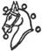
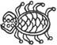
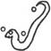
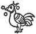
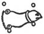
.. |image5| image:: Concise-Pali-Han-Maha.files/image012.jpg
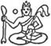
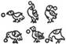

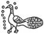
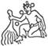
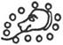
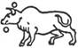
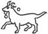
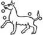

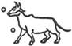
.. |image17| image:: Concise-Pali-Han-Maha.files/image036.jpg
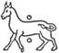
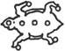

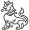
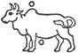

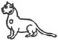
.. |image25| image:: Concise-Pali-Han-Maha.files/image052.jpg
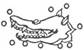
